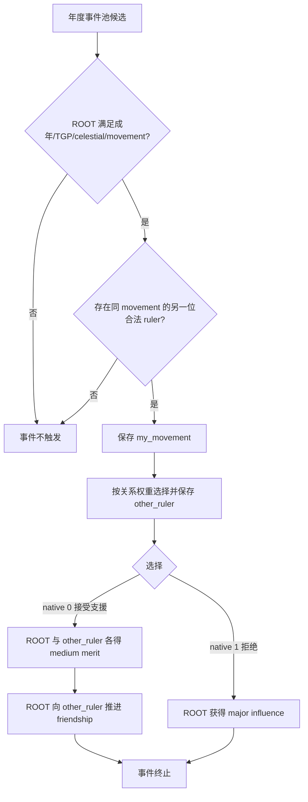

# CK3 1.19.0.6 `tgp_movement_events.0030` 思潮支援来信决策树

## 状态与边界

- [static-confirmed] 绑定 CK3 `1.19.0.6` 与 `ck3.exe` SHA-256
  `2D00FF3101EF70B566F2FCBAE292F09263199C80E9DC8F139B82D7D96F83DB86`。
- [paused live RED] R414 attempt 4 在 PID `202268` / connection generation `1` 的真实暂停帧命中 instance
  `1072`；ROOT 是玩家，saved scopes 严格为 `my_movement` 与非玩家 `other_ruler`，native `0/1` 均
  shown/enabled，尚未提交动作。
- [counter-policy static-ready, live action pending] 合同固定 authored `2` / native `1`。当前 RED 是生产恢复
  harness 缺少原版事件合同，尚未证明天朝二期产品失败；旧 instance advance 前不能标成新的 live primitive。

## 原版入口与人物选择

exact-build source 有两个 lexical caller candidate：TGP 专用 `tgp_china_yearly_events` 池给本事件 weight `100`，
旧的通用 `on_yearly_events` 镜像池给 weight `200`。词法命中本身不能证明 R414 实际来自哪个 caller，因此合同只依赖
事件自身语义，不把某个入口写成运行事实。

事件要求 ROOT 是可用成年人、拥有 TGP、采用 celestial government、有 dynastic-cycle participant group，并存在同一
movement 的另一位合法 ruler；事件自带五年 cooldown。`immediate` 保存 ROOT 的 participant group，然后在合法 ruler
中加权抽取 `other_ruler`：potential friend 权重最高，近亲、扩展亲属、friend/lover/disciple 也有加成。

## 原生 AI 与产品策略

两个 option 的 `ai_chance` base 都是 `100`。gregarious 或 generous 将 native `0` 权重乘二；deceitful、callous 或
arrogant 将 native `1` 权重乘二。这个树说明原生 AI 按性格偏好合作或拒绝，不替产品定义效用排序。

两个按钮都没有隐藏随机分支、后继事件或负面直接效果。native `0` 同时改动另一位 ruler 的 merit 并推进关系；native
`1` 只改变玩家 influence。R414 的目标是恢复 stage 9–11 验收，因此选择 native `1`，以保留另一人物的功绩与关系状态，
同时让玩家获得正向资源。该策略不声称 influence 在所有 campaign 中总比 merit 更优。

提交前必须重新绑定同一 instance、日期窗口、revision、玩家 ROOT、精确两个 saved scope、非玩家 `other_ruler`、两项
shown/enabled 原版选项。ACK 不算完成，必须观察旧 instance 消失或前进。

## 证据

- 原版事件：`Crusader Kings III/game/events/dlc/tgp/tgp_movement_events.txt:649-734`，SHA-256
  `D9B172FC6C9F81216BE580C1B65DA7720CAA6EF21F049AB316361E17D3710BC6`。
- TGP 年度池：`Crusader Kings III/game/common/on_action/dlc/tgp/tgp_china_yearly_on_actions.txt:1-49`，
  SHA-256 `4D6F5379E40304B56C5C1A914E8A0EE3998E8023174DC52F7E5072F7CFA40454`。
- R414 不可变 RED：
  `_runtime/p1-post-chaos-terminal-r414-20260911/live-artifacts/terminal-stages-red-attempt-04.json`，SHA-256
  `CC9AD4AE45201F1AA3693626975DAADBEE395F448A76BB9E3DCD303A350AB013`。
- 可移植合同、analysis 与 observation：
  `ck3_autonomous_player/src/xar_autoplayer/vanilla_events/records_tgp_movement.py`。
