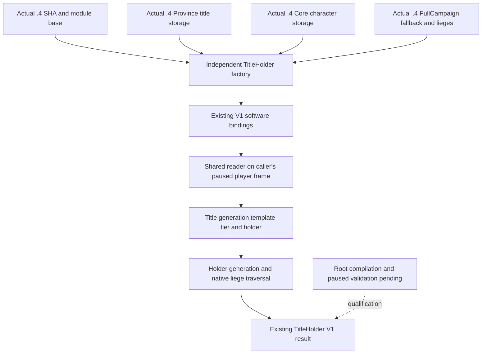

# CK3 1.20.0.4 title-holder bindings

The actual .4 title-holder factory restores the existing requested-title query's native inputs. It returns the existing `ck3_12003::TitleHolderBindingsV1` software DTO; the shared reader continues to publish the holder, native tier, immediate/top lieges, player ownership and membership in the player's own subrealm.

The implementation source base supplied by Root is `c8f19a6a067ef8dd56926b8bc11d14b164045974` in `C:/codex-ck3-background/title-steward-12004`. The admitted image is CK3 `1.20.0.4`, Steam build `25734779`, SHA-256 `98702F88A547CDE2EAF29A85F93B85F68EE4CF8148336A4F7AFAEB75319DD518`. The new factory compares the caller's SHA directly with `ck3_12004::kExecutableSha256` and constructs actual .4 bindings. It never calls an older image binder or supplies an older SHA to a binder.

## Source inputs

| Input | Actual .4 binding or field | Held source |
| --- | --- | --- |
| Character storage and full generation | Slot `0x5C67568`; storage slots `+0x20`, capacity `+0x2C`, stride `0x10`, object `+8`, character full ID `+0x18` | `ck3_12004.hpp` and `ck3_12004_abi_profile.cpp` |
| Character fallback | Slot `0x5C67570` | Adopted `ck3_12004_campaign.cpp` environment and `ck3_12004_prisoner_collection.cpp` |
| Requested title storage and generation | Slot `0x5D1DAF8`, full ID `+0x10` | `ck3_12004_province.hpp/.cpp`, shared `ResolveObjectiveTitle`, adopted FullCampaign collection |
| Title template and tier | Title `+0x48`, template tier `+0x64` | Adopted FullCampaign/Building field-use proof and prisoner title reader |
| Holder character ID | Title `+0x128` | Adopted actual .4 FullCampaign realm projection |
| Immediate and top lieges | `0x28BFC50` and `0x28BFD80` | Adopted actual .4 FullCampaign environment |
| Primary-title collection join | `0x289DA10`, complete 118-byte old/new normalized instruction and ordered-edge equivalence | Held prisoner `primary-title-map01/FAMILY-MAP.json`; this getter is not invoked by the requested-title reader |

The exact held primary-title receipt is `Z:/ck3_mod_rewrite_process_assets/g2-background-20261007/upstream-build-migration/prisoner/current4-collection/primary-title-map01/FAMILY-MAP.json`. It records 236 total bytes and two reads from its earlier mapper run; this child rereads only that JSON, with zero additional image reads. The full provider's evidence and remaining optional branches are recorded in [the actual .4 FullCampaign topic](ck3-1.20.0.4-full-campaign-root.md).

The existing `ck3_12003::ReadTitleHolderV1` has no old-build SHA or native-pointer admission comparison. Its paused player scope, title generation, character generation/type, holder liege traversal and final identity comparisons remain in the shared software reader. `ck3_12002::ResolveObjectiveTitle` reads the supplied title storage and generation; it invokes no image binder. No duplicate reader is needed. Native holder `-1` stays a legal absent holder; ID 0 remains a real full-generation ID. Sibling vassals with the same top liege do not automatically belong to a vassal player's own subrealm.



## Root integration recipe, unapplied

Only the two new source files and this topic are authored by this child. Root owns the shared adapter and CMake edits below.

In `native_bridge/src/ck3_12002_adapter.cpp`, include the new factory header next to the existing title-holder include:

```cpp
#include "xar_bridge/ck3_12004_title_holder.hpp"
```

Within the existing `else if (IsCk3_12004Descriptor(descriptor))` constructor branch, immediately after the local `image_base` declaration, populate the existing private member:

```cpp
title_holder_bindings_ = ck3_12004::BindTitleHolderImageV1(
    image_base, descriptor.executable_sha256);
```

The member remains `ck3_12003::TitleHolderBindingsV1 title_holder_bindings_{};`. In `read_title_holder_v1`, extend the current descriptor guard:

```cpp
if (!IsCk3_12003Descriptor(*descriptor_) &&
    !IsCk3_12004Descriptor(*descriptor_))
  return ReadTitleHolderV1Result::unavailable;
```

Keep the existing snapshot acquisition and `ck3_12003::ReadTitleHolderV1(title_holder_bindings_, scope, title_id, output)` call. In `native_bridge/src/ck3_12004_adapter.cpp`, add this existing capability to `Ck3_12004AdapterDescriptor`'s capability array alongside the other requested-ID queries:

```cpp
"game.command.query-title-holder-v1-N",
```

In `native_bridge/CMakeLists.txt`, add the new translation unit next to the existing runtime title-holder source:

```cmake
  src/ck3_12003_title_holder.cpp
  src/ck3_12004_title_holder.cpp
```

## Qualification boundary

This is source-ready only. This child did not configure, compile, run tests, import production modules, read/hash an executable, inspect a process, invoke SDK/native code, launch CK3 or commit source. Root owns combined integration, source review, native compilation and paused ordinary-Robert validation. Historical fixture/live results do not qualify these actual .4 bindings. The recipe above is unexecuted and does not itself advertise a new qualified capability.
