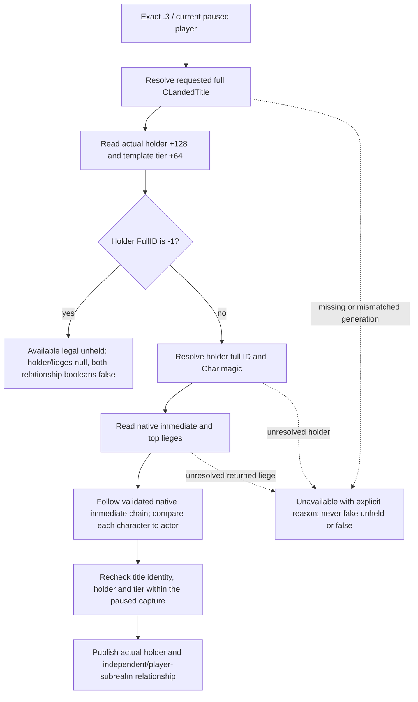

# CK3 1.20.0.3: current title holder observation

This research closes the current legal holder of one full-generation CLandedTitle, at any native tier. It fills the real gap left by an own-held partition: Robert target 2128 can be held by a vassal while 2115 is held directly. Current holder and holder subrealm membership are read independently from occupation, a hypothetical CB effect, or a submitted settlement ACK.

Frozen target: CK3 1.20.0.3 / Steam 25652598, EXE SHA-256 `94B55397ABB687A3DCD436805A5D885E6BE90FA6C693FEB44A9E3BBEEADE02A6`; source `6b0e6bdfa6b18396394ce8f12301e464825f1f46`. No new binary scan, native call or live evidence is claimed. The existing exact .3 core-comparison proves the reviewed province/campaign bindings unchanged. The permanent `.3` ABI reuse inventory separately pins the nonwar-realm evidence as an extra `PASS` record with exact-region indices; its own-subrealm chain semantics are an existing production input. The new occupation ABI already closes CLandedTitle holder +0x128, template +0x48 and tier +0x64. See the companion `title_holder12003_abi.json` for copied input SHA-256 pins and exact evidence paths.

`ResolveObjectiveTitle(provinces, fullTitleID)` uses the reviewed title storage and requires the object's complete ID at +0x10. The object gives the actual legal holder FullID at +0x128, not an army occupier or projected recipient. The template tier mapping is the existing campaign mapping: 1 barony, 2 county, 3 duchy, 4 kingdom, 5 empire, 6 hegemony. Only holder -1 is the engine's unheld sentinel; legal holder ID 0 is preserved.

The existing exact-build immediate-liege getter is `0x28BFC70` and the top-liege getter is `0x28BFDA0`, both `void *(void *)`. Campaign production already treats immediate null/fallback/self as independent and requires top-liege self in that case. Every nonempty returned character must resolve by full ID and character magic. Holder membership in the player's own subrealm follows the native immediate-liege chain; a shared top liege does not establish membership when the actor is itself a vassal. The existing chain budget is 1024.

The primitive uses default `query-title-holder-v1-N` / `game.command.query-title-holder-v1-N`, schema `xar.ck3.title-holder.v1`, and one requested TitleID. It does not enumerate only the player's own partition, assume a current active war, require a new flag/permit, queue commands or advance time. Whole-query unavailable keeps actor/date/requested title/frame identity but emits null for material fields; legal unheld is available with a null holder and false relationship booleans.

The reader and serializer are implemented. Focused validation is owned by the parallel fixture lane: production reader and serializer for Robert-owned 2115, vassal-held 2128, same-top-liege sibling outside actor subrealm, actual independent holder, legal unheld, missing title and generation mismatch. Implementation is still research until that focused result is recorded; actual paused publication remains live-pending. Full CB settlement consequences and recipient final response remain separate unfinished capabilities.

## Focused implementation validation

The native reader, default semantic worker/adapter, pipe grammar, serializer and typed MCP are implemented at source baseline `6b0e6bdfa6b18396394ce8f12301e464825f1f46`. New public tool: `ck3_query_title_holder_v1(title_id: int, expected_revision: int)`. It publishes `title_holder` / `xar.ck3.title-holder.v1` with actual title tier, holder FullID, current-player ownership, holder membership in the player's own subrealm and native immediate/top-liege FullIDs. It remains usable after the war ends and for a vassal-held title outside the player's held-title partition. No compile flag or runtime permit was added.

Strict `/W4 /WX /O2 /DNDEBUG` focused build is GREEN across 9 translation units. A fixture calls the actual production reader and serializer against synthetic native memory and getter seams: 62 assertions, 8 JSON packets covering player-held 2115, vassal-held 2128, foreign realm, same-top-liege sibling outside actor subrealm, legal unheld, missing title, holder generation mismatch and title generation mismatch. Fixture generation did not execute a CK3 EXE function or inspect the current game. The checked-in 8 JSON samples are byte-identical outputs of this producer, not manually authored DTO mirrors.

Three focused Python tests consume all 8 production packets through the real NativeHeadlessGameplayDriver/service and an offline official SDK client to the registered MCP. Fake snapshots deliberately contain no active wars and no own-held partition; scope accepts the nonowned target query and respects native unheld/unavailable fields. Identity-binding failures are separate negative cases. These are offline fixtures and provide no actual live holder value.

Readiness is **static-ready**; actual paused publication remains **live-pending**. Root should perform the supplied two current queries for 2128 and 2115 in the next combined DLL and retain full native/public revision, date, actor/episode and exact-build metadata. Query ACK never substitutes for these material fields, and title ownership remains separate from occupation. This lane added 0 game days, 0 game actions and 0 live SDK calls, made no shared source or Git mutation and did not build a full DLL.

Preserved attempts: native build-01 lacked a copied existing research header; build-02 lacked the CMake VERSION macro in the isolated compile harness. Both are HARNESS RED, followed by only the failed bridge TU recompilation; 8 already-GREEN objects were reused. Python python-focused-01 was import-only HARNESS RED because the sparse projection lacked baseline tools on its path; python-focused-02 used a read-only baseline tools import path and passed. These attempts are retained and do not describe a production reader failure.

Artifacts: `Z:/ck3_mod_rewrite_process_assets/g2-resume-20261003/war-settlement-typed-action/title-holder/ROOT-DELIVERY.json` indexes the frozen native ABI/tree, all three ownership packets, native build-03 receipt, 8 genuine packet hashes and Python/MCP receipt. Reports and ordinary commit/push adoption are coordinator-owned. Full CB outcome branches, recipient final response, payment/truce/fame/dread/legitimacy and unrelated prisoner effects remain separate capabilities.
