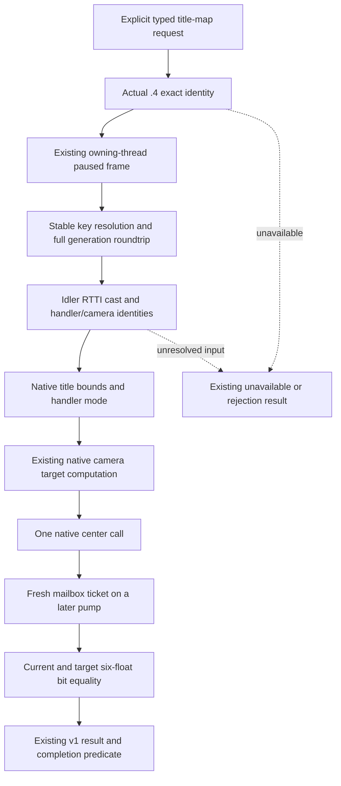

# Actual 1.20.0.4 title-map navigation migration

This work restores the existing explicit `ck3_center_map_on_landed_title_v1`
presentation tool and its `game.command.center-map-on-landed-title-v1` token.
The adopted .3 provider uses the reviewed .2 title/camera profile. This is a
native title resolution and camera command provider, not a legacy unsupported
fallback. Generic `ck3_execute_step` continues to reject this presentation step.

The actual .4 executable identity is the frozen 2026-10-07 image,
`98702F88A547CDE2EAF29A85F93B85F68EE4CF8148336A4F7AFAEB75319DD518`.
Source baseline is `c8f19a6a067ef8dd56926b8bc11d14b164045974`.
The held .3 ABI reuse and .2 provider algorithm are software reuse only; the
new production factory and exact-environment checks must use actual .4 RVAs.

The finite input plan reuses the qualified actual .4 title-province getter
`0x230F8E0` from the prisoner-domain ABI receipt. It maps only the required
named key resolver, bounds, mode, center, camera target writer/canonicalizer,
camera transition layout witness, idler/RTTI witness, runtime cast, and
handler/camera vtable identity witnesses. Resolver and camera call operands
provide the required global slots and table identities. Cached parsed PE and
runtime metadata is reused; no full executable scan, hash or PE reparse is
performed. Leaf implementation follows this source plan.

No autonomous planner integration or additional presentation feature is added.
This source owner runs no tests, builds, SDK imports or game. Production wiring,
compiled qualification and paused live qualification belong to the coordinator.

## Closed actual .4 inputs and implementation

The ten declared rows in `title-map-war-retention-review/title-map/map01` and
`map02` all have complete normalized instruction equality. The 4-byte degrees
literal has raw equality. Normalization removes only relative control and RIP
displacements; ordinary field operands and immediates remain equal.

| Input | Actual .4 coordinate and proof |
| --- | --- |
| Stable-key resolver; game/title storage/fallback | `A847A0`; `5C68C50`, `5D1DAF8`, `5D1DAE0`; complete 155-byte resolver with its own RIP operands |
| Title template/key/tier | Title `+48`, template `+18/+64`; exact 13-byte registry-build field witness plus reused title-province body |
| Title province | `230F8E0`; held prisoner-domain complete getter receipt |
| Bounds / handler mode / native center | `2311020`, `AF2530`, `AF3FB0`; complete 408/245/303-byte declared bodies |
| Camera target writer and bucket inputs | `AF3E30`; `5438C2C`, `5438C20`, `5438C38`, `5438C50`; complete 217-byte writer and center's own RIP loads |
| Idler / cast / RTTI / handler identity | `5C6A520`, `4260E74`, `5514438`/`5514460`, handler VT `44BA8A0`; reused actual .4 GenericGUI and Death/Faith receipts |
| Camera identity | VT `44BA698`; complete 84-byte destructor has the paired native vptr-producing RIP/store |
| Canonicalizer | `3846140`; candidate is the transition's two direct call operands, then complete 146-byte body equality |
| Camera readback layout | `710/728`, `744`, `75C/760`, `777`, `7B0/7BC`, `7C8/7D4`; equal target writer and 508-byte transition operands |
| Degrees-to-radians literal | `49F61B0`; writer/transition own RIP operands and exact 4-byte raw equality |

The named old/new executable capture cost is **3,040 bytes in 16 physical
reads**, with retained shared spans reused. No whole executable read or hash,
PE reparse, raw pdata read, build, test, game, camera dispatch, SDK or native
process attachment occurred. The independent actual .4 header, resolver,
camera progression and serializer retain the existing v1 algorithms and
rejection/status semantics. All three actual .4 TUs require the new
`ck3_12004_title_map.hpp`; shared DTOs remain version-neutral software types.

## Coordinator integration and readiness

Root adds the three `ck3_12004_title_map*.cpp` TUs and includes the header,
advertises the same token on the actual .4 descriptor, admits `title_map` in
the actual .4 typed matcher, selects the actual .4 factories/advance operation
in the typed executor, and registers that existing executor in actual .4
`permitted_executor_thirdenary` (slot 13). Slot 12 is reserved for the separate
route migration. The result branch selects the actual .4 serializer, which
emits the actual .4 version, SHA and `ck3-1.20.0.4-native-title-map-navigation-v1`
backend. Frame capture, one callback per pump, ticket tracking, terminal
predicate, native result shape and generic-step rejection remain unchanged.

The Python title-map normalizer already calls `require_exact_native_backend`
and the shared identity table already admits the frozen .4 tuple; no Python
provider or schema change is required. Root still owns the single compile
and registered/live entrance. Current status is **research; finite source
closure and implementation authored**. `compiled FIRST`, `registered FIRST`
and paused live are **NOT_RUN**. This package claims no new fixture-live,
production-live primitive, camera action or gameplay loop.

## R61 real `state_changed` remains RED

Root's R61 attempt, source `23c3c4bc7fdf261f46174d35db12732808523463`
and runtime entry12, called the registered tool for `c_salerno` at public
revision3. It returned `native gameplay step failed: state_changed` in
`managed-full-h9613-finaltools10/operator/gameplay-responses/012-final-title-center.json`.
Root's subsequent small scene binding remained `native:2`, public3, native2,
date53288256, paused and map-ready. This is a failed real presentation attempt;
it is not GREEN and does not qualify the migrated primitive.

Finite source diagnosis reused the actual integrated source only. Hybrid Driver
already maps public revision to its native backend revision, and the typed
parser binds that native revision to the mailbox envelope. The actual .4
matcher, slot13 executor, actual .4 factories and serializer are wired. The
short error does not distinguish the preflight full Snapshot comparison from
the individual resolver/camera `state_changed` branches. The old error shape
therefore cannot establish the cause. No speculative camera/profile or state
comparison repair is made.

The actual .4 access now accepts an optional fixed failure-stage label pointer.
The resolver and camera fill it only at the already failing branch. The
existing conditions, native reads, owning-thread calls, one dispatch and
later-pump settlement rules are preserved. The stage identifies start/end
frame capture versus revision/frame mismatch, title fallback read, frozen
title binding/anchor, handler/camera identity, frozen plan, and the later-pump
transient, target, zoom or frame comparison. It does not expose pointers or
add an executable read. Root's finite central recipe attaches this label and
the existing cached revision/command fields to `typed_query_failure_v1`, which
the existing Driver already includes in its error text. Preflight gets a
separate explicit stage before any leaf call.

All three `.4` title-map TUs consume the updated header. Root must rebuild all
three after integrating this header change. No build, test, EXE read, SDK or
game action was performed for this diagnosis. Cause and the next actual
diagnostic attempt remain pending; the R61 failure is retained.
