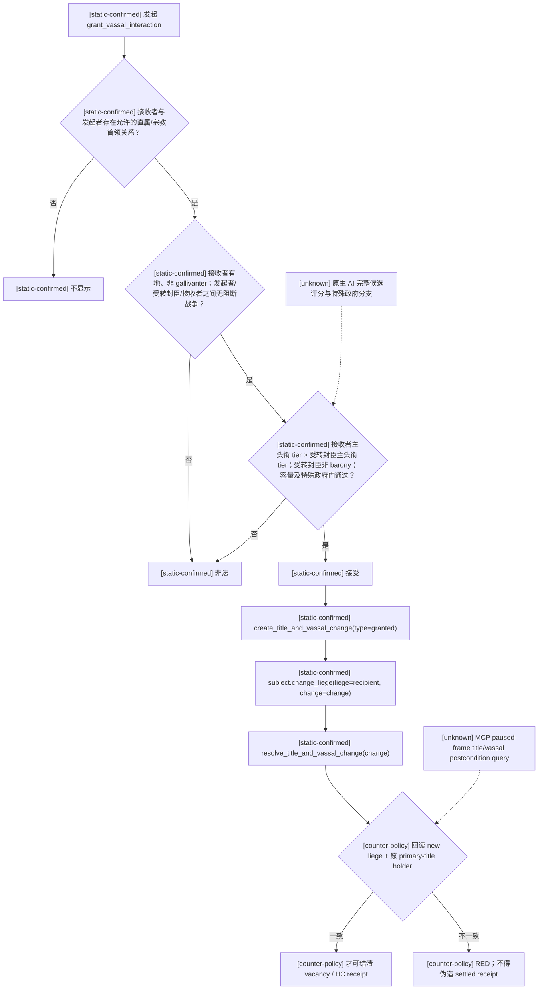

# CK3 1.19.0.6：封臣转封原生前置与结算树

## 证据边界

- 状态：`static-confirmed`；尚无本专题 paused live artifact。
- 游戏版本：CK3 `1.19.0.6`。
- EXE SHA-256：`2D00FF3101EF70B566F2FCBAE292F09263199C80E9DC8F139B82D7D96F83DB86`。
- 原版数据：`game/common/character_interactions/00_vassal_interactions.txt`，文件 SHA-256
  `1249CAC40138D48210A07245746C4A6683C5F58F3141C04A20DB2C00B6375BF8`；本专题读取
  `grant_vassal_interaction` 的显示门、合法性门、候选门与 `on_accept`（约第 3–239 行）。
- 本文只证明原版静态前置和原子结算序列。AI 对候选人的完整评分、行政制/日本制特殊分支的全部运行结果、
  以及 MCP paused-frame 转封后置查询仍为 `unknown`。

## 原版树

## 对天朝 361 内部流动的约束

1. #312 不自行创造人物、头衔或 HC。它只能认领 Career/HC 先前从真实角色、真实 `primary_title`、
   真实接收领主与守恒 HC reserve 冻结出的 matured vacancy；无 vacancy、接收者失效、战争或 HC 不足时，
   只写 typed RED/制度债，世界零变更。
2. #314 接受与 #315 试岗只推进同一 vacancy 的受评人确认阶段，不改封臣关系；拒绝/退出必须回收同一 HC reserve。
3. #319 放行才允许执行上面的三步原子结算，并立即回读 `subject.liege == receiver`、
   `subject.primary_title == frozen_title`、`frozen_title.holder == subject`。只有三项都成立才把 HC 从 reserved 转为 settled。
4. CL 与 PP 不能同时消费 vacancy：Career/HC owner 以 consumer kind 和冻结 ticket 隔离；任一路认领后，另一条只能得到 stale/duplicate RED。
5. 当前 CK3 脚本可以直接验证本包所需的角色、头衔、tier、战争、容量与后置关系，因此不以伪造变量代替。
   正式 paused live 验收仍缺 MCP 的角色 liege/primary-title/holder 一致性查询；该缺口只冻结为 live-evidence 依赖，
   本包不修改 native provider，也不把静态结果冒充 `fixture-live` 或 `production-live`。
