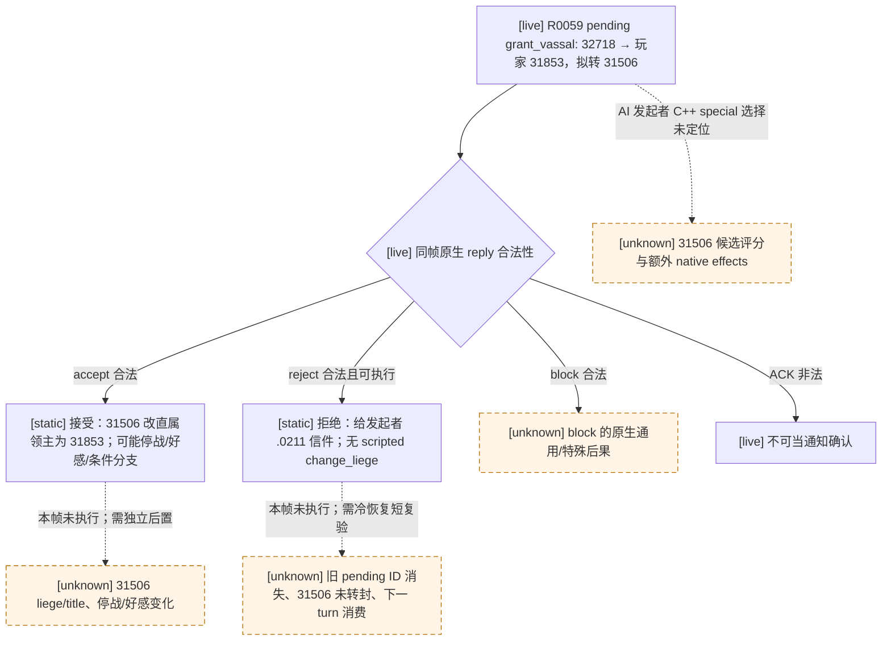
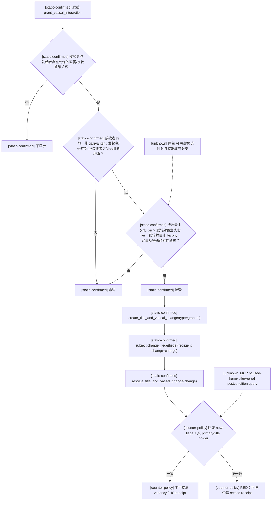

# CK3 1.19.0.6：封臣转封原生前置与结算树

## 证据边界

- 状态：原版效果为 `static-confirmed`；R0059 已有同一 ordinary campaign 的只读
  paused pending frame，但**未回复**，转封/拒绝的独立后置和下一 turn 消费仍未验收。
- 游戏版本：CK3 `1.19.0.6`。
- EXE SHA-256：`2D00FF3101EF70B566F2FCBAE292F09263199C80E9DC8F139B82D7D96F83DB86`。
- 原版数据：实际运行安装目录 `Z:\SteamLibrary\steamapps\common\Crusader Kings III` 中的
  `game/common/character_interactions/00_vassal_interactions.txt`，文件 SHA-256
  `1249CAC40138D48210A07245746C4A6683C5F58F3141C04A20DB2C00B6375BF8`；本专题读取
  `grant_vassal_interaction` 的完整定义第 3–337 行。拒绝回信定义位于
  `game/events/interaction_events/character_interaction_events.txt:1530-1546`，文件 SHA-256
  `D238E0A3442F41C35AF35157D47A754CB200B72AB2A0184BAEFC86E63347A150`。
- PRV-004 的 `operator-manifest.fresh.json` 将 R0059 的 `game_dir` 指向上述 Steam 安装，
  `source_commit=fadc2e5b2b02ae1f16454095a91968787663c2cb`，并记录同一 EXE SHA；
  本轮又直接哈希了该目录的 EXE 和两份原版脚本。正式报告自身的
  `identity.ck3_executable_sha256=null`，因此不能说**报告字段**独立证明了 EXE 哈希。
- 本文只证明原版静态前置和原子结算序列。AI 对候选人的完整评分、行政制/日本制特殊分支的全部运行结果、
  以及 MCP paused-frame 转封后置查询仍为 `unknown`。

## R0059 普通封建 campaign：收到转封提案

- [production read-only paused frame；reply RED] PRV-004 `runs/stop-R0059/formal-report.txt`
  SHA-256 `F4C0D427BFFC385F445A15ED35A6EC0C3602EF9CD92AA1F70E9291E44AE0DF54`。
  `native_auto_run` 第 18 turn、`date_raw=53285904`、同一 `native:28` paused frame
  （public revision 29 / native revision 28）先查询后阻塞；pending full instance
  `1744830474`、canonical key `grant_vassal_interaction`、key hash `1006648858`。
  发起者 `32718`，玩家接收者 `31853`，`secondary_actor=31506` 是拟转封臣；
  `secondary_recipient` 和中间人均为 `-1`。接收者本地普通回复通道，剩余 53/60 天。
  原生 validator 判 `accept/reject/block` 均合法、`acknowledge` 非法；当前命令面上
  `reject` 可执行。报告没有提交回复，RED 是
  `interaction_definition_not_explicitly_classified_nonwar_nonreligious`，并非原版拒绝违法。
- [static-confirmed] 定义第 3–9 行属于 vassal 类、`special_interaction=grant_vassal_interaction`；
  第 185–203 行仅在**接收者为 AI**时 `auto_accept`。本帧玩家是接收者，故不能用该
  AI auto-accept 分支代替玩家决定。定义末尾说明 AI 发起逻辑 entirely through code；
  原版数据没有该 key 的 authored `ai_accept` / `ai_will_do`。原生 AI 如何选中
  `secondary_actor=31506`、C++ special 分支的额外条件与效果仍为 `unknown`。
- [static-confirmed + live query] 只读调用链是 full pending ID → 内嵌
  `CCharacterInteractionContext` 的 definition/roles → canonical key 与同帧 native
  reply legality；通用提交侧以 `CReplyCharacterInteractionCommand` 的
  `+0x20` full pending ID、`+0x24` reply enum 进入 RVA `0x26B3540` validator
  （详见 [接收方 reply 树](events-and-interactions.md#接收方中间人与-reply-树)）。
  R0059 仅执行查询，未走命令和回调；`special_interaction` 的 C++ 内部调用边
  尚未逐边定位，不能把脚本效果清单当成完整 native side-effect 清单。
- [static-confirmed] **接受**：定义第 205–249 行先在发起者本身是接收者封臣时，
  给发起者与原封臣 `31506` 双向 3650 天停战；随后
  `create_title_and_vassal_change(type=granted, add_claim_on_loss=no)` →
  `secondary_actor.change_liege(liege=recipient)` → `resolve_title_and_vassal_change`；
  最后接收者对发起者增加 `granted_vassal` 好感。第 251–318 行另有 clan unity、
  struggle 和 nomadic 条件分支，不能外推成普通封建必然效果。
- [static-confirmed] **拒绝**：定义第 321–334 行给发起者触发
  `char_interaction.0211`，并仅在相应 clan 条件下走团结损失。该事件
  第 1530–1546 行是无选项效果的拒绝信件；脚本拒绝路径没有
  `change_liege`。`block` 虽为本帧原生合法，却没有在本定义中 authored
  `on_blocked_effect`；其原生通用或特殊后果尚未闭合，不能据此选 block。

当前 B0 的最小 counter-policy 候选是专用 `grant-vassal-reject-only-v1`：
只在这个 exact key、玩家本地接收者、拟转封臣 role 完整、同帧原生 reject
合法且命令可达时提交一次 reject；**不**加入会在某些合法性组合下
`unique-accept` 的通用 ordinary allowlist。它不是泛化点击、自动接受、
语义最优或原生 AI 等价。
`special_war_binding_not_applicable` 与 `special_data_present=false` 只排除该帧已知
war-special payload，不自动证明任意 definition 普通安全。现有 query 已有 stable key、
五 roles、deadline、四路原生 reply legality、同帧 revision、命令可达性；窄拒绝
不必为了填充 `recipient_ai_acceptance_score` 等无关空字段而阻塞。接受/效用判断
还缺最小只读的 `secondary_actor` 当前直属领主、主头衔/holder、接收者直属封臣容量
与同帧受益/冲突上下文；转封后置需独立回读 `31506.liege == 31853` 及头衔
归属，停战/好感按实际适用条件核验。当前 `structured_exchanges` 与
`structured_effect_preview` 均为 unavailable，不能把其 `null` 当零代价或无副作用。
任何拒绝复验还需旧 full ID 消失、下一 turn 不重复提交、paired checkpoint 与
cold restore；在这些实机证据出现前本门保持 RED。

## 原版树

## 对天朝 361 内部流动的约束

1. #312 不自行创造人物、头衔或 HC。它只能认领 Career/HC 先前从真实角色、真实 `primary_title`、
   真实接收领主与守恒 HC reserve 冻结出的 matured vacancy；无 vacancy、接收者失效、战争或 HC 不足时，
   只写 typed RED/制度债，世界零变更。
2. #314 接受与 #315 试岗只推进同一 vacancy 的受评人确认阶段，不改封臣关系；拒绝/退出必须回收同一 HC reserve。
3. #319 放行才允许执行上面的三步原子结算，并立即回读 `subject.liege == receiver`、
   `subject.primary_title == frozen_title`、`frozen_title.holder == subject`。只有三项都成立才把 HC 从 reserved 转为 settled。
4. CL 与 PP 不能同时消费 vacancy：Career/HC owner 以 consumer kind 和冻结 ticket 隔离；任一路认领后，另一条只能得到 stale/duplicate RED。
5. 当前 CK3 脚本可以直接验证本包所需的角色、头衔、tier、战争、容量与后置关系，因此不以伪造变量代替。
   正式 paused live 验收仍缺 MCP 的角色 liege/primary-title/holder 一致性查询；该缺口只冻结为 live-evidence 依赖，
   本包不修改 native provider，也不把静态结果冒充 `fixture-live` 或 `production-live`。
