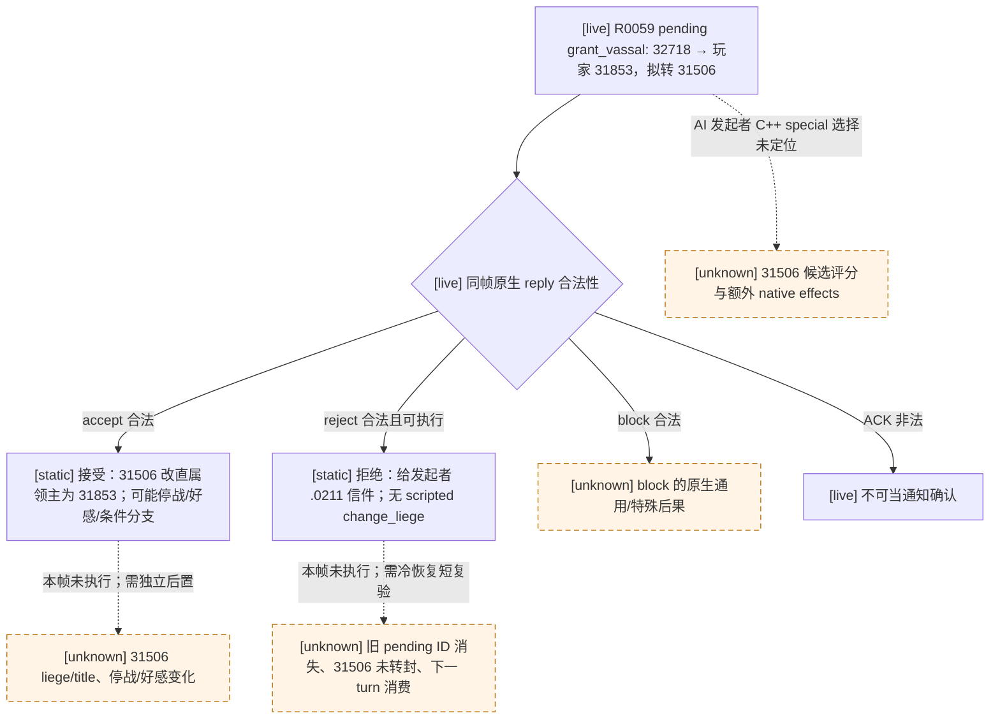
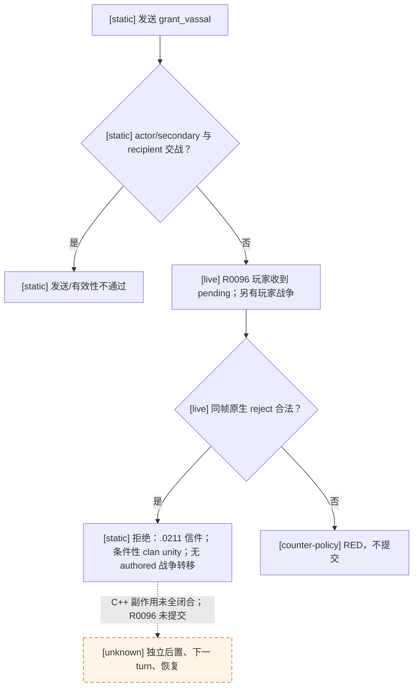
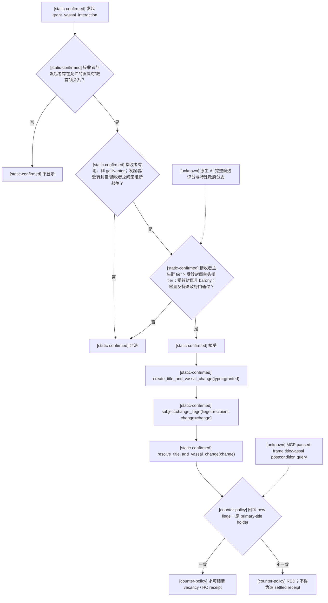
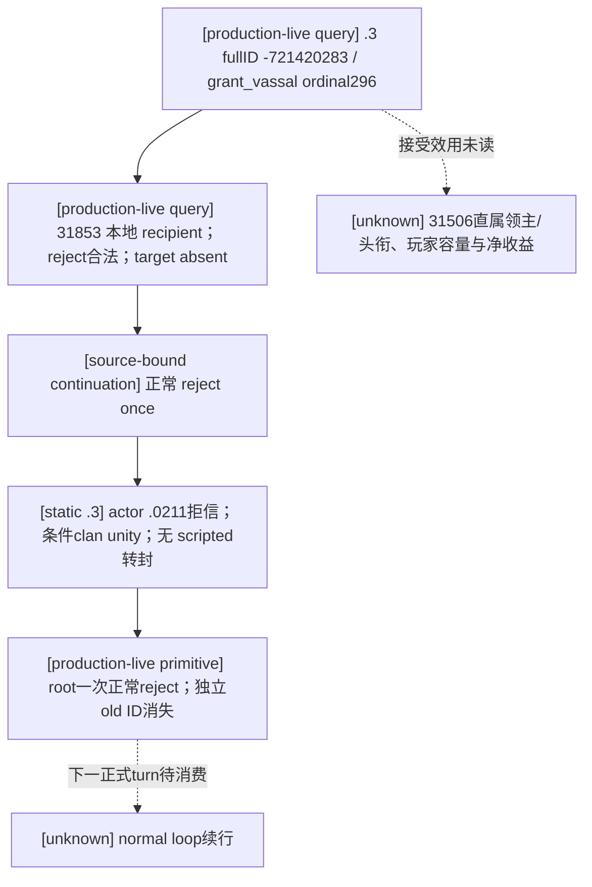

# CK3 1.19.0.6：封臣转封原生前置与结算树

## 证据边界

- 状态：原版效果为 `static-confirmed`；R0059、R0096 有 ordinary campaign 的只读
  paused pending frame，但**均未回复**，转封/拒绝的独立后置和下一 turn 消费仍未验收。
- 游戏版本：CK3 `1.19.0.6`。
- EXE SHA-256：`2D00FF3101EF70B566F2FCBAE292F09263199C80E9DC8F139B82D7D96F83DB86`。
- 原版数据：实际运行安装目录 `Z:\SteamLibrary\steamapps\common\Crusader Kings III` 中的
  `game/common/character_interactions/00_vassal_interactions.txt`，文件 SHA-256
  `1249CAC40138D48210A07245746C4A6683C5F58F3141C04A20DB2C00B6375BF8`；本专题读取
  `grant_vassal_interaction` 的完整定义第 3–337 行。拒绝回信定义位于
  `game/events/interaction_events/character_interaction_events.txt:1530-1546`，文件 SHA-256
  `D238E0A3442F41C35AF35157D47A754CB200B72AB2A0184BAEFC86E63347A150`。
- PRV-004 的 `operator-manifest.fresh.json` 将 R0059 的 `game_dir` 指向上述 Steam 安装，
  `source_commit=fadc2e5b2b02ae1f16454095a91968787663c2cb`，并记录同一 EXE SHA；
  本轮又直接哈希了该目录的 EXE 和两份原版脚本。正式报告自身的
  `identity.ck3_executable_sha256=null`，因此不能说**报告字段**独立证明了 EXE 哈希。
- 本文只证明原版静态前置和原子结算序列。AI 对候选人的完整评分、行政制/日本制特殊分支的全部运行结果、
  以及 MCP paused-frame 转封后置查询仍为 `unknown`。

## R0059 普通封建 campaign：收到转封提案

- [production read-only paused frame；reply RED] PRV-004 `runs/stop-R0059/formal-report.txt`
  SHA-256 `F4C0D427BFFC385F445A15ED35A6EC0C3602EF9CD92AA1F70E9291E44AE0DF54`。
  `native_auto_run` 第 18 turn、`date_raw=53285904`、同一 `native:28` paused frame
  （public revision 29 / native revision 28）先查询后阻塞；pending full instance
  `1744830474`、canonical key `grant_vassal_interaction`、key hash `1006648858`。
  发起者 `32718`，玩家接收者 `31853`，`secondary_actor=31506` 是拟转封臣；
  `secondary_recipient` 和中间人均为 `-1`。接收者本地普通回复通道，剩余 53/60 天。
  原生 validator 判 `accept/reject/block` 均合法、`acknowledge` 非法；当前命令面上
  `reject` 可执行。报告没有提交回复，RED 是
  `interaction_definition_not_explicitly_classified_nonwar_nonreligious`，并非原版拒绝违法。
- [static-confirmed] 定义第 3–9 行属于 vassal 类、`special_interaction=grant_vassal_interaction`；
  第 185–203 行仅在**接收者为 AI**时 `auto_accept`。本帧玩家是接收者，故不能用该
  AI auto-accept 分支代替玩家决定。定义末尾说明 AI 发起逻辑 entirely through code；
  原版数据没有该 key 的 authored `ai_accept` / `ai_will_do`。原生 AI 如何选中
  `secondary_actor=31506`、C++ special 分支的额外条件与效果仍为 `unknown`。
- [static-confirmed + live query] 只读调用链是 full pending ID → 内嵌
  `CCharacterInteractionContext` 的 definition/roles → canonical key 与同帧 native
  reply legality；通用提交侧以 `CReplyCharacterInteractionCommand` 的
  `+0x20` full pending ID、`+0x24` reply enum 进入 RVA `0x26B3540` validator
  （详见 [接收方 reply 树](events-and-interactions.md#接收方中间人与-reply-树)）。
  R0059 仅执行查询，未走命令和回调；`special_interaction` 的 C++ 内部调用边
  尚未逐边定位，不能把脚本效果清单当成完整 native side-effect 清单。
- [static-confirmed] **接受**：定义第 205–249 行先在发起者本身是接收者封臣时，
  给发起者与原封臣 `31506` 双向 3650 天停战；随后
  `create_title_and_vassal_change(type=granted, add_claim_on_loss=no)` →
  `secondary_actor.change_liege(liege=recipient)` → `resolve_title_and_vassal_change`；
  最后接收者对发起者增加 `granted_vassal` 好感。第 251–318 行另有 clan unity、
  struggle 和 nomadic 条件分支，不能外推成普通封建必然效果。
- [static-confirmed] **拒绝**：定义第 321–334 行给发起者触发
  `char_interaction.0211`，并仅在相应 clan 条件下走团结损失。该事件
  第 1530–1546 行是无选项效果的拒绝信件；脚本拒绝路径没有
  `change_liege`。`block` 虽为本帧原生合法，却没有在本定义中 authored
  `on_blocked_effect`；其原生通用或特殊后果尚未闭合，不能据此选 block。

```mermaid
flowchart TD
    P["[live] R0059 pending grant_vassal: 32718 → 玩家 31853，拟转 31506"] --> L{"[live] 同帧原生 reply 合法性"}
    L -->|accept 合法| A["[static] 接受：31506 改直属领主为 31853；可能停战/好感/条件分支"]
    L -->|reject 合法且可执行| R["[static] 拒绝：给发起者 .0211 信件；无 scripted change_liege"]
    L -->|block 合法| B["[unknown] block 的原生通用/特殊后果"]
    L -->|ACK 非法| X["[live] 不可当通知确认"]
    A -. "本帧未执行；需独立后置" .-> AV["[unknown] 31506 liege/title、停战/好感变化"]
    R -. "本帧未执行；需冷恢复短复验" .-> RV["[unknown] 旧 pending ID 消失、31506 未转封、下一 turn 消费"]
    P -. "AI 发起者 C++ special 选择未定位" .-> AI["[unknown] 31506 候选评分与额外 native effects"]
    classDef unknown stroke-dasharray: 6 4,fill:#fff4e5,stroke:#b36b00;
    class B,AV,RV,AI unknown;
```

当前 B0 的最小 counter-policy 候选是专用 `grant-vassal-reject-only-v1`：
只在这个 exact key、玩家本地接收者、拟转封臣 role 完整、同帧原生 reject
合法且命令可达时提交一次 reject；**不**加入会在某些合法性组合下
`unique-accept` 的通用 ordinary allowlist。它不是泛化点击、自动接受、
语义最优或原生 AI 等价。
`special_war_binding_not_applicable` 与 `special_data_present=false` 只排除该帧已知
war-special payload，不自动证明任意 definition 普通安全。现有 query 已有 stable key、
五 roles、deadline、四路原生 reply legality、同帧 revision、命令可达性；窄拒绝
不必为了填充 `recipient_ai_acceptance_score` 等无关空字段而阻塞。接受/效用判断
还缺最小只读的 `secondary_actor` 当前直属领主、主头衔/holder、接收者直属封臣容量
与同帧受益/冲突上下文；转封后置需独立回读 `31506.liege == 31853` 及头衔
归属，停战/好感按实际适用条件核验。当前 `structured_exchanges` 与
`structured_effect_preview` 均为 unavailable，不能把其 `null` 当零代价或无副作用。
任何拒绝复验还需旧 full ID 消失、下一 turn 不重复提交、paired checkpoint 与
cold restore；在这些实机证据出现前本门保持 RED。

## R0096：有玩家战争时的拒绝边界

- [production paused frame；reply RED] `Z:\ck3_mod_rewrite\.task-tmp\RUN-001\century-r0096-preflight\R0096-formal\formal-report.txt`
  SHA-256 `429C8E1E03720FCD7516CDC2A98A5A09861B24EC9BDC974A972673525123AC56`，
  `native:339` / public revision `340`、`date_raw=53367120`、turn 164。pending
  `-50331641` 是发起者 `38609` → 玩家接收者 `36403`、拟转封臣 `31506` 的直接、
  零发送选项 `grant_vassal_interaction`；同帧原生 `reject` 合法且命令可达，
  剩余 60/60 天，`special_war_binding_not_applicable`。玩家同时是战争
  `301989950` 的主防守方，主要对手为 `34676`、相对战争分数 `-28`。
- [exact-build static] 上述 SHA 固定的 `00_vassal_interactions.txt:49-61` 在**发送/有效性**
  路径检查发起者及拟转封臣是否与接收者交战；这不等于“接收者不得有任何战争”。
  `on_accept` 才有转封和条件性停战；`on_decline`（第 321–334 行）只写给发起者的
  `char_interaction.0211` 信件与条件性 clan unity 损失，没有 authored 战争转移。
  `.0211`（上述事件文件第 1530–1546 行）也无选项效果。
- [边界] R0096 报告没有发起者/拟转封臣的完整参战关系；仅因二者 ID 不等于
  **主要**对手，不能认定战争互不相关。`special_war_binding_not_applicable` 只排除
  该 pending 的已知 war-special payload，不能证明 C++ 通用/特殊回复的全部副作用。
  但精确、同帧原生合法的 **reject-only** 策略不根据参战关系改变选择；当前 Python
  `grant_vassal_active_war_or_war_scope_unknown` 是额外策略门，不是原版判拒绝违法。
  不得据此开放 accept/block。R0096 已回收进程，最新配对存档早于该 pending 帧，
  无法在原帧追加新查询。拒绝后需在新 paused frame 核验旧 pending ID 消失、
  战争及封臣关系的独立后置、下一 turn 消费和 cold restore；此前 B0 保持 RED。

```mermaid
flowchart TD
    S["[static] 发送 grant_vassal"] --> W{"[static] actor/secondary 与 recipient 交战？"}
    W -->|是| N["[static] 发送/有效性不通过"]
    W -->|否| P["[live] R0096 玩家收到 pending；另有玩家战争"]
    P --> L{"[live] 同帧原生 reject 合法？"}
    L -->|是| R["[static] 拒绝：.0211 信件；条件性 clan unity；无 authored 战争转移"]
    L -->|否| B["[counter-policy] RED，不提交"]
    R -. "C++ 副作用未全闭合；R0096 未提交" .-> V["[unknown] 独立后置、下一 turn、恢复"]
    classDef unknown stroke-dasharray: 6 4,fill:#fff4e5,stroke:#b36b00;
    class V unknown;
```

## 原版树

```mermaid
flowchart TD
    S["[static-confirmed] 发起 grant_vassal_interaction"] --> R{"[static-confirmed] 接收者与发起者存在允许的直属/宗教首领关系？"}
    R -->|否| X["[static-confirmed] 不显示"]
    R -->|是| L{"[static-confirmed] 接收者有地、非 gallivanter；发起者/受转封臣/接收者之间无阻断战争？"}
    L -->|否| Y["[static-confirmed] 非法"]
    L -->|是| T{"[static-confirmed] 接收者主头衔 tier > 受转封臣主头衔 tier；受转封臣非 barony；容量及特殊政府门通过？"}
    T -->|否| Y
    T -->|是| A["[static-confirmed] 接受"]
    A --> C["[static-confirmed] create_title_and_vassal_change(type=granted)"]
    C --> G["[static-confirmed] subject.change_liege(liege=recipient, change=change)"]
    G --> F["[static-confirmed] resolve_title_and_vassal_change(change)"]
    F --> P{"[counter-policy] 回读 new liege + 原 primary-title holder"}
    P -->|一致| OK["[counter-policy] 才可结清 vacancy / HC receipt"]
    P -->|不一致| RED["[counter-policy] RED；不得伪造 settled receipt"]
    AI["[unknown] 原生 AI 完整候选评分与特殊政府分支"] -.-> T
    MCP["[unknown] MCP paused-frame title/vassal postcondition query"] -.-> P
```

## 2026-10-02：1.20.0.3 实际收到转封提案与拒绝续行

本段是新版增量，保留上文 1.19.0.6 的研究和未回复 RED。当前 exact build 为 CK3 `1.20.0.3 (Crozier)` / Steam `25652598`，EXE SHA-256 `94B55397ABB687A3DCD436805A5D885E6BE90FA6C693FEB44A9E3BBEEADE02A6`。根执行者的 `murchad-v14-cold-material-01/016-ck3_query_pending_character_interaction_context_v1.json` 真实读出 `grant_vassal_interaction`、hash `1006648858`、ordinal `296`，发起者 `32718` → 玩家接收者 `31853`，拟转封臣 `31506`。原负数完整 ID `-721420283` 在 V13 被读取器错误的 `<=0` 判断拒绝；V14 修复后可读，相关 [pending 原生专题](pending-character-interaction-context-1.20.0.2.md#v14负完整-id-的生产查询恢复) 区分源码与实际查询认证。

当前 stock `common/character_interactions/00_vassal_interactions.txt` SHA-256 `B0F81CF740B6DBF42952D9A08703BA75E23D6918DD44F4D8E9999F11695B3A20`：`193–200` 仅对 AI recipient 自动接受；`245–256` 在接受时原子转封；`421–434` 的拒绝分支给 `puppet_or_actor` 触发 `char_interaction.0211`，并调用条件性 clan unity loss，没有 authored `change_liege`。当前 `events/interaction_events/character_interaction_events.txt` SHA-256 `46D0E436BBB9694E60E46C0C1C5EBC3AE1C14AFA041A8B8CD9548BD5C3836C69`，`1594–1609` 的 `.0211` 是唯一空效果选项的拒绝信件。只读 stock 摘录和 pins 保存在 `artifacts/g2-maintainer-2026-10-02/resume-12003/m2-events/actual-v14-pending-interaction-query/`；没有扩展发起者 AI 候选评分或特殊制度研究。

本帧为 direct recipient 普通回复，target 合法 absent、零发送选项、secondary recipient/intermediary 均 `-1`；同帧原生 reject 合法，剩余 `57/60` 天，actor 已发送的十项费用均为零。structured exchange/effect preview 仍 unavailable，不把它们解释为无副作用。既有 `grant-vassal-reject-only-v1` 已有 R0084 的普通生产先例：typed 拒绝负完整 ID `-1023410174`，独立 pending 变 null，下一 turn 消费；冻结依据为 `Z:/ck3_mod_rewrite_process_assets/g2-first-1066-r0084-focused-noevent-green-20260922/evidence-manifest.json`，不能把该历史结果当本次 `.3` 动作。

本次最小正常续行是 root 通过现有 `ck3_reply_pending_character_interaction(accept=false, interaction_instance_id=-721420283, expected_revision=当前公共 revision)` 提交一次拒绝，再独立读同角色/日期/paused 与旧 full ID 消失，下一正常 turn 消费。最后 closed frame 的 public revision 是 `2`。当前 strategy 的历史政策仍固定 ordinal `277`，而实际 `.3` ordinal 为 `296`；自动规则复用需要版本兼容输入，这项读取评估没有改 strategy 或放开 accept/block。generic `interaction_semantic_decision_ready=false` 不阻止已经由当前 stock 和实际 native legality 支持的窄拒绝；接受效用与转封材料仍沿用上文未闭合边界。

```mermaid
flowchart TD
    Q["[production-live query] .3 fullID -721420283 / grant_vassal ordinal296"] --> L["[production-live query] 31853 本地 recipient；reject合法；target absent"]
    L --> R["[source-bound continuation] 正常 reject once"]
    R --> S["[static .3] actor .0211拒信；条件clan unity；无 scripted转封"]
    S --> V["[production-live primitive] root一次正常reject；独立old ID消失"]
    V -. "下一正式turn待消费" .-> N["[unknown] normal loop续行"]
    Q -. "接受效用未读" .-> A["[unknown] 31506直属领主/头衔、玩家容量与净收益"]
```

本次查询与拒绝达到 **production-live primitive**。根执行者的 `murchad-v14-grant-vassal-reply-01` 只提交一次现有 MCP typed reject；`004` 的 submitted 不单独证明完成，独立 `003→005` snapshot 实际显示原 full ID `-721420283` → null、public revision `2→3`，同 PID `88444`、角色 `31853`、episode、date raw `53329800`、paused。gold raw `52818557`、prestige raw `115891020` 以及 piety、war list 未变。一次 closed assessment 18/18 GREEN，artifact 为 `artifacts/g2-maintainer-2026-10-02/resume-12003/m2-events/actual-v14-grant-vassal-continuation/closed-packet-assessment.json`。正常 h2079 checkpoint size `112139354`、SHA-256 `F0F296468A12886892FDAC2D828466D2F8527163D36DBC4413F376569D409039`。

本帧没有独立读取 `31506` 的 liege/title 或条件性 clan unity/opinion 后置，不能从 submitted/pending 消失推断全部副作用或物质收益。下一正常 turn 消费仍待 root；M2 材料 credit 为零。V13 原 RED 和 h2072 存档留存。

本次真实 recurrence 同时证明正式策略的版本兼容缺口：现有 exact definition 校验仍要求旧 ordinal `277`。独立 scratch 最小修复在同一 `grant-vassal-reject-only-v1` 内按 exact `.3` context build/version/EXE SHA 选 ordinal `296` 与上述 current stock pins，保留旧 `277` 输入、回复选择、角色/合法性/期限等现有逻辑，不新增策略或门禁。现有 `test_gameplay_bridge.py` 单个新增方法首次 **GREEN**：生产 `service.plan_turn` / ordinary classifier 使用实际 .3 ID/roles/date/ordinal，选合法 reject，再经 `GameplayBridgeService` 显式 ID typed reply 调用验证模拟 pending 清空；同方法保留旧 `277` planner 子项。该结果为 **static-ready**，冻结于同包 `python-compatibility/focused-checks.json`，没有把合成回复冒称本次 live。源码仅为两文件 scratch 小 patch，由 root 合并同文件的议会独立 hunk 后提交与冻结。

## 对天朝 361 内部流动的约束

1. #312 不自行创造人物、头衔或 HC。它只能认领 Career/HC 先前从真实角色、真实 `primary_title`、
   真实接收领主与守恒 HC reserve 冻结出的 matured vacancy；无 vacancy、接收者失效、战争或 HC 不足时，
   只写 typed RED/制度债，世界零变更。
2. #314 接受与 #315 试岗只推进同一 vacancy 的受评人确认阶段，不改封臣关系；拒绝/退出必须回收同一 HC reserve。
3. #319 放行才允许执行上面的三步原子结算，并立即回读 `subject.liege == receiver`、
   `subject.primary_title == frozen_title`、`frozen_title.holder == subject`。只有三项都成立才把 HC 从 reserved 转为 settled。
4. CL 与 PP 不能同时消费 vacancy：Career/HC owner 以 consumer kind 和冻结 ticket 隔离；任一路认领后，另一条只能得到 stale/duplicate RED。
5. 当前 CK3 脚本可以直接验证本包所需的角色、头衔、tier、战争、容量与后置关系，因此不以伪造变量代替。
   正式 paused live 验收仍缺 MCP 的角色 liege/primary-title/holder 一致性查询；该缺口只冻结为 live-evidence 依赖，
   本包不修改 native provider，也不把静态结果冒充 `fixture-live` 或 `production-live`。
