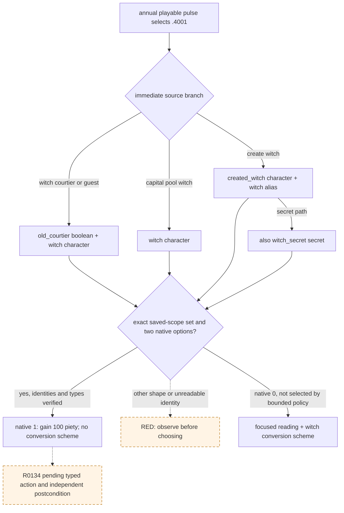

# `trait_specific.4001` R0134 exact-shape consumer

Status: exact-build source and paused-frame evidence; R0134 stopped before an event option was submitted. This note extends the existing [witch encounter tree](trait-specific-witch-encounter.md) for the real production blocker. It does not claim a new live action.

## Frozen source and observed frame

- CK3 `1.19.0.6-steam23530548`, executable SHA-256 `2D00FF3101EF70B566F2FCBAE292F09263199C80E9DC8F139B82D7D96F83DB86`.
- `game/events/trait_specific_events/trait_specific_events.txt:584-717`, SHA-256 `A4882239AB219EFB2BB082C983403E6E24B8C9DD481E5643ADFE3321ACAC43F7`; annual caller `game/common/on_action/yearly_on_actions.txt:2522-2563,3019`, SHA-256 `0FC85A284224A68D1CA0A4EF071D4F4A4F49896753AEC463975A12EE4E1116FA`.
- R0134 formal report `Z:/ck3_mod_rewrite/.task-tmp/RUN-001/war-h2493-continuation-source9b76758-nolaunch-20260922/R0134-formal/formal-report.txt`, SHA-256 `375EF7A9666B36571D7DD45C27F769D3C38FFB9C7FC8F7E73B29076F73FABECB`; final driver `state-final/native-session/driver-state.json`, SHA-256 `4FAC1B82547A4CC4E4F32206B4418E8EC7105DFF8B026403216E9B7763778732`.
- Formal turn 132 naturally advanced to raw date `53467536`; turn 133 / driver history 2680 queried paused `native:346` revision 347, event instance 32, root Character 36403. Saved scopes: `created_witch/character` and `witch/character` both full CharacterID 33572616; `witch_secret/secret` has no exposed payload identity. Both rendered options were shown and enabled at native indices 0 and 1. Turn 134 returned `registered_contract_requires_extended_consumer`, with no event action. Last paired source boundary remains h2675/raw `53467008`.

## Source tree and bounded choice

The existing registry contract admits only the four exact scope sets above. `witch` must be a unique non-player character. When `created_witch` exists, it must be unique, non-player, and the same full CharacterID as `witch`; `old_courtier` can only be a boolean scope, and `witch_secret` can only be a secret scope. The current bridge does not expose a secret or boolean payload identity, so the consumer verifies exact scope names and native types, not an invented payload value. Source `immediate` is the only producer of these names in this event. Any extra, missing, duplicated, wrong-type, or unreadable required character scope remains blocked.

The registered bounded choice is authored option 2 / native index 1. Its complete direct effect is `medium_piety_gain=100`; it avoids option 0's five-year reading modifier and secret conversion scheme. This uses the already reviewed event route and does not infer a general faith policy. The scoped consumer materializes only the present optional scope types and character relations, while retaining the existing root, exact name set, option projection, revision, and postcondition checks. Offline consumption of R0134's frozen event context recommends authored 2 / native 1; the existing production interrupt checks are 23/23. These are static results. R0134 is only a selection-before-action RED; replay acceptance must still show one formal typed submission, old instance 32 disappearing, independent piety or other required material readback, next turn consumption, and paired checkpoint.
