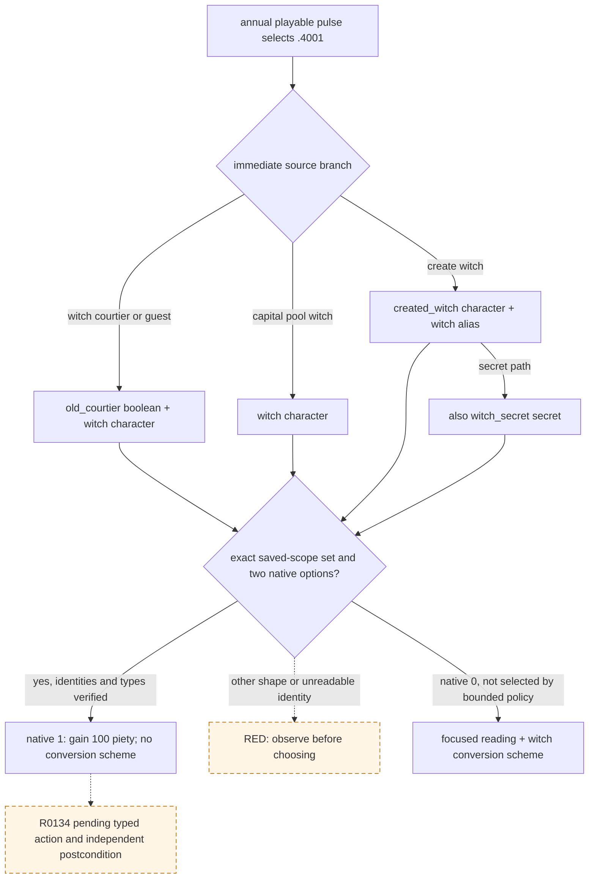

# `trait_specific.4001` R0134 exact-shape consumer

Status: exact-build source and paused-frame evidence; R0134 stopped before an event option was submitted. This note extends the existing [witch encounter tree](trait-specific-witch-encounter.md) for the real production blocker. It does not claim a new live action.

## Frozen source and observed frame

- CK3 `1.19.0.6-steam23530548`, executable SHA-256 `2D00FF3101EF70B566F2FCBAE292F09263199C80E9DC8F139B82D7D96F83DB86`.
- `game/events/trait_specific_events/trait_specific_events.txt:584-717`, SHA-256 `A4882239AB219EFB2BB082C983403E6E24B8C9DD481E5643ADFE3321ACAC43F7`; annual caller `game/common/on_action/yearly_on_actions.txt:2522-2563,3019`, SHA-256 `0FC85A284224A68D1CA0A4EF071D4F4A4F49896753AEC463975A12EE4E1116FA`.
- R0134 formal report `Z:/ck3_mod_rewrite/.task-tmp/RUN-001/war-h2493-continuation-source9b76758-nolaunch-20260922/R0134-formal/formal-report.txt`, SHA-256 `375EF7A9666B36571D7DD45C27F769D3C38FFB9C7FC8F7E73B29076F73FABECB`; final driver `state-final/native-session/driver-state.json`, SHA-256 `4FAC1B82547A4CC4E4F32206B4418E8EC7105DFF8B026403216E9B7763778732`.
- Formal turn 132 naturally advanced to raw date `53467536`; turn 133 / driver history 2680 queried paused `native:346` revision 347, event instance 32, root Character 36403. Saved scopes: `created_witch/character` and `witch/character` both full CharacterID 33572616; `witch_secret/secret` has no exposed payload identity. Both rendered options were shown and enabled at native indices 0 and 1. Turn 134 returned `registered_contract_requires_extended_consumer`, with no event action. Last paired source boundary remains h2675/raw `53467008`.

## Source tree and bounded choice

```mermaid
flowchart TD
  A[annual playable pulse selects .4001] --> B{immediate source branch}
  B -->|witch courtier or guest| C[old_courtier boolean + witch character]
  B -->|capital pool witch| D[witch character]
  B -->|create witch| E[created_witch character + witch alias]
  E -->|secret path| F[also witch_secret secret]
  C --> G{exact saved-scope set and two native options?}
  D --> G
  E --> G
  F --> G
  G -->|yes, identities and types verified| H[native 1: gain 100 piety; no conversion scheme]
  G -.->|other shape or unreadable identity| U[RED: observe before choosing]
  G -->|native 0, not selected by bounded policy| I[focused reading + witch conversion scheme]
  H -.-> J[R0134 pending typed action and independent postcondition]
  classDef unknown stroke-dasharray: 6 4,fill:#fff4e5,stroke:#b36b00;
  class U,J unknown;
```

The existing registry contract admits only the four exact scope sets above. `witch` must be a unique non-player character. When `created_witch` exists, it must be unique, non-player, and the same full CharacterID as `witch`; `old_courtier` can only be a boolean scope, and `witch_secret` can only be a secret scope. The current bridge does not expose a secret or boolean payload identity, so the consumer verifies exact scope names and native types, not an invented payload value. Source `immediate` is the only producer of these names in this event. Any extra, missing, duplicated, wrong-type, or unreadable required character scope remains blocked.

The registered bounded choice is authored option 2 / native index 1. Its complete direct effect is `medium_piety_gain=100`; it avoids option 0's five-year reading modifier and secret conversion scheme. This uses the already reviewed event route and does not infer a general faith policy. The scoped consumer materializes only the present optional scope types and character relations, while retaining the existing root, exact name set, option projection, revision, and postcondition checks. Offline consumption of R0134's frozen event context recommends authored 2 / native 1; the existing production interrupt checks are 23/23. These are static results. R0134 is only a selection-before-action RED; replay acceptance must still show one formal typed submission, old instance 32 disappearing, independent piety or other required material readback, next turn consumption, and paired checkpoint.

## R39: current `.3` refusal loop (2026-10-05)

Root supplied current `g71/records_trait_specific.py` records, the reviewed `.3` compatibility projection and actual results below. The R0134/1.19.0.6 source pins, static findings and historical stop above retain their original meaning.
- Fresh context: `native:114/public:2`, raw date `53260392`, Robert `29829`, event `27`; definition `trait_specific.4001` (`4814001`), runtime ordinal `7621`. Context generation is unpublished.
- `created_witch`, `secret_character` and `witch` each expose character value `73146`; `witch_secret` has native type `7` with unavailable payload identity. This finite refusal did not require an invented Secret FullID.
- Rendered/native options `0/0` and `1/1` are both shown and enabled. Empty effect indicators are a published subset, not a complete effect set.
- Root explicitly called `ck3_select_event_option(option_number=2)`, mapping to rendered/native `1/1`, using the source-first native tree and current compatibility projection. This manual authored refusal is not an executable whole-scheme counter-policy.
- Actual action frame `native:118->119/public:2->3`, generation `8`: accepted, submitted and postcondition_verified are true; independent readback shows event `27->null`. Action generation does not fill the fresh context's missing generation.
- Final `native:119`: event null, actor alive, paused, same episode/date `53260392`. Gold raw `70895708`, prestige raw `287071620` and stress `0` are unchanged; piety was not independently read, so the authored grant has no actual-benefit credit.
- Normal SAVE `h8358`: `98030216` B, SHA-256 `d2946ec1369a4ff5aecd4ba71f69d2186f7e6f210540db37deb1b31535af07a4`. PID `126252`, environment prefix `dc56` and source `g71/cd0` retain only Root's supplied outer precision.
- Root totals at this closure: `4836` real days / `1683` resumed / Oct5 `+178`; this choice adds `0` days. Qualification is only the finite source-authored refusal event ACK -> independent clear -> same-date normal SAVE loop, without secret/trait/piety/material or whole-scheme credit.
