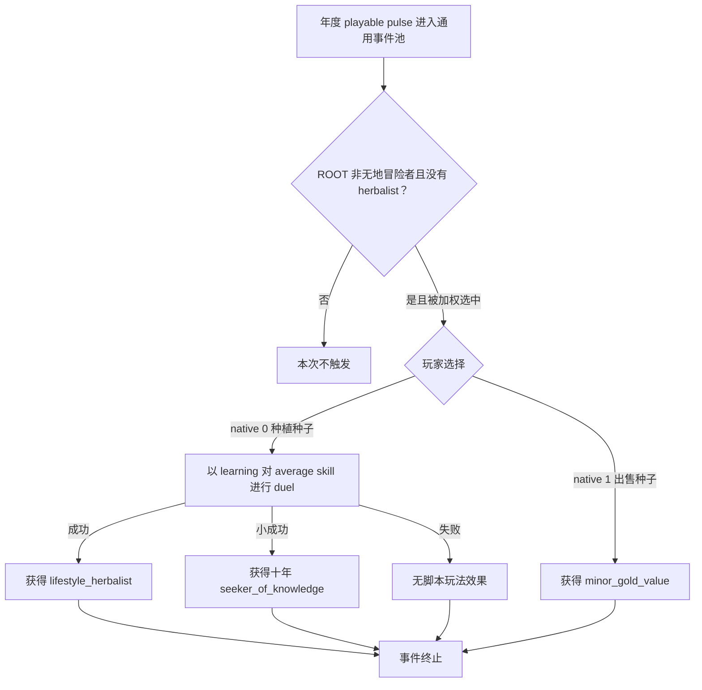

# CK3 1.19.0.6 `trait_specific.8001` 草药种子事件决策树

## 状态与证据边界

- [static-confirmed] 本专题只绑定 CK3 `1.19.0.6` 与 `ck3.exe` SHA-256
  `2D00FF3101EF70B566F2FCBAE292F09263199C80E9DC8F139B82D7D96F83DB86`。
- [paused live RED] R414 attempt 6 在 PID `202268` / connection generation `1` 的真实暂停帧命中 instance
  `1075`：ROOT 为玩家，saved scope 为空，native `0/1` 均 shown/enabled；动作尚未提交。
- [counter-policy static-ready, live action pending] 可移植合同选择 authored `2` / native `1`，并已接入同角色金币严格增加的
  material comparator。当前 RED 是恢复 harness 缺少该原版事件合同，不证明天朝二期产品失败；旧 instance 消失或前进且
  金币后置通过前，不能升级为 production-live loop。

## 原版入口与效果树

该事件位于通用 `on_yearly_events` 候选池，权重为 `100`。ROOT 必须不是无地冒险者，且尚未拥有
`lifestyle_herbalist`；learning 越高，事件自身权重越高。事件没有 `immediate`、saved scope、`after`、cooldown 或一次性 flag。

两个按钮都没有后续事件。native `0` 的三条结果由 learning duel 加权：可能永久增加 herbalist trait、增加十年 modifier，或没有玩法效果；界面 toast 只是结果展示。native `1` 直接给 ROOT 原版 `minor_gold_value`，不创建人物、关系、秘密或后续链。

## 原生 AI 与产品恢复策略

事件没有单独的 option `ai_chance`，因此这里没有可复用的人格偏好树。产品选择 native `1`：它给出确定的正向金币，并避开 native `0` 的随机永久 trait 与十年 modifier。该选择只服务 R414 的有界 stage 9–11 恢复，不宣称所有长期局面中金币恒优于 herbalist。

提交前必须重新绑定同一事件 key、instance、日期窗口、玩家 ROOT、空 saved-scope 集合、两个 shown/enabled 原版选项和最新 revision。ACK 不算完成，必须观察 old instance 消失或前进。

## 金币效果档案与后置

authored option 2/native 1 现发布 `xar.ck3.vanilla-event-choice-effect/v1`：selected effect 是对 ROOT 执行
`add_gold = minor_gold_value`，observable postcondition 是 `played_character_gold.raw / strictly_increasing`。原版动态值会读取月收入、
treasury 与 era，基础下限为 `15` whole gold；因此合同只承诺正向 material delta，并明确拒绝在动作前伪造精确 runtime 金额。

通用 state snapshot 已从既有 exact-build `extension+0x100` leaf 发布 Q100000 玩家金币。planner 绑定选择前 snapshot/revision、
full CharacterID 与 raw 余额，action 记录同角色前后观察；只有 `post_raw > pre_raw` 才通过。不变、下降、身份漂移或缺读数均不构成
成功证据。详见 [`played-character-gold.md`](played-character-gold.md)。该链仍是 `static-ready / live=false`，下一次只需复用
R414 近边界做一轮有界动作，不扩成长跑。

## 证据

- 原版事件：`Crusader Kings III/game/events/trait_specific_events/trait_specific_events.txt:1148-1226`，SHA-256
  `A4882239AB219EFB2BB082C983403E6E24B8C9DD481E5643ADFE3321ACAC43F7`。
- 年度池：`Crusader Kings III/game/common/on_action/yearly_on_actions.txt:2933-3040`，SHA-256
  `0FC85A284224A68D1CA0A4EF071D4F4A4F49896753AEC463975A12EE4E1116FA`。
- R414 选择前 RED：
  `_runtime/p1-post-chaos-terminal-r414-20260911/live-artifacts/terminal-stages-red-attempt-06.json`，SHA-256
  `BEEB7C1C2FE0A30FA056ABCED1C28EA83BD0739DC0D1225BE4CA1C3C738700E6`。
- 可移植合同、analysis 与 observation：
  `ck3_autonomous_player/src/xar_autoplayer/vanilla_events/records_trait_specific.py`。
- 原版动态值：`Crusader Kings III/game/common/script_values/01_dynamic_values.txt:53-70`，SHA-256
  `049303EFF8ABFDFCADCC31D27E2633A26A2E877E4E2980D4A42C53D6B76D7064`；基础值：
  `Crusader Kings III/game/common/script_values/00_basic_values.txt:49-64`，SHA-256
  `9268A54F0E425D409D9D0F20D884E0A3D0A89DF85A0B6644D56133C0C4CB0096`。
