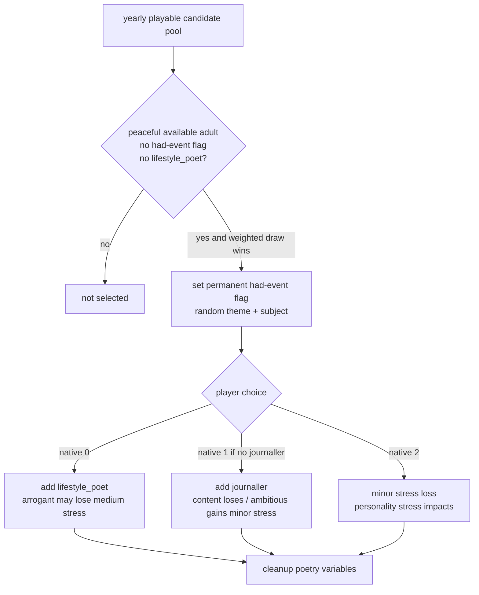

# CK3 1.19.0.6 `trait_specific.9001` 诗人抉择树

## 状态与证据边界

- [static-confirmed] 本专题只绑定 CK3 `1.19.0.6` 与 `ck3.exe` SHA-256
  `2D00FF3101EF70B566F2FCBAE292F09263199C80E9DC8F139B82D7D96F83DB86`。
- [production-live query; action pending] R856 从普通封建 `xar_off` campaign 的 h676 pair 冷恢复后自然推进到
  date `53208912`，在 turn 99 命中 event instance `4`。turn 100 通过正式
  `query-current-event-window-context-v1` 读取 `trait_specific.9001`、玩家 ROOT `31853`、character scope
  `subject=1` 及 native option `0/1/2` 全部 shown/enabled；bounded run 随即按合同延后 checkpoint，未提交任何选项。
- [unknown] 该次自然事件来自基础 yearly pool 还是 FP1 yearly group，active-event frame 本身不携带 caller attribution；
  两条 exact-build caller 都保留，不能反推本次来源。

## 入口、触发与 immediate

基础 `on_yearly_events` 的外层 `chance_to_happen=25`、空项权重 `200`，本事件权重 `75`；FP1 eligible yearly group
的外层 chance 为 `65`、空项权重 `200`，本事件权重 `200`。两个池都还会按当帧合法候选共同抽取，不能把这些权重
换算成恒定年度概率。

事件要求 ROOT 通过 `is_available_at_peace_adult`：和平、成年、存活、非旅行/军中/囚禁/incapable、无致命传染病，
且没有活动/规划阻塞；ROOT 还必须没有永久 flag `had_event_trait_specific_9001`，并且没有 `lifestyle_poet`。
触发后 immediate 立即写入该永久 flag，随机选择诗歌主题，生成用于本地化的 `subject`，并设置临时
`poetry_theme` / `poem_subject` 变量。事件结束后的 `cleanup_poem_effect` 清理两个变量，但不移除 had-event flag；
因此这次机会不会自然重复。

R856 当前 exact projection 只有 `subject` character scope。原版随机 romance theme 还可能生成 boolean
`poetry_romance_target`；该 source-possible 形态没有本轮 live frame，不得由当前合同自动放宽。遇到不同 scope shape时应
fail closed，补对应 source-bound projection 后再选。

## 三个选项与原生 AI

| Native | 直接效果 | 原生 AI 权重 |
| --- | --- | --- |
| `0` | 永久增加 `lifestyle_poet`；arrogant 有中等减压 | base `100`；boldness ×0.5、compassion ×0.25、sociability ×0.25；arrogant +20；北日耳曼或 poet 文化 +100 |
| `1` | 仅无 `journaller` 时显示；永久增加 `journaller`；content 小幅减压、ambitious 小幅增压 | base `50`；energy ×-0.25、sociability ×-0.25；content +10、ambitious -10 |
| `2` | `minor_stress_loss`；lazy/fickle 减压、diligent 增压 | base `25`；boldness ×-0.25、energy ×-0.5；lazy +50、fickle +30、diligent -30 |

`lifestyle_poet` 的固定收益包括每级威望等级外交 +1 与 stress loss +10%，并可按文化追加收益；`journaller` 为
learning +1 与 stress loss +20%。三项都没有 authored gold/prestige/piety 成本或后续事件。

## 产品恢复策略

当前 R856 形态选择 authored option `1` / native index `0`：它已由当前窗口判定合法，在一次性机会中提供长期、
无已知负面或资源成本的 `lifestyle_poet`，且与原版最高基础权重方向一致。native `2` 只提供一次小幅减压；native `1`
偏学习与减压。当前 event-window 没有发布玩家 stress、人格或威望等级，因此这只是当前 source-reviewed ordinal 选择，
不宣称复刻当帧原生 AI 加权结果；若未来同事件携带可靠的临界高压输入，可以重新比较三个选项。

提交前必须重新绑定同一事件 key、当前 instance、玩家 ROOT、exact scope name/type、三个 shown/enabled native option 和最新
snapshot/revision。ACK 不算完成；必须在独立下一 paused frame 观察旧 instance 消失，再由后续正式 turn 消费并保存配对
checkpoint。当前 bridge 没有通用玩家 trait-set 查询，因此没有独立 trait 观测前，只能把 `lifestyle_poet` 增加记为
source-authored expectation，不能把它冒充实机 material postcondition。

## 证据

- 原版事件：`Crusader Kings III/game/events/trait_specific_events/trait_specific_events.txt:1238-1400`，SHA-256
  `A4882239AB219EFB2BB082C983403E6E24B8C9DD481E5643ADFE3321ACAC43F7`。
- available trigger：`game/common/scripted_triggers/00_available_for_events_triggers.txt:581-611`，SHA-256
  `5566A89A7D93BFB80DCF5A2F065BE0F058BE13E0B84470D1182B82D8D6384A44`。
- yearly pools：`game/common/on_action/yearly_on_actions.txt:2933-2936,3030-3031`，SHA-256
  `0FC85A284224A68D1CA0A4EF071D4F4A4F49896753AEC463975A12EE4E1116FA`；FP1 group
  `game/common/on_action/yearly_groups_on_actions.txt:1-28`，SHA-256
  `D916E482D012BB67C2BDCA7B46C7C8D65D7B22C3D9CBDF42377E63A1DE0147C5`。
- 诗歌生成/清理：`game/common/scripted_effects/00_poetry_effects.txt:6-119`，SHA-256
  `0BF4AACF776DC83AF32FC6FA6AEC93BCF01456CDE10DFC2E1C2E389A2CBB57FB`。
- trait 定义：`game/common/traits/00_traits.txt:5058-5078,10366-10410`，SHA-256
  `079F0AB5C4224C505AB9F25BCA80D8DF296E5899BFAB26049CE5FE794DC0B042`。
- R856 report SHA-256 `05703538FEBEC2F86B9CD636DCA5FD234365E84C9FA81F0E303645F6FE9D538C`；
  driver SHA-256 `C6F4C6356E9734AB3F218F6907EA6D663FB81E0FB4B19B5852A7E65FBA51C792`；最近安全 h836 checkpoint
  SHA-256 `9C183C3E8F4B71020892F8B8369C856F6EB17512EA59F6545A5585724D7E5516`。
