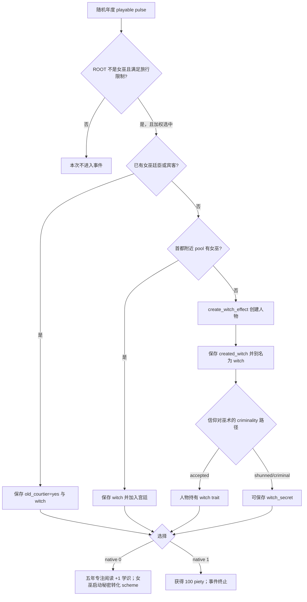

# CK3 1.19.0.6 `trait_specific.4001` 女巫邂逅决策树

## 状态与证据边界

- [static-confirmed] 本专题只绑定 CK3 `1.19.0.6` 与 `ck3.exe` SHA-256
  `2D00FF3101EF70B566F2FCBAE292F09263199C80E9DC8F139B82D7D96F83DB86`。
- [production-live primitive] R374 已在 PID `51852` / connection generation `1` 选择 authored `2` / native `1`，
  并验证 instance `1040` advance。该次实见生成人物分支：`created_witch` 与 `witch` 指向同一人物，另有
  `witch_secret`。
- [paused live RED] R414 attempt 3 在 PID `202268` / generation `1` 的 instance `1067` 实见既有廷臣分支，
  saved scopes 为 boolean `old_courtier` 与 character `witch`。动作尚未提交；RED 归类为 harness-route
  scope variant，不证明天朝二期产品失败，也不增加 live primitive 数量。

## 原版入口与 immediate 分支

`random_yearly_playable_pulse` 每年在随机时点为 playable character 调用一次。事件进入
`on_yearly_events` 的加权候选池；ROOT 必须不是女巫，非陆无地冒险者还必须没有旅行。极端特殊特质和狂热降低
权重，学习提高权重，已有女巫廷臣或宾客也提高权重。这些权重不能直接换算为固定年概率，因为外层 group 和同池
候选会按当帧合法性共同变化。

`create_witch_effect` 还可能以独立 10% 分支替换符合条件的传奇开篇并发出 interface toast；这属于生成人物支路的
副作用，不能从既有廷臣或 pool 分支外推。native `0` 启动的是后续秘密 scheme，不会在本事件按钮上立刻把 ROOT
转化；后续 `witch.2002` 仍有接受、拒绝和曝光等玩家选择。

## 四种严格 scope 形状

exact source 能生成且合同接受的集合只有：

1. pool 人物：`witch`；
2. 既有廷臣或宾客：`old_courtier`, `witch`；
3. 新建且直接持有 trait：`created_witch`, `witch`；
4. 新建且采用 secret 路径：`created_witch`, `witch_secret`, `witch`。

所有形状都要求 `witch` 是唯一且非玩家的人物。`created_witch` 出现时也必须唯一、非玩家，并与 `witch` 指向同一
人物；`old_courtier` 只能是 boolean，`witch_secret` 只能是 secret。合同用 exact name-set 和 `1/2/3` 个 scope
计数拒绝其它组合，不把可选字段解释为任意缺失或任意新增。

## 产品恢复策略

R414 要恢复的是天朝二期 stage 9–11 有界验收。native `1` 是唯一不启动秘密转化 scheme、也不添加五年学习
modifier 的路线；其完整直接效果是 exact-build `medium_piety_gain = 100`。因此可复用合同固定 authored `2` /
native `1`，但提交前仍必须满足同一事件 instance、日期窗口、玩家 ROOT、上述四种精确 scope 形状、两个
shown/enabled 原版选项与最新 revision 绑定。ACK 本身不算完成，必须观察旧 instance 消失或前进。

faith 在这里仅决定生成女巫时采用 trait 还是 secret。产品策略消费最终 scope 形状和按钮效果，不据此展开通用
faith/doctrine/改宗策略。

## 证据

- 原版事件：`Crusader Kings III/game/events/trait_specific_events/trait_specific_events.txt:584-717`，SHA-256
  `A4882239AB219EFB2BB082C983403E6E24B8C9DD481E5643ADFE3321ACAC43F7`。
- 原版年度入口：`Crusader Kings III/game/common/on_action/yearly_on_actions.txt:2522-2563,2933-3842`，SHA-256
  `0FC85A284224A68D1CA0A4EF071D4F4A4F49896753AEC463975A12EE4E1116FA`。
- R374 生成分支 RED：`_runtime/p2r374-active-boundary-continuation-live/trait-specific-4001-red-report.json`，
  SHA-256 `9FDF93D053E001C73D9DC469DDE37BC44C3DA8F1872AC3E587C10241EA27FB51`。
- R414 既有廷臣分支 RED：
  `_runtime/p1-post-chaos-terminal-r414-20260911/live-artifacts/terminal-stages-red-attempt-03.json`，SHA-256
  `ADD23E60298C513E31B8E663CF2362B4579CFFE81FDF35F9A77822498A2EDBFB`。
- 可移植合同、analysis 与双 observation：
  `ck3_autonomous_player/src/xar_autoplayer/vanilla_events/records_trait_specific.py`。
