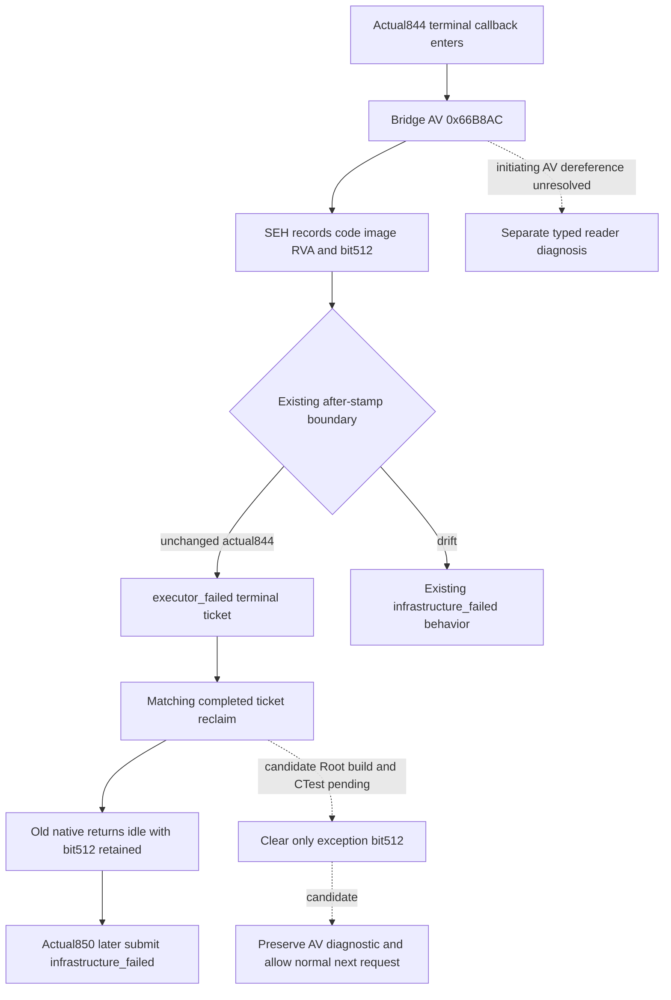

# R0048 typed-query executor exception reclamation

2026-10-06 actual native failure: Root R0048 uses CK3 1.20.0.3, EXE SHA-256
`94b55397abb687a3dcd436805a5d885e6be90fa6c693feb44a9e3bbeeade02a6`, g79/v74
native source715 and PID4692. Frozen live artifact844 records a terminal-query
AV;845 and850 prove that its retained exception bit blocks later typed queries.
This work starts from Root documentation base
`71e315bd38f9e4b23cf7fc5fa7e6ffbdf3afd788`, with that native baseline unchanged.

The immutable evidence is under
`Z:/ck3_mod_rewrite_process_assets/g2-resume-20261006/gameplay-responses/`:

| Artifact | Actual result |
| --- | --- |
| `844-current-fighter-model-context.json` | Registered terminal query, prior combat/subject unit null, characters29829/31050, expected public3. Callback entered then hit AV `0xC0000005`, bridge RVA `0x66B8AC`; wait `executor_failed`, stage `wait`. |
| `845-after-current-v2-query.json` | Robert29829/original episode/PID4692/native connection generation2 remain paused at public3/native34/raw53288232. Mailbox failure512 only, published/completed/executed sequence43, valid application-main stamp and readinessfalse. |
| `850-v2-first-waypoint-existing-planner-plan-01.json` | Later registered plan rejects `application-main typed query executor is unavailable or busy`. |

The failure is already terminal and reclaimed. `bridge.cpp:12084–12095` reclaims
before constructing844's typed-failure frame; a reclaim failure would return a
different error. `main_thread_query_mailbox_v1.cpp:1857` ORs exception bit9 into
the native global flags. Existing reclaim clears callback/context and returns
idle, but retains that bit. Subsequent submit1507 rejects nonzero flags before
its idle CAS; bridge12061 combines this with other failures in a generic message.
Thus850 does not establish a concurrent callback or an occupied slot.

Ordinary SDK reconnect retains the global mailbox and its installed native
lifetime outside WorkerMain's connect loop. InstallNewAdapter10713 returns for
an installed/attempted lifetime, while RunConnectedSession12942 only increments
the real native connection generation. It does not run install's flags reset.
There is no registered frozen MCP mailbox reset endpoint. Root can reconnect
to adopt a qualified Python routing change without claiming native recovery.

The minimum candidate changes existing terminal reclaim only: after its
matching completed-ticket checks, an `executor_failed` ticket clears just
`main_thread_query_failure_executor_exception` with atomic `fetch_and` before
publishing idle. Code/image/RVA remain available for the current failure frame,
which is serialized after reclaim. All other infrastructure flags and terminal
states retain their existing behavior. No retry, tool, schema, lease, admission
gate or new hook is added. The initiating844 AV is still unresolved; this change
isolates its effect on later admission and does not qualify a repeat of844.

One independent native fixture and unique CTest exercise the production
submit/pump/SEH/wait/reclaim path with synthetic installed IAT/TLS/Jomini/GameState
and an actual no-access-page AV. It checks retained code/image/RVA, the next
normal executor's successful completion, and preservation of an unrelated
infrastructure flag. It does not run the old mailbox fixture or read CK3/EXE.

Build target: `xar_ck3_main_thread_query_exception_reclaim_v1_test`.
CTest: `xar_ck3_native_bridge_main_thread_query_exception_reclaim_v1`.
Root's sole formal builder owns compilation and this first new CTest; source
owner performs source/diff review only. Current candidate is source prepared,
with native build/fixture validation and production recovery pending. Existing
844/845/850 RED artifacts remain preserved. No new fixture-live,
production-live loop, game day or complete credit is claimed by this package.

The implementation packet and Oct6/W41 merge fields are in
`battle-terminal-mailbox-failure-01/ROOT-DELIVERY.json` and `REPORT-FIELDS.json`
under the same external archive. Root owns adoption, normal qualified native
deployment and continuation from the original saved ordinary campaign.

## First offline production qualification (2026-10-06T09:15:35+08:00)

Root compiled clean frozen **g82 / ecc15d1cfdcae9d8497cdc847af8a61be264837d** once: four runtime targets plus only these two new fixture targets, Release `/W4 /WX`, jobs64, explicit65ON/50OFF. The joint batch completed GREEN in **116.98222s**, with **586 actual TUs / 581 unique sources / 1238 compiled inputs / 0 reused TUs**. Counts describe the whole joint batch; four runtime binaries are in the formal manifest and fixture executables are separately archived.

The first and only two new CTests both passed at **2026-10-06T01:14:47.869671+00:00**, **2/2 GREEN**, 0.320155s outer elapsed. `xar_ck3_native_bridge_main_thread_query_exception_reclaim_v1` exercises an actual SEH access violation, retains its diagnostic, admits a distinct normal request after reclaim, and preserves an unrelated failure bit. `xar_ck3_12003_context_source_read_av_test` exercises the public production collector with an actual committed PAGE_NOACCESS operand, a readable control, callback supply, and callback false; unavailable input remains the existing partial/null admission rather than a supplied false value. Old CTests, wire consumers and the failed844 query were not repeated.

Both minimum repairs are **static-ready**. This machine is reserved for the user's CK3 play; no game was launched, contacted or operated and no binary was deployed. Actual recovery/current-person read qualification remains pending. Offline evidence cannot identify the original unreadable leaf or character from the preserved exception alone. The844/845/850 failure receipts remain unchanged; complete person/Rule43/Entry and future battle prediction are unfinished.

[First qualification receipt](Z:/ck3_mod_rewrite_process_assets/g2-resume-20261006/battle-terminal-mailbox-failure-01/strict02/ROOT-FIRST-QUALIFICATION.json) binds the build, final formal manifest and first CTests. DLL **10652672B / SHA52424a29410e1619b5032d89452ddd00b731a6db8287d8de8239ea95880102ca**; final pre-deployment manifest **304349B / SHAb67117cbb2600b726562f90ce2bf59a6ea419a827e8412182f0d846e31fd9c17**. Stored earlier candidate/NOT_RUN fields remain as their original historical receipts.
