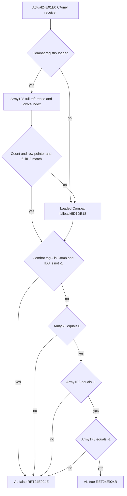
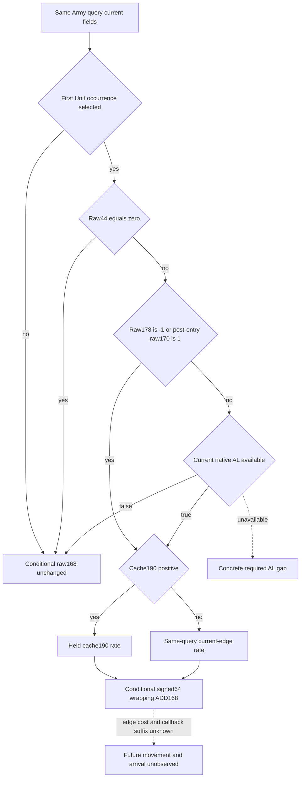

# Current CArmy movement-admission AL in CK3 1.20.0.4

The non-bypass branch of the [first selected Unit movement-weight prefix](unit-next-movement-weight-prefix-12004.md) needs the native CArmy Boolean returned by `0x24E91E0`. A false value proves that this local prefix performs no ADD to Unit+0x168. A true value admits the existing cache/current-edge-rate ADD. The same-query current Boolean closes that decision input; it does not observe a future callback or reconstruct its earlier effects.

Target: CK3 `1.20.0.4`, Steam `25734779`, EXE SHA-256 `98702F88A547CDE2EAF29A85F93B85F68EE4CF8148336A4F7AFAEB75319DD518`. Evidence root: `Z:/ck3_mod_rewrite_process_assets/g2-parallel-20261008/unit-new-date-army-admission-al/`.

## Actual source tree and ABI

The already-closed movement caller invokes this leaf at `0x24AB78F`, after the typed CArmy resolver `0xA66E50`. The actual leaf is `[0x24E91E0,0x24E924F)`: 111 bytes, 31 instructions, and both reachable RETs at `0x24E924B` and `0x24E924E`. It has no CALL or memory-store instruction. The Windows x64 ABI is `bool(void *CArmy)`, RCX receiver and AL result. This is direct actual4 source proof; an old3 helper body was not held, and no old/new body equality is claimed.

The first RIP load at `0x24E91E0` reaches the loaded Combat registry slot `0x5D1DE70`. The CArmy full Combat reference is DWORD+0x128 at `0x24E91EF`. Its low24 index must be below registry DWORD+0x2C; registry+0x20 selects a 16-byte row and its pointer+8, whose Combat DWORD+8 must match the full reference. Missing registry, invalid index, null row or full-ID mismatch selects the loaded fallback slot `0x5D1DE18`, read at `0x24E921B`.

At `0x24E9222`, the selected object must have DWORD+0xC `0x436F6D62` (Comb), and DWORD+8 different from `-1`, to block movement and return AL false. Otherwise three CArmy comparisons decide the result: DWORD+0x5C must be `0` (`0x24E9231`), DWORD+0x1E8 must be `-1` (`0x24E9237`), and DWORD+0x1F8 must be `-1` (`0x24E9240`). All three passing gives AL true; a failed comparison gives AL false. These are exact raw operands. This leaf does not read CArmy+0x1EC, so the older flag21 occurrence cannot substitute for its result.

## Source cost and retained attempts

Cached metadata did not contain a `.pdata` entry for this leaf. The capture therefore followed reachable instructions to RET, reading only bytes needed to decode each instruction. The first 32-byte budget ended before the function was closed: `leaf-boundary-first01/ACTUAL-ARMY-ADMISSION-SOURCE.json`, exit2/PENDING. Its original raw basename says `complete-ret-boundary`, but that file is only the contiguous 32-byte prefix; the receipt explicitly has no closed RET. It is retained without qualification credit.

The continuation reused those 32 bytes and captured 79 fresh bytes, closing both returns without reading the following address `0x24E924F`. `leaf-continuation-first02/ACTUAL-ARMY-ADMISSION-SOURCE.json` and `actual-army-admission-closed.bin` carry the complete actual111-byte proof. Total unique new EXE cost was 111 bytes in 111 instruction-boundary one-byte reads, 1.4882411 seconds of source-tool work. Old EXE reads, whole hashes, new PE/metadata reads, callee captures and game/SDK/build/test work were all zero. The compact semantic ledger is `ACTUAL-AL-SOURCE-CLOSED.json`.

## Same-query observation and conditional use

The only new native scalar is optional Boolean `current_movement_progress.native_army_movement_admission`. The actual4 Army factory binds `ArmyBindings.read_native_army_movement_admission` to this exact readonly leaf. Strength passes its already resolved CArmy, under the existing CArmy+0x124 Unit backlink check, into MovementProgress. The collector reaches the Boolean only after the existing complete nonempty current-route read and when the getter is bound. It does not resolve a second Army or add a date/queue/type gate. False remains an observed Boolean; absent or null remains unavailable. Existing packages without the scalar are accepted.

The existing Service projection `current_unit_next_movement_prefix_v1` demands AL only when this Unit is selected in the current queue, raw44 is nonzero, raw178 is present, and conditional post-entry raw170 is not `1`. True selects the closed ADD path; false returns ready with the current raw168 unchanged and does not demand a rate. Missing AL retains the concrete missing-input reason. Raw178 `-1` and raw170 `1` preserve the proven bypass. This conditional use assumes the observed resolved CArmy and the leaf's operands still hold at the future movement gate; `native_army_admission_condition` states that assumption explicitly.

## Unique whole qualification and remaining work

The new target is `xar_ck3_12004_unit_army_movement_admission_whole_test`, CLI `--wire-dir <fresh-directory>`, aggregate `unit-army-movement-admission-whole.json`. Four original whole scenes cover AL true, false, unavailable, and raw170=1 bypass. Native AL getter counts are 1/1/0/0; current-edge getter counts are 0/1/0/0. Fixture-owned readonly callbacks check the retained CArmy receiver and unchanged input bytes. They validate production collector/serializer wiring; they do not execute the EXE leaf's Combat resolver or a native writer.

One consumer, `CurrentUnitArmyMovementAdmissionWholeService12004Tests.test_native_army_admission_reaches_both_registered_service_routes`, consumes those four original packets through registered execute-step first and direct Army Service second: eight Driver/Service passes in one method. Native/Service FIRST remain NOTRUN and Root-owned. The current prefix's existing condition string and all nine false future/effect flags remain unchanged. Actual future frame, movement/arrival, earlier stages, empty-route handler effects, route consumption, repeated occurrences, and complete daily/monthly effects remain unclosed. CArmy stock/capacity/budget work belongs to the supply owner.

The Runtime28 compile error in the earlier package's current-edge binding member is retained by Root. This candidate incorporates the exact four-file Root correction `93de8dc6ea1ab914bfbb7de284df55c2f8c9d227` as a separate local dependency on the original e551 baseline. The corrected direct getter is `ArmyBindings.get_unit_current_edge_movement_rate`, borrowed from `BindRouteImage12004`; the AL-only commit adds its separate tail Boolean callback. Root can cherry-pick the AL commit after its already-owned repair. No independent build or prior FIRST replay is performed here.
