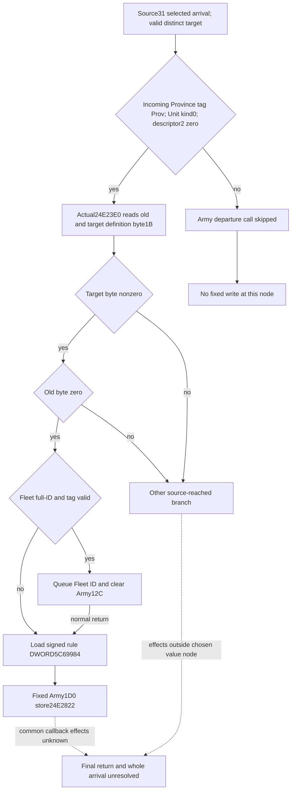

# Unit arrival pre-store disembark write in CK3 1.20.0.4

## Purpose and evidence

[Source31 first arrival assignment](unit-next-arrival-transition-12004.md) closes local SUB/pop and the first Unit20 Province store. Its normal-return condition leaves three reached pre-store callbacks unresolved. This next source package selects one actual value node inside the first Army departure callback, rather than examining hypothetical failure behavior. The result supports a later same-Army readonly observation and conditional landing-penalty projection; it does not execute a departure or arrival.

Freeze: CK3 `1.20.0.4`, Steam `25734779`, supplied EXE SHA-256 `98702F88A547CDE2EAF29A85F93B85F68EE4CF8148336A4F7AFAEB75319DD518`. The private source starts at Source31 `877b5d674258bfff49cbbee471c37e6b862bee2c`. Source31, Root and game runtime source are unchanged. External evidence is `Z:/ck3_mod_rewrite_process_assets/g2-parallel-20261008/unit-arrival-prestore-source32/`.

Source31 actual CALL `24AEC3F -> 24E23E0` supplies resolved CArmy in RCX, incoming old Province in RDX, retained target Province in R8 and prior170-positive byte in R9B. It is selected only after valid distinct target handling, incoming Province85C equals `Prov`, Unit.kind18 equals0 and caller descriptor2 equals0. The caller re-reads Unit20 after this call, so callee behavior is a concrete arrival dependency.

Finite cached `.pdata` identifies `[24E23E0,24E2A6F)`,1679 bytes. Its actual4 body was captured once, cache first, and decoded completely into418 instructions:1679 new bytes / one read /0.6524054 source seconds. Old EXE reads, whole hashes and downstream callee captures are zero. Receipt is `ROOT-ACTUAL-ARMY-DEPARTURE-READ-RECEIPT.json`; decoded source is `army-departure-first01/ACTUAL-ARMY-DEPARTURE-SOURCE.json`.

Old source is partial: the .3 caller directly calls24E2400, and held prefix1024B (decoded1022), writer78B and common-tail344B do not cover the declared1679B function. The missing235 decoded bytes are not fabricated or called a full old/new equality proof. Actual4 evidence stands on its actual reached call and complete actual runtime extent.

## The selected direct value node

The callee retains actual Army in R13 at24E240F, old Province in R14 at24E240C and target Province in RSI at24E2409. It reads each Province's definition pointer at+8 and its byte1B: target load24E2416 and old load24E241F. These are raw branch values; this package does not infer a terrain enum or media name from them.

When target byte1B is nonzero and old byte1B is zero, the branch enters24E26EA. A valid resolved Fleet path appends its full ID to the GameData2EBC8 queue and sets Army12C to-1 at24E2811. A resolved Fleet that fails the tag/full-ID guards bypasses that queue. Both paths reach the same fixed store:

| Actual source | Role |
| --- | --- |
| `24E281C MOV EAX,DWORD[RIP+3787162]` | Next instruction24E2822 plus actual displacement resolves loaded signed DWORD RVA5C69984. |
| `24E2822 MOV DWORD[R13+1D0],EAX` | Assign that raw signed32 value to the retained actual Army. |
| `24E2829 JMP24E2917` | Continue into common callbacks; it is not the final-return state boundary. |

The existing Army row's `current_disembark_penalty_v1.remaining_days` already observes signed Army1D0 through the adopted current-days getter. Its five-key source label `native_current_disembark_penalty_days_12003` is deliberately retained on .3/.4. The new value node needs the loaded rule at this actual RIP operand, not the EXE's initial data value. Zero and negative signed values must remain observable.

R9B/prior170 is tested only after both definition bytes are nonzero. It is not an input to this selected fixed-write branch. Fleet queue contents and allocation results are also not needed to decide the value at24E2822 under normal preceding returns. This package does not reconstruct the queue or invoke a writer.

## Minimum readonly same-query input plan

The source tree precedes any counter-policy. Current Army identity, original route/current Province IDs and matching snapshot provenance are reused from Source31. The raw Unit178 reference and resolution witnesses already exist in `native_army_resolution_v1`; GetState is not a substitute for Unit.kind18. Target Province85C is already published by Source31 but cannot substitute for the incoming/current Province tag.

The implemented construction entry is the existing `current_movement_progress` producer and strict normalizer inside `query-army-strengths-v1`. Five optional raw scalars have exact4 binding; legal zero remains distinct from an unread value:

| Published raw key | Type and source |
| --- | --- |
| `current_province_type_tag_u32` | optionalU32, resolved incoming/current Unit20 Province+85C |
| `unit_kind_18_raw_i32` | optionalI32, same actual CUnit+18 |
| `current_province_definition_byte_1b_u8` | optionalU8, incoming Province+8 definition pointer, byte1B |
| `first_route_target_province_definition_byte_1b_u8` | optionalU8, Source31's already resolved first target+8 definition pointer, byte1B |
| `loaded_disembark_penalty_days_rule_i32` | optionalI32, actual imagebase+5C69984 loaded DWORD |

The original current-days leaf, route, IDs, current state, timings and other Army fields stay unchanged. No second native query, new mutator callback or broad rule/provider capture is required. Missing demanded raw values remain a concrete construction gap; they are not completion credit.

The pure `project_current_unit_arrival_prestore_disembark_write_v1` reuses Source31's once-computed branch/first-write context, selects the Army departure call from the current tag and Unit kind, then selects the fixed store from the two definition bytes. It demands the loaded rule only when the fixed store is selected. Service adds `current_unit_arrival_prestore_disembark_write_v1` rows containing `{army_id, source_provenance, projection}` to both registered Army query routes. Existing frame matching, primitive arguments and query admission stay unchanged. A skipped node reports no write at this node; it does not promise that later callbacks preserve the day value.

The projection returns conditional call/write selection and the signed32 write value, carrying observed current remaining_days separately. A missing rule leaves a selected write with unknown value and readiness false. Known0 and-1 remain known signed values. Current remaining_days readiness, prior170/descriptor1 and Fleet validity are not demanded by this chosen value node. Its twelve effect/arrival/action boundary flags remain false.

## Implementation and unique FIRST recipe

Private implementation baseline `6a23ce3144b1faf4f2e21deca3c58e223c7e87e8` combines Root's normal Council SDK `9faffa0c8866b395c71a790ac03b80e139c4e2c6`, the eleven Source31 files, only Snapshot production CPP commit `4e06f9454ef9f0e8173d30d8259625d3396929b9`, and this topic's original source findings. The private tree is `C:/codex-ck3-background/a4-unit-arrival-disembark-write32-impl`; it shares the existing Z Git object store and does not edit Root's source or live freeze.

`ArmyMovementProgressSnapshot` appends the five optionals. `ArmyBindings` appends `current_unit_arrival_prestore_inputs_enabled` and `loaded_disembark_penalty_days_rule`; exact4 `BindArmyImage12004` enables the readonly capture and binds the actual loaded DWORD at imagebase+5C69984. The collector reuses the resolved original CUnit, current Province and Source31 first target, then the existing serializer emits the typed values or null. It invokes no departure/arrival writer. Older sources may omit these optional keys. The strict Python normalizer preserves old absence, rejects bool for numeric fields and retains exact uint32/int32/uint8 widths.

The three affected headers are `game_contract.hpp`, `ck3_12002_army.hpp` and `army_strength_v1_serializer.hpp`. Root must reselect affected compilation owners for the appended software DTO and binding layout. No new TU, target, CMake include, Bridge route, public MCP tool or native callback is added.

The existing target `xar_ck3_12004_unit_army_movement_admission_whole_test` gains only `--disembark-write-wire-dir <fresh-native-dir>`. It produces `unit-first-disembark-write-whole.json`, seven original per-scene command packets, current Army reader sidecars and `PRODUCER-RECEIPT.json`. Existing admission/edge/arrival modes are preserved and are not part of this new qualification.

| Scene | Conditional call / fixed write / value / ready |
| --- | --- |
| `disembark_rule_positive` | true / true /34 /true |
| `disembark_rule_zero` | true / true /0 /true |
| `disembark_rule_negative` | true / true /-1 /true |
| `disembark_rule_unavailable` | true / true /null /false |
| `disembark_target_medium_zero` | true /false /null /true; old definition and rule undemanded |
| `disembark_unit_kind_bypass` | false /false /null /true; media and rule undemanded |
| `disembark_arrival_not_selected` | false /false /null /true; all five increments undemanded |

The sole new consumer is `CurrentUnitArrivalPrestoreDisembarkWriteWholeService12004Tests.test_loaded_rule_value_reaches_the_conditional_fixed_write_through_registered_routes`. It consumes that one fresh aggregate through actual NativeDriver, normalizers, Service and registered `ck3_execute_step` plus `ck3_query_army_strengths`: seven scenes, fourteen passes. It checks object lineage for once-computed prefix/selection/arrival/write projections, unchanged whole native business values, signed fixed writes and the genuine current-days getter value12. Only hello, paused frame and outer request association are synthetic; the full native Snapshot pipeline is not qualified by this fixture.

Root launcher: `Z:/ck3_mod_rewrite/tools/.venv/Scripts/python.exe -B -X utf8 Z:/ck3_mod_rewrite_process_assets/g2-parallel-20261008/unit-arrival-prestore-source32/implementation/consumer-node/launch_disembark_write_consumer.py --source-root <Root-frozen-source> --native-wire <fresh-native-dir>/unit-first-disembark-write-whole.json --output-dir <fresh-consumer-dir>`. The native mode and consumer run once under Root; their receipts, stdout, stderr, elapsed time and exit codes must be retained. Implementation handoff is under the topic's external `implementation/` directory.

## Remaining arrival boundary and qualification

The actual1679B body has no direct Unit20 store. When both definition bytes are zero and the Fleet reference is valid, it resolves Fleet18 to a CUnit/fallback and recursively calls the already held24AEA20 at24E2912 with target Province and descriptor `[0,0,0]`. This is a separately resolved Fleet Unit; its current context is not assumed to be the original Army Unit. No helper recapture or recursive effect simulation is performed.

Other source-reached branches call24E8440,2A98990 and common callbacks. They remain beyond the selected fixed-write stage. The separate C46100 and2479780 pre-store bodies are not captured in this package. Final helper Province, final penalty days, repeated callbacks, Fleet queue application, future battle/siege effects and full daily/monthly/future frames remain unresolved.

Status is `SOURCE_PREPARED_FIRST_NOTRUN`: the one fixed write is source-closed and the five-field native publication, strict normalization, conditional Service projection and unique new whole mode/consumer are authored. Source diff review is not runtime qualification. FIRST remains0; no build, test, production import, Game/SDK/process/window operation, repeated source capture or whole EXE hash was performed for this implementation. Actual future frame, executed pre-store callback, observed fixed write, final penalty/arrival, full Unit callback and native action credit remain false.
