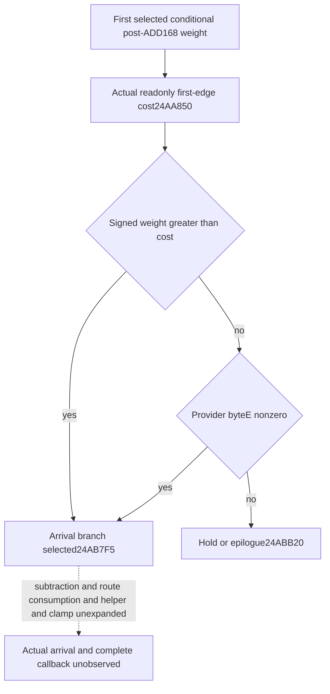

# Conditional first-edge selection after Unit ADD168 in CK3 1.20.0.4

The next decision is whether the first selected Unit NewDate callback enters its first-edge arrival branch, under current route/gate inputs held through that comparison. This follows the [movement-weight prefix](unit-next-movement-weight-prefix-12004.md) and [current Army AL](unit-army-movement-admission-al-12004.md). A selected branch is not an observed arrival or a reconstructed complete callback. Current native remaining days remain independently available in the existing Army row.

Target: CK3 `1.20.0.4`, Steam `25734779`, EXE SHA-256 `98702F88A547CDE2EAF29A85F93B85F68EE4CF8148336A4F7AFAEB75319DD518`. Private baseline: `18edd5613c8cbc580c6745bf3abbe396ed9c9f9e`. Evidence root: `Z:/ck3_mod_rewrite_process_assets/g2-parallel-20261008/unit-after-add-edge-arrival/`.

## Actual comparison tree

The old byte-bearing cached NewDate ASM supplied only the new 42-byte continuation `[0x24AB7EB,0x24AB815)`. The actual4 pair is `[0x24AB7CB,0x24AB7F5)`, nine instructions: normalized instructions, ordered edges and local topology equal. Earlier entry39, movement103 and AL111 proofs are reused without another read. `source-node/after-add-first01/FAMILY-MAP.json` records this unique actual42-byte capture; its old reference is verbatim held ASM bytes, not a fresh old EXE capture.

The actual CALL at `0x24AB7D3` reaches `0x24AA850`, passing the retained Unit and an out64 buffer. At `0x24AB7D8` the caller loads that buffer, then `0x24AB7DD` compares signed Unit+0x168 against this distinct cost. Strict JG at `0x24AB7E4` selects arrival-entry `0x24AB7F5`. All values less than or equal to cost instead call `0xA75D00` at `0x24AB7E6`, compare the returned object's byte+0xE at `0x24AB7EB`, and JE at `0x24AB7EF` selects hold/epilogue `0x24ABB20` when that byte is zero. Nonzero selects arrival-entry. There is no unconditional clamp before this decision.

An AL-false no-ADD result can still select the later arrival branch if its retained weight passes this comparison. Arrival selection must therefore consume the existing conditional weight, rather than require `movement_add_selected` to be true. Equality is not sufficient when byteE is zero, and byteE can select arrival even below cost. Raw operands are not inferred from progress ratios or remaining days.

## Minimal current inputs

The actual cost body is exactly `[0x24AA850,0x24AA91A)`, 202 bytes from cached runtime-function metadata. Direct actual4 source proof establishes `int64_t *(void *CUnit,int64_t *out)`: RDX is retained as RBX and both returns place that out pointer in RAX. The body writes only stack/out64 and reads Unit+0x44/+0x38/+0x20. It does not read Unit168. Its matched-region path calls the already-used observer geometry helper `0x2649300`, passing out64, neighbor-row+0x10, region+0xB0, first route entry and two stack values initially100000; it does not pass the Unit. Its default out is100000, a legitimate native cost. Exact evidence is `getter-cost-first01/ACTUAL-COST-SOURCE.json`; no old helper body or old/new helper equality is claimed.

The provider body is `[0xA75D00,0xA75E2F)`, 303 bytes from cached metadata. Both return-address LEAs at `0xA75D26` and `0xA75D51` resolve the same static object RVA `0x5D1E330`. The needed byteE is therefore `0x5D1E33E`. This getter contains initialization calls and global stores; the readonly observer does not invoke it. It binds and reads the current byte directly at the proven static address. The initialization qword-zero store at `0xA75D92` targets `0x5D1E338`, covering byteE. No new initialization gate or runtime constructor call is added. The actual metadata interval includes one terminal INT3 byte at `0xA75E2E`; no address at or beyond `0xA75E2F` was read. Evidence is `getter-provider-first01/ACTUAL-PROVIDER-SOURCE.json`.

Only two optional current scalars are added to existing `current_movement_progress`: `first_route_edge_weight_cost_raw` signed64 and `first_edge_arrival_provider_byte_e_u8` raw byte. The same complete nonempty-route observer and retained Unit are reused. The exact4 binder supplies the qualified cost getter and static byte address; older bindings leave them null. False/zero, negative signed costs, and an unavailable pointer retain their distinct native meanings. No native NewDate/provider initializer or arrival writer is invoked.

## Current timing versus the conditional branch

Existing `first_route_edge_remaining_duration` remains signed Q100000 DAYS, getter `0x24AB040(unit,out,0)`. Existing normalized progress uses `0x24AB2D0`; both inline geometry rather than calling the cost wrapper. Their authority normalizer and both registered Army Service routes already preserve them. The existing committed-route timeline also retains native prefix/full remaining days and separately rounded arrival dates. These current forecasts need no new raw DTO, query or duplicate duration alias.

The new pure Service result consumes the same-query conditional post-ADD168 weight and the two current scalars. A greater weight selects arrival without demanding byteE. A less/equal weight selects arrival exactly when the captured byte is nonzero. A missing demanded scalar retains a concrete input gap. Unscheduled or route-zero branches preserve their existing conditional bypass. The result explicitly holds the current route, receiver, cost context, provider byte and post-entry operands through this gate. It neither subtracts a guessed one-day duration nor changes the current native forecast.

## Qualification and remaining boundary

Root owns build and FIRST. The existing `xar_ck3_12004_unit_army_movement_admission_whole_test` gains a new mode that emits only the fresh first-edge selection scenes; its original AL mode remains unchanged. No new native translation unit, target or shared CMake hook is introduced. A new sole registered consumer uses the genuine new whole packets through execute-step first and direct Army Service second, with current remaining-duration observations preserved. No old FIRST is replayed.

The new mode is `--edge-selection-wire-dir <fresh-directory>`, with aggregate `unit-first-edge-selection-whole.json`. Its five scenes hold schedule positions `[1,3]`, current weight100, cached rate7 and current ALtrue, yielding the first conditional weight107. They cover greater-than cost106 with an undemanded unavailable provider, equal cost107/provider0, below cost108/provider3, demanded unavailable provider, and unavailable cost. Current remaining days remain85714/100000/114285 at scale100000. The consumer exercises each original whole packet through both registered routes, ten passes total; it does not rewrite a native body to manufacture another scene.

`ArmyMovementProgressSnapshot` and `ArmyBindings` each gain two tail fields. Root must select and rebuild the owners of these changed headers/layouts under one frozen source. The existing CMake module and Bridge routes require no extra registration. The Service computes its existing movement-prefix projection once per row and supplies it to `current_unit_next_first_edge_selection_v1`.

Unique source cost is 547 new bytes in three reads: caller42, cost202, provider303. Old EXE reads, whole hashes, new metadata bytes and callee captures are zero. The two helper bodies have direct actual4 proof, not an old/new body equality claim. No game, SDK, process, window, build, test or production-module import is performed here.

Actual future frame/arrival, arrival helper effects, route consumption, post-arrival clamp, repeated callbacks and full daily/monthly effects remain false. The old cached suffix contains route-pop and later clamp work, but this package does not claim those effects are qualified or reconstruct them. CArmy stock/capacity/budget work remains the supply owner's scope.
