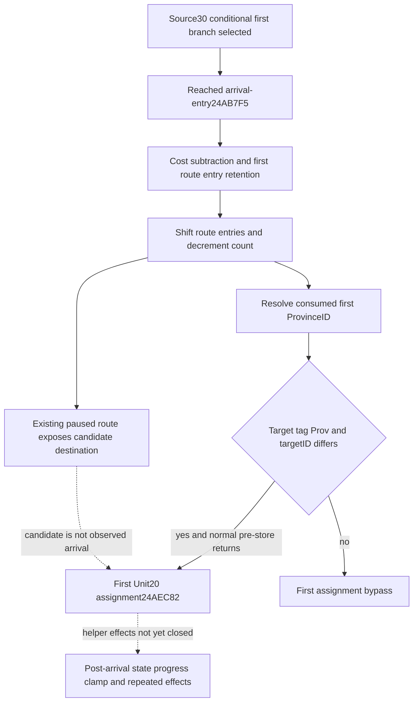

# Conditional Unit first-arrival transition in CK3 1.20.0.4

The next source leaf follows [first-edge selection](unit-first-edge-arrival-selection-12004.md). Its purpose is to determine the consumed first route destination and the first current-province transfer under explicitly held current inputs. It does not execute Unit NewDate, the arrival helper, a route command or a future battle. Source30 remains frozen; this private tree starts at `87b6ffe4b9740a1566d0e8ef00bda0b0264fa547`.

Target is CK3 `1.20.0.4`, Steam `25734779`, supplied EXE SHA-256 `98702F88A547CDE2EAF29A85F93B85F68EE4CF8148336A4F7AFAEB75319DD518`. External evidence: `Z:/ck3_mod_rewrite_process_assets/g2-parallel-20261008/unit-arrival-transition/`. No game, SDK, process/window, build or test work is performed by this source lane.

## Held source and the reached continuation

The complete held old NewDate ASM is `Z:/ck3_mod_rewrite_process_assets/g2-parallel-20261006/army-supply-tick/followups/disembark-entry-follow-on/cached-unit-movement.asm.txt`. It shows the first arrival-entry after the already-closed signed cost/provider branch. Old `[24AB815,24AB9C2)` contains one real missing five-byte fragment `[24AB832,24AB837)`; that gap is not reconstructed or treated as an old raw capture.

The actual arrival-entry `24AB7F5` is already proved by Source30. Cached runtime-function fragments identify a finite continuation `[24AB7F5,24AB9A2)`, 429 bytes, ending after the first progress-reset instruction and before the next speed getter. This source-reached actual-only interval was captured once with full 429-byte decoding. Evidence is `arrival-continuation-first01/ACTUAL-ARRIVAL-CONTINUATION-SOURCE.json` and `ROOT-ACTUAL-ARRIVAL-READ-RECEIPT.json`. Actual4 semantic review closes this local caller; no whole old/new equality is claimed for the incomplete old reference. The missing old fragment corresponds to actual `24AB812 MOV [rsp+30],R13`, a saved register, and is included in the actual read.

The actual continuation subtracts cost from Unit168 at `24AB7F9`, retains the first route ID at `24AB824`, shifts the remaining route pointers through `4226860` at `24AB827`, and decrements count44 at `24AB847`. Auxiliary Unit160 loses a consumed Q100000 amount at `24AB90E`; Unit170 clears on the closed condition at `24AB92D`. The descriptor stores at `24AB93E/943/948` produce `[0,priorState170>0,0]`. GameState and fallback source uses resolve the consumed first ProvinceID, then actual CALL `24AB97E` reaches `24AEA20`. The first caller reset168 at `24AB997` depends on the helper's returned count/state; those post-helper values are not substituted with pre-helper observations.

The reached helper's cached runtime extent is `[24AEA20,24AEE39)`, 1049 bytes, captured and decoded once. It retains Unit in RDI, target Province in RSI and descriptor in R14. Its first current-province assignment is `24AEC82 MOV [RDI+20],RSI`. Target DWORD85C must equal `0x50726F76`, checked at `24AEA3E`. TargetID10 equal to incoming current ProvinceID10 takes the early bypass at `24AEBD4`; that comparison precedes all departure callbacks. Valid distinct targets converge on the first store when preceding callbacks return normally. Unit.kind18 and descriptor2 select a departure callback, but do not change the stored target pointer. Unit160 and state170 are not direct inputs to this first-store selection.

Pre-store `24E23E0`, `C46100` and `2479780` effects are not executed or reconstructed. Unit30 is read again after departure work and is not projected from the incoming Province. Subsequent Unit28, date180, province/Army callbacks, attachment processing and caller progress rescaling remain beyond the first-write boundary. Evidence is `arrival-helper-first01/ACTUAL-ARRIVAL-HELPER-SOURCE.json` and `source-node/FIRST-PROVINCE-WRITER-SOURCE-CLOSED.json`. This is direct actual4 source, with no old helper body or whole body-equality claim.

## Existing inputs and minimum consumer seam

The current paused `player_armies` snapshot already publishes `current_province_id`, complete ordered `route_province_ids`, `route_read_status` and `route_source_count`. The current first route ID is a candidate consumed destination; its presence alone does not prove an executed transfer. The current Army strength row separately preserves native normalized progress, remaining Q100000 days and optional committed-route timeline. These timing fields are not rewritten into a future frame.

The existing route/current-province resolvers check index bounds, pointer presence and matching ProvinceID10. They do not read DWORD85C. The sole new current observation is therefore `current_movement_progress.first_route_target_province_type_tag_u32`, optional unsigned32/null from the same resolved first-route target. Exact4 enables the observer; older bindings leave it unread. A captured non-Prov tag means the helper skips its first assignment, not that the target ID is zero or unavailable. A demanded unread tag retains a concrete input gap. No duplicate route, ProvinceID or ETA observer is added.

Production Driver Army query already captures its starting paused snapshot and checks the current frame against it before returning `queried_snapshot_id`, `queried_revision` and `queried_native_revision`. Direct Army Service already holds its scope snapshot. The Army execute-step branch now takes one cached snapshot before its query and joins current Army context only when all three returned provenance values match. Missing context leaves a concrete gap in this new projection without changing the query's admission. A standard `Driver.take_snapshot` reads its ingested semantic frame and sends no native query.

The source tree and input ledger now close this first local assignment. Its conditional program reuses Source30's once-computed prefix/selection: when selected, subtract cost with signed64 wrap, consume the first ordered route entry, decrement count and choose the first Province assignment from the observed tag and IDs. When the branch is not selected, these local effects do not occur. A demanded missing tag can leave the assignment unknown while the independently closed subtraction/pop remain computable. Current route/receiver and post-entry operands are held explicitly, and preceding native callbacks are assumed to return normally. This is not a claim about the helper's final-return Province or a complete future callback.

Unique new source cost is1478 bytes in two reads, source time1.3125469 seconds: caller429 and helper1049. Old EXE, whole hashes and downstream callee captures are zero. Unknown helper effects, later speed rescale, battle effects, repeated callbacks and a full future frame remain explicitly unresolved. Source findings and needed-entry manifests are research evidence, not arrival observations or live qualification.

## Prepared qualification and integration

The existing target `xar_ck3_12004_unit_army_movement_admission_whole_test` adds only the mode `--arrival-transition-wire-dir <fresh-native-directory>`. It emits `unit-arrival-transition-whole.json` and five new scenes: distinct Province, same Province, non-Prov tag0, unread demanded tag, and branch not selected. Its original four-scene mode and Source30 mode are preserved and are not replayed. No native TU, CMake module, target or Bridge route is added.

Each new scene obtains its current Army context from the production `ReadArmiesForCharacters12004` reader, then produces its original whole row through `ReadArmyStrengthsForScope12004`, `AppendArmyStrengthV1` and `Render12004BuildIdentity`. The endpoint hello, paused frame wrapper and request correlation are synthetic. The current Army business fields and whole Strength body are original compiled producer outputs; this fixture does not qualify the full native snapshot pipeline.

The sole new consumer is `CurrentUnitNextArrivalTransitionWholeService12004Tests.test_first_route_pop_and_first_province_assignment_use_the_same_query_current_frame` in `test_current_unit_next_arrival_transition_whole_service_12004.py`. It consumes all five fresh bodies through actual Driver, Service and registered MCP paths, execute-step first and direct Army second. It checks the same-query context, all original body values, once-computed prefix/selection objects, local SUB/pop/first-store outcomes and fourteen explicit false effect boundaries. The separate Source30 Service followon `d909a1ee240fb4443d271a4834e3174c66afa621` changes direct query to its existing Driver primitive so these projections are computed once; it changes no native source and has no runtime credit here.

The raw DTO and ArmyBindings tails change layout. Root must select affected owners for `game_contract.hpp`, `ck3_12002_army.hpp` and `army_strength_v1_serializer.hpp`, including the Army collector, exact4 binder, adapters/serializers and the existing whole target. Older bindings default the new observation off; parser absence remains compatible. Native and registered FIRST are not run by this source lane. The exact external launcher and Root recipe are under `unit-arrival-transition/consumer-node/` and `ROOT-FIRST-RECIPE.json`; status is source prepared, not live or observed arrival.
