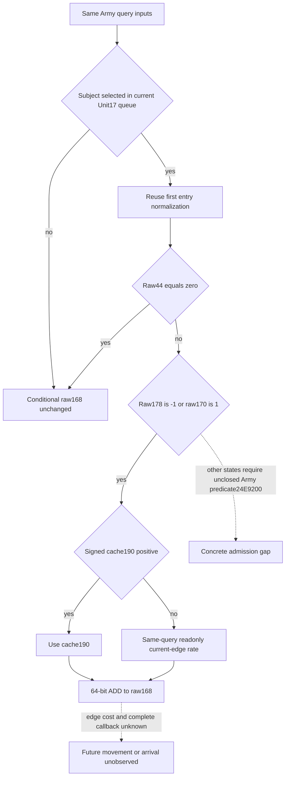

# Conditional CUnit next movement-weight prefix in CK3 1.20.0.4

The needed decision value is the conditional raw movement weight immediately after the first selected Unit NewDate callback's ADD, before edge cost, consumption or arrival handling. Existing [entry normalization](unit-next-new-date-entry-normalization-12004.md) is reused. No native NewDate writer is invoked and this is not a future observed frame.

Target: CK3 `1.20.0.4`, Steam `25734779`, SHA-256 `98702F88A547CDE2EAF29A85F93B85F68EE4CF8148336A4F7AFAEB75319DD518`.

## Held source and minimal inputs

The retained byte-bearing old ASM is `Z:/ck3_mod_rewrite_process_assets/g2-parallel-20261006/army-supply-tick/followups/disembark-entry-follow-on/cached-unit-movement.asm.txt`. The next gate `[0x24AB77F,0x24AB7BC)` reads raw route count44, internal Army reference178 and raw state170. Count44 zero skips this movement body. Reference178 `-1` or raw170 `1` bypasses the Army predicate. Other states with a present reference resolve an Army and test the AL result of `0x24E9200`; the source of that predicate remains unclosed for this package.

The selected movement prefix `[0x24AB7C1,0x24AB7EB)` loads signed64 `Unit+0x190`. A positive value supplies the increment; otherwise the readonly current-edge rate getter `0x24AB5C0` writes an out64 increment. The native ADD updates `Unit+0x168` modulo 64 bits. Later edge-cost, repeated callback and arrival effects are outside this prefix.

Existing Army rows already publish raw168 and raw190 in `current_movement_progress`, raw170 in `monthly_loss_budget_inputs_v1`, count44 in `current_unit_new_date_callback_entry_inputs_v1`, the current Unit17 queue, and signed raw178 in `native_army_resolution_v1.raw_reference`. A null resolved CArmy ID cannot replace raw178. The only proposed new observation is a current-edge fallback rate from the same Army query when cache190 is not positive. The independently returned Commander rate is not the same query input.

The actual `.4` current-edge getter `0x24AB5A0` has an existing complete 260-byte source closure in `Z:/ck3_mod_rewrite_process_assets/g2-parallel-20261007/battle-commander-build25734779/movement-actual4-consumer/mapping-first01/FAMILY-MAP.json`. Its output-pointer ABI is already used by the actual4 route/support binder. That closure is reused, not reread.

The unique finite actual qualification closed gate `[0x24AB75F,0x24AB79C)` and ADD prefix `[0x24AB7A1,0x24AB7CB)`: 103 new bytes in two reads, 0.8179257 seconds, complete decode, normalized instructions, ordered edges and local control equal. The actual fallback CALL at `0x24AB7BA` reaches `0x24AB5A0`; the ADD at `0x24AB7C4` writes raw168. Actual branch targets, resolver `0xA66E50`, and predicate `0x24E91E0` are recorded, but the resolver/predicate bodies are not expanded or invoked by this package. Evidence is `Z:/ck3_mod_rewrite_process_assets/g2-parallel-20261008/unit-new-date-adjacent-effect/adjacent-prefix-first01/FAMILY-MAP.json` and `ACTUAL-ADJACENT-NODES-RECEIPT.json` in its parent.

The old 61/42-byte references were extracted verbatim from held byte-bearing ASM. They are not fresh old-EXE captures or assembler reencodings. The origin ledger is `source-node/OLD-ADJACENT-BYTE-ORIGIN.json` under that evidence root. The earlier 39-byte entry closure and Root-owned qualification are reused and not rerun.

## Qualification boundary

The only native wire addition is optional signed64 `current_movement_progress.current_edge_movement_rate_raw`. The existing complete route read admits its readonly getter when cached190 is not positive and the exact4 Unit observer binding is enabled. A positive cache does not require or call this getter. A null rate preserves undemanded or unavailable input; old packets omitting the scalar remain accepted. The projection separately determines whether this input is demanded by the selected future prefix.

The pure output `conditional_unit_168_raw_after_next_new_date_movement_prefix` is limited to the first selected ADD prefix. Inputs must be held through the movement gate; the earlier empty-route handler, queue/registry changes and the predicate-required branch are not reconstructed. In particular, a conditional unchanged result for observed count44 zero does not claim that the unexpanded route handler could not populate a route. Raw170 `1` or raw178 `-1` proves the local predicate bypass; otherwise the exact missing input is the Army movement-admission AL predicate. Native64 ADD is represented with signed64 wrapping, without multiplication by repeated occurrences.

The prepared eight-scene whole qualification covers positive cache, zero/negative-cache fallback including a legitimate zero rate, signed64 wrapping, empty route, no queue occurrence, unclosed predicate, and unavailable fallback. One sole consumer uses registered execute-step then direct Service against the same compiled whole packets. Native and Service FIRST remain NOTRUN and Root-owned. Earlier-stage outputs, repeated full callback effects, actual future frame/movement/arrival, complete daily/monthly readiness and all action credit remain false. CArmy stock/budget effects belong to the supply owner.

The adjacent [actual4 CArmy AL package](unit-army-movement-admission-al-12004.md) subsequently closes the exact readonly `0x24E91E0` leaf and adds its same-query current Boolean. It permits the required-predicate branch to select ADD or a known no-ADD result under explicitly held future gate inputs. The earlier package's source/qualification boundary above remains its original record; the follow-on has a separate four-scene whole and sole Service FIRST.
