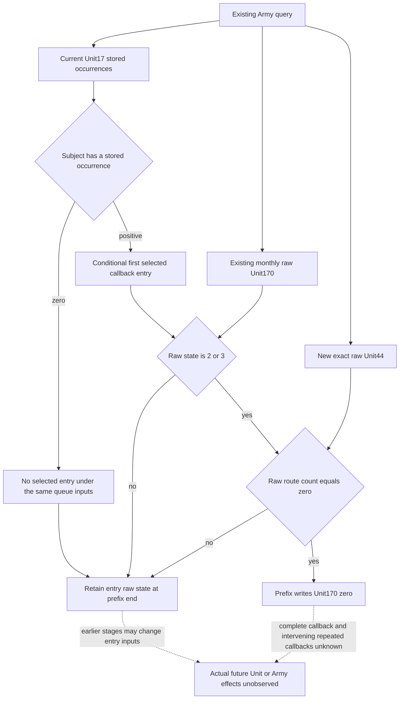

# Conditional CUnit NewDate entry normalization in CK3 1.20.0.4

This extends the existing Army-strength MCP with the raw route-count operand needed to model one native CUnit entry prefix. The independently qualified current queue is [documented here](army-current-unit-new-date-schedule-inputs-12004.md). The new decision value is the conditional raw `Unit+0x170` immediately after the first selected NewDate callback's entry prefix. It is not the full callback's return state or an observed future frame.

Target: CK3 `1.20.0.4`, Steam `25734779`, executable SHA-256 `98702F88A547CDE2EAF29A85F93B85F68EE4CF8148336A4F7AFAEB75319DD518`. Current queue source and its Native/Service FIRST qualification are reused from Root25; this owner has not loaded them into a game. Local CK3 operation is prohibited for this work package.

## Source first and the needed value

The actual `.4` Unit-manager method `[0x2AD66E0,0x2AD678E)` and outer receiver source-use `[0x22A1D30,0x22A1D44)` are already closed. For each native-admitted stored Unit occurrence, the direct call at `0x2AD674E` reaches `0x24AB6B0`. Matching stored IDs alone do not reproduce the generation, Unit tag and full-ID checks preceding that call.

The held old callback source is `Z:/ck3_mod_rewrite_process_assets/g2-parallel-20261006/army-supply-tick/followups/disembark-entry-follow-on/cached-unit-movement.asm.txt`, lines 1–10, emitted from the retained `unit-update-fragments.json` cache. Its first 39 bytes `[0x24AB6D0,0x24AB6F7)` contain the complete entry predicate and ten-byte write. The old reference is extracted verbatim from byte-bearing emitted instructions. No old executable was reread and no assembler reencoding occurred; a separate original raw39 file was not held. The origin is `cunit-conditional-next-effects/native-lane/OLD-ENTRY-PREFIX39-ORIGIN.json`.

Root authorized one cache-first actual `.4` read. The first execution succeeded in 2.1739491 seconds, read 39 new bytes once, and preserved all instructions, ordered edges and local control topology. The receipt is `Z:/ck3_mod_rewrite_process_assets/g2-parallel-20261007/next-supply-effects-source24/cunit-conditional-next-effects/native-lane/ACTUAL-ENTRY-PREFIX39-RECEIPT.json`; `entry-prefix39-root-first01/FAMILY-MAP.json` and `current_unit_new_date_callback_entry_state_route_zero_prefix-DETAIL.json` record the actual complete span `[0x24AB6B0,0x24AB6D7)`.

Actual instruction roles are: `0x24AB6B6` loads DWORD `Unit+0x170`; `0x24AB6BF` subtracts two; `0x24AB6C2` compares with one; `0x24AB6C5` branches above to the prefix end. `0x24AB6C7` compares DWORD `Unit+0x44` with zero; `0x24AB6CB` branches when nonzero. `0x24AB6CD` writes DWORD zero to `Unit+0x170`, ending at `0x24AB6D7`. Thus the prefix changes raw state 2 or 3 to zero exactly when raw route count is zero. Negative route count is nonzero and does not take this write. The prefix reads no date or day-index operand.

Raw state is already observed as `monthly_loss_budget_inputs_v1.unit_native_170_raw`. `current_movement_progress.unit_state_raw` is a different getter result and cannot replace it. Raw signed `Unit+0x44` is not published in the existing Army-strength row. The separate world-snapshot `route_source_count` has validity and capacity checks, so its array length cannot replace this raw predicate operand. Only raw count44 is added; CArmy supply, consumption, attrition and refill calculations belong to the supply owner.

## Minimal raw and conditional contracts

The optional raw row family is `current_unit_new_date_callback_entry_inputs_v1`. Its nine keys are `schema_version`, `source`, `capture_boundary`, `status`, `ready`, `unavailable_reason`, `subject_army_id_u32`, `subject_carmy_id_u32`, and `unit_route_count_i32`. The source is `native_current_unit_new_date_callback_entry_inputs_12004`; its boundary is `current_query_before_unit_new_date_stage`. The exact `.4` binder only enables a readonly load, never a native NewDate call. Same-row subject IDs and the native caller's current Unit tag/full-ID role identify the raw receiver. A failed native type admission retains the original Army row and known IDs while leaving count44 null.

The pure projection joins the new raw count with the current Unit17 queue and existing raw state170. It exposes `conditional_unit_170_raw_after_next_new_date_entry_prefix` at `first_selected_unit_new_date_entry_prefix`. A positive stored occurrence allows the source predicate to be applied to the explicitly supplied entry inputs. Zero occurrences retain the current raw value under the same-queue condition and indicate no selected subject entry. Unavailable inputs remain concretely unavailable. The projection does not interpret the numeric state as a different native getter enum.

The conditions are explicit: the stored queue, native registry admission, receiver identity and entry state/route-count inputs must remain those supplied for this conditional evaluation. Earlier daily stages and earlier stored occurrences are not reconstructed. Only the first selected entry prefix is modeled. The full callback can change the state or route before a repeated occurrence; multiplying writes or threading a prefix-only result through those unknown full callbacks would be unsupported. Source-derived next fullCDate64 metadata may be carried when already available, but it is not an admission gate for this date-free prefix.

`current_unit_new_date_entry_normalization_v1` is appended through the real Service `execute_step` Army query and the direct Army facade, using the existing response's queried snapshot/revision provenance. The production `.4` adapter's shared collector receives the raw count family. Native business values and command arguments remain intact; older packets that omit the new family remain accepted. Other steps retain their behavior.

## Qualification boundary

Prepare one fresh native whole producer and one sole registered Driver/Service compound covering state2/state3 with empty route and repeats, nonempty route, negative raw route count, zero subject occurrences, and native typed unavailability. Each fresh whole result comes from the genuine common Army collector and production serializer. The consumer must exercise registered `ck3_execute_step` before the direct tool, retain original native bodies, and use the observed public revision separately from native revision. No previous Unit17 or calendar FIRST is replayed.

The source candidate includes the raw DTO, exact-build readonly binder, common Army collector/serializer hooks, strict normalization, both Service routes, and one new whole qualification compound. Native and Service FIRST are NOTRUN and reserved for Root. Full callback effects, actual future movement, arrival, Army supply effects, full daily/monthly readiness, game operation, saved-day and OODA credit remain false.
