# CK3 1.19.0.6 原版事件知识 Registry

## 2026-10-03：Robert 新15 `feast_main_live_fowl.9002` 单选 host farewell

v22 正式普通下一回合真实推进3天后，新自然instance15在暂停raw53222376出现。唯一closed typed receipt为 `m7-robert/ewan0801-following-normal30-b594-v22-actual-01/turn-002/natural-event/002-ck3_query_current_event_window_context_v1-service-receipt.json`，SHA `5537F69FEBF56AEA11E0AD6074EA8B0939966EF32F4850295703AFBCD803335D`：exact key **`feast_main_live_fowl.9002`** / calculated4849002 / runtime7525，native8/public5，root29829。它不是凭10日延迟猜测的`.9000`。snapshot authored1与rendered1一致，native0/API1显示启用，label“我们，应该经常这样！”；six saved scopes为activity、host、province、fowl_dinner_target37636、fowl_bird_chaser36907、host_saying_goodbye29829。root=host=host_saying_goodbye，target/chaser是当前动态身份；activity/province继续opaque。压力实际0；icon stress-decrease幅度unavailable、效果集合不完整，不据此推收益。原knowledge003仅 `event_definition_key_not_registered`，原15未提交选项、0新增日。

我方policy前已冻结exact CK31.20.0.3/Steam25652598/EXE94B55397…DE02A6原版树：`m2-events/actual-robert-fowl9002-blocker-01/source-evidence/stock-source-exact-12003.json` SHA `EED31AA2C40C6BE803B9AE13F3D8C90C9BC8AC807F7854AD80BA83BC70D18ABF`、`native-source-tree.md`及完整event/direct caller/value/简中英文loc。`events/activities/feast_activity/main_events/feast_main_live_fowl_events.txt:652–683` wholefile SHA `159C17409D07B6F6D8307D58522FBF066F90E895B25DC64BD97AEE77D7202C56`；原CRLF key-token到末brace不含随后newline block SHA `01129EB3EAA7A318B5625FD4E2FFB0A91D37F8A439058174EFA305268F7CAD1D`，LF规范化 block为 `AFF4E0659231D9208E5E979B4C1B3943C44D468ABCA0100F1C4A6F062F449144`，明确区分两者。只读直接`.9000` caller的527–541保存host_saying_goodbye及605–608 host dispatch，不扩其余ending链。

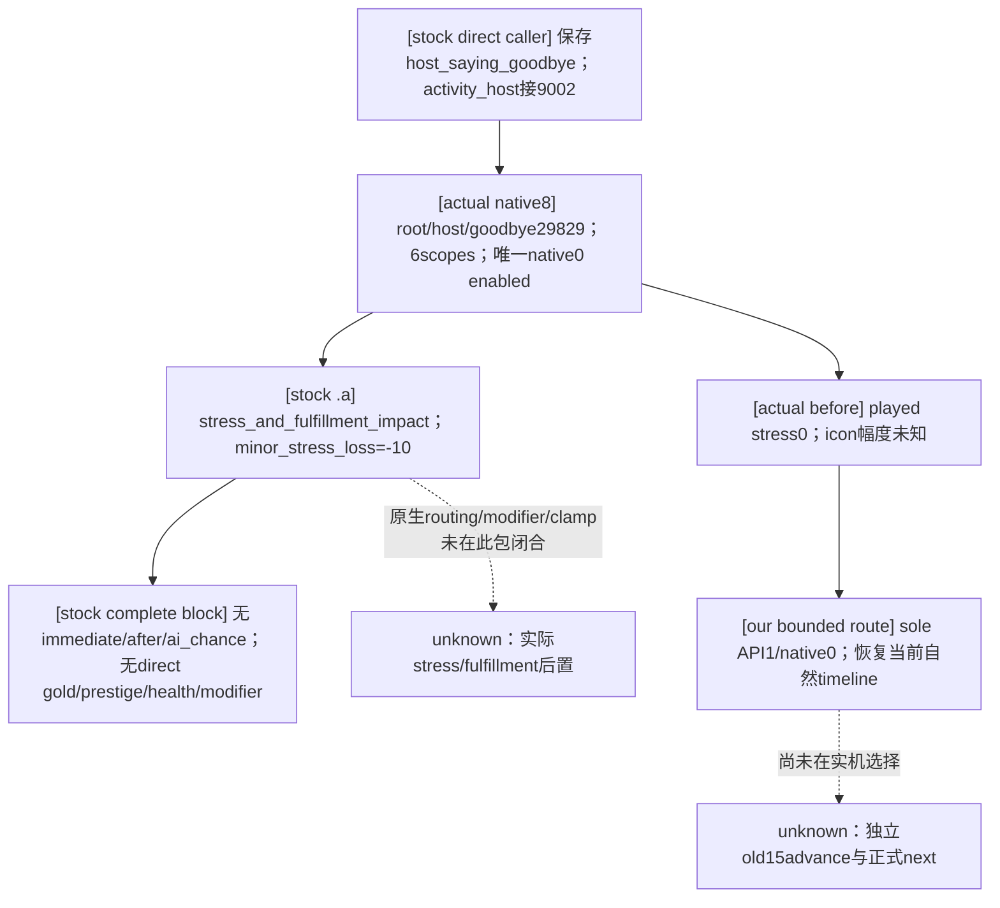

sole `.a:676–681` 的完整游戏effect只有 `stress_and_fulfillment_impact = { base = minor_stress_loss }`。直接value `common/script_values/00_stress_values.txt:13` **minor_stress_loss=-10**，不是同文件另一个minor_stress_impact_loss=-15；file SHA `821A0B77244FC5EE2D87D339CB24DBEF00787B83D44EC2DF9215FC1A93AEC2D4`。原block没有trigger、immediate、after或ai_chance，description的first_valid bird-killer文案选择不增加effect。该原生effect的最终stress/fulfillment路径及夹限不由源码base替代，当前stress0不预写actual−10或任何fulfillmentdelta。

只登记实际`.9002`六scope、root/host/goodbye关系和sole0；不固定target/chaser ID，不注册`.9000`或其它兄弟结尾，不加stress0门禁、observer、native/DLL或service修改。非空source-reviewed effect profile保留 `observable_postcondition=None`，当前材料未知不妨碍已明确唯一合法选项的bounded continuation；M2已由此前三事件合同闭合，本实例不凭ACK或source数值增加M2材料信用。本包fixture/实际选择状态分别随下方交付记录更新，未重跑旧`.0801`/`.2001`/Rite cases。

本包 **static-ready**：既有 `test_vanilla_event_registry_policy.py` 只新增 `test_fowl9002_actual_host_farewell_uses_service_and_observed_advance`，唯一首次实际执行 **GREEN1/1**（attempt01，0failure/0error）。真实native8/public5六scope/sole0经normalizer→knowledge/classifier→ordinaryplan API1/native0→现有service显式instance/revision→native-driver独立合成old15gone、同actor/datepaused；fixture压力0保持、材料None，没有模拟−10或fulfillment变化。三module overlay只含新leaf/registry/policy，其余outcome/strategy/service/driver使用immutableb594，旧cases未重跑。完整patch、baseline/current pins、sole测试argv/log在 `m2-events/actual-robert-fowl9002-blocker-01/python-compatibility/`，ROOT发布Python新freeze后才实际消费原15；b594 native/DLL及现会话原权限可复用，不需新build。本条fixture不授live/材料/Feast终态信用。

## 2026-10-03：v22 选择后 cold、正式 next 与原 G2-M2 合同闭合

ROOT 从原14选择后的正常配对检查点 h4151 恢复 v22，新 PID119508（由 ROOT managed lease 证明；finite DTO不伪填PID），同 Robert29829 / ordinary episode `native-29829-2bc2d599f7f9`、暂停 raw53222304，Python/native/environment `b59464e0`。已closed七capture中只提取M2三query和初末有限snapshot；Sway004–007由peer处理，未重复读取。初末均native4/public2、active_event/pending=null，原14及13未再现；recipient35466→29829总opinion仍60、34730→29829仍61，宗教fulfillment仍raw500000/scale100000=5，Rite152/Faith23/Religion8/mainRite152、keys/fervor6808550不变。此cold保留选择后材料，不计第二次+20/+5、不重选事件。唯一摘要 `v22-post-choice-cold-next-recipe/cold-material-summary.json` SHA `0FF5818DFEDA625C0E5054737A4AA9297CD645BE1E4B86DC7677637D7AD21EEB`，15/15 actual checks。

随后同v22正式普通turn1从native5/public2、同日无原14/13出发，`life-advance` **executed**，独立native8/public5/raw53222376仍paused、同actor/episode，实际 **+3days**。原14没有回来；新的自然15是typed `feast_main_live_fowl.9002`，不是猜测`.9000`。checkpoint **saved h4156**，save85706043B/SHA `B138CF4661E1E2509727CC4935DD5FCBA686863C5EDF974A437E24FBF900DC92`，driver50071248B/history4156/SHA `FD37C1D6FCF556F88F7867F0900681E6F654C603D8FBBBECA9107FBCE6E74EAD`（下方完整pin以receipt为准）；save/driver大文件复用closed receipt，未重读。请求30日尚未完成：整批status仍`existing_consumer_not_ready`，turn2被新15的`event_definition_key_not_registered`停住，原15未提交任何选择。该新leaf缺项不抹去原14的actual next和配对保存，也不冒称wholebatch GREEN。

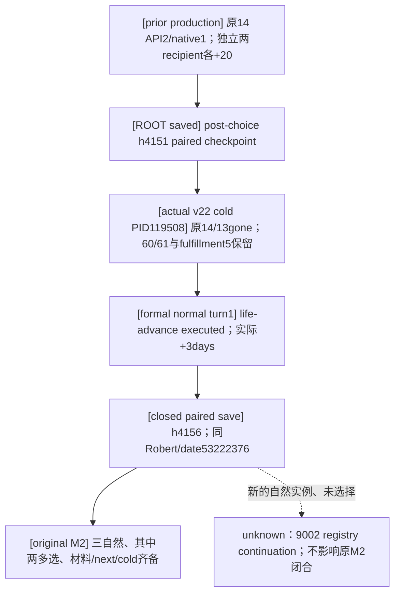

沿已核一次的原handover / G2-M2 visible outcome及原执行合同，当前可授 **G2-M2 complete**：同Robert episode选取 `.7002` 单选（actual prestige+35、next）＋Rite `.0010` 三选（actual fulfillment+5、next1day及new-PID保留）＋Ewan `.0801` 三选（actual两opinion各+20、选后cold及next3day/保存）。两种不同多选均有真实材料和完整生产循环；fowl `.0003` 的health+.5/next6day是额外已有样本，不需以它补两个multi。原合同没有要求已完成post-choice cold再在next之后重做第二cold，不新增这一门禁。M2的完成不提升M6整场Feast、Family、war或整个30日窗口；generic material profile仍None/unavailable，helper provenance false及named-friendliness未发表仍原样保留，这些不否定独立现成MCP已观测的材料。

原v21 following fallback01/02的共享mailbox SEH512 **0turn0day** RED、原unregistered/冷hidden视图与harness失败都保留；没有把ACK、stock数值或fixture当实际收益。最终一次合同assessment和当日fields位于 `m2-events/actual-robert-feast-0801-blocker-01/actual-b59464e0-v22-complete/M2-FINAL-CONTRACT-ASSESSMENT.json` 与 `REPORT-FIELDS.json`，旧各阶段fields保持原历史状态。中央ledger/ROOT负责更新machine status、commit/push和这3天计数，本包不重复增加days、不修改中央报告；未运行SDK、游戏或旧测试。


## 2026-10-03：Robert `.0801` 一次选择、两项关系实测与原宗教材料冷保留

ROOT正常恢复v21新PID96348、同ordinary episode `native-29829-2bc2d599f7f9`，Python `38b43747` 与native/environment `6443` 分列。原14随后在现成生产consumer消费一次：`robert-ewan0801-38b43747-actual-select-01/result.json` closed `event_selected_material_recorded`，三个actual native均可见合法，选择API2/native1，`native:7`/public2→独立`native:8`/public3。原14消失、active_event=null，同actor29829/raw53222304/paused，postcondition_verified=true。压力仍0，gold/prestige未变；没有把stress-decrease icon或源码贡献写成实际减压。

独立关系材料复用Feastowner四query的唯一extract：`m6-feast/robert-feast/actual-2026-10-03-event14/actual-relation-01/actual-relation-summary.json` SHA `E95BD0C3D6B56E149D1BB487E9CBA1E7CBE4FC62BD5DD91EBEBC037852329368`，没有重复提取四raw。PRE native4同日、POST native9同日，recipient35466对actor29829总opinion **40→60/+20**，recipient34730对actor29829 **41→61/+20**，均observed/read-only、query-post绑定一致。这是两项实际总opinion变化，不是填入源码期待；已发表fixed3 modifier rows仍合法absent，friendliness不在该named-row接口中，不能伪造named modifier已独立读出。完整来宾数、其它人出席、活动终态或终局奖励没有因此获得信用；原generic material profile仍None/unavailable，helper provenance/credit false也保留。

独立宗教材料冷保留是另一层：原13在PID94488已实测fulfillment0→500000/+5，正常下一回合+1day并保存h4139；ROOT后来从正常h4140/六账本配对恢复到PID96348。该新PID的现成registered religion POST第3query `ewan0801-v21-relation-post-and-religion-01/003-ck3_query_player_religion_context_v1.json` available/read_only、native9/raw53222304/actor29829，fulfillment仍raw500000/scale100000，Rite152/Faith23/Religion8/mainRite152、keys与fervor raw6808550均保留，原13未再现。此读数发生于当前`.0801`选择之后，记录的是新PID中实际标量5，不计第二次宗教+5；v21冷恢复发生在`.0801`选择之前，因此也不冒充本次新增opinion的选择后cold验收。

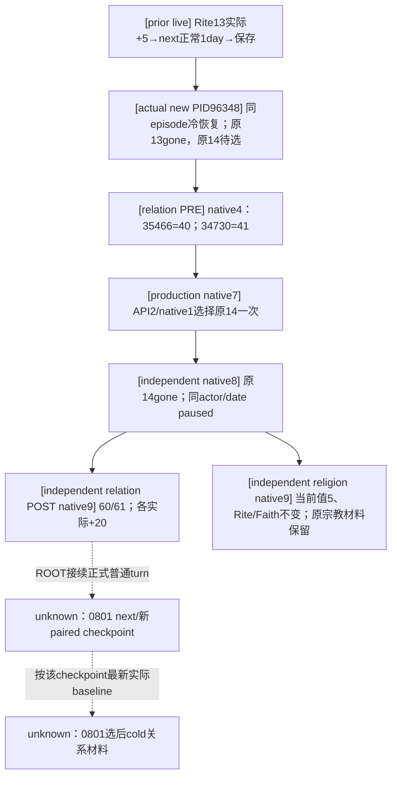

按原handover M2行与 `g2-requirements-v1.json` 的visible_outcome核一次：要求三个真实自然事件、其中两个多选及材料变化；原执行专题还要求两种真实场景的typed action→独立材料→下一正式nonwar turn→paired checkpoint/cold。当前同Robert episode已具备`.7002`单选/+35与next、fowl`.0003`单选/health+.5与next、Rite`.0010`三选/+5与next及新PID材料读数，以及本次`.0801`三选/两opinion各+20；两种不同多选的实际材料样本已出现。本次能力为 **production-live primitive**，当前准确余项是`.0801`选择后的actualnext、新paired checkpoint及选择后cold材料，尚不写whole M2 complete，也不新增通用observer、named-friendliness字段或“不同活动/不同领域”等门槛。

最小后续cold材料沿现成口即可：在ROOT最新正常checkpoint保存同actor/date的35466/34730总opinion baseline，正常新PID恢复后独立snapshot证明旧14未再现，分别调用existing `ck3_query_activity_feast_guest_opinion_private_v1` 对两个recipient向actor29829的当前总opinion作同日warm/cold比较。中间正常时间可能使friendliness衰减或其它意见变化；baseline用最新实际值，不硬钉历史60/61、不要求再+20、不重选14。专题字段与原合同核对落在 `m2-events/actual-robert-feast-0801-blocker-01/actual-38b43747-v21-closed/REPORT-FIELDS.json`、`closed-packet-assessment.json`、`M2-CONTRACT-REVIEW.json`。未重跑旧路径、两个GREEN测试或任何SDK；Feastowner独占其收益专题，中央day数本包新增0。

## 2026-10-03：Robert 当前宴会 `feast_events_ewan.0801` 最小关系路线

原宗教13消失后，正式普通回合推进一天，原生新14在暂停raw53222304出现；首次 consumer closed `existing_consumer_not_ready`，原实例保留且未选择。已复用唯一实际query：`rite0010-following-normal30-6443-actual-01/turn-002/natural-event/002-ck3_query_current_event_window_context_v1-service-receipt.json`，SHA `124CD1F98D8C3E156DE5BABB8F9D7E58065753CB3E4640B47C8A01DAA49AA82F`。typed key `feast_events_ewan.0801`、instance14/calculated1340801/runtime550，native31/public5；root=host29829，saved scopes为activity、host、province、fellow_guest_1=35466、fellow_guest_2=34730。activity/province身份保持opaque。basic authored3与typed rendered3一致，native0、1、2均shown/enabled，当前压力0；前两项icon只给stress decrease、不提供幅度或完整效果，第三项空rows也不代表无效果。

原版树在我方policy修改前落盘于 `m6-feast/robert-feast/actual-2026-10-03-event14/source-effects/source-tree.md`，并同步 [Feast原生树](ck3-1.20.0.2-feast-guest-rule.md)。exact current CK3 1.20.0.3/Steam25652598/EXE94B55397…DE02A6，`events/activities/feast_activity/feast_events_ewan.txt:1516–1866` 文件SHA `6B040A05457D879EC733CD887A06CAFDC427F196E1B9E95B8C111778CF5C34E6`，完整raw token blockSHA `511C54E289BD36EB746377F99633FCF6982C6C8B42CA14ACEA7FEEB7607D5EE2`。最终source-effects REPORT SHA `8694C5EFB4454D7418AEB8E714B7E79549FD4FE82355C5EAA8B39B9F4A2DCB7C`，direct-dependency-pins SHA `289AD22EA60A32951264D5AD9A12C2F58468D5F92791341BE8A42B4A5390A016`；只读取此实际事件与三个直接values/opinion文件，未扩其它caller或新PE审计。

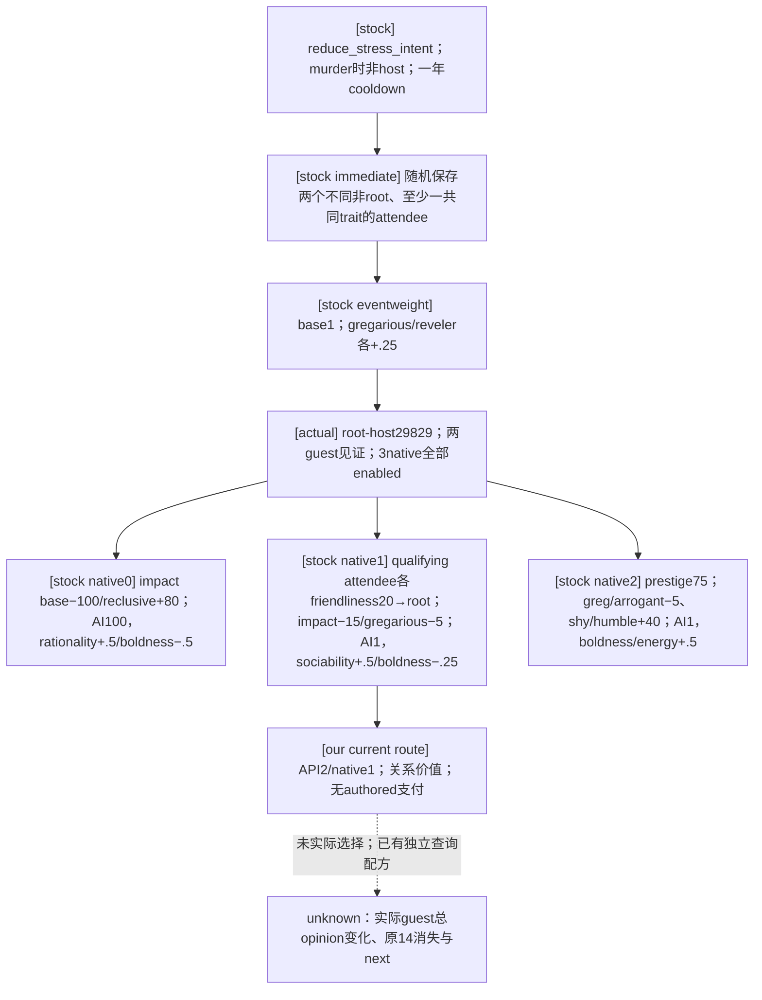

`.b` 在 `scope:activity.every_attending_character` 对**每位**非root且至少一共同trait的实际attendee执行一次 `add_opinion(target=root, modifier=friendliness_opinion, opinion=20)`；不是每个共同trait加一次，也不限于两位portrait scopes。两位当前fellow是immediate所选attendee见证，未把总受益人数假定为2，也不据此授其它被邀请人物出席信用。friendliness定义为monthly_change0.1、decaying=yes、stacking=yes；event与modifier没有显式duration，native默认duration未推断。没有common after或直接follow-up key。`stress_and_fulfillment_impact` 是原生处理的作用：-100/+80、-15/-5、-5/+40是源码贡献，最终stress/fulfillment受处理、modifier、夹限影响。native2 `minor_prestige_gain=minor_prestige_value=75`，不能沿用其它Feast事件的35。

原树落盘后，ROOT按当前Robert关系目标授权 `.b`/native1/API2；当前stress0，额外减压不能提前写成实际收益。native0是更强减压路线但有reclusive贡献，native2是带trait-stress取舍的prestige路线；我方不为凑材料样本改选更容易比较的prestige。AIbase100/1/1及其全部personality权重已列为输入，未把初始base当最终selector或宣称此关系策略全局最优。只新增当前 `.0801` 的五scope/三选项合同、`.3` dispatch、现有有限relational-scope入口，不固定guest ID、不注册未来事件、不改变service/native/outcome。

本包 **static-ready**：唯一新增现有full-route方法 `test_feast_0801_actual_three_options_select_second_and_observe_advance` 首次实际执行 **GREEN 1/1**，采用真实native31/public5与五scope，经normalizer→knowledge/classifier→ordinaryplan→service API2→native-driver独立合成原14gone、同actor/datepaused；压力0保持，没有模拟opinion、资源收益或后续事件。首次runner attempt01在case执行前因import路径断言产生harness RED（0tests），冻结保留；只修3module overlay导入，attempt02执行唯一case，没有重跑旧Rite或Feast suites。材料profile非空，`observable_postcondition=None`，不虚构general relationship comparator已接入。

ROOT可复用现有 `ck3_query_activity_feast_guest_opinion_private_v1(guest_character_id=35466或34730, expected_revision=<fresh public revision>)` 做recipient对当前actor29829的独立总opinion PRE/POST，精确config为上述M6目录 `root-relation-pre-sdk-calls.json` 与post副本；现有named fixed3 rows不含friendliness，因此不能把总delta或源码20冒充已发表named-modifier读数。本包交付于 `m2-events/actual-robert-feast-0801-blocker-01/python-compatibility/`，当前静态fixture不授新live、实际+20、M2、终态或完整Feast奖励信用；ROOT发布freeze后才一次消费原14并独立verify。

## 2026-10-03：Robert 原 `rite_growth.0010` 一次选择与独立精神满足度 +5

ROOT 使用已发布 Python `6443a516`、现有 native/environment `4ee`，在同一 Robert ordinary episode `native-29829-2bc2d599f7f9`、PID94488 消费原自然 instance13 一次。现成生产 consumer 的 closed result 为 `event_selected_material_recorded`：实际 typed key `rite_growth.0010`、calculated3910010/runtime5952，七个 saved scopes 沿用已审阅合同；snapshot authored3、三个 rendered/native0、1、2 均显示启用，选 native0/API1。选择前 `native:24`/public2，独立选择后 `native:25`/public3；原13消失、`active_event=null`、同actor29829/暂停raw53222280，postcondition verified。原generic effect preview仍不完整，stock `ai_chance` base100/0/0 只是已审阅初始权重，未声称最终引擎 selector 或全局宗教策略最优。

材料另由现成 registered MCP `ck3_query_player_religion_context_v1` 读取：真实 PRE native23、fulfillment raw0，独立 POST native26、raw500000，scale100000；同actor29829、同raw53222280、不同capture epoch，均 `available=true/read_only=true`。因此本次实际增量为 **+5**。两次 Rite152/Faith23/Religion8/mainRite152、fervor raw6808550及其keys均未变；没有把独立 player context 的身份填进事件 opaque saved scopes。此前 exact-build 研究已证明脚本 base5 经gain/loss modifier和上下限夹限，本次实测+5只描述这一次，不据此取消其它帧的modifier/clamp语义。

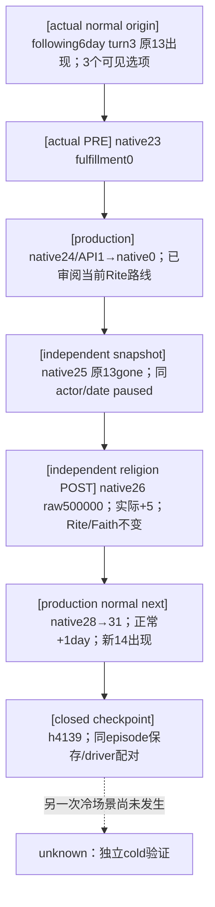

能力由 static-ready 经实际选择与独立材料验证，升为本事件的 **production-live loop**：ROOT随后现成普通回合起点 `native:28` 仍同actor/raw且无原13，选择 `life-advance`，终点 `native:31`/暂停raw53222304，实际 **+1day** 后新 instance14 出现。请求30天并未完成，closed status `existing_consumer_not_ready` 属于新14 `feast_events_ewan.0801` 的知识缺项，不是原13再现；新14尚未选择。正常stage是 `m7-robert/rite0010-following-normal30-6443-actual-01/result.json` 及 `turn-001/result.json`，checkpoint h4139/saved，同episode保存85752395B/SHA `B6486A6A55BD7A4B3DA8269AB80B2C6197A01A3484BCB441FCE59A0C8E3C5317`，driver49943552B/SHA `C1E512C5C7389D18339E6977125D67A1D3638A2732062B000C252DEBB775406C`。这些大文件的hash复用ROOT closed receipt，没有再读save/history；该1天由中央ledger计数，本assessment不重复增加天数。

原 natural adapter 的 `production_material_expectation=null`、generic `metric=null/status=unavailable/current_selected_choice_material_profile_unavailable`、helper `natural_provenance_verified=false` 和 `new_live_milestone_credit=false` 原样保留；外部实际宗教pre/post证明并不冒充通用材料比较器已经接入fulfillment。该自然三选项实例可作为多选材料样本候选交ledger核算，但不自动完成M2的两种多选、独立cold场景或整体合同；当前原事件的next消费已由上述正常+1天闭合。

本次有限离线 assessment 位于 `artifacts/g2-maintainer-2026-10-02/resume-12003/m2-events/actual-robert-rite-growth-0010-blocker-01/actual-6443a516-closed/closed-packet-assessment.json`，当日字段为同目录 `REPORT-FIELDS.json`；input pins覆盖 selection result、独立PRE/POST、adapter-input及后续正常stage/turn。实际选择目录是 `m2-events/robert-rite0010-6443a516-actual-select-01`，PRE/POST为 `m2-events/robert-rite-fulfillment-before-01` 与 `after-01` 的 `001-ck3_query_player_religion_context_v1.json`。选择包自身checkpoint仍只继承既有seq4/`submitted`，新的paired save/driver证据来自后续closed stage。本次未读巨大history、未重复SDK/游戏动作或已GREEN fixture；原unregistered RED、组包metadata失败及离线parser首个status枚举误用attempt均保留。parser把真实recommendation `recommended`误写为期待`available`，其余原事件21项成立；这只是报告器标签修正，不是生产能力RED。

## 2026-10-02：宗教开放后的真实 `rite_growth.0010`

用户已经明确开放全方位深入宗教研究并撤销旧宗教暂缓要求；以下当前事件不再沿用该限制。ROOT 与其它 owner 维护全局旧限制清理，本包只修复 Robert 当前自然 instance13 的实际消费缺项，不抢共享迁移或中央报告文件。

正式 following6day stage 的 turn3 原生查询 available：`rite_growth.0010` / instance13 / calculated3910010 / runtime5952，原 DTO native19/public6，actor29829、raw53222280、paused；closed checkpoint 的随后 native20 不替换原同帧 binding。snapshot authored3，typed rendered/native0、1、2 均 shown/enabled。七 saved scopes 为 `origin_faith:faith`、`source_rite:rite`、`founder:character`、`bg_override_char:character`、`rite_growth_target_share:value`、`new_rite:rite`、`differing_doctrine:doctrine`；两个角色均为36108，非角色 payload 仍 opaque。当前0有 fulfillment-increase indicator，magnitude unavailable；query并未提供完整效果预览。原小 query SHA `BC8A6653B4583B894FBC7434CD9D767D34E8F34B16CB05790CDE8311AD73A802`，finite turn SHA `BDF5FAF7BD3758B95E99DC40B4A527F750282C825401BEB397F17D86783D54FE`；没有读取112MB snapshot/driver history或提交选择。

施工前冻结的原版输入为 exact CK3 1.20.0.3 / Steam25652598 / EXE94B55397…DE02A6。`events/religion_events/rite_growth_events.txt:73–413` 文件 SHA `D09C0EB94E1A81C0D456F55C049004D7EF1EBE38464A1274CF151D0214418895`；SourceTree key token到末brace、无随后换行的完整 block SHA `ECDB6AD5179B47CFFC2114A3030A1CCE5F9231ECEC29CED3DC4B64A961AB4E42`，本文件 raw/LF一致。直接 `.0001:14–68`、必要 script effects/triggers/values/opinion 及简中英文 loc 已冻结在 `m2-events/actual-robert-rite-growth-0010-blocker-01/source-evidence/stock-source-exact-12003.json`（SHA `7AC4375FB419A4ACE5F41C8B29D03B3F734B470D9EBA8DB3F5C0E69CC86FE1AE`）；只审阅当前事件及实际选择比较所需依赖，不以宗教全域开放为由给未出现事件预登记。

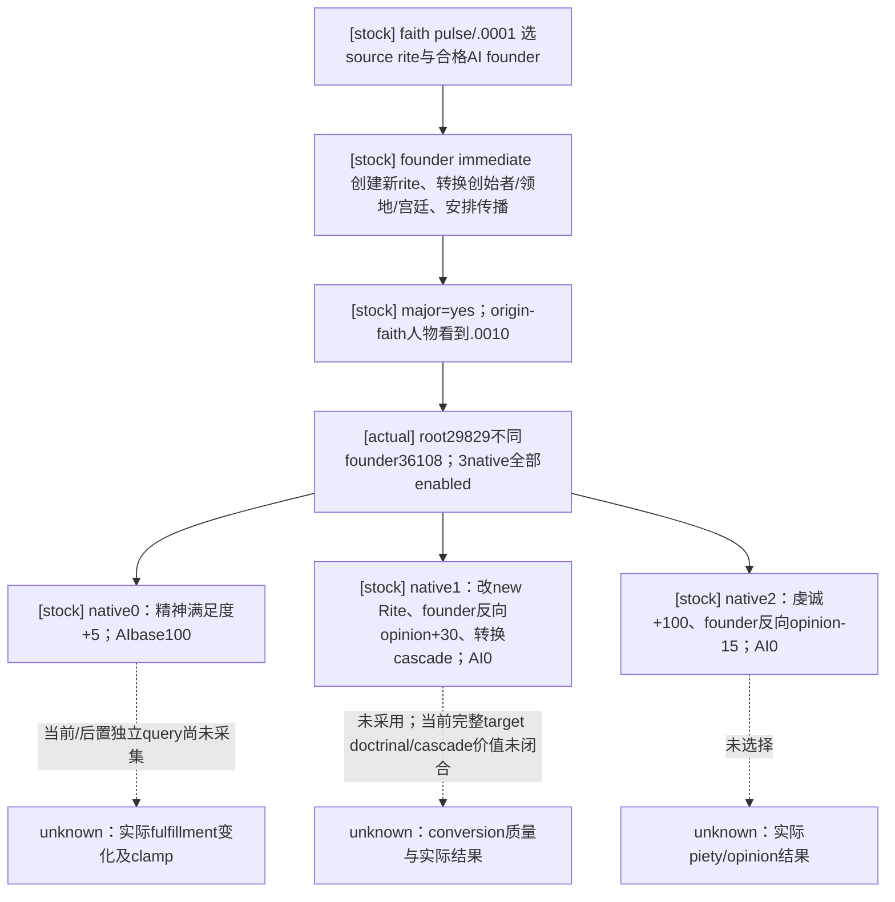

原 `.0010` founding immediate `138–324` 处理预算/分歧、新rite、创始者转换、herald与领地/宫廷，并在4–7天后安排 `.0011`；它在选项前发生，当前玩家不同于 founder，不把其中的创建/转换归给玩家点击或推断玩家已转换。该事件没有 common after。native0 `326–332` 仅 `change_spiritual_fulfillment=5`、AIbase100；native1 `334–399` 排除faith/rite heads，`set_character_rite_with_conversion=new_rite`，founder对root好感+30、十年recent-conversion flag和county/court cascade，AI0；native2 `401–412` 给medium_piety_gain（当前base100）并使founder对root contempt−15，AI0。`.b` 的 `custom_tooltip` 包含实际执行脚本，不能按 `show_as_tooltip` 当作纯展示。Rite与Faith是不同身份，改Rite不能笼统等同于改Faith。

原生树落盘后，ROOT按当前Robert目标授权 native0/API1：保留当前Rite、不制造对founder敌意，获取源码定义精神满足度正效果；这是有界当前路线，不宣称完整宗教策略最优或引擎采样AI等价。native1转换价值比较所需当前doctrines/tenets、转换回调和受影响人物/领地尚未闭合，将来该策略需要它们时补观测；它们不阻断当前明确的0选择。只登记此实际七scope/三选项，不固定founder ID，不借其它查询填造opaque payload，不提前注册`.0011`。

材料使用现有 `ck3_query_player_religion_context_v1(expected_revision=<fresh public revision>)`：正式normalized MCP DTO直接提供顶层 `spiritual_fulfillment_raw/raw_scale`，native envelope才位于 `player_religion_context` 内；signed合法0保留，当前scale100000。当前native4ee已发布，现有CLI `--private-player-religion-context-query` 是read-only入口，无需DLL重编；旧exact .3 SDK176成功只证明入口可用，不替代本实例pre。复用 [材料查询专题](religion-native-ai-effect-material-12003.md)；native owner已定位脚本effect先经gain/loss modifier，再由runtime bounds夹限写回，所以源码+5不保证raw+500000。ROOT会保留同actor/datepaused的pre、一次typed choice及独立post，按实际delta核材料；indicator、ACK与instance消失不替代真实值。通用event材料比较器当前不覆盖fulfillment，profile expectation保持None，外部独立材料与general observer readiness分开记录。

本次单项登记已 **static-ready**，唯一新增 existing generic-registry full-route 方法首次 **GREEN，1/1**：保持原真实native19/public6、七scope和三个可见选项，经normalizer → knowledge/classifier → ordinary plan → service API1 → native-driver独立合成old13advance、sameactor/datepaused。没有模拟fulfillment增加、转换或后续传播结果；generic material expectation仍None。原Feast或宗教旧测试未重跑，receipt在同包 `python-compatibility/focused-checks.json`。三production触点为独立 `.3` religion leaf、现有 `.3` dispatch 和有限relational-scope key入口；service/native/outcome/旧版本数据没有本包改动。

ROOT已用现成permission plan闭合当前真实pre：`m2-events/robert-rite-fulfillment-before-01/001-ck3_query_player_religion_context_v1.json`，normalized `available=true/read_only=true`，native23/同actor29829、pausedraw53222280，fulfillment raw **0** / scale100000，Rite152/Faith23/Religion8，fervor raw6808550。合法0不作missing，也不把这些独立player宗教身份塞入generic event的opaque savedscope。当前新leaf尚待ROOTcommit/push/freeze和原13一次生产选择，post材料及下一正常回合尚未发生，本段不授live或多选M2 credit。

## 2026-10-02：Robert 自然活禽宴会 `feast_main_live_fowl.0003`

正常 `.2001` 消费后推进四天产生的新 instance `12`，首次正式读取在 `feast2001-following-normal30-242-actual-01/turn-001/natural-event/result.json` 返回 `existing_consumer_not_ready`；原 result SHA-256 `0E85C592E8E0209FFC7E7DE6F2A631E4A58F0E1908DC3C9BD87B3FBFFECDC339`。这是 Python242/native716 的 registry 缺项，不是原生窗口读取故障：typed key `feast_main_live_fowl.0003`、calculated ID `6040003`、runtime ordinal `10287`，`native:62` / public revision `2` / `date_raw=53222136`，root=host=玩家 `29829`。saved scopes 为 `activity/host/province/fowl_dinner_target/fowl_bird_chaser`；两个实际人物为 `37636/36907`，不作为固定合同 ID。activity/province typed payload 继续 opaque。basic snapshot authored count `1`，唯一 rendered/native `0/0` 显示启用，API option `1`；中文 resolved label 为“啊，没有恶作剧的宴会可不完整。”。此 RED 没有提交选择或推进时间，原实例保留。

以下原生树在修改我方消费路线之前冻结：CK3 `1.20.0.3` / Steam `25652598`，EXE SHA-256 `94B55397ABB687A3DCD436805A5D885E6BE90FA6C693FEB44A9E3BBEEADE02A6`。`events/activities/feast_activity/main_events/feast_main_live_fowl_events.txt:233–319` 全文件 SHA `159C17409D07B6F6D8307D58522FBF066F90E895B25DC64BD97AEE77D7202C56`；SourceTree 从 key token 到末 brace、保留原 CRLF 且不含随后换行的 block SHA `E54265F7CE985EDD3FE79CCAFFD4C888979E0FB00F9E9D6DB1E411D9B42F62DA`，LF 规范化 token block SHA `DD2776B8B86A91120C16CFB06E5B97F71CB7B8F5831F675E6BB065BD7CFB3990`，二者不能混用。最小完整 source ledger 与原生树落在 `artifacts/g2-maintainer-2026-10-02/resume-12003/m2-events/actual-robert-following-natural12-242-blocker-01/source-evidence/stock-source-exact-12003.json`（SHA `3E29B6B12FACFF805A117DB8704E1E1E5A53219AA26285998A5E0CA2BAE94AFB`）；简中、英文定位均复用原 key，未创作或更改原版文案。

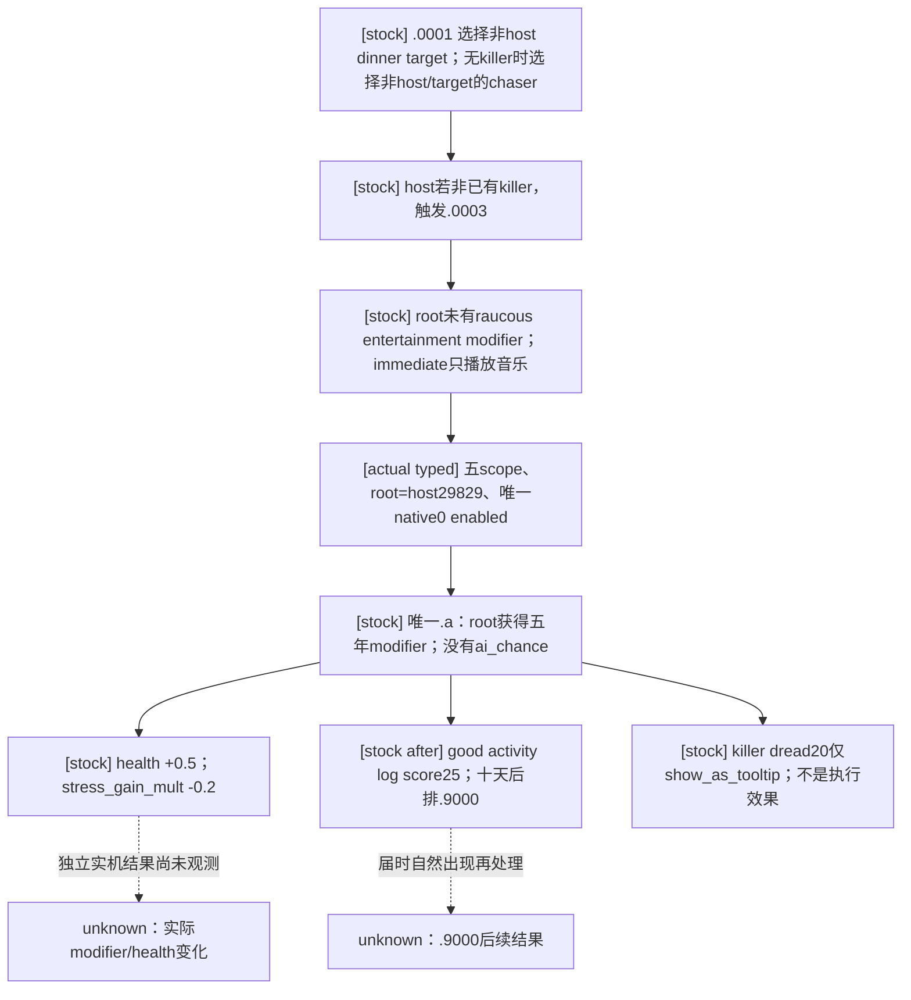

直接 caller `.0001:75–82,100–133` 产生目标/追鸟者作用域并分发主办者事件；本次不登记 sibling 或 `.9000`。`.0003:275–277` 的音乐已在展示前执行，不能归给选项收益。唯一 native0 `285–299` 添加 `feast_raucous_entertainment_modifier` 五年；`common/modifiers/00_activity_feast_modifiers.txt:125–129`（文件 SHA `4B6A39429FAF60B50D2D20A32687E4E1148CA7660235C0C2A01F3A51EC0CABEE`）定义 `stress_gain_mult=-0.2` 与 `health=0.5`。当前没有 killer scope，且 `show_as_tooltip` 中的 dread 20 不是真实执行或玩家收益。`after:301–318` 排十天后的 `.9000` 并记 good 活动日志，score25、character=root、target=dinner target；不能提前宣称日志、后续事件或宾客结果已发生。

这是有明确游戏价值的非空效果单选路线，没有立即写金币、威望或压力点；incomplete empty icon indicators 不能把它改判为 effectless。现有 consumer 的材料比较器仅覆盖压力点、金币与威望，本次 `observable_postcondition=None`，不制造财富变化或 M2 credit。已发表 `ck3_query_campaign_root_context_v1(expected_revision=<fresh public revision>)` 提供 `campaign_root_context.player_health.raw/scale`：根执行者可以在选择前后独立 paused 查询，同角色/日期确认实际健康变化。原 basic snapshot 没有健康 baseline，源定义 `+0.5` 不是实际 delta，也不是自动动作的新增前置门槛。

最小登记及现有生产消费路径现为 **static-ready**：独立 `.3` fowl leaf 只覆盖本次五 scope；现有 `.3` registry dispatch 与 relational-scope 有限 key 集各接入此 key，不改 service、driver、native、outcome 或 DLL。唯一新增的 existing full-route 方法首次 **GREEN，1/1**，使用真实 public2/native62/key/五 scope、authored1/rendered1，经过 normalizer → knowledge/classifier → ordinary `choose_one_life_turn` → service 的显式 instance API1 → native driver 的独立合成 old12 advance / same actor-date paused。selected 与 common-after profiles 均非空，材料 expectation 保持 None，没有模拟 modifier/健康收益或十天后结果。测试记录为同包 `python-compatibility/focused-checks.json`；原 `.7002/.2001/.6231` 方法未重跑。根执行者仍需冻结新 Python，并在其实际 native 环境中一次消费原12与独立回读；本包没有新增 live/M2 credit，原 RED 与 checkpoint 保留。

### Robert `.0003`：b03/4ee 实际健康材料与正常接续

根执行者已正常提交、推送并冻结该五路径源码为 `b03d34fd2a7b24cebbf2e82de9cf06fa1405da8e`；当前运行绑定 native/environment4ee、PID `94488`。首次 cold SDK read 保留原 instance12，却在 native6 / 同日 `53222136` 返回 `event_window_not_materialized`、window_match_count0，key/scopes/options 均 null；没有提交选择。这是冷活动视图缺少物化的 presentation 阻点，与已审阅 leaf 的 scope/option 合同无关。原 query SHA `6EC92A50F484381C7B1966444D1C0B943BA5EE383B0CF3CD5265BC9F36593CAC`；旧 Python242 registry 缺项 RED 和这个 cold RED 均保留。

复用 [既有后台 Feast 视图恢复 primitive](ck3-1.20.0.2-feast-guest-rule.md)，没有新增 provider/ABI/native build。第一外置 open attempt 因遗漏连接等待而 harness RED，尚未 native action；有限等待修正后的 `m6-feast/robert-v20-headless-activity-open-02` 对 independently observed full ActivityID `83886111` 只执行一次 `open-current-activity-view-v1-private`。原 ACK 如实为 `invoked_pending`，`materialization_independently_verified=false`；首个独立 typed query 才证明 available/1match、原 instance12 和 canonical `.0003`。保存时仍为同角色/日期暂停，原事件保留，0 focus/physical input/Start/事件选择/时间推进。full ActivityID 只用于已有活动 manager-resolved 显式动作，不写入 opaque event scopes。

随后 `m2-events/robert-fowl3-b03-actual-select-02` 通过既有生产消费者一次选择 native0/API1，真实 before native10/public2 → 独立 after native11/public3；actor29829、日期53222136和paused一致，旧12消失，active_event=null。真实当前 calculated ID `5320003` / runtime ordinal `8861` 与旧 warm 的 `6040003` / `10287` 不同，仍以 canonical key 和当前同帧 binding 验收。选择前已发表 campaign-root 查询 native5 读健康 `380962/100000`；选择后独立查询 native12 读 `430962/100000`，同 actor/date/paused、不同 native snapshots，实际 raw delta **+50000 = +0.5 健康**。这项材料来自 pre/typed-action/post，不从源定义或 ACK 推定；stress_gain_mult、活动日志及十天后结果未独立观测。

generic event material profile 仍保持 `metric=null/unavailable`、production expectation=None；外部 helper 的 `natural_provenance_verified=false` 与 `new_live_milestone_credit=false` 默认值没有改成 true。这次独立既有 campaign-root 材料证明不声称生产通用 health/modifier 比较器已经接入。原 normal `.2001` 续行真实推进四天产生12，继而 cold 保存、恢复、后台开视图和本次 typed消费，没有 console/forced event 或再次 Start；完整来源回链前一段 Robert 普通开席实际 loop 与 Feast once-Start 记录。

正式 following package `m7-robert/fowl3-chancellor-following-normal30-b03-actual-01` 已 closed，turn2 实际 `life-advance` **+6天**，raw53222136 → 53222280、同普通 episode/actor，旧12在下一正常回合 absent；请求的30天窗口没有完成。最终 paused checkpoint h4130/save85736985bytes，SHA `ED1BF0FB76915FFDA910121A83B327780D5B94352D4388AB6592129C1D6E6E23`；driver SHA由 ROOT 闭包记录为 `1F81968A0434DD4E610D6CE13CB1386B4903A6B19CEFBDF1AD67BD601E5E3842`，本次解析没有打开 save/driver/history。新 instance13 的宗教通知停点由 ROOT 等待用户权限，本包未研究或实现该事件。

有限 once assessment 共 **22/22 GREEN**，落在 `m2-events/actual-robert-following-natural12-242-blocker-01/actual-b03-closed/closed-packet-assessment.json`（SHA `2E6016EB7E93385CEA545A60FA0F0D760AA0B92909ED20A61488CFA9C8803F1F`）与同目录 `REPORT-FIELDS.json`。本形态为 **production-live loop**，是有真实健康材料的单选自然事件候选；不补 M2 两次多选门槛，不宣称 whole M2 完成。正常6天由 ROOT 日数 ledger 计，本专题不重复加天；原 static1/1 测试直接复用，没有再次 query、测试或逆向。

## 2026-10-02：实际普通宴会开席 `feast.2001`

根执行者的 `formal-v14-next-02` 在正常推进 41 天到原 planned start `53330784` 后，自然读到 instance `15` / `feast.2001` / calculated ID `5162001` / runtime ordinal `8308`。真实 typed context available，root 与 host 均为玩家 `31853`，保存 scope 恰为 `activity`、`host`、`province`；非 character payload 的 typed identity 继续 opaque。当前唯一 rendered `0` / native `0` / API option `1` 显示并启用，文案“欢迎，朋友们！”。原正式 turn6 因 `not_registered` 停止，没有选择；冻结 typed 包是 `artifacts/g2-maintainer-2026-10-02/resume-12003/m7-murchad/formal-v14-next-02/turn-006/result.json`，保存 h2097 SHA-256 `F5849B3A9A17D0D1E9006A06B96479535665DBAB963075121B6A5EFF62E5EBF0`。

Exact build 为 `.3` / Steam `25652598`，EXE SHA-256 `94B55397ABB687A3DCD436805A5D885E6BE90FA6C693FEB44A9E3BBEEADE02A6`。复用 Feast owner 的 [开席原生树](ck3-1.20.0.2-feast-guest-rule.md) 和冻结源码：`events/activities/feast_activity/feast_events.txt:601–927`，全文件 SHA-256 `F5820211444E7DBAF0A318ADF65BEBF4CA581D3A4E9F381ADD63D3BF02AAF77E`，原始换行 definition block SHA-256 `9E52F6C1F72317CC91B79271CAA6079D4354D073FA906F7BED39DD5A219AEE47`；`common/activities/activity_types/feast.txt` SHA-256 `FBC2E6E3F74BC8C2DB1BB1EB01609AA7CF50E9546671A12617301F175BE84598`。meal `on_phase_active:4425–4442` 在存在非 host attendee 时触发 `.2001`，另一分支是未发生的 `.2003`；`.2001:718–720` 要求 event root 为 activity host。

当前普通 variant authored native `0`（`809–816`）的 `is_murder_feast=no` / exclusive 条件和实际 sole native `0` projection 排除其余 authored `1–4`；其中 backdown native `4` 没有自己的 murder guard，不能说全部其它选项都带独立 murder-only trigger。native `0` 只含 `custom_tooltip=feast.2001.a.tt`，无选项 game effect、无 ai_chance、无 common after。`immediate:722–807` 的音乐、条件 portrait/scope 与列表初始化在选项之前执行，不能当本次点击收益。

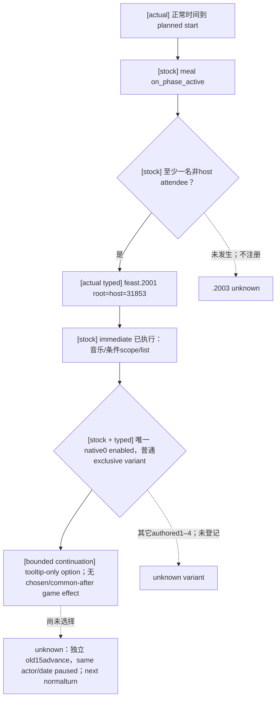

该原生树是本次 registry 施工输入。只登记已实际发生的 `.2001` 普通三 scope 形态；root/host 关系和唯一 native/rendered projection 使用现有机制，scope identity 不借外部 HostedPost ID 补造。独立选择后必须回读旧 instance advance、同角色/日期/paused；选择本身是 timeline continuation，材料 expectation 为 None，M2 credit 为零。source-bound 登记 **static-ready**：新增独立 `.3` record、现有 `.3` dispatch 和 relational-scope 有限 key 集各加这一项。现有 Feast test 文件的唯一新增 full-route 方法首次 GREEN，actual normalizer → knowledge → ordinary classifier → `GameplayBridgeService.select_event_option` → `NativeHeadlessGameplayDriver` 的独立合成 post snapshot 确认旧 instance15 advance、same actor/date/paused；旧 `.7002` 方法没有重跑。测试记录在 `artifacts/g2-maintainer-2026-10-02/resume-12003/m2-events/actual-v14-feast-start-continuation/python-compatibility/focused-checks.json`。没有正式实机选择或新 live/material credit；未提前注册 `.2003`、`.7101` 或其它 variant，也不把自然开席推断为任何指定宾客个人出席证据。

### `feast.2001` V15 实际计数修正

V15 第一次正式续行仍在 instance15 / `53330784` 停止，唯一失败检查为 `snapshot_option_count`，其它 21 项为 true。离线对照原 V14 warm 与 V15 cold 包后确认：basic snapshot `active_event.option_count=5` 是包括隐藏选项的定义总数，typed window 的 `options` 只有一个实际显示并启用的 native0。初版 record/test 把 rendered count `1` 当成 snapshot count，是本包错误；初版静态 GREEN 和本次 live RED 均保留。最小修复仅令 record `snapshot_option_count=5`，`option_count=1`、API1→native0 映射、root/host、三 scope 与其它检查不变；同一个既有 full-route fixture 改用真实 basic snapshot5 / typed rendered1。

V15 的 calculated ID `5172001`、runtime ordinal `8310` 与 V14 的 `5162001` / `8308` 随加载顺序改变，canonical key 仍为 `feast.2001`；本次不建立新的 ordinal/calculated-ID gate。root 从冷加载地图通过已观察活动 cup 打开 ActivityView 一次，只恢复视图，没有选择/Start/推进时间；typed 可用后才出现这次计数失配。该 root-assisted presentation 边界保留，不能声称无人辅助 cold 活动窗恢复。冻结诊断为 `artifacts/g2-maintainer-2026-10-02/resume-12003/m2-events/actual-v15-feast-start-count-mismatch/closed-count-diagnostic.json`，原 V15 阻点为 `formal-v15-next-02/turn-001/result.json`（SHA-256 `D60C2ACD54F1A547D6402403434CA474068241CC88195AAC40FC7219DAEE8817`）。这是纯 Python record/test 修正，不改 native、adapter、service 或 DLL；尚未补做真实选择，没有材料或 M2 credit。

修正后的同一 existing full-route 方法首次 **GREEN**，只重跑这一个受本次真实失配影响的方法，旧 `7002` 方法未跑。fixture 只把 basic native total counter 改成 `5`，原 V14 typed binding / rendered1 / native0 保持，覆盖 normalizer → knowledge → production ordinary planner/classifier → service event selection → native-driver 独立合成 old-instance advance。结果为同诊断目录的 `python-compatibility/focused-checks.json`，修复 **static-ready**；根执行者会复用原 V15 DLL、冻结新 Python 后以原生产消费者 cold 续行，实际结果待观察。

## 2026-10-02：1.20.0.3 `feast.7002` 实际主办者到达通知

正式 `formal-v11-next-01/turn-001` 在 instance `14`、玩家/root/host `31853` 的
`feast.7002` 停止：原 current-event 查询返回 `event_window_not_materialized`，没有提交选项。
h2046 checkpoint SHA-256 为 `F85E9447704C20E133C65DD9A21E074F31A6F281010DBDC9CC9FAA1A98F49B1F`；
保存的实际 scope 为 `activity`、`host`、`province`，没有 `center_portrait`。
存档中的 activity `587202561` / province `45` 是离线身份，不冒充 current-event native typed identity；
活动的真实完整 ID 由独立 HostedPost DTO 读回，不插入 generic event scope。
保留原始 RED：`artifacts/g2-maintainer-2026-10-02/resume-12003/m7-murchad/formal-v11-next-01/turn-001/natural-event/`。

本条 exact build 为 CK3 `1.20.0.3` / Steam `25652598`，EXE SHA-256
`94B55397ABB687A3DCD436805A5D885E6BE90FA6C693FEB44A9E3BBEEADE02A6`。
当前原版源码和依赖已实际读取、冻结：

| 来源 | 当前 SHA-256 | 本条语义 |
| --- | --- | --- |
| `events/activities/feast_activity/feast_events.txt` | `F5820211444E7DBAF0A318ADF65BEBF4CA581D3A4E9F381ADD63D3BF02AAF77E` | `.7002:1139–1278`，activity_event；唯一选项 `1257–1277` |
| `common/script_values/00_basic_values.txt` | `C379CC0C58ED1574033F0E07A58697DFC6F8475C26AA4B117F2332008D4A27EF` | `1000` 定义 base 35；`1033` 将 gain 绑定该值 |
| `common/activities/activity_types/feast.txt` | `FBC2E6E3F74BC8C2DB1BB1EB01609AA7CF50E9546671A12617301F175BE84598` | `4980–4982` 的 `on_enter_passive_state` 直接触发 `.7002` |

完整事件块 SHA-256 为 `61700971D916E2D17EB8DD7632362D76850A83C3974B8D1B0BDE8CE6CD3BF8C8`。
`immediate:1212–1255` 播放宴会音乐，并且只有找到荣誉宾客或合格成年与会者时才保存
`center_portrait`；其缺失是源码允许的当前三 scope 形态。唯一 native `0` 依据对 host 的好感
选择 `feast.7002.a.bad` 或 `feast.7002.a.good` 文案，二者都是同一个选项，均执行
`add_prestige = miniscule_prestige_gain`；没有独立 `ai_chance`、`after` 或选项派生后续事件。
现有英文和简中文案源分别为 `localization/english/event_localization/activities/feast_events_l_english.yml`
（SHA `167F119A424BF17525205359BCCE2ED20BDCB3CAB3C1965717D27F331344F5A1`）和
`localization/simp_chinese/event_localization/activities/feast_events_l_simp_chinese.yml`
（SHA `A33E34631EAB35D5B05BE34DE123D39E173C76866616267467C5049682B3AE7C`）；复用原 key 与原生 resolved label。

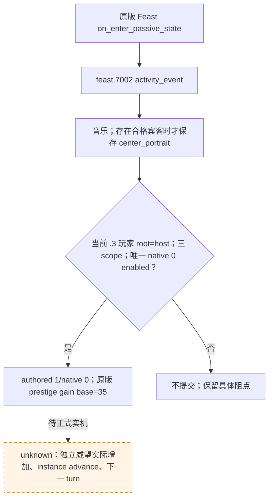

上述原生树是施工输入；最小我方策略只选择该实际主办者三 scope 形态的唯一合法路线，
使用已有 `.3` queried-record、角色关系投影和 `prestige.raw` 材料机制。
activity/province typed payload 保持 opaque，没有加入猜测的身份或活动 ID gate；
本次没有 center_portrait 的形态独立登记，未见到的宾客/四 scope 形态不新增验收资格。
效用仅为 `sole_legal_route`，不建立跨事件数值评分。材料 expectation 要求实际
`played_character_prestige.raw` 严格增加；stock base `35` 只作为源码预期，不当作实际 delta。
此包 **static-ready**；不新增 live/M2 credit，单选事件不会补足 M2 所需两次多选条件。
冻结来源和原始阻点在 `artifacts/g2-maintainer-2026-10-02/resume-12003/m2-events/actual-v11-feast-modal-blocker/registry-continuation/`；
`.2/.19` 记录、历史结果与下文旧版本截点保持原样。

## 2026-10-02：后台自然 `feast_default.6231` 的当前两选项路线

`formal-v16-background-next-01/turn-004` 在普通时间推进后出现真实 instance `16`，
玩家/root/host `31853`、`date_raw=53330832`；原生查询 available，暂停原因是 registry
`event_definition_key_not_registered`，没有选项提交。原始 result SHA-256 为
`15B567D0793671E16B025779E4D9C6567B54E56E74E4B8725BAFE0C0C1A48366`。
这是当前生产 `d4f377d9` 的后台既有消费者缺项，没有重开窗口或新增 native 故障。
basic snapshot 的 `option_count=4` 包含隐藏定义项；当前 typed window 只显示
rendered/native `0/0`、`1/1`，两项 enabled，consumer API `1` 对应 native `0`。
saved scopes 为 `activity/host/province/drunk_guest`；后者 typed character 为 `16843458`，
activity/province 仍 opaque。不能把外部活动 ID 注入其 typed payload。

当前 exact build 为 CK3 `1.20.0.3` / Steam `25652598`，EXE SHA-256
`94B55397ABB687A3DCD436805A5D885E6BE90FA6C693FEB44A9E3BBEEADE02A6`。
来源账本在 `artifacts/g2-maintainer-2026-10-02/resume-12003/m2-events/actual-v16-natural-consumer-blocker/source-evidence/stock-source-exact-12003.json`
（SHA `0181BBCF6F0525B53D340D5C97070C7B1409DF37C97C386F8E5F330DD7BB9263`），
冻结八个必要资源文件、23 个值/trigger/modifier 定义及英文、简中文案；不扩展其他事件。
原版 `events/activities/feast_activity/main_events/feast_default_events.txt:10935–11098`
文件 SHA 为 `D26B858CEF9CEF76C9E1BF6FB796E2BFA9E103E54853676B0D28A1927052A3F1`，
从事件 key token 到末 brace、不含随后换行的 block SHA 为
`F2DD92D63941723EE6E0B4AB8E7382DC7810DFE9F26369975C56C99F5D207D62`。

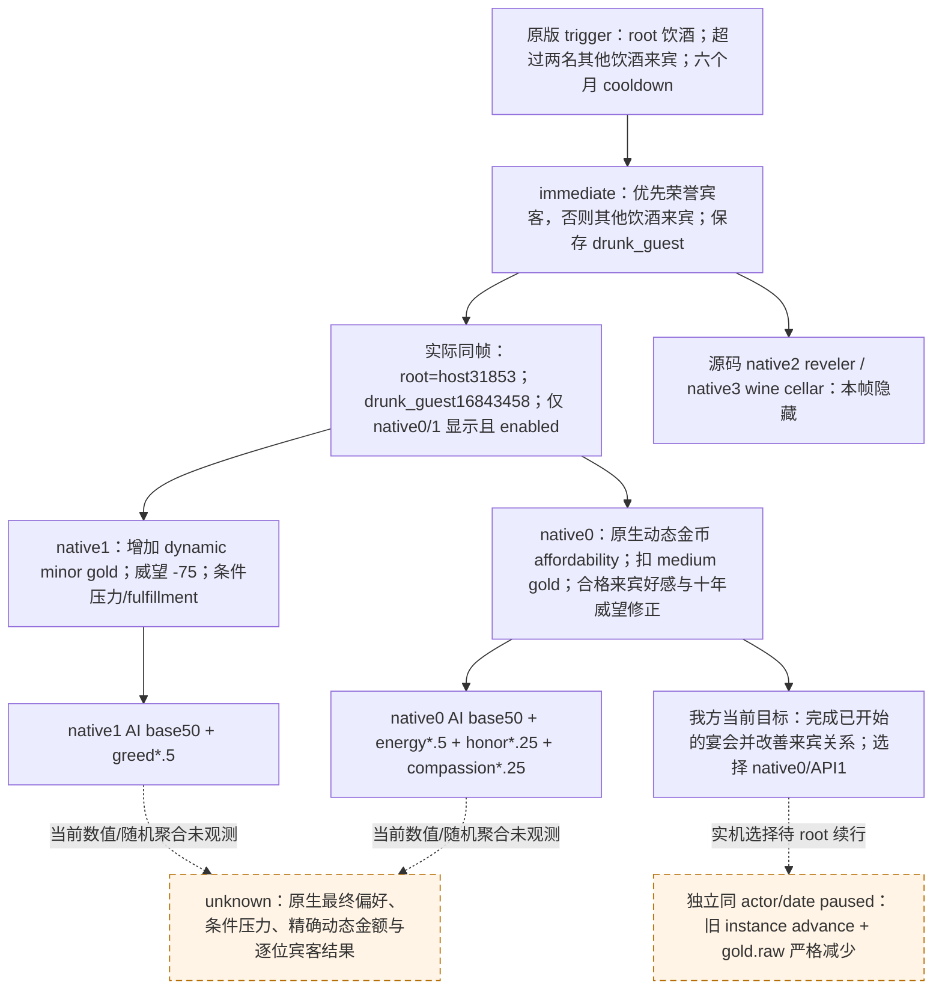

四个 authored options 已完整审阅；无 common `after`。`immediate:10961–10977`
已经在展示前执行，不算选择收益。native `0:10979–11039` 的原生条件是
`short_term_gold >= activity_medium_gold_value`，本帧 enabled 是其最终可用性证据。
`activity_medium_gold_value` 绑定 `medium_gold_value`：月角色收入乘六，符合
`has_treasury && this!=top_liege && is_landed` 时再乘 0.25，最小 50、最大
300 乘文化时代系数，再向上取整为五的倍数。当前金额依赖未读出，不猜固定费用，
不额外加入预算 gate。该选项给其他合格、存活、未囚禁 AI 与会者 `pleased_opinion +10`，
合格 drunkard 另得 `grateful_opinion +20`；十年 `feast_bought_more_drink_modifier`
提供每月威望 `0.5`。greedy 的压力/fulfillment 输入为 `+40`，drunkard 为 `-30`，
当前 trait 与修正未观测，不建立压力后置或声称相加后的实际结果。

native `1:11041–11055` 是另一可见候选：动态 minor gold 增加，威望固定 `-75`，
just/generous 条件压力/fulfillment 各输入 `+40`。它适合保留现金的目标，
但当前 root 明确采用来宾关系目标；源码子线的 treasury-first 建议只作为取舍记录，
没有被实现或执行。native `2` 的 reveler 门、威望 `+150` / AI base `500`，以及
native `3` 的 wine-cellar 门、influence `+30` / ambitious AI `+50` 仅为隐藏源码分支，
不属于本帧候选。策略只登记当前 authored `4` / rendered `2` 的投影，
效用为 `source_reviewed_ordinal` rank `1/2`，不声称数值校准或复现原生 AI 最优解。

现有金币减少 comparator 用来验证实际费用发生；ACK、源码预期和 fixture 的模拟 delta
不能替代独立实机 gold raw。来宾好感、modifier 与任何指定宾客 `35465` 的 attendance/收益
需各自独立观测，不从金币扣款推断。本包为 **static-ready**，保留原始 not_registered RED，
没有新的实机选择、物质收益或 M2 credit；多选资格须在真实选择/材料/正常 next 消费后另行评估。

## 2026-10-02：Robert 普通回合自然 `feast.7002` 材料与 next 消费

`m7-robert/normal-30day-412-actual-01` 的实际 turn `2` 确认事件为 `feast.7002`，
不是依据威望金额猜 key。当前 runtime 是 `production-source-41291bf2`；same ordinary episode
`native-29829-2bc2d599f7f9`、玩家/root/host `29829`。原 typed 查询 available、
instance `10`、calculated ID `5167002`、runtime ordinal `8318`、`date_raw=53220648`，
三个 saved scopes 为 `activity/host/province`。basic authored count 与 typed rendered count
均为 `1`；唯一 rendered/native `0/0` 的“我们将度过一段美好的时光！” shown/enabled，
已有消费者以 API `1`、event instance `10`、expected public revision `5` 提交一次。
原 natural-event/result SHA-256 为
`7872B651BDC875CAF628CFBA26EF2FCE0C918F696AB6B4326ADA0036B86ED034`。

复用上文 exact `.3` 原版来源、事件块及 `miniscule_prestige_gain` base `35`，
没有新增 registry/策略或重跑 native/旧 fixture。独立 paused snapshot
`native:22/public5 -> native:23/public6` 在相同 actor/date/episode 下，
prestige raw `233259130 -> 236759130`、scale `100000`，实际增加 `3500000 = 35`；
旧 instance 已消失，金币 raw `110659426` 保持不变。独立 material 的八项身份/后置检查
全部为 true、`status=verified_change`，选择 ACK 本身不当作材料证据。

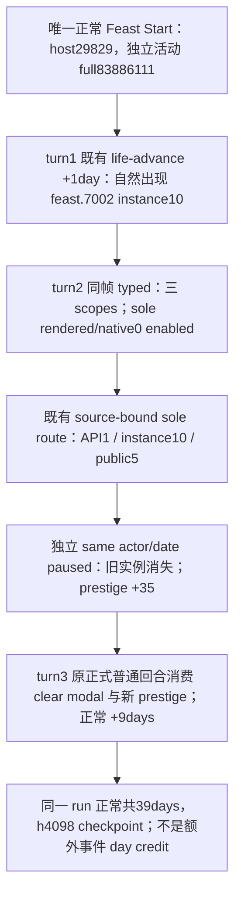

正常来源可复现：唯一 Feast Start 在 `date_raw=53220624` 提交，独立 HostedPost
native `18` 读出新活动 full ID `83886111`、host `29829`、type `activity_feast`，
金币 raw `120659426 -> 110659426`，实际支付 `100`。其一次提取 sidecar 为
`m6-feast/robert-feast/v19-412-live-01/actual-start-summary.json`
（SHA `B5DE388D8AB00F5508844C8D4EB45635756AE5D8AF294A8DB8E0EC1DA50D068F`），
原 Start packet `prepared/live/run-20261002T134742770290Z-start-fresh.json`
SHA `8C51216129772276226C39F33415BF8C480208FE8B43B26A021AA94A14997B4F`。
原版 passive callback 的 `.7002` 和 turn `1` 的正常一天推进后出现事件闭合这条自然来源；
该 run 的记录中没有 console/forced-event step，也没有为 M2 构造事件。
full `83886111` 属于独立 activity DTO 的身份链；event query 的 activity/province
typed identities 仍为 unavailable，不能把外部 fullID 写进其 opaque payload。

窗口分类保持可证边界：该 key 的 stock type 是 `activity_event`；当前 native reader
`ck3_12002_event_window_context.cpp:822–842,1018–1062` 支持
idler `+0x88 -> handler+0x3C8 -> ActivityWindow selected insert+0x188 -> open flag+0x7C8`
读取同一 EventWindowData。实际 DTO 只给通用 provenance 与 `window_match_count=1`，
没有输出 ordinary/splash/activity-insert 的 branch tag 或 window vtable。
所以本次证明“活动事件被当前读器读取、选择并验证材料”，不另声称 DTO 独立证明了命中的
activity-insert 分支；已成功决策无需为该报告新增诊断或 ABI gate。
此前 V11 和 V13 cold-hidden window RED、root-assisted view 的历史边界保持原样，
不能据本次正常后台消费宣布所有 cold 活动视图自动恢复完成。

turn `3` 的普通 next 在 active_event 已清空、prestige raw 已为 `236759130` 的状态下
执行 `life-advance`，`53220648 -> 53220864` 正常增加九天；后续 ordinary 回合仍继续。
同一 run 总共 `39` 天，最终 paused `53221560`、h4098 checkpoint 大小 `85621047`，
SHA `7708B4BD2D0ED05040185D15E2F88ECC29706F629D7A5E1D8E53C631CA56BA40`。
这些天数已由 root/ledger 计入同一窗口，本专题不再增计。

资格为该 exact key/三 scope/sole option 的 **production-live loop**。
它可供 M2 的一个单选自然材料样本审阅，不能替代两次多选；已有 Murchad 同 key 样本的
替代/实例去重由 ledger 决定，不自动双计或宣布 M2 complete。
helper 的 `natural_provenance_verified=false`、`new_live_milestone_credit=false`
保持未改，来源确认是此闭合包的独立 review。完整一次判读和报告字段在
`artifacts/g2-maintainer-2026-10-02/resume-12003/m2-events/actual-robert-normal30-natural-modal-01/`。

## 2026-10-02：Robert `feast.2001` 的原版可选 `my_spouse`

随后正常 `normal-90day-412-actual-01` 推进 `20` 天并停在真实 instance `11`：
`date_raw=53222040`、native `53` / public `12`，Robert/root/host `29829`。
该 key 已登记，basic authored count `5`、唯一 typed rendered/native `0/0` shown/enabled，
API `1`；只有 saved-scope count/names/type coverage 三项检查失败，
原因是出现第四个 typed character scope `my_spouse=34730`。
保留未选择的真实 `registered_contract_projection_drift` RED：
`m7-robert/normal-90day-412-actual-01/turn-004/natural-event/result.json`，SHA
`A1C6DFFD311C42EAEA96A96C61DE5E022744AB6D822C2ED9B7EF5B9CFFCAF064`。
root 已正常保存 h4106；修复不重新制造事件或重复推进该存档。

当前原版仍匹配既有 event file SHA `F5820211444E7DBAF0A318ADF65BEBF4CA581D3A4E9F381ADD63D3BF02AAF77E`
与全文 block `601–927`。`immediate:724–742` 的条件是存在出席且健康的 root 配偶，
随后从同一合格集合随机选取并在 `739` 保存为 `my_spouse`。
它独立于后面的 murder-feast 分支；可选 scope 既不意味着谋杀宴会，也不一定是 primary spouse，
所以合同不硬编码本次人物 ID 或新增 primary-spouse gate。
普通 native `0:809–816` 仍由 `is_murder_feast=no` 与 `exclusive=yes` 定义，
只有 `custom_tooltip=feast.2001.a.tt`；新增配偶 scope 不改变选项自身语义。
其他 authored 分支及展示前 immediate 不是无效果，不能把五个定义项整体当作空通知。

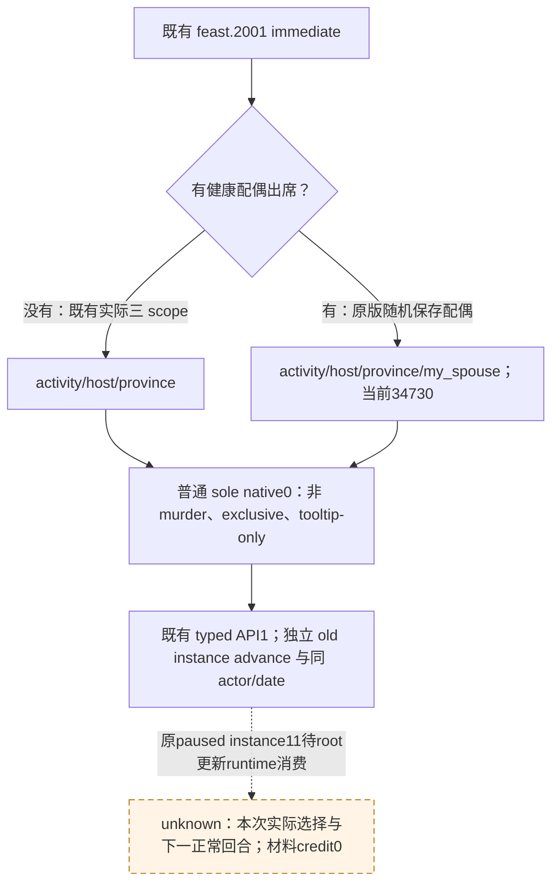

必要源码证据在 `m2-events/actual-robert-normal90-natural-blocker-01/source-evidence/stock-spouse-scope-review.json`
（SHA `FF5772C537C9314552F7F670843A0A1727AC69B5E7F44DD14746B113D54DD218`）。
最小实现保留三 scope base，给 `records_feast_start_12003.py` 增加唯一四 scope
`scope_variants`，并在 `policy.py` 已有 exact scope-variant resolver 的有限 key 集中加入
`feast.2001`。不伪造 `.2` migration metadata，不修改 registry、service、native、ABI 或 DLL；
对未观察的其他 scope/option 形态不泛化。独立事件推进与正常 next 消费仍由原消费者执行。
该普通空选项只恢复宴会时间线；即便成功也不增加 M2 物质样本信用。

唯一新增实际四 scope full-route case 首次通过：normalizer/current registry/普通 classifier
到 `choose_one_life_turn`、service typed API `1`，再由 native driver 独立模拟旧 instance `11`
消失及同 actor/date paused；使用实际 native `53` / public `12` 绑定，材料 expectation
保持 `None`。既有三 scope、`.7002` 和 `.6231` 测试未重跑。此修复为 **static-ready**；
root 对原 paused 实例的更新 runtime 选择与下一真实回合仍待执行，原 RED 保留。

同次随后正式 source `242d2f0f75278a9f78fec3b9fa96211c1f0da29a` 更新 Python 并复用
原 native `716` / PID `70968`。`feast2001-spouse-242-next-actual-01/turn-001` 在
原 `53222040`、instance `11` 读到同样四 scopes，scope count/names/type coverage
与其他登记检查全部通过；唯一 enabled native `0` 以 API `1` 提交。
独立 snapshot `native:55/public2 -> native:56/public3` 证明原 `11` 已消失，
同 Robert `29829`、date/episode、暂停状态保持；本次 fresh public revision `2`
正确绑定，不重用此前 RED 的 public `12`。

其选择仍无 authored state effect：gold raw `110726288` 与 prestige raw `237193690`
前后不变，material expectation `None`，独立 material 的 metric 为 `null`、
`status=unavailable/current_selected_choice_material_profile_unavailable`。
外层 `event_selected_material_recorded` 只表示流程记录完成，不给予物质信用。
原 source scope-drift RED 保留，此 exact 四 scope 的读取→选择→独立推进→普通 next
现为 **production-live loop**，不重跑静态 fixture。

turn `2` 原普通 `life-advance` 在 active_event 已清空的状态下继续，正常增加四天
`53222040 -> 53222136`，并产生**新** instance `12` / authored count `1`。
因此 next 消费要求旧 `11` 缺席，不要求随后永远没有自然事件；新 `12` 的 key 尚未由
本次判读查询，不能依据单选形态猜测其定义。一次离线判读首版误要求 next 的全部事件为空，
对应 REVIEW 已保留并从已冻结 extract 修正，非游戏能力 RED，没有重读/重查游戏或重跑测试。
最终暂停保存 h4111、大小 `85694642`、SHA
`05BB2EDC36C8276AB88C6555BD62A465E76056599AB8EFC3C816742B6D011CFD`；
四天已由 root 的正常窗口计数，不重复增加。
闭合实际判读与报告字段在
`m2-events/actual-robert-normal90-natural-blocker-01/actual-242-next-closed/`。
本条只恢复普通宴会开场时间线，M2 selected-choice material credit 仍为 `0`。

## 当前状态

- [static-ready] 共享 registry 已实现在
  `ck3_autonomous_player/src/xar_autoplayer/vanilla_events/`。它提供合同构建、冲突检测、`$player` 物化和 JSON-safe 查询；全部能力均为离线只读，不依赖已启动的 CK3。
- [static-ready] `ck3_query_vanilla_event_knowledge_v1` 已注册到正式 MCP server。它只按 stable event key 与 CK3 build 查询知识，不选择按钮、不推进时间、不修改存档或 registry。
- [static-ready] 本包默认扁平 registry 为 **184 个 unique vanilla event key**。原冻结迁移 key 集不变；只按实机真实中断增量加入独立 records，最新新增 key 是 R463 的 `tgp_japan_yearly_events.1030`。数量由 registry/migration 测试冻结。
- [static-ready analysis / mixed live evidence] 当前 package 同时发布 **184 条 analysis** 与 **184 条 observation metadata**，其中 **43 个 key** 含非 legacy 的 paused/live observation。缺少已冻结 source hash 的旧结论只按既有合同注释、docs/tests 标为 migration-only，不编造 hash；新出现的事件边界均按 harness-route RED 保留，在各自动作完成前不是新增 production-live primitive。
- [static-ready context profiles] prebootstrap 的 `spymaster_task.0381`、`spymaster_task.0399` 两条记录继续作为 seed-capture 上下文 profile 保存，不混入默认扁平 registry。它们与默认 manager 合同使用相同 event key、但冻结不同阶段的精确存档 shape，强行压平会造成有意义的合同冲突。

当前状态表示 registry、默认数据组合和只读 MCP 可以被静态消费者使用，不表示 184 条记录都已有独立 production-live exemplar，也不表示 CK3 自动玩家已经具备完整事件效用判断。共享 registry 的 production-live 标签只落在已有选择与 advance 证据的切片。当前 T0 产品进度不因目录增长而变化。

T0 当前仍为 `50%`、canonical stage `8/11`，source checkpoint `3/4` 且只缺 `capture_cross_cycle_endgame`；T0-P1 未签收，T0-P2 继续 `LOCKED`。`strict 4/361` 与 `definitions 106/626` 只是非阻塞 backlog。

## Exact-build 边界

Registry v1 只支持：

- CK3 `1.19.0.6`；
- `ck3.exe` SHA-256
  `2D00FF3101EF70B566F2FCBAE292F09263199C80E9DC8F139B82D7D96F83DB86`；
- canonical `event_definition_key`，例如 `ep3_decisions_event.2001`。

查询其它 build 会返回 `status=unavailable` 与 `unsupported_ck3_build`，不会从相邻版本猜测兼容性。v1 response 同时返回上述 EXE SHA，供消费者绑定 provenance。

当前扁平主键是 exact build 下的 stable event key。v1 尚未接收 playset 或 effective-definition fingerprint；如果其它 mod 覆盖了同名原版 definition，消费者必须将 stock 记录视为不适用，不能因为 key 相同就继续选择。将来若把 effective definition 纳入公共 schema，必须作为显式版本演进，不能改变 v1 的含义。

升级 CK3 后，即使 event key 未变，也要先重新比较定义、相关 ABI 和选项语义。旧 build 的静态记录或 live exemplar 不会自动升级成新 build 证据。

## Canonical ownership 与默认组合

共享 package 是原版事件合同的 canonical owner：

- `records_vanilla_shards.py`：20 条原版专题 shard；
- `records_manager_a.py`、`records_manager_b.py`：57 条 manager-original；
- `records_embedded.py`：79 条原先内嵌于 T0 runner 的 vanilla 合同；
- `records_tgp_movement.py`：当前独立 TGP movement 合同及其分析/观察元数据；
- `records_artifact.py`：按真实中断登记的宝物事件合同、exact-build 分析与实机观察；
- `records_health.py`：持有 source-reviewed health 分析与实机观察；既有健康合同继续由 manager-A 兼容组持有，新发现的 `health.1106` 合同由该模块独立持有；
- `records_yearly.py`：按真实中断持有通用年度事件合同、exact-build 分析与实机观察，包括 `yearly.0003` 与 `yearly.1030`；
- `records_tgp_dynastic_cycle.py`：独立 TGP dynastic-cycle 合同及其分析/观察元数据，包括 `.0072` 的 stability notification 与 `.0081` 的 phase-transition acknowledgement 合同；
- `records_tgp_treasury.py`：从旧 manager 条目抽出的 TGP 国库预算通用合同、exact-build 分析、R374 foreground UI identity RED 与 R375 MCP live 切片；
- `records_diplomacy_majesty.py`：Majesty 构想交接事件 `.4033` 的 exact-build 调用链、唯一安全选项、R390 选择前 RED 与 campaign-neutral scope 合同；
- `records_ep3_landless_admin.py`：EP3 无地行政角色事件 `.1000` 的 exact-build 合同、选择语义与 R375 选择前 RED；
- `records_pay_homage.py`：效忠礼 liege 事件 `.0101` 的 exact-build 调用链、当前 Smooth 投影、最小安全选择与 R384 选择前 RED；
- `records_vassal_interaction.py`：自动接受的封臣头衔索取信件的通用合同、exact-build 分析与选择前观察；
- `records_trait_specific.py`：按需登记的 trait-specific 原版事件合同、exact-build 调用/效果分析与实机观察；
- `records_bp1_yearly.py`：按真实中断登记的 BP1 年度事件合同、稀疏选项投影、exact-build 分析与实机观察；
- `records_death_management.py`：按需登记的新 death-management 原版事件合同、exact-build 调用/效果分析与实机观察；
- `records_faction_demand.py`：按需登记 claimant/peasant faction demand 的通用合同、exact-build 调用/效果分析与选择前实机观察；
- `records_analysis_vanilla_shards.py`、`records_analysis_manager_*.py`、`records_analysis_embedded_*.py`：把已有结论迁移为默认 analysis；没有既有 source hash 的条目保持 migration-only；
- `records_prebootstrap.py`：两条不进入默认扁平表的上下文 profile；
- `registry.py`：构建、物化与只读查询实现。

`build_vanilla_event_registry` 对合同、analysis 与 observations 做防御性深拷贝，并拒绝 metadata 引用未注册的 event key。重复 key 的 canonical JSON 完全一致时去重；内容不同时抛出冲突，并保持先前 active registry 不变。查询返回新的 JSON-safe 副本，调用方修改 response 不会污染 canonical record。内部 legacy tuple 到 MCP JSON 边界才投影为 array，metadata 的整数 option key 也只在 JSON transport 中规范化为字符串。

产品不应再复制共享原版事实并长期维护第二份权威定义。迁移期间可以保留 legacy adapter，但必须由定向 parity 测试证明它与 canonical record 一致；产品目录只应新增产品自己的用途约束和后置断言。

## Invariant contract 与 observation exemplar

Registry 将“可复用合同”和“一次实机看到的值”视为两种不同信息。

Invariant contract 用来匹配和处理事件，典型字段包括：

- root、named saved scope 的类型与相等/互异关系；
- source-reviewed 的 scope/option projection variants；
- authored native index、rendered option count 与选择映射；
- source 明确呈现但当前不可选的 native row；`disabled_native_option_indices` 只允许声明 `native_option_indices` 的严格子集，选择目标不得落入该集合；
- 日期/occurrence policy；
- 用于有界 drain 的 `selected_option_number` 与 `selected_native_option_index`。

Observation exemplar 记录一次具体运行的 date、event instance、角色 ID、实际 projection、artifact/checkpoint hash 和是否尝试选择。除非原版定义明确提供 exact anchor，这些值不能因为出现过一次就成为通用日期或人物合同。

v1 的 156 条迁移基线以保持现有 T0 合同逐值 parity 为首要目标，其中仍可能包含原 seed 的日期或人物锚；它们不能自动宣称已经完成全面的 campaign-neutral 归一化。新增或实质修订记录应逐步采用合同/观察分层，不能为了“清理数据”而破坏已经验证的 legacy 行为。

### 当前完整分层样例与首批 live 切片

`records_tgp_movement.py` 对 `tgp_movement_events.0160` 同时维护三块互不混淆的数据：

- `VANILLA_TGP_MOVEMENT_TIMELINE_CONTRACTS`：默认 registry 消费的 campaign-neutral 合同，玩家用 `$player` sentinel 延迟绑定；
- `VANILLA_TGP_MOVEMENT_ANALYSIS`：exact build/EXE、四个原版来源文件 SHA-256、定义行号、yearly caller 与十年 cooldown、三个选项语义、`after_effect=None` 和 safe-option rationale；
- `VANILLA_TGP_MOVEMENT_OBSERVATIONS`：R372 paused-live exemplar，包括 artifact/hash、`date_raw=53436720`、instance `668`、本局人物 ID、scope raw type 和 `selection_attempted=false`。

各轮实机日期、instance 和人物 ID 不进入新建或已触达迁移后的通用 timeline contract。当前 MCP v1 的既有 knowledge envelope 以彼此独立的 `contract`、`analysis`、`observations` 字段返回这三层；本包全部 184 条记录已有 analysis 与 observation metadata，其中 43 个 key 含非 legacy 的 paused/live observation。元数据不会混入选择合同或被物化成当前人物约束。

### R390 `diplomacy_majesty.4033` 最小合同

R390 在 `date_raw=53589168` 暂停于 instance `1089`，原始 RED 原样保留，且没有尝试选择。native current-event 查询发布唯一窗口：root 为当前玩家；saved scopes 严格为 `quarter:value`、非玩家 `thinker:character` 与等于玩家的 `event_target:character`；唯一 option 为 shown/enabled 的 native `0`。这些 R390 身份只进入 observation，不进入可复用合同。

CK3 `1.19.0.6` exact-build 定义位于 `events/lifestyles/statecraft_lifestyle/diplomacy_majesty_events.txt:968`。`.4033` 只由 `.4030` 的 option B 直接触发；上游是每年四次的 diplomacy lifestyle pulse 及概率事件池，不是 daily pulse。`.4033` 自身只检查 `thinker` 仍存活，没有独立随机分支或后续事件。唯一 authored option 1/native `0` 给接收者五年 `+1 diplomacy/+1 martial` modifier、对 thinker 的 `+25` opinion，并在需要时建立 potential-friend 关系；没有资源、压力、囚禁、受伤、死亡、战争或头衔代价。因此最小安全合同选择该唯一终止路线，同时仍要求 exact saved-scope shape、玩家/第三方关系、选项投影及提交前 revision 重绑定全部通过。

portable evidence bundle 当前为 `281` 个唯一 evidence blob、`1087` 条 canonical 引用，其中 generated definition reference `184` 条、lexical caller candidate `522` 条、人工审阅 source `276` 条、observation artifact reference `105` 条；共 `89` 份唯一 observation artifact。manifest SHA-256 为 `B9910108273AB057E4FC246E89FCE303D65C2986C42B8CF33ACC016CEC694D55`。共享合同是 Python-only 数据；R465 的 `.1030` 选择后证据已进入 bundle，后续操作者无需依赖 R465 的机器路径即可只读复核。

### R416 `bp1_yearly.1040` 最小合同

R416 attempt 2 在 `date_raw=53804184` 暂停于 instance `1078`，原始 RED 已保留且没有尝试选择。native current-event 查询发布唯一窗口：root 为当前玩家，唯一 saved scope 为非玩家 `new_friend:character`；snapshot 保留三个 source-authored options，当前投影只显示并启用 native `0` 与 `2`。严格合同因此使用 `option_count=2`、`snapshot_option_count=3` 和 `native_option_indices=(0, 2)`，选择 authored `3` / native `2`。

exact-build 原版树见 [bp1-yearly-bathhouse-friend.md](bp1-yearly-bathhouse-friend.md)。该路线不建立 friend/best_friend，也不启动被当前 trigger 隐藏的 seduce scheme；代价是 source-defined `-30 disappointed_opinion` 与特定人格压力。事件统一 `after` 会清除双方临时的 `is_naked` flag。

R416 retry 03 已在同一 PID/generation 选择 authored `3` / native `2`，instance `1078 -> null`、snapshot `native:271 -> native:272`、revision `272 -> 273`，并继续推进到下一条事件。因此本条现为 production-live primitive；选择前 RED 与后续 RED 内的动作证据均进入 observation metadata。

### R416 `bp1_yearly.4000` 最小合同

R416 retry 10 在 `date_raw=53902032` 暂停于 instance `1090`，选择前 RED 原样保留。native current-event 查询发布唯一窗口：root 为玩家；saved scopes 严格为 `family_memory:character_memory` raw `34` 与非玩家 `family_memory_participant:character` raw `4`；snapshot 含五个 authored option，死亡参与者投影只显示并启用 native `1/3`。合同选择 authored `2` / native `1`，接受确定性的 minor stress gain，避开 native `3` 的外交掷骰、较高失败压力与 `.4001` 后续窗口。

exact-build 原版树见 [bp1-yearly-family-memory.md](bp1-yearly-family-memory.md)。`family_first` 和存活参与者分支仅有源码结论，尚未准入当前 live contract。R416 retry 11 已在同一 PID/generation 选择 authored `2` / native `1`，instance `1090 -> null`、snapshot `native:1499 -> native:1500`、revision `1500 -> 1501`，`postcondition_verified=true`，因此该死亡参与者投影现为 production-live primitive。

### R416–R418 `health.2202`、后续治疗周期与 `health.1106` 康复

R416 retry 11 在 `date_raw=53905680` 暂停于 instance `1091`。root 是玩家，`sick_character` 是第三方廷臣 `88187`；saved scopes 严格为 `epidemic:epidemic`、`disease_type:flag` 与 `sick_character:character`，没有旧合同要求的 `physician`。唯一 native `0` shown/enabled，选择前 RED 已保留。

exact-build 原版树见 [health-consumption-diagnosis.md](health-consumption-diagnosis.md)。`recover_from_disease_effect` 自己只保存疾病和患者，医师只能由上游上下文继承，因此三 scope 是源码允许的独立 variant。疾病已经在窗口 immediate 中移除，唯一 authored1/native0 只确认结果及执行源代码限定的可选婚床 modifier 清理。

R418 在新 PID `204536` / generation `1` 冷恢复同一 partial checkpoint 后选择 authored1/native0，instance `1091 -> null`、snapshot `native:3 -> native:4`、revision `4 -> 5`，`postcondition_verified=true`。随后在 `date_raw=53908728` 出现下一轮 `health.3101` instance `1092`：既有八 scope 疫情治疗形态额外保留 `treatment_picker=玩家`，native `0/1/3` 与所有人物关系不变。attempt 1 的选择前 RED 保留后，retry 02 在同一 PID / generation 以 authored1/native0 完成 `1092 -> 1093`，再确认成功结果 `health.3103` 的唯一 native0 并完成 `1093 -> null`；两次 advance 都有独立 paused postcondition。

retry 02 随后在 `date_raw=53915424` 暂停于 `health.1106` instance `1094`。原生窗口发布玩家 root、玩家 `sick_character`、`epidemic/disease_type/sick_character` 三个 scope，以及唯一 shown/enabled native0；effect indicator 显示移除 `consumption`。源码证明移除、通知和治疗清理已在 `immediate` 完成，因此新合同只准入该精确三 scope 投影与唯一确认按钮。选择前 RED artifact 为 `_runtime/p1-terminal-resume-r418-20260911/live-artifacts/terminal-stages-red-attempt-02.json`，SHA-256 `7976147C48739863B4FA136CAEB4AEA5665C91477A59FFB3B1C4ECACA5AD54B1`。retry 03 在同一 PID / generation 选择 authored1/native0，instance `1094 -> null`、snapshot `native:124 -> native:125`、revision `125 -> 126`，`postcondition_verified=true`。

### R418 `yearly.1030` 最小合同

R418 retry 03 在 `date_raw=53943096` 暂停于 instance `1096`。root 为玩家；saved scopes 精确为非玩家 `secret_character:character`、`secret:secret` 与另一名非玩家 `hooked:character`；native `0/1/2` 均 shown/enabled，选择前 RED 原样保留。exact-build 决策树见 [yearly-hook-for-secret.md](yearly-hook-for-secret.md)。合同选择 authored1/native0：交出 ROOT 对 `hooked` 的现有 hook，取得 `secret_character` 的秘密并获得 `hooked +10 opinion`，避开 native1 的 `-30 opinion + 33% wound` 与 native2 的放弃秘密。该路线仍可能按 ROOT 性格产生 stress，因此只记为有界选择。R418 attempt 04 已在同一 PID / generation 完成选择，instance `1096 -> null`、snapshot `native:457 -> native:458`、revision `458 -> 459`，`postcondition_verified=true`。

### R418 `tgp_dynastic_cycle.0072` 最小合同

R418 attempt 04 继续推进到 `date_raw=54044544` 的 instance `1101`。root 为玩家；saved scopes 为 `situation:situation`、`situation_sub_region:situation_sub_region` 和非玩家 `new_son_of_heaven:character`；native `0/1` 均 shown/enabled，选择前 RED 原样保留。exact-build 调用链与选项树见 [tgp-dynastic-cycle-stability-notification.md](tgp-dynastic-cycle-stability-notification.md)。`.0071` 选定稳定分支后向除自身 ROOT 外的相关玩家发送本通知；native0 只保持独立，native1 会执行 `offer_fealty_interaction_effect`。合同因此选择 authored1/native0，并接受源码允许的不带 `new_son_of_heaven` 的两 scope 形态。R418 attempt 05 已在同一 PID/generation 提交 native0，instance `1101 -> null`、snapshot `native:1731 -> native:1732`、revision `1732 -> 1733`，`postcondition_verified=true`；本条现为 production-live primitive。

### R418 `tgp_movement_events.0070` 重复次数修复

R418 attempt 04 在 `date_raw=54017928` 选择 authored1/native0，instance `1099 -> null`、snapshot `native:1376 -> native:1377`、revision `1377 -> 1378`，`postcondition_verified=true`。attempt 05 又在同一 PID/generation、约十一游戏年后的 `date_raw=54114528` 实见第二个合法 instance `1108`；玩家 ROOT、`my_movement:situation_participant_group`、非玩家 `councillor:character` 与 native `0/1/2` 投影仍匹配，但旧 `max_occurrences=1` 在选择前阻断，`selection_attempted=false`。

exact-build 源码见 [tgp-movement-shared-scroll.md](tgp-movement-shared-scroll.md)：TGP 与通用年度池都可选择本事件，事件自身只有十年 cooldown，没有 one-shot 语义。合同已改为 `repeatable-within-product-observation-window`，继续选择 native0 以避免直接改写玩家或议员能力；友谊推进与性格压力是已记录的有界代价。第一次 GREEN 与第二次 RED 均由 attempt 05 artifact 固化，第二次 action/advance 待同 PID 热恢复。

### R416 `tgp_movement_events.0110` 最小合同

R416 attempt 3 在 `date_raw=53814264` 暂停于 instance `1079`。native 查询发布 11 个 saved scopes：玩家别名 `root_scope`、运动 `my_movement`、非玩家 `other_ruler`，以及建书 helper 产生的 owner/author、三个质量与财富 value、artifact、skill_base 和内容质量 value。两个 native option 均 shown/enabled，未尝试选择。

exact-build 原版树见 [tgp-movement-book-gift.md](tgp-movement-book-gift.md)。书籍在 immediate 中创建并设为 masterwork，after 对任一选项都转交给玩家；authored `2` / native `1` 在这个不可避免的共同后果外只增加 prestige，避免 authored `1` 的友谊推进。R416 retry 04 已在相同 PID / generation 选择该路线，instance `1079 -> null`、snapshot `native:397 -> native:398`、revision `398 -> 399` 且 `postcondition_verified=true`，因此本条现为 production-live primitive。

### R416 `artifact.4040` 最小合同

R416 attempt 04 在 `date_raw=53832072` 暂停于 instance `1081`。native 查询发布 `this_artifact:artifact` raw `31` 与非玩家 `helpful:character` raw `4` / ID `79104`；两个 native option 均 shown/enabled，尚未尝试选择。exact-build 树见 [artifact-expert-improvement.md](artifact-expert-improvement.md)。authored `1` / native `0` 总会增加一项军事宝物词条，代价是 `helpful` 获得对玩家的 favor hook，或在 hook 不合法时支付小额金钱；authored `2` 没有收益。R416 retry 05 随后在同 PID / generation 提交 native `0`，instance `1081 -> null`、snapshot `native:626 -> native:627`、revision `627 -> 628`，`postcondition_verified=true`，因此本条现为 production-live primitive。

### R416 `health.1006` 无医师投影

R416 attempt 05 在 `date_raw=53864592` 暂停于 instance `1084`，root 与 `sick_character` 均为玩家 `32904`；saved scopes 是 `epidemic` raw `50`、`disease_type` raw `3`、`sick_character` raw `4` 与 `new_memory` raw `34`，没有 `physician`；native `0/6` shown/enabled。exact-build 树见 [health-consumption-diagnosis.md](health-consumption-diagnosis.md)。疾病已在 immediate 施加；authored `1` / native `0` 会设置有界搜医状态并调度 `health.3001`，而 native `6` 不治疗。R97 曾在有医师形态选择 native `6` 后约 27 日病死，因此当前合同选择 native `0`；有医师 `3/4/6` 形态仍选择 native `3` 安全治疗。当前为 static-ready counter-policy，动作与 advance 待 retry。

### R384 `pay_homage.0101` 最小合同

R384 / PID `38864` / generation `1` 在 `date_raw=53590944` 暂停于 instance `1046`。原生 snapshot 报告三个 source-authored option 槽，但 current-event query 只发布一个 shown/enabled row：native `0`。七个 saved scopes 为四个 `pay_homage_*` boolean、玩家 liege、非玩家 vassal 与 `opinion_of_petitioner` value；没有任何 `homage_faux_pas_*` scope，因此 source 中只有 Smooth 合法。合同选择 authored `1` / native `0`，但仍要求选择前重新绑定同一日期、instance 和 revision；漂移继续 RED。

该记录冻结了 CK3 `1.19.0.6` 的 event、decision、EP1 on_action 与中英 localization 来源 SHA-256。未来真实出现 faux-pas 时不会复用当前 shape 假装通过，而是重新保留 RED，再把 observed options 扩成独立 variant。source-reviewed 策略只允许无 faux-pas 走 native `0`；有 faux-pas 时最低伤害候选为 Brush Off/native `1`，Insult/native `2` 默认禁止。faith 只参与上游可选 infatuation 候选，`.0101` 合同仅消费 opaque presence bit，不展开宗教域。

portable evidence bundle 随此记录更新为 `221` 个唯一 evidence blob、`913` 条引用，其中 exact-build definition `168` 条、lexical caller candidate `499` 条、人工审阅 source `186` 条、observation artifact `59` 份。R384 三份不可变 RED 证据分别固定 report、park 与 driver-state，热恢复不会覆盖这些选择前字节。

R372 已在同一 PID/session 上把 `TGP0160`、`great_holy_war.0011`、`tgp_dynastic_cycle_events.0020`、`tgp_dynastic_cycle_events.0001` 与 `epidemic_events.1064` 从共享记录解析到真实 option submission，并验证旧 instance 消失或 advance；R374 又把 `.7031` authored3/native2、`.1001` authored2/native1、`.1005` authored6/native5、`.0040` authored1/native0、`.4001` authored2/native1、`.1007` authored1/native0、`.2001` authored3/native2 与 `.1101` authored1/native0 依次同 PID drain 并验证 instances `978`、`988`、`1007`、`1038`、`1040`、`1046`、`1050`、`1055` advance，因此十三条均为 `production-live primitive`。`.1007` 的动作后 snapshot `native:1779 -> native:1780`、revision `1780 -> 1781`；`.2001` 的动作后 snapshot `native:1847 -> native:1848`、revision `1848 -> 1849`；`.1101` 的动作后 snapshot `native:2057 -> native:2058`、revision `2058 -> 2059`，三者 postcondition 均 GREEN。`stress_threshold.1721` observation 保留前一次真实 RED：共享模块 reload 实际已经生效，错误是 submission 阶段再次按 base contract 解析，导致提交了 base route；这不是 reload failure。`.5009` 的第一次交付曾真实 GREEN，第二次交付则证明旧 `max_occurrences=1` 错误。选择前 RED observations 不因后续 GREEN 删除。

park8 的 `faction_demand.2001` #1050 在 PID `51852` / generation `1` 选择 authored3/native2，instance `1050 -> null`、snapshot `native:1847 -> native:1848`、revision `1848 -> 1849`、`postcondition_verified=true`，现为第十二条 production-live primitive。package commit `3bb5169ca2b81701a8ea49e9d842de36f39fd87b` 已按 rebase-only push；Official Runner run `34404896747` / job `102645406781` 约 4 分 26 秒 completed/success、失败步骤为空。T2 `.2001` 兼容审计为 `NO-CODE-CHANGE`。

park9 的 `faction_demand.1101` #1055 动作前状态为 PID `51852` / generation `1`、date `53607792`、root/player `32904`、snapshot `native:2057`、revision `2058`、paused，且 `selection_attempted=false`、`process_restart_required=false`。四个实见 scope 为 `faction` faction/raw25、`peasant_county` landed_title/raw5、`peasant_leader` character `33633057`/raw4 与 `new_title` landed_title/raw5；native0/native1 均 shown/enabled、非 fallback/cancel。合同允许有限产品观察窗口内重复出现，并选择 authored1/native0。原版不是 daily pulse：满足不满门后按月检查，普通积累约 50 个月，高不满加成时约 7 个月，`MAX_DEMAND_DELAY_DAYS` 另保证最多 90 eligible days 后更新。接受在有效条件下损失 50 legitimacy；top-liege 路线对成员县扣 75 control、施加十年 modifier 并销毁派系，Dynastic Cycle 的 lower-liege 合法变体会升级为面向 top liege 的派系但不会在该按钮边界立即开战。拒绝则立即开农民战争、各成员县扣 25 control、生成军队，并由 CB 另扣 100 legitimacy。选择接受是避免立即战争的有界路线，不代表零代价。leader setup/war tail 中出现的 faith/struggle/Mandala 仅是附带语义，不扩展通用宗教策略。产品绝对 deadline `53635896`，动作前尚余 `28104` 小时、即 `1171` game days。commit `0880b4d579b92685be0696df5a5a32d701db5ed2` 推送且 Official Runner GREEN 后，R374 同 PID/generation 选择 authored1/native0，old instance `1055 -> null`、snapshot `native:2057 -> native:2058`、revision `2058 -> 2059`、`postcondition_verified=true`，所以该条已是第十三条 live。

`.1101` 的 exact-build analysis 冻结以下九份原版 source SHA-256：`events/factions/faction_demands.txt` = `B06241E67B6692F51FCFC6021E4DBE085C9E25A50B9CD08957CBCC9E25AEBEA9`；`common/factions/00_peasant_faction_new.txt` = `3B54AA8E610EC8F767B86F33F75A7D90A64FA199B0AC1AE37D59A476B4EC04E2`；`common/factions/_factions.info` = `FB47457AABE7C7DF78555B4DFBA74B8932DAE468C45EBB2D1381CADDC2B7E019`；`common/defines/00_defines.txt` = `C1ECA141C71EC1E741CA5336E01BB538EEFAEC05B0684EDEC477CFC9053C3807`；`common/scripted_effects/00_faction_effects.txt` = `C8E0B3C57665F775973BC8559166CD1F6414471CA25017800777C3C6466DC5D3`；`common/scripted_effects/06_dlc_ce1_legitimacy_effects.txt` = `DEE9D48221B49EF41490D04451ACD6DBFD4994A50EAD9D006F831F41A6247A83`；`common/script_values/00_faction_values.txt` = `4EE4098080B8C4536E74B047801F8715DD5EB0BCDCBAC04A8E3BF563D6555932`；`common/script_values/00_legitimacy_values.txt` = `13E43166356B5DD99358F435330B03CB9BE95AB5913280319B01681186E23A2E`；`common/casus_belli_types/00_peasant_war_new.txt` = `3429D8884AA45F09291B807B6931D7FCAA629458ECCEE59AE2EA682D69F46AAF`。park9 immutable report / driver-state / hot-recovery SHA-256 为 `BA39B64ACC3224E8F1F5D5C04719A04106430D7F2F2551DEC52CCEC514FC3AA6` / `78C84C846ED9D2F05AF153EC9302C4C3A85C645FD0B33316CD212B10E342C494` / `4E3B59B3EB6328939D2008BD2DD4138546C0224F76D62297D19415138DF577E6`。实际 MCP list/call 返回 available、三投影和 authored1/native0 JSON roundtrip；T2 为 `NO-CODE-CHANGE`，Python normal/`-O` 各 `42/42`、open_kaishek `3/3` GREEN。commit `0880b4d579b92685be0696df5a5a32d701db5ed2` 已按 rebase-only push；Official Runner run `34408112586` / job `102655870657` completed/success，约 3 分 31 秒、失败步骤为空；同 PID live retry 如上 GREEN。

`.1101` 动作后，CK3 前景可见 `tgp_china_ministry.0100`“宋国库”及三条简中选项，但 native publisher 仍给出 `paused=false / active_event=null`。截图 `_runtime/p2r374-active-boundary-continuation-live/park9-post-selection-ck3-screen.png` 的 SHA-256 为 `B2E57E4B90EC82EBA96500B7D0B1F963A6EE46F521E4E5250C1A3BE113C7047B`；它只以标题与三项 localization 精确匹配证明前景 UI identity，不能提供 event instance、date、root、saved scopes 或 option-state，也不能冒充 paused live observation。exact-build source SHA-256 已审阅：`events/dlc/tgp/tgp_china_ministry_events.txt` = `87358436D60431BC80DA0376DD1BB2C47696EFCDE813148C69883768439980EE`；`common/on_action/yearly_on_actions.txt` = `0FC85A284224A68D1CA0A4EF071D4F4A4F49896753AEC463975A12EE4E1116FA`；`common/scripted_effects/10_dlc_tgp_scripted_effects.txt` = `AEF36B884DC5E315DD5C655BC96012FF9FA8BB46BB0AF2C18FA878C890907747`；`common/scripted_triggers/10_tgp_triggers.txt` = `8294C1D72ECC909428ABFBA27D6F10B127D796D2BEE350D1BB95024F36D60C99`；简中 localization = `6AD38C15CAE1CD3EAC713EDBC1566C7D42D8CE3B94291139F976C439020F8210`。source-reviewed 终止路线是 authored2/native1“维持原有分配方案”。该路线后来只为解开前景遮挡而通过明确标注的 visual-coordinate fallback 执行；随后以坐标关闭宣战通知、activity detail、唯一选项胜利窗并用 Windows `SendInput` 发送空格。以上都不是 MCP action，不能给 `.0100` 记 live；native instance/date/root/scopes/option-state 仍缺。该通用包已由远端 commit `b51ccd9` 推送；它从既有 manager key 抽取，因此 contract/analysis 总数仍为 `165/165`，新增的 identity-only RED 使 observation keys 变为 `16`。

visual recovery RED sidecar `_runtime/p2r374-active-boundary-continuation-live/r374-visual-recovery-red-evidence.json` SHA-256 为 `003875E75BB05A8CF74AF27760DDC311B9F504C3A9FA51F5E3FDBD01831AB4EC`，冻结 driver snapshot SHA-256 为 `B83EFAAA2574ACCDEF533C5F2B8A38BAC20255237D18D32C35B87D3F42F48F43`；它明确标记 `mcp_only=false / coordinates_used=true / send_input_used=true / production_live_credit=false`。driver command `#3200` 返回 `pause-map=submitted`，`#3201`--`#3355` 共 `155` 次均返回 `already_paused`，而旧 runner 仍未读到新 paused frame。因此 live 计数保持十三条，`.0100` 仍只有 UI-identity RED。

commit `ac6f63c` 已把 direct 幂等 map-control ACK 与 semantic 后置帧绑定在同一命令 deadline：矛盾时只提交一次并进入可热恢复 typed RED，不能继续自旋；normal/`-O` 定向测试与 Official Runner run `34413044308` / job `102671610904` GREEN。native 根因进一步缩到 ACK 决策与 publish 之间的二次读取：native adapter 已用一次可信 snapshot 判定 `already_paused` / `already_running`，bridge 却丢弃它并立刻做第二次全量读取；自动暂停边界的第二读可返回陈旧 `paused=false / active_event=null`。commit `9ccd3995418549b18f46190c3061ede5714c81e5` 已按 rebase-only push，把判定 ACK 的同一 snapshot 交给 timeline publisher，并在幂等 ACK 时强制发布；MSVC Release 定向 CTest `2/2` GREEN，新 DLL SHA-256 为 `18787F7F7F0A9BAF85C7D6979AB8AD20C8CF80D553AA6CA8D2AB87CF18DB0840`。Official Runner run `34415670708` / static job `102679886593` completed/success，约 4 分 36 秒、失败步骤为空。

该修复改变 DLL，故 R375 受管重启并装载新 DLL。恢复基线是 `date_raw=53602440`、`144254384` bytes、SHA-256 `2B683351CF79ADE9DD5A931090DE8E6AF1D4F57FD65FFAFBB3CF18B7436BD97E` 的 `autosave`。R374 final report 的 `target_progression.timeline_interrupt_drains` 实际 list length 为 `456`；其中 `retained_timeline_interrupt_drain_count=455` 是落后一条的内部计数，不能作 final ledger 总数。按 `date_raw < 53602440` 严格裁切后保留 `453` 条 durable seed，并丢弃 R374 indices `453..455`：`travel_danger_events.3002@53603376`、`debate_event.5110@53605080`、`faction_demand.1101@53607792`。`.1101` 已写入 R374 final ledger，只是尚未进入该 autosave。

R375 从 453 条 durable seed 首先追加五条全 GREEN drain：`travel_danger_events.3002` instances `1053/1054`、`debate_event.5110` #1055、`faction_demand.1101` #1056、`tgp_china_ministry.0100` #1057，在首次 RED 时共有 `458` 条。`.0100` 的 command `#291` 在 `native:356 / revision 357` 发布唯一窗口、root `32904`、saved scopes `treasury_ruler=32904 / steward=38076 / military_budget=32904`，native `0/1/2` 均 shown/enabled；command `#292` 以 authored2/native1 选择，instance `1057 -> null`、snapshot `native:356 -> native:357`、revision `357 -> 358`、`postcondition_verified=true`。这是第十四条 production-live primitive；R374 UI-only RED 仍保留。不可变 GREEN sidecar `_runtime/p2r375-post-publisher-fix-live/r375-live-014-tgp-china-ministry-0100-green.json` SHA-256 为 `6C1407AF00D2E767FA201DA2411619D5724C86951BB5CEFF006DAB50ABC6C779`。源 autosave 到 `.0100` 为 `312` game days，不是旧预估的 223 days/3 events。

新 DLL 的 map-control 同帧证据也已实机闭合：PID `180544` / generation `1` 的 command `#343` 对 `already_paused` 从 `native:424 / revision 425` 前进到 `native:425 / revision 426`，在同一 `date_raw=53611224` 观察 `paused=true`，rejected state frames 为 `0`；紧随其后的事件帧为 `native:426 / revision 427`。`.0081` 的 exact-build package 由 commit `862fc7fc89e61a290295a25dcdf2ca31434509be` 推送；同一 PID/generation 热恢复选择唯一 authored1/native0，instance `1058 -> null`、snapshot `native:426 -> native:427`、revision `427 -> 428`、`postcondition_verified=true`，成为第十五条 live。不可变 GREEN sidecar `_runtime/p2r375-post-publisher-fix-live/r375-live-015-tgp-dynastic-cycle-0081-green.json` SHA-256 为 `573992BD13E2373DB3A827698B770D703263EC678ECDEE98595C0D48C6671789`；选择前 RED 仍由 `r375-tgp-dynastic-cycle-0081-red-freeze.json`（SHA-256 `19860E8323136E2EED1209428BA56D09F1C4175E4250E90B43FB4AA27D0A3C35`）保留。

`epidemic_events.0110` 的选择前 RED 是实见 scope 变体：PID `180544` / generation `1`、instance `1059`、`date_raw=53611320`、snapshot `native:432`、revision `433`；只发布 `epidemic` scope，未发布旧合同要求的 `new_preferred_capital`，因此 `saved_scope_count`、`saved_scope_names_exact` 与 `scope:new_preferred_capital:type` 三项失败，`selection_attempted=false`。不可变 RED freeze `_runtime/p2r375-post-publisher-fix-live/r375-epidemic-events-0110-red-freeze.json` SHA-256 为 `1CD3DEC1ED7DB6F3C7DBE8D485DC2B38753F1D7E1D90BD9E8FA99A8ADADC7448`。commit `6fc2ef2167f4af1dbb2ff4bb1be7fa70825203ea` 收口 exact-build 最小合同后，同一 PID/generation 原位热恢复选择 authored3/native2，instance `1059 -> null`、snapshot `native:432 -> native:433`、revision `433 -> 434`、`postcondition_verified=true`，成为第十六条 live；不可变 GREEN sidecar `_runtime/p2r375-post-publisher-fix-live/r375-live-016-epidemic-events-0110-green.json` SHA-256 为 `1C96D13A88D9F96575CA6DD78E5E02C0483ECB1ADC09505949868EC387994EEF`，并由 commit `0a65adf` 接入 MCP observations。

`stress_threshold.1721` #1060 的选择前 RED 位于 `date_raw=53611536`、snapshot `native:440`、revision `441`，实见 rendered native indices 为 `(7,9,12)`，旧合同期望 `(7,10,12)`；唯一失败项为 `authored_options_exact`，`selection_attempted=false`。不可变 RED freeze `_runtime/p2r375-post-publisher-fix-live/r375-stress-threshold-1721-red-freeze.json` SHA-256 为 `6F0F849C88EC48D78803B27B6BDE94C334FDD94F61024AA1BAA48EC88E2F4508`。commit `27921a9b96c40043ddb70c89b1614f170e4ba192` 收口 exact-build 最小 variant 后，同一 PID/generation 原位热恢复选择 authored10/native9，instance `1060 -> null`、snapshot `native:440 -> native:441`、revision `441 -> 442`、`postcondition_verified=true`，成为第十七条 live；query `#371`、select `#372` 的不可变 GREEN sidecar `_runtime/p2r375-post-publisher-fix-live/r375-live-017-stress-threshold-1721-green.json` SHA-256 为 `869BFE72B6FF2ABEF55FF3F4191F13D3A9F57E696F02B011367527256AD57EF3`，并由 commit `76f9a83` 接入 MCP observations。

`ep3_landless_admin.1000` #1062 的选择前 RED 位于 PID `180544` / generation `1`、`date_raw=53619912`、snapshot `native:720`、revision `721`；saved scope 为 `proposed_councillor` character `33643335`，三个 rendered native indices `(0,1,2)` 均 shown/enabled，`selection_attempted=false`。不可变 RED freeze `_runtime/p2r375-post-publisher-fix-live/r375-ep3-landless-admin-1000-red-freeze.json` SHA-256 为 `F74447FE01DDB9BC890C757578DBA477373167EA0DA862BB987D26A61904DFA1`。exact-build 分析确认 authored3/native2 是不花钱、不招募、不进入随机 duel 的确定性拒绝路线；通用 package 由 commit `5c8a526` rebase-only 推送后，同一 PID/generation 原位热恢复，query command `#602`、select `#603` 使 instance `1062 -> null`、snapshot `native:720 -> native:721`、revision `721 -> 722`，`postcondition_verified=true`。不可变 GREEN sidecar `_runtime/p2r375-post-publisher-fix-live/r375-live-018-ep3-landless-admin-1000-green.json` SHA-256 为 `F545AC8E85102FBFE83B6EFEC23AEB47978844B9EF3F8FE4538C720369BAA8C4`；这是第十八条 production-live primitive，选择前 RED 仍保留。

R375 最终 rolling report 的 drain list 实际为 `464` 条，即 durable seed `453` 后新增 `11` 条 GREEN drains：indices `453..463` 依次为 `.3002#1053@53603136`、`.3002#1054@53603160`、`.5110#1055@53605080`、`.1101#1056@53607792`、`.0100#1057@53609928`、`.0081#1058@53611224`、`.0110#1059@53611320`、`.1721#1060@53611536`、`death_management.1001#1061@53618256`、`.1000#1062@53619912`、`tgp_movement_events.0080#1063@53624256`。GREEN sidecar 中的 `retained_timeline_interrupt_drain_count=462` 是尾段写入前的滞后计数，不能冒充 final ledger。

终态不是新原版事件 RED，而是 `date_raw=53635920`、无 active event 的关键产品 liveness RED：runner 超过 exact bound `53635896`，原因是 `10190-day product observation bound` 已完整覆盖两个 400-day authored B1 opportunities、一个 4200-day post-publication critical-path tail 与三个有限 730-day Workforce windows，但 `production_capability_advertised=false / production_live_ready=false`。不可变 bound sidecar `_runtime/p2r375-post-publisher-fix-live/r375-product-observation-bound-red.json` SHA-256 为 `C3D4503117ED687D3289AD612B25C1AA36A0FA1329572D607E604E0CE7EAA9F8`；对应 final report / driver / park5 SHA-256 为 `19969B3802F038C9AA7EFFF65BE78C8E0FEC73C2FE7914F86930C09618CCE4FF` / `78BC8A47A1F874D56194846C00FB8055FD65274B8A5B801A513362C1AC555914` / `3338D5779E51D8C75B705475C91F408E9755EA13D41AB31A12D91D036417BD6D`。这不是随机/穷举门禁，也不是 harness 故障；第三次 `.356` 是三周期首次解锁 `.361` 的必要边界，下一项施工是补齐 B1 周期/名单只读观测，并据实收口死亡或 unavailable 名单的 liveness 修复。现有 `subject=30938` 的 `target_dead` 只来自固定 product timeline 诊断，尚不能证明它就是当前 B1 名单成员。当前 `autosave.ck3`/`last_save.ck3` 仅到 `date_raw=53611200`，不得冒充 `.0081`、`.0110`、`.1721`、`.1000` 或终态 bound 的同帧存档。

`.2001` 的 exact-build analysis 冻结以下原版 source SHA-256：`events/factions/faction_demands.txt` = `B06241E67B6692F51FCFC6021E4DBE085C9E25A50B9CD08957CBCC9E25AEBEA9`；`common/factions/00_factions.txt` = `0A47171476811DD16EBD44A7335EAEBD17376FD87E41290F72B5C6785365B276`；`common/factions/_factions.info` = `FB47457AABE7C7DF78555B4DFBA74B8932DAE468C45EBB2D1381CADDC2B7E019`；`common/defines/00_defines.txt` = `C1ECA141C71EC1E741CA5336E01BB538EEFAEC05B0684EDEC477CFC9053C3807`；`common/scripted_modifiers/00_faction_modifiers.txt` = `CD3DAA9DA33C3DFD15934CA30C1B2D7381E0B3968337BF52A7CBC2F9F2237102`；`common/script_values/00_faction_values.txt` = `4EE4098080B8C4536E74B047801F8715DD5EB0BCDCBAC04A8E3BF563D6555932`；`common/on_action/faction_on_actions.txt` = `A4E3EDA2F31CB08D29DEAE1A1CDBD89256973A81FC1A1D4DF00D9CF5BBCB68FB`；`common/scripted_effects/00_faction_effects.txt` = `C8E0B3C57665F775973BC8559166CD1F6414471CA25017800777C3C6466DC5D3`；`common/scripted_effects/06_dlc_ce1_legitimacy_effects.txt` = `DEE9D48221B49EF41490D04451ACD6DBFD4994A50EAD9D006F831F41A6247A83`；`common/scripted_effects/00_war_effects.txt` = `A936E09F448EF715580A918165EAB89A9368AD2D3014E425C998CD9D4F0E8D7D`；`common/casus_belli_types/00_civil_war.txt` = `CFF84009E58F5D6386A6D7501CFF084CB206A542E7D0CFA221ED2CC050A9DA68`。park8 immutable report / driver-state / hot-recovery SHA-256 为 `AC7EF0A37844A7F0B252917DAB0922B77721F0CAE6FB2A7416BC0F4420BCF9CA` / `FDFD7C0B2AB7DF6DC936B9FC01D611F1F5425BA6E571CBB74942BF08A68A9F28` / `89B4F2F8F6ADD2243C0CAD803766EB6B82491D0EF8E3C3BCCC6B55E5BC41B561`。park9 `.1101` immutable report / driver-state / hot-recovery SHA-256 为 `BA39B64ACC3224E8F1F5D5C04719A04106430D7F2F2551DEC52CCEC514FC3AA6` / `78C84C846ED9D2F05AF153EC9302C4C3A85C645FD0B33316CD212B10E342C494` / `4E3B59B3EB6328939D2008BD2DD4138546C0224F76D62297D19415138DF577E6`。

批量迁移 analysis 的证据等级低于带 exact source hash 的逐条审阅：它只复用已有合同注释、历史 docs 和 tests。若旧证据没有保存 source hash，metadata 必须明确写 migration-only；不得为了让字段看起来齐全而事后猜测 hash。

Prebootstrap 两条记录采用同一原则，但它们表达的是某个 seed-capture 阶段的精确上下文，不是默认 manager 语义，所以保留为命名 profile，而不是与同 key 的 manager record 竞争 canonical 扁平槽位。

## Safe-choice 语义

当前 v1 沿用经过原版定义审阅的：

```text
selected_option_number       # 1-based consumer 编号
selected_native_option_index # 0-based CK3 authored index
```

这里的 safe choice 只表示对既定用途的最小、有界 drain 路线，例如终止支线、避免新 follow-up 阻塞链、避免资源支付或保持当前任务；它不表示“最佳选项”“绝对无副作用”或完整 campaign utility。TGP0160 就明确记录：native 2 避免十五年 scheme block 和 gold transfer，但仍有少量 intrigue lifestyle XP 与 ambitious stress 影响。

消费者选择前仍须从同一 paused revision 验证 event key/instance、root/scope shape、shown/enabled 以及 native/rendered mapping：合同声明在 `disabled_native_option_indices` 的 row 必须 `shown=true && enabled=false`，其余登记 row 必须 `shown=true && enabled=true`，且 selected native 不得属于 disabled 集合。选择后须观察 event instance 消失或前进，以及用途需要的状态后置。Command ACK 不是完成证据。

若当前 projection 与合同不符、登记选项不可用或缺少满足当前用途的知识，消费者必须保留 paused RED，并按“查原版定义 → 最小修复 → 定向重跑”补记录。不得降级为 OCR 猜测、盲点第一个按钮，或把 `is_cancel_option` 当作无效果证明。

## Consumer 边界

### CK3 自动玩家

自动玩家和运维 agent 可以通过 MCP 读取当前 stable event key 的 canonical timeline contract，再结合 `current-event-window-context` 和 campaign policy 决定是否采用登记选项。MCP tool 已可调用，但 registry 不直接提交 `select-event-option-N`，也不自动替代现有策略层；选择、instance/revision 绑定和后置验证仍走既有 gameplay command 链。

2026-09-12 的 direct-projection consumer 把这条读取路径接入通用 `one-life-turn-v1` planner。它只处理当前 **188** 条记录中能被
同帧窗口完整证明的无歧义投影；含未解析人物关系、variant、动态 native prefix、occurrence 上限、延后选择或场景失效语义的合同会返回 typed blocked，
不会偷用 base projection。登记合同的 scope/option shape 漂移或目标选项 disabled 时同样保持暂停；只有未知 key 会继续使用既有
degraded fallback。这个 consumer 不改变 registry/MCP schema，也不提升任何记录的 live evidence level。

Registry 是离线静态数据，因此另一台机器只需取得同一仓库/package revision 和依赖，即可通过同一 MCP 查询；不需要复制原机器的 CK3 进程、绝对 artifact 路径或用户存档。

### T0 天朝二期 validator

T0 的 migration parity 测试逐 bucket 对照旧合同，并继续冻结旧 bucket；加上按真实中断维护的独立 records 后，默认合同与 analysis 均为 174。后续 T0 consumer 应按实际产品路径查询或物化所引用的记录，并继续用产品自己的 window、occurrence、source checkpoint 和业务后置条件验收。

共享 registry GREEN 只说明引用的原版中断知识可解析且与迁移基线一致；它不能提升 T0 stage、四类 source、full-tree 或媒体 readiness。Prebootstrap validator 必须显式选择对应 profile，不能从默认扁平 lookup 取得 seed-capture shape。

### 其它 mod validator

其它 mod 可以复用默认 registry 的相同 event key，并在自己的 validator 中增加窄用途约束和产品后置条件。Validator 只检查该 mod 实际引用的记录；若 mod 覆盖同名原版 event definition，必须建立自己的 effective-definition 合同或返回不适用，不能修改共享 stock record 来迎合单个产品。

## 当前 read-only MCP

正式接口为：

```text
ck3_query_vanilla_event_knowledge_v1(
  event_definition_key,
  ck3_build = "1.19.0.6"
)
```

成功时返回：

```text
schema = xar.ck3.vanilla-event-knowledge
schema_version = 1
status = available
event_definition_key
ck3_build
ck3_exe_sha256
contract
analysis
observations
unavailable_reason = null
```

非法 key、未知 key 或不支持的 build 返回相同 envelope、`status=unavailable`，且 `contract/analysis/observations` 均为 `null`；`unavailable_reason` 分别为 `invalid_event_definition_key`、`event_definition_key_not_registered` 或 `unsupported_ck3_build`。

该 MCP 查询不访问 gameplay driver：离线测试用一个任何 backend 调用都会报错的 driver 验证 tool 仍可 list/call。接口不接受本地路径、人物 ID、按钮选择或写回 payload；返回记录是 detached JSON，不会修改服务端 registry。

## Migration 与兼容

- Schema 当前为 `xar.ck3.vanilla-event-knowledge` v1。消费者必须检查 schema version；未来破坏性字段语义变更应使用新版本，不能静默复用 v1。
- 迁移测试保证 legacy buckets 逐值相等、默认合同与 analysis 均精确覆盖 174 key，并拒绝意外 duplicate/conflict；默认组合故意不加入两条 prebootstrap context profile。
- `$player` materializer 只替换值完全等于 sentinel 的字段，不改写包含该字样的普通字符串，并返回独立副本。
- 查询边界统一将 tuple 投影为 JSON array，从而允许原 Python consumer 保持旧合同类型，同时让 MCP 跨进程、跨机器稳定序列化。
- 新 CK3 build、改变的原版 definition 或 mod override 都需要显式新证据；v1 不提供“相似版本大概兼容”的 fallback。
- Analysis 与 observation metadata 可以增量补充，但不能改变同一 timeline contract 的选择语义而不触发对应定向回归。

## 明确不是 `361/626` exhaustive gate

默认 174 key 是当前按需积累的复用资产，不是覆盖率目标。Registry 不要求在继续 T0、运行其它 mod、CI 或发布前枚举全部 `361` 个场景或 `626` 个 definition。

- `known/total` 只可作为 discovery telemetry，不能换算产品完成百分比；
- 未遇到、未引用的 definition 不进入发布或实机前置门；
- 缺失记录只阻塞真实停在该事件上的下游选择，其他非冲突工作继续；
- 全树扫描可以发现候选和重复项，但不能取代产品验收，也不能自动制造“必须全收录”的任务；
- T0 完成标准仍是主体工程、内容、约定测试矩阵与 hard-gated 最终媒体，不由 registry 数量决定。

Registry 的价值是让已经付出过的原版定义分析可以被下一次事件、下一条 T0 路径和其它 mod 复用，而不是建立一条无限扩张的全树验收线。


## 2026-09-12?`health.2201` ? epidemic ??????

R463 ? CK3 `1.19.0.6`?PID `113420`?generation `1`?`date_raw=53218848` ?? `health.2201` instance `341`?root `32904`?scope ? `physician=49718 / sick_character=36354 / disease_type:flag / health_court_owner=32904 / background_terrain_scope:province`??? `epidemic`?rendered native indices ? `(0,1,3,4)`??????????? epidemic ? RED?`selection_attempted=false`??? RED SHA-256 ? `555AA864F9BB9FC982E8C1E174CF095AF651AAED687F3329765A0D8606E98D8D`?

exact source index ??? `events/health_events.txt:5931`?SHA-256 `8CAB7F230E09A37C15F7C088383D40752D970918D44D86762FDD068EE168EFEB`?? `common/scripted_effects/20_health_effects.txt:534` ? caller candidate?SHA-256 `6D7DEF1245D899DE4DEBC42136815BC7F4D14F6A467A8320355507AD03528F12`??????? `epidemic` ?????????? `health.2201` ??????? physician??????????? scope / ????????? authored 1/native 0 ???????????scope ????????? fail-closed?????? B1 ??????? [`../phase2-promo/r463-health-2201-non-epidemic-physician-red-2026-09-12.md`](../phase2-promo/r463-health-2201-non-epidemic-physician-red-2026-09-12.md)?

## R463：TGP 日本神社年度事件 `.1030`

R463 在 `date_raw=53219640`、instance `343` 原位冻结 `tgp_japan_yearly_events.1030`。native query 证明 root 是玩家 `32904`、saved scopes 为空，当前渲染 native `(0,1,2,3)`；snapshot 保留源码五个 options，第五项因 `cynical` 条件未渲染。不可变 RED SHA-256 为 `07BC6B2AA7A4AD2AC5AE4422CE9B129118C1940123DD187E2A3BC8AE2AE5A4C6`，且 `selection_attempted=false`。

exact-build 定义位于 `events/dlc/tgp/tgp_japan_yearly_events_ariana.txt:926`，专用年度池在 `common/on_action/dlc/tgp/tgp_japan_yearly_on_actions.txt:24`，上层年度池在 `common/on_action/yearly_on_actions.txt:2558`；三文件 SHA-256 与完整语义记录在 [`../phase2-promo/r463-tgp-japan-yearly-1030-red-2026-09-12.md`](../phase2-promo/r463-tgp-japan-yearly-1030-red-2026-09-12.md)。安全合同选择 authored1/native0 的五年健康路线；该判断只依赖选项的显式终端效果，不扩展通用宗教观测或策略。

该记录把通用目录增加到 184 个事件，并把 source index 增加到 184 个唯一定义与 522 条词法 caller candidates；portable evidence 离线 bundle 为 280 个 evidence / 1,086 个 references。普通与 optimized Python 的单项 manager-recovery 合同测试各 `1/1` GREEN。补丁为 Python 数据合同，当前轮次 R463 后续只允许原位热恢复。

R463 随后在热恢复前意外退出；R465 从其不可变 partial checkpoint 冷启动，使用相同 exact-build、产品树与 DLL。合同选择 authored1/native0 后，native postcondition 证明 instance `343` 已消失：snapshot `native:3 -> native:4`、revision `4 -> 5`，因此 `.1030` 合同从 static-ready 提升为 `production-live primitive`。同一 R465 在固定剩余 10 日 source 窗口内没有遇到 Stage 10 `.390`，未签发 source receipt；这只淘汰该 source，不提升 P1，也不删除 R463 的选择前 RED。R465 RED 已作为第 105 条 observation reference 收入 portable bundle。

R0129 标准封建首种子又自然出现 `great_holy_war.0011` 的另一投影（唯一 native4、四个保存作用域），现有 direct consumer 返回 `registered_contract_requires_extended_consumer`，0 选项提交；既有 R372 的 native3 成功不能替代本次验收。冻结原版调用链、报告哈希、恢复边界及宗教暂缓权限见 [R0129 信仰解锁通知静态边界](great-holy-war-0011-r0129-notice.md)。
