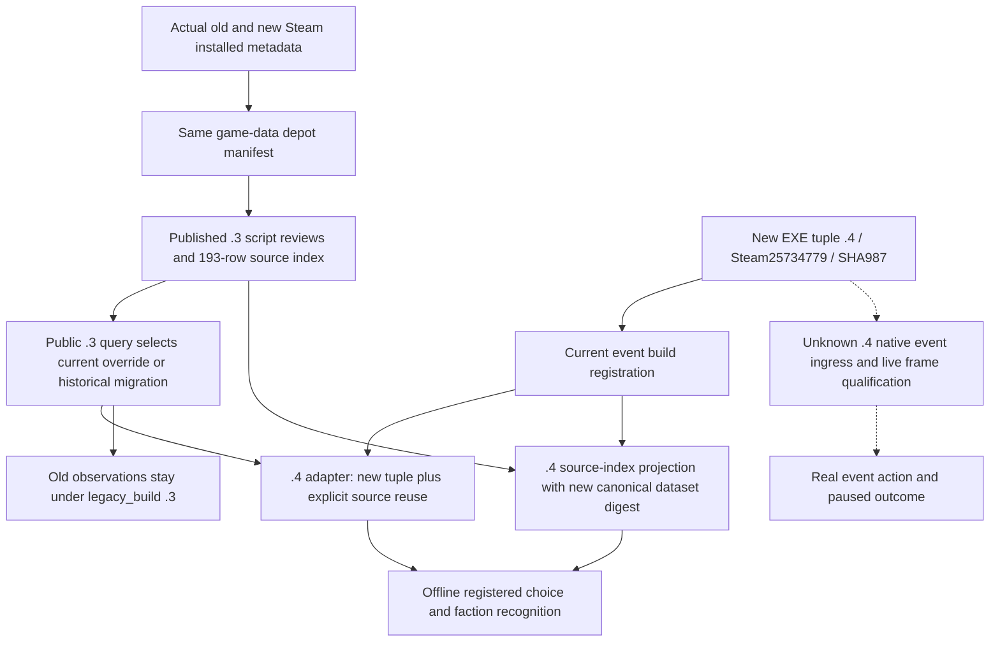

# Vanilla event source migration to CK3 1.20.0.4

Source plan sealed on 2026-10-07 (Asia/Shanghai), before implementation. This
package updates the event knowledge and offline consumers, with no game launch,
native query, callback, executable read, or installed game-data scan.

## Actual build and data evidence

The frozen installed build is CK3 **1.20.0.4**, Steam **25734779**, executable
SHA-256 **98702F88A547CDE2EAF29A85F93B85F68EE4CF8148336A4F7AFAEB75319DD518**.
The previous installed build is **1.20.0.3**, Steam **25652598**, executable
SHA-256 **94B55397ABB687A3DCD436805A5D885E6BE90FA6C693FEB44A9E3BBEEADE02A6**.
Their frozen `InstalledDepots/1158311` metadata both names manifest
**5078208590259867811**, declared size **19091661807** bytes. Both manifests
report `StateFlags=4`, `UpdateResult=0`, and `TargetBuildID=0`.

Evidence is in the existing small files:

- `artifacts/migrations/2026-10-07/installed-build/BUILD-FREEZE.json` and
  `appmanifest_1158310.acf`;
- `artifacts/migrations/2026-10-02/intake-build-identity.json` and
  `installed-build/appmanifest_1158310.acf`;
- external `Z:/ck3_mod_rewrite_process_assets/g2-migration-20261007/vanilla-events/data-proof/SOURCE-PROOF.json`.

The same Steam game-data manifest supports reuse of the published authored
script reviews, source file hashes, and lexical caller rows. It does not prove
executable ABI equality, independently verify local modified files, or transfer
old paused observations to the new executable. The EXE changed; the native
event ingress requires its separately owned exact-build migration.

## Actual production chain and minimum implementation

`vanilla_events/builds.py` supplies current identity and infers the event backend
literal `ck3-1.20.0.4-native-event-window-v1`. The public registry must dispatch
`.4` through the genuine `.3` query first: that query selects seventeen current
record groups before falling back to the historical registry and `.2/.3`
migration. Replacing the build map alone would miss the current record overrides.

The `.4` adapter copies that selected contract and source analysis, publishes
the new exact tuple and explicit same-depot reuse, and wraps prior observations
under `legacy_build=1.20.0.3`. Historical tuple, reviewed hashes, line ranges,
and observation contents remain available as prior evidence. No historical
module or `.3` index is rewritten. The obsolete war-package refusal is retained
only as a prior reason; `.4` reports `event_source_migration_pending` for the
unreviewed war event. An absent definition keeps its source-absence reason.

`source_index.py` derives a `.4` document from the published `.3` resource,
retaining its **193** rows and audit (**73** definition files, **83** candidate
files, **536** lexical references, **158** external / **35** same-file events).
The old dataset digest is
**698F66B83C6D45FAD4D5292E3AF2E6DB3721C92F736ADB9396E177BF8878D880**.
The derived identity and reuse ledger receive their own canonical JSON digest;
the old digest is provenance, never the new document digest. This is an authored
source-index projection, not a fresh source scan. Lexical hits remain lexical.

The policy preserves the current faction ultimatum read-only recognition on
`.4`; its comparison builder reports the requested `.4` identity while strict
native ingress remains unavailable until the ingress owner supplies `.4`
bindings. Other registered source-backed choices consume the selected `.3`
review through the migrated public query. Package data and replay provenance
include the resources required by the migration chain.

The existing discovery catalog still iterates its inherited default timeline
registry. Current override queries remain accessible through the public query,
but this package does not claim that discovery enumerates every override or all
vanilla events. It does not change `version_identity.py`, native bindings, or
the event-window ingress normalizer owned by the exact identity lane.

## Qualification boundary

One new compound production-consumer case is planned: exact registration and
backend inference, unchanged source rows plus a new dataset digest, a current
override and a historical migrated choice, faction read-only recognition,
unqualified `.4` frame rejection, and unchanged historical queries. Old cases
and live fixtures will not be rerun. Source migration is **static-ready** only
after this new case passes; native `.4` ingress and production-live execution
remain independently pending.

### First qualification, October 7

The implemented public `.4` query, source-index projection, backend inference,
registered notice/historical choice consumer, and faction read-only behavior
passed the single new production-consumer case on 2026-10-07 Asia/Shanghai:
**1 test GREEN**, unittest **0.152 s**, outer **2.7460017 s**. The case uses a
current override (`feast.7101`) and the inherited migration
(`epidemic_events.1100`), checks unchanged `.3` history and all 193 source rows,
and verifies `.4` faction frame comparison remains blocked on the unqualified
native ingress. The `.4` war review gap is `event_source_migration_pending`;
source-absent fervor retains `event_definition_not_present_in_current_build`.

Receipt and exact tested working-tree source pins:
`Z:/ck3_mod_rewrite_process_assets/g2-migration-20261007/vanilla-events/new-production-consumer-01/RESULT.json`.
There was no test RED, old-case rerun, native build, game operation, or
executable / installed game-data read or hash. `git diff --check` passed.
The source and offline consumer migration is **static-ready**. No `.4` paused
frame, live event action, native ABI qualification, or complete vanilla catalog
is claimed. The historical faction fixture now pins its literal `.3` SHA
instead of following `CURRENT`; it was not rerun.
