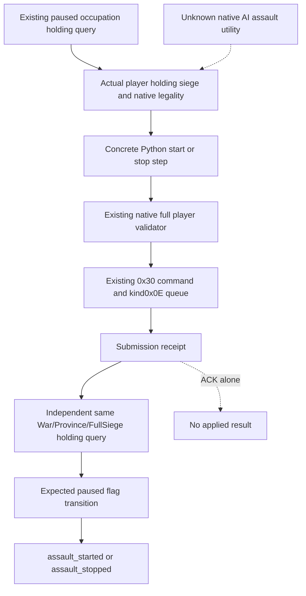

# CK3 1.20.0.3: assault commands for an observed non-objective holding

2026-10-06. This follows an actual Robert 29829 / War117440524 failure. The
background owner does not call CK3, SDK, a real pipe, UI or Steam, and does not
build a native binary. Root continues ordinary siege gameplay independently.

## Actual failure and exact cause

Root's `404-arta-start-one-day-assault.json` returned
`selected backend does not implement native war step start-assault-503316540`
at public691/native690/date53270736. This is a Python service refusal before
native submission, with no native ACK. The independent `405-arta-assault-independent-holding.json`
shows province473 / holding1314 / FullSiege503316540 / player public CUnit268435481,
breach2, assault=false, native CanStart=true, projected daily casualties36 and
eligible strength3690. These are cached Root observations, not new owner live reads.
Both files remain under `Z:/ck3_mod_rewrite_process_assets/g2-resume-20261006/gameplay-responses/`.

The native adapter is already implemented. The exact `.3` descriptor inherits
`game.command.start-assault-N` and `game.command.stop-assault-N` from the reviewed
`.2` capability list, and shared adapter methods call `SubmitStartAssault` /
`SubmitStopAssault`. The Python service checks the concrete `action_steps` list;
its driver expands those steps only from `objective_province_states`. Arta is
instead observed by the existing occupation holding query. The same omission
exists in the driver's pre-submit and independent post-submit siege lookup.
Calling the frozen `ck3_execute_step` therefore cannot solve this through its
normal contract: the driver still refuses the missing objective observation
before native send. No objective row should be fabricated to bypass it.

## Reused native tree, before the consumer change

The native tree and unchanged ABI proof already live in
[assault](episode03-assault-1.20.0.3.md), its
[frozen byte evidence](episode03-assault-1.20.0.3-static.json),
[Crozier migration](crozier-1.20.0.3-native-migration.md),
[relief/siege choices](war-relief-siege-native-ai-12003.md), and
[the actual holding reader](war-occupation-holding-siege-observation-12003.md).
Reuse the exact CK3 1.20.0.3 / Steam25652598 binding, EXE SHA-256
`94b55397abb687a3dcd436805a5d885e6be90fa6c693feb44a9e3bbeeade02a6`.
No old RVA is guessed or newly mapped, and no EXE is scanned or rehashed.

| Existing production leaf | Reviewed operation |
| --- | --- |
| `ck3_12003_adapter.cpp` | Exact `.3` SHA selects the frozen unchanged `.2` ABI bundle; `.3` identity stays actual |
| `ck3_12002_adapter.cpp` | Native start/stop methods forward to the shared military submitter |
| `ck3_12002_military.cpp` | Current living played actor, FullSiegeID and Province backlink, active flag, full validator |
| Start / stop validators | `0x29738C0` / `0x2973A70`, `(kind1, player, FullSiegeID, null tooltip)` |
| Start / stop command | Existing 0x30 `AssaultSiegeCommand`, actor+0x24, SiegeID+0x28; reviewed two vtables |
| Queue / cleanup | Existing `SubmitCommandCopy(..., kind0x0E)`, then existing command cleanup; no direct flag write |
| Holding observer | Existing rich `ReadObjectiveProvince` on the actual holding province; owning-thread native flag/validator read |

## Minimal consumer work and boundary

The implemented consumer only reads genuine, already normalized occupation rows bound to the current
paused player, WarID, date, native/public snapshot, connection generation and
episode, using the existing query freshness contract. Keep holding observations
separate from objective rows. The start/stop provider and native permission
remain unchanged; only Python capability expansion, observation selection and
independent postread need this source.

An active holding assault must also remain observable to the existing assault
lifecycle and one-day/speed1 consumer; this is part of making the same action
usable, not a new war policy. A later frame requires a fresh holding query.
No new hot-reload facility, MCP tool, code injection or native build is added.
One focused production-path offline case now exercises the actual missing
holding-only route through registered start/stop and independent query flags.
It cannot grant this new consumer live status, current casualty attribution,
an assault outcome or a completed war.

## Adopted Python change and focused validation

`assault_holding_observation_v1.py` consumes current occupation-query history with
the existing route consumer's binding checks. The driver adds concrete eligible
holding steps to its capability list, then uses a private local holding view for
pre-submit selection and lifecycle/timeline checks. The native objective list
and public snapshot state source stay unchanged. The existing service therefore
accepts the genuine current action without a bypass or a service change.

For a holding-sourced action, the driver uses the existing occupation query on
that same WarID after submission. It checks the
same ProvinceID/FullSiegeID and expected active flag, then reports
`assault_started` / `assault_stopped` with `observation_source=war_occupation_query`.
An unchanged snapshot revision is allowed because the non-objective flag may
only be exposed by this independent query. Each distinct paused revision is
queried once while waiting; the action command
is never resent. Objective-sourced postconditions retain their existing path.
The next gameplay frame needs a fresh occupation query to supply the same
lifecycle and day1/speed1 observation; a cached old frame does not become current.

The new `test_assault_holding_consumer_v1.py` case executes the actual registered
MCP → service → driver → occupation normalizer chain with an offline endpoint.
It uses Arta's cached selected IDs and scalar measurements, explicitly synthetic
one-row territory counters, submission ACKs and flag transitions. The wire is:
query → one start → independent query(true) → one stop → independent query(false).
It also confirms the known active lifecycle, one-day horizon and speed1 policy,
unchanged objective projection, native snapshot revision and raw date. No game day is advanced
by this fixture.

Actual validation command:
`python -B Z:/ck3_mod_rewrite_process_assets/g2-resume-20261006/assault-mcp-gap-gbsa/run_validation.py`.
The first successful source draft also passed at **1 test GREEN, 0.873 s, exit0**
(`VALIDATION-ATTEMPT-02.json`). Review then removed an unnecessary new-revision
requirement and changed the same testcase to model holding flags that change
only in the independent query. The final result and source pins are in
`VALIDATION-ATTEMPT-03.json`, `validation-attempt-03.log` and `OFFLINE-WIRE.json`;
final **1 test GREEN, 0.813 s, exit0**. These artifacts
retain the command, exact changed-source pins and synthetic protocol evidence.
The same directory preserves three import harness REDs: the sparse checkout
omitted the tracked Workshop compatibility package, and its existing `__init__`
requires its service-module imports. The harness extracts that existing package
at exact base564109c2, without constructing a service or calling Steam.
The first executed case's final request-count assertion omitted filtering an
existing snapshot transport request; `VALIDATION-ATTEMPT-01.json` / log preserve
that test harness RED. The functional start/postread/stop chain had already passed;
only the final assertion was corrected before the GREEN run. No old suite was rerun.

This is **static-ready Python consumption**, with no new native target, CTest,
binary, SDK, real pipe, UI, Steam, attach, runtime or game-day credit. Root owns
normal Python runtime adoption and actual paused flag/one-day/save verification;
the frozen g78 process has no supported hot-reload entry and is not changed by
this commit. `open_kaishek` is `not-applicable`: this is Python/MCP consumption of
native return values, with no supported Paradox script finite-runtime subset.
