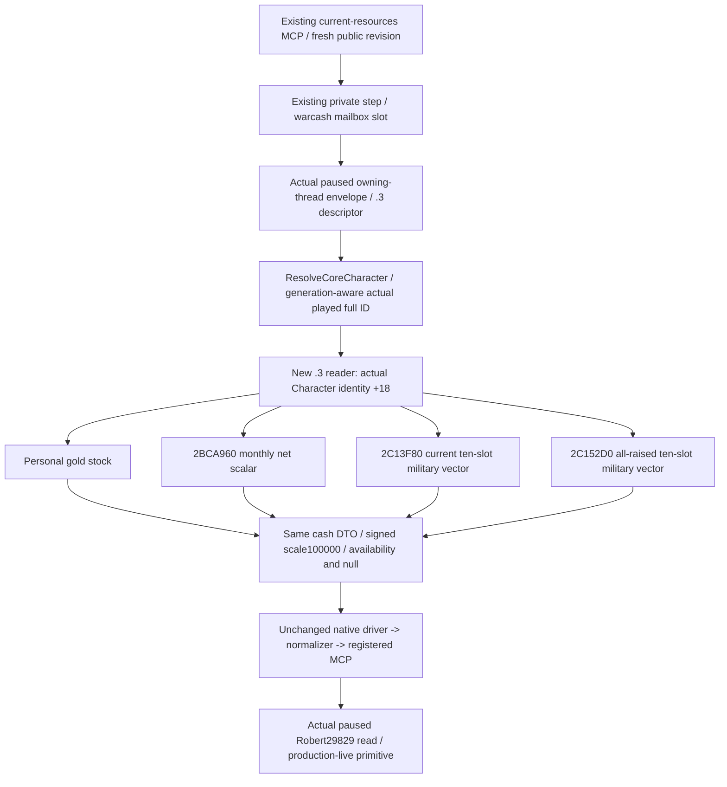

# Current war cash resources — CK3 1.20.0.3

2026-10-04 / 2026-W40. Exact game1.20.0.3, Steam25652598, EXE SHA `94B55397ABB687A3DCD436805A5D885E6BE90FA6C693FEB44A9E3BBEEADE02A6`. The current-resource query is **production-live primitive** after two focused producer→wire→registered MCP cases and Root's first GREEN actual paused Robert29829 read. The cached receipt below records all five native readiness fields as true; a complete cash-budget loop remains outstanding.

## Actual input gap and smallest implementation

The v55 manifest freezes g59 `edbe025c503460e522b8f54302c31c2d5bc59e55`, with `XAR_CK3_ENABLE_G2_M5_WAR_CASH_PRIVATE_QUERY_V1=OFF`. OFF alone was not the failure: the native source retained personal-gold reading and a null `warcash` executor slot, while the full cash producer, serializer and mailbox were absent. Existing Python current/termination wrappers and schema did not make a producer available. The historical whole mailbox admits1.20.0.2 and is not copied into this .3 implementation. Warfare authorization is already fully restored; OFF is an implementation/build fact.

The owner's resumed ordinary campaign needs current military expense and monthly balance for mobilization budgeting. The minimum implementation restores **the same** `ck3_query_war_cash_current_resources_private_v1(expected_revision=R)` and semantic step `query-war-cash-current-resources-v1`, using the existing owning-thread mailbox slot. It adds6 files and5 additive source changes; the existing Python driver, transport, normalizer and registered tool need0 changes. Termination/on-send fees, per-event-army classification, future-cost models and additional guards are outside this change.

## Closed native financial inputs

| Input | Closed .3 source | Native unit |
| --- | --- | --- |
| Personal gold | Actual resolved Character `+0x1B0` living extension, gold `+0x100` | Signed int64 gold stock /100000 |
| Monthly net gold | `0x2BCA960(out64, Character, nullptr, nullptr)` returns caller out | Signed gold/month /100000 |
| Current military expense | `0x2C13F80(out80, Character, nullptr)` returns caller out | Ten signed int64 resource slots/month /100000 |
| All-raised/maximum military expense | `0x2C152D0(out80, Character)` returns caller out | Native alternative total, ten slots/month /100000 |

The current getter's sealed span `0x2C13F80..0x2C142CE` is846 bytes, SHA `ec59d0b6df3d461361ada627545f0c23976562dd5501924b83894e08f392abc4`. Existing exact-build evidence is reused without another EXE extraction. Net income and maximum maintenance already appear in the ordinary .3 campaign-root path (`player_monthly_gold_income`, optional `player_max_monthly_gold_maintenance_v1`); the new cash query independently reads those existing sources together with current military expense.

The new reader uses an explicit `.3` namespace and `BindImage` identity; it does not label the actor or getter as `.2`. The existing adapter unwrap and owning-frame machinery are reused. The wire sets the existing `warcash` executor only for the actual .3 descriptor and handles the current-resource step before the legacy family dispatch. Actual active WarIDs, current player army IDs and queried native frame metadata come from the current envelope.

## Fields and meaning

| Existing DTO field | Meaning |
| --- | --- |
| `current_treasury.raw/scale` | Player personal gold stock; debt stays signed |
| `player_monthly_net_income.raw/scale` | Current native monthly net gold **rate**, not a measured cash delta between checkpoints |
| `military_expenses.current.gold_raw` | Native current military gold/month, slot0 |
| `military_expenses.all_raised.gold_raw` | Native all-raised alternative military gold/month, slot0 |
| `military_expenses.*.resource_raw_native` | All ten native resource slots, order preserved |
| `military_expenses.*.treasury_raw` | Slot6, a separate treasury resource; do not add it to gold |
| Status/nullable/readiness fields | Observed zero remains available zero; unavailable stays null with its reason |

The expense totals are actor-global, counted once across all wars. Current and all-raised are alternative totals; do not sum them or multiply by active-war count. Net income is already net; subtracting current military expense from it again would double-count. The query has no per-army/event-troop maintenance breakdown or actual elapsed-interval cash-flow ledger. It can observe the current native total relevant to mobilization without inventing an event troop multiplier. Parent-provided4456 saved days/revision1303/+431 and older655 gold remain coordination/history, not new cash observations.

## Sole focused validation and next actual query

The sole fixture owner runs3 strict MSVC x64 production TUs with `/O2 /DNDEBUG /W4 /WX /std:c++20 /Gy`, then links with `/OPT:REF`. It exercises the real reader and complete production serializer in two cases: positive military expense with signed negative net income, and legitimate available zero versus unavailable null. Production Character identity at`+0x18` is used while`+0x10` contains another value, so the initial source-only layout mismatch was corrected before execution within those same cases.

Both native cases and both existing registered MCP queries under Python `-O` are GREEN. The first Python attempt failed before issuing a query because an external projection omitted the original `tools/build_release.py` import dependency. That harness RED is preserved. Only that original dependency was supplied; the second attempt reuses the original GREEN native wire bytes, with0 production changes and no repeated native or old fixture run. This is static evidence, not a new live cash result.

After Root's next combined build/deploy, set the existing native flag `XAR_CK3_ENABLE_G2_M5_WAR_CASH_PRIVATE_QUERY_V1=ON` and append existing `--private-war-cash-queries` once to the current plan argv. Preserve the Root profile/state/pipe, private switches and frozen bindings. The owner-specified115 flag set becomes65ON/50OFF; this is a transparent build inventory, not a war prohibition. Then take one fresh paused snapshot and call `ck3_query_war_cash_current_resources_private_v1(expected_revision=R)` with that public revision. Consume its actual native frame/actor, gold/NET/current/all-raised values and readiness. Do not call the existing termination wrapper for this budget task.

Implementation and evidence are external at `Z:/ck3_mod_rewrite_process_assets/g2-resume-20261003/war-counter-campaign/cash-current-expense-v55/implementation/ROOT-DELIVERY.json`. Oct4/W40 fields and the retained harness attempt are linked there. Root owns the combined64 build, actual paused query, canonical adoption and commit/push. These file lanes add0 SDK/window/game actions,0 saved days and0 shared/Git mutations.

## First actual Robert current-cash observation — 2026-10-04

Root's paused ordinary Robert 29829 campaign returned the existing current-cash MCP as `available` at date_raw53251464, public/native revision2, snapshot `native:2`. All five native readiness fields are true: personal gold, monthly net income, current expense, all-raised expense, and same frame. This advances the query to **production-live primitive**. The cached active WarID is117440524; player full ArmyIDs are184549452 and301989997 in native order.

| Actual field | Raw /100000 | Value |
| --- | ---: | ---: |
| Personal gold stock | 65561127 | 655.61127 gold |
| Native monthly net income | 357546 | +3.57546 gold/month |
| Current military slot0 | 249354 | 2.49354 gold/month |
| All-raised military slot0 | 588900 | 5.889 gold/month |
| Current and all-raised slot6 | 0 | 0 separate treasury/month |

Both maintenance vectors contain ten signed slots; only slot0 is nonzero in this frame. NET is already net. Current/all-raised remain alternative actor-global totals, each counted once across wars. This observation does not establish free event troops, paid elapsed-interval cash flow, a future war-cost upper bound, or a complete cash-budget loop; `formal_action_ready=false` and both `future_war_cost_upper_ready=false` remain truthful.

The sole raw consumer already read and hashed `runtime-preparation/v56/actual-r29-original-sway-four-cash-new-army-preview-01/012-ck3_query_war_cash_current_resources_private_v1.json` once (6486 bytes, SHA256 `c102791be407d3ba9adc45fa146dc8c173abce3095ef92e68c3927f3b9e3ecc3`). This append consumes only `cash-current-expense-v55/actual-r29-consumption/CACHED-FIELDS.json`, `TABLE.md`, and `READINESS.json`; it issues no query, test, raw reread, SDK, or window operation. Unpublished episode/connection metadata remain null in the cache.

Root supplied runtime context: PID38372, source g61f3, DLL SHA prefix8545934, environment SHA prefix898b68, saved-day count4464, and +0 new saved days for this read. These coordination fields do not replace the query's actual frame provenance. The retained initial deployment plan above is historical; Root's actual deployment and first current-resource read are now complete. Root owns canonical/report adoption and commit/push.

## Episode04 William CUnit0 transport correction — 2026-10-04

R0161's first actual William33388 request at date53147160/public3/native2 returned `war cash resource identities are malformed`; its body is null, so no William NET/current/all-raised value is claimed. The current snapshot legitimately contains public CUnitIDs `[0,16777220,166]`. The native producer and enabled current-resource macro were present; Python's shared identity check incorrectly required both ArmyIDs and WarIDs to be positive.

The existing normalizer now accepts strict integer ArmyIDs starting at0 while WarIDs remain positive. Two focused regressions preserve Army0 through the actual production driver/transport path and still reject War0. This is a Python correction; the frozen f853 capture checkout and loaded DLL were not changed. The original failed request remains at `C:/ck3-war-episode04-research-20261004-a01/operations-main-case-a01/starting-health-a01/004-000-cash.response.json`. A fresh, explicitly bound runtime query remains required before any William monthly-rate claim.

The focused suite also exposed a historical fixture-byte mismatch: all six tracked fixture blobs had been normalized to LF on their original commit while the native serializer provenance retained CRLF hashes. Restoring only the line endings reproduces all six original hashes exactly. A narrow `-text` attribute now preserves these native bytes; the provenance manifest and exact-byte test were retained. Diagnosis and restoration pins are in `C:/ck3-war-episode04-research-20261004-a01/cash-fixture-hash-review-a01/` and `adoption-cash-live-a01/`; no financial source or expected SHA was changed.

## 2026-10-05：R0162 William 当前费用真实实读

`initial-cash-a02.json` 同 paused native:2/public3/date53147160，角色33388；runtime Python dba795、DLL 编译来源2db29c，二者 native C++树逐字节相同。个人金币654.18341，已经净掉支出的月收入+4.69417；当前军费3.88749/月，全部集结替代月率4.87050/月。不能把两种军费相加，也不能再从净收入扣一次。raw整数/100000精确换算。两个十槽vector完整、treasury槽6=0，不把 treasury 并入个人gold。

player_army_ids [0,16777220,166] 与同帧snapshot一致；这里的0是合法PublicCUnitID，不从cash表推nativeCArmyID或免费军队。cash packet SHA7a0430c2e7211a76cb2e0af514ebe2247b86336b9a195ca62ad63f94582adfc9；完整解释在 `C:/ck3-war-episode04-research-20261004-a01/cash-live-r0162-a01/ACTUAL-CASH-INTERPRETATION.json`。已实读财务primitive不等于正式战争预算loop：advertised=false/formal_action_ready=false，未取得累计行军费用、登船实际支付流水或逐军分摊。

## 2026-10-05 勘误：旧 NET 字段实际为月总收入；新版完整支出合同

**上文三处历史 NET 解释已纠正，原日期、原始 packet、失败 attempt 和当时文字保留。旧 `.3` producer 的 `player_monthly_net_income` 实际只调用 `0x2BCA960`，取得月总收入，不能按已扣支出的净额使用。** 本勘误不重写历史原始数据，也不将静态修复当作新 DLL 实机验收。

| 保留的旧记载 | 2026-10-05 纠正及使用边界 |
| --- | --- |
| 初始 “Monthly net gold / `2BCA960`”、字段意义和 “already net” 解释 | `2BCA960` 为月金币收入侧；完整月金币支出是 `2BCB180`，净值必须为二者差，不能只扣军费 |
| 2026-10-04 Robert29829 实读 `357546`，旧表写 `+3.57546` 月净额 | 保留该读取事实；值只证明月总收入 `+3.57546`，实际完整支出和 NET 当时未读 |
| 2026-10-05 追加的 R0162 William33388 实读 `469417`，旧文写已净支出 `+4.69417` | 保留原 packet SHA `7a0430c2e7211a76cb2e0af514ebe2247b86336b9a195ca62ad63f94582adfc9`；值是月总收入 `+4.69417`，不能再把它作为 NET。R0164 Jan11 同数值也适用这一纠正 |

上述帧的金币余额及 current/all-raised 维护读取不因此失效。两种维护仍为角色跨全部战争各计一次的替代总量，不相加、不按战争数乘、不把 treasury 资源槽6加入个人金币。**只有新 `monthly_income_semantics.version=ck3-1.20.0.3-native-income-minus-total-expenses-v2` 才证明本次 NET 合同；旧无标记 packet 的字段名和 ready=true 均不能代替该语义证明。**

Exact `.3` HUD 原生 writer `DF1C70..DF20C9`（1113B / SHA `e5b02e7831555c2edcb37227e4530858ce24a6041a14d9659adceb97c68b28e9`）先取得 `28BFDA0(Character)` 返回的 ExpenseContextCharacter，再调用 `2BCA960(out64, Character, secondary_out64, nullptr)`，将 secondary 收入整数交给 `2BCB180(out64, Character, ExpenseContextCharacter, secondary_income64, false, nullptr)`，最后做收入减完整支出并写 Topbar `+B88`。返回 context 可以不同于 played Character，按原版链传递；`false` 保留军事支出，不以军事小计代替完整支出。两个数均为 signed int64 /100000、金币/月；此 writer 不除30。`InGameTopbar.GetGoldBalance` 读取该缓存。Renderer epoch 与真实结算时刻分开，R0164 HUD 的 `+0.2`/`+0.3` 不能凭数值拟合恢复未采样的完整支出，也不能证明不同日期 cache 与 private query 同帧。未经核验的 `.2` 不外推。

新版 [reader](../../ck3_autonomous_player/native_bridge/src/ck3_12003_war_cash_current_reader.cpp) 保留已核 `.3` EXE SHA 绑定、paused owning-thread mailbox 和完整快照前后相等门禁，增加 Character 类型/full ID/alive 重读与 caller-out 返回指针核对；丢失 context、getter、身份或返回指针时 NET 保持 null，有效零保留0，signed 减法溢出保留两个可审输入并把 NET 置为明确 unknown。序列化添加 `player_monthly_gross_income`、`player_monthly_total_expenses` 和独立 availability/reason；原 NET 字段保持位置并改为真正净额。Python 对新标记严格核对 exact build、月/个人金币 scope、signed scale100000、readiness 与数学合同；旧无标记原始 payload 按历史合同保留，不能被追认成已验 NET。

外置候选基于主树 `c77734c9c11a90b8080139d4658e9bd27b2b8464`，来源和 focused 验证包在 `C:/ck3-war-episode04-research-20261004-a01/cash-net-fix-candidate-20261005-a01/`。实际生产 reader/serializer 配 fake native bindings 的严格 MSVC Release/NDEBUG 构建已通过，六份实际序列化 wire 经注册的 in-memory MCP、实际 driver 和生产 normalizer 完整往返；新增 Python 合同8项通过。Focused CMake target及两项 CTest也实际通过。提醒前测试 EXE 曾在新路径排除回读前运行，流程缺口与待登记 target manifest 如实保存在 `defender-registration-pending-a01/PENDING.json`，随后停止 EXE 重跑；不把此前执行说成已符合新路径排除门禁。所有测试为 offline/static，未执行 CK3 原生 getter、游戏、屏幕或 live SDK。

Root 仍需按顺序审核/集成源码、用已正式登记的构建输出生成新 DLL，冻结新来源后取得一次实际暂停 current-cash packet，核对 gross、完整 total、NET、语义标记和 same-frame。R0165 旧 a06 只用已证余额，不消费旧 NET 做费用计算。当前仍无实际累计行军费用、登船付款流水、逐军维护分摊或完整战争预算 loop；净率不等于实付，也不能从新 NET 再扣一次军事维护。
