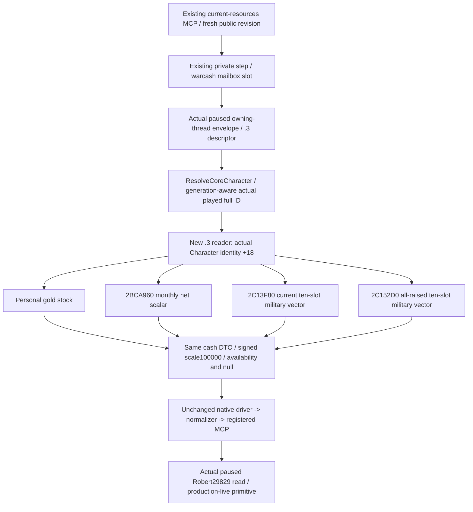

# Current war cash resources — CK3 1.20.0.3

2026-10-04 / 2026-W40. Exact game1.20.0.3, Steam25652598, EXE SHA `94B55397ABB687A3DCD436805A5D885E6BE90FA6C693FEB44A9E3BBEEADE02A6`. The current-resource query is **production-live primitive** after two focused producer→wire→registered MCP cases and Root's first GREEN actual paused Robert29829 read. The cached receipt below records all five native readiness fields as true; a complete cash-budget loop remains outstanding.

## Actual input gap and smallest implementation

The v55 manifest freezes g59 `edbe025c503460e522b8f54302c31c2d5bc59e55`, with `XAR_CK3_ENABLE_G2_M5_WAR_CASH_PRIVATE_QUERY_V1=OFF`. OFF alone was not the failure: the native source retained personal-gold reading and a null `warcash` executor slot, while the full cash producer, serializer and mailbox were absent. Existing Python current/termination wrappers and schema did not make a producer available. The historical whole mailbox admits1.20.0.2 and is not copied into this .3 implementation. Warfare authorization is already fully restored; OFF is an implementation/build fact.

The owner's resumed ordinary campaign needs current military expense and monthly balance for mobilization budgeting. The minimum implementation restores **the same** `ck3_query_war_cash_current_resources_private_v1(expected_revision=R)` and semantic step `query-war-cash-current-resources-v1`, using the existing owning-thread mailbox slot. It adds6 files and5 additive source changes; the existing Python driver, transport, normalizer and registered tool need0 changes. Termination/on-send fees, per-event-army classification, future-cost models and additional guards are outside this change.

## Closed native financial inputs

| Input | Closed .3 source | Native unit |
| --- | --- | --- |
| Personal gold | Actual resolved Character `+0x1B0` living extension, gold `+0x100` | Signed int64 gold stock /100000 |
| Monthly net gold | `0x2BCA960(out64, Character, nullptr, nullptr)` returns caller out | Signed gold/month /100000 |
| Current military expense | `0x2C13F80(out80, Character, nullptr)` returns caller out | Ten signed int64 resource slots/month /100000 |
| All-raised/maximum military expense | `0x2C152D0(out80, Character)` returns caller out | Native alternative total, ten slots/month /100000 |

The current getter's sealed span `0x2C13F80..0x2C142CE` is846 bytes, SHA `ec59d0b6df3d461361ada627545f0c23976562dd5501924b83894e08f392abc4`. Existing exact-build evidence is reused without another EXE extraction. Net income and maximum maintenance already appear in the ordinary .3 campaign-root path (`player_monthly_gold_income`, optional `player_max_monthly_gold_maintenance_v1`); the new cash query independently reads those existing sources together with current military expense.

The new reader uses an explicit `.3` namespace and `BindImage` identity; it does not label the actor or getter as `.2`. The existing adapter unwrap and owning-frame machinery are reused. The wire sets the existing `warcash` executor only for the actual .3 descriptor and handles the current-resource step before the legacy family dispatch. Actual active WarIDs, current player army IDs and queried native frame metadata come from the current envelope.

## Fields and meaning

| Existing DTO field | Meaning |
| --- | --- |
| `current_treasury.raw/scale` | Player personal gold stock; debt stays signed |
| `player_monthly_net_income.raw/scale` | Current native monthly net gold **rate**, not a measured cash delta between checkpoints |
| `military_expenses.current.gold_raw` | Native current military gold/month, slot0 |
| `military_expenses.all_raised.gold_raw` | Native all-raised alternative military gold/month, slot0 |
| `military_expenses.*.resource_raw_native` | All ten native resource slots, order preserved |
| `military_expenses.*.treasury_raw` | Slot6, a separate treasury resource; do not add it to gold |
| Status/nullable/readiness fields | Observed zero remains available zero; unavailable stays null with its reason |

The expense totals are actor-global, counted once across all wars. Current and all-raised are alternative totals; do not sum them or multiply by active-war count. Net income is already net; subtracting current military expense from it again would double-count. The query has no per-army/event-troop maintenance breakdown or actual elapsed-interval cash-flow ledger. It can observe the current native total relevant to mobilization without inventing an event troop multiplier. Parent-provided4456 saved days/revision1303/+431 and older655 gold remain coordination/history, not new cash observations.

## Sole focused validation and next actual query

The sole fixture owner runs3 strict MSVC x64 production TUs with `/O2 /DNDEBUG /W4 /WX /std:c++20 /Gy`, then links with `/OPT:REF`. It exercises the real reader and complete production serializer in two cases: positive military expense with signed negative net income, and legitimate available zero versus unavailable null. Production Character identity at`+0x18` is used while`+0x10` contains another value, so the initial source-only layout mismatch was corrected before execution within those same cases.

Both native cases and both existing registered MCP queries under Python `-O` are GREEN. The first Python attempt failed before issuing a query because an external projection omitted the original `tools/build_release.py` import dependency. That harness RED is preserved. Only that original dependency was supplied; the second attempt reuses the original GREEN native wire bytes, with0 production changes and no repeated native or old fixture run. This is static evidence, not a new live cash result.

After Root's next combined build/deploy, set the existing native flag `XAR_CK3_ENABLE_G2_M5_WAR_CASH_PRIVATE_QUERY_V1=ON` and append existing `--private-war-cash-queries` once to the current plan argv. Preserve the Root profile/state/pipe, private switches and frozen bindings. The owner-specified115 flag set becomes65ON/50OFF; this is a transparent build inventory, not a war prohibition. Then take one fresh paused snapshot and call `ck3_query_war_cash_current_resources_private_v1(expected_revision=R)` with that public revision. Consume its actual native frame/actor, gold/NET/current/all-raised values and readiness. Do not call the existing termination wrapper for this budget task.

Implementation and evidence are external at `Z:/ck3_mod_rewrite_process_assets/g2-resume-20261003/war-counter-campaign/cash-current-expense-v55/implementation/ROOT-DELIVERY.json`. Oct4/W40 fields and the retained harness attempt are linked there. Root owns the combined64 build, actual paused query, canonical adoption and commit/push. These file lanes add0 SDK/window/game actions,0 saved days and0 shared/Git mutations.

## First actual Robert current-cash observation — 2026-10-04

Root's paused ordinary Robert 29829 campaign returned the existing current-cash MCP as `available` at date_raw53251464, public/native revision2, snapshot `native:2`. All five native readiness fields are true: personal gold, monthly net income, current expense, all-raised expense, and same frame. This advances the query to **production-live primitive**. The cached active WarID is117440524; player full ArmyIDs are184549452 and301989997 in native order.

| Actual field | Raw /100000 | Value |
| --- | ---: | ---: |
| Personal gold stock | 65561127 | 655.61127 gold |
| Native monthly net income | 357546 | +3.57546 gold/month |
| Current military slot0 | 249354 | 2.49354 gold/month |
| All-raised military slot0 | 588900 | 5.889 gold/month |
| Current and all-raised slot6 | 0 | 0 separate treasury/month |

Both maintenance vectors contain ten signed slots; only slot0 is nonzero in this frame. NET is already net. Current/all-raised remain alternative actor-global totals, each counted once across wars. This observation does not establish free event troops, paid elapsed-interval cash flow, a future war-cost upper bound, or a complete cash-budget loop; `formal_action_ready=false` and both `future_war_cost_upper_ready=false` remain truthful.

The sole raw consumer already read and hashed `runtime-preparation/v56/actual-r29-original-sway-four-cash-new-army-preview-01/012-ck3_query_war_cash_current_resources_private_v1.json` once (6486 bytes, SHA256 `c102791be407d3ba9adc45fa146dc8c173abce3095ef92e68c3927f3b9e3ecc3`). This append consumes only `cash-current-expense-v55/actual-r29-consumption/CACHED-FIELDS.json`, `TABLE.md`, and `READINESS.json`; it issues no query, test, raw reread, SDK, or window operation. Unpublished episode/connection metadata remain null in the cache.

Root supplied runtime context: PID38372, source g61f3, DLL SHA prefix8545934, environment SHA prefix898b68, saved-day count4464, and +0 new saved days for this read. These coordination fields do not replace the query's actual frame provenance. The retained initial deployment plan above is historical; Root's actual deployment and first current-resource read are now complete. Root owns canonical/report adoption and commit/push.
