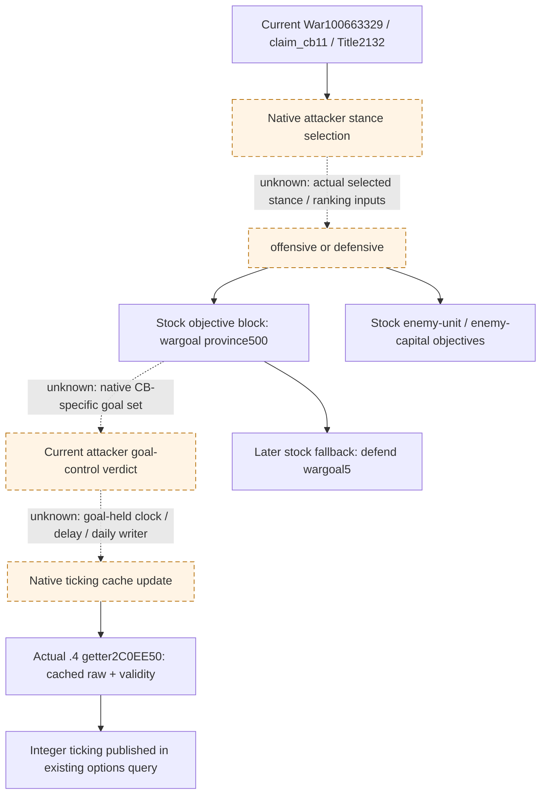
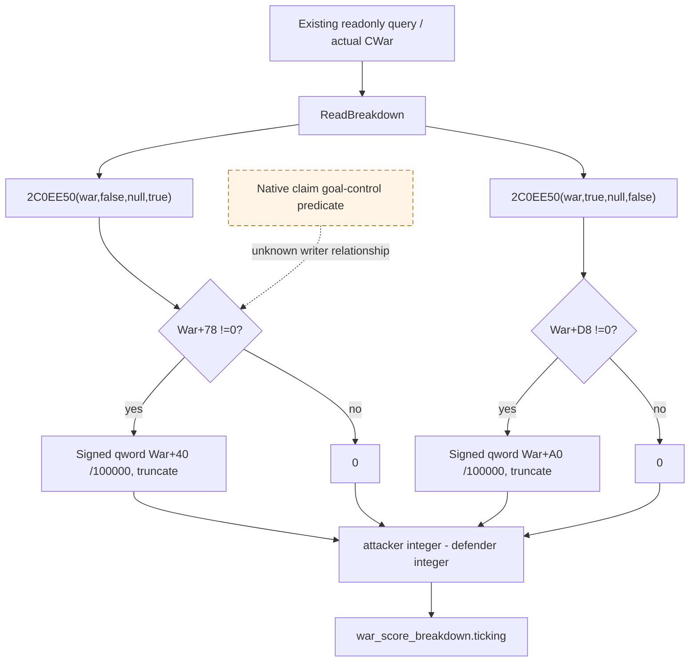

# R76 claim war: native objective control input (1.20.0.4)

Date: 2026-10-08, Asia/Shanghai; ISO week 2026-W41. Status: **research**. This package selects one missing observation, records the current native tree and gives a bounded source request. It does not implement a getter, alter the ordinary planner, run a query, or add a victory/occupation/day credit.

## Frozen sources and actual observation

The installed build is CK3 **1.20.0.4**, Steam build **25734779**, EXE size **101040248 bytes**, SHA-256 **98702F88A547CDE2EAF29A85F93B85F68EE4CF8148336A4F7AFAEB75319DD518**. This existing freeze is reused; no EXE/hash operation was performed here.

Keep the two source baselines separate:

| Baseline | Purpose | Boundary |
| --- | --- | --- |
| `Z:/gbs1-m7-formal4-stack30` at `4e06f9454ef9f0e8173d30d8259625d3396929b9` | Source of Root's actual production DLL | Its DTOs, native profile and readers establish what the current DLL can publish. |
| `Z:/gbs-m4-construction-cli-35dd` at `cc1e6a9e249ebeffdba1e6c910615041f090bf34` | Frozen SDK/planner source | This document's detached worktree is `Z:/gbs-war-winner-objective-r76`. Inherited native source is not evidence that a different DLL has adopted it. |

Root-produced [R76 options response](Z:/ck3_mod_rewrite_process_assets/g2-background-20261007/upstream-build-migration/managed-full-h9658-startup30restore01/operator/gameplay-responses/008-r75-ooda-turn.json) contains an actual available native termination query, selected step `query-war-termination-options-100663329`:

- Robert **29829**, attacker and primary leader; opponent **31050**; WarID **100663329**, targeted TitleID **2132**.
- Query frame `native:2`, public revision **3**, native revision **2**, connection generation **1**, episode `native-29829-2bc2d599f7f9`, raw date **53288472**.
- War age **23 days**, attacker/defender/player-relative total **0**, and all four observed integer components **0**.
- Active CB identity `{database_index: 11, canonical_key: "claim_cb"}`. `cb_allows_white_peace=true` is permission in the loaded CB; the current white-peace context has `native_validator_passed=false, available=false`. Victory is likewise unavailable. Surrender is available and auto-accepted.

The response's path is `result.structured_content.result`; the CB identity is `war_termination_options.active_casus_belli_identity`, and outcomes are under `.options`. The wrapper status is `executed`; it is not a `status` member of the options object. Root's current objective candidates **2606/2608** are the supplied active-war projection, not a wargoal denominator measured by this options response. Root continues ordinary war progression/strength observation; this research does not select surrender or manufacture an end-war result.

## Native tree before planner changes

Reuse [the native AI workflow](README.md), [army coordinator/objective tree](army-controller.md), [historical score-input boundary](episode03-occupation-war-score-1.20.0.3.md) and [occupation collection semantics](war-occupation-targets-12003.md). Historical `.3` addresses remain historical; the getter below has its own actual `.4` paired proof.

The current installed stock [`00_ai_war_stances.txt`](<Z:/ck3_mod_rewrite/Crusader Kings III/game/common/ai_war_stances/00_ai_war_stances.txt:3>) prioritizes `wargoal_province=500` in both ordinary attacker stances. Offensive enemy-unit candidates in the wargoal/primary-attacker area have priority250; enemy capital150 and enemy province100 follow. The defensive attacker stance also has an enemy-unit objective500. Subsequent `defend_wargoal_province=5` is a separate fallback block. These are stock objective priorities, not proof of the currently selected stance or final path/rank.

The installed stock [`claim_cb`](<Z:/ck3_mod_rewrite/Crusader Kings III/game/common/casus_belli_types/00_claim.txt:805>) explicitly sets `attacker_wargoal_percentage=0.8`, `should_show_war_goal_subview=yes`, and occupation caps150/150. A source lookup found **no explicit `use_de_jure_wargoal_only` assignment in this file**. Do not inherit that flag from populist, religious or de-jure CBs.

The installed [`_casus_belli.info`](<Z:/ck3_mod_rewrite/Crusader Kings III/game/common/casus_belli_types/_casus_belli.info:10>) defines the threshold as the part of the wargoal the attacker must occupy to gain ticking score;0.0 still requires an occupation. Its [goal-set rule](<Z:/ck3_mod_rewrite/Crusader Kings III/game/common/casus_belli_types/_casus_belli.info:71>) distinguishes de-jure-only from the unset mode: de-facto land under the target, excluding land de-jure under another title personally held by the defender. These are stock declarations/schema semantics. The actual loaded flag, runtime denominator and current verdict still need native evidence.

The `.info` examples are not defaults. Current installed [`NWar`](<Z:/ck3_mod_rewrite/Crusader Kings III/game/common/defines/00_defines.txt:723>) declares default attacker ticking0.055/day with0-day delay, defender0.055/day with365-day delay. `claim_cb` does not explicitly override those keys in this file. Loaded rates and the real goal-held clock are not observed here. In particular, war age23 cannot stand for23 days of holding the goal.

## Closed exact getter boundary

The existing actual `.4` [complete ticking map](Z:/ck3_mod_rewrite_process_assets/g2-parallel-20261007/battle-pursuit/migration-steam25734779/actual4-domain/diplomacy-map/score-first01/war_score_ticking-DETAIL.json) closes old `.3` `0x2C0EE70` to actual `.4` **`0x2C0EE50`**, full **841 bytes**. Its [family row](Z:/ck3_mod_rewrite_process_assets/g2-parallel-20261007/battle-pursuit/migration-steam25734779/actual4-domain/diplomacy-map/score-first01/FAMILY-MAP.json) records complete decoding, normalized nonaddress operands, ordered edges and local control topology equal. The `.4` binder uses this concrete address; no uniform-shift inference is needed.

`GetWarScoreTicking(void* war, bool side, void* tooltip_context, bool tooltip_direction)` has an already adopted null-context path. The important operand offsets in the actual body are:

| Body offset | Operation | Exact role |
| --- | --- | --- |
|40,43,47,50 | preserve R8, read DL, retain RCX War, invert selector | Existing `side=false` selects attacker; `side=true` defender. |
|54,59,64,80 | select0x78/0xD8 and compare byte against0 | Attacker `War+0x78` and defender `War+0xD8` gate the cached contribution. |
|86,91,99,105 | select0x40/0xA0 and multiply signed qword | Actual signed64 cached raw contribution, separately for each side. |
|109–125 | division by100000 with signed truncation | First conversion to displayed integer. |
|137–140 | test R8 and branch when null | Existing reader avoids the tooltip branch. |
|782–799 | final signed division | Return the integer; zero can arise from disabled cache or fractional accumulation. |

This getter **does not recompute goal eligibility** on the production null-context path. The byte gates are proven cached score validity gates, not a proved alias for "attacker currently controls80%". The full body likewise does not supply a goal-held clock or a native goal collector; expanding formatting/allocator callees would not locate the missing predicate.

Reuse the already closed hostile191-byte callback proof without rereading or expanding it: [Hostile receipt](Z:/ck3_mod_rewrite_process_assets/g2-parallel-20261007/battle-pursuit/migration-steam25734779/arrival-readonly-migration/HOSTILE-SOURCE-RECEIPT.json), actual `0x2C09620`. It remains an arrival/contact input with production literal-false third argument; it is not a claim objective or ticking predicate.

## Why this is one missing input

Current production sources already expose:

- `ActiveWarSnapshot.targeted_title_ids`, `war_objective_province_ids` and rich objective province state in [game_contract.hpp](Z:/gbs1-m7-formal4-stack30/ck3_autonomous_player/native_bridge/include/xar_bridge/game_contract.hpp:1774).
- War-scoped occupation holding rows and real opposing-participant occupied/eligible counters in [war_occupation_targets_v1.hpp](Z:/gbs1-m7-formal4-stack30/ck3_autonomous_player/native_bridge/include/xar_bridge/war_occupation_targets_v1.hpp:85). The adopted [reader](Z:/gbs1-m7-formal4-stack30/ck3_autonomous_player/native_bridge/src/ck3_12003_war_occupation.cpp:190) enumerates native territory participants/holding occurrences for occupation score. Those totals are not proved to be the CB wargoal denominator.
- Current integer score/CanSend/CB identity in [ReadWarTerminationOptions](Z:/gbs1-m7-formal4-stack30/ck3_autonomous_player/native_bridge/src/ck3_12002_diplomacy.cpp:232).

The existing [objective projection](Z:/gbs1-m7-formal4-stack30/ck3_autonomous_player/native_bridge/src/ck3_12002_province.cpp:167) recursively visits de-jure children; county/barony roots return the title's province. It does not apply the loaded CB goal-set rule or measure fortified-holding control. Two projected provinces, physical occupied booleans, and broad native occupation n/N cannot substitute for the native threshold verdict.

Selected new input: **the actual current native attacker wargoal-control verdict for this CWar**, proposed wire field `attacker_controls_native_wargoal` in an optional `war_goal_control_v1` block. The name is a proposed observer contract, not an already located engine symbol. Available output must contain an actual bool returned/computed by the source-closed native condition. Unknown ABI or unreadable current state stays unavailable; schema presence/null is not completion.

Minimum identity is the same query frame, full WarID, actor, active CB identity and targeted TitleIDs. Publish native eligible/controlled counts, threshold/raw fraction or contributing holding identities only if the closed predicate already supplies them. Do not invent their values from2606/2608 or reconstruct a whole score forecast. Goal-held clock/rates, capture scoring and recipient decisions are separate future inputs.

This observation unlocks a specific ordinary-planner distinction: **take more qualifying goal land versus maintain already qualifying control**. It does not itself rank2606 over2608, prove either holding contributes, predict a win date, or justify a terminal action.

## Bounded source request and construction entry

The machine-readable [request ledger](../../ck3_autonomous_player/native_bridge/research/war_claim_objective_score_r76_12004.json) preserves all unknown RVAs/ABI as null. No new capture was run. Root/central was asked for an existing actual `.4` CWar ticking-update/held-goal source or the `WarOverviewWindow.GetTickingWarScoreTooltip` registration/callback cache.

1. **Cache first:** accept an existing exact `.4` registered callback or daily-writer receipt with fullbody/layout context. Do not remap2C0EE50, hostile, occupation counter/collector, or province siege functions. The old `1.19.0.6` UI literal RVAs in `war_film_retreat_evidence_a03.json` are historical locators and cannot be shifted into this build.
2. **If missing, request one finite locator packet:** exact `.4` registration row for `WarOverviewWindow.GetTickingWarScoreTooltip` and its installed `.4` literal, plus the callback pointer and its cached `.pdata` interval. Physical spans/lengths must be declared from metadata before a read. If central instead holds the actual CWar daily ticking writer, use that single source entry. This task does not authorize a whole-image scan, unknown-length read or new capture execution.
3. **One actual callback/writer body:** decode the complete declared runtime span(s), retaining bytes, argument setup, condition branches, signed widths and ordered edges. Follow only the direct CWar goal-control condition/collector needed to distinguish this current claim. Formatting, string cleanup and unrelated score/capture branches stay at the cached frontier. A chained `.pdata` prefix is not a complete logical function.
4. **Close the verdict:** identify actual CWar receiver, current CB policy/threshold, target collection/qualification and comparison semantics. Record the real call ABI and returned value. For title2132, determine whether2606/2608 are members of that native goal set, using native identities rather than geographic guessing. If one helper body is still required, deliver that exact call edge and metadata-sized request; do not fill an inferred RVA.
5. **Connect the same existing readonly query:** add the optional block to `WarTerminationOptionsSnapshot`, read it inside `ReadWarTerminationOptions` using its already resolved CWar and frame, and serialize/normalize through the existing options wire. Reuse actual `.4` `BindDiplomacyImage`; do not substitute the `.3` binder. SDK seam: `normalize_war_termination_options` → NativeDriver/Service options path → registered `ck3_query_war_termination_options`. There is no new process hook or action command.
6. **Only then consume in the ordinary planner:** the frozen SDK's `_attacker_siege_objective_province_ids`, `_progress_siege_objectives`, `_player_occupied_objective_ids` and `_rank_exact_objectives` are the present candidate/occupation/rank seams in [strategy.py](../../ck3_autonomous_player/src/xar_autoplayer/strategy.py:14927). The proposed verdict distinguishes further conquest from retaining control. Existing route, current strength/contact, fort/garrison and siege eligibility still choose an executable move. Fresh native victory CanSend remains the terminal authority.

Required FIRST semantics after implementation are a native goal predicate false while a projected capital is occupied, true while integer ticking is still0, and source-unavailable distinguished from a genuine false; if the native target collection has a relevant extra holding, preserve its identity/order. These are future requirements, not fixtures run or results claimed here. Root then obtains one paused current-War query at the actual deployed artifact before granting production-live observation.

The province lane owns siege eligibility, stored leader and war occupation attribution in its [Oct8 topic](war-siege-target-contribution-r76-12004.md), delivered as `e75bc647d2b9cf383d9e1d5ff6d0a912f4dc24eb` for Root integration. Its existing `province_unit_occurrences` observes independently eligible army contributions; `player_army_besieging=false` can mean a foreign stored lead. This lane does not duplicate or reinterpret those fields. The native goal verdict is an independent dependency.

## Cost, readiness and report fields

New physical EXE reads/bytes, hashes, mapping runs, native calls, SDK/game operations, builds, imports and tests: **0**. Cache/source inspection reused the existing841-byte ticking complete-body packet; the4275-byte occupation getter packet was used only for its already recorded selected calls/frontier, and hostile191-byte proof by receipt without body reread. Those are existing captures, not5307 newly read EXE bytes or new mapping credit. Historical `.3` sampling/docs were used to find the already known observation gap, not requalified on `.4`.

Completed: R76 actual options consumed; actual `.4` cached ticking boundary and stock claim/AI goal semantics recorded; existing production exposure distinguished from SDK source; one decisive missing goal-control observation selected; bounded next source request and reader/MCP/planner construction entry written. Readiness remains **research**, exact goal evaluator ABI/address **unknown**; no new `static-ready`, fixture-live, production-live primitive/loop or G2 completion credit. Source-preparation misses for historical optional files did not constitute capability RED. No executable/currentquery verification was attempted.

Oct8/W41 report handoff: why—ordinary claim victory needs qualifying goal control rather than guessing from score0 or two capitals; ongoing—locate exact actual `.4` native goal predicate/collector from one cached source entry; next—source-close the finite predicate, publish it on the existing readonly options query, qualify once and obtain Root paused evidence. Gameplay progression remains Root-owned. English doc/research commit and one `git diff --check` are the only validation in this package; the shared daily/weekly reports and integration/push are Root-owned.
