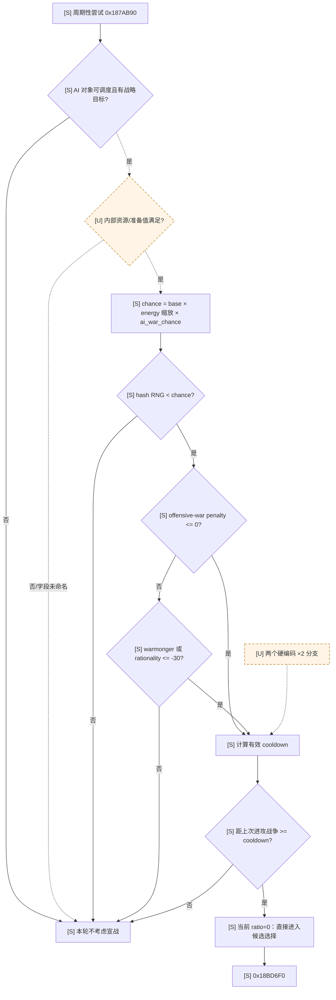
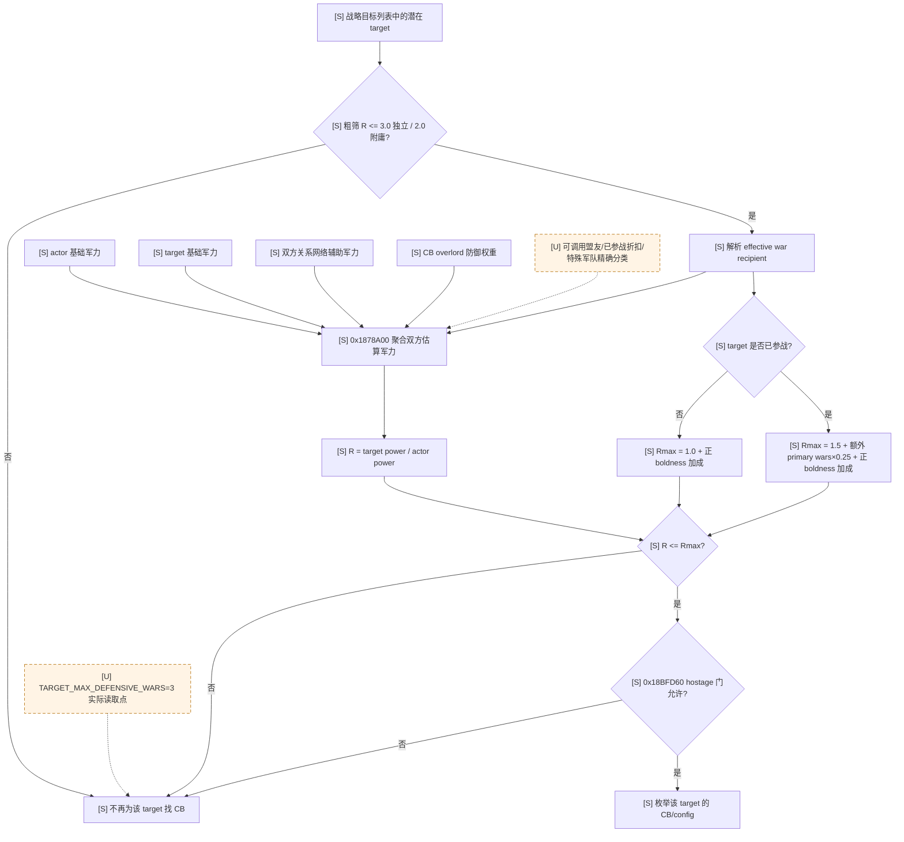
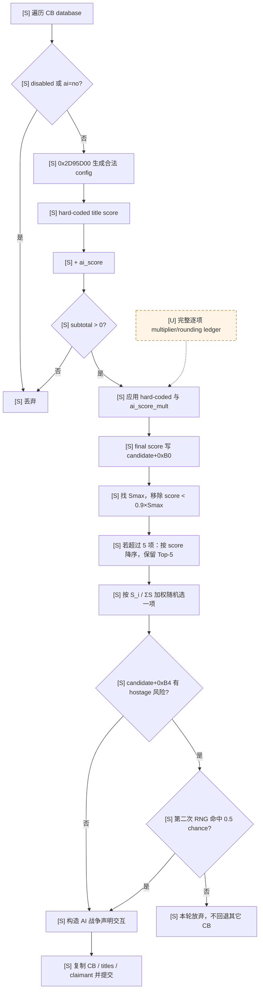

# CK3 1.19.0.6 原生 AI 宣战决策树

## 结论

- [static-confirmed] 原生 AI 的主动宣战不是“找到一个可宣称目标就开战”。实际调用链依次经过周期/人格门、
  offensive-war penalty、cooldown、候选目标与 CB 枚举、军力比上限、hostage 约束、CB 评分、相对最优分数
  截断、Top-5 和按分数加权随机，最后才构造战争声明交互。
- [static-confirmed] 原生宣战链使用的是**估算军力比**，没有在这条调用链里调用逐场战斗 Monte Carlo，也不输出
  “战胜该对手的概率”。`SAICBTypeInfo.GetPowerRatio` 不能解释成胜率。
- [static-confirmed] 1.19.0.6 当前参数允许 AI 在目标已参战时接受比自己更强的目标：目标和平时军力比上限
  `1.0`，目标参战时为 `1.5`，再按目标额外 primary war 与宣战者正 boldness 增加。因此“通过原版
  AI 宣战门”并不等于“有高概率取胜”。
- [unknown] 原生军力聚合内部的全部盟友可调用性、特殊军队、行政制军力与财政准备细项尚未闭合；这些分支不应
  被士兵总数、CB key 或 title 数量替代。

## 版本与复现边界

- [static-confirmed] 本文只绑定 CK3 `1.19.0.6`：`ck3.exe` SHA-256
  `2D00FF3101EF70B566F2FCBAE292F09263199C80E9DC8F139B82D7D96F83DB86`。
- [static-confirmed] 同安装包原版数据哈希：`game/common/defines/ai/00_ai.txt` 为
  `C78F9CD8DF9938CC9F38E817BCB6E32CD13720B5BD9DE077B85E3E1C6F030293`，
  `game/common/casus_belli_types/_casus_belli.info` 为
  `E3BACD9F3360837F6ED7D5F22B937AB7E79CB675AD804819A627CB73970CE699`，
  `game/gui/debug/window_watch_ai.gui` 为
  `8539831B5C6A14A690C12F668F50C45D204900C9ABDAB244929A29574D6CBC2C`。
- [static-confirmed] RVA 均以模块基址为零点；本次只读取文件并反汇编，没有启动、控制或修改 CK3。
- [static-confirmed] Mermaid 中 `[S]` 是 `static-confirmed`，`[U]` 是 `unknown`；所有 `[U]` 节点及其
  未闭合边均使用虚线。
- [unknown] EXE、原版数据、DLC 集合或 mod 覆盖任一变化后，地址与具体 CB 脚本都必须重新冻结，本文不能跨版本
  直接沿用。

## 证据锚点与实际调用顺序

| 证据等级 | RVA / 文件 | 已闭合事实 |
|---|---|---|
| [static-confirmed] | `0x187AB90` | 周期性宣战尝试；先做人格概率、offensive-war penalty 与 cooldown，再调用候选选择器 |
| [static-confirmed] | `0x187A9A0` | 有效 cooldown：base cooldown 乘 `1 + ai_war_cooldown`；另有两个尚未命名的硬编码 `×2` 分支 |
| [static-confirmed] | `0x18BD6F0` | 调用候选枚举，按最佳分数的 `0.9` 截断；若仍超过五项则降序保留最高五项，再按分数加权随机 |
| [static-confirmed] | `0x18BDDA0` | 枚举目标、CB 类型与 `0x98` 字节配置，计算军力与分数，生成 `0x908` 字节候选记录 |
| [static-confirmed] | `0x18C1F90` | 计算实际可接受的目标/宣战者最大军力比 |
| [static-confirmed] | `0x1878A00` | 形成双方估算军力与实际军力比；两次调用 `0x1879850` 聚合双方关系网络中的可用军力 |
| [static-confirmed] | `0x18BFD60` | hostage 候选门；返回“允许继续”与“存在 hostage 风险”两个状态 |
| [static-confirmed] | `0x187B4C9` | 取 `CCharacterInteractionDatabase+0x1070`，复制 CB、目标 title 向量与 claimant 后提交 |
| [static-confirmed] | RTTI `0x522B088` | `CAIWatchWindow`，与原版 debug `CalculateCBCandidates`/military-power 展示相互锚定 |
| [static-confirmed] | RTTI `0x5236020`；vtable `0x411DAA0` | `CWarDeclaration`；special data 的 CB `+0x08`、title 向量 `+0x10`、claimant `+0x28` 布局已由原版 UI/命令路径独立确认 |
| [static-confirmed] | `_casus_belli.info` | `ai_score` 加到硬编码 title 分；`ai_score_mult` 乘到 title 评分；定义标准 war scopes |
| [static-confirmed] | `window_watch_ai.gui:712-817` | debug UI 暴露 `CalculateCBCandidates`，每项展示 target、claimant、CB、score、military power、actual/max ratio 与 hostage |
| [unknown] | `CCharacterInteractionDatabase+0x1070` | 该 AI 专用槽的注册 key 尚未命名；它不是已证玩家 UI `declare_war_interaction` 的 `+0xF78` |

## 第一棵树：周期、人格与 cooldown 门

- [static-confirmed] `AI_BASE_WAR_CHANCE = 1`，energy 按 `(energy + 100) / 200` 缩放：`-100 → 0`、
  `0 → 0.5`、`+100 → 1`。`0x187AD50` 读取 energy，并叠加 `ai_war_chance` modifier（内部索引
  `0x21F`）；`0x187B01A` 生成 `[0, 99999]` 的确定性 hash 随机数并执行门控。
- [static-confirmed] 在定点数记法下，本次门的阈值为
  `AI_BASE_WAR_CHANCE × (energy + 100) / 200 × (1 + ai_war_chance)`；未找到额外的 combat forecast
  输入。
- [static-confirmed] offensive-war penalty 高于 `0.0` 时，除非角色命中 warmonger doctrine/flag，或
  rationality `<= -30`，正常路径在 `0x187B132` 退出。
- [static-confirmed] `AI_WAR_BASE_COOLDOWN = 50` 日；base 值还会乘 `1 + ai_war_cooldown`。最后一次
  offensive war 日期由角色 AI 状态读取，日期差除以 24 转为天数。
- [static-confirmed] `AI_WAR_COOLDOWN_RATIO_FOR_FULL_CHANCE = 0`；原生代码保留 cooldown 后线性恢复概率
  的通用分支，但当前值使“过了有效 cooldown 后还因时间不足随机失败”的区间不可达。
- [unknown] `0x187A9A0` 的两个硬编码 `×2` cooldown 分支尚未映射到稳定游戏概念；图中保留虚线。
- [unknown] `0x187AB90` 开头还有调度存活、AI 状态和两个内部资源/准备值比较；现有证据不足以把它们命名为
  gold、prestige、piety 或 war chest。

## 第二棵树：目标、战争中目标、盟友军力与 hostage

### 两层军力门

- [static-confirmed] 原版先用粗筛阈值排除明显过强的潜在对象：独立宣战者
  `CB_TARGET_MAX_POWER = 3.0`，附庸宣战者 `CB_TARGET_MAX_POWER_VASSAL = 2.0`。这是“是否继续找
  CB”的发现门，不是最终宣战上限。
- [static-confirmed] 候选枚举在 `0x18BE125` 比较 `actual power ratio` 与 `0x18C1F90` 返回的
  `max power ratio`，实际比值更大即丢弃候选。
- [static-confirmed] 令 `R = estimated_target_power / estimated_actor_power`。目标和平时
  `R_max = 1.0`；目标至少参加一场战争时从 `1.5` 起算。
- [static-confirmed] 目标参战时，`0x18C1F90` 遍历其战争，只把目标是 primary attacker 或 primary
  defender 的战争计入加成。若所有战争都是 primary war，先扣掉一场；若至少有一场非 primary war，则
  primary war 不再扣首场。每个剩余计数加 `0.25`。
- [static-confirmed] 宣战者只有**正** boldness 才增加上限：`max(boldness, 0) / 100 × 0.25`；负
  boldness 不降低基础上限。
- [static-confirmed] 因而当前完整上限可写为
  `R_max = (peace ? 1.0 : 1.5 + 0.25 × extra_primary_wars) + 0.25 × max(boldness,0)/100`；
  正 boldness 加成在和平与参战两条分支汇合后统一应用。

### 军力聚合的已知与未知

- [static-confirmed] `0x1878A00` 输出 actor power、target power、两者比值与状态 flags；候选记录把 power、
  actual ratio 与 max ratio 一并保存，debug `SAICBTypeInfo` 直接展示这些字段。
- [static-confirmed] 该函数从双方基础军事状态起算；在相应 mode 打开时，分别以双方为根调用
  `0x1879850`，把关系网络中可计入的辅助军力加到对应一侧。因此原版并非只比较两位统治者的面板兵数。
- [static-confirmed] `ai_overlord_defensive_power_impact` 是每个 CB 可定义的脚本值：攻击未被自动保护的
  subject 时，以 `0..1` 权重混合 subject 与 overlord 的防御军力。
- [static-confirmed] 原版 define 还规定行政领总军力折算：top liege `0.4`、admin vassal `0.05`，并按
  boldness 调整对 governor 效率的估计且夹在 `0.5..1.5`；敌方 combat power 估计使用
  `ENEMY_COMBAT_POWER_MULTIPLIER = 1.1`。
- [unknown] `0x1879850` 中每种关系的“能否调用”、已在其它战争中的盟友折扣、special troops、雇佣兵与
  行政军队的精确聚合顺序尚未全部命名。`1.1` 在通用军事聚合调用链中的精确乘法位置也未闭合。
- [unknown] `TARGET_MAX_DEFENSIVE_WARS = 3` 的原版数据注释说 AI 不攻击已经有至少三场 defensive war
  的目标，但本次尚未把该 define 的实际读取分支闭合到 `0x18BDDA0`；暂不能把它画成已证硬门。

### Hostage

- [static-confirmed] 原版数据为 hostage 决策声明五个阈值：攻击己方 hostage 的 warden 使用 vengeance
  `>= 50` 与 compassion `< -50`；双方被 hostages 约束时使用 honor `< -50`；warden 攻击 hostage
  giver 使用 rationality `< -50` 与 boldness `>= 50`。
- [static-confirmed] `0x18BFD60` 在候选枚举期返回“允许继续”和“存在 hostage 风险”；风险位保存到候选
  `+0xB4`。候选被最终选中后，`0x187B456..0x187B4C3` 才执行第二个随机门，当前
  `AI_CHANCE_TO_START_WAR_WITH_HOSTAGE = 0.5`。
- [unknown] `0x18BFD60`/`0x18C2540` 中所有角色关系查询、五个阈值的组合真值表及一一地址映射尚未完成；
  这里仅记录 pinned 原版 define 声明的阈值，不能把同一关系下列出的值擅自解释成 `AND`/`OR`，也不能扩写到
  未列明的 hostage 关系。

## 第三棵树：CB 可用性、评分与随机选择

### 候选生成

- [static-confirmed] `0x18BDDA0` 遍历 `CCasusBelliTypeDatabase`；跳过 native disabled/`ai = no` 类型，
  再执行类型与角色/目标相关的可用性检查。
- [static-confirmed] 对每个 actor/target/type，AI 调用
  `0x2D95D00(type, actor, target, scratch, true, true, nullptr)`。普通 CB 的每个 `0x98` 字节
  configuration 分别形成候选；特殊/combined CB 可形成合并候选。配置包含 claimant 与目标 title 向量。
- [static-confirmed] `_casus_belli.info` 的 `cost`、`allowed_*`、`valid_to_start`、title targeting、
  `max_ai_diplo_distance_to_title`、`ai_only_against_liege`、`ai_only_against_neighbors` 与
  `ai_can_target_all_titles` 都属于 CB 数据契约，具体值由每个已加载 CB 决定。
- [unknown] 通用 evaluator 对 `cost` 与 AI 预算准备值的完整顺序尚未闭合；“当前可以支付 CB cost”不能被外推成
  “战争全程财政可承受”。

### 分数账本

- [static-confirmed] `0x18C09E0` 先算硬编码 title score；`0x18BED23..0x18BEE14` 再求值 CB 的
  `ai_score` 并相加，和 `<= 0` 的候选被丢弃。随后继续应用硬编码与脚本 multiplier，最终整数分写入候选
  `+0xB0`。
- [static-confirmed] `_casus_belli.info` 明确规定：`ai_score` 加到硬编码 title score，`ai_score_mult`
  乘到 title scoring；求值使用 standard war scopes。各 CB 文件中的脚本是运行时评分的一部分，不能仅凭 CB
  名称推断分数。
- [static-confirmed] title/claimant 相关 defines 包含：de jure `×100`、liege 下 de jure `×1.5`、独立
  统治者更高 de jure title `×25`、高于当前 primary title `×100`、holy site `+10`、相邻 title
  `×15`；另有 target opinion `0.1`、claimant opinion `0.1`、claimant 独立 `×0.25`、近亲
  `×2`、非近亲 `×0.75` 与 greed `-0.5` 的评分参数。
- [unknown] 所有硬编码 title 子项、rounding 与每个 DLC CB 的脚本 multiplier 尚未汇总成可在 Python 中逐项
  重放的完整 score ledger；原生 `GetScoreTooltip` 是后续闭合入口。

### 最终选择

- [static-confirmed] `0x18BD6F0` 找到最高分 `Smax`，计算 `0.9 × Smax`；低于该阈值的候选全部移除。
- [static-confirmed] 若剩余候选超过五项，原生才按分数降序排列并保留前五项；五项以内不执行这次排序。因此发生
  截断时，原生 Top-5 是最高分五项，不是数据库枚举顺序中的前五项。
- [static-confirmed] 令保留候选分数为 `S_i`。原生生成 `[0, ΣS_i)` 的确定性 hash 随机数，逐项减分直到
  首次为负；即候选被选中的条件概率为 `S_i / ΣS_i`，而不是总取最高分。
- [static-confirmed] 被选候选若带 hostage 风险位，再过一次 `0.5` 随机门；失败则本轮不宣战，不会在同轮回退
  选择下一个候选。

## 原版在关键问题上到底做了什么

| 问题 | 结论 |
|---|---|
| [static-confirmed] 是否计算战胜概率 | 否；宣战链只比较估算军力比与阈值，没有逐战斗模拟或 `p_win` |
| [static-confirmed] 是否考虑盟友 | 是；双方都进入关系网络辅助军力聚合，CB 还能给 overlord 防御军力加权 |
| [static-confirmed] 是否考虑目标正在打仗 | 是；目标参战把允许的敌/我军力比从 `1.0` 提到 `1.5`，额外 primary wars 继续放宽 |
| [static-confirmed] 是否考虑人格 | 是；energy 控制尝试率，rationality/warmonger 绕过 offensive-war penalty，boldness 放宽军力比，hostage 使用多个人格阈值 |
| [static-confirmed] 是否考虑 CB 价值 | 是；硬编码 title/claimant 分与每个 CB 的 `ai_score(_mult)` 合成，之后相对最佳项截断并随机 |
| [unknown] 是否完整考虑战争财政 | 只闭合到 CB cost/validity 契约与周期函数中的内部资源比较；没有证据证明它估算整场战争的 gold burn、债务时间或机会成本 |
| [static-confirmed] 是否会稳定选最佳 CB | 否；90% 阈值内最高五项按分数加权随机 |
| [static-confirmed] hostage 是否绝对禁止 | 否；人格门允许后仍以 `0.5` 作最终二次随机 |

## 对自动玩家的直接约束

- [inference] 原版 AI 的军力比门比当前 Python 的“CB key 偏好 + title 数量”更有信息，但仍不是胜率或期望效用
  模型；照抄原版会继续允许“合法且军力比勉强过门、实际却打不赢”的战争。
- [static-confirmed] 当前 Python 差异和可直接实施的 fail-closed 契约见
  [player-war-entry-policy.md](player-war-entry-policy.md)。
- [static-confirmed] 当前 bridge 无法提供 exact combat simulation 输入，详见
  [combat-simulation-inputs.md](combat-simulation-inputs.md)；因此在这些输入闭合前，主动宣战应保持关闭，而不是
  用 `GetPowerRatio` 假装成胜率。

## 未闭合清单

- [unknown] `0x187AB90` 开头通用 AI 状态字段与两个内部资源比较的稳定语义名称。
- [unknown] `0x187A9A0` 两个 cooldown `×2` 分支对应的 rank/government/其它条件。
- [unknown] `0x1879850` 对盟友、契约、当前战争与 callability 的完整分类及折扣顺序。
- [unknown] `ENEMY_COMBAT_POWER_MULTIPLIER` 在通用军力聚合的精确乘法位置与特殊军队覆盖。
- [unknown] `TARGET_MAX_DEFENSIVE_WARS` 的实际读取点及其与 target discovery 的相对顺序。
- [unknown] 所有 DLC CB 的完整脚本评分展开、硬编码 title score 全账本与逐项 rounding。
- [unknown] `CCharacterInteractionDatabase+0x1070` 的注册 key；不得与玩家 UI `+0xF78` 混用。
