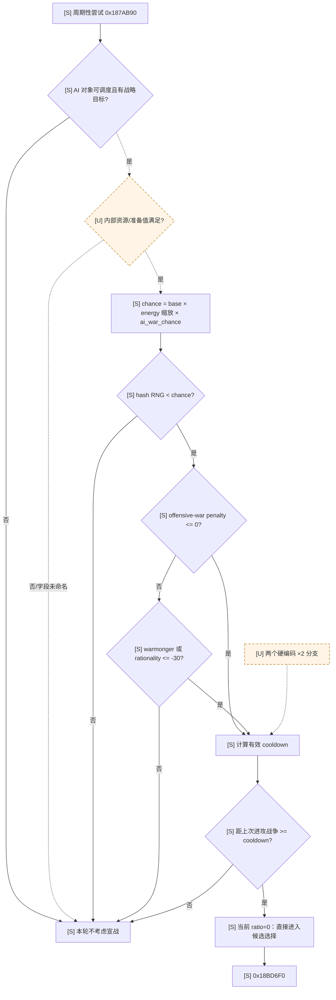
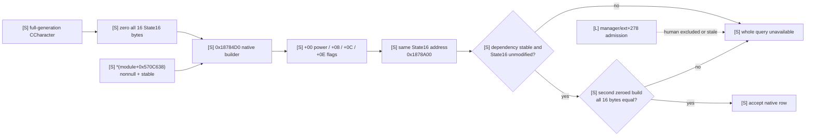
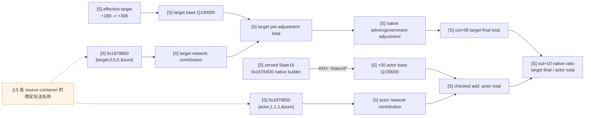
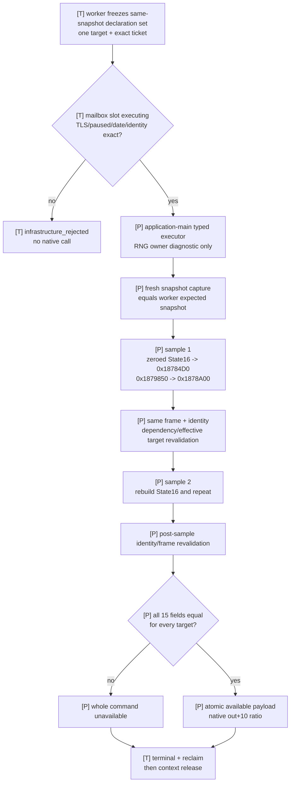
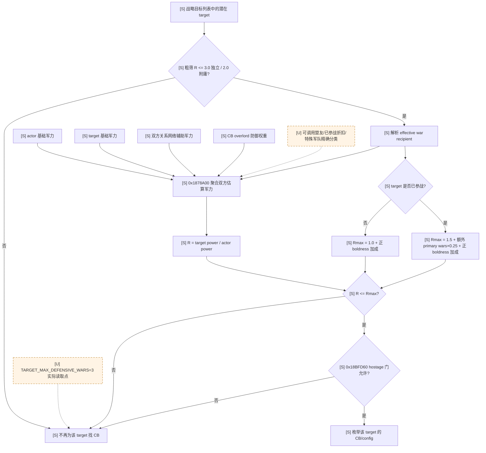
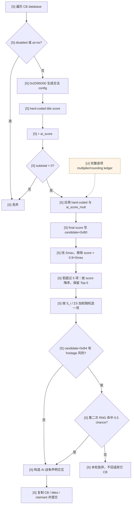
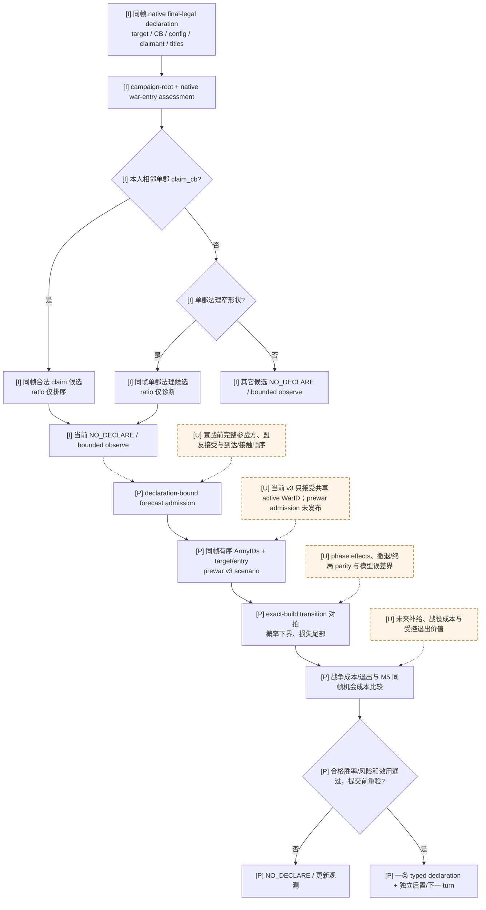

# CK3 1.19.0.6 原生 AI 宣战决策树

> 2026-09-23 增量：[W1 准备金与候选成本](war-film-declaration-inputs-2026-09-23.md) 补充最新的精确静态调用链和剩余未知；旧历史证据保留。
>
> 2026-09-24 增量：下文单列我方现有两条按军力比直接宣战的代码路径，以及改为按合格战斗模拟决定宣战所需的最短输入链；原版 AI 树和历史实机记录不被改写。

## 结论

- [static-confirmed] 原生 AI 的主动宣战不是“找到一个可宣称目标就开战”。实际调用链依次经过周期/人格门、
  offensive-war penalty、cooldown、候选目标与 CB 枚举、军力比上限、hostage 约束、CB 评分、相对最优分数
  截断、Top-5 和按分数加权随机，最后才构造战争声明交互。
- [static-confirmed] 原生宣战链使用的是**估算军力比**，没有在这条调用链里调用逐场战斗 Monte Carlo，也不输出
  “战胜该对手的概率”。`SAICBTypeInfo.GetPowerRatio` 不能解释成胜率。
- [static-confirmed] 1.19.0.6 当前参数允许 AI 在目标已参战时接受比自己更强的目标：目标和平时军力比上限
  `1.0`，目标参战时为 `1.5`，再按目标额外 primary war 与宣战者正 boldness 增加。因此“通过原版
  AI 宣战门”并不等于“有高概率取胜”。
- [unknown] 原生军力聚合内部的全部盟友可调用性、特殊军队、行政制军力与财政准备细项尚未闭合；这些分支不应
  被士兵总数、CB key 或 title 数量替代。

## 版本与复现边界

- [static-confirmed] 本文只绑定 CK3 `1.19.0.6`：`ck3.exe` SHA-256
  `2D00FF3101EF70B566F2FCBAE292F09263199C80E9DC8F139B82D7D96F83DB86`。
- [static-confirmed] 同安装包原版数据哈希：`game/common/defines/ai/00_ai.txt` 为
  `C78F9CD8DF9938CC9F38E817BCB6E32CD13720B5BD9DE077B85E3E1C6F030293`，
  `game/common/casus_belli_types/_casus_belli.info` 为
  `E3BACD9F3360837F6ED7D5F22B937AB7E79CB675AD804819A627CB73970CE699`，
  `game/gui/debug/window_watch_ai.gui` 为
  `8539831B5C6A14A690C12F668F50C45D204900C9ABDAB244929A29574D6CBC2C`。
- [static-confirmed] RVA 均以模块基址为零点；本次只读取文件并反汇编，没有启动、控制或修改 CK3。
- [static-confirmed] Mermaid 中 `[S]` 是 `static-confirmed`，`[U]` 是 `unknown`；所有 `[U]` 节点及其
  未闭合边均使用虚线。
- [unknown] EXE、原版数据、DLC 集合或 mod 覆盖任一变化后，地址与具体 CB 脚本都必须重新冻结，本文不能跨版本
  直接沿用。

## 证据锚点与实际调用顺序

| 证据等级 | RVA / 文件 | 已闭合事实 |
|---|---|---|
| [static-confirmed] | `0x187AB90` | 周期性宣战尝试；先做人格概率、offensive-war penalty 与 cooldown，再调用候选选择器 |
| [static-confirmed] | `0x187A9A0` | 有效 cooldown：base cooldown 乘 `1 + ai_war_cooldown`；另有两个尚未命名的硬编码 `×2` 分支 |
| [static-confirmed] | `0x18BD6F0` | 调用候选枚举，按最佳分数的 `0.9` 截断；若仍超过五项则降序保留最高五项，再按分数加权随机 |
| [static-confirmed] | `0x18BDDA0` | 枚举目标、CB 类型与 `0x98` 字节配置，计算军力与分数，生成 `0x908` 字节候选记录 |
| [static-confirmed] | `0x18C1F90` | 计算实际可接受的目标/宣战者最大军力比 |
| [static-confirmed] | `0x1878A00` | 形成距离、target 最终军力、target/actor 实际军力比、双向 AI entry 与 flags；两次调用 `0x1879850` 聚合双方关系网络军力 |
| [static-confirmed] | `0x18BFD60` | hostage 候选门；返回“允许继续”与“存在 hostage 风险”两个状态 |
| [static-confirmed] | `0x187B4C9` | 取 `CCharacterInteractionDatabase+0x1070`，复制 CB、目标 title 向量与 claimant 后提交 |
| [static-confirmed] | RTTI `0x522B088` | `CAIWatchWindow`，与原版 debug `CalculateCBCandidates`/military-power 展示相互锚定 |
| [static-confirmed] | RTTI `0x5236020`；vtable `0x411DAA0` | `CWarDeclaration`；special data 的 CB `+0x08`、title 向量 `+0x10`、claimant `+0x28` 布局已由原版 UI/命令路径独立确认 |
| [static-confirmed] | `_casus_belli.info` | `ai_score` 加到硬编码 title 分；`ai_score_mult` 乘到 title 评分；定义标准 war scopes |
| [static-confirmed] | `window_watch_ai.gui:712-817` | debug UI 暴露 `CalculateCBCandidates`，每项展示 target、claimant、CB、score、military power、actual/max ratio 与 hostage |
| [unknown] | `CCharacterInteractionDatabase+0x1070` | 该 AI 专用槽的注册 key 尚未命名；它不是已证玩家 UI `declare_war_interaction` 的 `+0xF78` |

## 第一棵树：周期、人格与 cooldown 门

- [static-confirmed] `AI_BASE_WAR_CHANCE = 1`，energy 按 `(energy + 100) / 200` 缩放：`-100 → 0`、
  `0 → 0.5`、`+100 → 1`。`0x187AD50` 读取 energy，并叠加 `ai_war_chance` modifier（内部索引
  `0x21F`）；`0x187B01A` 生成 `[0, 99999]` 的确定性 hash 随机数并执行门控。
- [static-confirmed] 在定点数记法下，本次门的阈值为
  `AI_BASE_WAR_CHANCE × (energy + 100) / 200 × (1 + ai_war_chance)`；未找到额外的 combat forecast
  输入。
- [static-confirmed] offensive-war penalty 高于 `0.0` 时，除非角色命中 warmonger doctrine/flag，或
  rationality `<= -30`，正常路径在 `0x187B132` 退出。
- [static-confirmed] `AI_WAR_BASE_COOLDOWN = 50` 日；base 值还会乘 `1 + ai_war_cooldown`。最后一次
  offensive war 日期由角色 AI 状态读取，日期差除以 24 转为天数。
- [static-confirmed] `AI_WAR_COOLDOWN_RATIO_FOR_FULL_CHANCE = 0`；原生代码保留 cooldown 后线性恢复概率
  的通用分支，但当前值使“过了有效 cooldown 后还因时间不足随机失败”的区间不可达。
- [unknown] `0x187A9A0` 的两个硬编码 `×2` cooldown 分支尚未映射到稳定游戏概念；图中保留虚线。
- [unknown] `0x187AB90` 开头还有调度存活、AI 状态和两个内部资源/准备值比较；现有证据不足以把它们命名为
  gold、prestige、piety 或 war chest。

## 第二棵树：目标、战争中目标、盟友军力与 hostage

### 两层军力门

- [static-confirmed] 原版先用粗筛阈值排除明显过强的潜在对象：独立宣战者
  `CB_TARGET_MAX_POWER = 3.0`，附庸宣战者 `CB_TARGET_MAX_POWER_VASSAL = 2.0`。这是“是否继续找
  CB”的发现门，不是最终宣战上限。
- [static-confirmed] 候选枚举在 `0x18BE125` 比较 `actual power ratio` 与 `0x18C1F90` 返回的
  `max power ratio`，实际比值更大即丢弃候选。
- [static-confirmed] 令 `R = estimated_target_power / estimated_actor_power`。目标和平时
  `R_max = 1.0`；目标至少参加一场战争时从 `1.5` 起算。
- [static-confirmed] 目标参战时，`0x18C1F90` 遍历其战争，只把目标是 primary attacker 或 primary
  defender 的战争计入加成。若所有战争都是 primary war，先扣掉一场；若至少有一场非 primary war，则
  primary war 不再扣首场。每个剩余计数加 `0.25`。
- [static-confirmed] 宣战者只有**正** boldness 才增加上限：`max(boldness, 0) / 100 × 0.25`；负
  boldness 不降低基础上限。
- [static-confirmed] 因而当前完整上限可写为
  `R_max = (peace ? 1.0 : 1.5 + 0.25 × extra_primary_wars) + 0.25 × max(boldness,0)/100`；
  正 boldness 加成在和平与参战两条分支汇合后统一应用。

### 军力聚合的已知与未知

- [static-confirmed] `0x1878A00` 的 production ABI 为
  `RCX=actor CCharacter*`、`RDX=完整 0x10-byte actor State16*`、`R8=effective target CCharacter*`、
  `R9=caller-owned 0x28-byte output`、第五参数为可选距离覆写指针、第六参数为是否聚合关系网。State16 必须由
  同帧原生 `0x18784D0(actor,&zeroed_state)` 构造；不能把 raw target、snapshot 士兵数或单独 int64 塞进 ABI。
- [static-confirmed] `RDX` 在函数入口保存，`0x1878F99` 读取 State16 `+0x00` actor base power，
  `0x187908E/0x18790B4/0x18790DC/0x1879248` 还读 `+0x0E` flags。actor 的 network accumulator
  与 builder 已应用原生修正后的 base 相加，得到
  `actor_total = actor_base + actor_network_contribution`。`actor+0x1A8->+0x308` 是另一 AI 状态对象，
  `0x18784D0` 只读其中 byte `+4/+5` 形成行政制修正和 flags，不能当军力 qword。
- [static-confirmed] target base power 来自
  `effective_target+0x1B8 -> qword[+0x308]`。`0x1879850` 对每个被纳入关系网的角色也读取完全相同的
  `CCharacter+0x1B8 -> qword[+0x308]` 并累加。因此 actor State16 base、target base 与 network
  contribution 都在同一 `scale=100000` 定点加法域内。
- [static-confirmed] target network contribution 先加到 base；行政制分支随后可能进一步修正这个和，所以
  native `target_power_total_raw=out+0x08` 不保证等于 `target_base_raw+target_network_raw`。观测口必须同时
  返回 pre-adjustment total、adjustment delta 与 native final total，不能只回一个无法解释的“总兵力”。
- [static-confirmed] `out+0x10` 是 native actual ratio。actor total 为正时，`0x1878F99..0x1879070` 以
  溢出安全的定点路径计算 `target_power_total × 100000 / actor_power_total`；actor total 非正时，原生分支把
  target total 原值写入 ratio。bridge 必须回传 native ratio，不能在 Python 用常规除法重算或兜底。
- [static-confirmed] 旧账本曾把 `out+0x00` 误记为 actor power；逐指令闭合后已更正：它是
  `0x28F8A20` 取得两角色地图坐标差平方、经 `0x187A7B0` 整数平方根后乘 `100000` 的距离。
  `out+0x18/+0x1C` 分别是 target AI context 中 actor 的 int32 entry、actor AI context 中 target 的
  int32 entry；`out+0x20` 是一个 uint8 flags 字节。

#### actor assessment State16 的权威构造

- [live-verified] production4 首次 typed 实机查询安全进入 reader，但玩家 `29829` 在旧 daily AI-manager span
  中没有 context，确定性返回 `actor_ai_context`；进程、暂停日期与 Stop cleanup 均稳定。根因是
  `0x1885290` 在 `0x191CD20` context 创建与 `extension+0x278` 写入之前先调用 `0x28BCEB0` 排除 human；
  `0x1885330` 也有同类早退。`manager+0x120/+0x128/+0x12C` 因此只覆盖 AI tick 对象，已从 production
  reader 删除。
- [static-confirmed] 原生权威 builder 是 `0x18784D0`，ABI 为
  `void __fastcall(CCharacter* RCX, State16* RDX)`，逻辑范围 `0x18784D0..0x18789F8`，由五段 chained
  unwind 覆盖。它写 `State16+0x00` actor base power、`+0x08` dword、`+0x0C` word 与 `+0x0E`
  flags；其中 base 先读取 `CCharacter+0x1B8->+0x308`，再应用原生 government/modifier 修正，并有原生清零
  分支。builder 会保留 `+0x0E` 旧高半字节且不写 `+0x0F`，所以独立 scratch 必须先清零完整 16 字节。
- [static-confirmed] 四个 direct caller `0x18849CE/D2/D6`、`0x1885E33/37/3B`、`0x20505C9/CD` 与
  `0x2791DFC/E00` 都把原生 context+8 交给同一 builder。这证明 zeroed caller-owned State16 是缺少玩家
  AIContext 时的等价原生输入，不是 bridge 公式或单 qword 伪造。`0x1878A00` 随后既读 State16 `+0x00`，
  也在 `0x187908E/0x18790B4/0x18790DC/0x1879248` 读 `+0x0E`，bridge 必须原样传整块结构。
- [static-confirmed] builder 的闭合调用图只含 `0x2601F90`、`0x26165B0`、两个只返回 AL 的 vtable+8
  getter、`0x999AF0` 与 `0x20B5BE0`；未见 RNG、script VM 或世界对象 store。`0x999AF0` 仅在
  `module+0x570C638` singleton 为空时进入 cold lazy-init，因此 production 在每次 builder/assessment 前后
  以及两次 sample 之间要求该 slot 非空且指针相同，避免触发初始化写。
- [static-confirmed] `CCharacter+0x1A8 -> extension+0x278` 与 `module+0x57C1CA0` fallback 仍解释原生旧
  caller 和 `0x1878A00` 内部 relation-map 读取，但只作为静态 provenance/fixture；human 的 extension 可能没有
  AI tick 刷新，production 不再以该 context 的存在、actor、map、power 或 flags 作 admission，也不复制其中字段。
  `0x187910D..0x1879171` 的 nullable map 分支仍可合法令原生 `out+0x1C=0`。

#### `0x1879850` 的两套五指针配置

| 根 | 五个 caller-owned 指针所指值 | 已证效果 |
|---|---|---|
| [static-confirmed] effective target | `{target, 0, 0, 0, accumulator=0}` | 聚合 target 侧关系网贡献，并加到 target base |
| [static-confirmed] actor | `{actor, 1, 1, 1, accumulator=0}` | 聚合 actor 侧更严格过滤后的关系网贡献，并与同 sample 的 `State16+0x00` 相加 |

- [static-confirmed] 配置的布局是
  `{CCharacter** root, int32* filter_a, int32* filter_b, int32* filter_c, int64* accumulator}`，不是五个
  直接值。`filter_a=1` 要求候选的 `+0x1B8->+0x318` 容器为空；`filter_b=1` 排除
  `0x28BCEB0(candidate_id)` 命中的 human-player character；`filter_c=1` 启用同 realm/liege/government
  排除链。所有候选还必须先通过 `0x1B35DF0(root,candidate)`。
- [static-confirmed] collector 从 root 的多个关系与 realm CharacterID 容器解析 full-generation identity，
  使用一个 local seen-ID vector 去重；纳入项最终只执行
  `*accumulator += candidate+0x1B8->qword[+0x308]`。`0x18758C0` 是相同过滤与累加规则的窄 helper。
- [static-confirmed] 五个配置指针都指向 `0x1878A00` 栈上的局部值，只在同步调用期间有效。
  `0x1879850` 的 seen vector 从空状态构造，扩容只写自己分配的内存，并在 `0x187A770..0x187A789`
  经 allocator vtable `+0x10` 释放。对游戏对象只读 identity、容器、关系谓词与 power leaf；唯一外部写是
  caller-owned accumulator。实现不得缓存任何 AI context、CCharacter 或容器指针跨帧。
- [static-confirmed] flags 的八位应以 `native_flags_raw` 原样发布。当前已闭合的结构谓词为：bit 7 是 effective
  target 命中 actor 的特殊 target 容器；bit 0 是 target `+0x1B8->+0x1C0` vfunc `+8` 的取反；bit 1
  来自 actor AI state byte `+5` 与全局门；bit 3 是两侧 immediate liege 相同且未被 context/bit 0 阻断；
  bit 2 是 bit 3 或 AI-context 原始 bit 0；bit 4 表示该阻断存在或两侧 top liege 不同；bit 5/6 分别来自
  `0x18422B0` 的 actor→target / target→actor AI relation-ID set membership。玩法语义名称尚未由字符串/RTTI
  独立锚定，故 schema 不为这些位杜撰 `ally`、`enemy` 等名称。
- [static-confirmed] `ai_overlord_defensive_power_impact` 是每个 CB 可定义的脚本值：攻击未被自动保护的
  subject 时，以 `0..1` 权重混合 subject 与 overlord 的防御军力。
- [static-confirmed] 原版 define 还规定行政领总军力折算：top liege `0.4`、admin vassal `0.05`，并按
  boldness 调整对 governor 效率的估计且夹在 `0.5..1.5`；敌方 combat power 估计使用
  `ENEMY_COMBAT_POWER_MULTIPLIER = 1.1`。
- [unknown] `0x1879850` 遍历的每个 CharacterID 容器对应 alliance、contract、realm member 还是其它玩法关系，
  其稳定玩法名称尚未逐个由 RTTI/脚本独立锚定；已证过滤与数值累加不能外推为“所有盟友一定参战”。`1.1`
  在通用军事聚合调用链中的精确乘法位置也未闭合。
- [unknown] `TARGET_MAX_DEFENSIVE_WARS = 3` 的原版数据注释说 AI 不攻击已经有至少三场 defensive war
  的目标，但本次尚未把该 define 的实际读取分支闭合到 `0x18BDDA0`；暂不能把它画成已证硬门。

#### `query-war-entry-assessments-v1` production 单目标只读契约

- [bridge-design] capability 为 `game.command.query-war-entry-assessments-v1-N`；唯一 canonical literal 为
  `query-war-entry-assessments-v1-1-<target_character_id>`。首轮 production 每条请求严格只允许一个正的
  signed-int32 full-generation CharacterID。target 必须存在于同一 snapshot 的
  `declarable_wars` 或 `active_wars[*].primary_opponent_character_id`；两个来源在 native frame
  分开冻结并参与三次结构相等检查。同帧 exact `0x2909D30(actor,raw_target)` 解析 effective target。同一 target 的多个
  CB/config 共享这份战略军力评估，不能伪装成 CB-specific 数值。
- [bridge-design] 每个 assessment 原子返回固定 15 字段：`target_character_id`、
  `effective_target_character_id`、`distance_raw`、`actor_power_base_raw`、
  `actor_network_contribution_raw`、`actor_power_total_raw`、`target_power_base_raw`、
  `target_network_contribution_raw`、`target_pre_adjustment_total_raw`、`target_adjustment_delta_raw`、
  `target_power_total_raw`、`actual_power_ratio_raw`、`target_ai_context_actor_entry_raw`、
  `actor_ai_context_target_entry_raw` 与 `native_flags_raw`。power、distance 与 ratio 都是
  `int64 scale=100000`；AI entry 是 int32；flags 是 uint8。
- [bridge-design] schema-v1 为兼容现有 Python/MCP 保留 readiness 键 `ai_context_ready`；其 production 语义已改为
  “authoritative `0x18784D0` State16 builder/dependency 双采 ready”，不再断言 human manager AIContext 存在。
  provenance 中旧 `power_leaf=CCharacter+0x1B8->+0x308` 只描述 target/network decomposition 叶；actor base
  的权威来源是同 sample 的 builder `State16+0x00`，由 exact-build ABI/source-contract 另行锁定。
- [bridge-design] 顶层绑定 `snapshot_revision`、`date_raw`、`actor_character_id`、请求 ID、readiness 与 exact-build
  provenance（游戏版本、EXE SHA、两个 RVA、power leaf、scale）。worker 在提交前从同一个 paused expected snapshot
  只调用现有 exact-build `ReadDeclarableWarsForTarget` 复核请求的唯一 target，并分别冻结该 target 当前仍合法的声明行与
  snapshot 中的 active-war primary opponents；reader 只接受命中任一集合的 target。
  application-main callback 的 before/middle/after 三次 frame capture 各自 fresh `ReadSnapshot`，且必须逐字段等于该
  expected snapshot。该收窄不缓存旧合法性、不改变 same-frame 门，也不改变策略 cadence；成本从
  `O(all character slots × enabled CB types)` 降为 `O(enabled CB types)`。
- [live-verified] 2026-08-28 正式 G1 run 在和平帧暴露旧全局复核热点：显式 `query-declarable-wars` 在截至 history
  `4749` 的整段历史中只有 6 次，但 `query-war-entry-assessments-v1-1-29097` 已累计 573 次。`debug.log` 在
  `13:00:15–13:08:53` 形成 77 组与 assessment 一一对应的 `allowed_against_character` 错误 burst，每组 12 条、
  平均间隔 `6.816s`（中位 `6s`）；同期每轮只推进一个游戏日。旧 `bridge.cpp` 在单目标请求前调用全局
  `ReadDeclarableWars`，而 `ck3_11906.cpp` 又对每个 character slot 遍历全部 enabled CB，正好解释该成本与无
  faith/culture 角色产生的日志。修复后的 target-only 路径目前为 `static-ready`，仍待同 checkpoint 冷启 live A/B，
  不把代码/CTest 冒充实机加速倍数。
- [live-verified] `main_thread_required` 是 reader 的强制回调门，不只是 provenance 标签。exact-build SDL
  `PeekMessageW` 返回边界 `0x3CE4222` 已实证处于 application/startup-main 的 HandlePdxEvents TLS 链；production
  mailbox 只允许 `ExecuteWarEntryAssessmentMailboxQueryV1`，每个 pump 最多一个请求。硬门是初始化 global、稳定 TLS
  context 与 `+0x20 == 1` marker、当前线程、paused/Jomini/game/date 和连续两个 pump epoch；RNG owner 仅保留为
  scoped-lock provenance 诊断，不参与 admission、streak 或 post-check。该边界不得泛化为 simulation-main 或 effect VM。
- [production-wired] typed `MainThreadQueryExecutorV1` 由 worker 发布 non-copyable caller-owned context 与 exact ticket；
  executor 只有在 mailbox slot 为 `executing`、callback/context/sequence 身份一致及上述 application-main stamp 完整时
  才进入 reader。每次 frame capture 还必须与 mailbox stamp 的 paused/date 一致。query-specific unavailable 返回
  executor success，并把具体 stage 留在
  context；只有伪造/直调、错误 slot/thread/stamp 才是 infrastructure failure。若 wait 返回
  `timeout_executor_already_running`，context 必须继续保活，直到后续 terminal + reclaim 成功；不能因 worker 超时释放。
- [bridge-design] 同一次查询还必须完整执行两遍原生采样：每遍先要求 `module+0x570C638` dependency 非空，
  清零完整 16-byte scratch，以 `0x18784D0` 构造 actor State16，再以固定五指针配置重跑 actor/target
  `0x1879850` 并把同一 State16 原样交给 `0x1878A00`。assessment 不得修改 State16；dependency 在每遍执行
  前后及两遍之间必须保持同一指针，两遍 State16 必须逐字节全等。decomposition、原生 0x28-byte out 的全部
  已定义字段与最终 15 字段 row 也必须逐 target 全等；同时重验 effective target、target power leaf 与 frame
  stamp。任一漂移整批 fail closed。`actual_power_ratio_raw` 始终取两遍一致的原生 `out+0x10`，
  外部重构只作相等性门，不能替代该值。
- [bridge-design] 任一 target 的 identity、State16 builder/dependency、容器 shape、算术溢出或同帧门失败，整条查询返回
  `war_entry_assessment_unavailable:<stage>`。success 只允许完整 available payload；no partial、`null`、空数组、
  snapshot soldier fallback 或 Python 公式重算。

- [live-verified] production4 已验证 application-main mailbox、typed reader 进入、原子 unavailable 与正常 Stop
  cleanup；首次查询暴露并定位了 AI-only manager lookup。State16 builder 修正版保留同一 capability/literal/wire，
  以 exact `0x18784D0`、zero-init、dependency 稳定、逐字节双采与 EXE anchors 作为下一次实机前置证据；不得用
  单独 int64、snapshot soldier、陈旧 AIContext 或公式 fallback 代替 builder。

### Hostage

- [static-confirmed] 原版数据为 hostage 决策声明五个阈值：攻击己方 hostage 的 warden 使用 vengeance
  `>= 50` 与 compassion `< -50`；双方被 hostages 约束时使用 honor `< -50`；warden 攻击 hostage
  giver 使用 rationality `< -50` 与 boldness `>= 50`。
- [static-confirmed] `0x18BFD60` 在候选枚举期返回“允许继续”和“存在 hostage 风险”；风险位保存到候选
  `+0xB4`。候选被最终选中后，`0x187B456..0x187B4C3` 才执行第二个随机门，当前
  `AI_CHANCE_TO_START_WAR_WITH_HOSTAGE = 0.5`。
- [unknown] `0x18BFD60`/`0x18C2540` 中所有角色关系查询、五个阈值的组合真值表及一一地址映射尚未完成；
  这里仅记录 pinned 原版 define 声明的阈值，不能把同一关系下列出的值擅自解释成 `AND`/`OR`，也不能扩写到
  未列明的 hostage 关系。

## 第三棵树：CB 可用性、评分与随机选择

### 候选生成

- [static-confirmed] `0x18BDDA0` 遍历 `CCasusBelliTypeDatabase`；跳过 native disabled/`ai = no` 类型，
  再执行类型与角色/目标相关的可用性检查。
- [static-confirmed] 对每个 actor/target/type，AI 调用
  `0x2D95D00(type, actor, target, scratch, true, true, nullptr)`。普通 CB 的每个 `0x98` 字节
  configuration 分别形成候选；特殊/combined CB 可形成合并候选。配置包含 claimant 与目标 title 向量。
- [static-confirmed] `_casus_belli.info` 的 `cost`、`allowed_*`、`valid_to_start`、title targeting、
  `max_ai_diplo_distance_to_title`、`ai_only_against_liege`、`ai_only_against_neighbors` 与
  `ai_can_target_all_titles` 都属于 CB 数据契约，具体值由每个已加载 CB 决定。
- [unknown] 通用 evaluator 对 `cost` 与 AI 预算准备值的完整顺序尚未闭合；“当前可以支付 CB cost”不能被外推成
  “战争全程财政可承受”。

### 分数账本

- [static-confirmed] `0x18C09E0` 先算硬编码 title score；`0x18BED23..0x18BEE14` 再求值 CB 的
  `ai_score` 并相加，和 `<= 0` 的候选被丢弃。随后继续应用硬编码与脚本 multiplier，最终整数分写入候选
  `+0xB0`。
- [static-confirmed] `_casus_belli.info` 明确规定：`ai_score` 加到硬编码 title score，`ai_score_mult`
  乘到 title scoring；求值使用 standard war scopes。各 CB 文件中的脚本是运行时评分的一部分，不能仅凭 CB
  名称推断分数。
- [static-confirmed] title/claimant 相关 defines 包含：de jure `×100`、liege 下 de jure `×1.5`、独立
  统治者更高 de jure title `×25`、高于当前 primary title `×100`、holy site `+10`、相邻 title
  `×15`；另有 target opinion `0.1`、claimant opinion `0.1`、claimant 独立 `×0.25`、近亲
  `×2`、非近亲 `×0.75` 与 greed `-0.5` 的评分参数。
- [unknown] 所有硬编码 title 子项、rounding 与每个 DLC CB 的脚本 multiplier 尚未汇总成可在 Python 中逐项
  重放的完整 score ledger；原生 `GetScoreTooltip` 是后续闭合入口。

### 最终选择

- [static-confirmed] `0x18BD6F0` 找到最高分 `Smax`，计算 `0.9 × Smax`；低于该阈值的候选全部移除。
- [static-confirmed] 若剩余候选超过五项，原生才按分数降序排列并保留前五项；五项以内不执行这次排序。因此发生
  截断时，原生 Top-5 是最高分五项，不是数据库枚举顺序中的前五项。
- [static-confirmed] 令保留候选分数为 `S_i`。原生生成 `[0, ΣS_i)` 的确定性 hash 随机数，逐项减分直到
  首次为负；即候选被选中的条件概率为 `S_i / ΣS_i`，而不是总取最高分。
- [static-confirmed] 被选候选若带 hostage 风险位，再过一次 `0.5` 随机门；失败则本轮不宣战，不会在同轮回退
  选择下一个候选。

## 原版在关键问题上到底做了什么

| 问题 | 结论 |
|---|---|
| [static-confirmed] 是否计算战胜概率 | 否；宣战链只比较估算军力比与阈值，没有逐战斗模拟或 `p_win` |
| [static-confirmed] 是否考虑盟友 | 是；双方都进入关系网络辅助军力聚合，CB 还能给 overlord 防御军力加权 |
| [static-confirmed] 是否考虑目标正在打仗 | 是；目标参战把允许的敌/我军力比从 `1.0` 提到 `1.5`，额外 primary wars 继续放宽 |
| [static-confirmed] 是否考虑人格 | 是；energy 控制尝试率，rationality/warmonger 绕过 offensive-war penalty，boldness 放宽军力比，hostage 使用多个人格阈值 |
| [static-confirmed] 是否考虑 CB 价值 | 是；硬编码 title/claimant 分与每个 CB 的 `ai_score(_mult)` 合成，之后相对最佳项截断并随机 |
| [unknown] 是否完整考虑战争财政 | 只闭合到 CB cost/validity 契约与周期函数中的内部资源比较；没有证据证明它估算整场战争的 gold burn、债务时间或机会成本 |
| [static-confirmed] 是否会稳定选最佳 CB | 否；90% 阈值内最高五项按分数加权随机 |
| [static-confirmed] hostage 是否绝对禁止 | 否；人格门允许后仍以 `0.5` 作最终二次随机 |

## 对自动玩家的直接约束

- [inference] 原版 AI 的军力比是战略强弱估计，仍不是胜率或期望效用；仅以军力比准入会允许实际打不赢的战争，
  也会拒绝兵力较少但经合格模拟可取胜的战争。
- [implementation-confirmed] 当前 Python 的宣战候选排序、两条窄范围 forecast 候选及其它候选的 fail-closed 路径见
  [player-war-entry-policy.md](player-war-entry-policy.md)。
- [implementation-confirmed] 当前桥虽可读同帧原生战略军力，但不能提供合格的宣战前战斗胜率，详见
  [prewar-encounter-inputs.md](prewar-encounter-inputs.md) 与
  [combat-simulation-inputs.md](combat-simulation-inputs.md)。单郡法理 `3:2` 与玩家本人宣称 `2:1` 是我方
  旧版直接准入条件，均未消费战斗模拟；现已停用。不能把 `GetPowerRatio` 或历史胜仗解释成预测概率。

## 2026-09-24：停用倍率直通与模拟准入入口

以下 `[I]` 是当前代码实现，不属于原版 AI 决策树；`[P]` 是待实施的我方策略；`[U]` 是尚未闭合的原生观测或模拟证据。本文仍只绑定上述 exact build。

- [historical implementation-confirmed] 玩家本人 `claim_cb`：`ck3_autonomous_player/src/xar_autoplayer/strategy.py` 的
  `_player_claim_declarations` 筛出本人宣称，
  `_adjacent_independent_county_player_claims` 只保留相邻、独立、county primary title 目标；同一 paused frame
  查询 campaign-root 和每个目标的 `war_entry_assessments` 后，
  旧 `_conservative_feudal_player_claim_war_entry` 以原生 `target/actor` ratio `<= 50000/100000` 选最低比值目标，
  旧 `choose_one_life_turn` 随即返回 `native_war_declaration` 和 typed `declare-war-*`。完整 target total 含原生
  network/adjustment；这个 `2:1` 是军力门，没有 `combat_forecast` 输入。
- [historical implementation-confirmed] 单郡 `individual_county_de_jure_cb`：`_preferred_native_declaration` 与同帧
  assessment、campaign-root 进入 `_conservative_feudal_de_jure_war_entry`；在标准封建、和平、正收入、无针对玩家的派系、
  domain 未超限、双方 network 和 target adjustment/distance 均为零的窄形状下，要求原生 ratio `<= 66667/100000`
  且 `actor_base * 2 >= target_total * 3`，随后直接返回 typed `declare-war-*`。它也没有模拟胜率。
- [implementation-confirmed] 两条直通均已移除：同帧合法性、campaign-root 与原生 assessment 只形成诊断候选；
  原生 ratio 只用于候选排序，不作胜率或 typed action 许可。低于旧 `2:1` 或 `3:2` 的合格形状也可成为
  `native_war_entry_forecast_required / NO_DECLARE` 候选；仅有合法 `life-advance` 时继续有界观察。
  当前 prewar scope 不广告，declaration-bound prewar v3 input/admission 尚未实现；已有 v3 只接受共享 active WarID，
  不能在和平时直接调用。聚焦回归位于 `ck3_autonomous_player/tests/unit/test_war_entry_assessments_bridge.py`。
  Robert 既有三次 `claim_cb` 胜仗是实际结果；改变后续准入规则不改写这些已发生的后置证据。

### 最短施工清单与当前资格

1. [implementation-confirmed] 两条 `native_war_declaration` 直通已移除：保留原生合法性、同帧身份与军力信息用于候选排序，
   取消固定 `2:1` / `3:2` 作为 typed action 许可；forecast 缺失时明确 `NO_DECLARE` 与缺失能力。
   聚焦测试已覆盖“无合格 forecast 不宣战”及“低于旧倍率仍保留候选”。“合格 forecast/效用可宣战”仍待后续实现和验收。
2. [implementation-confirmed + unknown] 已有 `prewar_scope_v1` 的静态契约可把 declaration 绑定主攻守角色、当前已动员
   `CUnit`、位置和路线，但 `PREWAR_SCOPE_V1_ADVERTISED=False`，`native_join_bounds`、目标省、contact geometry、
   prewar arrival 与 `combat_v3_prewar_scope` readiness 都为 false。下一只读包先完成选中 CB/title 到目标 Province 的
   投影、强制/可接受参战方、现役与尚未动员军队的情景、最终接触边和到达时序，在真实 paused Robert 候选同帧验收。
3. [implementation-confirmed + unknown] 当前 v3 只对共享 **active WarID** 的显式固定接触 ArmyID 情景读回；和平时不能
   拿它冒充宣战预测。先给 v3 增加严格的 declaration-bound prewar admission，保留每个可能接触/增援情景的参与者、
   顺序与不确定性边界；再闭合原版逐日伤亡、事件反馈、撤退、终局和模型误差的独立对拍。
4. [implementation-confirmed + counter-policy] `combat_decision_contract.py` 的战术 EU 激活仍为 false，且只比较
   attack/avoid/wait；它不能直接当整场战争的收益。将合格胜率下界、伤亡尾险、目标收益、战争费用、未来补给、退出
   代价与 M5 长期承诺按同一 paused frame 计入宣战效用；`m5_joint_shortlist.py` 当前仍返回
   `formal_action_ready=False`。通过后重验 native final legality 与所有 identity/资源，再提交一条 typed 宣战，
   以独立 WarID/状态、下一 turn 和 checkpoint 验证。任何未知输入都不能生成假胜率。

## 未闭合清单

- [unknown] `0x187AB90` 开头通用 AI 状态字段与两个内部资源比较的稳定语义名称。
- [unknown] `0x187A9A0` 两个 cooldown `×2` 分支对应的 rank/government/其它条件。
- [unknown] `0x1879850` 对盟友、契约、当前战争与 callability 的完整分类及折扣顺序。
- [unknown] `ENEMY_COMBAT_POWER_MULTIPLIER` 在通用军力聚合的精确乘法位置与特殊军队覆盖。
- [unknown] `TARGET_MAX_DEFENSIVE_WARS` 的实际读取点及其与 target discovery 的相对顺序。
- [unknown] 所有 DLC CB 的完整脚本评分展开、硬编码 title score 全账本与逐项 rounding。
- [unknown] `CCharacterInteractionDatabase+0x1070` 的注册 key；不得与玩家 UI `+0xF78` 混用。

## R671 application-main mailbox RED（2026-09-14）

- [production-live] 当前轮次 R671 从冻结的 R664 后继 checkpoint 恢复后，`query-declarable-wars` 成功返回七条声明；紧接着对目标 `38436` 的 `query-war-entry-assessments-v1-1-38436` 在任何 gameplay mutation 或日期推进前失败。run log SHA-256 为 `9257FEB3FE5560FFCDACDC29B547A009EC77B0C8672C1B0AD1A362A54F0AB1D0`，最终 driver-state SHA-256 为 `453669C9F795424A7A95659C03637DF66F16E666BDF4B2F4198D0BD8AA23E4AB`。
- [implementation-confirmed] 失败文本没有 reader 的 `:<stage>` 后缀。严格 reader 与 mailbox adapter 对每个业务不可用分支都会填充 stage，因此该证据只把 RED 定位到排队、executor、application-main 边界或 completion 一层，不能声称是 power reader 数据失败。
- [implementation-confirmed] 旧 dispatch 将所有上述终态压成 `application-main war-entry query failed`，且排队等待仅为 `2000 ms`；同一项目其余 production application-main 查询使用 `8000 ms` 有界排队预算与 `2000 ms` executing slice。war-entry adapter 现与该界限一致，并按 wait/completion/reader-stage 返回可区分错误。业务不可用仍是失败，未被降级或吞掉。
- [static-confirmed] 更新后的 DLL 与 mailbox fixture 已构建；mailbox fixture及 war-entry source-contract 直接执行均 GREEN。此修复不改变 capability、请求 literal 或成功 payload schema；仍需新轮次 R672 的一次短 live replay 判断 R671 属于 queued timeout，还是暴露新的具体 executor/boundary RED。

### R672 短复测结果

- [production-live] 新轮次 R672 使用同一 checkpoint、EXE、injector、production tree 与三步上限，只将 DLL 从 `ED39D5FD...EB86` 更新为 `6562CD13...1994`。`query-war-entry-assessments-v1-1-38436` 在同一 `native:3 / revision 4 / native revision 3 / date 53783472` 暂停帧返回 `available`；随后策略明确选择 `NO_DECLARE`，执行一次 30 日 bounded `life-advance` 到 `53784192` 并保存 checkpoint。
- [production-live] run 为 `turn_limit / qualified / ok=true`，三步全部成功（2 query、1 gameplay），没有 blocker；cleanup 证明 process tree 消失，当前 CK3/injector 均为 0。run log SHA-256 为 `A803C1E4A517DE45BCCB83DCE1769DA73A1A3ED0C108374036E66ED1C24DBA6D`，driver-state 为 `76AF995D45D3A6278B4BCA5CF173BA5FC4540A6514827721333ABE65FF28B654`，后继 checkpoint 为 `8D9186069061BFA645CF44F84A74FCDAA296922B34CAC5B6A040EC7E26E7CCB4`。
- [inference] 同源 differential 证明 R671 的 operational blocker 已由有限等待/诊断补丁解除，并与旧 `2000 ms` 排队预算不足相符；旧 DLL 没有保留 exact wait enum，故不能追溯声称 R671 的唯一内部终态必然是 queued timeout。该历史 RED 保留，不再重跑旧 DLL。

## R673 cross-frame declaration-cache RED (2026-09-14)

- [production-live] Current round R673 resumed ordinary campaign progression from the R672 successor. It completed five NO_DECLARE advances and five successful one-target power reads before the sixth power read for target 38436 failed with target_not_declarable at native:159, date 53787792. The run log SHA-256 is CF92D2D84EF416CDF9A979CC9B799071712551EEA2CA40CFD8D6882834304DE3; final driver-state SHA-256 is 30902F5E96A3F0803596E895B98F6C28E17966C9E71314CBC63F8D26A858BA0B. Cleanup is GREEN.
- [implementation-confirmed] The declaration query occurred only once on the initial paused frame. Python retained those declaration rows through five later native revisions, while the war-entry assessment cache correctly expired on every frame. The planner therefore selected an old legal target after CK3 had made it non-declarable. This is a cross-frame Python cache defect, not instability in the native power evaluator.
- [static-confirmed] Declaration rows and their generated declare-war / query-war-entry-assessments actions are now bound internally to the exact paused snapshot ID, public revision, native revision, connection generation and one-life episode. The next snapshot clears them and forces a fresh query-declarable-wars. A query that crosses frames fails before caching. Focused declaration and war-entry tests pass 14/14 in normal and optimized Python. No native DLL, MCP capability, command literal or public result schema changed.

### R674 bounded live closure

- [production-live] New round R674 cold-restored the last complete R673 checkpoint under Python fix commit c1d91c0a08c3cf0b520c881ea8727a6b99d79351. Its three bounded turns were exactly: query-declarable-wars, query-war-entry-assessments-v1-1-38436, and one NO_DECLARE life-advance from date 53786352 to 53787072. This proves the later frame no longer inherits the old declaration rows and that a fresh legal target remains queryable.
- [production-live] The run ended turn_limit / qualified / ok=true with 3/3 successful turns, no first blocker, and a final checkpoint. Preflight, run log, driver-state and checkpoint SHA-256 are 4E0BC602...F03BE, C5B37439...1CC09, A6033D85...4567E and 4F72E469...61686. Managed cleanup is GREEN and CK3/injector are absent.
- [inference] R673 remains a retained RED, while its operational blocker is closed by the proportional R674 differential. No native DLL or public MCP surface changed. Ordinary campaign progression may resume; registered-event completion remains 1/3.

### R675 ordinary campaign confirmation

- [production-live] Current round R675 completed 12/12 ordinary planner turns: four fresh declaration queries, four same-frame one-target power queries and four NO_DECLARE 30-day advances. Date moved from 53787072 to 53789952. CK3 changed the preferred current target from 38436 to 83395 after the first advance, and the next declaration query propagated that change before any assessment.
- [production-live] The run ended turn_limit / qualified / ok=true with no first blocker. Run log, final driver-state and checkpoint SHA-256 are D42D7EF7...32A5A, 0AD53440...1F53 and 223E4C65...16092. Cleanup is GREEN and CK3/injector are absent.
- [inference] The declaration frame-binding now holds across repeated ordinary campaign cycles, so the R673 repair needs no broader replay. No registered target event appeared; G2-M2 remains 1/3.

### R759 repeated legal target and conservative declaration slice

- [production-live] R759 在 497-turn 正式运行里对同一合法
  `31506-17--1 / individual_county_de_jure_cb / title 537` 完成 163 轮 declaration query、163 轮
  application-main war-entry assessment 和 163 次 `NO_DECLARE`。日期跨过 5,123 游戏日；报告 SHA-256 为
  `7DB9467289E1B9DA1F000AE34B094E61028E6C9AE81B227BC7A682A516D9AABB`。这证明完整模型永远未 ready 时，
  旧策略在实际长期运行中没有任何能转为声明的分支。
- [production-live] 每个 assessment 都与同 revision/date/actor 的 campaign-root query 配对。原生 ratio 全部落在
  `56027..64634`，actor/target network contribution、distance、target adjustment 全为零；actor 自有 base 始终至少为
  target final total 的 1.5 倍。campaign-root 始终是 `feudal_government`，targeting faction `0`、domain `2/5`、
  月收入为正。
- [historical counter-policy] 旧 `feudal-single-county-de-jure-overmatch-v1` 只覆盖这一字段形状，不绑定 CharacterID/TitleID。
  必须保持 same-frame native legal declaration，单 target title、configuration/claimant 均 `-1`，exact CB key，标准封建、
  faction `0`、domain 不超限、正收入、双方 network 为零、target adjustment/distance 为零、native ratio ≤ `66667`，
  且 actor base ×2 ≥ target total ×3；typed declaration step 也必须仍在当前 action surface。任一条件缺失即回到
  `NO_DECLARE`，其它 CB 不随此解锁。当前该军力直通已停用，合法形状只保留为 forecast 候选。
- [historical static-confirmed] exact CB 源 `00_dejure_war.txt` SHA-256
  `D8737A2205116118A5ECD6EFA576D316B3155730A3824DC4BD109A68B9D5B6EE`。离线 R759 逐帧回放 163/163 均能选择同一
  typed declaration，且聚焦 normal/optimized Python tests 验证阈值、network、adjustment、government、faction、stale root
  和其它 CB 全部 fail closed。该回放仅证明旧策略当时的选择，不能当作当前模拟准入或新 WarID 后置结果。

### R853 final interaction validator RED（2026-09-17）

- [production-live] R853 在 WarID 25 投降、独立后帧战争消失、Army 304 解散及 postwar checkpoint 后，推进 34 天并于同一
  paused frame 依次取得八条 `query-declarable-wars` row 和 target `31506` 的 war-entry assessment。策略随后只提交一次
  `declare-war-31506-17--1`，但 CK3 的最终 declare-war interaction validator 拒绝该命令；没有 result 或独立 after frame，
  因而不得声称新战争成立，也不得把拒绝原因直接命名为 truce。报告与 driver SHA-256 分别为
  `A64457EBD8DB99C2E2237ED7FE4464A4B80A458BB62C181F23CE11C1A082A8DD`、
  `9DA4E28B2D1C8711C5537AAB5CBAD70DAFFA2B7EEF1146EAAFC6AEA56C9ABDF3`。
- [implementation-confirmed] 旧 `ReadDeclarableWarsForTargetInternal` 只运行 CB evaluator 并物化 configuration；
  `SubmitDeclareWar` 在重新物化 exact tuple 后还会构造 `declare_war_interaction` context，填入 CB、claimant 与 target titles，
  再执行 refresh、finalize 和 `validate_character_interaction_context`。因此旧查询的 “declarable” 实际只表示 evaluator-pass，
  不能保证交互最终可发送；R853 是该差异的直接 production 复现。
- [static-confirmed] 公共查询和提交现共用同一个 final-validation context helper。查询只保留 evaluator 物化且通过最终 interaction
  validator 的 exact row；validator rejection 是合法空缺并被过滤，context/ABI 结构失败仍使整次查询 unavailable，不能伪装为
  空列表。提交仍重新枚举 exact tuple 并再次验证，保留 query 与 submit 之间状态漂移时的 fail-closed 行为。Release/Debug
  `xar_ck3_game_access_test` 均 GREEN，并覆盖选择性拒绝、全拒绝空集、combined titles 与原提交生命周期。
- [compatibility] `DeclarableWarSnapshot`、pipe JSON、action literal、公开 ABI 与 MCP schema 均未改变；变化仅是
  `declarable_wars` 不再广告最终 validator 会拒绝的 row，故需要新 DLL 哈希和同 checkpoint 的 R854 paused-live 复验，
  不需要 open_kaishek 或 MCP consumer 适配。

### R854 final-validator live closure（2026-09-17）

- [production-live] R854 使用 native DLL
  `28FC55A50B839E49EC25F66DE0E0AA2D77E1689E24D3919C8C9DF8A5A75EAE29`，从 R853 的安全 h624
  checkpoint `DD9D73162C3229564563073539BAC720F230960B8A11BC6D3A3D8B191594A7ED` 启动新的 CK3
  PID 72972。正式 cold restore 截断旧 h625–h630 失败尾并重新写入 h625；恢复后的旧投降、Army304 解散及
  `declare-war-31506-17--1` 提交重放计数均为 0。
- [production-live] 四次 fresh `query-declarable-wars`（h629、h632、h636、h639）都返回
  `available` 且 row count 为 0。每次结果均被后续正式策略轮消费，四次 `life-advance` 将日期从
  `53157360` 推进到 `53160840`，累计 145 游戏日；前后均无 war、army 或 event。最终 h640 checkpoint SHA-256
  为 `36E13194914675D4C76ADA8A77AAC355A8F383D69BDE2E32A6E6EF4ADFBD66FC`。
- [production-live] bounded run 为 `turn_limit / qualified / ok=true`，8/8 turns、无 first blocker；report/stdout
  SHA-256 为 `848E56BD30B6473D4D7DAF50E51AFADC6B4E8A0B1478A14E70E518BC6845464A`，最终 driver SHA-256
  为 `34FB1623DCCED1CB0F3CA0B495846F5F400B0E587E564E4524CB5348A1B4C754`，CK3/injector 均已回收。
- [inference] 该 differential 关闭了 R853 exact scene 的“query 广告、submit final validator 拒绝”B0，并证明空合法集能被下一轮
  正式策略消费。它没有提供合法宣战 positive case、新 WarID 或战果，也没有证明所有 CB 全局正确；h640 尚待后续新进程恢复。
