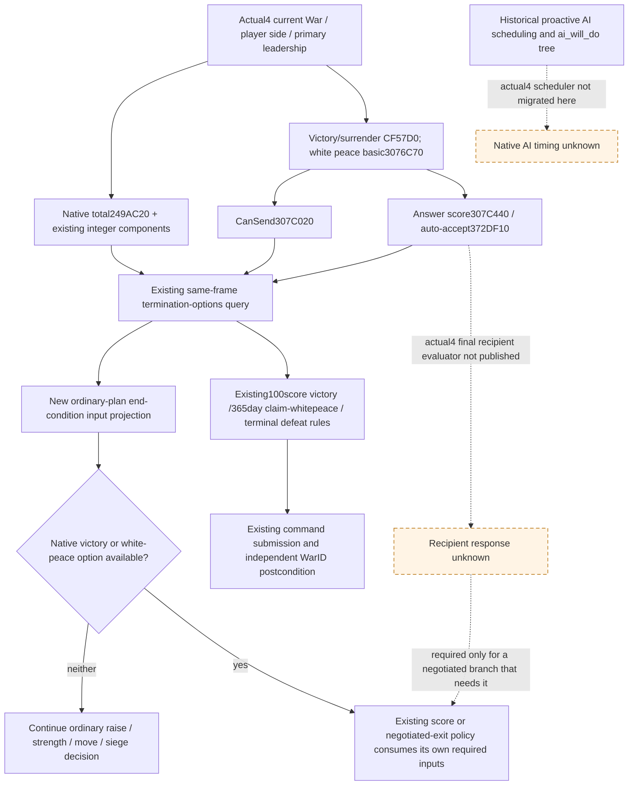

# Current war end conditions in the ordinary planner

2026-10-08 / 2026-W41. **Research; source candidate and sole FIRST recipe prepared, SOURCE_NOTRUN.** Source base `a59b2df4a2b3ab6a951bfdc4f12845faf27439d7`; owned sparse tree `Z:/gbs-war-diplomacy-normal-r76`. Exact CK3 **1.20.0.4 / Steam25734779**, EXE SHA **98702F88A547CDE2EAF29A85F93B85F68EE4CF8148336A4F7AFAEB75319DD518**, is reused from Root's freeze. This work reads held source only and does not acquire image bytes or operate CK3.

## Native tree and evidence scope

The historical [native AI termination tree](war-termination.md) and [peace proposal/acceptance study](war-film-peace-policy-2026-09-23.md) separate proactive `ai_will_do`, recipient `ai_accept`, auto-accept, final CanSend and actual submission. Their scheduler, frequency and final recipient evaluator addresses belong to CK3 1.19.0.6. They are background semantics, not migrated `.4` scheduling or recipient ABI proof. The [.3 Robert end conditions](war-end-conditions-1.20.0.3-2026-10-03.md) similarly retain their own dated game qualification.

The adopted actual `.4` source supplies the existing production path through [ck3_12004_diplomacy.hpp](../../ck3_autonomous_player/native_bridge/include/xar_bridge/ck3_12004_diplomacy.hpp) and [ck3_12004_diplomacy.cpp](../../ck3_autonomous_player/native_bridge/src/ck3_12004_diplomacy.cpp). It calls the established software reader using actual `.4` bindings; it does not call an old-image binder. This packet reuses those migration receipts and does not reread their bodies.

| Production input | Actual `.4` source pin | Meaning used here |
| --- | --- | --- |
| Current War/side membership | `2494B40`; caller-owned actual Core/World | Player side and primary leadership are observed inputs. |
| Total player-relative score | `249AC20`, side interpretation in existing reader | Native total; integer components need not sum exactly to it. |
| Resolution context | `CF57D0(context, war, player_victory)` | Boolean is player victory, on either physical side. |
| Basic white-peace context | `3076C70` with database `89DA60` and default `3077300` | CB permission and context construction remain separate from CanSend. |
| Final context CanSend | `307C020` | Existing per-option `native_validator_passed` and `available`. |
| Answer score / auto-accept | `307C440`; trigger `372DF10`, definition offsets2290/2718 | Score and auto-accept remain distinct observed fields. |
| Existing submission | `2968150`, secondary validate `2968200`, vtables448BCF0/448BCC0 | Existing command path rebuilds native context; this candidate submits nothing. |
| Four integer score components | `2C0C2F0`, `2C0C390/2C0CFE0`, `2C0DD90`, `2C0EE50` | Attacker-relative observed breakdown; no invented goal denominator. |

`available` is native context legality. It is not proof that a recipient accepts, nor a instruction to concede. A positive answer score cannot fill the currently unavailable final recipient-response field. The actual `.4` binder explicitly retains that producer limitation. This candidate reports the gap only when interpreting an observed legal white-peace option; it does not invent a reply bool or add a native observation.

## Actual R76 and useful normal consumption

Root's frozen `008-r75-ooda-turn.json` at `Z:/ck3_mod_rewrite_process_assets/g2-background-20261007/upstream-build-migration/managed-full-h9658-startup30restore01/operator/gameplay-responses/` observed War100663329, Robert29829 primary attacker, opponent31050, `claim_cb` index11, age23days, player/native totals0 and all four integer components0. CB white peace permission is true, while actual white-peace and victory CanSend/available are false. Surrender is legal and auto-accepted. These observations support continuing the intended war; legality alone does not select surrender. Root has already advanced the normal plan to strength query010. This package does not consume a later game frame or change that fact.

The ordinary planner already prioritizes native100score enforce-demands, uses current termination queries or its existing negative-query lease, raises when there is no controllable army, and waits for gathering before movement. It also retains its existing narrow365-day primary-attacker claim white-peace and terminal-defeat rules. No threshold or selected action is changed here. Current target2606/2608 and siege selection/eligibility remain the separate Runtime33 province lane; general projected contact remains the Army lane.

The concrete consumer gap is explanatory: every existing `war_exit_assessment` says automatic termination is disabled while full campaign outcomes/terms are unknown, although the same ordinary chooser already has independent minimal end rules. The source candidate adds `native_end_conditions` to each ordinary `active_wars` summary from an **already normalized, same-frame** termination row. It projects actual per-option legality, answer score/auto-accept, genuine reply status and a nonloss exit input (`continue_war` when both victory and white peace are currently illegal). It also labels the old disabled comparison as `full_campaign_expected_utility`; missing full outcome forecasts do not become a new blockade on ordinary war progression.

The projection is planner input, not an engine goal predicate or automatic peace selector. It never converts legal surrender into a recommendation to lose, never treats CB white-peace permission as CanSend, and never promotes a raw acceptance score to a reply. A historical negative lease remains lease provenance; it does not become a current native option row. The same existing `_same_frame_termination_row` determines which current row may be summarized, without changing query/action admission.

## Source seams and sole FIRST

The owned pure leaf is `src/xar_autoplayer/current_native_war_end_conditions_v1.py`. The only ordinary chooser changes are its import, the `war_summary` projection and the scoped wording of the existing full-EU assessment in `strategy.py`. The native query schema, normalizer, Service/MCP registrations, terminal action policy and active Runner are unchanged. `GameplayBridgeService.plan_turn` calls the actual `choose_one_life_turn`; registered `ck3_plan_turn` publishes its result.

One new source-only registered consumer fixture is prepared for the current0score native-negative case, native legal white peace with missing final recipient response, and the existing100score victory priority. It uses the real chooser/Service/registration and explicit synthetic outer snapshot I/O. It does not mock the baseline chooser, reuse qualified old fixture packets or manufacture native/game qualification. The external sole argv/expected output recipe is prepared for Root, **SOURCE_NOTRUN**; no imports, tests, builds, SDK or game calls are made by this lane.

## Remaining native source entry

If ordinary policy later needs negotiated white peace, the concrete adopted entry is the actual `.4` constructed context after `307C020`, with `307C440` answer-score and the existing `2968150` send-command family. The missing piece is the typed final recipient evaluator/decision propagation on that live context before teardown. Its actual `.4` callback RVA/ABI is not held by this packet. Historical `2C43B40/2C44320` comparator addresses remain historical; a future finite migration must identify the actual interval from a real source handoff before capture. No new capture is requested now. Claim80% callback/denominator searching is stopped and is not this work package's dependency.

Oct8/W41: completed held native/source tree update and ordinary current-options projection source candidate; purpose distinguish observed current exit legality from an unfinished full campaign valuation, supporting normal war progress. Readiness research/source prepared; sole FIRST SOURCE_NOTRUN; no production-live or end-war credit. This lane EXE/body/hash/game/SDK/build/import/test0. Root owns report integration and qualification.
