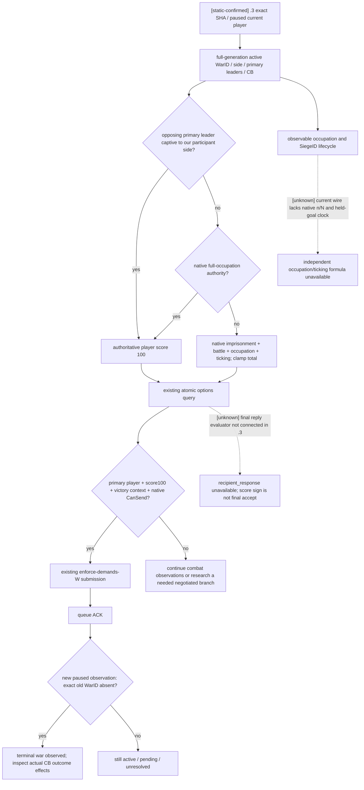

# War end conditions: Robert 29829, CK3 1.20.0.3

Prepared at 2026-10-03 13:12 Asia/Shanghai and updated from the coordinator's completed paused batch. This file-only lane binds Steam build `25652598`, EXE SHA-256 `94B55397ABB687A3DCD436805A5D885E6BE90FA6C693FEB44A9E3BBEEADE02A6`. The source checkout is `Z:/g35`; authoritative current stock data is `Z:/SteamLibrary/steamapps/common/Crusader Kings III/game`. The repository `Crusader Kings III/game` is a differing historical reference and is not used as current stock. The campaign baseline is actor `29829`, episode `native-29829-2bc2d599f7f9`, date raw `53236608`, current event `23`. This lane does not operate the game; it consumes the coordinator's frozen files.

The current owner authorization lifts the historical nonwar-only restriction and permits combat research. Historical pauses in source documents are historical facts; they do not determine current authorization. The coordinator alone owns Git, CK3, SDK, pipe, DLL loading and window state. All findings below come from files.

## Existing exact-build basis

`crozier-1.20.0.3-native-migration.md` and `native_bridge/research/ck3_1_20_0_3_abi_reuse.json` bind the new SHA and establish reviewed unchanged `.2` ABI regions. The `.3` factory preserves actual `.3` identity while reusing `ck3_12002_diplomacy.cpp`; this is explicit reuse, not adoption of old live evidence. The `.3` episode03 occupation study already froze 24 PE spans and 64 instructions and observed a real fall/occupation and four-component score change. This lane reuses that evidence without rerunning its fixture or hashing the game EXE again.

Existing evidence proves production score/occupation primitives on the William episode03 case. It does not prove Robert's negotiated peace or any end-war outcome. Existing diplomacy synthetic tests cover both physical sides, generation IDs, native validator/queue rejection and context lifetimes; this lane does not repeat them.

## The actual Robert paused frame

[live-confirmed, root-produced artifact] The completed `war-native-readiness/actual-paused-war-v34-01` files supply two successful options queries. Both bind public revision2, native revision5, snapshot `native:5`, connection generation3, current actor/episode/date above. There is no active populist war in this observed frame.

| WarID | Actual native CB key/index | Player/opponent/target | Player total and age | Attacker-relative components | Native final CanSend |
|---|---|---|---|---|---|
| 16777231 | individual_county_de_jure_cb /17 | primary defender29829; opponent30097; title2128; target province2610 | -39;1907days | imprisonment0,battles0,occupation110,ticking-71 | surrender=true; whitepeace=false; victory=false |
| 129 | minor_religious_war /41 | primary defender29829; opponent32750; title2115; target province2640 | 0;11days | all four0 | surrender=true; whitepeace=false; victory=false |

Both CBs' loaded white-peace permission is true; both actual white-peace contexts fail CanSend. This separates CB permission from final legality. Both surrender contexts have auto_accept=true despite negative raw acceptance scores; none has an available final recipient-response DTO. War16777231 raw white-peace acceptance is -4804396/Q100000, War129 is -3000000/Q100000. No outcome was submitted by this batch.

War16777231's target2610 is currently unoccupied with no active siege, despite its occupation component110: the native occupation collector covers more than the declared-target capital slice. War129 target2640 is currently unoccupied and has active Siege318767158 at44.133%work; the besieging army50331920 belongs to War16777231 enemy leader30097. The snapshot can expose shared hostile occupation/siege context across wars; it does not make army30097 a War129 attacker or attribute a future score change in advance.

The batch overall status is RED because both war-entry-assessment queries failed with `application-main typed query failed or its snapshot changed`. Its two options queries, war-state and army-strength queries are GREEN and its native checkpoint was saved. This file preserves that distinction: it reuses successful current options evidence, never claims the whole batch or a full OODA passed.

## Queries and actions the coordinator can use

| Purpose | Exact tool and kwargs | Source capability / limitation |
|---|---|---|
| Establish current WarID, side, primary opponent, targets and occupation | `ck3_take_snapshot()` then `ck3_get_war_state()` | Keep full snapshot metadata; the war-state result is a slice. |
| Atomic native score and legality | `ck3_query_war_termination_options(war_id=W, expected_revision=R)` | Default `game.command.query-war-termination-options-N`; paused, full-generation positive int32 W, current public R. |
| Claim disposition only, if actual CB is claim_cb | `ck3_query_war_termination_terms(war_id=W, expected_revision=R)` | Default capability; populist_war returns unsupported CB. It is not generic outcome preview. |
| Enforce player victory at native player score 100 | `ck3_execute_step(step="enforce-demands-W", expected_revision=R)` | Default capability. Literal is projected at player-primary-leader and player-relative score >=100. Native rebuilds context/CanSend; Python waits for the exact old WarID to disappear. |
| Offer white peace | `ck3_offer_white_peace(war_id=W, expected_revision=R)` | Native capability exists. Current Python readiness supports narrow primary-attacker claim/de-jure cases, not populist defender. Final recipient response is also absent from the `.3` producer. |
| Surrender | `ck3_surrender_war(war_id=W, expected_revision=R)` | Native capability exists. Current Python emergency readiness supports de-jure/Raiktor/terminal attacker cases, not populist defender. |
| Native score/custody interpretation | `ck3_execute_step(step="query-war-prisoner-release-pairs-v1-W", expected_revision=R)` | Optional compile flag `XAR_CK3_ENABLE_G2_PRISONER_COLLECTION_PRIVATE_QUERY_V1`; input graph only, not score classification. |
| All current player prisoners | `ck3_query_player_prisoner_collection_private_v1(expected_revision=R, ransom_ordinal=0)` | Same compile flag and MCP `--private-prisoner-collection-query`. No prisoner action is required. |

`W` and `R` above are substitutions, not literal strings and not old WarIDs. The public revision is passed to the MCP; the driver supplies the corresponding native revision. The actual observed WarIDs above are current only for that frozen frame; the coordinator refreshes the frame before a later action. Default options, victory and world queries need no new compile option or permit.

The registered outbound status tool `ck3_query_outbound_war_white_peace_status(war_id=W, expected_revision=R)` is not advertised by the current `.3` descriptor and has no `.3` adapter override. Its Python registration alone does not make it operational. Do not use old `war_exit_terms_v2`: the native adapter explicitly disables it after a reproducible loaded-effect preview crash, and Python also disables it.

## Native score tree and observation boundaries

[static-confirmed] `ReadWarTerminationOptions` resolves the active full-generation CWar, checks paused/alive/current player and one-sided participant membership, and reads primary leadership. `0x249AC40` returns authoritative attacker total; defender total is its negation, and player-relative total follows current player side. Duration is `(date_raw - war+0xE0)/24`, not time holding a war goal.

[static-confirmed, reused .3 narrow evidence] The four integer components are attacker-relative: imprisonment `0x2C0C310`, battle base `0x2C0C3B0` plus attacker/defender side getter `0x2C0D000`, occupation `0x2C0DDB0`, ticking `0x2C0EE70`. Player defending means negating each component for player-relative interpretation. `null` is unavailable; four zero integers are a real observed zero. A captured opposing primary leader held by this side's participant relation yields authoritative 100; full occupation has its own authoritative 100 path. Ordinary sum is clamped to [-100,100]. Total minus the four displayed integer components is diagnostic, not automatically an error.

[static-confirmed] Occupation state is observable occupied status plus full-generation occupier, independently from legal holder and siege presence. A siege ends only when the observed occupation changes and `siege_observable=true, active_siege=null`; progress near 1 alone is insufficient. The target projection can contain county capitals without every fortified holding in the county. It does not provide native eligible occupation n/N or held-goal ratio.

[static-confirmed] Primary capture score is distinct from prisoner count. Native heir scoring uses the first captured entry in CharacterLandState's cached succession list, with loaded heir table {50,25,10}; it does not sum every captured successor. The private release-pair query reads the primary-title successor list, which is not yet equated to the score classifier's cache. Capturing an ordinary courtier is not evidence of leader or heir score.

## Final native CanSend and submission clauses

[static-confirmed] Native resolution context `0xCF57D0(context,war,player_victory)` takes `true` for player victory and `false` for player surrender on **either physical side**. Do not preflip its boolean based on attacker/defender; the native constructor handles side polarity. For Robert as defender, victory is `attacker_defeat`, surrender is `attacker_victory`.

[static-confirmed] White peace additionally reads active `CCasusBelliType+0x1548` bit7 and constructs special index3 using database getter `0x89DA60` and basic context constructor `0x3076C90`. Static presence of an `on_white_peace` block does not replace the loaded permission bit or final native validator.

[static-confirmed] The current options reader and submission path use native CanSend `0x307C040(context,nullptr)`. Query `available` means context constructed plus this validator true. It is not AI acceptance and not a terminal outcome. Raw acceptance uses `0x307C460`; auto-accept reads trigger `+0x2290` through `0x372DF30(trigger,context+8)`, otherwise scalar `+0x2718`. The current `.3` reader never fills `recipient_response`; its default serializes typed unavailable. The final recipient evaluator's `.3` RVA is not frozen by this lane and must not be guessed from an old offset.

[static-confirmed] Submission independently rechecks paused/current alive player, full WarID, side membership and primary leadership; reconstructs the chosen context; requires special pointer `+0x330` and native CanSend true; constructs the `0x368` send command at `0x2968170`; checks both command vtables; clone/queues with flags0x0E; destroys command/context ownership correctly. Queue ACK is submitted, never automatically applied. For victory, the Python path explicitly waits for exact old WarID absence. Callback resources and final title/custody changes still need actual postcondition observations to attribute which CB branch completed.

## Conditional populist defense: actual stock outcomes

These clauses only apply if a later active CB key is observed as `populist_war`; neither current war uses it. The installed current stock file is `common/casus_belli_types/00_civil_war.txt:664`.

| Native result | If Robert is defender | Static script effects and current boundary |
|---|---|---|
| attacker_defeat / on_defeat | Robert victory | County faction members receive county opinion modifier for25years and old lost-peasant modifier removal; rebel leader gets do-not-kill flag; faction revolt-loss cleanup/cooldowns; not-yet-imprisoned attacking war participants are imprisoned by defender; faction destroyed; defender medium dread gain and conditional legitimacy/mandala effects. Exact faction and participant IDs must be observed. |
| white_peace / on_white_peace | Negotiated end | Faction members leave with white-peace cooldown/opinion treatment; faction destroyed; random-peasant leader may vanish, otherwise cleanup plus bilateral1825day truce. This does not apply the victory imprisonment branch. Random-peasant flag, members and current custody are not published by the war DTO. |
| attacker_victory / on_victory | Robert surrender/defeat | Defender loses one prestige level and faction-war legitimacy; faction members get bilateral1825day truces; `successful_popular_revolt_outcome_effect` resolves state-faith/admin branches or territorial breakaway. Normal branch includes faction-related duchy/counties and eligible already occupied culture/faith counties; this is larger than declared capital target rows and includes dynamic distribution. Exact titles/holders/new realms are not projected by current claim-only terms. |
| invalidation | Neither victory nor surrender proven by absence alone | Primary attacker death invalidates; primary defender death inherits; should_invalidate is attacker losing joined_faction. Distinguish these by actual leader/faction/event state when relevant. |

[static-confirmed] This CB sets `use_de_jure_wargoal_only=yes`, attacker goal percentage0.8, battle caps attacker100/defender50, occupation caps150/150. Thus a defender's ordinary battle-score contribution cannot alone be assumed to reach100; native total still decides. Native imprisonment/full-occupation authority is separate. The default ticking parameters are attacker0.055/day with0delay, defender0.055/day with365delay; loaded policy and real held-goal clock decide the current application. War age cannot substitute for that clock.

Underlying current installed helpers: `00_war_effects.txt:1110` revolt loss, `:1219` white peace; `00_faction_effects.txt:290` successful popular revolt; `06_dlc_ce1_legitimacy_effects.txt:250/:318` legitimacy. Common end-war interaction first handles POW release, then CB outcome effects can imprison attackers anew; a before/after custody set is necessary for individual attribution. This note does not give new prisoner-operation authorization.

## Actual current CB outcomes

[static-confirmed, current installed stock] War16777231 uses `00_dejure_war.txt:314` individual_county_de_jure_cb; War129 uses `00_religious_war.txt:1` minor_religious_war. Outcome names remain attacker-relative. Robert winning means on_defeat, while Robert surrendering means on_victory.

| Actual CB / result | Determinate script semantics | Dynamic fields still unavailable |
|---|---|---|
| county de-jure / attacker_defeat | No conquest transfer; attacker pays short-term gold reparations with GOLD_VALUE3; defender receives fame/conditional legitimacy, shared truce and contribution effects. | Exact paid gold, cb_prestige_factor/fame, truce days and participant-dependent ancillary effects. |
| county de-jure / whitepeace | No conquest transfer; attacker prestige loss -5×cb_prestige_factor; defender neither gains nor loses prestige in this CB block; ally participation fame and shared white-peace truce. | Actual factor/ally awards/truce; native CanSend presently false. |
| county de-jure / attacker_victory | `setup_de_jure_cb` applies conquest with add_claim_on_loss=yes for observed target2128, then resolves title/vassal changes; defender prestige loss, attacker victory fame/legitimacy/truce and conditional hook/ancillary effects. | Actual holder, liege/vassal operation set and resource deltas; current claim-only terms cannot substitute. |
| minor religious / attacker_defeat | No conquest transfer; defender piety per target, conditional1.5holy-war bonus; attacker pays2years short-term income if monthly income positive, otherwise medium gold per target; attacker same-faith-vassal opinion penalty and shared truce/legitimacy/ancillary effects. | Exact piety, income/gold, affected people, truce/faith-specific gates. |
| minor religious / whitepeace | No conquest transfer; attacker piety change and stress/fulfillment conditions, defender arrogant stress/fulfillment condition, ally fame and shared truce. | Actual values/trait-conditioned effects; native CanSend presently false. |
| minor religious / attacker_victory | `conquest_holy_war` with add_claim_on_loss=yes traverses target2115 hierarchy; tolerance/faith decides direct title taking versus vassal taking; resolves actual titles/vassals; attacker piety experience, both faith fervor changes and shared truce/ancillary effects. | Full dynamic hierarchy/holders/tolerance/faith/state and resource deltas; current claim-only terms cannot substitute. |

Both CBs inherit on primary attacker and defender death. County de-jure invalidates if no targeted de-jure county remains under defender hierarchy. Minor religious also invalidates on explicitly set attacker/defender faith-change invalidation variables. WarID absence without the submitted outcome context and relevant postconditions does not identify which branch happened.

Minor religious war sets attacker occupation scale150 and both battle scales150; occupation caps150/150, de-jure goal-only=yes and attacker goal ratio0.8. It does not set the populist defender battle cap50. The two current CBs use current default battle caps unless overridden in their loaded policy; never apply the conditional populist cap to these wars. The actual native total/CanSend remains the decision authority.

## Minimum remaining construction, only when its branch is needed

1. **Victory branch:** no new component or fixture is needed to start fighting and later enforce a native legal100score victory. Current root options are available but both victory CanSend results are false; keep fighting/observing. After legal100score, coordinator uses existing terminal action and obtains actual paused postconditions. Robert options are production-live primitive; Robert termination is live-pending.
2. **Negotiated white peace:** if the coordinator chooses it as valuable and native CanSend is true, connect final recipient evaluation to the existing options DTO before context teardown. Locate current `.3` native Send/AI reply chain from reviewed constructors/CanSend/answer-score; freeze exact function/argument ABI and Mermaid edge first. Extend the existing diplomacy fixture with a production evaluator seam, including positive raw score with final reject, available statuses0/1/2, and unavailable3. Keep old crashing loaded-effect v2 disabled. Then add a minimal current-CB defender readiness branch backed by stock outcome knowledge and actual frame data; do not require generic financial/resource previews merely to preserve the realm by a known CB white peace. This is a real feature dependency, not a new safety audit.
3. **Current defender surrender:** both current native contexts are legal and auto-accepted, but current Python readiness does not cover these current defender cases. A useful surrender policy requires minimum target holder/liege/dynamic transfer semantics from `setup_de_jure_cb` or `conquest_cb_title_transfer` and a current-CB defender readiness branch. If a later populist war appears, current world/options is likewise insufficient to enumerate its county/faction/occupied-county/state-faith loss set. None of these can use claim_cb terms or old War31 data. Mechanical surrender legality alone does not establish the user's strategic choice to concede these titles.
4. **Score strategy:** if lack of held-goal/occupation/capture inputs blocks a chosen maneuver, add only the corresponding native getter output: native occupation collector n/N and holdings; held-goal ratio/clock and ticking raw valid cache; or score-classified captive leader/heir/jailer participant IDs. Existing integer total already suffices for terminal score decisions.

## Progress fields for canonical reports

Completed: current `.3` score/CanSend/outcome call chain mapped to existing tools; root actual two-war options consumed; installed-stock de-jure/holy-war result clauses and conditional populist clauses frozen; unsupported negotiated/surrender and final-response gaps identified. Why: remove uncertainty about how Robert can end the actual defensive wars without copying historical build assumptions. Readiness: static-ready handoff; root's current Robert options are production-live primitive; no full autonomous loop or terminal outcome credit. Test/artifact: source boundary check and hashed input/current-root-artifact index in `ROOT-DELIVERY.json`; no game, SDK, pipe, DLL, desktop, Steam, provider or Git operation; old fixtures reused without repeat. RED: root war-entry queries failed while options succeeded; missing producer final response/current-CB Python branches are feature gaps, not newly raised blockers for fighting. Next: keep combat/observation progressing because native whitepeace and victory currently fail; enforce100score once observed legal; construct negotiated/surrender branch only when chosen. Commit/push: coordinator-owned, pending at this handoff.

## 2026-10-03 13:54 Asia/Shanghai: refusal created actual populist War50331736

[live-confirmed, coordinator-produced artifact; file-consumed only] Fresh GREEN `war-movement/actual-post-refusal-v34-01/004-ck3_query_war_termination_options.json` observes full WarID **50331736**, native CB **populist_war/index4**. Robert29829 is primary defender, primary attacker is70766; targeted TitleID2115 projects province2640. Query sequence3 binds `native:11`, public revision2, native revision11, connection generation6, episode `native-29829-2bc2d599f7f9`, date raw53236608. This is the newly created live war after the actual refusal; the earlier two-war/no-populist frame above remains historical and is not overwritten.

Native war age is0days. Attacker, defender and player-relative total are0; imprisonment, battle, occupation and ticking are all observed0. Loaded white-peace permission is true, but the final native white-peace validator is false; player victory validator is also false. Surrender context/validator/available are true and auto_accept=true; raw acceptance is-99, illustrating why raw-score sign is not a substitute for auto-accept. The recipient-response DTO still explicitly says unavailable/null. No termination action was submitted in this evidence.

Same-frame snapshot003 shows target2640 is observably unoccupied. It still exposes Siege318767158, besieging army50331920, work275.836/625 and fraction44.133%, with besieging strength0/days-leftnull. The new rebel armies251658381,473,474 belong to70766 and are already `in_combat=true` at2640; the war query's battle score remains0. These facts do not identify their CombatID, opponents, future battle result, or a siege owner change. Province2640 is also the minor-religious war129 target; keeping the full WarID in every score/outcome query prevents cross-war attribution.

The installed-stock populist clauses already researched above now apply to this **actual** current CB: defender battle-score cap50, attacker battle-score cap100, occupation caps150/150, goal-only de-jure handling and attacker goal ratio0.8. A normal defender battle contribution alone cannot be assumed to reach100; authoritative native total and CanSend decide whether the existing victory action is ready. No cached war age is used to fabricate ticking or a held-goal ratio.

| Future result | Actual semantic branch for Robert | Bounded readiness now |
|---|---|---|
| Player victory | attacker_defeat/on_defeat: faction cleanup, opponent attackers' imprisonment and defender dread/conditional legitimacy; county-member modifier treatment | Native CanSend=false at score0; existing enforce-demands path can be used after a future observed legal100score. No new production component needed to keep fighting. |
| White peace | faction destruction/cooldowns; possible random-peasant leader disappearance or1825day truce; no victory imprisonment branch | CB permission=true but native CanSend=false. Final reply observation and current-CB defender Python branch remain construction entries only if negotiation becomes useful/legal. |
| Surrender | attacker_victory/on_victory: Robert loses one prestige level and conditional legitimacy; bilateral faction-member1825day truces; dynamic successful_popular_revolt_outcome_effect | Mechanically legal/auto-accepted, but quantified title/county/state-faith effects and current-CB defender Python readiness are unavailable. Declared title2115 is not the full dynamic loss set. |

Report fields: completed actual new-war CB/leader/goal/score/CanSend binding and connected it to existing installed-stock outcomes; why remove uncertainty after the real refusal; readiness current populist options are a production-live primitive, not completed war termination or an autonomous victory loop; artifact raw004 plus snapshot003 and root batch result indexed in `POST-REFUSAL-ROOT-DELIVERY.json`; no SDK/game/test/Git/shared-file operation; no new RED in this GREEN batch; next continue combat/observe and use existing native legal100score enforce when reached; commit/push coordinator-owned and pending adoption. The prior war-entry RED remains preserved in its earlier attempt and is not relabelled by this later GREEN batch.
