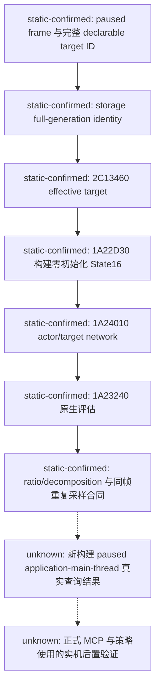

# CK3 1.20.0.2：宣战前原生军力评估迁移

2026-10-01 后台静态工作包。状态为 `static-ready`，没有读取、注入、暂停或操作玩家当前游戏。旧版研究仍见 [player-war-entry-policy.md](player-war-entry-policy.md)；本页只更新 exact-build ABI，不修改自动玩家策略或原生 AI 权重。

冻结构建为 `1.20.0.2 (Crozier)`，Steam build `25588574`，EXE SHA-256 为 `AE1BA6FF060BA603842F6F4A2DED0AF4B7D3666B3DD271F75FB01B0DA8E81B2D`。机器可验证合同为 [ck3_1_20_0_2_war_entry.json](../../ck3_autonomous_player/native_bridge/research/ck3_1_20_0_2_war_entry.json)。

## 已闭合的静态绑定

| 项目 | 1.19.0.6 | 1.20.0.2 | 新构建直接证据 |
|---|---|---|---|
| 原生评估函数 | `0x1878A00` | `0x1A23240` | 原生调用点 `0x1A6AC2E..0x1A6AC4C` 仍传完整 State16、effective target、0x28 输出和两个 stack 参数 |
| actor State16 builder | `0x18784D0` | `0x1A22D30` | logical range `0x1A22D30..0x1A23238`；`0x1A22E90` 写输出 qword，`0x1A22DC2..0x1A22DCB` 更新 +0x0E flags |
| 网络军力 collector | `0x1879850` | `0x1A24010` | `0x1A233E2` target `{0,0,0}` 与 `0x1A2343B` actor `{1,1,1}`；configuration+0x20 为 accumulator 指针 |
| effective target resolver | `0x2909D30` | `0x2C13460` | `0x1A6ABEE` 调用结果成为评估函数 R8；resolver 的 actor/target 身份路径单独审阅 |
| builder dependency singleton | `0x570C638` | `0x5D1DD50` | getter `0xA07974` 与 `0xA079BB` 读取同一 slot；保留非空且同一 sample 稳定的旧合同 |
| Character power component | `+0x1B8` | `+0x1C0` | builder `0x1A22E75` 与 assessment `0x1A23379` 独立读取 |
| Power raw leaf | `+0x308` | `+0x308` | builder `0x1A22E81` 与 assessment `0x1A23385` 独立读取 |
| Character death component | `+0x1C8` | `+0x1D0` | 新版本 core 合同；旧 +0x1C8 已成为另一个 component，不能继续用作死亡判断 |
| Character storage/fallback slots | `0x570C130/138` | `0x5C67568/570` | 新版本 core 合同，full-generation ID 检查保持不变 |

输出仍为 0x28 字节：+00 distance、+08 target total、+10 authoritative ratio、+18/+1C 两个 int32 native context entry、+20 raw flags。State16 仍为 0x10 字节，调用前清零；不得用单独 int64 power 替代它。角色 extension 与 traits 内部字段发生变化，但 reader 不复制 AI manager 中的 actor context，继续使用原生 builder 支持玩家角色。



## 实现与离线结果

实现入口为 [ck3_12002_war_entry.hpp](../../ck3_autonomous_player/native_bridge/include/xar_bridge/ck3_12002_war_entry.hpp) 与 [ck3_12002_war_entry.cpp](../../ck3_autonomous_player/native_bridge/src/ck3_12002_war_entry.cpp)。`BindWarEntryNativeEnvironmentV1(module_base, executable_sha256)` 只接受上述 SHA；每个 runtime slot、函数指针和角色字段都来自本版本合同。线协议 DTO、同步 scratch shapes 和十进制请求语法复用已有版本无关形状。Serializer 使用 [ck3_12002_war_entry_serializer.cpp](../../ck3_autonomous_player/native_bridge/src/ck3_12002_war_entry_serializer.cpp) 独立输出新版本 provenance；旧 serializer 的版本与 RVA 是硬编码，不能继续调用。

类型别名来自旧 namespace，所以集成时用完整 `xar::ck3_12002::ReadWarEntryAssessmentsV1` 限定，避免 argument-dependent lookup 选入旧 reader。生产 dispatch 继续经过本版本 owning-main-thread mailbox；frame 回调必须来自同一 paused snapshot，并提供已冻结的可宣战目标集合。

MSVC x64 C++20 编译与 [ck3_12002_war_entry_test.cpp](../../ck3_autonomous_player/native_bridge/src/ck3_12002_war_entry_test.cpp) 为 GREEN：覆盖 exact SHA/RVA 绑定、effective target full ID、角色 generation、power/death 新偏移、旧死亡位置非空仍判存活、两次零初始化 State16、actor/target 网络分解、native ratio、暂停/主线程前置条件和 snapshot revision。

离线 ABI verifier 为 GREEN：4 个完整 logical function range SHA、27 条精确指令、12 个源码常量。运行方式：

```powershell
py -3.13 ck3_autonomous_player/native_bridge/research/verify_ck3_12002_war_entry.py --exe artifacts/migrations/2026-09-30/post-update-1.20.0.2/installation/binaries/ck3.exe
```

离线 exe 为 `artifacts/migrations/2026-09-30/post-update-1.20.0.2/war-entry-build/ck3_12002_war_entry_test.exe`。以上均不构成新版本 live 证据。下一个依赖是 adapter/typed dispatch 集成后，在玩家允许的实机时段对真实 declarable target 执行 paused query，并互证 effective target、native power/ratio 与稳定帧；本工作包没有为迁移修改宗教域或宣战策略。
