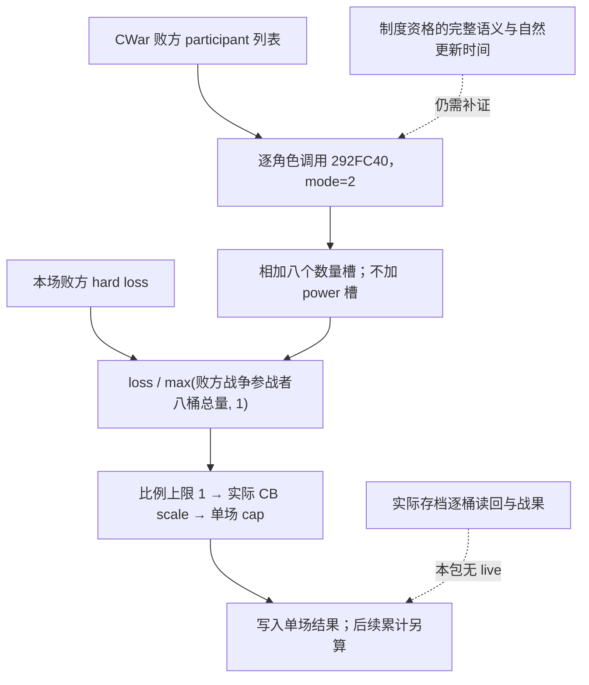

# 战争影片研究：战斗战争分数的八类分母

2026-09-23；CK3 1.19.0.6，EXE SHA-256
`2d00ff3101ef70b566f2fcbae292f09263199c80e9dc8f139b82d7d96f83db86`。
本包只读本机 EXE 和原版英文界面本地化，没有启动 CK3，没有实机数值或新战斗。
原有 [战斗终局专题](battle-terminal-and-reentry.md#单场-war-score-与累计-battle-score) 的公式继续成立；
本包补充此前未命名的八个桶及数量口径，不改变历史 live 评级。

## 可用的结论

单场战斗分数的分母，来自**败方战争参战者的角色军事汇总**，不是只数本场参战军队，
也不是直接读取本场开战时的敌军人数。程序在结算函数内逐个调用 `0x292FC40(character, mode=2)`，
把八个整数数量槽相加，最后至少取 1。

其中征召兵与兵士使用界面所称的 `MAX` 槽；特殊部队、骑士和游牧骑手另有口径。
所以也不能把全部八桶笼统讲成“当前士兵”或“完全补员后的士兵”。
这些是**数量槽**，不是相邻的 power 槽；骑士的伤害/坚韧加权不会作为人数直接加进此分母。

关键数量与标签已静态闭合。某些下级制度资格、缓存更新时刻和边界存档尚待进一步验证，
下文分别列出；本包不能作为影片实机案例已经拍好的证明。

## 从单场结果追到八桶

`0x25BBE70` 先用 `0x23CDD90` 取得本场败方的 hard-loss raw，然后按照胜方属于战争哪一侧，
选择 CWar `+0x88` 防守方或 `+0x28` 进攻方 participant pointer 数组。
`0x25BBFB9..0x25BBFE4` 对每项 participant `+8` 的完整 Character ID 作 generation 检查。
`0x25BBFED/0x25BBFF5` 明确传 `r8b=2` 并调用汇总函数。

返回对象从 `[rsp+0x20]` 开始。`0x25BBFFA..0x25BC029` 累加返回对象的
`+C0,+00,+20,+40,+60,+80,+A0,+E0` 八个 **int32**；没有读同桶 `+8/+10` 的 int64 power。
`0x25BC078/0x25BC084` 实现 `max(sum,1)`，随后转 Q100000。
`0x25BC16F/0x25BC172` 把 loss/denominator 比例最多取 1，再乘实际 CB scale，并过原有单场上限。
累计战斗分数与总战争分数仍是后续独立步骤。



## 八桶的来源和数量口径

返回对象中每桶步长 `0x20`。一般布局为 `+0` MAX 数量、`+4` CURRENT 数量、`+8/+10` 两种 power；
但有些桶直接把相同数值写入前两个数量槽，不能仅凭这个布局给它们强行赋予补员语义。

| 桶偏移 | 名称与独立命名依据 | mode=2 实际来源 |
|---|---|---|
| `+00` | 征召兵；tooltip `0xC789E0` 绑定 `LIST_LEVIES_STRING` | `0x292FDA1` 给 levy selector 的第 5 参数传 1，结果在 `0x292FDBE` 写入此槽。相邻 `+04` 是参数 0 的 CURRENT。 |
| `+20` | 兵士；`0xC78C38` 绑定 `LIST_MAA_STRING` | land extension `+108` 和 `+2A8` 两个 regiment-ID 容器，均经 `0x2930850`。通常加 CRegiment `+128`；`+138==1` 时采用下述 composition 修正数量。 |
| `+40` | 雇佣兵；`0xC78F50` 绑定 `LIST_MERCENARIES_STRING` | land `+138` company IDs，经 store `0x570C7D0`；`0x2930A90` 遍历 company `+30/+3C` 的 regiment IDs。mode=2 加各 regiment `+128`。另有首个持有头衔关联、company `+48==-1` 的补充分支。 |
| `+60` | 骑士团兵力桶；`0xC79095` 绑定 `LIST_HOLY_ORDERS_STRING` | land `+150` IDs，经 store `0x570C7C8`；`0x2930D30` 遍历对象 `+40/+4C` regiment IDs。mode=2 加各 regiment `+128`。首个头衔关联的补充分支要求对象 `+58==-1`。这里只记录战争分母中的既有桶，不扩展宗教/招募策略研究。 |
| `+80` | 特殊部队；`0xC78E0A` 的 `LIST_EVENT_TROOPS_STRING` 在原版 loc 使用 `[special_troops]` | land `+290` 的 `0x38` 步长组，组内 `+20/+2C` regiment IDs；采用 composition 修正数量，mode bit1 在 `0x2930219` 累加。CURRENT 分支取相同数量。 |
| `+A0` | 骑士数量；`0xC78A69` 绑定 `LIST_KNIGHTS_STRING` | `0x28FDD40` 返回的 Character-ID 向量数量；`0x293009B/0x29300A2` 同写两个数量槽。该 helper 除本角色向量外，还附加雇佣公司和骑士团对应持有人向量；不是只数本场实际参战骑士。 |
| `+C0` | 符合条件的持有头衔下属 regiment；由 Title store 及相同 regiment helper 绑定 | `0x28AB770` 返回 Title pointers；`0x2930428` 取每个 title `+418` 容器，再由 `0x2930850` 累加此桶。与 `+20` 的数量规则相同；此桶在本次 tooltip 没有独立 LIST 标签，不冒充已找到 UI 正式名称。 |
| `+E0` | 游牧骑手的畜群换算分支；`LIST_HERD_STRING` 实际展示 `GetMaA('nomadic_riders')` 名称 | 条件成立且 land `+2A8` 为空时，由 `0x294A390` 取得 `0x232DE50` 的 Q100000 结果并四舍五入到整数，同写 `+E0/+E4`。不是直接把畜群资源原值当兵员相加。`+2A8` 非空时这两槽清零，该容器已计入 `+20`。 |

### MAX/CURRENT 的证据不是英文变量猜测

tooltip `0xC789F9` 把 `out+04` 作为 `r9`，把 `out+00` 作为第 6 参数交给 `0xC7D6B0`；
后者 `0xC7D719/0xC7D744` 把 r9 指向值命名为 `CURRENT`，
`0xC7D74B/0xC7D77B` 把第 6 参数指向值命名为 `MAX`。
兵士 `0xC78C51/0xC78C55` 同样绑定 `+24/+20`。
原版 `realm_window_l_english.yml:44/46` 明确使用 `$CURRENT$/$MAX$`。

征召兵最末数量消费 `0x29075E0` 的参数 1 分支在 `0x2907683` 直接加已构造贡献项 `+10`；
参数 0 分支会结合当前 composition 数量取较小值。上游仍保留资格过滤，例如 row state==1 会跳过。
因此 `MAX` 也是原生过滤后的汇总，不是“全国所有人口都可征召”。

### 特殊部队与 kind==1 的 composition 修正

设 persistent CRegiment `+128` 为 B，七行 composition 起于 `+18`、每行长 `0x24`。
每行读取 `row+0`、`row+4` 和 `row+18`：

```text
quantity = B
for each of 7 rows:
    if row[0] != 0:
        selected = row[0] if row[0x18] == 3 and row[4] == 0 else row[4]
        quantity += selected - row[0]
```

特殊部队在 `0x29301AA..0x29301EA` 始终使用此数量；
一般 regiment helper 的 mode2 在 `0x2930976..0x29309C7` 仅对 `+138==1` 使用它。
`+138==1` 的枚举正式名与 row state==3 的全部生命周期不由本包命名；
不能据此把所有已撤离、未集结或重组行解释为同一业务状态。

### Title 与游牧分支的界限

`0x28AB770` 先检查角色政府数据 `+38 bit9`、角色 rank 与政府 `+420` 门槛；
随后遍历 land `+1E0` 的 Title IDs，只保留 title type `+5C` 达门槛且 title `+32==0` 的项。
本包确认 membership 的实际字段/比较与 Title 身份；政府各配置键和所有特殊制度的正式资格解释尚未逐项绑定。

游牧桶内部 `0x232DE50` 在未建立 `+2A8` regiment 的分支上，使用关联对象 `+48`，
乘以被夹在 0..1 的系数；系数含全局值和 modifier `0x186`。结果经 `0x294A390` 的
正负对称半单位舍入转换为整数。本包闭合的是“换算后的 nomadic riders 数量进入桶”，
没有声称已经解释畜群系统的全部增长、转换或征募规则。

## 拍摄需要的下一步

用同一战争的战前/终局暂停数据取得完整 WarID、败方 participant IDs 与各角色八桶，
并回读每个桶使用的源容器、数量与 row state。将本场 hard loss、CB scale、row score 一并保存，
按原生整数/定点运算重放，而非用 UI 四舍五入显示值硬凑。
至少一个普通军队案例和一个特殊部队边界案例才能验证影片对应解释；本包没有产生它们。

尚需补齐的边界：levy contribution 构造资格的完整业务命名、title 资格配置键、
kind/state 枚举的生命周期，以及终局各 producer 的实际更新先后。
它们不影响本次证实“八桶并非本场当前人数”的结论，但不能冒充全军事汇总已 100% 完成。

## 复现与冻结记录

- [抽取器](../../ck3_autonomous_player/native_bridge/research/war_film_denominator_extract.py)
- [EXE 字节与标签合同](research/war-film-denominator-evidence-20260923.json)
- [初始计划](research/war-film-denominator-plan-20260923.json)
- [结果计划](research/war-film-denominator-results-20260923.json) / [声明图](research/war-film-denominator-graph-20260923.md)

```text
tools\.venv\Scripts\python.exe ck3_autonomous_player/native_bridge/research/war_film_denominator_extract.py --exe <exact-ck3.exe> --out <new-external-directory>
```

一次实际复验通过：13 个有界指令段全长解码、15 个关键指令、9 个 EXE 标签和 7 条原版 loc。
解释器为本 worktree Python 3.14.7，capstone 5.0.9、pefile 2024.8.26。
原始材料永久保留于 `D:/workspace/ck3_war_film_research_20260923/denominator-extract-r1/`，
探索段另保留于 `targets-explore-r1/`、`denominator-explore-r1/`。
计划工具只验证记录与 hash 绑定，不替代反汇编语义审阅或实机验证。
