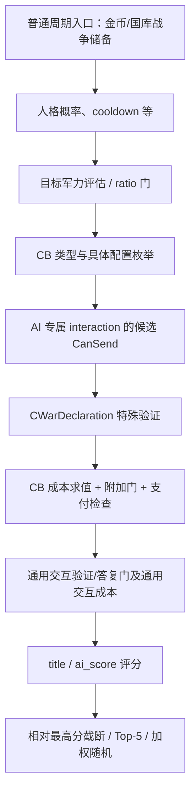

# 宣战影片 W1：军力输入、准备金与 CB 成本的原生先后

本包只研究 CK3 **1.19.0.6** 的普通周期性 AI 宣战路径，服务于影片 C01–C02。
本轮没有启动 CK3、调用游戏函数、修改存档或增加 live 评级。旧的
[宣战专题](war-declaration.md)与[军事准备专题](military-preparation.md)保持原样；
下文是新增的精确静态证据，不表示这棵树已全部梳理完成。

结论：入口准备金门已能正式命名为 **金币战争储备与国库战争储备**，并且先于人格概率、
cooldown 和候选枚举。具体候选还须分别经过 **CB 特殊成本**、通用交互合法性及通用交互成本。
这些检查发生在候选评分之前。它们不是同一个金额，也不是“算出胜率后准备几个月钱”。

## 冻结身份与复现

| 输入 | SHA-256 |
|---|---|
| `ck3.exe`，95,206,008 bytes | `2d00ff3101ef70b566f2fcbae292f09263199c80e9dc8f139b82d7d96f83db86` |
| `game/common/defines/ai/00_ai.txt` | `c78f9cd8df9938cc9f38e817bcb6e32cd13720b5bd9de077b85e3e1c6f030293` |
| `game/common/casus_belli_types/_casus_belli.info` | `e3bacd9f3360837f6ed7d5f22b937ab7e79cb675ad804819a627cb73970ce699` |

冻结包位于 [research-plans/war-film-declaration-inputs-20260923-r1](research-plans/war-film-declaration-inputs-20260923-r1/war_film_declaration_inputs_plan_20260923.json)：

- [原生合同](research-plans/war-film-declaration-inputs-20260923-r1/war_film_declaration_inputs_static_20260923.json)
  保存 31 段指令、原始 bytes、段 hash、7 个原版字符串及 5 组 vtable 指针绑定。
- [离线计划](research-plans/war-film-declaration-inputs-20260923-r1/war_film_declaration_inputs_plan_20260923.json)
  为 8 条 `static-confirmed`、3 条 `unknown`、0 条 live 边。这是本包的证据粒度，不是全游戏完成率。
- [工具检查](research-plans/war-film-declaration-inputs-20260923-r1/war_film_declaration_inputs_check_20260923.json)和
  [生成图](research-plans/war-film-declaration-inputs-20260923-r1/war_film_declaration_inputs_graph_20260923.md)
  只检查计划、hash 绑定与等级一致性，不替代指令语义复核。

在本隔离 worktree 已验证的 `tools\.venv\Scripts\python.exe` 中安装了 pefile 2024.8.26、
capstone 5.0.9。复现必须选一个**尚不存在**的输出目录：

```text
tools\.venv\Scripts\python.exe ck3_autonomous_player\native_bridge\research\war_film_declaration_inputs_freeze.py --exe C:/SteamLibrary/steamapps/common/CRUSAD~1/binaries/ck3.exe --output-dir D:/workspace/ck3_war_film_research_20260923/declaration-reproduce-new
tools\.venv\Scripts\python.exe tools/native_research_plan.py check D:/workspace/ck3_war_film_research_20260923/declaration-reproduce-new/war_film_declaration_inputs_plan_20260923.json
```

独立提取器 `ck3_autonomous_player/native_bridge/research/war_film_declaration_inputs_extract.py`
支持 `--rva 0x187ACBD --size 0x54`，以及数据表的 `--qwords`；默认 stdout，显式 `--output`
拒绝覆盖。它和冻结器均只读取 EXE 文件，不附着进程。所有被 hash 绑定的入库 JSON 均为 UTF-8 LF。
本轮原始探索输出永久保存在 `D:/workspace/ck3_war_film_research_20260923/declaration-inputs-r1/`。

## 新闭合的入口：储备不够，本轮还未进入候选选择

`0x187AB90` 接收 AI strategy/context。这里只把 `R8d=0` 称为普通路径；没有给这个参数
擅自命名，也没有把本函数的每条入口解释成所有宣战行为。

| RVA | 指令事实 | 可讲的含义 |
|---|---|---|
| `0x187ACCC..0x187ACCF` | `test r14d,r14d; jne 0x187AD11` | 非零输入绕过下列两个准备比较 |
| `0x187ACD1..0x187ACDA` | `context+0x20` 不存在则返回 | 需要该 AI 预算对象 |
| `0x187ACE4` | 调 `0x18408F0(output, context)` | 原生重新构造所需储备向量 |
| `0x187ACF2..0x187ACF9` | 比较 budget `+0x168` 与 output `+0x00`；`jl` 返回 | 金币战争储备必须 **大于或等于** 金币需求 |
| `0x187AD04..0x187AD0B` | 比较 budget `+0x1A8` 与 output `+0x30`；`jl` 返回 | 国库战争储备必须 **大于或等于** 国库需求 |
| `0x187AD11` 之后 | 人格概率等门；最终 `0x187B3F1` 调 `0x18BD6F0` | 上述比较早于候选选择 |

字段命名具有独立的脚本注册链，不来自猜测金额：

| 原版脚本 key | 注册 → factory → value owner | 最终读法 |
|---|---|---|
| `war_chest_gold`，字面串 `0x439EDC0` | `0x548B00` → factory vtable `0x439E748` → `0x28719F0` → `0x2876400` → value vtable `0x439BF08` 的 `+0x100` | `0x28756D0`；Character `+0x1A8` → `+0x278` strategy → `+0x20` budget → **`+0x168`** |
| `war_chest_treasury`，字面串 `0x439F4C8` | `0x548D80` → factory vtable `0x439E6C8` → `0x2871A30` → `0x28765C0` → value vtable `0x439D220` 的 `+0x100` | `0x2875180`；同 strategy/budget 链 → **`+0x1A8`** |

这里的两个 `+0x1A8` 属于不同对象，不能混为一个字段。金币脚本 getter 在没有预算对象时
可以退回角色金币余额；周期性入口已经明确要求预算对象存在，不能把该 fallback 当成本入口实际比较值。
单独看 UI 金币余额不能证明准备金门通过。

## 所需储备来自原生 helper，不是手工财政预测

`0x18408F0` 先调用角色 tier getter `0x2601F90`，以 tier 索引读取 `MIN_WAR_CHEST`
的 int32 表，转成 Q100000。字符串注册 `0x18939E0` 绑定表 slot **`0x4F567D0`**，
消费者在 `0x1840920`。当前原版表为 `25,25,50,100,200,300,400`。

随后 `0x184093A` 调 `0x290BA70` 取得一个 0x50-byte 资源向量；两项消费者分别读取
`+0x00` 和 `+0x30`。`MONTHS_OF_MAINTENANCE_IN_WAR_CHEST` 的注册 `0x1893AB0`
绑定 slot **`0x570DFF0`**，helper 在 `0x1840956/0x1840A10` 读它并乘到两项需求；原版值为 **18**。
这闭合了定义到实际准备门的调用链，仍不能说 AI 在预测未来 18 个月所有收入、补员与损失。

为了避免把原生实现美化成另一条公式，令 `G/T` 仅表示本次 helper 输入向量的 `+0x00/+0x30`，
`M` 表示 tier 最低储备；乘除都按原生 Q100000 与截断执行：

- 首先写 `required_G=18×G`、`required_T=18×T`。
- `T<=0`：`0x1840CA9..0x1840CB0` 仅把金币项夹到 `max(required_G,M)`。
- `T>0`：`0x1840ACC..0x1840AD8` 的普通数值分支计算 **`G/T`**，并非 `G/(G+T)`；
  `0x1840C05..0x1840C0C`、`0x1840C18`、`0x1840C41..0x1840C48` 分别形成
  `max(required_G,M×ratio)` 与 `max(required_T,M×(1-ratio))`。大数还有等价分解的定点路径。

这里只陈述确切指令；不由该式推断所有军队维护组件，也不主动改原版逻辑。

## 具体 CB 成本和通用交互成本：两次独立检查

原生顺序可缩成下图；只展示这包实际闭合的路径，省略的合法性门仍存在：



精确连接点如下：

1. `0x18BE107` 调军力评估 `0x1878A00`，`0x18BE119` 调 ratio 上限 `0x18C1F90`；
   普通 target 路径随后在 `0x18BE61D` 调 `0x2D95D00(type,actor,target,configs,true,true,nullptr)`。
2. `0x18BE82B` 取 interaction database **`+0x1070`**，在 `0x18BE839` 构造上下文，
   `0x18BE860` 调候选过滤器 `0x18BCC30`。这不是玩家 declare-war UI 的 `+0xF78` 槽。
3. `0x18BD1E5` 与另一配置分支 `0x18BD43E` 都调用 final CanSend **`0x2C43F00`**；
   false 分支不把此配置加入通过列表。不能把前面的配置枚举等同“成本已允许”。
4. CanSend 的 `0x2C43F1D` 先调用 `0x2C42A30`。它在 `0x2C431B4..0x2C431D3`
   调 `context+0x330` special data 的 vtable `+0x60`。已冻结 `CWarDeclaration` vtable
   `0x411DAA0+0x60` → **`0x24D76F0`** → `0x24D77E9` 调 **`0x2D96600`**。
5. `0x2D9669A` 调 **`0x2D92F20`**。它读取 CB 对象 **`+0xB68`** 的成本结构；
   无已编译成本项时直接 true。否则 `0x2D92FC0` 用 **`0x2CDB7B0`** 求十槽资源成本，
   `0x2D9300E` 过 **`0x2D92AD0`** 附加门，`0x2D9303B` 过 **`0x2CDCFF0`** 支付检查。
   失败返回 false；代码另有受全局开关及 human predicate 同时约束的例外，不能用于普通 AI 绕过。
6. 特殊验证成功后，CanSend 尚有其他门；`0x2C44054` 最后另调 **`0x2CD9C70`**，
   对通用 interaction definition **`+0x38`** 的成本执行 `0x2CDB7B0` 和 `0x2CDCFF0`。
   **CB 成本与通用交互成本两个来源都保留**，不能用其中一个的零值代替另一个。
7. 主候选循环之后才到 `0x18BED23` 的 title 分和 `0x18BEE01` 的脚本加分，
   `0x18BEE14..0x18BEE19` 要求和为正，再处理后续乘数与选择。

`0x2D92AD0` 还根据成本槽检查角色状态；本包没有逐项命名所有等级阈值。
`0x2CDCFF0` 也有资源类型特例，不能把整个支付器重写为十项余额的朴素比较。
以上都是候选校验，不是已经扣款、已经发信或已经宣战的证据。

## 军力：基础缓存、行政增量、关系网络分开看

| 输入 | 这包确认的原生位置 | 仍然不能推出 |
|---|---|---|
| actor 基础项 | `0x187862A..0x1878639` 把 `Character+0x1B8 → +0x308` 写入 State16 `+0x00` | 不等于 UI 当前兵数；不能直接拿另一个 MAX 兵力八桶代替 |
| 行政体制增量 | government `+0x38` bit9 门 `0x1878644..0x187864B`；`0x18788B3` 调 title helper `0x20B5BE0`，取返回对象 `+0x08`，乘估计因子再于 `0x18789BA` 加回基础项 | 不代表所有行政军队一定听令或已经出征 |
| 增量估计因子 | boldness 对应 actor AI `+0x04`；注册因子 `0x570DA38`，结果在 `0x18787E6..0x1878803` 夹到 **0.5..1.5** | 不是胜率 |
| 行政权重 | `0x18A2CC0/0x18A2EE0` 把 TOP_LIEGE/VASSAL defines 绑定 `0x570D9F0/0x570D9F8`；`0x1878820/0x1878830` 根据 military `+0x1C0` vfunc 结果选择 **0.4 / 0.05** | 不能再叠一个由 Python 猜出的全境兵数 |
| 最后归零 | `0x18789D9..0x18789EE` government bit1 分支可把 builder 结果写成零 | 不能把所有 actor 都当成正的 base 分母 |
| 关系网络增量 | `0x1878B9C`、`0x1878BF5` 两次调用 `0x1879850`，目标三开关为 0，actor 三开关为 1，然后加到相应项 | 不是“所有盟友兵力全额加入”或未来求援必定接受 |

关系网络已有进一步 ABI：`ck3_autonomous_player/native_bridge/research/war_entry_assessments_v1_abi.json`。
其 generation-safe resolve、去重、actor 侧 busy/human/realm 过滤仍适用；本包没有给全部来源容器
补造“盟友”名字。目标最终输出 `+0x08` 还可能经过行政修正；actor builder 也不能与该目标输出互换。

**仍为 unknown**：军力缓存 `+0x308` 的完整 producer 写链、特殊/事件军队如何折入它、
全部网络来源与最终可调用性、这些门的同一实际 actor/target/config 运行样本。
这些未知不能用另一个战争状态、另一套兵数汇总或 one-frame UI 截图直接填上。

## 对旧说明和影片的影响

| 旧边界 / 影片说法 | 本包处理 |
|---|---|
| `war-declaration.md:65–66` 两资源准备字段未命名 | **缩小未知**：现在有原版脚本名到字段的完整注册链，分别为 gold/treasury war chest；原专题不在本包直接改写 |
| `war-declaration.md` CB 成本和准备门先后尚未闭合 | **新增静态顺序**：储备门 → target/config → CB 特殊成本 → 通用交互成本 → 评分；保留中间合法性与资源特例 |
| C01 N30-007 的多重门、N30-010 不用 UI 兵数直除 | 保留，新增证据进一步支持；可补一句“金币与国库的战争储备先过门，具体 CB 还要验成本” |
| C02 N30-011..018 的 100/97/94/91/90/89 | 继续明确为**假设正分示例**；本包没有给这些值造原生输入或原生分数来源 |
| “18 月储备” | 只能讲当前 helper 消费的原版参数；不能扩写成完整战争财政可持续性预测 |

本轮没有发现需要反转既有比较方向的勘误。这里主要是闭合原先保留的未知边，尤其明确 `jl`
使两个储备阈值都包含相等。没有把离线计划通过写成 AI 已在实机做过这些选择。

下一次有效观察的最小字段是：同一 producer attempt 的 R8d、actor full ID、预算两槽与 demand 两槽、
同帧 State16/target assessment、CB key/config/title IDs、CB 与通用成本各自的十槽向量及 validator 结果。
零个候选时还须记录停在哪一道门，否则无法分清未调度、储备不足、军力过滤或成本拒绝。
