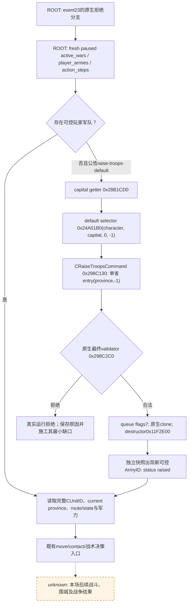
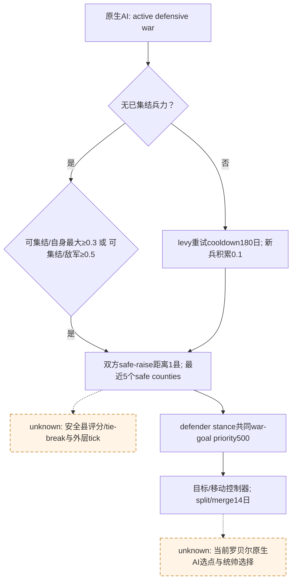

# CK3 1.20.0.3：罗贝尔民粹防御战争的动员入口

2026-10-03 file-only 交付。读取源树 `Z:/g35`，没有 Git、游戏、SDK、MCP、pipe、桌面、Steam、存档或日期操作。当前目标 actor29829 / episode `native-29829-2bc2d599f7f9`，交接暂停帧 raw53236608 / event23。该帧来自协调者交接，不是本工作包的新实机读取；战争分支后的新 WarID、当前 ArmyID 和 revision 必须由 ROOT 的真实读回确定。

用户当日恢复战争研究及运行授权覆盖历史非战争政策；本文保留旧专题当时的限制事实，不把旧限制用于停止当前施工。

## 已有能力与当前最小路径

立即动员无需新源码。现有 core adapter 已提供默认集结、分半、合军与解散军队。完整生成与校验路径在 `ck3_12002_military.cpp`；`.3` factory 先核对实际 `.3` EXE SHA，再复用已冻结证明 unchanged 的 `.2` binding bundle。原生 `.3` 迁移依据见 [Crozier 迁移](crozier-1.20.0.3-native-migration.md)，不是把旧 `.2` 实机外推为 `.3`。

当前 build：CK3 `1.20.0.3` / Steam `25652598`，EXE SHA-256 `94B55397ABB687A3DCD436805A5D885E6BE90FA6C693FEB44A9E3BBEEADE02A6`。本包复用既有 exact-build 冻结，不重新运行 EXE/旧矩阵验收。

ROOT 在自然事件的拒绝分支实际产生战争后，先读取暂停快照、当前 capabilities 与 active_wars。若无可控玩家军队，公告的 `raise-troops-default` 即为现有最小动作；原生 validator 负责当前默认省份的最终合法性。成功后以新完整 CUnit ID 和真实 current province 进入军力、路线与战术观察，不能按旧省份/旧 ArmyID继续。

没有额外默认集结点列表/创建/移动/删除、`raise-local` 或任命统帅的已注册 API。它们不构成当前默认集结路径的前提；若本场真实 outcome 证明默认点不可用，或缺少统帅输入妨碍决策，再沿真实故障补对应只读入口与动作，不为完整 AI parity预先阻塞这次动员。

## 原生 AI 动员输入

当前原版来源为 **Steam 安装树** `Z:/SteamLibrary/steamapps/common/Crusader Kings III/game`，由并行原生树工作包冻结到外部 `war-native-readiness/tree/INPUTS.json`。`common/defines/ai/00_ai.txt` SHA-256 `3AF5D4100789BAD56570E05C5852F35783605813957DE7A5129D23142A116120`。仓库参考树 `Z:/ck3_mod_rewrite/Crusader Kings III/game` 的同名文件为旧 `C78F...0293`，本包 `stock-source-audit.json` 明确标为历史参考，不能作为当前 `.3` stock证据。

当前安装原文与既有 [主防守响应树](primary-defensive-war-response.md) 的相关参数语义一致：无已集结军时，原生 AI要求待集结兵力达到自身最大兵力0.3，或敌兵力0.5；已有军后的levy重试cooldown180日，新增兵力积累比例0.1。安全集结搜索双方均为1县；按到war goal距离取最近5个safe counties。stance30日、split/merge14日、target7日；lopsided比例不高于0.33时target14日。

这些是原生 AI输入，不是本包强加给玩家typed默认集结的额外门。安全县完整评分、tie-break、AI动员tick外层调度和主动统帅选择仍未闭合；旧树的虚线unknown保持。三种普通defender stance均以war goal优先级500为共同最高输入；敌默认集结点不是战争目标。

## 真实可调用工具与参数

`R`是刚读取的 public revision；`A/D/S`是当前完整public CUnitID，允许合法0，不能使用低24位槽号代替。下面的参数是模板，不是对当前暂停帧的执行授权回执。

| 用途 | 注册 MCP 与 kwargs | 当前行为/前提 |
|---|---|---|
| 能力公告 | `ck3_get_capabilities()` | 读当前 `action_steps`，勿按静态能力名自行构造当前未公告动作 |
| 暂停观测 | `ck3_take_snapshot(include_native_command_history=false)` | 读取 `active_wars`、`player_armies`、revision；省略完整历史以避免既有长历史复制 |
| 默认集结 | `ck3_raise_troops_default(expected_revision=R)` | native capability `game.command.raise-troops-default`；仅active_wars非空且无可控军时公告；这是单个默认省份动作，不是已实现的多集结点GUI Raise All或Raise Local |
| 分半 | `ck3_execute_step(step="split-army-half-A", expected_revision=R)` | capability `game.command.split-army-half-N`；没有名为`ck3_split_army_half`的工具；可控军+完整generation解析+原生最终validator |
| 合军 | `ck3_execute_step(step="merge-armies-D-with-S", expected_revision=R)` | capability `game.command.merge-armies-N-with-N`；D为保留的destination，S为消失的source；两军同一positive省份、可控且无已知combat/retreat，再走原生validator；没有名为`ck3_merge_armies`的工具 |
| 解散 | `ck3_disband_army(army_id=A, expected_revision=R)` | capability `game.command.disband-army-N`；原生validator；独立快照确认A消失后才status disbanded |
| 真实兵力 | `ck3_query_army_strengths(army_ids=[A], expected_revision=R)` | current/maximum soldiers、regiments与AI base power；base power不能称为胜率 |

普通动员动作属于core adapter，未发现专属private permit或`WAR_CASH/PREWAR`开关依赖。MCP的`--nonwar-only`会令`ck3_plan_turn/ck3_auto_turn`走非战争planner；完整自动战争loop应由ROOT使用当前授权配置解除。显式typed动作直接进入既有执行路径，不依赖新建命名工具。

## 后态与readiness边界

默认集结返回 `war_action={status:"raised", raised_army_ids:[...]}`、`player_armies`、`snapshot_id`和public `revision`。当前实现等待独立快照出现至少一个新可控军队；没有新军即抛真实postcondition失败。`raised`不能代表兵力已经gathered完成、可以立即开战或选出了AI最优集结县。

`player_armies`规范字段为`army_id`、`owner_character_id`、`soldiers`、`current_province_id`、`move_target_province_id`、`move_target_observable`、`controllable`、`source:"native"`；生产可带完整`route_province_ids`及成对`route_read_status/route_source_count`，并带`in_combat`、`retreating`、`army_state`、`army_state_code`等已读状态。`soldiers`或省份null是未读，不填成零；合法public CUnit0与null分别处理。

分半只有原军仍存在且恰好出现一个新可控ID时返回`split_applied`及`sibling_army_id`；否则只返回`split_submitted`。这时ROOT应独立读新帧，不能把queue ACK称为完成。

合军返回`merge_applied`需要新paused snapshot/public/native revisions、destination同owner/省份仍存在、source消失且可控军集合准确减去source；否则只`merge_submitted`。方向不能倒置，也不能按native CArmyID发送public CUnit动作。

[第三期William `.3` 实机](episode03-william-lewes-live-2026-10-03.md)已证明四次来源1/2/3/4合入目标0、后续完整ID16777220增援和再合军；全部117 private选项OFF。该episode证明`.3`合军/军队读取，不证明罗贝尔当前战争，也没有明确证据可把默认集结、分半或解散升级为`.3` production-live。

本包最高状态：动员native路径及callable合同 **static-ready**；合军复用独立William `.3` **production-live primitive**。没有新增Robert live、可控军、日期、战斗、围城、战争终止、保存日、G2或完整loop信用。默认集结、分半、解散的本场实际后态由ROOT下一次必要动作验收；不重跑旧矩阵。

## 后续真实缺口

1. ROOT实际消费event23的战争分支后取得当前WarID、敌军集合、玩家ArmyID和revision。现有入口已足够推进默认动员；无需先完成预战假设roster或全三结果退出条款。
2. 若默认集结无可控军、validator拒绝或实际省份导致不可用，保留失败attempt并补该具体selector/legality读口；完整safe-raise parity仍是质量差距。
3. 集结点CRUD、当地集结/仅MAA变体、额外兵力补集结与统帅候选/任命尚未发布同一MCP。没有当前故障或独立价值证据时不作为本场前置blocker；必要时冻结其原生GUI caller/validator/command并补只读候选、最终合法性及typed动作。

实现和证据采用ROOT统一报告入口；本工作包的progress-fields.json用于合并当天/当周报告，没有并行编辑共享日报或周报。
