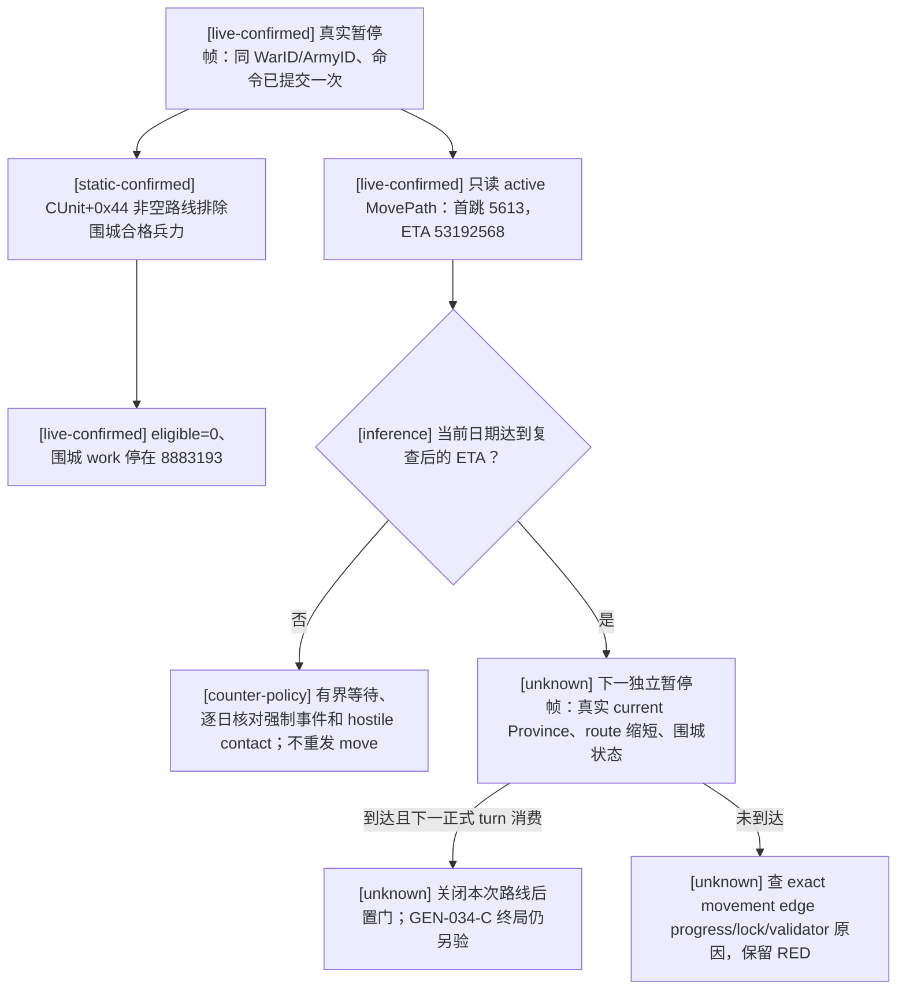

# GEN-034-C：移动中的围城兵力与首跳后置条件

状态：原版门槛已按 exact build 静态闭合，R723 暂停帧已实测；首跳的独立游戏结果仍待核验。本页只解释当前标准封建 claim war 的移动与围城观测，不改变公开能力广告或 G2 要求。

## 冻结版本与证据

- CK3 `1.19.0.6`，`ck3.exe` SHA-256 `2D00FF3101EF70B566F2FCBAE292F09263199C80E9DC8F139B82D7D96F83DB86`；RVA 只对这一 EXE 有效。原版 getter 绑定见 `ck3_autonomous_player/native_bridge/research/ck3_1_19_0_6_anchors.json` 的 `province_eligible_besieging_strength=0x220E580`。
- [static-confirmed] exact EXE `0x220E580` 枚举 Province `+0x748/+0x754` 中的 full-generation CUnitID。对每支有效 CUnit，`0x220E621` 排除 `CUnit+0x170 > 0`，`0x220E62E` 的 `cmp dword ptr [CUnit+0x44], 0; jne 0x220E6E1` 排除非空剩余路线，然后才计入合格围城兵力。`CUnit+0x44` 的含义是 active route row count，见 `ck3_autonomous_player/native_bridge/src/ck3_11906.cpp` 的 `kUnitPathProvinceInfoCountOffset=0x44` 和 `battle_reinforcement_and_join_v1_abi.json`。这个 getter 是原版 `CSiege.GetSiegeMenBalance` 的攻方分子；本方 bridge 仅在暂停帧读取，`0` 是合法零值。
- [live-confirmed] R723 paired `driver-state.json` SHA-256 `0A4DE82DF327E34962EBB31C5AAE9601A320C4193B89A0F34AA4197293493A25`，路径 `Z:\ck3_mod_rewrite_process_assets\g2-gen034-c-r721-cold-20260915\state\native-session\driver-state.json`。command history `#91` 在移动命令前的 `date_raw=53192352`，Province `5604` 有合格围城兵 `196`、Siege work raw `8883193`、`days_left=112`；玩家 ArmyID `50331653` 在 `5604`，尚无移动目标。此前 `#58→#91` 的 work 从 `74200` 增至 `8883193`。
- [live-confirmed] 唯一正式 `move-army-50331653-to-8755` 在 `#98` 被提交，随后 CUnit 存有目标 `8755` 和路线 `[5613,…,8755]`。`#101/#104/#110` 的三个独立一日游戏推进到 `date_raw=53192424`，该军仍在 `5604`，公开状态仍写 `sieging`，旧 SiegeID 仍指向该军；合格围城兵均为 `0`，work 均为 `8883193`，`days_left=null`。它与原版的“非空路线不计入合格围城兵”门槛吻合；`army_state=sieging` 与旧 Siege backlink 不能替代当前合格兵力。
- [live-confirmed] paused `route_contact_horizon_v1` 的 `#100/#103/#109/#112` 都读取已提交的 active MovePath，而不是重算另一条 A* 路线。首跳 `5613` 的 `arrival_date_raws[0]=53192568` 四次稳定；后续目标仍为 `8755`，每次一日窗口 `one_day_contact_free=true`。从命令日 `53192352` 到首跳预计为 9 游戏日；R723 只走到第 3 日，距离预测首跳仍有 6 日。路线日期是当前原生预测，不是已发生的行军结果；恢复后的首帧必须重查。

## 决策与尚待核验的后置条件

正式策略可利用已发布、版本化的只读 `route_contact_horizon_v1` 查询，在同一暂停 revision 比较当前日期与 **重新读取**的首跳 ETA，随后用正式 `native-auto-run` 有界继续。当前证据不支持再发一次 `move-army`，也不支持把 ACK、非空路线或 `army_state=sieging` 当作实际到达。若自然事件、强制 pending 或 hostile contact 中断，保留实际 RED，按生产合同处理；不能为了日期越过它们。

到达预计 `53192568` 后，需要下一独立 paused snapshot 证明 ArmyID `50331653` 的 `current_province_id` 变为 `5613` 或其它解释得通的真实位置、remaining route 正确更新，并让下一正式策略 turn 消费这个结果。若日期达到 ETA 而仍不动，才研究最小 exact-build movement edge progress/lock 原因。当前 R723 的三日原地现象不足以证明 B1 行军卡死，GEN-034-C 的战争终局、truce/war disappearance/cold restore 与 GEN-034-D authored prewar army capture 均未因本页闭合；权威 G2 仍为 `1/8`。
