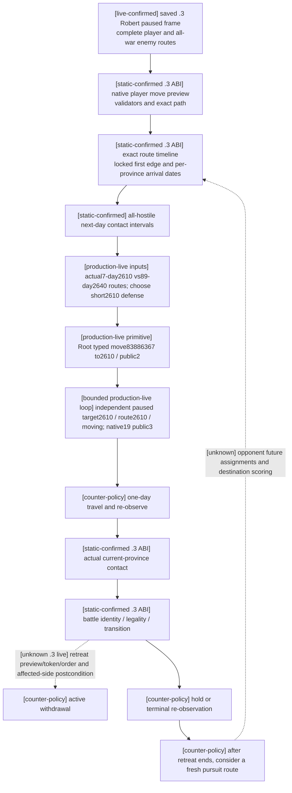

# CK3 1.20.0.3: Robert movement, interception and withdrawal readiness

2026-10-03 file-only lane. Exact build is CK3 1.20.0.3 / Steam 25652598,
EXE SHA-256 `94B55397ABB687A3DCD436805A5D885E6BE90FA6C693FEB44A9E3BBEEADE02A6`.
ROOT owns game, SDK, pipe, source adoption and Git. This lane reads existing
source and frozen actual responses; it does not access a process, move an army,
advance time or change a shared source file. The user's latest war authorization
supersedes historical nonwar restrictions; this page records capability evidence,
not a separate authorization gate.

## Exact-build native inputs before counter-policy

The [.3 reuse ledger](../../ck3_autonomous_player/native_bridge/research/ck3_1_20_0_3_abi_reuse.json)
pins the `.2` routes, army, military and battle manifests. The [.3 migration](crozier-1.20.0.3-native-migration.md)
records unchanged bytes/signatures and the explicit `.3` descriptor -> reviewed
`.2` ABI selection. This is current-build static evidence, not new `.3` battle
live evidence. Existing [route migration](ck3-1.20.0.2-routes-migration.md) and
[battle migration](ck3-1.20.0.2-battle-migration.md) retain their original dates and
versions. Old AI scoring/retreat-policy addresses in [army-controller](army-controller.md)
and [battle-controller](battle-controller.md) are not relabeled as newly verified
`.3` AI choice/cadence/destination ranking.

| Native path | Current implementation and meaning | Evidence boundary |
| --- | --- | --- |
| Complete route read | CUnit `+0x38/+0x40/+0x44`, full UnitID/Province resolution, exact ordered route and target | `ck3_12002_army.cpp:69`, `.3` actual Robert paused frame; empty route has `complete_empty/count0`, inbound route `complete_nonempty/count22` |
| Player path preview | Native character, army and move validators, move mode, effective locked-edge origin, temporary native path construction/destruction | `ck3_12002_military.cpp:307`; path/legality only, DTO has no ETA |
| Native route timing | Land `0x24AA940`, sea `0x24AAC00`, current edge `0x24AB5C0`, travel duration `0x24AADA0`, progress `0x24AB2F0`, lock threshold `0x5C699E8` | `ck3_12002_routes.cpp:1718`; per-province `arrival_date_raws`, not hop-count travel estimates |
| Committed route | Existing destination uses stored MovePath, not a fresh equal-cost A* result; re-route keeps already locked first edge | `ck3_12002_routes.cpp:683`; current progress and target must be queried again after each actual step |
| Interception geometry | Every nonretreating hostile from all active wars, same-province occupancy and opposite-edge intervals | `ck3_12002_routes.cpp:903`; `one_day_contact_free` covers raw-date `[date,date+24]`, not whole-route safety or a predicted battle outcome |
| Actual contact | Current province only; native compatible-combat scan, stored participant order and attack/defense polarity | `query-actual-contact-scope-v1`; future target rejected with `subject_not_at_target` |
| Active withdrawal | Native disallow flag, elapsed-date gate, phase gate, landless rule; full-side vs owner-subset affected order | `ck3_12002_battle.cpp:292`; legality uses actual baseline and loaded limit, not `phase_day==15` |
| After battle | Independent prior-CombatID transition and terminal query identify pursuit, retained combat/backlinks and later retreat route | `.2` full-side/owner-subset live history; no new `.3` retreat/order fixture claimed here |

## Saved Robert frame and useful candidates

Actual v34 packet `runtime-preparation/v34/actual-paused-v34-01/013-ck3_take_snapshot.json`
binds actor29829, episode `native-29829-2bc2d599f7f9`, raw53236608,
public revision2/native3, paused/map-ready. Event23 is still unselected. It
already contains two defensive wars; it does not prove the event-created
populist war has begun. ROOT must replace this input projection after selecting
the demand response or any new frame/army/war change.

| Observed army | Location / route | Immediate meaning |
| --- | --- | --- |
| Player83886367 | Idle regular2614; complete empty route, no combat/retreat | Current controllable movement subject |
| Enemy50331920 and83886484 | Both sieging2640; complete empty routes | Both must be included in a relief encounter, not one seed only |
| Enemy67109295 | Moving3078 ->2640, complete22-province route | Inbound reinforcement/interception candidate; exact ETA has not been read |
| Enemy16777683 | Gathering4573, complete empty route | Independent second-war force; remains in full-hostile route scope |

War16777231: primary defender Robert, opponent30097, objective2610, score-39,
default opponent rally2609. War129: primary defender Robert, opponent32750,
objective2640, score0, default opponent rally4562. Current native objective2640
shows enemy Siege318767158, strength1664, fort7, garrison1350, work44.133%
and displayed days-left218. This is a currently threatened objective. The siege
belongs to the first war's armies even though the province is the second war's
objective; strategy must consume the complete cross-war state.

The completed ROOT batch `war-native-readiness/actual-paused-war-v34-01/014-ck3_query_army_strengths.json`
provides same-date available current strength: player2334; two sieging enemies
1362+302=1664; inbound101; gathering2305. It is reused, not re-queried by this
lane. These values support comparing relief2640 with defense2610; they do not
establish win probability. The batch's strategic-power query RED is independent
of these successful route/army observations and does not require a new movement
provider.

Minimal counter-policy inference: preview/timeline2640 first because an actual
enemy siege is visible; compare2610 to preserve the existing threatened war
objective. Read actual encounter inputs before contact. Interception of67109295
needs both sides' native arrival timelines and a fresh endpoint; the22-hop path
does not establish a travel date. Rally2609/4562 and enemy locations3078/4573
are already candidate endpoints in source expansion, but a distant march gains
no preference just because it is advertised. Regroup uses a fresh native
campaign-capital result and an advertised preview; capital/adjacency is not
guessed from2614.

Pursuit means two different observable stages: the combat pursuit phase is
controlled by the battle transition; chasing a surviving enemy after battle is
a new army route decision. Retreating enemies are excluded from hostile-contact
scope by native semantics. Do not treat their displayed route as a currently
interceptable regular army. Re-read after retreat ends before a chase order.

## Minimum registered MCP surface

No private native compile flag or MCP private permit is required for ordinary
movement, route/contact, battle control or the composed retreat tools. They are
in the production adapter's base capability list (`ck3_12002_adapter.cpp:43`)
and unconditional MCP registration. `WAR_CASH/PREWAR` are independent optional
observation providers; they are not movement enable switches.

- `ck3_take_snapshot(include_native_command_history=false)` and `ck3_get_capabilities()`:
  current frame and actually published `action_steps`.
- `ck3_execute_step(step="preview-move-army-83886367-to-2640", expected_revision=<latest public>)`:
  temporary route preview, provided the exact literal is published.
- `ck3_execute_step(step="query-route-contact-horizon-v1-83886367-to-2640-h-4-16777683-50331920-67109295-83886484", expected_revision=<latest public>)`:
  subject route, all four hostile timelines and next-day contact intervals.
- `ck3_move_army(army_id=83886367, target_province_id=2640, expected_revision=<latest public>)`:
  typed eventual action; requires current published literal and independent paused
  target/route postcondition. This page does not select or submit it.
- At actual current province: `ck3_query_actual_contact_scope(subject_army_id, target_province_id=<current>, expected_revision)`;
  then `ck3_query_battle_control_snapshot_v1(subject_army_id, expected_revision)`.
- Withdrawal: `ck3_preview_active_combat_retreat_v1(selected_public_cunit_id, target_province_id, expected_revision)`;
  `ck3_order_active_combat_retreat_v1` additionally receives the exact preview's
  `expected_combat_id`, `expected_side_index`, `expected_scope`, target and
  `candidate_token`. Follow with independent route, affected-side and prior-C
  observations. Historical day15/old token/old route are not action inputs.

There is no named `ck3_preview_move_army` or `ck3_query_route_contact_horizon`
tool in current registration; use `ck3_execute_step` for these literals. Do not
pass `unit_id`, `province_id` or native CArmyID as typed move kwargs. Public
CUnitID allows valid0; ProvinceID remains positive. `nonwar_only=true` selects
the nonwar planner in `ck3_plan_turn/ck3_auto_turn`; ROOT removes the old runtime
`--nonwar-only` option for authorized generic war planning, without changing
historical evidence.

## Readiness and delivery

The third episode's [.3 live proof](episode03-william-lewes-live-2026-10-03.md)
already demonstrates ordinary move, merge, sea route and completion using
William33388, War1 and a different DLL. It establishes `.3` movement primitive
value, not this Robert action or generic interception/retreat loop. Current
Robert complete route observation is production-live primitive/read-only.
Current route ETA/contact result and Robert route order remain pending; `.3`
active withdrawal and postbattle chase remain unverified live here.

No new native/Python gameplay implementation is necessary before the first
actual route query: the required observations already exist. If that current
query exposes a real unavailable field or failure, preserve the response and
extend the corresponding existing provider using this exact ABI input ledger.
Do not add a speculative horizon/score/provider gate before observing it.

External lane packet: `Z:/ck3_mod_rewrite_process_assets/g2-resume-20261003/war-movement/`.
It contains `OBSERVED-INPUTS.json`, `PAUSED-MOVEMENT-READONLY-CALLS.json`,
`SOURCE-REGISTRATION-AUDIT.json`, this projection, report fields and ROOT delivery.
One file-only registration/signature and saved-frame extraction PASS was run;
old tests and full DLL builds were not repeated. `open_kaishek` is not applicable
to PE/native route timing or MCP signature extraction. ROOT integrates this
topic and its report fields into current daily/weekly evidence and commits/pushes.

## 2026-10-03: actual post-refusal route inputs before the later order

Root's GREEN `war-movement/actual-post-refusal-v34-01` binds paused `native:11`, public2/native11/connection6, actor29829, original episode and DateRaw53236608. The earlier event23-unselected/two-war/four-hostile frame is historical: actual refusal added populist War50331736, and all seven hostile full IDs are now `473,474,16777683,50331920,67109295,83886484,251658381`.

Native preview to2610 is `[2610]`, one leg/7 days/arrival53236776;2640 is11 legs/89 days/arrival53238744, final entry2634. Incoming67109295 reaches2640 in203 days on its frozen route. Both all-seven-hostile horizons returned contact-free only for `[53236608,53236632]`, one day. These captured queries committed no move and prove no full-route safety. The later completed order below supersedes the earlier pending Robert-order claim.

Capture save4665 is90957945 bytes/SHA`7575339ff6cb301b6b00e73e76275803f75c56589570af4132fedb167da8394e`. The later observed working checkpoint4667 has distinct SHA`49e0d1528095bbbeeb9962b7d2ea8d0f420337c2a47605130ab8e46fb849e730`; `war-movement/FINAL-FRAME-NORMAL-PAIR.json` preserves both identities. Do not merge them with the later move checkpoint4671. Full route/finance/siege inputs and source pins are summarized in [the actual topic](robert-post-refusal-military-actual-2026-10-03.md).

## 2026-10-03：Robert 实际暂停移动订单与独立后置验证

Root 已完成 `battle-move-execution/actual-move-2610-v34-01`（GREEN）。这是同一原普通 campaign 的真实移动订单闭环，更新本页先前的“Robert route order pending”状态。绑定仍为 CK3 1.20.0.3 / Steam 25652598、EXE SHA-256 `94B55397ABB687A3DCD436805A5D885E6BE90FA6C693FEB44A9E3BBEEADE02A6`，actual source/native `5b2030b09041dbfcea11104e15d155a3b9aac1d6`、PID 119724、Robert 29829、episode `native-29829-2bc2d599f7f9`。全部操作维持暂停，DateRaw 53236608 不变，未推进任何游戏日。

决策输入已先落盘到本页的原生路径合同，以及 [army target triage](army-target-triage-1.20.0.3.md) 和 [relief/siege](war-relief-siege-native-ai-12003.md) 原生树。实际 route/contact 输入见 `war-movement/actual-post-refusal-v34-01/014-ck3_execute_step.json` 和 `016-ck3_execute_step.json`：2614→2610 的完整路线 `[2610]`，到达 DateRaw 53236776；完整 all-war 敌军集合的下一日无 contact，实际 horizon 仅覆盖 53236608→53236632。2640 的实际路线则为 11 跳，到达 DateRaw 53238744。该处 Combat 1577058305 是起义军 `[251658381,473,474]` 对原有敌军 `[50331920,83886484]`，Robert 不在双方；不能据此假定 Robert 将加入哪一方。Root 选择短途 2610 防守/调位策略，尚未完成未来 contact、抵达或战斗预测质量的闭环。

| 实际步骤 | 可复核产物与结果 |
| --- | --- |
| 新鲜 action 前帧 | `003-ck3_take_snapshot.json`：native 18 / public 2，暂停/map-ready，Robert CUnit 83886367 位于 2614、regular/code1，目标为空、完整空路线，未参战/撤退 |
| 唯一 movement action | `004-ck3_move_army.json`：注册的 `ck3_move_army(army_id=83886367,target_province_id=2610,expected_revision=2)`，`accepted=true,status=submitted`，driver 的 `war_action.status=moving` |
| 独立 action 后帧 | `005-ck3_take_snapshot.json`：native 19 / public 3 / connection 10，仍为同 episode/date、暂停/map-ready；CUnit 83886367 仍在 2614、可控、`move_target_observable=true`、目标 2610、完整路线 `[2610]`、moving/code7，未参战/撤退 |
| 正常 checkpoint | `006-ck3_save_checkpoint.json`：保存成功，history index 4671，90,957,973 bytes，SHA-256 `40add3f7523facab37706478202e3c48a70896a66e5ef2b5e455fa12828a2ee9`；三个 WarID `[16777231,50331736,129]` 保留，无恢复/回退 |

实际 `native_revision 18→19`、公开 revision 2→3 与独立的目标/路线/状态变化证明订单已在原 campaign 生效。Readiness 可记为 **production-live loop，仅限“观察 → 原生树输入下的短程调位决策 → movement order → 独立暂停路线验证”**；其运行时 `.3` movement primitive 已实测。当前位置仍是 2614，因此不能记成“已抵达 2610”、围城/战斗闭环或战争胜利。额外 gameplay day 为 0，累计天数、代际进度与自然继承计数不因这次移动订单增加。

下一步由 Root 从正常结束的最新存档/历史对继续，先重新挂接原 Sway 四类 recorder，再在新的实际帧重读 all-war route/contact，并按一天粒度推进与复核。原生 AI 完整分数/未来 assignment/接敌质量差距继续记在专题及 blocker ledger；不把它们扩成新的战争授权限制。此 worker 只消费已经完成的 Root 文件，没有另开 SDK、重发移动、重复 query、抢焦点或修改 Git。

### v43 首都2640反围城单次移动已真实下达（0日）

Root独占SDK54091，existing `ck3_move_army(83886367,2640,expected_revision=2)` 实际GREEN，仅一次移动；独立009暂停快照 `native:8` / public3 / native8 / raw53240136 确认军队仍在2604、moving7、目标2640可观察，完整13跳路线 `[2605,8757,2615,2616,8754,2613,8752,2628,2626,2627,2633,2634,2640]`，实际无战斗/无退却。008专用fresh strength为2248/2461；不能从地图soldiers=null求兵数。

独立009同帧目标2640在war50331736和129均实际可观察，`is_occupied=false`，同一敌FullSiege318767158（public CUnit473、player=false）仍存在；fort7/garrison1350/besieging_strength2534/progress70337（Q100000，70.337%）/原生ETA106/breach2/CanStartfalse。两war只映射一个siege，不能重复计数。该事实不代表解除敌方围城。

010正常checkpoint h5384 / raw53240136 / 91503841B / SHA `f228391541ec3f34d43906e390394bf656e809816149a6b72d53c0f69c98539d`。本包0小时、0日，累计3992/36524、恢复839、Oct3已保存744日不变。当前只闭合production-live primitive的路线下达与独立读回，尚未抵达、实际接战或解围。后续复用显式单日retained SDK transit；实际player in_combat时保存真实后态并交战斗负责人，arrival与fresh enemy active_siege解除分别观察。

冻结artifact：`Z:\ck3_mod_rewrite_process_assets\g2-resume-20261003\runtime-preparation\v43\actual-relief-move-2640-v43-01\result.json`；报告字段：`Z:\ck3_mod_rewrite_process_assets\g2-resume-20261003\military-ooda-continuation\relief-v43\actual-move-consumption\ROOT-DAY-WEEK-FIELDS.json`。此前first44/43 RED、独立recovery h5222，以及second31天收复2604均保留原证据。

本次实际移动使用 v43 / R21 / PID 14124 的已冷恢复运行时，编译源码为 `Z:/g45` / source prefix `8e2`；本专题的 g38 文档前像与随后 Root 修复提交 不替代该编译绑定。实际正常关闭的 SDK 54091 与独立 afterframe、正常存档共同证明 有限派遣及路线读回；命令 ACK 本身不授予抵达、接战或解围成果。

独立009同帧目标2640在war50331736和129均实际可观察，`is_occupied=false`，同一敌FullSiege318767158（public CUnit473、player=false）仍存在；fort7/garrison1350/besieging_strength2534/progress70337（Q100000，70.337%）/原生ETA106/breach2/CanStartfalse。两war只映射一个siege，不能重复计数。该事实不代表解除敌方围城。
