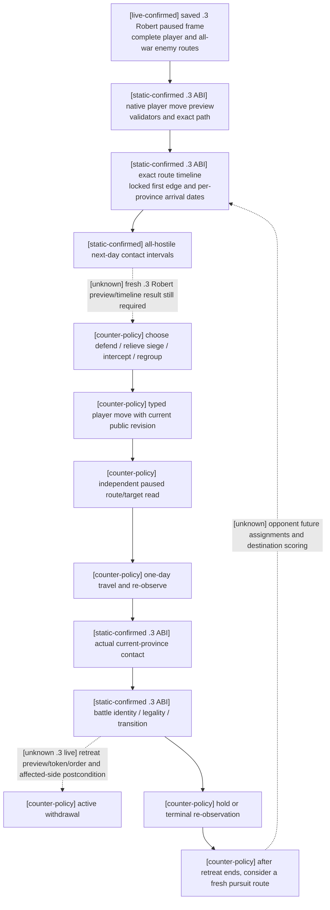

# CK3 1.20.0.3: Robert movement, interception and withdrawal readiness

2026-10-03 file-only lane. Exact build is CK3 1.20.0.3 / Steam 25652598,
EXE SHA-256 `94B55397ABB687A3DCD436805A5D885E6BE90FA6C693FEB44A9E3BBEEADE02A6`.
ROOT owns game, SDK, pipe, source adoption and Git. This lane reads existing
source and frozen actual responses; it does not access a process, move an army,
advance time or change a shared source file. The user's latest war authorization
supersedes historical nonwar restrictions; this page records capability evidence,
not a separate authorization gate.

## Exact-build native inputs before counter-policy

The [.3 reuse ledger](../../ck3_autonomous_player/native_bridge/research/ck3_1_20_0_3_abi_reuse.json)
pins the `.2` routes, army, military and battle manifests. The [.3 migration](crozier-1.20.0.3-native-migration.md)
records unchanged bytes/signatures and the explicit `.3` descriptor -> reviewed
`.2` ABI selection. This is current-build static evidence, not new `.3` battle
live evidence. Existing [route migration](ck3-1.20.0.2-routes-migration.md) and
[battle migration](ck3-1.20.0.2-battle-migration.md) retain their original dates and
versions. Old AI scoring/retreat-policy addresses in [army-controller](army-controller.md)
and [battle-controller](battle-controller.md) are not relabeled as newly verified
`.3` AI choice/cadence/destination ranking.

| Native path | Current implementation and meaning | Evidence boundary |
| --- | --- | --- |
| Complete route read | CUnit `+0x38/+0x40/+0x44`, full UnitID/Province resolution, exact ordered route and target | `ck3_12002_army.cpp:69`, `.3` actual Robert paused frame; empty route has `complete_empty/count0`, inbound route `complete_nonempty/count22` |
| Player path preview | Native character, army and move validators, move mode, effective locked-edge origin, temporary native path construction/destruction | `ck3_12002_military.cpp:307`; path/legality only, DTO has no ETA |
| Native route timing | Land `0x24AA940`, sea `0x24AAC00`, current edge `0x24AB5C0`, travel duration `0x24AADA0`, progress `0x24AB2F0`, lock threshold `0x5C699E8` | `ck3_12002_routes.cpp:1718`; per-province `arrival_date_raws`, not hop-count travel estimates |
| Committed route | Existing destination uses stored MovePath, not a fresh equal-cost A* result; re-route keeps already locked first edge | `ck3_12002_routes.cpp:683`; current progress and target must be queried again after each actual step |
| Interception geometry | Every nonretreating hostile from all active wars, same-province occupancy and opposite-edge intervals | `ck3_12002_routes.cpp:903`; `one_day_contact_free` covers raw-date `[date,date+24]`, not whole-route safety or a predicted battle outcome |
| Actual contact | Current province only; native compatible-combat scan, stored participant order and attack/defense polarity | `query-actual-contact-scope-v1`; future target rejected with `subject_not_at_target` |
| Active withdrawal | Native disallow flag, elapsed-date gate, phase gate, landless rule; full-side vs owner-subset affected order | `ck3_12002_battle.cpp:292`; legality uses actual baseline and loaded limit, not `phase_day==15` |
| After battle | Independent prior-CombatID transition and terminal query identify pursuit, retained combat/backlinks and later retreat route | `.2` full-side/owner-subset live history; no new `.3` retreat/order fixture claimed here |

## Saved Robert frame and useful candidates

Actual v34 packet `runtime-preparation/v34/actual-paused-v34-01/013-ck3_take_snapshot.json`
binds actor29829, episode `native-29829-2bc2d599f7f9`, raw53236608,
public revision2/native3, paused/map-ready. Event23 is still unselected. It
already contains two defensive wars; it does not prove the event-created
populist war has begun. ROOT must replace this input projection after selecting
the demand response or any new frame/army/war change.

| Observed army | Location / route | Immediate meaning |
| --- | --- | --- |
| Player83886367 | Idle regular2614; complete empty route, no combat/retreat | Current controllable movement subject |
| Enemy50331920 and83886484 | Both sieging2640; complete empty routes | Both must be included in a relief encounter, not one seed only |
| Enemy67109295 | Moving3078 ->2640, complete22-province route | Inbound reinforcement/interception candidate; exact ETA has not been read |
| Enemy16777683 | Gathering4573, complete empty route | Independent second-war force; remains in full-hostile route scope |

War16777231: primary defender Robert, opponent30097, objective2610, score-39,
default opponent rally2609. War129: primary defender Robert, opponent32750,
objective2640, score0, default opponent rally4562. Current native objective2640
shows enemy Siege318767158, strength1664, fort7, garrison1350, work44.133%
and displayed days-left218. This is a currently threatened objective. The siege
belongs to the first war's armies even though the province is the second war's
objective; strategy must consume the complete cross-war state.

The completed ROOT batch `war-native-readiness/actual-paused-war-v34-01/014-ck3_query_army_strengths.json`
provides same-date available current strength: player2334; two sieging enemies
1362+302=1664; inbound101; gathering2305. It is reused, not re-queried by this
lane. These values support comparing relief2640 with defense2610; they do not
establish win probability. The batch's strategic-power query RED is independent
of these successful route/army observations and does not require a new movement
provider.

Minimal counter-policy inference: preview/timeline2640 first because an actual
enemy siege is visible; compare2610 to preserve the existing threatened war
objective. Read actual encounter inputs before contact. Interception of67109295
needs both sides' native arrival timelines and a fresh endpoint; the22-hop path
does not establish a travel date. Rally2609/4562 and enemy locations3078/4573
are already candidate endpoints in source expansion, but a distant march gains
no preference just because it is advertised. Regroup uses a fresh native
campaign-capital result and an advertised preview; capital/adjacency is not
guessed from2614.

Pursuit means two different observable stages: the combat pursuit phase is
controlled by the battle transition; chasing a surviving enemy after battle is
a new army route decision. Retreating enemies are excluded from hostile-contact
scope by native semantics. Do not treat their displayed route as a currently
interceptable regular army. Re-read after retreat ends before a chase order.

## Minimum registered MCP surface

No private native compile flag or MCP private permit is required for ordinary
movement, route/contact, battle control or the composed retreat tools. They are
in the production adapter's base capability list (`ck3_12002_adapter.cpp:43`)
and unconditional MCP registration. `WAR_CASH/PREWAR` are independent optional
observation providers; they are not movement enable switches.

- `ck3_take_snapshot(include_native_command_history=false)` and `ck3_get_capabilities()`:
  current frame and actually published `action_steps`.
- `ck3_execute_step(step="preview-move-army-83886367-to-2640", expected_revision=<latest public>)`:
  temporary route preview, provided the exact literal is published.
- `ck3_execute_step(step="query-route-contact-horizon-v1-83886367-to-2640-h-4-16777683-50331920-67109295-83886484", expected_revision=<latest public>)`:
  subject route, all four hostile timelines and next-day contact intervals.
- `ck3_move_army(army_id=83886367, target_province_id=2640, expected_revision=<latest public>)`:
  typed eventual action; requires current published literal and independent paused
  target/route postcondition. This page does not select or submit it.
- At actual current province: `ck3_query_actual_contact_scope(subject_army_id, target_province_id=<current>, expected_revision)`;
  then `ck3_query_battle_control_snapshot_v1(subject_army_id, expected_revision)`.
- Withdrawal: `ck3_preview_active_combat_retreat_v1(selected_public_cunit_id, target_province_id, expected_revision)`;
  `ck3_order_active_combat_retreat_v1` additionally receives the exact preview's
  `expected_combat_id`, `expected_side_index`, `expected_scope`, target and
  `candidate_token`. Follow with independent route, affected-side and prior-C
  observations. Historical day15/old token/old route are not action inputs.

There is no named `ck3_preview_move_army` or `ck3_query_route_contact_horizon`
tool in current registration; use `ck3_execute_step` for these literals. Do not
pass `unit_id`, `province_id` or native CArmyID as typed move kwargs. Public
CUnitID allows valid0; ProvinceID remains positive. `nonwar_only=true` selects
the nonwar planner in `ck3_plan_turn/ck3_auto_turn`; ROOT removes the old runtime
`--nonwar-only` option for authorized generic war planning, without changing
historical evidence.

## Readiness and delivery

The third episode's [.3 live proof](episode03-william-lewes-live-2026-10-03.md)
already demonstrates ordinary move, merge, sea route and completion using
William33388, War1 and a different DLL. It establishes `.3` movement primitive
value, not this Robert action or generic interception/retreat loop. Current
Robert complete route observation is production-live primitive/read-only.
Current route ETA/contact result and Robert route order remain pending; `.3`
active withdrawal and postbattle chase remain unverified live here.

No new native/Python gameplay implementation is necessary before the first
actual route query: the required observations already exist. If that current
query exposes a real unavailable field or failure, preserve the response and
extend the corresponding existing provider using this exact ABI input ledger.
Do not add a speculative horizon/score/provider gate before observing it.

External lane packet: `Z:/ck3_mod_rewrite_process_assets/g2-resume-20261003/war-movement/`.
It contains `OBSERVED-INPUTS.json`, `PAUSED-MOVEMENT-READONLY-CALLS.json`,
`SOURCE-REGISTRATION-AUDIT.json`, this projection, report fields and ROOT delivery.
One file-only registration/signature and saved-frame extraction PASS was run;
old tests and full DLL builds were not repeated. `open_kaishek` is not applicable
to PE/native route timing or MCP signature extraction. ROOT integrates this
topic and its report fields into current daily/weekly evidence and commits/pushes.
