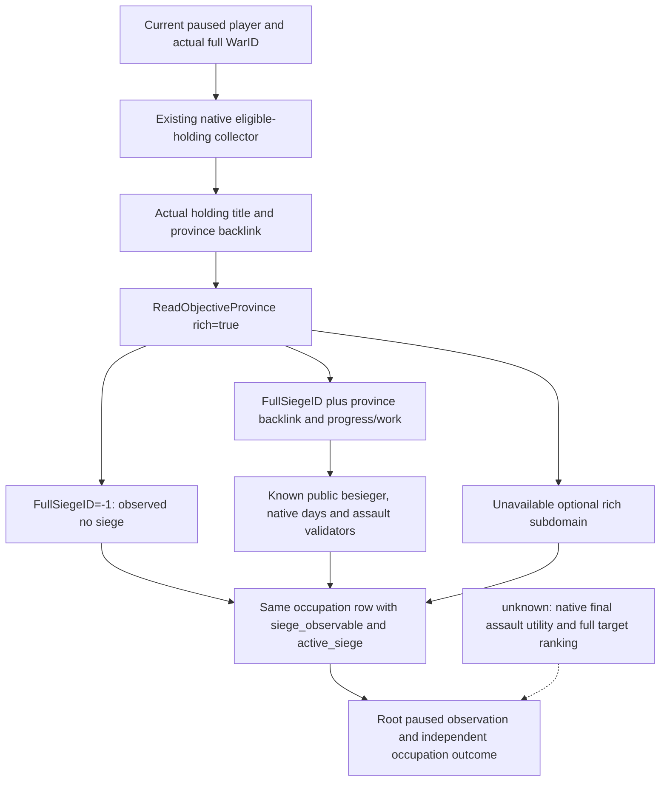

# Occupied-holding actual siege observation on CK3 1.20.0.3

2026-10-03. Exact CK3 **1.20.0.3 Crozier**, Steam build **25652598**, EXE SHA **94B55397ABB687A3DCD436805A5D885E6BE90FA6C693FEB44A9E3BBEEADE02A6**. Implementation baseline **g40 / 0ad923525ef899b836a823dfe983db49030789f2**. The ordinary Robert 29829 campaign remains the only actual entry. Warfare authorization is fully open.

## Actual milestone and necessary observation

Root's real route batch reached province **2604** with public CUnit **83886367**, current province2604, `army_state=sieging`/code3, observable complete-empty route and no combat/retreat. This extends the finite occupation-target selection → native route preview → one movement → saved daily progression loop through arrival and automatic siege start. It does not prove recovery or a completed war loop.

The separate old-v38 postarrival occupation query confirms **War16777231 / holding2400 / province2604 / legal holder33435 / occupying character30097 / fort3 / garrison400 / counted opponent occupation=true**. Native defender occupied count remains **17**. The independent snapshot still reports sieging3 while army siege days/holder/subrealm are all null. Current saved baseline is DateRaw **53237136**, normal checkpoint **h4821**, SHA **19007da8127bf8cda28bea484021fad116e1082a67d15e7c5927c7d6c546c08f**, size **90945405 B**, total **3867** days / resume **714** / today **619**. The earlier arrival h4819/SHA21273b864f1f6533fbf8c6fa8203de25925835026547bf6c0c7b7fe1676154f2 remains historical evidence.

Those actual null fields prevent reading this siege's FullSiegeID, remaining work/days and native assault eligibility. The existing objective projection covers the original war goals2610/2640 rather than this actual occupied destination. Inventory found no advertised `.3` arbitrary-province siege MCP: a historical `query-province-local-siege-v1` parser is not a published adapter capability. Existing start/stop assault MCP tools require an already observed full SiegeID. This is a production observation gap with a concrete next entry.

## Frozen tree and reused exact reader

The pre-existing [siege progress tree](episode03-siege-progress-1.20.0.3.md), [assault tree](episode03-assault-1.20.0.3.md) and [relief/siege tree](war-relief-siege-native-ai-12003.md) already close the necessary exact-build reading path. This package reuses `ck3_12002::ReadObjectiveProvince` (`ck3_12002_province.cpp:126`) with the actual holding's province and `rich=true` on the existing owning-thread paused query. It adds no siege algorithm or ABI replacement.

| Existing source/getter | Exact .3 entry |
| --- | --- |
| Province active FullSiegeID / absent sentinel | province+0x788 / -1 |
| Full generation siege storage / province backlink | slot RVA0x5D1EC88 / siege+0x200 |
| Fort / garrison / besieging strength | RVA0x247AB90 / 0x247F370 / 0x247F1D0 |
| Progress / total work / days | RVA0x251C9C0 / 0x251DD20 / 0x251CB00 |
| Current work / internal CArmy | siege+0x3D0 / siege+0x208 |
| Breach / assault running flag | siege+0x3D8 / siege+0x44C |
| Assault daily work / casualties | RVA0x25207F0 / 0x25205C0 |
| Native CanStart / CanStop validators | RVA0x29738C0 / 0x2973A70 |

The paused snapshot's player, allied and enemy armies are joined by full public CUnit ID with duplicates removed; player entries are kept first so controllability is preserved. `ReadObjectiveProvince` maps the current siege's internal CArmy to those known public units. An unmatched besieger remains null. The existing holding-title/full-province backlink and occupation collector retain their original semantics.



No new counter-policy is inferred from code3, force sizes or fort level. Work/eligibility is read first; the original native AI utility inputs and outstanding policy quality branches remain in the linked trees. Native permission is an observed action input, not evidence that an assault happened.

## Additive same-MCP projection

Keep schema/version1 and `ck3_query_war_occupation_targets_v1` unchanged. Every existing holding row adds only nullable nonnegative `besieging_strength`, boolean `siege_observable` and nullable `active_siege`. The nested projection is identical to the existing public objective siege shape:

```text
siege_id, besieging_army_id, player_army_besieging,
progress_fraction, current_work, total_work, remaining_work, days_left,
assault_observable, breach_level, walls_breached, assault_in_progress,
can_start_assault, can_stop_assault, assault_daily_progress, assault_daily_casualties
```

Fixed point remains `{raw, scale:100000}`; remaining work is max(0,total-current). True siege_observable plus null active_siege means an actual no-siege sentinel. False/null means this frame could not read the siege or an older output never carried the observation. Negative or INT_MAX days become null while other observed siege values remain available. Legal zeros remain zeros. The complete assault subdomain is observable only with all existing exact getters and validators available; otherwise its values are null. Optional rich failures preserve the genuine occupation rows, order, holding/title/province/holder/occupier/side and native counters.

The native DTO owns a small scalar `WarOccupationActiveSiegeV1`, avoiding a game_contract include cycle. Python imports and reuses existing `war_contract._normalize_active_siege`; no new endpoint, schema, flag, driver, service or platform is introduced.

## Verification and next actual recipe

Four production source paths and two reusable fixture paths are complete. The sole focused new suite passed on its first attempt: **6TU /O2 /DNDEBUG /W4 /WX**, **28 native Check**, **38 Python require**, **3 genuine native JSON / 3 registered MCP** cases. It covers a full player siege and legal zero values/native assault validators, true no-siege versus a stale FullSiegeID, and unavailable days with valid progress retained. Old12 GREEN cases were not rerun. Runtime verifier failures use explicit Check/require and survive disabled assertions.

New observation readiness is **static-ready with a GREEN production-path fixture**. New fields are not production-live until Root loads the combined DLL and reads the actual paused holding. Existing arrival/sieging evidence remains a finite production-live loop milestone. This lane performs zero SDK/window/game actions, zero shared-source/Git writes and advances zero days.

Root's next query stays:

```json
{"tool":"ck3_query_war_occupation_targets_v1","arguments":{"war_id":16777231,"expected_revision":"<fresh public revision from this SDK>"}}
```

Use holding2400/province2604 to read actual FullSiegeID/work/days/assault legality while independently retaining its occupation evidence. Existing `ck3_start_assault` / `ck3_stop_assault` can then consume the observed full SiegeID and their normal native validator; this observer does not issue them. Real recovery requires an actual occupation change, for example row2400 cleared and native opponent occupied17→16, rather than arrival or SiegeID disappearance alone.

## Verifiable external evidence

All paths below are rooted at `Z:/ck3_mod_rewrite_process_assets/g2-resume-20261003`:

- Actual arrival: `military-ooda-continuation/recapture-v38/actual-route-days-batch-2604-01/result.json`; consumed receipt `battle-observation-schedule/recapture-v38-thirteen-day-consumption/ROOT-DELIVERY.json`.
- Actual postarrival occupation: `war-goal-capture-execution/actual-v38-post-arrival-01/004-ck3_query_war_occupation_targets_v1.json`; independent snapshot005 and normal save006 in that same packet.
- New native tree/getter/input pins: `war-goal-capture-execution/actual-v38-01/holding-siege-native/{TOPIC-APPEND.md,SOURCE-PINS.json,ROOT-DELIVERY.json}`.
- Python final contract: `war-goal-capture-execution/siege-observation-python/ROOT-DELIVERY.json`.
- Sole new fixture: `war-goal-capture-execution/production-fixture/siege-expansion/attempt-01/RESULT.json`, SHA **67a2934b57ae4dd2433793eb1acae909a6f8bd775c4457d26c7ca775a87ced69**; registered consumer result in the same attempt.
- Combined source/report and exact raw pins: `war-goal-capture-execution/actual-v38-01/holding-siege-combined/ROOT-DELIVERY.json` and `ACTUAL-POSTARRIVAL-CONSUMPTION.json`.

Index from [war occupation targets](war-occupation-targets-12003.md) and [army target triage](army-target-triage-1.20.0.3.md). Prior native trees, failed preview attempts, ABI and actual arrival values remain historical evidence. Commit/push and final source/DLL/live receipts belong to Root's candidate integration.
