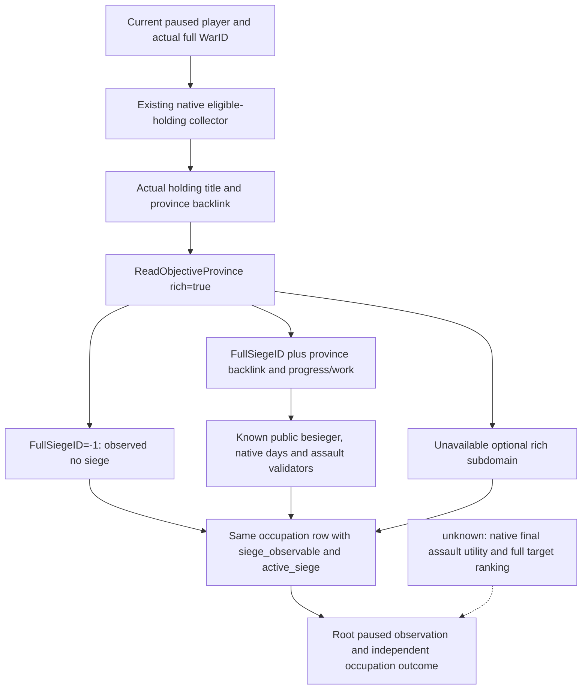

# Occupied-holding actual siege observation on CK3 1.20.0.3

2026-10-03. Exact CK3 **1.20.0.3 Crozier**, Steam build **25652598**, EXE SHA **94B55397ABB687A3DCD436805A5D885E6BE90FA6C693FEB44A9E3BBEEADE02A6**. Historical implementation baseline **g40 / 0ad923525ef899b836a823dfe983db49030789f2**. Current v39 actual observer is a **production-live primitive**, source **fca9daf1aa517ca5a5c185cc2c0736287ad26847 / g41**, DLL SHA **ba650ab1d42aa17d9d2e94f2f3a92db7b644c36a7b9348c6a18e541fe7a4153e**; the initial actual and one saved day below retain separate frames. The ordinary Robert 29829 campaign remains the only actual entry. Warfare authorization is fully open.

## Actual milestone and necessary observation

Root's real route batch reached province **2604** with public CUnit **83886367**, current province2604, `army_state=sieging`/code3, observable complete-empty route and no combat/retreat. This extends the finite occupation-target selection → native route preview → one movement → saved daily progression loop through arrival and automatic siege start. It does not prove recovery or a completed war loop.

The separate old-v38 postarrival occupation query confirms **War16777231 / holding2400 / province2604 / legal holder33435 / occupying character30097 / fort3 / garrison400 / counted opponent occupation=true**. Native defender occupied count remains **17**. The independent snapshot still reports sieging3 while army siege days/holder/subrealm are all null. The historical pre-v39 saved baseline is DateRaw **53237136**, normal checkpoint **h4821**, SHA **19007da8127bf8cda28bea484021fad116e1082a67d15e7c5927c7d6c546c08f**, size **90945405 B**, total **3867** days / resume **714** / today **619**. The earlier arrival h4819/SHA21273b864f1f6533fbf8c6fa8203de25925835026547bf6c0c7b7fe1676154f2 remains historical evidence.

Those actual v38 null fields prevented reading this siege's FullSiegeID, remaining work/days and native assault eligibility; v39 now reads those fields in the same occupation MCP as recorded below. The existing objective projection covers the original war goals2610/2640 rather than this actual occupied destination. Inventory found no advertised `.3` arbitrary-province siege MCP: a historical `query-province-local-siege-v1` parser is not a published adapter capability. Existing start/stop assault MCP tools require an already observed full SiegeID. This was the concrete production observation gap that motivated the following implementation; it is closed by the v39 actual primitive below.

## Frozen tree and reused exact reader

The pre-existing [siege progress tree](episode03-siege-progress-1.20.0.3.md), [assault tree](episode03-assault-1.20.0.3.md) and [relief/siege tree](war-relief-siege-native-ai-12003.md) already close the necessary exact-build reading path. This package reuses `ck3_12002::ReadObjectiveProvince` (`ck3_12002_province.cpp:126`) with the actual holding's province and `rich=true` on the existing owning-thread paused query. It adds no siege algorithm or ABI replacement.

| Existing source/getter | Exact .3 entry |
| --- | --- |
| Province active FullSiegeID / absent sentinel | province+0x788 / -1 |
| Full generation siege storage / province backlink | slot RVA0x5D1EC88 / siege+0x200 |
| Fort / garrison / besieging strength | RVA0x247AB90 / 0x247F370 / 0x247F1D0 |
| Progress / total work / days | RVA0x251C9C0 / 0x251DD20 / 0x251CB00 |
| Current work / internal CArmy | siege+0x3D0 / siege+0x208 |
| Breach / assault running flag | siege+0x3D8 / siege+0x44C |
| Assault daily work / casualties | RVA0x25207F0 / 0x25205C0 |
| Native CanStart / CanStop validators | RVA0x29738C0 / 0x2973A70 |

The paused snapshot's player, allied and enemy armies are joined by full public CUnit ID with duplicates removed; player entries are kept first so controllability is preserved. `ReadObjectiveProvince` maps the current siege's internal CArmy to those known public units. An unmatched besieger remains null. The existing holding-title/full-province backlink and occupation collector retain their original semantics.



No new counter-policy is inferred from code3, force sizes or fort level. Work/eligibility is read first; the original native AI utility inputs and outstanding policy quality branches remain in the linked trees. Native permission is an observed action input, not evidence that an assault happened.

## Additive same-MCP projection

Keep schema/version1 and `ck3_query_war_occupation_targets_v1` unchanged. Every existing holding row adds only nullable nonnegative `besieging_strength`, boolean `siege_observable` and nullable `active_siege`. The nested projection is identical to the existing public objective siege shape:

```text
siege_id, besieging_army_id, player_army_besieging,
progress_fraction, current_work, total_work, remaining_work, days_left,
assault_observable, breach_level, walls_breached, assault_in_progress,
can_start_assault, can_stop_assault, assault_daily_progress, assault_daily_casualties
```

Fixed point remains `{raw, scale:100000}`; remaining work is max(0,total-current). True siege_observable plus null active_siege means an actual no-siege sentinel. False/null means this frame could not read the siege or an older output never carried the observation. Negative or INT_MAX days become null while other observed siege values remain available. Legal zeros remain zeros. The complete assault subdomain is observable only with all existing exact getters and validators available; otherwise its values are null. Optional rich failures preserve the genuine occupation rows, order, holding/title/province/holder/occupier/side and native counters.

The native DTO owns a small scalar `WarOccupationActiveSiegeV1`, avoiding a game_contract include cycle. Python imports and reuses existing `war_contract._normalize_active_siege`; no new endpoint, schema, flag, driver, service or platform is introduced.

## Historical fixture verification and original actual recipe

Four production source paths and two reusable fixture paths are complete. The sole focused new suite passed on its first attempt: **6TU /O2 /DNDEBUG /W4 /WX**, **28 native Check**, **38 Python require**, **3 genuine native JSON / 3 registered MCP** cases. It covers a full player siege and legal zero values/native assault validators, true no-siege versus a stale FullSiegeID, and unavailable days with valid progress retained. Old12 GREEN cases were not rerun. Runtime verifier failures use explicit Check/require and survive disabled assertions.

At this historical implementation stage, observation readiness was **static-ready with a GREEN production-path fixture**. That fixture did not grant production-live status. Root subsequently loaded the v39 combined DLL and actually read the paused holding, which grants the finite primitive documented below. Existing arrival/sieging evidence remains a separate finite production-live loop milestone. The pure-file consumption lane performs zero SDK/window/game actions, zero shared-source/Git writes and advances zero days.

The original actual query recipe, now exercised by Root, stays:

```json
{"tool":"ck3_query_war_occupation_targets_v1","arguments":{"war_id":16777231,"expected_revision":"<fresh public revision from this SDK>"}}
```

Use holding2400/province2604 to read actual FullSiegeID/work/days/assault legality while independently retaining its occupation evidence. Existing `ck3_start_assault` / `ck3_stop_assault` can then consume the observed full SiegeID and their normal native validator; this observer does not issue them. Real recovery requires an actual occupation change, for example row2400 cleared and native opponent occupied17→16, rather than arrival or SiegeID disappearance alone.

## Verifiable external evidence

All paths below are rooted at `Z:/ck3_mod_rewrite_process_assets/g2-resume-20261003`:

- Actual arrival: `military-ooda-continuation/recapture-v38/actual-route-days-batch-2604-01/result.json`; consumed receipt `battle-observation-schedule/recapture-v38-thirteen-day-consumption/ROOT-DELIVERY.json`.
- Actual postarrival occupation: `war-goal-capture-execution/actual-v38-post-arrival-01/004-ck3_query_war_occupation_targets_v1.json`; independent snapshot005 and normal save006 in that same packet.
- New native tree/getter/input pins: `war-goal-capture-execution/actual-v38-01/holding-siege-native/{TOPIC-APPEND.md,SOURCE-PINS.json,ROOT-DELIVERY.json}`.
- Python final contract: `war-goal-capture-execution/siege-observation-python/ROOT-DELIVERY.json`.
- Sole new fixture: `war-goal-capture-execution/production-fixture/siege-expansion/attempt-01/RESULT.json`, SHA **67a2934b57ae4dd2433793eb1acae909a6f8bd775c4457d26c7ca775a87ced69**; registered consumer result in the same attempt.
- Combined source/report and exact raw pins: `war-goal-capture-execution/actual-v38-01/holding-siege-combined/ROOT-DELIVERY.json` and `ACTUAL-POSTARRIVAL-CONSUMPTION.json`.

Index from [war occupation targets](war-occupation-targets-12003.md) and [army target triage](army-target-triage-1.20.0.3.md). Prior native trees, failed preview attempts, ABI and actual arrival values remain historical evidence. Commit/push and final source/DLL/live receipts belong to Root's candidate integration.


## 2026-10-03：v39 首次实际 holding siege primitive

7-path源码 `fca9daf1aa517ca5a5c185cc2c0736287ad26847` 已发布；g41/jobs64构建4 targets、541 TU/538 unique/1041 inputs，71.17104秒。War16777231 同一次 paused query 完整读回35 holding行，date_raw=53237136；Holding2400/Province2604 的FullSiege503316492由玩家Army83886367围攻，strength2334、progress540/100000、work175750/32500000、remaining32324250、native days_left184已实际观测。assault observable=true，breach0，start/stop/in_progress=false，突击preview daily progress/casualties均为合法0。新增围城字段为有限 production-live primitive；35行中2行有active siege，占领/holder/occupier/side/fort/garrison变化均0，defender31/17、attacker4/0，2604仍敌占，未收复。 本lane0新日/0动作；累计3867、resume714、当日619不因证据索引变化。 同一次实机的2份其他owner消费receipt已并入证据索引。 最新normal014/h4824；围城184日是当前原生估计，不保证收复日期。CI37117062048 GREEN，游戏保持minimized=true/foreground=false。

此处 current readiness 为 **production-live primitive**：新增字段已从 Robert 暂停真实 holding 返回，而非仅 DTO/ACK/fixture。首实际 query 解析出同 War16777231 的35条完整行，其中2条存在 active siege；目标2604上玩家围攻的完整 FullSiege 身份、work/remaining/ETA、breach和native assault资格均有真实值。没有新增 schema、MCP、运行开关或动作，完整原生 target rank/assault utility 仍由此前专题维护为质量差距。首字段可用不等于收复或全局循环完成。


### 一次正常围城日推进及独立保存后的 actual 状态

首个请求最多64日的 helper attempt 在 `actual-first-siege-batch-2604-01/day-01/003-ck3_execute_step.json` 的 contact-horizon 步骤实际 RED，advance 未发送，新增0日，正常存档保留 h4827。该失败保留为 harness RED，不能写成64日完成或部分完成若干日。

Root 随后只发送一次实际 day advance。它成功使 raw53237136→53237160；通用 readonly capture 沿用旧 expected-date，因而随后报 harness RED。Root 没有重播这个已成功的 advance，而是用独立新日期读取与正常保存收口：[actual-after-stationary-day-save-2604-01/result.json](Z:/ck3_mod_rewrite_process_assets/g2-resume-20261003/military-ooda-continuation/siege-v39/actual-after-stationary-day-save-2604-01/result.json) GREEN，正常 pair **h4831 / 90,890,887 B / SHA-256 `3f482def35fe0d13c901044ff5c6a5b9eec3b643ef9c6e6774e9a1f42c3415e6`**。累计 **3868日 / resume715 / 2026-10-03增量620**。本纯文件消费增加0日；唯一新增日归属于 Root 的该次实际 advance。

同一 **FullSiege503316492 / player Army83886367 / holding2400 / province2604** 的 fresh 读数为 current_work **351500**、total_work **32500000**、remaining_work **32148500**，scale均 **100000**；progress_fraction **1081/100000**，native days_left **183**。此前首 actual h4824/raw53237136 的 work175750、progress540/100000、ETA184保留为历史当帧值。一日实际工作增量175750并未完成围城；ETA仍是原生当前估计，不承诺收复日期。

breach_level仍0、native CanStartAssault仍false，holding2400仍由敌方30097占领，守方被对側占领的holding仍17。此次没有突击、occupation17→16、收复、围城结束或战争终结；有限围城观测 primitive 加上一日保存后变化，不冒充完整战争 OODA。Robert29829 原普通战役与 exact .3 绑定不变，游戏保持 minimized=true/foreground=false。下一项仍按真实 paused work/ETA、contact 与 occupation输入推进正常围城，后续 batch 和 current 由 Root 独立记账。
