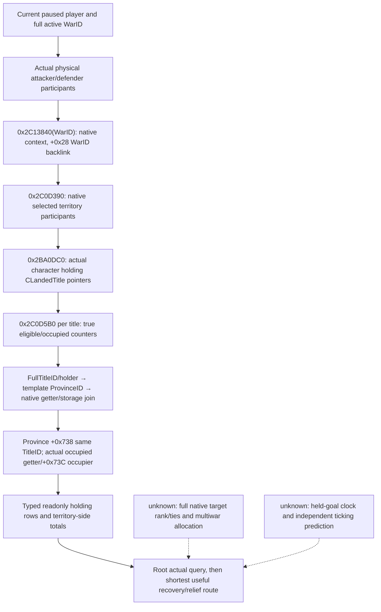

# CK3 1.20.0.3: native occupation targets for Robert's defensive wars

2026-10-03. The typed readonly query `ck3_query_war_occupation_targets_v1(war_id,expected_revision)` now exposes native eligible holdings with exact holding/title/province, legal holder, occupying character and physical war-side identities. Initial implementation was static-ready. The v36 context-unavailable attempts remain historical RED; the v37 paused Robert capture below makes the complete occupation collection a **production-live primitive**. Actual movement to a recovery holding remains a separate capability. The exact build is CK3 1.20.0.3 / Steam25652598, EXE SHA-256 `94B55397ABB687A3DCD436805A5D885E6BE90FA6C693FEB44A9E3BBEEADE02A6`.

## Concrete gameplay dependency

Root's existing paused options for War16777231 report attacker-relative imprisonment0, battles0, occupation110 and ticking-71, yielding Robert's player-relative total-39. Its goal2610 is observably held, unoccupied and without active siege. The first real one-day artifact at raw53236632 preserves that state. Arrival there can establish defensive deployment, not recovery or relief. The existing goal-capital projection cannot name the occupied holdings responsible for occupation110, so automation needs the native occupation collection before selecting a recovery maneuver.

The extension preserves native participant-to-holding order and repeated occurrences, per-side eligible/occupied/candidate counts, and whether an occupier belongs to the opposing war side or is outside this war. A complete empty collection remains available/complete with the native side counters; a read failure clears partial rows/counters and preserves an explicit unavailable reason. It adds no action, flag, CLI permit, executor slot or global decision gate.

## Existing execution and independent results

The original route for CUnit83886367 from2614 to2610 was retained without resending the move. Root's bounded day loop refreshed the route/contact horizon and independently read army/date/paused state; actual day8 at raw53236800 now observes arrival at2610, regular code1 and a complete empty route. The [march timing and arrival topic](army-march-remaining-timeline-12003.md) preserves day6/day7 as moving observations. A fresh stationary decision may use `ck3_query_actual_contact_scope(subject_army_id=83886367,target_province_id=2610,expected_revision=R)` and `ck3_query_battle_control_snapshot_v1(subject_army_id=83886367,expected_revision=R)`. The actual-contact query applies to the army's current province, not a remote preview.

For each current full WarID16777231/129/50331736, `ck3_query_war_termination_options(war_id=W,expected_revision=R)` already reads independent native total and four score components. Use a fresh public revision; the driver maps it to the native admission revision. The four components are attacker-relative, so Robert's defender interpretation negates them. WarID-scoped attribution is essential when multiple wars share physical province2640.

Ordinary siege is a native lifecycle following legal movement/contact. There is no justified siege-start action at currently safe2610. After choosing a genuinely occupied recovery holding, observe the army's actual arrival/contact and independent occupation identity. If a future owned active SiegeID has complete assault inputs and native CanStart=true, existing `ck3_start_assault(siege_id=S,expected_revision=R)` / `ck3_stop_assault(...)` can be followed by same-province/full-SiegeID active-flag readback and a bounded day work/eligible/occupation observation. A queue ACK is not a siege result.

Relief requires separate occupation and siege after-state: disappearing old SiegeID can mean replacement or enemy occupation. Recovery requires an observed clearing/change of the hostile occupying identity. Read the native war scores independently afterwards; concurrent battles and other occupations prevent assigning the entire total delta to one holding. Full native AI final target rank, help coordination and assault utility remain recorded quality differences, not prerequisites for this narrow observation or existing day OODA. If a chosen recovery province lies outside the current objective projection and siege details are needed, the next narrow entry is the existing exact-bound `ReadObjectiveProvince`; do not misadvertise the historical local-siege parser as an already deployed .3 port.

The existing [occupation score tree](episode03-occupation-war-score-1.20.0.3.md), [relief tree](war-relief-siege-native-ai-12003.md), [current tactical facts](war-relief-contact-tactical-delta-12003-20261003.md) and [war-end observations](war-end-conditions-1.20.0.3-2026-10-03.md) remain the research inputs. The permanent additive ABI is [war_occupation_targets12003_abi.json](../../ck3_autonomous_player/native_bridge/research/war_occupation_targets12003_abi.json). The exact callback/container closure below was written before implementing the reader; old24 spans/64 instructions were reused rather than rerun.

## 2026-10-03: minimal native occupation target reader

The prior same-date Root options frame observes attacker-relative occupation110 and ticking−71 for War16777231 while its declared capital goal2610 is held/unoccupied/unbesieged. These are distinct facts: moving to2610 is defensive stationing. The current Root route has subsequently advanced exactly one saved day to53236632 without arrival. This extension exposes actual eligible holdings so a later recovery maneuver can choose an occupied holding instead of interpreting the safe goal as recapture. Earlier score values are retained as their53236608 source, not fabricated as a new day53236632 query.

The current `.3` source already binds packed occupation getter `0x2C0DDB0` but no native eligible target enumerator. Existing `ReadWorldSnapshot` collects declared title objective provinces, which do not equal the native territory n/N set. Native ABI extraction reuses the exact .3 occupation tree and existing frozen count-helper spans; new holding-collector span `0x2BA0DC0..0x2BA10C6` is pinned SHA `6e120c9351cd2136108c58ffb0ee093a7371de0ca09d829099651a1a608dd6e4`. Existing actor/world/title/province and occupation helpers are reused.

Native signatures follow the actual packed score getter's reviewed callsites:

| Entry | Exact ABI / output |
| --- | --- |
| `0x2C13840` | `void*(int32 full WarID)`; returned native context+0x28 equals requested WarID |
| `0x2C0D390` | `(context*, primary territory character ID, target participants CArray*, opposing participants CArray*, owned selected output CArray*)`; fifth argument is on the stack; output entries are native participants with full CharacterID+0x08 |
| `0x2BA0DC0` | `(CCharacter*, owned title-pointer CArray*)`; output CLandedTitle pointers come from actual Province+0x738 full title resolution |
| `0x2C0D5B0` | `(title*, opposing participant array*, selected territory participant array*, bool skip_holder_filter, Counts*)`; occupied int32 at0, eligible int32 at4; call once per actual occurrence |
| `0x24977C0` | `(CWar*)→bool`; changes skip-holder filtering only for defender territory as already used by the native occupation getter |

The CArray shape is pointer/capacity/count/allocator at0/8/C/10, size0x18. War participant arrays at CWar+0x28/+0x88 are borrowed. Output arrays use the existing native allocator object image+0x54DEBB8; collector allocation uses vtable+8 and one owned release uses vtable+0x10 with alignment8. This lane does not construct commands, compile permits or new execution boundaries.

`holding_title_id` is the full barony CLandedTitle holding identity. It is not paired with an invented CHolding ID. Legal holder comes from title+0x128. The actual ProvinceID receiver is **title+0x48, then receiver+0x88**: `0x2C0D71D` and `0x2C0D721` establish the chain, rather than title+0x88. The reader cross-checks the existing native title-province getter with full Province storage, and Province+0x738 with the same FullTitleID. Physical occupied state and the native score counter are kept separate. Actual occupier full generation and war participation identify attacker/defender/outside_war/none.

Rows and repeated occurrences stay in native stored order, defender territory then attacker territory. Per-side eligible/occupied totals are keyed by territory_side; occupied means eligible land the native helper counted as occupied by the opposing participant side. A complete genuine empty collection is available=true/complete=true with two complete zero side totals and rows[]. Any reader failure is available=false/complete=false with a concrete reason and empty rows/totals; it retains the request's actual actor/date/WarID. Partial results cannot become a successful empty collection.

The reader is implemented in the external source projection and supplied to concurrent wire/Python/production fixture lanes. The native lane has zero SDK/game/window/shared-source/Git actions; no additional saved day, arrival, siege outcome, battle result, war win or live readiness is claimed. Root alone integrates, builds the combined DLL and performs the actual paused current-WarID query.

The next tactical dependency is the real occupied holding set. Current short-route movement already has a bounded production-live loop and can continue with fresh one-day horizon observations. Full AI rank, generic coordinator state and Monte Carlo odds are quality gaps with known construction entries; they are not prerequisites to enumerate or recover an actual occupied holding. The foreign fight at2640 still comprises two opposing enemy groups, and its allocated result ID does not itself supply a winner.

Native receipt: external `war-goal-capture-execution/native-target-gaps/WAR-OCCUPATION-TARGETS-12003-ABI.json`; source-only patch `ROOT-ONLY-WAR-OCCUPATION-NATIVE-READER.patch`; detailed evidence and line references `NATIVE-TARGET-GAPS-AND-READER.md`; daily/weekly fields `ROOT-DAY-WEEK-FIELDS.json`. Production fixture results and Root actual artifact remain separate.

Production fixture later completed GREEN once: MSVC `/O2 /DNDEBUG /W4 /WX`, six translation units,38 native checks across6 cases, six genuine serializer JSON outputs and six normalizer→driver→service→registered MCP cases. The compiled reader SHA is identical to this delivered source. Cases exercise actual allocator-backed callbacks, real storage resolution, full-generation and province-title backlinks, native eligible-zero exclusion, duplicates/order, actual defender direction, outside-war occupier, true empty collection, mid-read failure clearing and legal zero IDs. Two Python harness RED attempts are retained (isolated import and frame diagnostics), resolved without rerunning the native cases or changing production predicates. This raises the package to **static-ready**; Root combined-DLL actual Robert query is still pending. Fixture evidence is `war-goal-capture-execution/production-fixture/ROOT-DELIVERY.json`.

## Completed static implementation and focused validation

The provider is now **static-ready**. The native reader and serializer were compiled with `/O2 /DNDEBUG /W4 /WX` across6 production/fixture translation units;38 explicit native checks passed. Six genuine native-to-serializer JSON cases then passed59 Python `require` checks through the production normalizer, NativeDriver, service and registered MCP path. The standalone verifiers use explicit `require`/`raise` or `if`/`throw`, so optimized execution retains their failure checks. The bridge's initial C1061 compile-depth failure was corrected by placing the new query in the existing `.3` dispatcher; its focused compile is GREEN. Two isolated consumer harness failures (missing existing import dependency and replay connection-generation metadata) remain archived; the existing native GREEN was reused after those harness fixes.

The six cases cover a populated opposing-side/outside-war collection with original ordering and duplicates, true complete empty collections, malformed native vectors, a stale holding FullID after partial traversal, stale WarID, and legal generation-zero WarID0. Neither an ACK nor this memory-backed fixture is a Robert live observation. Root must adopt and cold-load the package, then query the actual current wars through `ROOT-ACTUAL-OCCUPATION-CALLS.json`; actual query/readiness remains live-pending.

For Robert defending, recovery candidates are the **defender-territory** rows with a genuinely occupied holding, attacker-side occupier and `counted_occupied_by_opposing_side=true`. This is a post-tree minimal selection input, not a copied native final rank. A geographically occupied2640 owned by30097 would be opposing-side occupation for War16777231, while it could be `outside_war` for War129 or War50331736. Keep that war-scoped distinction when selecting a target and interpreting score deltas.

The latest coordinator-reported progress at packet assembly was the fourth bounded day, raw53236704/cumulative3849; a fifth day was still in progress. This lane adds zero new days or actions and does not modify the first-day frozen raw53236632 artifact. Central progress accounting remains Root-owned.

## 2026-10-03T16:27 接续源码采用

v36三场occupation实际均context_unavailable/collection_completefalse，不能把rows空认定没有收复目标。冻结exact .3原生2C13840在找不到matchedwarcontext时返回RIP slot5D1DE08指向的合法fallback；stock occupation getter2C0DE43→2C0DEDF把该返回值直接交territorycollector2C0D390，没有要求fallback+28等于WarID。我方reader此前多加backlink要求误拒该合法分支。最小候选允许真实WarID匹配context或exact native fallback slot identity；null/其他非匹配仍读失败，保持Python合法空集语义和既有开关/接口。真实三场到底null还是fallback尚未有区分，故只记代码错误已证、与当前失败一致，因果和实际holding目标待新DLL确认。6TU严格O2 DNDEBUG W4 WX、9case/53显式nativeCheck、86 registeredMCPrequire首次GREEN，用时15.8秒；不重跑旧矩阵。下一actual查询3wars，只有available且complete才选enemy-occupiedprovince收复；2610本来未占领，只计防守部署。

实际记录：`2026-10-03T16:27:56+08:00`。源码已采用；严格组合DLL和Robert暂停实读仍待完成，不能记为live或增加日数/动作/收益/G2信用。ROOT负责正常commit/push。

交付回执：[v37-occupation-fallback](Z:/ck3_mod_rewrite_process_assets/g2-resume-20261003/war-goal-capture-execution/actual-v36-01/ROOT-FALLBACK-DELIVERY.json)。

## 2026-10-03：v37 首次实际读到三场完整 occupation holding 集合

Root `runtime-preparation/v37/actual-new-leaves-v37-01` 已终态GREEN。本lane纯文件消费三份occupation与两份title-holder以及最终paused snapshot；没有SDK、state修改、窗口、Git、共享源或重复测试。exact1.20.0.3 EXE SHA `94B55397ABB687A3DCD436805A5D885E6BE90FA6C693FEB44A9E3BBEEADE02A6`，Robert29829/episode `native-29829-2bc2d599f7f9`，raw日期53236800，public revision2/native revision3，`native:3`，connection generation2。Root累计3853天，本消费增量0。

三份结果均payload `available=true,collection_complete=true,unavailable_reason=null`，并且有35/31/38条真实非空holding rows。这是实际collector结果，不是仅transport成功或fallback空容器：此前v36三场context-unavailable RED保留，v37读取到的具体holding/holder/occupier解除目标集合缺口。

| WarID | Defender native eligible / occupied / candidate | Attacker native eligible / occupied / candidate | 实际rows | 本战争对侧占领可收复rows |
|---|---|---|---:|---:|
| 16777231 | 31 / 17 / 31 | 4 / 0 / 4 | 35 | 17 |
| 50331736 | 31 / 0 / 31 | 0 / 0 / 0 | 31 | 0 |
| 129 | 31 / 0 / 31 | 7 / 0 / 7 | 38 | 0 |

主war16777231真实有17个defender holding被30097占领，全部occupier_side=attacker且counted_occupied_by_opposing_side=true；原生31 eligible中的这17次计数不是从declared目标首府推出来。以下保留原native行序，index从0开始，不排序、去重或以county title猜barony holding：

| Native row index | ProvinceID | Full holding TitleID | Legal holder CharacterID | Occupier CharacterID | Territory side | Occupier side | 原生opposing占领计数 |
|---:|---:|---:|---:|---:|---|---|---|
| 3 | 2633 | 2108 | 32716 | 30097 | defender | attacker | true |
| 4 | 2634 | 2109 | 43698 | 30097 | defender | attacker | true |
| 5 | 2639 | 2110 | 32716 | 30097 | defender | attacker | true |
| 8 | 2627 | 2166 | 32716 | 30097 | defender | attacker | true |
| 9 | 2626 | 2167 | 43710 | 30097 | defender | attacker | true |
| 10 | 8751 | 2168 | 32716 | 30097 | defender | attacker | true |
| 13 | 2628 | 2170 | 32716 | 30097 | defender | attacker | true |
| 14 | 2630 | 2171 | 43711 | 30097 | defender | attacker | true |
| 15 | 2629 | 2174 | 29829 | 30097 | defender | attacker | true |
| 16 | 2625 | 2175 | 29829 | 30097 | defender | attacker | true |
| 17 | 8753 | 2176 | 43712 | 30097 | defender | attacker | true |
| 18 | 2631 | 2162 | 34867 | 30097 | defender | attacker | true |
| 19 | 2623 | 2148 | 34333 | 30097 | defender | attacker | true |
| 20 | 2624 | 2149 | 34333 | 30097 | defender | attacker | true |
| 21 | 2621 | 2150 | 43707 | 30097 | defender | attacker | true |
| 29 | 2604 | 2400 | 33435 | 30097 | defender | attacker | true |
| 30 | 8759 | 2402 | 43755 | 30097 | defender | attacker | true |

War50331736与129中相同17项地理occupied=true、occupier仍30097，但occupier_side均outside_war、`counted_occupied_by_opposing_side`均false；它们的defender native occupied=0。解放这些holding是主war16777231的占领输入变化，不能自动算成叛军或宗教战争各自17项战分贡献。全三场全部104条原始rows与各自主战者/actual side/全部counters保留在 `ROOT-DELIVERY.json`，没有把另外两场的7项或0项attacker eligible当主war的领地。

实际最小preview候选可从表中取一项：province2604/holding2400/legalholder33435/occupier30097；或Robert本人持有的province2629/holding2174、province2625/holding2175。这些只是已实测属于主war真实敌占集合的候选，没有距离最短、军队可达、无敌军、能启动围城或应当最先攻打的断言。Root与native lane挑一项，用当帧revision做一次preview，再依据真正路线/接触输入决定移动。

当前army83886367实际在2610，regular状态、route=[]、in_combat=false、retreating=false；这是此前已经完成的到达，消费不增加arrival credit。目标2610未占领、无siege，其真实holding为Title2129，legal holder33435；另外actual title-holder query确认county2128持有人33435，holder_is_player=false，但immediate/top liege均Robert29829且holder_in_player_realm=true。不能把‘守方己方领地’写成‘Robert直接持有县2128’，也不能把2610部署写成收复。另一county2115实际由Robert29829持有，holder_is_player=true；它的首府holding2116/province2640当前同样未占领。

当前world玩家总分仍16777231=-38、50331736=0、129=0。**本v37批没有任何termination query，final snapshot的war_termination_options=[]；因此本次没有fresh四分项、victory/WP/surrender CanSend。** v36历史options的occupation110/ticking-72及三场CanSend，不能冒充raw53236800的当前读数。Native n/N现在有真实结果，原生integer occupation公式仍依赖loaded CB/capital/special路径，不把17/31直接外算成某个固定分数或推定收复一座给多少分。

Readiness：新occupation目标集合与title-holder成为production-live primitive；没有新增recapture、siege/battle结果、终战或完整loop credit。三场集合实际输入已经可用于下一项策略决策，而行动的native move/siege predicate仍由Root实测。证据来源及SHA见 `SOURCE-PINS.json`；专题追加、日报/周报字段仅外部交付，canonical合并与commit/push由Root负责。

### Fresh recovery preview exposure remains separate

After the complete target collection, Root attempted the existing `preview-move-army-83886367-to-2604`, `...-to-2625` and `...-to-2629` literals at the same raw53236800. All three returned the actual `native DLL does not implement gameplay step` error in `war-goal-capture-execution/actual-v37-previews-01/result.json`; the normal checkpoint remained GREEN, history4747/SHA-256 `b5e311543062571113816a93be3b1b3e4b9d6f7c332f11d85beb96fde3e18f66`. This is a concrete exposure blocker for those fresh recovery previews, not evidence that their native paths are unreachable or illegal. The occupation collection and title-holder observations retain their actual GREEN readiness; no move, additional day or recovery result was produced. The owning implementation lane is repairing the existing target path; this documentation merge adds no code, ABI or separate gate.
