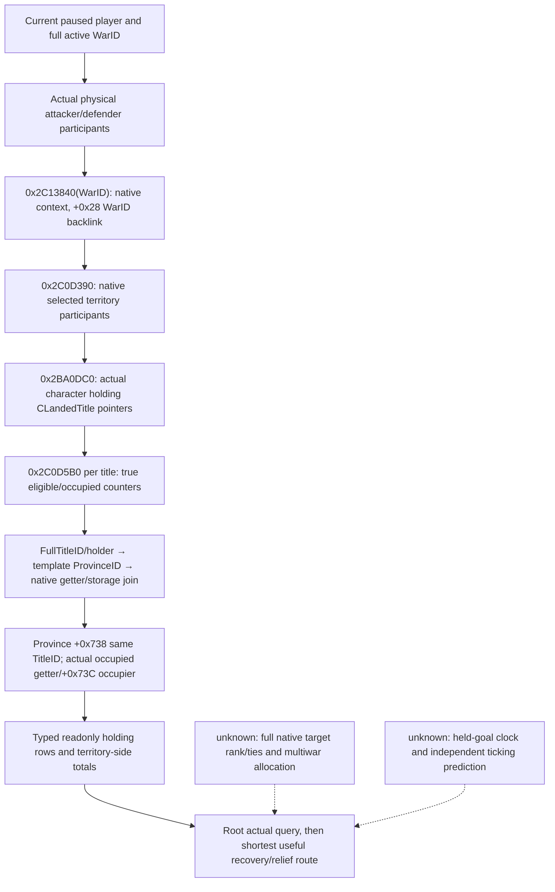
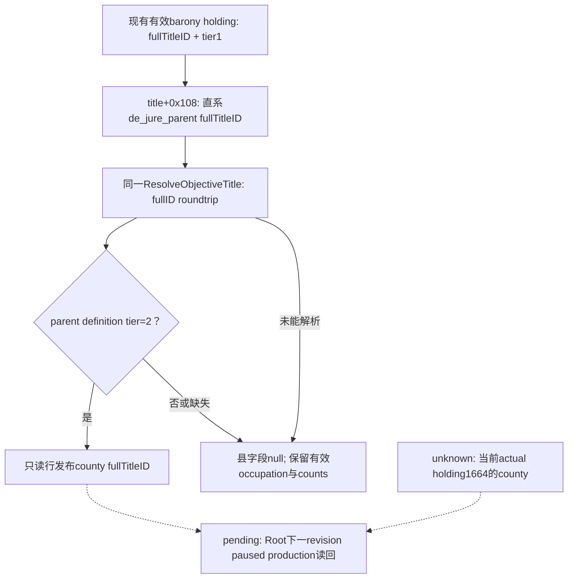

# CK3 1.20.0.3: native occupation targets for Robert's defensive wars

2026-10-03. The typed readonly query `ck3_query_war_occupation_targets_v1(war_id,expected_revision)` now exposes native eligible holdings with exact holding/title/province, legal holder, occupying character and physical war-side identities. The v36 context-unavailable attempts and v37 preview exposure failures remain historical RED. The v37 paused Robert capture makes the complete occupation collection a **production-live primitive**; the v38 capture below additionally makes holding fort/garrison fields and three fresh recovery route previews production-live primitives. Root selected province2604 from those observed inputs; actual movement and recovery outcomes remain separately observed capabilities. The exact build is CK3 1.20.0.3 / Steam25652598, EXE SHA-256 `94B55397ABB687A3DCD436805A5D885E6BE90FA6C693FEB44A9E3BBEEADE02A6`.

## Concrete gameplay dependency

Root's existing paused options for War16777231 report attacker-relative imprisonment0, battles0, occupation110 and ticking-71, yielding Robert's player-relative total-39. Its goal2610 is observably held, unoccupied and without active siege. The first real one-day artifact at raw53236632 preserves that state. Arrival there can establish defensive deployment, not recovery or relief. The existing goal-capital projection cannot name the occupied holdings responsible for occupation110, so automation needs the native occupation collection before selecting a recovery maneuver.

The extension preserves native participant-to-holding order and repeated occurrences, per-side eligible/occupied/candidate counts, and whether an occupier belongs to the opposing war side or is outside this war. A complete empty collection remains available/complete with the native side counters; a read failure clears partial rows/counters and preserves an explicit unavailable reason. It adds no action, flag, CLI permit, executor slot or global decision gate.

## Existing execution and independent results

The original route for CUnit83886367 from2614 to2610 was retained without resending the move. Root's bounded day loop refreshed the route/contact horizon and independently read army/date/paused state; actual day8 at raw53236800 now observes arrival at2610, regular code1 and a complete empty route. The [march timing and arrival topic](army-march-remaining-timeline-12003.md) preserves day6/day7 as moving observations. A fresh stationary decision may use `ck3_query_actual_contact_scope(subject_army_id=83886367,target_province_id=2610,expected_revision=R)` and `ck3_query_battle_control_snapshot_v1(subject_army_id=83886367,expected_revision=R)`. The actual-contact query applies to the army's current province, not a remote preview.

For each current full WarID16777231/129/50331736, `ck3_query_war_termination_options(war_id=W,expected_revision=R)` already reads independent native total and four score components. Use a fresh public revision; the driver maps it to the native admission revision. The four components are attacker-relative, so Robert's defender interpretation negates them. WarID-scoped attribution is essential when multiple wars share physical province2640.

Ordinary siege is a native lifecycle following legal movement/contact. There is no justified siege-start action at currently safe2610. After choosing a genuinely occupied recovery holding, observe the army's actual arrival/contact and independent occupation identity. If a future owned active SiegeID has complete assault inputs and native CanStart=true, existing `ck3_start_assault(siege_id=S,expected_revision=R)` / `ck3_stop_assault(...)` can be followed by same-province/full-SiegeID active-flag readback and a bounded day work/eligible/occupation observation. A queue ACK is not a siege result.

Relief requires separate occupation and siege after-state: disappearing old SiegeID can mean replacement or enemy occupation. Recovery requires an observed clearing/change of the hostile occupying identity. Read the native war scores independently afterwards; concurrent battles and other occupations prevent assigning the entire total delta to one holding. Full native AI final target rank, help coordination and assault utility remain recorded quality differences, not prerequisites for this narrow observation or existing day OODA. If a chosen recovery province lies outside the current objective projection and siege details are needed, the next narrow entry is the existing exact-bound `ReadObjectiveProvince`; do not misadvertise the historical local-siege parser as an already deployed .3 port.

The existing [occupation score tree](episode03-occupation-war-score-1.20.0.3.md), [relief tree](war-relief-siege-native-ai-12003.md), [current tactical facts](war-relief-contact-tactical-delta-12003-20261003.md) and [war-end observations](war-end-conditions-1.20.0.3-2026-10-03.md) remain the research inputs. The permanent additive ABI is [war_occupation_targets12003_abi.json](../../ck3_autonomous_player/native_bridge/research/war_occupation_targets12003_abi.json). The exact callback/container closure below was written before implementing the reader; old24 spans/64 instructions were reused rather than rerun.

## 2026-10-03: minimal native occupation target reader

The prior same-date Root options frame observes attacker-relative occupation110 and ticking−71 for War16777231 while its declared capital goal2610 is held/unoccupied/unbesieged. These are distinct facts: moving to2610 is defensive stationing. The current Root route has subsequently advanced exactly one saved day to53236632 without arrival. This extension exposes actual eligible holdings so a later recovery maneuver can choose an occupied holding instead of interpreting the safe goal as recapture. Earlier score values are retained as their53236608 source, not fabricated as a new day53236632 query.

The current `.3` source already binds packed occupation getter `0x2C0DDB0` but no native eligible target enumerator. Existing `ReadWorldSnapshot` collects declared title objective provinces, which do not equal the native territory n/N set. Native ABI extraction reuses the exact .3 occupation tree and existing frozen count-helper spans; new holding-collector span `0x2BA0DC0..0x2BA10C6` is pinned SHA `6e120c9351cd2136108c58ffb0ee093a7371de0ca09d829099651a1a608dd6e4`. Existing actor/world/title/province and occupation helpers are reused.

Native signatures follow the actual packed score getter's reviewed callsites:

| Entry | Exact ABI / output |
| --- | --- |
| `0x2C13840` | `void*(int32 full WarID)`; returned native context+0x28 equals requested WarID |
| `0x2C0D390` | `(context*, primary territory character ID, target participants CArray*, opposing participants CArray*, owned selected output CArray*)`; fifth argument is on the stack; output entries are native participants with full CharacterID+0x08 |
| `0x2BA0DC0` | `(CCharacter*, owned title-pointer CArray*)`; output CLandedTitle pointers come from actual Province+0x738 full title resolution |
| `0x2C0D5B0` | `(title*, opposing participant array*, selected territory participant array*, bool skip_holder_filter, Counts*)`; occupied int32 at0, eligible int32 at4; call once per actual occurrence |
| `0x24977C0` | `(CWar*)→bool`; changes skip-holder filtering only for defender territory as already used by the native occupation getter |

The CArray shape is pointer/capacity/count/allocator at0/8/C/10, size0x18. War participant arrays at CWar+0x28/+0x88 are borrowed. Output arrays use the existing native allocator object image+0x54DEBB8; collector allocation uses vtable+8 and one owned release uses vtable+0x10 with alignment8. This lane does not construct commands, compile permits or new execution boundaries.

`holding_title_id` is the full barony CLandedTitle holding identity. It is not paired with an invented CHolding ID. Legal holder comes from title+0x128. The actual ProvinceID receiver is **title+0x48, then receiver+0x88**: `0x2C0D71D` and `0x2C0D721` establish the chain, rather than title+0x88. The reader cross-checks the existing native title-province getter with full Province storage, and Province+0x738 with the same FullTitleID. Physical occupied state and the native score counter are kept separate. Actual occupier full generation and war participation identify attacker/defender/outside_war/none.

Rows and repeated occurrences stay in native stored order, defender territory then attacker territory. Per-side eligible/occupied totals are keyed by territory_side; occupied means eligible land the native helper counted as occupied by the opposing participant side. A complete genuine empty collection is available=true/complete=true with two complete zero side totals and rows[]. Any reader failure is available=false/complete=false with a concrete reason and empty rows/totals; it retains the request's actual actor/date/WarID. Partial results cannot become a successful empty collection.

The reader is implemented in the external source projection and supplied to concurrent wire/Python/production fixture lanes. The native lane has zero SDK/game/window/shared-source/Git actions; no additional saved day, arrival, siege outcome, battle result, war win or live readiness is claimed. Root alone integrates, builds the combined DLL and performs the actual paused current-WarID query.

The next tactical dependency is the real occupied holding set. Current short-route movement already has a bounded production-live loop and can continue with fresh one-day horizon observations. Full AI rank, generic coordinator state and Monte Carlo odds are quality gaps with known construction entries; they are not prerequisites to enumerate or recover an actual occupied holding. The foreign fight at2640 still comprises two opposing enemy groups, and its allocated result ID does not itself supply a winner.

Native receipt: external `war-goal-capture-execution/native-target-gaps/WAR-OCCUPATION-TARGETS-12003-ABI.json`; source-only patch `ROOT-ONLY-WAR-OCCUPATION-NATIVE-READER.patch`; detailed evidence and line references `NATIVE-TARGET-GAPS-AND-READER.md`; daily/weekly fields `ROOT-DAY-WEEK-FIELDS.json`. Production fixture results and Root actual artifact remain separate.

Production fixture later completed GREEN once: MSVC `/O2 /DNDEBUG /W4 /WX`, six translation units,38 native checks across6 cases, six genuine serializer JSON outputs and six normalizer→driver→service→registered MCP cases. The compiled reader SHA is identical to this delivered source. Cases exercise actual allocator-backed callbacks, real storage resolution, full-generation and province-title backlinks, native eligible-zero exclusion, duplicates/order, actual defender direction, outside-war occupier, true empty collection, mid-read failure clearing and legal zero IDs. Two Python harness RED attempts are retained (isolated import and frame diagnostics), resolved without rerunning the native cases or changing production predicates. This raises the package to **static-ready**; Root combined-DLL actual Robert query is still pending. Fixture evidence is `war-goal-capture-execution/production-fixture/ROOT-DELIVERY.json`.

## Completed static implementation and focused validation

The provider is now **static-ready**. The native reader and serializer were compiled with `/O2 /DNDEBUG /W4 /WX` across6 production/fixture translation units;38 explicit native checks passed. Six genuine native-to-serializer JSON cases then passed59 Python `require` checks through the production normalizer, NativeDriver, service and registered MCP path. The standalone verifiers use explicit `require`/`raise` or `if`/`throw`, so optimized execution retains their failure checks. The bridge's initial C1061 compile-depth failure was corrected by placing the new query in the existing `.3` dispatcher; its focused compile is GREEN. Two isolated consumer harness failures (missing existing import dependency and replay connection-generation metadata) remain archived; the existing native GREEN was reused after those harness fixes.

The six cases cover a populated opposing-side/outside-war collection with original ordering and duplicates, true complete empty collections, malformed native vectors, a stale holding FullID after partial traversal, stale WarID, and legal generation-zero WarID0. Neither an ACK nor this memory-backed fixture is a Robert live observation. Root must adopt and cold-load the package, then query the actual current wars through `ROOT-ACTUAL-OCCUPATION-CALLS.json`; actual query/readiness remains live-pending.

For Robert defending, recovery candidates are the **defender-territory** rows with a genuinely occupied holding, attacker-side occupier and `counted_occupied_by_opposing_side=true`. This is a post-tree minimal selection input, not a copied native final rank. A geographically occupied2640 owned by30097 would be opposing-side occupation for War16777231, while it could be `outside_war` for War129 or War50331736. Keep that war-scoped distinction when selecting a target and interpreting score deltas.

The latest coordinator-reported progress at packet assembly was the fourth bounded day, raw53236704/cumulative3849; a fifth day was still in progress. This lane adds zero new days or actions and does not modify the first-day frozen raw53236632 artifact. Central progress accounting remains Root-owned.

## 2026-10-03T16:27 接续源码采用

v36三场occupation实际均context_unavailable/collection_completefalse，不能把rows空认定没有收复目标。冻结exact .3原生2C13840在找不到matchedwarcontext时返回RIP slot5D1DE08指向的合法fallback；stock occupation getter2C0DE43→2C0DEDF把该返回值直接交territorycollector2C0D390，没有要求fallback+28等于WarID。我方reader此前多加backlink要求误拒该合法分支。最小候选允许真实WarID匹配context或exact native fallback slot identity；null/其他非匹配仍读失败，保持Python合法空集语义和既有开关/接口。真实三场到底null还是fallback尚未有区分，故只记代码错误已证、与当前失败一致，因果和实际holding目标待新DLL确认。6TU严格O2 DNDEBUG W4 WX、9case/53显式nativeCheck、86 registeredMCPrequire首次GREEN，用时15.8秒；不重跑旧矩阵。下一actual查询3wars，只有available且complete才选enemy-occupiedprovince收复；2610本来未占领，只计防守部署。

实际记录：`2026-10-03T16:27:56+08:00`。源码已采用；严格组合DLL和Robert暂停实读仍待完成，不能记为live或增加日数/动作/收益/G2信用。ROOT负责正常commit/push。

交付回执：[v37-occupation-fallback](Z:/ck3_mod_rewrite_process_assets/g2-resume-20261003/war-goal-capture-execution/actual-v36-01/ROOT-FALLBACK-DELIVERY.json)。

## 2026-10-03：v37 首次实际读到三场完整 occupation holding 集合

Root `runtime-preparation/v37/actual-new-leaves-v37-01` 已终态GREEN。本lane纯文件消费三份occupation与两份title-holder以及最终paused snapshot；没有SDK、state修改、窗口、Git、共享源或重复测试。exact1.20.0.3 EXE SHA `94B55397ABB687A3DCD436805A5D885E6BE90FA6C693FEB44A9E3BBEEADE02A6`，Robert29829/episode `native-29829-2bc2d599f7f9`，raw日期53236800，public revision2/native revision3，`native:3`，connection generation2。Root累计3853天，本消费增量0。

三份结果均payload `available=true,collection_complete=true,unavailable_reason=null`，并且有35/31/38条真实非空holding rows。这是实际collector结果，不是仅transport成功或fallback空容器：此前v36三场context-unavailable RED保留，v37读取到的具体holding/holder/occupier解除目标集合缺口。

| WarID | Defender native eligible / occupied / candidate | Attacker native eligible / occupied / candidate | 实际rows | 本战争对侧占领可收复rows |
|---|---|---|---:|---:|
| 16777231 | 31 / 17 / 31 | 4 / 0 / 4 | 35 | 17 |
| 50331736 | 31 / 0 / 31 | 0 / 0 / 0 | 31 | 0 |
| 129 | 31 / 0 / 31 | 7 / 0 / 7 | 38 | 0 |

主war16777231真实有17个defender holding被30097占领，全部occupier_side=attacker且counted_occupied_by_opposing_side=true；原生31 eligible中的这17次计数不是从declared目标首府推出来。以下保留原native行序，index从0开始，不排序、去重或以county title猜barony holding：

| Native row index | ProvinceID | Full holding TitleID | Legal holder CharacterID | Occupier CharacterID | Territory side | Occupier side | 原生opposing占领计数 |
|---:|---:|---:|---:|---:|---|---|---|
| 3 | 2633 | 2108 | 32716 | 30097 | defender | attacker | true |
| 4 | 2634 | 2109 | 43698 | 30097 | defender | attacker | true |
| 5 | 2639 | 2110 | 32716 | 30097 | defender | attacker | true |
| 8 | 2627 | 2166 | 32716 | 30097 | defender | attacker | true |
| 9 | 2626 | 2167 | 43710 | 30097 | defender | attacker | true |
| 10 | 8751 | 2168 | 32716 | 30097 | defender | attacker | true |
| 13 | 2628 | 2170 | 32716 | 30097 | defender | attacker | true |
| 14 | 2630 | 2171 | 43711 | 30097 | defender | attacker | true |
| 15 | 2629 | 2174 | 29829 | 30097 | defender | attacker | true |
| 16 | 2625 | 2175 | 29829 | 30097 | defender | attacker | true |
| 17 | 8753 | 2176 | 43712 | 30097 | defender | attacker | true |
| 18 | 2631 | 2162 | 34867 | 30097 | defender | attacker | true |
| 19 | 2623 | 2148 | 34333 | 30097 | defender | attacker | true |
| 20 | 2624 | 2149 | 34333 | 30097 | defender | attacker | true |
| 21 | 2621 | 2150 | 43707 | 30097 | defender | attacker | true |
| 29 | 2604 | 2400 | 33435 | 30097 | defender | attacker | true |
| 30 | 8759 | 2402 | 43755 | 30097 | defender | attacker | true |

War50331736与129中相同17项地理occupied=true、occupier仍30097，但occupier_side均outside_war、`counted_occupied_by_opposing_side`均false；它们的defender native occupied=0。解放这些holding是主war16777231的占领输入变化，不能自动算成叛军或宗教战争各自17项战分贡献。全三场全部104条原始rows与各自主战者/actual side/全部counters保留在 `ROOT-DELIVERY.json`，没有把另外两场的7项或0项attacker eligible当主war的领地。

实际最小preview候选可从表中取一项：province2604/holding2400/legalholder33435/occupier30097；或Robert本人持有的province2629/holding2174、province2625/holding2175。这些只是已实测属于主war真实敌占集合的候选，没有距离最短、军队可达、无敌军、能启动围城或应当最先攻打的断言。Root与native lane挑一项，用当帧revision做一次preview，再依据真正路线/接触输入决定移动。

当前army83886367实际在2610，regular状态、route=[]、in_combat=false、retreating=false；这是此前已经完成的到达，消费不增加arrival credit。目标2610未占领、无siege，其真实holding为Title2129，legal holder33435；另外actual title-holder query确认county2128持有人33435，holder_is_player=false，但immediate/top liege均Robert29829且holder_in_player_realm=true。不能把‘守方己方领地’写成‘Robert直接持有县2128’，也不能把2610部署写成收复。另一county2115实际由Robert29829持有，holder_is_player=true；它的首府holding2116/province2640当前同样未占领。

当前world玩家总分仍16777231=-38、50331736=0、129=0。**本v37批没有任何termination query，final snapshot的war_termination_options=[]；因此本次没有fresh四分项、victory/WP/surrender CanSend。** v36历史options的occupation110/ticking-72及三场CanSend，不能冒充raw53236800的当前读数。Native n/N现在有真实结果，原生integer occupation公式仍依赖loaded CB/capital/special路径，不把17/31直接外算成某个固定分数或推定收复一座给多少分。

Readiness：新occupation目标集合与title-holder成为production-live primitive；没有新增recapture、siege/battle结果、终战或完整loop credit。三场集合实际输入已经可用于下一项策略决策，而行动的native move/siege predicate仍由Root实测。证据来源及SHA见 `SOURCE-PINS.json`；专题追加、日报/周报字段仅外部交付，canonical合并与commit/push由Root负责。

### Fresh recovery preview exposure remains separate

After the complete target collection, Root attempted the existing `preview-move-army-83886367-to-2604`, `...-to-2625` and `...-to-2629` literals at the same raw53236800. All three returned the actual `native DLL does not implement gameplay step` error in `war-goal-capture-execution/actual-v37-previews-01/result.json`; the normal checkpoint remained GREEN, history4747/SHA-256 `b5e311543062571113816a93be3b1b3e4b9d6f7c332f11d85beb96fde3e18f66`. This is a concrete exposure blocker for those fresh recovery previews, not evidence that their native paths are unreachable or illegal. The occupation collection and title-holder observations retain their actual GREEN readiness; no move, additional day or recovery result was produced. The owning implementation lane is repairing the existing target path; this documentation merge adds no code, ABI or separate gate.

## 2026-10-03T17:19 接续源码采用

v37 已实读旧战争 31 个 defender eligible holdings 中 17 个被敌方30097占领；这些收复目标没有出现在旧 war-goal 2610 投影中，旧路线预览也不发布堡垒或驻军。复用已有 exact .3 Province getter fort_level 0x247AB90 与 garrison_size 0x247F370，在同一个 ck3_query_war_occupation_targets_v1 的每条 holding row 新增 nullable fort_level/garrison_size，观察到零仍保留0，真实不可读或负 getter保留null；完整 occupation/count 语义不变，旧报文兼容。6 个严格优化编译单元、12 份真实 reader→serializer 报文、注册 MCP 161 项显式检查 GREEN。新字段仅 static-ready，旧17敌占目标本身已 production-live primitive；尚未执行新收复移动或围城，具体省的 active_siege/work 如后续真实决策依赖再复用现有 ReadObjectiveProvince 入口施工。

实际记录：`2026-10-03T17:19:27+08:00`。源码已采用；严格组合DLL和Robert暂停实读仍待完成，不能记为live或增加日数/动作/收益/G2信用。ROOT负责正常commit/push。

交付回执：[occupation-fort-garrison-v38](Z:/ck3_mod_rewrite_process_assets/g2-resume-20261003/war-goal-capture-execution/actual-v37-01/ROOT-FORT-GARRISON-DELIVERY.json)。

## 2026-10-03T17:27 接续源码采用

v37 对2604/2625/2629的三个真实预览在Python admission失败，尚未调用原生；DLL已有通用 preview/move/contact handler，旧有限目标列表遗漏实际enemy occupation holdings。复用同帧、当前episode/connection的完整 typed occupation 报文，将对侧真实占领且原生counted的17省加入现有移动、预览和接敌时域步骤。实际路线终点/到达后当前省持续发布contact horizon，不依赖过期occupation缓存；抵达空路线不发布同省重复move。一个生产driver路径与一个可复用CLI fixture，python -O 81项显式生产driver→历史→能力发布→endpoint检查GREEN；一次fixture无效输入RED保留并纠正，未改生产normalizer。新目标执行仍static-ready，三个旧实机RED完整保留，尚无收复移动/新日。

实际记录：`2026-10-03T17:27:15+08:00`。源码已采用；严格组合DLL和Robert暂停实读仍待完成，不能记为live或增加日数/动作/收益/G2信用。ROOT负责正常commit/push。

交付回执：[occupation-route-targets-v38](Z:/ck3_mod_rewrite_process_assets/g2-resume-20261003/war-goal-capture-execution/native-target-gaps/actual-v37-preview-admission-01/ROOT-LF-DELIVERY.json)。

## 2026-10-03：v38 实读全部收复候选的堡垒/驻军及三个原生路线预览

Root 的 [actual-v38-previews-01/result.json](Z:/ck3_mod_rewrite_process_assets/g2-resume-20261003/war-goal-capture-execution/actual-v38-previews-01/result.json) 终态 GREEN：一次 fresh 主 war16777231 occupation 查询以及三个原生 route preview 均成功。此次暂停读取绑定 Robert29829、episode `native-29829-2bc2d599f7f9`、raw53236800、公用 revision2、native revision5、connection generation3。v38/R0017 的冻结源码为 `0ad923525ef899b836a823dfe983db49030789f2`（g40）；Root 记录严格组合构建541TU、jobs64、73.42814秒及官方 CI37113104087 GREEN。该批观察时累计3853天；纯文件消费没有新增游戏日或动作，后续 current 由 Root 的独立工作包更新。

这一次实际 occupation 仍 `available=true,collection_complete=true`，共35条原始 holding rows，守方 native eligible31/occupied17/candidate31，攻方4/0/4。17条收复候选均实际 `is_occupied=true`、occupier30097、`occupier_side=attacker`、`counted_occupied_by_opposing_side=true`；每项的 fort_level/garrison_size 均为非 null 的原生实数。合法 fort_level0 明确保留为0，不能把它解释为读取失败。下面保持原 native 行序：

| Native row index | ProvinceID | Full holding TitleID | Legal holder CharacterID | Fort level | Garrison size |
|---:|---:|---:|---:|---:|---:|
| 3 | 2633 | 2108 | 32716 | 3 | 121 |
| 4 | 2634 | 2109 | 43698 | 0 | 150 |
| 5 | 2639 | 2110 | 32716 | 0 | 150 |
| 8 | 2627 | 2166 | 32716 | 3 | 217 |
| 9 | 2626 | 2167 | 43710 | 0 | 150 |
| 10 | 8751 | 2168 | 32716 | 0 | 150 |
| 13 | 2628 | 2170 | 32716 | 4 | 500 |
| 14 | 2630 | 2171 | 43711 | 0 | 150 |
| 15 | 2629 | 2174 | 29829 | 4 | 405 |
| 16 | 2625 | 2175 | 29829 | 0 | 150 |
| 17 | 8753 | 2176 | 43712 | 0 | 150 |
| 18 | 2631 | 2162 | 34867 | 3 | 400 |
| 19 | 2623 | 2148 | 34333 | 3 | 400 |
| 20 | 2624 | 2149 | 34333 | 0 | 150 |
| 21 | 2621 | 2150 | 43707 | 0 | 150 |
| 29 | 2604 | 2400 | 33435 | 3 | 400 |
| 30 | 8759 | 2402 | 43755 | 0 | 150 |

三个既有 `preview-move-army-83886367-to-<ProvinceID>` 步骤现在均 `accepted=true,status=available`，原生 preview origin2610/army83886367/previewed_date_raw53236800 与当帧实际输入一致。路线数组是原生可达路径，hop 数是数组长度；报文未发布这些路径的实际行军天数、敌军接触时刻、围城 CanStart 或胜率，不能从 hop 数外算 ETA：

| Preview target ProvinceID | Full holding TitleID | Fort level | Garrison size | Observed hops | Native route from2610 |
|---:|---:|---:|---:|---:|---|
| 2604 | 2400 | 3 | 400 | 2 | `2605 → 2604` |
| 2625 | 2175 | 0 | 150 | 7 | `2614 → 2618 → 2624 → 2631 → 2630 → 2629 → 2625` |
| 2629 | 2174 | 4 | 405 | 6 | `2614 → 2618 → 2624 → 2631 → 2630 → 2629` |

Root 采用最小确定策略，选择三份实际预览中 hop 最少的2604：holding2400/legalholder33435，敌方30097占领，fort3/garrison400，原生路径2610→2605→2604。Robert 本人持有的2625/2175虽 fort0/garrison150，但这次实际路径有7hop；2629/2174为 fort4/garrison405、6hop。选择2604解锁一个已验证敌占目标的短路径尝试，没有声称它在全17项或原生完整 target rank 中最优。未采用的全17路线比较、原生最终优先级/平局处理、多战争协作以及未来 active siege/work 的真实查询仍是有施工入口的质量差距。移动命令、after-state 和逐日接触观察由 [march timing topic](army-march-remaining-timeline-12003.md) 的独立实际 artifact 说明；选中或 preview 成功均不等于抵达、收复、围城启动或战分变化。

v37 三个同目标 preview 的真实 RED 原样保留在上节：当时是 Python admission 暴露缺口，未调用原生，不是路径非法。已采用的 fort/garrison getter 研究和 target publication 修复也保留为此前源码阶段；本 v38 actual 批只把已实现的新字段/三个 preview 提升到 **production-live primitive**，没有把此前 RED 改写为成功，没有新增战争终结、recapture 或完整攻城 loop credit。

本 preview 批正常存档独立记录为 history4755/SHA-256 `098220c27dcdbe5e7de50c1a7706906b2d18497e3a9a397bb3b4429ca151c90d`、raw53236800。协调者在文档派发时另给出后续 latest normal pair history4759/SHA-256 `189d84b62c273aef8e98059b33975c277e84824f58549967bcbe8ce3e4513789`；它不被冒充为本 preview 批的 checkpoint，也不因本文件消费而回退。最新移动/推进后的 pair 与 current 计数始终由 Root 更新。

各实际 packet、历史 v37 RED 和冻结 runtime 构建输入的 SHA-256 见 [occupation-preview/ROOT-DELIVERY.json](Z:/ck3_mod_rewrite_process_assets/g2-resume-20261003/actual-v38-doc-merge/occupation-preview/ROOT-DELIVERY.json)。本 lane 只交付外部文档 projection 与规范 LF 补丁，未运行 SDK、游戏、state、窗口、共享源、Git mutation 或重复测试；canonical 文档采用和 commit/push 由 Root 完成。

## 2026-10-03T18:41 到达2604后的真实占领复查

到达后004 occupation实际GREEN：2604的 **holding2400 / legalholder33435 / occupier30097 / fort3 / garrison400 / counted_opposing=true**；主战defender仍有 **17个被占holding**，没有17→16收复。005独立ownarmy再读为2604/sieging3/emptyroute；三项siege字段仍null，尚不能观察实际active_siege、围城进度、破墙或assault资格。在该 v38 当帧，这个具体缺字段影响下一步围城决策；P0 holding active_siege provider 当时已源码采用、仅 static-ready，后续 v39 actual 闭合见下节；不把null当作没有围城或已完成围城，不等待未来v39才记录当前到达。

实际004 occupation为v38原Robert战役raw53237136、native69，005独立ownarmy后置读回；正常SDK关闭并保存 **h4821 / 90,945,405B / SHA `19007da8127bf8cda28bea484021fad116e1082a67d15e7c5927c7d6c546c08f`**。批末h4819/3867日保持此前冻结事实，本次查询增加0日；到达部署loop与占领目标primitive分开，不能用CArmy sieging state或active_siege空投影证明收复。[唯一Root后置实机包](Z:/ck3_mod_rewrite_process_assets/g2-resume-20261003/war-goal-capture-execution/actual-v38-post-arrival-01/result.json)。P0围城provider在此 v38 历史施工阶段已由fca9daf源码采用并取得单次fixture GREEN，尚属静态；该阶段不授live资格，后续 v39 真实2604读数见下节。

## 2026-10-03：v39 actual occupation holding 围城输入已闭合

7-path源码 `fca9daf1aa517ca5a5c185cc2c0736287ad26847` 已发布；g41/jobs64构建4 targets、541 TU/538 unique/1041 inputs，71.17104秒。War16777231 同一次 paused query 完整读回35 holding行，date_raw=53237136；Holding2400/Province2604 的FullSiege503316492由玩家Army83886367围攻，strength2334、progress540/100000、work175750/32500000、remaining32324250、native days_left184已实际观测。assault observable=true，breach0，start/stop/in_progress=false，突击preview daily progress/casualties均为合法0。新增围城字段为有限 production-live primitive；35行中2行有active siege，占领/holder/occupier/side/fort/garrison变化均0，defender31/17、attacker4/0，2604仍敌占，未收复。 本lane0新日/0动作；累计3867、resume714、当日619不因证据索引变化。 同一次实机的2份其他owner消费receipt已并入证据索引。 最新normal014/h4824；围城184日是当前原生估计，不保证收复日期。CI37117062048 GREEN，游戏保持minimized=true/foreground=false。

上述是首 v39 actual h4824/raw53237136 的有限读口：同一个既有 occupation MCP 现发布真实 FullSiege/work/days/assault 输入，并保持35条 holding、双方计数与旧占领语义。它解决 v38 到达后 null siege 投影缺口；实际 siege 状态与 source/getter 账本见 [occupied-holding siege observation](war-occupation-holding-siege-observation-12003.md)。以前 null、fixture/static-ready 和失败 artifact 保留为当时事实，不作为当前阻点。

### 一次正常围城日推进及独立保存后的 actual 状态

首个请求最多64日的 helper attempt 在 `actual-first-siege-batch-2604-01/day-01/003-ck3_execute_step.json` 的 contact-horizon 步骤实际 RED，advance 未发送，新增0日，正常存档保留 h4827。该失败保留为 harness RED，不能写成64日完成或部分完成若干日。

Root 随后只发送一次实际 day advance。它成功使 raw53237136→53237160；通用 readonly capture 沿用旧 expected-date，因而随后报 harness RED。Root 没有重播这个已成功的 advance，而是用独立新日期读取与正常保存收口：[actual-after-stationary-day-save-2604-01/result.json](Z:/ck3_mod_rewrite_process_assets/g2-resume-20261003/military-ooda-continuation/siege-v39/actual-after-stationary-day-save-2604-01/result.json) GREEN，正常 pair **h4831 / 90,890,887 B / SHA-256 `3f482def35fe0d13c901044ff5c6a5b9eec3b643ef9c6e6774e9a1f42c3415e6`**。累计 **3868日 / resume715 / 2026-10-03增量620**。本纯文件消费增加0日；唯一新增日归属于 Root 的该次实际 advance。

同一 **FullSiege503316492 / player Army83886367 / holding2400 / province2604** 的 fresh 读数为 current_work **351500**、total_work **32500000**、remaining_work **32148500**，scale均 **100000**；progress_fraction **1081/100000**，native days_left **183**。此前首 actual h4824/raw53237136 的 work175750、progress540/100000、ETA184保留为历史当帧值。一日实际工作增量175750并未完成围城；ETA仍是原生当前估计，不承诺收复日期。

breach_level仍0、native CanStartAssault仍false，holding2400仍由敌方30097占领，守方被对側占领的holding仍17。此次没有突击、occupation17→16、收复、围城结束或战争终结；有限围城观测 primitive 加上一日保存后变化，不冒充完整战争 OODA。Robert29829 原普通战役与 exact .3 绑定不变，游戏保持 minimized=true/foreground=false。下一项仍按真实 paused work/ETA、contact 与 occupation输入推进正常围城，后续 batch 和 current 由 Root 独立记账。

## 2026-10-03：v39 后续49日围城仍未收复目标2604

在先前h4831/raw53237160/3868日保存基线后，Root的后续正常围城批实际保存了49个calendar日。37轮中36轮为完整24h观察/推进/正常保存对，末轮请求7日却实际推进13日后harness RED并正常保存；source仍RED，36 bounded counter与49实际日必须分开，不造末13日的中间逐日帧。当前Root确认总3917/resume764/Oct3增量669，纯文档消费0新增日。

当前末pair **h5021 / raw53238336 / 91,105,707B / SHA-256 `d6e9986ccf24fd85c853a08921cd4d200e2b279a33236a31619e8fc1ba88bab2`**；最终同帧native164/public153的真实 occupation+siege查询仍观察到War16777231/holding2400/province2604敌占人30097、守方对侧占领数17。FullSiege503316492的 current_work9781290/total32500000/remaining22718710（Q100000），native ETA109、breach0、CanStartAssault=false；玩家army83886367仍sieging3、emptyroute、noncombat/nonretreat。围城work已增长，但没有收复、围城结束、玩家胜利或完整战争OODA。

完整循环边界、首max64 0日RED、旧dateguard首日成功/h4831历史、末13日RED interval及证据CSV见 [holding siege observation](war-occupation-holding-siege-observation-12003.md)。此次有限围城loop有36个完整单日对与49个真实落盘日；consumer GREEN不把source RED改写为成功。没有重播或因文档采纳新增动作/天数，后续fresh terminal与实际推进由Root独立记账。

## 2026-10-03 v41: province2604 holding2400 independently recaptured

The actual second siege batch completes a **production-live loop** for one concrete occupied-holding recovery: the previously established occupation-target selection → native preview → movement → normal-siege daily continuation now ends with an independently observed recaptured holding and normal save. Its31 actual one-day rounds all complete, advancing744 raw hours from53239392 to53240136. This is31 new saved calendar days, separate from the preceding44-day batch and its recovery query: total3961→3992, recovery808→839 and October3 increment713→744.

The final rich occupation query is available and collection-complete at native308 / public125 / generation5 / raw53240136, matching the independent final paused frame. For War16777231, holding2400 / province2604 retains legal holder33435 and defender territory, but `is_occupied=false`, occupying character=null, occupier side=none and `counted_occupied_by_opposing_side=false`; the previous occupant30097 is cleared. Defender counts are31 eligible /15 occupied, down from the independently recovered baseline17 occupied; attacker counts remain4 /0. The aggregate two-row reduction is not attributed wholly to this single player recovery. At the same frame, army83886367 remains at2604, regular/code1, with a complete-empty route, no combat and no retreat; its independent strength observation reports2248 current soldiers. Siege is observable with active_siege=null and besieging strength0, fort3 / garrison25. These occupation values, rather than the helper's stop label or siege disappearance alone, establish the actual recovery.

The normal pair is **h5360 / raw53240136 /91504049B / SHA `b76ed06c77002e15c19e3b2c9ca349d4fad68f95c9305e745241c8c1719065c5`**, actor29829 / ordinary-campaign episode `native-29829-2bc2d599f7f9` / xar_off / pact absent. The helper terminal has error=null and stops at actual_target_recaptured; Root reports normal SDK closure. Runtime remains v41 / frozen g43 sourcecd5db on the previously bound exact CK3 1.20.0.3 build. The player's defensive wars remain separate ongoing work; this milestone adds no battle-win, war-completion or natural-succession credit. First-batch day44 occupation RED and the subsequent zero-day fresh recovery remain historical evidence. Reuse the [once-consumed second-batch receipt](Z:/ck3_mod_rewrite_process_assets/g2-resume-20261003/military-ooda-continuation/siege-v41/second-batch-consumption/ROOT-TERMINAL-DELIVERY.json) and its compact state SHA `f073341c21fc010a5f3e4d197007c8e806a19cf0e29cd079781e53543e131da1`; actual terminal result SHA `aed0c39ae123644a952f955d0d6662cfe4e565539313aaf3278df4efd253d4d7`. No original batch/day packets or tests are consumed again by this documentation lane.

## observation/outcome boundary

Rich objective2640 is same-frame bound to this final map and normal checkpoint; `is_occupied=false` while enemy active_siege persists supplies no recapture/relief credit. Future occupied transition hands control to Root's already prepared countercampaign role; first actual main-army combat goes to battle owner. Fresh enemy siege removal, arrival, actual recapture and war termination remain distinct outcomes. No gathering completion or invented soldier count is claimed; Root's later fresh strength SDK is separate from this frozen completed batch. Evidence is `relief-v46/seven-day-consumption/{COMPACT-TERMINAL-STATE,ACTUAL-CALENDAR-CONSUMPTION,ROOT-DAY-WEEK-FIELDS,ROOT-DELIVERY}.json`. No new native tree, platform or source change is introduced.

### 战斗后首都已占领：独立war观测primitive与recapture接续

008 `ck3_get_war_state`已由soleowner消费GREEN，provider snapshotnative:155/public3，body无date_raw。Root独立时钟raw53241792与latestnormalh5697(beforepostmerge)分别保留，不生成008伪同帧savepair。本次warquery0day、无新battlewin/loopcredit；累计4061/res908/Oct4+36属于Root已计结果。

资本2640 occupation_observable=true、is_occupied=true、occupier70766；fort7/garrison25/besieging_strength0，siege_observable=true/active_siege=null。row由activewars50331736和129重复发布，字段完整。本帧无围城是已占领结果，不是relief或recapture。war16777231 score0、50331736 -14、129 -32仍active，battle terminal结论不替代战争结算。

已有externalcounter入口`current-preparation-v47/helper/root_sdk_counter_transit_days.py`（SHA22e24726740b19b012b9f5bc6b6a87718651457f43a0127b36cd960077ec027a）保留route endpoint与occupation province分离。Root策略依据实际capitaloccupation切recapture；此role在起步occupiedtrue时继续观察、已见实际占领且后来fresh解除才计收复。defaultrelief仍首个occupiedtrue STOP handback，不能用于反攻占领中的资本而反复0day停止。军队主体由fresh实际survivor publicCUnit继承，任何own实际接战仍选择真实subject交Root。尚无反攻move、arrival、siege或收复证据；ready为prepared，不新增平台或授权门禁。

可核验输入：`post-battle-v49/war-state-consumption/COMPACT-WAR-STATE.json`；soleowner raw008 reference SHA326602aed6f5f0e4d8f4acfa4484233d62df758e249c8e7b7fef5127bd9ec159；本包`post-battle-v49/war-report/ROOT-DAY-WEEK-FIELDS.json`与`ROOT-DELIVERY.json`。本报告只读ownedcompact，SDK/raw/其他snapshot/strength/merge/window/shared/source/Git/tests均0。

### owned siege每日观察/保存持续38日，真实event正常交接

R25/PID66464/g54source8898，既有counter skip-route-horizon/prioractual02/recapture watch2640，在68437首府siege01完成38actualsavedcalendar=38bounded=38whole/912h；raw53244648→53245560，累计4218/res1065/Oct4+193。day38出现actualevent，STOPPED/errornull而非RED；normalSAVE h6143/93428316B/SHA7fe198a23ec962d71fb0247345803e31d1342146d87ef117981e325f2736c877绑定末native646/pub153/date/episode。

838@2640sieging3/routecomplete_empty0、非combat退；capital2640仍occupied70766、fort7/garr85，ownedFullSiege385875999/publicarmy838/playertrue，current_work8930374of14462500/rem5532126/Q100000，progress61.748%/ETA57/B3764/breach0/CanStartfalse。当前阶段普通围城production-live loop已38保存日；assault与recapture未发生，actual_target_recaptured字段null沿事件branch原样记录，独立occupiedtrue不能消失。

terminal专用strengthmeta为空，payload保持literal，不拿siegeB当armystrength。最后实际sameframe query若存在，其原binding/age在compact独立保留；termowner使用current3war[16777231,50331736,129]与scores[9,-22,-31]，不沿旧war结束猜测。旧actual0155success+day56RED、subsethorizonRED、44/43occupationRED冻结留存；剩26预算零信用。

可复用实物`recapture-v49/siege01-sealed-day-consumption/ROOT-DELIVERY.json`、`DAY38-EVENT-TERMINAL-CRITICAL.json`、`EVENT-PAYLOAD-HANDBACK.json`与ownedday-cache；各原day result一次，不重callleaf/oldraw/SDK/window/shared/Git/tests。

Subsequent Root-confirmed event ACK is a separate frame: SDK74826 GREEN/normal close0 selected option_number1/nativeindex0; event24 -> null with postcondition_verified=true, native650 -> 651/public2 -> 3, actor29829/raw53245560. Gold65169236, prestige280879140 and stress0 remain unchanged across that ACK. This is a finite event-ACK loop,0 new days; no independent trait read establishes clouded_eyes addition or event semantics. The subsequent independently cached005/frame and006/normal-save pair is now sealed: native651/public3/raw53245560/event=null/main2640sieging, h6147/93428206B/SHA3db05b5df4b982e4938af5bae0b079ce401afb9efaeae2c3420ea88b43a610cf. This separate0-day pair leaves the original h6143/event24 STOP intact;4218/res1065/Oct4+193 is unchanged. No trait posterior was read. Cached sources are linked only: [control receipt](Z:/ck3_mod_rewrite_process_assets/g2-resume-20261003/battle-observation-schedule/r25-v49-event24-select-zero-days/ROOT-DELIVERY.json) and [final identity/control/save fields](Z:/ck3_mod_rewrite_process_assets/g2-resume-20261003/battle-observation-schedule/r25-v49-event24-select-zero-days/CACHED-FINAL-IDENTITY-CONTROL-SAVE-FIELDS.json).

### 2026-10-04 county2115的首府2640 普通围城收复实机闭环

Current naming confirmed by Root: province2640 is the seat of county2115; the actual current realm capital is province2619, the seat of county2142. This new appendix corrects the target name; historical log/earlier section wording is retained. The outcome below is county2115-seat2640 recapture, not realm-capital2619 recovery.

SDK 42475 closed exit 0 的末日 sealed cache（军事 soleconsumer 唯一读取原始 day47）给出了真实同目标过渡：before `raw53246664 / native837 / public186`，county2115的首府2640 仍被 70766 占领，我方 army 83886367 围攻 FullSiege 385875999，进度 99.729%、remaining work 39193/14462500 Q100000、原生 ETA 1；after `raw53246688 / native840 / public189`，`occupation_observable=true / is_occupied=false / occupier=null`，`siege_observable=true / active_siege=null`，fort 7/garrison 25/besieging strength 0。同一玩家军队在 2640 为 regular，route complete empty、非 combat/retreat；正常保存 h6254 与同日同 episode 绑定。

既有我方 ordinary-owned siege 连续前态、同目标敌占解除、围城结束与同军 regular 后态共同闭合有限目标省份收复 `production-live loop`，`actual_target_recaptured=true` 及 occupied→recaptured bindings 互证；归因不只来自 helper STOP 或 occupation=false。原 War 50331736 仍在 active wars，另两 War 16777231/129 也仍 active，score 为 11/−25/−29，因此不记战争胜利/结算或完整战争完成。该末帧字段已足够，0 额外 occupation query；siege besieging strength 0 不表示整军军力为 0。

Root/军事 owner 的本批真实计数为 47 日/1128h，累计 4265、resume 1112、Oct4 +240；本缓存消费者新增日、SDK、游戏操作、窗口、测试、shared/Git、重复收复及战争胜利信用均为 0。新指挥官 phase 未观测，未称强攻或加速收益。后续使用现有同军/战争/补给 owner 的当前结果选择下一目标，白和平与此围城收复独立记账。

Cache: `Z:/ck3_mod_rewrite_process_assets/g2-resume-20261003/military-ooda-continuation/recapture-v49/siege02-sealed-day-consumption/DAY47-RECAPTURE-TERMINAL-CRITICAL.json`，SHA-256 `8474b2371e5b8ae2f188bb5bea737f93df06e2939fdc689124ecd9f3a8dad544`。Save h6254，93434316 B，SHA-256 `2388c9877fccdc160ba1c60db76347be2ff95390303ef4c001fae355b6a8a714`。

## 2026-10-05: War117440524 ordinary siege completion and independent war readback

Exact .3 / EXE SHA94B, Robert29829, ordinary episode native-29829-2bc2d599f7f9, runtime g68/R36. Root's first capture attempt SDK22430 reached only initial snapshot/diagnostics, then failed at harness line75 because the config was a plain list instead of OBJECT `{"calls":[...]}`; war queries0/save0/newday0, lastnormal8069 unchanged. This HARNESS RED remains preserved. Root wrapped only the outer container and corrected SDK17162 passed; `war117-current-g68/CAPTURE-CONFIG.json` is the object entry. The original child plain list is historical and must not be used directly as capture config. No native fault, source change or repeated test was involved.

At raw53258424/native265/public2, the independent current-war reads returned primary attacker Robert vs35991, CB29 raiktor_conquest_cb, targets1333/1351/1358, age298d, score0 and four components0. Complete occupation was defender0/337 and attacker0/31. P472/holding1359 was unoccupied, legalholder31797, player siege251658324/army301989997, fort4/g500, progress94.731%, native days_left15, ordinary can_advance=true and can_start_assault=false. Root continued the existing normal siege for at most16 days. These actual options did not supply a superior terminal: enforce/WP native validatorsfalse; surrendertrue means attacker_defeat.

Root's ordinary session62400 completed16 saved days/384h; capture was first observed on day11. Independent SDK95326 then read raw53258808/native332/public2: P472/holding1359 occupied=true/byRobert29829, occupier_side=attacker and counted_occupied_by_opposing_side=true, garrison25, besieging_strength0, active_siege=null. Legal holder31797 remains unchanged. Holding1360/province3710 also counts as Robert's occupation. Complete defender count is now2/337, attacker0/31, with368 holding rows. Current authoritative score is25, solely occupation25; battle/imprisonment/ticking remain0. The paired observation records a0→25 delta for this scene and does not establish a fixed per-castle gain.

The finite ordinary continuation→actual occupation→independent current-war/score verification is **production-live loop** for this siege. War117440524 is still active, age314d; enforce/WP remain native unavailable, quote−74/−22.5, and surrender is available/autoaccept with attacker_defeat, quote876. Final reply and CB terms keep their existing unavailable state without blocking ordinary military progression. This is not battle victory, whole-war victory or legal title transfer.

Next military input is the real remaining goal selection, using current target county IDs1333/1351/1358, completed holdings1359/1360, and existing actual county/route/contact mapping. Observed unoccupied province facts are471 fort4/g480,473 fort4/g404,474 fort4/g515,475 fort4/g500,470 fort6/g550. They are candidate facts, not a route/county ranking. Primary35991-held496/holding1223 is fort13/g4750 with stalled nonplayer siege; this schema does not mark capital identity. No first-row capital assumption or new observation gate is introduced. Militarysource receives the complete cached368 rows instead of re-reading raw leaves.

Artifacts: `Z:/ck3_mod_rewrite_process_assets/g2-resume-20261003/war-settlement-typed-action/war117-current-g68/actual-siege-completed-01-consumption/ROOT-DELIVERY.json` pins both actual nodes, assigned new004/006, the cached next-target inputs, and the separate first HARNESS RED. Each new raw leaf was parsed once; old raw004/006, health, final/save leaves were not read. Accounting remains Root's4770 total/res1617/October5+112 at raw53258808; the16 days are already credited once, this consumer adds0. Latest normal zero-save metadata remains null until Root supplies it. No SDK/RPM/window/Git/shared source or test operation occurred in this consumption.

### R37/v64 independent occupation confirmation, zero new-day credit

Root's sole-consumed R37/v64 occupation cache independently confirms raw53258808 / native5 / public2 / connection3, available and complete368 rows, defender2/337 and attacker0/31. Holding1359/P472 and holding1360/P3710 remain occupied by Robert29829, counted_opposing=true and active_siege=null; holding1352/P3711 (legalholder32309, fort6/garrison500) and holding1334/P470 (sameholder, fort6/garrison550) remain unoccupied with active_siege=null. These four rows agree with the previous independent cache. This occupation leaf supplies no score: score25 is the prior actual native332 terms observation at the same raw date, not a fresh R37 score.

The row schema has no new county/capital fields; the g69 county extension has not been loaded and supplies no actual mapping credit. Next target/preview/route joins remain Military-owned. Root4770/resume1617/October5+112 is reference accounting with the previous16 saved days already counted; this confirmation adds0 days and does not supply a new TOP/save pair. The prior EOF above was unadopted before this task and is included in this single merged patch. Evidence: [parent-owned R37 occupation cache](Z:/ck3_mod_rewrite_process_assets/g2-resume-20261003/war-settlement-typed-action/war117-current-g68/actual-r37-occupation-01-consumption/CACHED-OCCUPATION-LEAF.json); this document lane reads no raw, preview, TOP/save or health body.

## 2026-10-05：占领 holding 的县映射只读补口

当前冻结源码为 Z:/g69，协调者提供 full HEADa14f3c5fab2079956ddccb7b614d5e3aa41d9bbc；exact CK3 1.20.0.3 / EXE SHA94B55397ABB687A3DCD436805A5D885E6BE90FA6C693FEB44A9E3BBEEADE02A6。本段复用已闭合的 exact-build 字段链，不重复原生研究、RPM、SDK或旧夹具。协调者当前军事缓存报告368条 occupation holding 行，但尚无县映射；CB targeted titles1333/1351/1358不能据此推成某 holding 的县。现有470/3711目标 preview不受本映射缺口阻塞。holding1664对应的县目前仍未观测，不填写猜测值。

最小源入口是现有占领 reader 已解析的 barony fullTitleID：title+0x10取得完整ID并经 ResolveObjectiveTitle 回读同一 title；title+0x48 definition、definition+0x64 tier1、definition+0x88 province 已有闭合（ck3_12003_war_occupation.cpp:216-245，行号为协调者读取时的冻结位置）。现有 ReadSurrenderTitle 已读取 title+0x108 的直系 de_jure_parent fullTitleID，并利用同一 definition tier 区分 title（ck3_12002_faction_alerts.cpp:449-470）。只需用同一 ResolveObjectiveTitle 解析该 parent，校验完整身份和其 definition tier2，发布县 fullTitleID；不需要再建 liege tree 或 county provider。缺 parent、完整ID解析失败或 tier不为2时，县字段保持 null，有效 holding/occupation 行、原生顺序和计数继续保留。

同一 `ck3_query_war_occupation_targets_v1(war_id, expected_revision)` 的行新增可选、可空 `county_title_id`，保持 v1 schema、参数和旗标。完整 parent TitleID 经现有 resolver 校验、其 definition tier 为2后才发布；旧 body 没有该 key 时归一化为 `None`。合法零值仅在真实完整ID解析且县 tier 验证成功后保留；映射失败保留原本可观察的 occupation 行和计数。

唯一新增离线生产链路已 GREEN：一次生产 reader→一次 serializer 的6行原生顺序输出，18项显式 native Check，县列表 `[50334048,0,null,null,50334048,null]`；同一 genuine JSON 通过现有 registered MCP 与 service，Python `-O` 下41项显式 require，保留完整ID、重复行、side counts和occupation值。第二个 registered call只使用同一body副本删除新key验证旧body兼容；没有重读或重跑旧 native case。首轮6TU编译成功，link因缺现有 supply timing/replenishment production依赖而HARNESS RED；该attempt保留，复用6个已编对象并只新编2TU后完成8TU链接。所有失败判断均可在 `-O`/`-DNDEBUG` 下生效。

资格为 **static-ready**，尚未部署或加载到 g69/v64，也没有新的 actual paused county映射。当前holding1664的县仍待Root下一revision一次实际occupation查询；470/3711已有实际目标预览继续独立推进。本工作包新增游戏日、收益、游戏SDK命令、窗口、共享修改和Git操作均为0。外部交付索引：`Z:/ck3_mod_rewrite_process_assets/g2-resume-20261003/war-goal-capture-execution/occupation-county-mapping-v64/ROOT-DELIVERY.json`。

The county-mapping source package above was subsequently reviewed, adopted and pushed as `3f544df8fd64dcffe188afe7f15ea2095c8995f6` (Root supplied). Its frozen static evidence and first link HARNESS RED remain historical; the current runtime is still g69/a14 without live county fields, so source adoption grants no actual county mapping credit. The current 368-row comparison only changes nonplayer P496/holding1223 and P4893/holding8814 prepared_phase_length from18 to0; occupation counts and other progress/work fields remain unchanged, with the four current target rows agreeing. This cached comparison supplies no advance or native-fault attribution.
