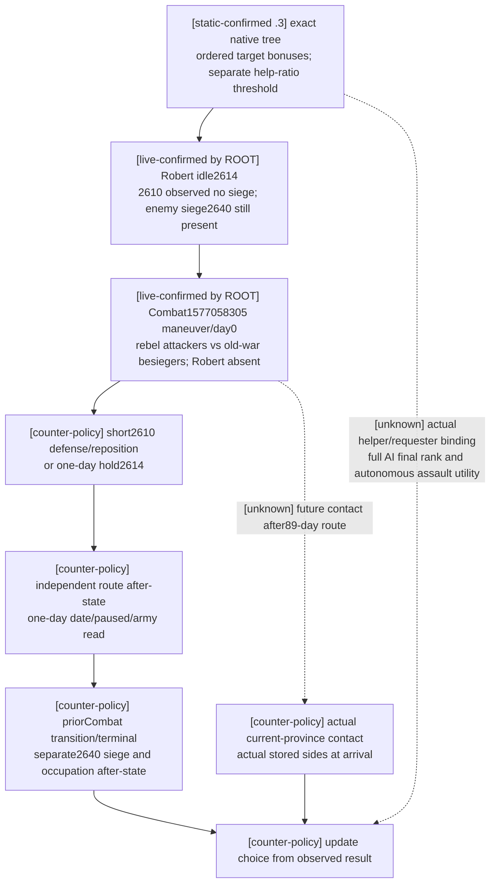

# CK3 1.20.0.3：拒绝派系要求后的解围与接战选择

2026-10-03 FILE-ONLY 增量，先复用[当前原生解围／围城树](war-relief-siege-native-ai-12003.md)，再消费 ROOT 的真实暂停包。实际 build 为 CK3 1.20.0.3 / Steam25652598，EXE SHA-256 `94B55397ABB687A3DCD436805A5D885E6BE90FA6C693FEB44A9E3BBEEADE02A6`。本包不操作游戏、SDK、pipe、窗口、Git或共享源码，也不重跑已有 GREEN。

**当前建议是短程转向2610防守，并只推进一日后重新观察2640；留在2614观察一日也有清楚的后态。** 这是原生树落盘后的最小自方策略推论。2640当前是两组敌军互相交战，不是已被罗贝尔加入的友军救援战；它的路线预览需要89日。没有新增完整评分实现或决策门禁。

## 原生奖励与求援阈值分开消费

以下 exact 消费及 stock 值由既有 [exact-proof.json](research-plans/war-relief-siege-12003/exact-proof.json) 冻结；这次没有重新提取 EXE。

| 原生机制 | 已闭合的 `.3` 消费 | 当前策略能说什么 |
| --- | --- | --- |
| 同目标的战术奖励 | `0x1A140C0` 内按“已经围城500 → 会解围190 → 会接战80 → 会开始围城70”互斥选择 | 同时满足解围与接战时，这个局部项为190，不能加成270；实际2640的目标info flags未读取，不能自行断言该局部项已命中 |
| 离开／继续自己的围城 | 继续项80；破围成本为原生比率乘−100且比率严格>0.5 | 罗贝尔当前 regular2614、无围城行为，不凭敌方 Siege318767158创建“离开自己的围城”成本 |
| 求援进度阈值 | `0x19F2AAA`取progress；`0x19F2ABB..19F2AD3`以**>=0.6**选择1.7，否则1.5 | 这是求援路径中的另一个比率选择，不是目标奖励，也不代表必需军力／胜率。完整 helper/requester、跨stack比较与顺序尚未在 `.3`闭合；本帧没有给罗贝尔读取实际求援绑定 |
| 强攻 | 完整原生 CanStart/CanStop 与 current eligible 预览 | 当前 enemy-owned siege的CanStart=false；breach2不覆盖完整 validator。自主 AI 强攻欲望仍为research |

敌方当前围城 progress44.133%不自动成为罗贝尔的“求援比率1.5”输入。本包对 `actual_robert_help_ratio`保留未赋值，并明确缺的是对应实际 helper/requester 输入归属；这不阻断短程移动或一日观察。未闭合原生全排序、求援协调和 assault utility仍是质量账本。

## 真实暂停输入

ROOT 的 `war-movement/actual-post-refusal-v34-01`冻结 public revision2/native11、raw53236608；随后 `war-battle-phase/actual-battle-transition-v34-01`冻结 public2/native16、同raw53236608。Actor29829，episode `native-29829-2bc2d599f7f9`，paused=true。相同日期不把不同 native revision改写为同一快照。

| 对象 | 真实读数 | 战术意义 |
| --- | --- | --- |
| Robert CUnit83886367 | regular2614、controllable、empty route、in_combat=false、retreating=false；先前同日军力2334 | 当前可移动主体，未参加2640战斗 |
| War16777231 | Robert defender、目标2610、relative score−39 | 2610 occupation_observable=true且未占领，siege_observable=true/active_siege=null；去此处是防守／调位，没有自方 siege 进度 |
| War50331736 与 War129 | Robert defender、目标2640、各score0 | 同一个目标省份共享同一个物理围城观察；不能算两份围城收益 |
| 2640 Siege318767158 | besieger50331920、player_army_besieging=false、progress44133/100000、current275.836、total625、remaining349.164 | siege对象仍存在。eligible0、days_left=null、assault=false、CanStart=false、CanStop=false；null不是0日，无 siege 不能由eligible0推断 |
| Actual Combat1577058305@2640 | maneuver/day0、winner/forced_winner=none、finalized=false、BattleResultID1493172226 | 当前战斗身份与阶段已读；有resultID不等于已有结果 |

ID-only transition的**实际stored order**如下；人数来自较早同日 native11 strengths，单独保留其来源，不当作native16重新统计。

| 实际战斗侧 | 实际 CUnit stored order | Robert战争成员关系 | 较早同日人数 |
| --- | --- | --- | ---: |
| attacker side0 | `[251658381,473,474]`，owner70766 | Robert的War50331736敌方 | 3190 |
| defender side1 | `[50331920,83886484]`，owner30097/35357 | Robert的War16777231敌方 | 1664 |
| Robert | 不在任一实际侧 | 同时参加三场防守战争 | 2334 |

这证明目前是两组Robert敌军互战；它没有查询CCombat→War绑定。地理上4854敌兵不能合成“玩家将与4854同一侧敌军交战”。此前v2 hypothetical 请求的 attacker Robert／defender rebel列表也不能冒充实际战斗两侧。到达时是否加入现有战斗、另有接触或无接触，必须由到达帧的 actual-contact消费，不能从本帧预填。

## 最小选择与独立后态

路线算法与实现由[移动专题](war-movement-1.20.0.3-readiness-2026-10-03.md)负责；这里只消费已冻结实际结果。2610完整预览route`[2610]`，arrival raw53236776，即7日；2640完整预览11省，arrival raw53238744，即89日。两个all-seven-hostile query都仅证明raw`[53236608,53236632]`下一日contact-free，不证明整条路线或89日后的战斗。

| 选择 | 当前依据 | 下一段独立验证 |
| --- | --- | --- |
| **短程转向2610防守／调位** | 目标未占领且无siege；路线7日；自身没有破围成本。可以在推进时继续观察敌军互战 | move后独立paused snapshot读取83886367的destination2610和实际committed route，或已到2610。随后只推进一日，读取date+24、paused、当前位置／route／combat／retreat；不要求一日立即到达 |
| 原地2614观察一日 | ActualCombat刚处maneuver/day0；互战可能改变siege或参与者，但结果未明 | date+24/paused、player仍位于期望位置；重读priorCombat1577058305与2640 siege/occupation，分别记账 |
| 长程解围2640 | 合法预览存在，但当前battle/siege窗口不能外推89日 | 若ROOT选择该路，order后读实际route；每一日更新battle/siege与movement输入，再决定后续。不写“当前敌军互战=玩家必然增援” |
| 推进自方2610围城 | 当前没有该行为 | 不能报围城推进；未来真实出现owned siege后再读取完整输入 |
| 强攻2640 | 完整native CanStart=false且玩家不围此siege | 当前不提交强攻。将来owned siege和CanStart=true后，才按已有启停接口读取同province/fullSiegeID的active flag及一日work/eligible/occupation |

解围成功另有后态：2640必须重读occupation、active_siege完整身份、besieger和eligible/progress/days；旧siege消失可能伴随换围或敌占，不能只用战斗开始、eligible0或旧SiegeID消失发放“已守住目标”信用。战斗结束另有后态：registered transition读取priorCombat；若不再可用，走现有terminal transition，读取terminal身份／结果以及幸存军队的retreat状态。没有winner不能补造胜利。

当前 actual-contact query只接受subject的**实际当前省份**。Robert在2614时先前专题的 `subject83886367,target2640`只能是将来抵达后的recipe；远程现在执行会因 `subject_not_at_target`不可用。到达时调用 `ck3_query_actual_contact_scope(subject_army_id=83886367,target_province_id=<actual current>,expected_revision=R)`，再读battle control或实际CombatID transition；存储顺序和side以该帧原生值为准。

## 证据与readiness

机器增量 [tactical-delta-20261003.json](research-plans/war-relief-siege-12003/tactical-delta-20261003.json)逐一保存8份ROOT实际包的绝对路径、SHA-256和byte count、actual两侧、snapshot版本、选择与后态。消费时检查actor/date/build、实际side顺序和目标siege身份；没有运行新测试、重跑旧GREEN或新增SDK实现。

ROOT的当前battle身份／side与objective siege观测是production-live primitive；本包提供已落盘原生树之后的策略推论与registered recipe，不新增执行信用。短程调位／一日／battle终态／解围结果均未由本lane执行，因此不称production-live loop或complete。日报／周报字段在DELTA receipt及机器包中，ROOT负责合入统一报告、提交和推送。

## 2026-10-03: later Root movement result

The earlier candidate/recommendation frame above is retained. Root subsequently completed the paused order to2610 and independent target/route readback; see the [dated actual synthesis](robert-post-refusal-military-actual-2026-10-03.md) and [movement postconditions](war-movement-1.20.0.3-readiness-2026-10-03.md). Current province remains2614, with target2610/route`[2610]`, moving; no day or arrival is credited. The first actual one-day slice remains pending. This dated result supersedes earlier pending Root-order wording while preserving each author's zero-action fact.
