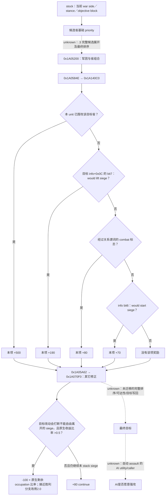

# CK3 1.20.0.3：解围、自方围城与强攻的选择输入

2026-10-03。本包是离线原生研究与既有实机证据复用，readiness 为 **research**；没有修改生产策略、构建桥、调用游戏或新增 Robert live 信用。ROOT 提供的当前入口是 actor29829、episode `native-29829-2bc2d599f7f9`、raw53236608：防守战争目标2640正被敌军50331920／83886484围攻，自军83886367位于2614；另一战争目标2610，玩家相对分数-39。这些是协调者传入的定位基线，本文没有把它们冒充本包的新实读。

本机实际安装为 **CK3 1.20.0.3 Crozier / Steam25652598**；EXE为101039736 bytes，SHA-256 `94b55397abb687a3dcd436805a5d885e6be90fa6c693feb44a9e3bbeeade02a6`。本包直接读取 `Z:/SteamLibrary/steamapps/common/Crusader Kings III/`，不采用仓库旧游戏参考树。独立[研究图](research-plans/war-relief-siege-12003/native-tree.md)、[研究记录](research-plans/war-relief-siege-12003/plan.json)与[精确证据](research-plans/war-relief-siege-12003/exact-proof.json)保存当前指令、define注册/消费槽和证据层次。提取器只校验文件身份、定位及指令边界，人工解释负责下面的分支结论；未执行机器码。

## 原生选择树：先分清评分层与行动层

当前原版战争立场文件仍区分 attacker/defender 与 stronger/weaker/desperate。`defender_offensive` 和 `defender_defensive` 都先给战争目标省500；战争目标/主防守方领地内敌军省250。较弱防守立场还给 defend-wargoal100，其余敌地30；较强防守立场给敌地100。末块 `defend_wargoal_province=5` 是可接受不触发围城/接战目标的回退。**-39不是本包已证的原生 desperate 判定**：当前战争侧、领地规模与原生立场选择均需真实输入，不能从总分单独命名。

本包闭合 `.3` 的评分消费链：`0x1A05200` 的 `0x1A0584E` 调用局部评分 `0x1A140C0`，`0x1A05A62` 调用军团与目标修正 `0x1A070F0`。全部地址为RVA。更外层 `.3` 候选去重、共池排序和最终分配没有在本包重新迁移；旧[1.19目标分配树](war-film-target-selection-2026-09-23.md)只作为具体施工入口，不能直接写成当前版本实证。

`0x1A140C0` 的 **500／190／80／70是有序互斥分支**，不是四项全加：

`0x1A14262..0x1A142EF` 先检查 current-unit siege，继而检查bit7、combat布尔、bit6，每条成立后跳到同一记分出口。因此“2640可解围且会接战，所以+190+80=270”错误。info的全部生产分支与每个raw标志的构造仍未闭合；本包保留名称的stock语义和当前消费字节，不对玩家现状自行填写true。

| 当前define／值 | `.3` 存储槽 | 当前精确消费 |
|---|---|---|
| `TARGET_SCORE_IS_SIEGING=500` | `0x5C68734` | `0x1A14275`；当前unit围同省的首分支 |
| `TARGET_SCORE_WOULD_LIFT_SIEGE=190` | `0x5C68728` | `0x1A14290`；未命中首分支后检查info bit7 |
| `TARGET_SCORE_WOULD_START_COMBAT=80` | `0x5C6872C` | `0x1A142AA`；未命中前两项 |
| `TARGET_SCORE_WOULD_START_SIEGE=70` | `0x5C68720` | `0x1A142C6`；未命中前三项 |
| `TARGET_WILL_BREAK_ONGOING_SIEGE=-100` | `0x5C686A4` | `0x1A0820D`；int32先转Q100000，再乘原生比率 |
| `TARGET_WILL_CONTINUE_ONGOING_SIEGE=80` | `0x5C686A0` | `0x1A08425/48E/4F6`；同一继续奖励及breakdown写入，不能加三次 |
| `APPLY_TARGET_WILL_BREAK_ONGOING_SIEGE_RATIO=0.5` | `0x5C686A8` | `0x1A081DF..1A081EB` 的 signed `cmovg`；严格大于 |
| `CLOSE_TO_VICTORY_WAR_SCORE=80` | `0x5C686B0` | `0x1A071AD` 的 `setge` |
| `CLOSE_TO_VICTORY_REMAINING_OCCUPATION_WAR_SCORE=20` | `0x5C686B4` | `0x1A071B9` 的 `jl` 失败分支 |
| `CLOSE_TO_VICTORY_REMAINING_OCCUPATION_MULTIPLIER=2.0` | `0x5C686B8` | `0x1A072FC`；上述80与20同时成立时采用 |
| `MAX_DAYS_LEFT_TO_LIFT_SIEGE_WITHOUT_SIEGE_WEAPONS=30` | `0x5C68770` | `0x1A1BAED..1A1BAF3`；signed `setg`，**>30** |
| `BREAK_SIEGE_TO_HELP_PROGRESS_THRESHOLD=0.6` | `0x5C68558` | `0x19F2ABB..19F2AD3`；signed `cmovge`，**>=0.6**改用1.7，平常1.5 |

30日特例只是 `0x1A1B9B0` 完整“可否离开此siege”分支的一部分。它还读真实siege、当前/移除该subunit后兵力与驻军、主围攻CArmy身份、同stack成员及另一subunit的器械。原版注释写“equal or higher”，当前机器指令却严格>30；不能用注释覆盖指令，也不能把它扩成“所有围城都必须等31天才可离开”。其器械helper `0x1A1E7A0`沿subunit CUnit→CArmy→regiment读取type `+0x2A0>0`，并未在该段按当前eligible人数筛选；这和公开province `besieging_strength`、有效siege contribution分开记账。

求援进度0.6这一消费发生在 `.pdata` 片段 `0x19F29D0..0x19F2ADB` 中，`0x19F2AAA`调用已闭合progress getter `0x251C9C0`。本包只迁移“选1.5还是1.7”的条件；完整跨stack求援分母、顺序与helper选择不从旧版本推到 `.3`。

## 普通围城与强攻：复用第三期已有证据

[普通推进](episode03-siege-progress-1.20.0.3.md)、[强攻合法性](episode03-assault-1.20.0.3.md)及[William刘易斯实读](episode03-william-lewes-live-2026-10-03.md)已闭合当前EXE的底层入口，本文不重复该GREEN。

普通剩余天数来自 `0x251CB00`，不是对“兵数÷驻军”外推；总工作量会随当前驻军/有效最大驻军变动。`days_left=null`是当前不可用/受阻，不是0日。普通日速 `0x251F170`、总量 `0x251DD20`、fort影响 `0x251FD60` 已有exact公式；普通日速尚未独立发布在标准JSON。仅比较围城现在的剩余天数或安排一日观察，不要求新增这个字段。

强攻合法性使用完整原生start `0x29738C0` 与stop `0x2973A70`，读full SiegeID、breach、blocked、besieger actor，不能由 `breach>0` 代替。强攻日work／预计损失是 `0x25207F0`／`0x25205C0`，当前eligible兵力输入。breach1/2损失define为2.5%/1%，work按100人chunk向上取整并受驻军比率影响；一日预览不能线性外推整场完成时长或累计伤亡。

William样本已观察同Siege6启停，一日raw53147592→53147616，eligible6746→6578，current work52.08→68.46；起点强攻预览13.6work／168人，实际总work净+16.38。结果仍按既有边界：总work包含其它变化，净人数不是逐团死因账本，随后的城破由普通围城完成。这个事实证明**玩家原生动作与一日结果**，不证明原生AI会选择强攻或Robert当前可强攻。

本包当前EXE direct-call定位找到start围城谓词的调用者 `0xCDE4D0`、`0xCDE560`、`0x1436930` 与完整validator，未闭合一个“AI根据预计损失/剩余天数决定强攻”的caller。未找到direct call不证明AI从不强攻：间接调用、command构造路径与业务所属仍待闭合。具体下一入口是追 `0x1436930` 的调用/虚表归属及kind0x0E构造/提交链；不要把GUI/玩家legal predicate命名成AI欲望函数。

## 已注册查询与当前功能 readiness

下面是 `Z:/g35` 生产源码中现有注册方式；本包没有调用MCP，实际使用前由ROOT以加载中的工具清单/capabilities选择。`R`始终来自当前暂停帧，不能照搬raw53236608上的revision。

| 目的 | 已注册recipe | 所得输入／边界 |
|---|---|---|
| 最小战争与目标帧 | `ck3_take_snapshot(include_native_command_history=false)`；`ck3_get_war_state()` | 战争侧、goal province、occupation、fort、garrison、eligible、current/total/progress、days、assault子域与军队状态；目标集合是该战争的有限投影 |
| 2640的当前军力 | `ck3_query_army_strengths(army_ids=[83886367,50331920,83886484],expected_revision=R)` | 当前人数与AI base power；base power不是胜率 |
| 解围是否形成实际接触及哪一侧 | `ck3_query_actual_contact_scope(subject_army_id=83886367,target_province_id=2640,expected_revision=R)` | 现在的接触集合／现有combat侧；未来到达需再读，非接敌保证 |
| 主军现在是否已在战斗／撤退 | `ck3_query_battle_control_snapshot_v1(subject_army_id=83886367,expected_revision=R)` | 现有battle与retreat gates；不能由地图坐标推断 |
| native AI帮忙状态（如确有相应对象） | `ck3_query_battle_reinforcement_assignment_v1(selected_public_cunit_id=83886367,expected_revision=R)` | 原生asking/assigned及现有目标；玩家没有对应AI对象时合法unavailable，不当作无需增援 |
| 实际已选route的接触时限 | 通用 `ck3_execute_step` 的 `query-route-contact-horizon-v1-83886367-to-2640-h-2-50331920-83886484`，仅实际capability可用时 | 查询当前route语义；route建立、preview、ETA和行动归movement包，本包不重新实现 |
| 当前强攻输入 | 上述snapshot中的 `active_wars[].objective_province_states[].active_siege` | 同一目标/full SiegeID的breach、active、can_start/can_stop、日work和损失 |
| 已存在强攻动作 | `ck3_start_assault(siege_id=S,expected_revision=R)` / `ck3_stop_assault(...)` | 本包只记已有接口；applied需同War/Province/full SiegeID的paused flag切换 |

`.3`默认descriptor继承现有objective siege/assault；它**未广告**历史 `game.command.query-province-local-siege-v1-N`。Python有parser不能当作当前端口已部署。若2640／2610已在各自战争目标投影内，直接复用现有快照，不新增local查询。确有当前决策目标在投影外时，最小入口是把现有 `ReadObjectiveProvince` 与省ID定位复用到同一 `.3` descriptor/MCP，补一个指定province的暂停只读查询；一并保留occupation/no-siege sentinel与full SiegeID。

最低功能选择与完整原生模仿分别记账：

| 功能选择 | 最小必要观测 | 本包状态／具体缺项处理 |
|---|---|---|
| 先解2640的围 | 当前该war/goal确属Robert防守利益、敌方active siege及days、主军当前可行动、当前接触风险输入；到达窗口由movement包 | 本包只有ROOT定位基线，没有同帧详细数值；先现有query补齐，若目标行不在投影才施工local reader。无需先重建全部AI评分 |
| 先推进2610自方围城 | 2610现在能否围攻／已由我方围攻、该war当前侧与占领状态、当前siege进度/days、解围机会窗口 | -39只提供战争紧迫性语境，不证明该省可围攻，也不决定与2640的优先级；无需普通D即可读当前days |
| 合法的一日强攻切片 | 我方owned active siege、完整observable子域、native can_start=true、日损失在本次自定预算内、下一日联系窗口来自现有query | 可复用现有接口；仍需当前Robert值。观察下一暂停帧的日期、work、eligible、identity/occupation，继续/停止重新决策 |
| 精确复制原生relief/own-siege全排序 | 真实stance、所有目标info生产flags、完整pair评分、occupation剩余/cap、原生subunit关系和最终selector | research：本包给出消费RVA；下一项沿 `0x1A0584E`输入生产及 `0x1A05A62`前的coordinator读取闭合。这是质量差距，不是最小功能决策前置门禁 |
| 精确比较强攻整场ETA／累计损失 | 普通D、最大驻军、未来参与者/变化；当前投影不足以保证未来 | 仅research；明确需要完整预测时再扩当前province reader调用 `0x251F170`及已知total/garrison链。一日切片可先交付，不等待此项 |

## 原生树之后的最小自方策略

本包不写生产策略。供ROOT的counter-policy入口是：用真实goal归属和对方siege完成窗口决定2640是否紧迫，再用既有接触/军力与movement包结论判断一次解围是否有可验证价值；仅当该窗口允许，才比较2610的现有围城。无自方active siege时不存在“离开自己的围城”成本；单军位于2614不能自行补造ongoing siege。

强攻只采用可观察的一日收益/损失切片，预览变化后重新决策。这与未闭合的原生AI assault utility有明确差异；没有复制500/190/80/70成玩家硬阈值，也不把缺失的完整native rank扩成停止实机的理由。ROUTE与BATTLE生产者各自负责它们的真实字段；本文只消费其结果，不复制movement route或battle damage算法。

验证范围：离线读取当前stock与EXE一次最终冻结，人工审阅本包关键消费段；复用第三期旧GREEN，不重跑游戏或离线合同测试。`native_research_plan.py check/render`只检查本记录结构/文件一致性。`open_kaishek`为not-applicable：此次是PE指令与只读接口账本，没有其parser/finite runtime能覆盖的新增脚本语义。没有新增游戏日、动作、物质收益、save、cold或完整战争OODA。日报/周报合并字段由ROOT-DELIVERY提供给统一协调者，本包不并写共享报告。

## 2026-10-03 v41：首批 explicit 一日围城终态与 fresh recovery

v41/g43/cd5 的 explicit64 工作包实际在44rounds终止：44个真实24h区间正常保存，whole一日OODA43轮。day44 postoccupation005返回 `war-occupation completion snapshot changed`，overallRED/`actual_observation_attempt_failed_requires_root`；实际advance24h、独立frame、strength006、normal save008仍GREEN。原RED与44saved-calendar一并保留，44bounded仅时间/保存契约，不称whole44，不代表64budget完成。

末批normal h5220/raw53239392/91415325B/SHA `3685d2054de7ac66b7f0892259017e585eb0b33ced2295ab45ee2606bf824369`；own83886367在2604 sieging3/targetnull/emptyroute、非combat/退。最后可用rich目标实际binding是raw53239368/native178/public175，距final24h且matches_final=false：work19795270/32500000，fraction60908/100000（60.908%），ETA61，B2269，同S503316492/CUnit83886367，仍敌占30097、breach0/CanStartfalse。该row不能冠名h5220同帧afterrich或当前assault合法性。

Root RECOVERY_READY后独立 SDK15784/exit0/normalclose capture 的004同MCP occupation查询 GREEN，绑定 native183/public2/connectiongeneration4/raw53239392、原 episode `native-29829-2bc2d599f7f9`。003查询前frame与005独立save前frame一致，query绑定当前frame：35完整rows、17 opposing occupied、target2604仍敌方30097占领。当前FullSiege503316492/public CUnit83886367/playertrue，work20004730/32500000、remaining12495270、fraction61553/100000（61.553%）、ETA60、B2269、fort3/garrison400、breach0/wallsfalse、assaultinactive、CanStart/Stopfalse。own83886367仍sieging3/current2604/targetnull/emptyroute、非combat与退。独立normal save h5222/raw53239392/91415325B/SHA `73a2a691e3392165bc1589468a422cd6d4f517ba776c23f2fb76e2644b723e09`。

恢复当前只读输入是 production-live primitive，不改写原batch day44 post005 RED或旧rich raw53239368，不重放44日，也不反向增加 whole OODA。此前43个完整 normal循环与44保存时间区间保留为有限 production-live loop/实际时间事实；累计3961/36524、resume808、Oct3增量713不变，此恢复新增0日。当前rich可作Root下一normal采样输入；ETA并非承诺完成日期，无assault执行、收复或玩家胜利。当前game仍v41/PID62988/controller5116；v42/g44/dafba6b C1061 nativebuild RED与exact-source CI GREEN属于另一owner的独立施工，不作为当前v41继续策略的等待条件。

复用原生树，不新建树或helper gate。calendar/wholeOODA边界见 [行军与时间账](army-march-remaining-timeline-12003.md)，holding输入见 [rich siege observer](war-occupation-holding-siege-observation-12003.md) 与 [occupation targets](war-occupation-targets-12003.md)。真实冻结回执：`Z:/ck3_mod_rewrite_process_assets/g2-resume-20261003/military-ooda-continuation/siege-v41/terminal-consumption/ROOT-TERMINAL-DELIVERY.json`、`Z:/ck3_mod_rewrite_process_assets/g2-resume-20261003/military-ooda-continuation/siege-v41/terminal-consumption/COMPACT-TERMINAL-STATE.json`、`Z:/ck3_mod_rewrite_process_assets/g2-resume-20261003/military-ooda-continuation/siege-v41/terminal-consumption/recovery-current/ROOT-RECOVERY-DELIVERY.json` 及同目录 `NATIVE-TOPIC-APPEND.md` / `ROOT-DAY-WEEK-APPEND.md`。此文件lane无SDK、窗口、游戏、共享文件、Git或测试动作；后续实际legalassault/recapture/combat/event由Root按新实机后置状态单独记录。

## v43: 32 bounded capital2640 transit rounds; enemy siege still active

The existing [native remaining-timeline topic](army-march-remaining-timeline-12003.md) records Root's once-consumed 32 GREEN one-day transit rounds, raw53240136→53240904 (+768h), normal h5489 / 91525906 bytes / SHA-256 `78577dea427e8f2c0e0611308057a0cc758ec8fdc344cf27df365aece7a64351`. Saved calendar32, bounded time/save32 and complete one-day OODA32 are separate counters; cumulative4024 / resume871 / Oct3 776. This document adoption adds0 days.

At the independent final native:139/public129 paused frame, Robert CUnit83886367 remains moving7 at2616 toward2640 with complete nine-edge stored route, no combat/retreat and no actual arrival. The same-frame enemy FullSiege318767158 remains active at2640, progress95.169%, native ETA18 days, strength2508, fort7/garrison1350/breach2, CanStartAssault=false. Wars50331736 and129 repeat that one SiegeID; do not sum them as two sieges. `is_occupied=false` does not establish relief. No arrival, player contact, siege removal or war victory is credited.

The last canonical army ETA is separately bound before day32 at raw53240880: arrival53242968, 2088h/87 rounded days at that query frame, 24h older than the terminal. It is not a fresh after-day32 ETA. Only6 rounds queried fresh strength, and day32 has none; no same-frame strength is invented. Continue from Root's separate zero-day read/save pair and hand off first actual player combat to the battle owner. Relief requires a fresh observable enemy-siege state with actual active_siege removal.

Existing frozen consumer: `Z:/ck3_mod_rewrite_process_assets/g2-resume-20261003/military-ooda-continuation/relief-v43/terminal-consumption/ROOT-DELIVERY.json`. Readiness is the scoped production-live retained-route one-day action/observation/save loop; relief remains unobserved. No additional SDK, source research, raw consumption, test, window action or policy change is introduced by this append.
