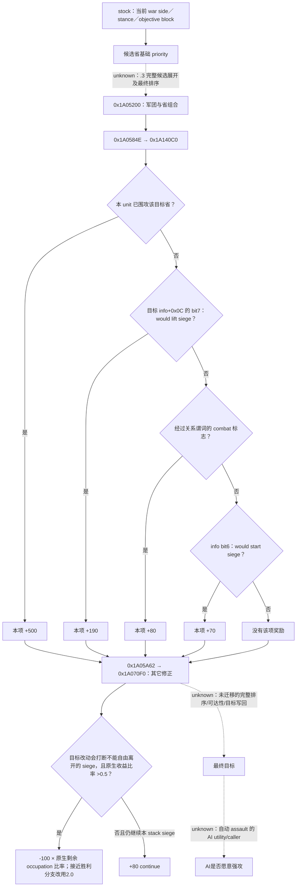

# CK3 1.20.0.3：解围、自方围城与强攻的选择输入

2026-10-03。本包是离线原生研究与既有实机证据复用，readiness 为 **research**；没有修改生产策略、构建桥、调用游戏或新增 Robert live 信用。ROOT 提供的当前入口是 actor29829、episode `native-29829-2bc2d599f7f9`、raw53236608：防守战争目标2640正被敌军50331920／83886484围攻，自军83886367位于2614；另一战争目标2610，玩家相对分数-39。这些是协调者传入的定位基线，本文没有把它们冒充本包的新实读。

本机实际安装为 **CK3 1.20.0.3 Crozier / Steam25652598**；EXE为101039736 bytes，SHA-256 `94b55397abb687a3dcd436805a5d885e6be90fa6c693feb44a9e3bbeeade02a6`。本包直接读取 `Z:/SteamLibrary/steamapps/common/Crusader Kings III/`，不采用仓库旧游戏参考树。独立[研究图](research-plans/war-relief-siege-12003/native-tree.md)、[研究记录](research-plans/war-relief-siege-12003/plan.json)与[精确证据](research-plans/war-relief-siege-12003/exact-proof.json)保存当前指令、define注册/消费槽和证据层次。提取器只校验文件身份、定位及指令边界，人工解释负责下面的分支结论；未执行机器码。

## 原生选择树：先分清评分层与行动层

当前原版战争立场文件仍区分 attacker/defender 与 stronger/weaker/desperate。`defender_offensive` 和 `defender_defensive` 都先给战争目标省500；战争目标/主防守方领地内敌军省250。较弱防守立场还给 defend-wargoal100，其余敌地30；较强防守立场给敌地100。末块 `defend_wargoal_province=5` 是可接受不触发围城/接战目标的回退。**-39不是本包已证的原生 desperate 判定**：当前战争侧、领地规模与原生立场选择均需真实输入，不能从总分单独命名。

本包闭合 `.3` 的评分消费链：`0x1A05200` 的 `0x1A0584E` 调用局部评分 `0x1A140C0`，`0x1A05A62` 调用军团与目标修正 `0x1A070F0`。全部地址为RVA。更外层 `.3` 候选去重、共池排序和最终分配没有在本包重新迁移；旧[1.19目标分配树](war-film-target-selection-2026-09-23.md)只作为具体施工入口，不能直接写成当前版本实证。

`0x1A140C0` 的 **500／190／80／70是有序互斥分支**，不是四项全加：

`0x1A14262..0x1A142EF` 先检查 current-unit siege，继而检查bit7、combat布尔、bit6，每条成立后跳到同一记分出口。因此“2640可解围且会接战，所以+190+80=270”错误。info的全部生产分支与每个raw标志的构造仍未闭合；本包保留名称的stock语义和当前消费字节，不对玩家现状自行填写true。

| 当前define／值 | `.3` 存储槽 | 当前精确消费 |
|---|---|---|
| `TARGET_SCORE_IS_SIEGING=500` | `0x5C68734` | `0x1A14275`；当前unit围同省的首分支 |
| `TARGET_SCORE_WOULD_LIFT_SIEGE=190` | `0x5C68728` | `0x1A14290`；未命中首分支后检查info bit7 |
| `TARGET_SCORE_WOULD_START_COMBAT=80` | `0x5C6872C` | `0x1A142AA`；未命中前两项 |
| `TARGET_SCORE_WOULD_START_SIEGE=70` | `0x5C68720` | `0x1A142C6`；未命中前三项 |
| `TARGET_WILL_BREAK_ONGOING_SIEGE=-100` | `0x5C686A4` | `0x1A0820D`；int32先转Q100000，再乘原生比率 |
| `TARGET_WILL_CONTINUE_ONGOING_SIEGE=80` | `0x5C686A0` | `0x1A08425/48E/4F6`；同一继续奖励及breakdown写入，不能加三次 |
| `APPLY_TARGET_WILL_BREAK_ONGOING_SIEGE_RATIO=0.5` | `0x5C686A8` | `0x1A081DF..1A081EB` 的 signed `cmovg`；严格大于 |
| `CLOSE_TO_VICTORY_WAR_SCORE=80` | `0x5C686B0` | `0x1A071AD` 的 `setge` |
| `CLOSE_TO_VICTORY_REMAINING_OCCUPATION_WAR_SCORE=20` | `0x5C686B4` | `0x1A071B9` 的 `jl` 失败分支 |
| `CLOSE_TO_VICTORY_REMAINING_OCCUPATION_MULTIPLIER=2.0` | `0x5C686B8` | `0x1A072FC`；上述80与20同时成立时采用 |
| `MAX_DAYS_LEFT_TO_LIFT_SIEGE_WITHOUT_SIEGE_WEAPONS=30` | `0x5C68770` | `0x1A1BAED..1A1BAF3`；signed `setg`，**>30** |
| `BREAK_SIEGE_TO_HELP_PROGRESS_THRESHOLD=0.6` | `0x5C68558` | `0x19F2ABB..19F2AD3`；signed `cmovge`，**>=0.6**改用1.7，平常1.5 |

30日特例只是 `0x1A1B9B0` 完整“可否离开此siege”分支的一部分。它还读真实siege、当前/移除该subunit后兵力与驻军、主围攻CArmy身份、同stack成员及另一subunit的器械。原版注释写“equal or higher”，当前机器指令却严格>30；不能用注释覆盖指令，也不能把它扩成“所有围城都必须等31天才可离开”。其器械helper `0x1A1E7A0`沿subunit CUnit→CArmy→regiment读取type `+0x2A0>0`，并未在该段按当前eligible人数筛选；这和公开province `besieging_strength`、有效siege contribution分开记账。

求援进度0.6这一消费发生在 `.pdata` 片段 `0x19F29D0..0x19F2ADB` 中，`0x19F2AAA`调用已闭合progress getter `0x251C9C0`。本包只迁移“选1.5还是1.7”的条件；完整跨stack求援分母、顺序与helper选择不从旧版本推到 `.3`。

## 普通围城与强攻：复用第三期已有证据

[普通推进](episode03-siege-progress-1.20.0.3.md)、[强攻合法性](episode03-assault-1.20.0.3.md)及[William刘易斯实读](episode03-william-lewes-live-2026-10-03.md)已闭合当前EXE的底层入口，本文不重复该GREEN。

普通剩余天数来自 `0x251CB00`，不是对“兵数÷驻军”外推；总工作量会随当前驻军/有效最大驻军变动。`days_left=null`是当前不可用/受阻，不是0日。普通日速 `0x251F170`、总量 `0x251DD20`、fort影响 `0x251FD60` 已有exact公式；普通日速尚未独立发布在标准JSON。仅比较围城现在的剩余天数或安排一日观察，不要求新增这个字段。

强攻合法性使用完整原生start `0x29738C0` 与stop `0x2973A70`，读full SiegeID、breach、blocked、besieger actor，不能由 `breach>0` 代替。强攻日work／预计损失是 `0x25207F0`／`0x25205C0`，当前eligible兵力输入。breach1/2损失define为2.5%/1%，work按100人chunk向上取整并受驻军比率影响；一日预览不能线性外推整场完成时长或累计伤亡。

William样本已观察同Siege6启停，一日raw53147592→53147616，eligible6746→6578，current work52.08→68.46；起点强攻预览13.6work／168人，实际总work净+16.38。结果仍按既有边界：总work包含其它变化，净人数不是逐团死因账本，随后的城破由普通围城完成。这个事实证明**玩家原生动作与一日结果**，不证明原生AI会选择强攻或Robert当前可强攻。

本包当前EXE direct-call定位找到start围城谓词的调用者 `0xCDE4D0`、`0xCDE560`、`0x1436930` 与完整validator，未闭合一个“AI根据预计损失/剩余天数决定强攻”的caller。未找到direct call不证明AI从不强攻：间接调用、command构造路径与业务所属仍待闭合。具体下一入口是追 `0x1436930` 的调用/虚表归属及kind0x0E构造/提交链；不要把GUI/玩家legal predicate命名成AI欲望函数。

## 已注册查询与当前功能 readiness

下面是 `Z:/g35` 生产源码中现有注册方式；本包没有调用MCP，实际使用前由ROOT以加载中的工具清单/capabilities选择。`R`始终来自当前暂停帧，不能照搬raw53236608上的revision。

| 目的 | 已注册recipe | 所得输入／边界 |
|---|---|---|
| 最小战争与目标帧 | `ck3_take_snapshot(include_native_command_history=false)`；`ck3_get_war_state()` | 战争侧、goal province、occupation、fort、garrison、eligible、current/total/progress、days、assault子域与军队状态；目标集合是该战争的有限投影 |
| 2640的当前军力 | `ck3_query_army_strengths(army_ids=[83886367,50331920,83886484],expected_revision=R)` | 当前人数与AI base power；base power不是胜率 |
| 解围是否形成实际接触及哪一侧 | `ck3_query_actual_contact_scope(subject_army_id=83886367,target_province_id=2640,expected_revision=R)` | 现在的接触集合／现有combat侧；未来到达需再读，非接敌保证 |
| 主军现在是否已在战斗／撤退 | `ck3_query_battle_control_snapshot_v1(subject_army_id=83886367,expected_revision=R)` | 现有battle与retreat gates；不能由地图坐标推断 |
| native AI帮忙状态（如确有相应对象） | `ck3_query_battle_reinforcement_assignment_v1(selected_public_cunit_id=83886367,expected_revision=R)` | 原生asking/assigned及现有目标；玩家没有对应AI对象时合法unavailable，不当作无需增援 |
| 实际已选route的接触时限 | 通用 `ck3_execute_step` 的 `query-route-contact-horizon-v1-83886367-to-2640-h-2-50331920-83886484`，仅实际capability可用时 | 查询当前route语义；route建立、preview、ETA和行动归movement包，本包不重新实现 |
| 当前强攻输入 | 上述snapshot中的 `active_wars[].objective_province_states[].active_siege` | 同一目标/full SiegeID的breach、active、can_start/can_stop、日work和损失 |
| 已存在强攻动作 | `ck3_start_assault(siege_id=S,expected_revision=R)` / `ck3_stop_assault(...)` | 本包只记已有接口；applied需同War/Province/full SiegeID的paused flag切换 |

`.3`默认descriptor继承现有objective siege/assault；它**未广告**历史 `game.command.query-province-local-siege-v1-N`。Python有parser不能当作当前端口已部署。若2640／2610已在各自战争目标投影内，直接复用现有快照，不新增local查询。确有当前决策目标在投影外时，最小入口是把现有 `ReadObjectiveProvince` 与省ID定位复用到同一 `.3` descriptor/MCP，补一个指定province的暂停只读查询；一并保留occupation/no-siege sentinel与full SiegeID。

最低功能选择与完整原生模仿分别记账：

| 功能选择 | 最小必要观测 | 本包状态／具体缺项处理 |
|---|---|---|
| 先解2640的围 | 当前该war/goal确属Robert防守利益、敌方active siege及days、主军当前可行动、当前接触风险输入；到达窗口由movement包 | 本包只有ROOT定位基线，没有同帧详细数值；先现有query补齐，若目标行不在投影才施工local reader。无需先重建全部AI评分 |
| 先推进2610自方围城 | 2610现在能否围攻／已由我方围攻、该war当前侧与占领状态、当前siege进度/days、解围机会窗口 | -39只提供战争紧迫性语境，不证明该省可围攻，也不决定与2640的优先级；无需普通D即可读当前days |
| 合法的一日强攻切片 | 我方owned active siege、完整observable子域、native can_start=true、日损失在本次自定预算内、下一日联系窗口来自现有query | 可复用现有接口；仍需当前Robert值。观察下一暂停帧的日期、work、eligible、identity/occupation，继续/停止重新决策 |
| 精确复制原生relief/own-siege全排序 | 真实stance、所有目标info生产flags、完整pair评分、occupation剩余/cap、原生subunit关系和最终selector | research：本包给出消费RVA；下一项沿 `0x1A0584E`输入生产及 `0x1A05A62`前的coordinator读取闭合。这是质量差距，不是最小功能决策前置门禁 |
| 精确比较强攻整场ETA／累计损失 | 普通D、最大驻军、未来参与者/变化；当前投影不足以保证未来 | 仅research；明确需要完整预测时再扩当前province reader调用 `0x251F170`及已知total/garrison链。一日切片可先交付，不等待此项 |

## 原生树之后的最小自方策略

本包不写生产策略。供ROOT的counter-policy入口是：用真实goal归属和对方siege完成窗口决定2640是否紧迫，再用既有接触/军力与movement包结论判断一次解围是否有可验证价值；仅当该窗口允许，才比较2610的现有围城。无自方active siege时不存在“离开自己的围城”成本；单军位于2614不能自行补造ongoing siege。

强攻只采用可观察的一日收益/损失切片，预览变化后重新决策。这与未闭合的原生AI assault utility有明确差异；没有复制500/190/80/70成玩家硬阈值，也不把缺失的完整native rank扩成停止实机的理由。ROUTE与BATTLE生产者各自负责它们的真实字段；本文只消费其结果，不复制movement route或battle damage算法。

验证范围：离线读取当前stock与EXE一次最终冻结，人工审阅本包关键消费段；复用第三期旧GREEN，不重跑游戏或离线合同测试。`native_research_plan.py check/render`只检查本记录结构/文件一致性。`open_kaishek`为not-applicable：此次是PE指令与只读接口账本，没有其parser/finite runtime能覆盖的新增脚本语义。没有新增游戏日、动作、物质收益、save、cold或完整战争OODA。日报/周报合并字段由ROOT-DELIVERY提供给统一协调者，本包不并写共享报告。

## 2026-10-03 v41：首批 explicit 一日围城终态与 fresh recovery

v41/g43/cd5 的 explicit64 工作包实际在44rounds终止：44个真实24h区间正常保存，whole一日OODA43轮。day44 postoccupation005返回 `war-occupation completion snapshot changed`，overallRED/`actual_observation_attempt_failed_requires_root`；实际advance24h、独立frame、strength006、normal save008仍GREEN。原RED与44saved-calendar一并保留，44bounded仅时间/保存契约，不称whole44，不代表64budget完成。

末批normal h5220/raw53239392/91415325B/SHA `3685d2054de7ac66b7f0892259017e585eb0b33ced2295ab45ee2606bf824369`；own83886367在2604 sieging3/targetnull/emptyroute、非combat/退。最后可用rich目标实际binding是raw53239368/native178/public175，距final24h且matches_final=false：work19795270/32500000，fraction60908/100000（60.908%），ETA61，B2269，同S503316492/CUnit83886367，仍敌占30097、breach0/CanStartfalse。该row不能冠名h5220同帧afterrich或当前assault合法性。

Root RECOVERY_READY后独立 SDK15784/exit0/normalclose capture 的004同MCP occupation查询 GREEN，绑定 native183/public2/connectiongeneration4/raw53239392、原 episode `native-29829-2bc2d599f7f9`。003查询前frame与005独立save前frame一致，query绑定当前frame：35完整rows、17 opposing occupied、target2604仍敌方30097占领。当前FullSiege503316492/public CUnit83886367/playertrue，work20004730/32500000、remaining12495270、fraction61553/100000（61.553%）、ETA60、B2269、fort3/garrison400、breach0/wallsfalse、assaultinactive、CanStart/Stopfalse。own83886367仍sieging3/current2604/targetnull/emptyroute、非combat与退。独立normal save h5222/raw53239392/91415325B/SHA `73a2a691e3392165bc1589468a422cd6d4f517ba776c23f2fb76e2644b723e09`。

恢复当前只读输入是 production-live primitive，不改写原batch day44 post005 RED或旧rich raw53239368，不重放44日，也不反向增加 whole OODA。此前43个完整 normal循环与44保存时间区间保留为有限 production-live loop/实际时间事实；累计3961/36524、resume808、Oct3增量713不变，此恢复新增0日。当前rich可作Root下一normal采样输入；ETA并非承诺完成日期，无assault执行、收复或玩家胜利。当前game仍v41/PID62988/controller5116；v42/g44/dafba6b C1061 nativebuild RED与exact-source CI GREEN属于另一owner的独立施工，不作为当前v41继续策略的等待条件。

复用原生树，不新建树或helper gate。calendar/wholeOODA边界见 [行军与时间账](army-march-remaining-timeline-12003.md)，holding输入见 [rich siege observer](war-occupation-holding-siege-observation-12003.md) 与 [occupation targets](war-occupation-targets-12003.md)。真实冻结回执：`Z:/ck3_mod_rewrite_process_assets/g2-resume-20261003/military-ooda-continuation/siege-v41/terminal-consumption/ROOT-TERMINAL-DELIVERY.json`、`Z:/ck3_mod_rewrite_process_assets/g2-resume-20261003/military-ooda-continuation/siege-v41/terminal-consumption/COMPACT-TERMINAL-STATE.json`、`Z:/ck3_mod_rewrite_process_assets/g2-resume-20261003/military-ooda-continuation/siege-v41/terminal-consumption/recovery-current/ROOT-RECOVERY-DELIVERY.json` 及同目录 `NATIVE-TOPIC-APPEND.md` / `ROOT-DAY-WEEK-APPEND.md`。此文件lane无SDK、窗口、游戏、共享文件、Git或测试动作；后续实际legalassault/recapture/combat/event由Root按新实机后置状态单独记录。

## v43: 32 bounded capital2640 transit rounds; enemy siege still active

The existing [native remaining-timeline topic](army-march-remaining-timeline-12003.md) records Root's once-consumed 32 GREEN one-day transit rounds, raw53240136→53240904 (+768h), normal h5489 / 91525906 bytes / SHA-256 `78577dea427e8f2c0e0611308057a0cc758ec8fdc344cf27df365aece7a64351`. Saved calendar32, bounded time/save32 and complete one-day OODA32 are separate counters; cumulative4024 / resume871 / Oct3 776. This document adoption adds0 days.

At the independent final native:139/public129 paused frame, Robert CUnit83886367 remains moving7 at2616 toward2640 with complete nine-edge stored route, no combat/retreat and no actual arrival. The same-frame enemy FullSiege318767158 remains active at2640, progress95.169%, native ETA18 days, strength2508, fort7/garrison1350/breach2, CanStartAssault=false. Wars50331736 and129 repeat that one SiegeID; do not sum them as two sieges. `is_occupied=false` does not establish relief. No arrival, player contact, siege removal or war victory is credited.

The last canonical army ETA is separately bound before day32 at raw53240880: arrival53242968, 2088h/87 rounded days at that query frame, 24h older than the terminal. It is not a fresh after-day32 ETA. Only6 rounds queried fresh strength, and day32 has none; no same-frame strength is invented. Continue from Root's separate zero-day read/save pair and hand off first actual player combat to the battle owner. Relief requires a fresh observable enemy-siege state with actual active_siege removal.

Existing frozen consumer: `Z:/ck3_mod_rewrite_process_assets/g2-resume-20261003/military-ooda-continuation/relief-v43/terminal-consumption/ROOT-DELIVERY.json`. Readiness is the scoped production-live retained-route one-day action/observation/save loop; relief remains unobserved. No additional SDK, source research, raw consumption, test, window action or policy change is introduced by this append.

## same-frame enemy capital siege

At raw53241096, capital2640 is unoccupied with observable enemy Siege318767158 still active: public besieger473/player=false, current work60892200of62500000 Q100000, remaining1607800, progress97427/100000=97.427%, ETA10 days, strength2508, fort7/garrison1350, breach2, CanStart/CanStop=false and assault inactive. This is continuing siege observation, not capital relief or a battle result. Selected war rows repeat the same FullSiegeID, not multiple siege strengths. New CUnit167772189 is present in the final body at Province2618, typed state `regular`/1, controllable=True, route status `complete_empty`/0, target `None`, in_combat=False, retreating=False. Its snapshot soldiers field is `None`. Duplicate allied-war rows are the same CUnit, not additional armies.

### v47 双向真实会合预览与主军返2618接续（0新日）

Root明确选择主军赴小军驻省2618会合，驻2618军队无需新移动。下一步仅一次主军move→独立实际route→正常SAVE，然后用外部counter helper最多10个显式单日循环。route endpoint为2618，独立occupation watch仍为首都2640；relief角色遇首次真实首都失陷保存交接，之后Root可依据原生counter树显式选择recapture，不需重新请求战争授权。任意当前己方CUnit实际接战交接真实subject到既有battle helper。

随后Root SDK45817已全部GREEN并正常关闭：004仅一次`move-army-83886367-to-2618`，005独立war ownroute，007正确完整6-hostile route-contact-horizon，008独立最终快照，009正常SAVE。最终同raw53241096/native22/public3：83886367仍在8754/moving7，target2618真实可见，complete_nonempty/sourcecount3且route`[2632,2617,2618]`；167772189在2618/regular1/空route，无combat/retreat。本次形成有限production-live loop，仅限选择既有原生真实候选→一次实际移动→独立准确目标/路线→正常保存；到达、会合、合并、解围和胜利尚无信用。

新正常pair：h5567/raw53241096/91826221B/SHA`3c7de8467e1d058893a3c5e8a7d4844b835182fdb4b95576c078e43f5ffe5d3a`。native仍g51/1c67491f，Python仅g52/892378b5，无新native重建。Root wrapper58000已开始最多10个显式24h观察循环，route endpoint2618、occupation watch2640、relief角色；此receipt未读运行中output，不能预记10天完成。当前日账仍4032/恢复879/Oct3冻结777/Oct4实际7。

### v47 会合行军期间另一玩家军队接战：有限stop/control/save交接已实测

Root选主军83886367赴2618，watch capital2640、occupation-role=relief。实际八日192h后正常SAVE h5597/raw53241288/native55/pub33，91928475B；SHA-256 `2c56808c20900a845e54e61a82185c0f680c18ee08352dd7163f4b0c50d8c667`。该批8 calendar/8 bounded/8 whole，累计4040；预算10的另2日未执行。

资本rich row与SAVE同实际末帧：P2640 occupation observable true/is_occupiedfalse、occupiernull；siege observable true/active318767158/besiegingCUnit473/playerfalse。work62303400/62500000、remaining196600、progress99685/Q100000（99.685%）/ETA2，fort7/garrison1350/besieging_strength2486/breach2。两war rows重复该Siege，不合成两个围城或翻倍兵力。`is_occupied=false`不能构成relief；enemySiege仍active，尚无解除、收复或warwin。

实物入口：`military-ooda-continuation/rendezvous-v47/eight-day-contact-consumption/ROOT-DELIVERY.json`、已owned `TERMINAL-COMPACT-AUTO.json`、同目录 `ACTUAL-BATTLE-CONTROL-SCOPE-COMPACT.json`；报告字段 `rendezvous-v47/eight-day-contact-report/ROOT-DAY-WEEK-FIELDS.json`。旧44 calendar/43 whole且day44 occupationRED与旧subset horizonRED保留。非战领域门禁0；本lane无SDK/window/shared/source/Git/tests。

### 战斗后首都已占领：独立war观测primitive与recapture接续

008 `ck3_get_war_state`已由soleowner消费GREEN，provider snapshotnative:155/public3，body无date_raw。Root独立时钟raw53241792与latestnormalh5697(beforepostmerge)分别保留，不生成008伪同帧savepair。本次warquery0day、无新battlewin/loopcredit；累计4061/res908/Oct4+36属于Root已计结果。

资本2640 occupation_observable=true、is_occupied=true、occupier70766；fort7/garrison25/besieging_strength0，siege_observable=true/active_siege=null。row由activewars50331736和129重复发布，字段完整。本帧无围城是已占领结果，不是relief或recapture。war16777231 score0、50331736 -14、129 -32仍active，battle terminal结论不替代战争结算。

008仅own83886367@2618 regular1、targetnull、routecomplete_empty/sourcecount0、combatfalse/retreatfalse；J167772189不在scope，merge及strength证据回链对应owner，不从missing推断动作成功。enemy新增150995107；50331920、83886484处于真实retreating/state6。下次route-contact horizon重新消费当次fresh frame的全部nonretreat敌CUnit，不复用旧固定六ID；008本帧nonretreat集合[473,16777683,67109295,150995107,251658381]仅为当前观测。

已有externalcounter入口`current-preparation-v47/helper/root_sdk_counter_transit_days.py`（SHA22e24726740b19b012b9f5bc6b6a87718651457f43a0127b36cd960077ec027a）保留route endpoint与occupation province分离。Root策略依据实际capitaloccupation切recapture；此role在起步occupiedtrue时继续观察、已见实际占领且后来fresh解除才计收复。defaultrelief仍首个occupiedtrue STOP handback，不能用于反攻占领中的资本而反复0day停止。军队主体由fresh实际survivor publicCUnit继承，任何own实际接战仍选择真实subject交Root。尚无反攻move、arrival、siege或收复证据；ready为prepared，不新增平台或授权门禁。

可核验输入：`post-battle-v49/war-state-consumption/COMPACT-WAR-STATE.json`；soleowner raw008 reference SHA326602aed6f5f0e4d8f4acfa4484233d62df758e249c8e7b7fef5127bd9ec159；本包`post-battle-v49/war-report/ROOT-DAY-WEEK-FIELDS.json`与`ROOT-DELIVERY.json`。本报告只读ownedcompact，SDK/raw/其他snapshot/strength/merge/window/shared/source/Git/tests均0。

### 2026-10-04 R25 首府到场围城观测

同一暂停帧 `date_raw=53244648` 的现成 `ck3_query_war_occupation_targets_v1` 查询（v49/R25，`Z:/g54`，source `889821f5a8f55e5d6a2a2f724d7693e3575118a7`，native revision 491）已由对应生产 normalizer 唯一消费一次，结果 GREEN。Root 的 SDK 43780 已正常关闭、exit 0；endpoint 未发布 `paused`，该字段保持 null，暂停绑定复用 Root 的 expected guard。

`War 50331736` 的首府 `province 2640 / holding 2116` 法定持有人仍为 Robert 29829，实际仍由敌方 70766 占领。当前 fort 7、garrison 85、参与围城军力 3801；新观测到我方 public army 83886367 正围攻 `FullSiege 385875999`。进度 `21610/100000=21.610%`，work `3125471/14462500`、remaining `11337029`（均 Q100000），原生本帧 ETA 为 128 日；这是条件观测值，不是固定完成期限，也不由此反推普通围城 daily work 或当前指挥官 phase。准备时 garrison 25 是旧帧值，不能继续作为现状。

当前 `assault_observable=true`、`breach_level=0`、`walls_breached=false`、`CanStart=false`、`CanStop=false`，assault progress/casualties preview 均为 0。因此本帧不生成 assault 配置，支持继续既有有限普通围城推进并在新帧观察；分军决策仍须合并军力与补给 owner 的独立结果。该 War 的 defender 原生候选 31、敌占 2，attacker 候选 0、敌占 0，两侧 `collection_complete=true`；这些计数仅属于此 War。

本次复用既有原生围城树和查询，只消费 occupation 006，不读取 strength/control/SAVE，不重复原树、指挥官候选或旧测试。新增信用限于真实首府围城观测 primitive：新增 SDK/game action/day/窗口操作/收复/G2 完成信用均为 0，未发生强攻或收复。

Evidence: `Z:/ck3_mod_rewrite_process_assets/g2-resume-20261003/runtime-preparation/v49/actual-capital-siege-and-strength-01/006-ck3_query_war_occupation_targets_v1.json`；sealed proof `Z:/ck3_mod_rewrite_process_assets/g2-resume-20261003/siege-efficiency-inputs/recapture-capital-r25/actual-capital-occupation-01/ACTUAL-CAPITAL-PROOF.json`。

Root independently confirms actual army83886367 arrival at capital2640 from the already consumed movement/control4 summary. C cutoff is normal h6059/raw53244648, total4180/resume1027/Oct4+155 (Oct3 frozen777). The55+64=119 normal saved calendar days were already credited by Root; this adoption adds0 days. Capital recapture and whole-war victory remain unobserved. Current runtime is g54/source889821; later diagnostic CPP publication f84f9911 is static-ready and does not change this live evidence binding.

### owned siege每日观察/保存持续38日，真实event正常交接

R25/PID66464/g54source8898，既有counter skip-route-horizon/prioractual02/recapture watch2640，在68437首府siege01完成38actualsavedcalendar=38bounded=38whole/912h；raw53244648→53245560，累计4218/res1065/Oct4+193。day38出现actualevent，STOPPED/errornull而非RED；normalSAVE h6143/93428316B/SHA7fe198a23ec962d71fb0247345803e31d1342146d87ef117981e325f2736c877绑定末native646/pub153/date/episode。

838@2640sieging3/routecomplete_empty0、非combat退；capital2640仍occupied70766、fort7/garr85，ownedFullSiege385875999/publicarmy838/playertrue，current_work8930374of14462500/rem5532126/Q100000，progress61.748%/ETA57/B3764/breach0/CanStartfalse。当前阶段普通围城production-live loop已38保存日；assault与recapture未发生，actual_target_recaptured字段null沿事件branch原样记录，独立occupiedtrue不能消失。

activeevent literal：source native、instance24、oneoption(index0/number1/enabledtrue)，title/labelnull，无eventidentifier/action_steps。实际event stop+正常SAVE+Root handback具有有限production-live loop证据，事件语义与选择仍pending。下一只读施工口复用已published current_event_window_context_v1：按currenteventinstance/freshrevision获取identifier/scope/选项元数据/实际action_step；若现口仍缺则同observer exact-g54 native instance绑定补读，不猜文案/step或新建平台。报告lane动作0。

terminal专用strengthmeta为空，payload保持literal，不拿siegeB当armystrength。最后实际sameframe query若存在，其原binding/age在compact独立保留；termowner使用current3war[16777231,50331736,129]与scores[9,-22,-31]，不沿旧war结束猜测。旧actual0155success+day56RED、subsethorizonRED、44/43occupationRED冻结留存；剩26预算零信用。

可复用实物`recapture-v49/siege01-sealed-day-consumption/ROOT-DELIVERY.json`、`DAY38-EVENT-TERMINAL-CRITICAL.json`、`EVENT-PAYLOAD-HANDBACK.json`与ownedday-cache；各原day result一次，不重callleaf/oldraw/SDK/window/shared/Git/tests。

Subsequent Root-confirmed event ACK is a separate frame: SDK74826 GREEN/normal close0 selected option_number1/nativeindex0; event24 -> null with postcondition_verified=true, native650 -> 651/public2 -> 3, actor29829/raw53245560. Gold65169236, prestige280879140 and stress0 remain unchanged across that ACK. This is a finite event-ACK loop,0 new days; no independent trait read establishes clouded_eyes addition or event semantics. The subsequent independently cached005/frame and006/normal-save pair is now sealed: native651/public3/raw53245560/event=null/main2640sieging, h6147/93428206B/SHA3db05b5df4b982e4938af5bae0b079ce401afb9efaeae2c3420ea88b43a610cf. This separate0-day pair leaves the original h6143/event24 STOP intact;4218/res1065/Oct4+193 is unchanged. No trait posterior was read. Cached sources are linked only: [control receipt](Z:/ck3_mod_rewrite_process_assets/g2-resume-20261003/battle-observation-schedule/r25-v49-event24-select-zero-days/ROOT-DELIVERY.json) and [final identity/control/save fields](Z:/ck3_mod_rewrite_process_assets/g2-resume-20261003/battle-observation-schedule/r25-v49-event24-select-zero-days/CACHED-FINAL-IDENTITY-CONTROL-SAVE-FIELDS.json).

### 2026-10-04 county2115的首府2640 普通围城收复实机闭环

Current naming confirmed by Root: province2640 is the seat of county2115; the actual current realm capital is province2619, the seat of county2142. This new appendix corrects the target name; historical log/earlier section wording is retained. The outcome below is county2115-seat2640 recapture, not realm-capital2619 recovery.

SDK 42475 closed exit 0 的末日 sealed cache（军事 soleconsumer 唯一读取原始 day47）给出了真实同目标过渡：before `raw53246664 / native837 / public186`，county2115的首府2640 仍被 70766 占领，我方 army 83886367 围攻 FullSiege 385875999，进度 99.729%、remaining work 39193/14462500 Q100000、原生 ETA 1；after `raw53246688 / native840 / public189`，`occupation_observable=true / is_occupied=false / occupier=null`，`siege_observable=true / active_siege=null`，fort 7/garrison 25/besieging strength 0。同一玩家军队在 2640 为 regular，route complete empty、非 combat/retreat；正常保存 h6254 与同日同 episode 绑定。

既有我方 ordinary-owned siege 连续前态、同目标敌占解除、围城结束与同军 regular 后态共同闭合有限目标省份收复 `production-live loop`，`actual_target_recaptured=true` 及 occupied→recaptured bindings 互证；归因不只来自 helper STOP 或 occupation=false。原 War 50331736 仍在 active wars，另两 War 16777231/129 也仍 active，score 为 11/−25/−29，因此不记战争胜利/结算或完整战争完成。该末帧字段已足够，0 额外 occupation query；siege besieging strength 0 不表示整军军力为 0。

Root/军事 owner 的本批真实计数为 47 日/1128h，累计 4265、resume 1112、Oct4 +240；本缓存消费者新增日、SDK、游戏操作、窗口、测试、shared/Git、重复收复及战争胜利信用均为 0。新指挥官 phase 未观测，未称强攻或加速收益。后续使用现有同军/战争/补给 owner 的当前结果选择下一目标，白和平与此围城收复独立记账。

Cache: `Z:/ck3_mod_rewrite_process_assets/g2-resume-20261003/military-ooda-continuation/recapture-v49/siege02-sealed-day-consumption/DAY47-RECAPTURE-TERMINAL-CRITICAL.json`，SHA-256 `8474b2371e5b8ae2f188bb5bea737f93df06e2939fdc689124ecd9f3a8dad544`。Save h6254，93434316 B，SHA-256 `2388c9877fccdc160ba1c60db76347be2ff95390303ef4c001fae355b6a8a714`。

### 2026-10-04 当前真正首府2619的敌方围城观测

Root fresh007已观测campaign root capital2619（county2142 titlecapital）；2640为county2115 titlecapital/已收复目标。随后SDK69894正常关闭exit0，现有 `ck3_query_war_occupation_targets_v1(war_id=129)` 在暂停同日 `raw53246760 / native862` 的真实eligible holding collection中直接返回province2619、holding2143/legalRobert29829，证明当前现口已覆盖本地状态，无需新增arbitrary省份接口。

首府2619 `occupation_observable=true / is_occupied=false / occupier=null`，fort3/garrison540/besieging strength2479；敌方FullSiege201326609、public besieger16777683、player_army_besieging=false，进度9.964%，work3238300/32500000/remaining29261700（Q100000）、原生本帧ETA192。breach0/walls unbreached/assault observable true/CanStart=false/CanStop=false，assault work/casualty preview均0。首府尚未被敌占，当前敌围城真实存在；ETA为条件观测，不能当固定期限、敌胜或我方解围结果。该leaf唯一明确public besieger16777683；另一军268435747的军力/关联由独立军力owner处理，不从B总数推算。

War129 defender eligible31/敌占3、attacker eligible7/敌占0，均collection_complete=true。query只按实际matching row取holding与当前值，没有使用objective2640代替2619或回填旧holding/garrison。normalizer body不发布public revision/paused，保留缺字段；绑定复用Root此samepaused SDK guard，native862与public revision不能混用。

Readiness为现有本地occupation/敌围城观测 production-live primitive；当前capital防御决策的围城字段ready=true，Root使用另owner freshstrength/supply与自身move preview选择下一操作。本leaf只读一次、g56生产normalizer一次GREEN，未读006strength/008preview/009state/010-011control；0新SDK/query/day/action/window/test/shared/Git/收复或warwin，查询后Root总日数仍4268。此成功实际row关闭了本包的同provider缺行fallback方向，不作新ABI/参数施工。

Evidence: `Z:/ck3_mod_rewrite_process_assets/g2-resume-20261003/runtime-preparation/v51/actual-current-capital-2619-defense-observations-01/004-ck3_query_war_occupation_targets_v1.json`，SHA-256 `c4a58d8da74654001da7aaa6f58969c0d75f518e579aff89b20ddfd006a5d3df`。Native为R25/g54/889821f5，Python hot g56/210943a7。

This observation is the historical0-day/4268 cutoff at native862/raw53246760; its siege ETA192 belongs to that frame. Root later reports SDK72142 reaching contact after55 days, total4323/res1170/Oct4+298. That separately owned later terminal is not read here and does not refresh this row or establish arrival, relief, full membership or whole-war completion.

Current Root-confirmed55-day terminal is a separate later frame: raw53248080/native1089/public220, Robert alive/same episode/paused clear;55 normal-saved calendar/bounded/whole days=1320h give4323/res1170/Oct4+298. Normal h6509/93584151B/SHA375ab8dd80c2aeeb6e9e48411038e7b671213cd2da118a0c05c4f339023046c9. Main83886367 is at2629 in Combat1577058310, defender side1/maneuver day1 against150995107; its remaining4-hop committed route still targets2619, without arrival. At this current frame, capital2619 enemySiege201326609 remains active at37.421%/native ETA122/besiegers2433/fort3/garrison540/breach1, with no relief. War16777231 is absent from the current active set; only50331736(score-10) and129(score-26) remain. This closes the formerly pending ended-membership observation primitive, without establishing white-peace acceptance, settlement type or war victory. Original native862/raw53246760/4268 and its9.964% estimate remain historical. Source: [Root-confirmed sealed day55 critical](Z:/ck3_mod_rewrite_process_assets/g2-resume-20261003/military-ooda-continuation/capital2619-v51/relief55-sealed-day-consumption/DAY55-TERMINAL-CRITICAL.json), link only; no critical or future SDK12738 packet was opened.

### 2026-10-04 R26: actual arrival at current realm capital2619 after30 days

Root-confirmed same-frame cutoff is raw53249664/native134/public122, R26/g57/source1791d84/PID7388. The30 normal-saved calendar/bounded/whole days=720h advance4359 to4389/res1236/Oct4+364; Oct3 stays frozen777. Normal h6814 is94123640B, SHA-256 `2d04bc628a93beb1482c4660e73a2de0239c004122063e53569128d93580e3bd`. Main83886367 has reached the true realm capital2619 (county2142 seat): combat_code=2, route complete_empty/count0, target null, nonretreat; FullCombat1728053248/defender side1/maneuver day1. This closes an independent arrival primitive and a finite transit-to-actual-combat handback loop.

Capital2619 is occupation_observable=true/is_occupied=false/occupier=null, yet siege_observable=true with enemySiege201326609 still active: besieger268435747/player=false, progress71177/Q100000=71.177%, work23132700/32500000/remaining9367300 Q100000, besieging strength0, days_left=null, fort3/garrison540, breach1/walls_breached=true/CanStart=false. Strength0 and unoccupied status do not establish relief while the enemy siege remains nonnull; there is no current ETA, combat-end or war-win claim. The current active-war set contains only129(score-22), without an inferred settlement type. Historical siege/combat estimates remain unchanged; later4392 observations are excluded. All30 days are already Root credited; this consumer adds0 days/actions/queries.

Source: [Root once-consumed day30 critical](Z:/ck3_mod_rewrite_process_assets/g2-resume-20261003/military-ooda-continuation/capital2619-v52/relief64-consumption/DAY30-TERMINAL-CRITICAL.json), SHA-256 `adb4d32a6f55ed4122ee645eeb60bb99765f0797660561aac980f870fc51a38d`; only Root's named fields are used here, with no cache/raw read.

### 2026-10-04：当前首都2619真实解围闭环

R26/g57/source1791d84/PID7388 的独立战后查询在 raw53249808/native166/public2/paused=true 确认：capital2619/holding2143 的 occupation_observable=true、is_occupied=false、occupier=null；siege_observable=true、active_siege=null，fort3/garrison540/besieging_strength0。主军83886367在2619恢复 regular、空路线、无combat，仍属于同一 Robert29829 普通 episode。

此前201326609仍 active 的抵达帧保留为历史；本次真实 no-siege 后态与已发表的防守方战斗胜利共同闭合有限 **production-live capital-relief loop**。首都此前也未被占领，因此这是解围，不增加县收复、抵达或战斗终局信用；不据旧besieger缺少scope判断其被消灭。当前累计4395/恢复1242/10月4日370，10月3日冻结777；独立查询和文档消费新增日0，未证明全战争胜利。

唯一已消费证据：[sealed relief receipt](Z:/ck3_mod_rewrite_process_assets/g2-resume-20261003/siege-efficiency-inputs/current-capital-2619-query/actual-after-battle1728053248-v52-01/ROOT-DELIVERY.json)，SHA-256 `42deeec47f3737de5b79840cff59b5b1493399c1a63bd1c0d1051855cca53f25`；原始查询由专题owner唯一消费，本增量只复用其缓存字段。

### 2026-10-04 R30：六日登陆472后的玩家自动围城（历史cutoff）

本节封存的是 Root SDK51124 正常关闭后的六日登陆阶段，不代表最新 live 状态。raw53252424→53252568 共144h，6 saved-calendar / 6 bounded / 6 whole OODA 已由父唯一账4504→4510计入，恢复1357、10月4日+485；本专题缓存采用新增日0。normal SAVE h7275 / raw53252568 / 95874330 B / SHA-256 `34620eb57872d0814424047f9702310a8662791319d78860179c91c9e2ce90c3`，Robert29829 alive、同普通 episode `native-29829-2bc2d599f7f9`、active_event=null；后续查询/保存和日数另行绑定。

day01..05 CUnit301989997 仍在1038 / embarked4 / route `[472]`；day06 before raw53252544 仍为该前态，after raw53252568 / native29 / public26 首次实际在472 / sieging3、controllable=true、target=null、move_target_observable=false、route `complete_empty` / source_count0，combat=false、retreating=false。实际登陆只定位在该24h观察区间，不主张准确登陆小时。既有一日推进→独立军队/路线观察→正常保存闭合有限 transit-to-landfall **production-live loop**，owned siege 起始另获 **production-live primitive**；抵达不授占领或整战胜利信用。

同历史末帧 War117440524 仍 active，玩家 attacker / primary war leader、对手35991、相对战争分数0。province472 occupation_observable=true / is_occupied=false / occupier=null，fort4 / garrison500；siege_observable=true / besieging_strength3693。实际 owned FullSiege251658324 / besieging_army_id301989997（公开 CUnit）/ player_army_besieging=true：current_work126595 / total_work40000000 / remaining_work39873405（均 Q100000），progress_fraction316/Q100000=0.316%，原生本帧 days_left315。ETA是该帧条件估计；besieging_strength3693不替代未请求的专用军力查询，map soldiers仍null。

assault_observable=true、breach0、walls_breached=false、assault_in_progress=false、CanStart=false、CanStop=false，assault_daily_progress0/Q100000、assault_daily_casualties0。此历史帧 `ordinary_daily_progress`、`current_phase_length`、`prepared_phase_length`、`phase_counter`、`can_advance` 五项均实际null，不能称已观察 puretick 输入；本次没有强攻、占领、收复或战争结算。

Root 后继独立 SDK16000 为实际 native puretick 决策读取 fresh health 与上述五项操作数，是必要的新观测。Root 提供的另次查询包括 D126595/Q100000、prepared_phase_length1800000/Q100000、phase_counter1、can_advance=true；current_phase_length及完整health按该独立查询原绑定记录。本专题不读取该查询、不产生其验收信用，也不将其数值反向回填到 native29/public26 的 day06 历史行。接续使用 Root 的新实读，不重复本帧 occupation 观测或新建门禁。

本次只读当前专题一次及两份现成封存输入：[STAGE-APPEND.md](Z:/ck3_mod_rewrite_process_assets/g2-resume-20261003/military-ooda-continuation/ordinary-v57/r30-landfall-six-days-consumed01/STAGE-APPEND.md)（SHA-256 `271d9a9fd6af70628f5f4cc87b8fc9689764279682137f28849dcfd92dc17df4`）与 [ROOT-DAY-WEEK-FIELDS.json](Z:/ck3_mod_rewrite_process_assets/g2-resume-20261003/military-ooda-continuation/ordinary-v57/r30-landfall-six-days-consumed01/ROOT-DAY-WEEK-FIELDS.json)（SHA-256 `7875d3371df85d9c74641baf92fd835b47acdd4d3550dd6d18c8767e47499989`）。六日原始消费者、前五日时序与完整计数归父统一缓存；本 lane 无 raw、SDK、生产源码、测试、构建、窗口操作、共享文件修改或 Git。

### R30首批普通围城21实际日与零日失败22（2026-10-04历史冻结）

R30 SDK20318已正常关闭exit1，实际包RED/actual_attempt_failed_requires_root。请求32只是预算，day01..21各完成24h、fresh独立后态与normalSAVE，实际504h、calendar/bounded/whole均21；day22执行004 life-advance-one-day失败，实际0h/0day并保留normalSAVE。正式仅新增21：4510→4531、resume1357→1378、Oct4+485→+506，Oct3 frozen777；自然0、G2 5/8、NW2 2/4沿用，无新completed families。

末完整day21正常h7341/date53253072/native117/public86/96276518B，SHA071a415fafed29d3122342e174c6fe51a5d6ed885ed1580737dce44dc5222a77；day22失败后同date正常h7344/native118/public87，SHA0917f66b875db1cef9a0c7f128390007feccc5e771eeff795056fbeebed918ef，不能额外计第22日。literal错误为 native gameplay step failed: CK3 map state is unavailable；001/003/005实际snapshot map_ready仍true，不能由缓存推定原因或宣称frame漂移。Root接续同实际日期freshguard，未回放21日。

末帧Robert29829alive/同episode/paused ready/eventinteractionclear；War117440524仍active、玩家attacker/primary、对手35991、score0。army301989997@472 sieging3/可控/空route/非combatretreat；184549452@2619 regular空route。敌100663351@8652 regular，268435597@8652 embarked完整route[470]/target470；map soldiers仍null。目标472仍未占领，ownedSiege251658324/besieging_army_id301989997（公开 CUnit）/playertrue、fort4/garrison500/B3657；work3283410 of40000000 Q100000，remaining36716590，progress8208 Q100000=8.208%，nativeETA291/breach0/CanStartfalse。只授持续围城循环，不授capture或warwin；原生ETA不是保证完成日。

M7持续available retained priming，day21末native117/public86/raw53253072承载beforeday21 native114/public83/raw53253048；failed22零日新prime在native118/public87/同rawdate，未授自然继承。泛snapshot末row`ordinary_daily_progress`、`current_phase_length`、`prepared_phase_length`、`phase_counter`、`can_advance`仍null；Root先前SDK16000对current health/fiveoperands的独立新观察不回填本row。11直属completed-day消费者＋failed22直属owner各独占原始叶一次，无SDK/window/Git/build/旧测试；中央Oct4日报/W40由Root合并。

### R30 freshsameanchor八个实际普通围城日（2026-10-04历史冻结）

R30 SDK61052正常关闭exit0/GREEN，freshsameanchor独立续接8个实际24h正常OODA，raw53253072→53253264，共192h，calendar/bounded/whole各8；stop requested_day_budget_completed，errornull。正式仅本段+8：4531→4539、resume1378→1386、Oct4+506→+514；本轮从4504以来6landfall＋21siege＋8fresh=35日，failed22仍0。末正常h7368/date53253264/96372333B，SHA c2c85675d1b328faed78297924130836cdd981aeb3e92b91801ebf3f1f9add08，finalnative151/public33；Oct3 frozen777、自然0、G2 5/8、NW2 2/4不变。

末Robert29829alive/同episode/pausedready/eventinteractionclear；own301989997@472 sieging3、184549452@2619 regular，均可控/空route/未接战退却。War117440524仍玩家attacker/primary、opponent35991、score0。敌军当帧scope只返回268435597@470 regular/空route/非combatretreat；100663351已不在该scope，机制未观测，不授战斗胜利/死亡/merge因果。470/3711/472均仍未占领。P472 ownedSiege251658324/besieging_army_id301989997（公开 CUnit）/playertrue，fort4/garrison500/B3657；work4294490 of40000000 Q100000，remaining35705510，progress10736 Q100000=10.736%，nativeETA283/breach0/CanStartfalse。普通围城继续，尚未capture或warwin。

M7 available retainedpriming：末53253264/native151/public33承载beforeday8 raw53253240/native148/public30的期望，未授新自然继承。泛snapshot`ordinary_daily_progress`、`current_phase_length`、`prepared_phase_length`、`phase_counter`、`can_advance`仍null，Root SDK16000新专用观察与此row分开。day22 literal map unavailable以及0h正常保存h7344保留历史失败；本段GREEN只证明同实际anchorfreshrevision后八日有限循环继续成功，不声称根因已修复。八直属消费者各独占一日八JSONonce，TOP父独占一次，无运行中读取/旧raw/SDK/source/Git/window/build/tests。

本专题此次只读 fresh g38 当前文档一次及两份上述新封存 append：[21日及failed22缓存](Z:/ck3_mod_rewrite_process_assets/g2-resume-20261003/military-ooda-continuation/ordinary-v57/r30-siege-first32-days-consumed01/NATIVE-TOPIC-APPEND.md)（SHA-256 `b23a852ca53653090ec601b78bc0ece131d125a61c273b5a38be6f2ad02a1052`）与 [fresh8日缓存](Z:/ck3_mod_rewrite_process_assets/g2-resume-20261003/military-ooda-continuation/ordinary-v57/r30-siege-fresh-after-map-unavailable-eight-days-consumed01/NATIVE-STAGE-APPEND.md)（SHA-256 `3d4937abd392a2f42b9ba6f6b5061cdb863bdee4eb15e80476d9b180dc9b3eb6`）。已在当前文档中的六日登陆条目原样保留；本次采用新增日、SDK、raw、审计、测试、共享修改、Git及子代理均0。Root负责统一日报、周报与共享合并。
