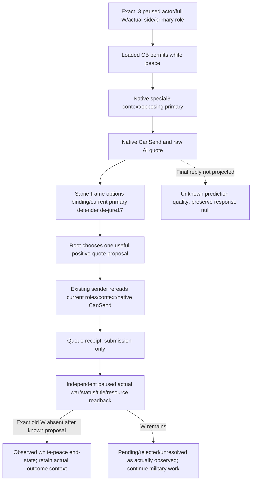

# Existing typed war settlement actions, CK3 1.20.0.3

Prepared 2026-10-03 15:17 Asia/Shanghai from source e38eb9bd7757275746d0ffed1c630fc1540d087e and saved coordinator artifacts. This file-only lane binds Steam build 25652598 and EXE SHA-256 `94B55397ABB687A3DCD436805A5D885E6BE90FA6C693FEB44A9E3BBEEADE02A6`. It does not operate SDK, game, pipe or window, and does not mutate shared Git.

The existing victory sender is complete and reusable for Robert's actual three defensive wars. No new native command, ABI scan, permit or compile flag is needed. The native score and end-war input tree is recorded in [war-end-conditions](war-end-conditions-1.20.0.3-2026-10-03.md); it precedes this execution recipe.

## Existing native submission

The `.3` factory gates the exact executable SHA and reuses the reviewed `.2` diplomacy and command implementations. The existing exact `.3` core-comparison is GREEN/UNCHANGED for both modules. `SubmitEnforceDemands`, `SubmitSurrenderWar` and `SubmitOfferWhitePeace` share the production submit path in `ck3_12002_diplomacy.cpp`. It resolves the full-generation WarID, rereads paused/alive/current player and side membership, requires current primary leadership, rebuilds the requested context, and reruns final CanSend at `0x307C040`.

For victory the native resolution constructor `0xCF57D0` takes `true` for **player victory on either physical side**. Robert defending therefore selects attacker-defeat. White peace separately rereads the loaded CB permission bit and constructs special index3. `0x2968170` constructs a 0x368 send packet; the existing owning clone is queued at `0x37F06F0`, command manager `image+0x5CC1240`, flags0x0E. Temporary and embedded contexts retain their established destruction lifecycle. Queue success is submission only.

## Current observed boundary

The saved date53236608 options are production-live primitives, not current action authorization: War16777231 is `individual_county_de_jure_cb`, War129 is `minor_religious_war`, and post-refusal War50331736 is `populist_war`. Robert29829 is primary defender in all three. Their observed victory and white-peace final CanSend values were false; surrender was mechanically legal. No termination was submitted by this lane. These saved negative rows are not reused as a future same-frame decision.

| Existing MCP | Current public scope | Readiness boundary |
|---|---|---|
| `ck3_enforce_demands(war_id=W, expected_revision=R)` | Any actual CB, current primary player, player-relative score100 | Default capability; fresh native context/CanSend still decides. |
| `ck3_offer_white_peace(war_id=W, expected_revision=R)` | Existing narrow primary-attacker claim/de-jure policy slices | Current Robert defender cases are not included; `.3` final recipient response is still unavailable. |
| `ck3_surrender_war(war_id=W, expected_revision=R)` | Existing de-jure/Raiktor/terminal attacker slices | Native legality does not implement current defender title-loss policy. |

This table separates mechanical native sender availability from typed policy readiness. It introduces no new combat restriction. Continue the military loop using current observations and use the existing victory action once native legal100score is observed.

## Future single-submission recipe

1. In the retained Root SDK session take a fresh paused snapshot, retaining exact executable identity, actor29829, episode `native-29829-2bc2d599f7f9`, full W, primary leadership and public revisionR. Query `ck3_query_war_termination_options(war_id=W, expected_revision=R)` and retain its same-frame metadata. Choose victory only when the actual player-relative total is100 and the victory context's native validator/available are true. This is the existing action's readiness, not a newly added gate.
2. Record pre-state gold/prestige/piety raw Q100000 from the snapshot and campaign root via `ck3_query_campaign_root_context_v1(expected_revision=R)`. Refresh public revision as required by the retained session. The root context covers the player's held-title partition and realm/vassal scope; it is not a generic arbitrary enemy-title holder query.
3. Call `ck3_enforce_demands(war_id=W, expected_revision=R)` exactly once using the fresh current revision. The production driver already waits for the exact old full W to disappear. A failed/timeout/uncertain receipt is retained; no blind second submission is inferred from it.
4. Independently take a new paused snapshot and `ck3_get_war_state()`. Require absence of exactly W, preserve other actual wars, and compare actor/episode/date with the submission context. War absence following the known victory request establishes the observed terminal transition; ACK alone does not. Retain any active event or succession/invalidation changes that affect attribution.
5. Read the actual material aftermath. Compare raw resources and held titles/realm/vassal scope using fresh snapshot and campaign root. For populist victory additionally use fresh faction alerts and, when its already available query permit is enabled, player prisoner collection to observe the old faction33554465 alert's removal and rebel70766 custody. A targeting-alert row disappearing does not itself expose the global faction object's destruction. These readbacks are observations, not prisoner actions. Save the resulting normal checkpoint once.

## Material outcome limits

All three present defender-victory CB blocks avoid conquest title transfer, but different resource and custody effects apply. De-jure defeat includes attacker reparations; minor religious defeat includes defender piety and attacker payment; populist defeat includes faction cleanup and attacker imprisonment. Reuse the exact installed-stock clauses in the end-conditions topic. Record only actual before/after fields: no guessed payment, prestige/fame, piety, truce, dread, legitimacy or individual custody claim.

Current general observations can verify Robert's gold/prestige/piety, own held-title partition, realm/vassal scope, war lifecycle and optional faction/prisoner changes. They do not expose every nonclaim target holder/liege transition, all attacker participants, exact opponent resources, generic truce set or every ancillary CB effect. In particular target2128 belongs to the wider realm: absence from Robert's own held-title list cannot prove its holder changed. Generic claim-only terms and historical H2743 data are not substitutes. Report an unobserved material field as unobserved without blocking the existing useful victory transition.

Negotiated white peace remains a scoped construction entry if it becomes useful and native legal: close the exact `.3` final recipient evaluator and extend the same options DTO, then implement the actual current-CB defender policy. Current defender surrender additionally needs the chosen dynamic loss scope. Neither gap requires duplicating the existing owned sender or stops current combat.

## Reused verification and report fields

The native diplomacy header, sender and `ck3_12002_diplomacy_test.cpp` hashes match their prior GREEN receipt. That fixture invokes actual production sender functions with native seams and checks both physical-side outcome polarity, CanSend rejection, full IDs, owned clone/queue and context destruction. Retained fixture binary SHA is `74d705ea6a89e82ab45078661437bf0f94c36968ebf3c688f1bf54849cfbbd4a`; it is a test executable, not the CK3 EXE. The reviewed `.3` reuse receipt establishes ABI compatibility, not live termination.

Existing NativeHeadlessGameplayDriver tests check exact old WarID disappearance for enforce and distinguish white-peace/surrender `submitted_pending` from applied. Registered MCP fixture actually calls enforce through a callback driver; it only lists the other two tools. These complementary fixtures are not one native-sender-to-SDK end-to-end run. No concrete production sender defect was found, so no fixture was repeated and no new component was created.

Completed: confirmed reusable mechanical senders and legal100score victory scope; delivered once-submission and independent material-readback recipe. Why: preserve military delivery pace using established primitives. Readiness: native/static-ready actions, existing Robert options production-live primitive; Robert termination remains live-pending, with no victory/OODA credit. Test/artifact: `Z:/ck3_mod_rewrite_process_assets/g2-resume-20261003/war-settlement-typed-action/ROOT-DELIVERY.json` indexes source hashes, retained native/ABI evidence and child reports. RED: no new capability defect; current defender negotiated/surrender observation/policy gaps remain documented. Next: continue combat and later enforce an observed native legal100score, collecting actual postconditions. Commit/push: coordinator-owned adoption pending; this lane changes only isolated external artifacts.

## 2026-10-04: current defender de-jure white-peace proposal

The retained Root query at date53244648, public2/native493, actor29829, ordinary episode `native-29829-2bc2d599f7f9` observes War16777231 (`individual_county_de_jure_cb/index17`): primary defender Robert, opposing primary30097, player score+7. White-peace context construction, final native CanSend and availability are true; raw AI quote163736/Q100000=+1.63736, auto_acceptfalse. CB-specific terms and final recipient response are typed unavailable/null. War50331736 and129 still have unavailable white peace and victory; no result is inferred from those saved negative rows. The real three leaves were consumed once and pinned at `war-settlement-typed-action/next-paused-war-options-r25/actual-three-war-consumed-01/ROOT-DELIVERY.json`.

### Native role/input tree reused before policy expansion

The exact .3 reused reader and sender already resolve full W, paused/living current player, exactly one participant side and primary leadership. White peace reads loaded CB permission bit7, identifies the opposing primary through the actual physical player side, constructs special-index3 context, and runs `0x307C040` CanSend. Raw acceptance from `0x307C460` and observable auto-accept are proposal inputs. The current .3 reader does not publish a final recipient evaluator; its missing response is not an execution restriction. Submission independently rereads these real inputs, reconstructs the context and reruns native CanSend before the owned queue packet. No native ABI, sender, DTO, flag or protocol extension is required for the current defender proposal.

### Minimal functional extension and honest quality boundary

g54 `_white_peace_readiness` only dispatches two primary-attacker slices, so a legal current defender proposal is omitted from `action_steps`; named MCP and generic execute both reject it before reaching the native sender. This is missing functional coverage, not a remaining nonwar or religion authorization rule. Reading claim-only terms cannot change Robert's role and is unnecessary for this white-peace proposal. The source extension adds the actual current primary-defender de-jure17 branch, using existing same-frame options and positive observable native quote, while reusing the published `ck3_offer_white_peace(war_id, expected_revision)` sender. Unknown CB terms and recipient_response do not become gates. Original attacker behavior and native final predicate remain in force; the quote is never called an accepted answer.

The selected counter-policy is deliberately a chosen current proposal, not a full final-reply predictor. It has not adopted the absent .3 final evaluator or previewed every CB effect. If repeated actual proposals demonstrate that prediction quality is insufficient, the construction entry is that exact .3 final evaluator projected through the existing options MCP; no generic gate or new protocol is introduced now. A still-active W after submission is a real game outcome to record, not proof that ACK meant peace. Current title-holder publication can independently observe target2128 after resolution, and snapshot gold/prestige/piety/campaign scope can measure material changes.

Root-only action recipe: at its next actual pause refresh only War16777231 options, choose the proposal from current legal/positive data, send the existing named action at most once, independently observe exact old W absence or remaining status plus other wars50331736/129, target2128 holder/lieges, resources and any actual event/answer, then save a normal checkpoint once. Prepared call files are in `war-settlement-typed-action/white-peace-current-defender-g54/`. Before actual execution there is no peace/day/victory credit. Fixture readiness and exact source hashes are supplied by that package receipt; genuine native-memory fixtures and in-process registered MCP are not actual CK3 settlement.

## 2026-10-04：当前守方单次白和平提议与三个正常回复日

已封单次offer后一个自然日的独立读回为submitted/pending：offer_attempt_count=1、recipient_answer=null，War16777231仍在实际列表[16777231,50331736,129]，peacecredit0。该旧帧date_raw53246712、累计4266/resumed1113/Oct4新增241保持原阶段；不把提交或pending当作接受、战争结束或胜利，也不重发提议。

Root actual03 **SDK64107 closed/exit0、GREEN** 独立确认date_raw **53246760**／native **860**／public **5**，三个war仍active，各自score为 **16777231:12、50331736:−13、129:−29**；Robert存活、主军regular@2640、event/interaction=null。已完成三个正常replydays、累计 **4268**／resumed **1115**／Oct4新增 **243**，Oct3 frozen **777**；正常 **h6267／93381860B／SHA256 `e5f1e0538a26f0b675dcf5dac3fca6b561b684e44b29cd2423aab50a150c3518`**。这些是Root实际完成的观察/保存；三个正常回复日后仍pending/0accepted，peacecredit与war-win均0。此前两replydays4267/h6265保持旧阶段，未来64日预算及仍在运行的下一轮不提前计。

最新已观测campaign_root_context.capital_province_id为 **2619**（Robert29829、native850/public2/date53246712，capital_ready=true），对应county2142；**2640** 是county2115的capital。今后的current-player-capital标注用2619，历史2640交接与封存事实不重写；此capital缓存不刷新成native860读数。原三authorized查询未发布资源余额，不从monthly income推余额。Root实际hot Python为 **210943a7/g56**，native仍 **g54/PID8898/R25**，没有v50部署声明。

资格仍为 **production-live primitive：单次提议及其后独立观察**，peace settlement未完成。回复scheduler未闭合不阻断ordinary gameplay，本追加不新增门禁或acceptance预测。sealed post-action delivery与CAPITAL-CACHE-FACT只复用原owner缓存，actual03只使用Root sole consumer提供的事实及receipt链接；本doc consumer新增0日/动作，不读取raw或运行下一轮SDK。

封存输入：`Z:/ck3_mod_rewrite_process_assets/g2-resume-20261003/war-settlement-typed-action/white-peace-current-defender-g54/post-action-consumption/ROOT-ACTUAL-CONSUMER-DELIVERY.json`、同根 `raw-query-lane/actual-authorized-after-reply-003-005-007-consumed-01/CAPITAL-CACHE-FACT.json`；Root actual03索引仅链接 `Z:/ck3_mod_rewrite_process_assets/g2-resume-20261003/runtime-preparation/v51/ROOT-ACTUAL-REPLY-DAY-03-RECEIPT.json`，未读取该receipt/raw。

## 2026-10-04：WarID 16777231 独立退出，结束类型仍未观测

同一 ordinary episode `native-29829-2bc2d599f7f9`、Robert 29829、唯一一次白和平提议后，sealed 日账的 exact WarID membership 为最后仍在 `53246784/native874/pub5`、首次不在 `53246808/native877/pub8`：reply03 + march02，共 5 个自然日。DAY55 `53248080/native1089/pub220` 是后来仍保持消失的观察；不能写成 58 天才结束。边界缓存 SHA `dc0e203d2a77e71cd7822267730734c9b2f62168accd60ec57facbed24c50060`。

readiness 为 `production-live primitive`；有限“单次提议 → 自然日 → 独立 exact old WarID 退出”观察循环已闭合。剩余 `50331736/129`，player-relative score `-10/-26`。未观测 settlement type、recipient final answer、truce 或玩家战斗胜利；报价、ACK 和 WarID 消失不能独立证明白和平被接受。已有 A/B 原生输入账本中的 queue/history/final-reply 观测缺口沿已冻结施工入口继续，不阻断当前 battle。

下一真实暂停停点复用现有只读口：`ck3_query_title_holder_v1(title_id=2128, expected_revision=<fresh public integer>)`；`ck3_query_campaign_root_context_v1(expected_revision=<fresh public integer>)` 整组读取已知 5 县 `2102/2111/2115/2142/2173` 与 duchy `2141`，不逐县重复查询。2128 不在本人 held partition，需独立 holder 读回。资源余额复用当停点已有 snapshot cache 的 `played_character_gold/prestige/piety` raw Q100000；必要时 Root 选择现有 `ck3_take_snapshot(include_native_command_history=false)`，收入不当余额，不新增 getter、门禁或 SDK 执行。后续结束类型与 stock effects 只按实际 published readback 陈述。

DAY55 为 paused/map-ready、Robert alive，event/interaction 实际 author cache 为 null，normal checkpoint saved 且 matches final date；该 null 不证明对方接受。累计 `4323 / resume 1170 / 2026-10-04 +298`，本只读报告追加 0 天。仅复用 Root/owner decoded cache 与既有 receipts；不重消费日级 raw。

## 2026-10-04：populist WarID 50331736 实测强制胜利结算

Root 当前实际整战分为 100、玩家为 primary defender、CB4 `populist_war`。SDK43478 原生 termination options 的 player-victory context 为 `attacker_defeat`，context constructed / native validator / available 均 true，auto_accept observable / true；CB-specific terms 与 recipient_response unavailable/null 不构成 force 结算门禁。既有 g57 `ck3_enforce_demands` generic 路径无 CB 过滤，无需扩展白和平 CB17 分支或增加代码/测试。

Root SDK73709 在同一新 action session fresh-query-bind 后只提交一次 `enforce-demands-50331736`，没有重放 closed43478 cache。实际 006 `/packet/structuredContent/war_action` 与 `war_victory` 均为 `{status: victory_enforced, war_id: 50331736}`；顶层 accepted/submitted 仅为 ACK。独立 007 current `active_wars` 仅余 `129`，确认 exact `50331736` 退出；129 为 primary defender、opponent32750、整战分 -24、target2115。两个实际 leaf 的 snapshot 为 `native:10`、public3；直接 date/actor/episode/native_revision 字段未发布，不补填。

该限定分支达到 `production-live primitive`，有限“原生观察 → 选择一次 force → 实际提交 → 独立 exact WarID 退出”循环可 qualified 为 `production-live loop`；不代表全局战争策略或整局游玩 complete。Root normal SAVE 与查询为零日数事务，累计 4359 天；仅一次 force，不重发 167 或 503。旧 167 的结束类型仍 unknown。资源后态、CB terms、70766 实际羁押、33554465 targeting-alert 清理尚未读，不推断财富、囚禁或全局 faction object 销毁；后续只复用已有可用查询口，不作为本次 force 前置门禁。

证据仅复用授权 raw lane 一次消费后的 cache：`actual-enforce-006-007-consumed-01/ROOT-DELIVERY.json` SHA `a643e23bfee8173e0943882d48bc305a1a5120479b4d1ce9c20c46e03c722e55`。006 raw SHA `4f9d70ec375bb9a61502a9bdead7455df0f92758369a3a43c1d635d06ec9a81c`，007 raw SHA `3a35b28ca5fdc74cbc26c713e594319c3d27dba29087f27b443d868ba9a9f12a`；本报告 lane 未读取这些 Root raw。

### 2026-10-04：CB41 防御方白和 typed 入口实拒与最小修复

Root SDK98908 的真实请求在 service 层报 `selected backend does not implement native war step offer-white-peace-129`，未进入 native factory，不是原生 CanSend 拒绝或 AI decline；独立战争状态与正常 SAVE 为 GREEN，过程推进 0 天。该帧 War129 为 Robert29829 primary defender，CB41 `minor_religious_war`，整战分 +40，原生白和 context/CanSend/available 为 true，quote `2670329/100000 = +26.70329`，autoaccept false，recipient response 仍不可见。

生产修复仅 `native_driver.py`：保留 CB17 `individual_county_de_jure_cb` 分支，为真实 CB41 身份新增 `defender_minor_religious_white_peace` variant、readiness dispatch 与 proposal metadata，共享既有同帧 active WarID、primary defender、原生合法和正报价条件，最终 native submission predicate 保留；没有新增 recipient response/CB-specific terms gate、flag、DTO、WAL 或 C++ 改动。Root 已提交推送 `b5add463dd3ff7fc5cbe71c024652af3f4ff750c`。

唯一 registered MCP → actual service/driver 的 `python -O` focused attempt01 首次 GREEN（optimize1，3 phases / 61 explicit checks）：旧版同错误且 native factory callback 0；修复版使用同一真实已发布 CB41 DTO 与生产 query cache，发出一次 `offer-white-peace-129` callback，结果保持 ACK `submitted_pending` 和 null reply；单独 final native predicate false 场景保留拒绝。RESULT SHA-256 `a019a9d263439d45b9efc98c1c711cb8a6b5fd986ea90c8cc36cd6baaa8386dd`，修复 driver SHA-256 `3482c458c4bd08853600aa6e3feb9bf56e12c520be30fec8a1d0063a09dd7c40`；artifact 位于 `Z:/ck3_mod_rewrite_process_assets/g2-resume-20261003/war-settlement-typed-action/war129-score40-wp-r27/actual-service-fix/`。

本增量生产代码状态为 static-ready，等待真实白和请求及独立后态/回答观测；正报价、fixture callback 和 ACK 均不提供 accepted/applied credit。既有 War503 强制要求的有限实机 loop 范围保留，旧 War167 的终止类型仍 unknown。本包基线累计 4444 天 / resume1291 / Oct4+419，query/fix/fixture 额外 0 天。
