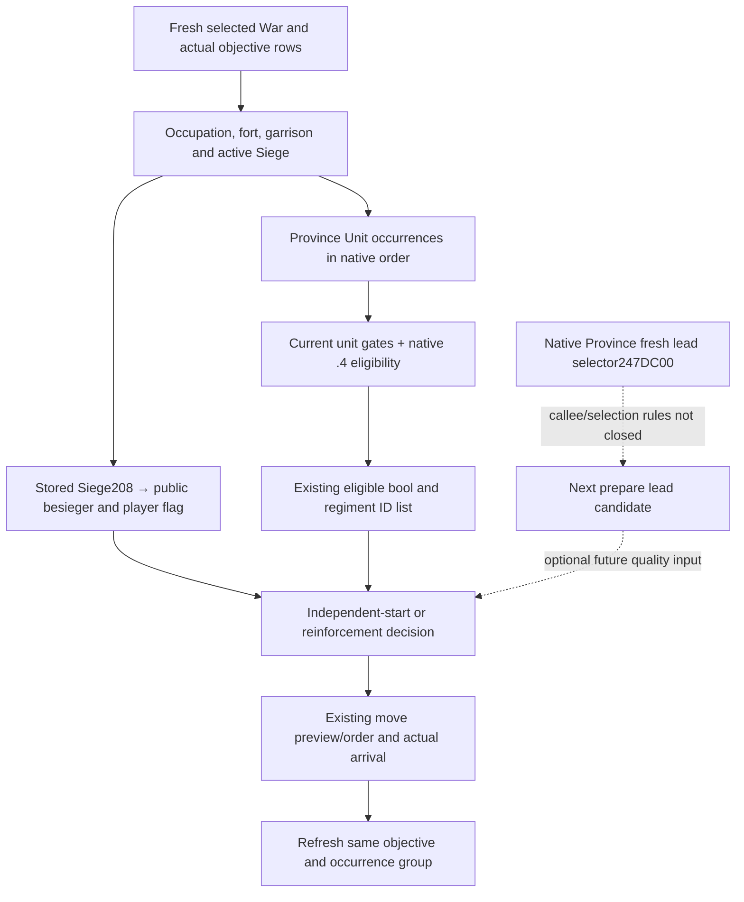

# R76 siege target choice: leader and contribution

On the held R76 frame, the existing bridge already separates the current siege
leader from eligible contributing units. `player_army_besieging=false` at 2608
does not make every player army ineligible to contribute. The useful immediate
policy change is to consume the existing fields rather than add another
membership query. The remaining native research input is the **fresh leader
candidate selected for the next prepare**, which differs from the stored lead.
It is a quality dependency for reasoning about taking leadership of an existing
siege, not a prerequisite for moving toward the unbesieged objective 2606.

## Frozen source and actual frame

The build is CK3 **1.20.0.4 / Steam 25734779**, EXE SHA
`98702F88A547CDE2EAF29A85F93B85F68EE4CF8148336A4F7AFAEB75319DD518`.
The actual native DLL source is
`Z:/gbs1-m7-formal4-stack30@4e06f9454ef9f0e8173d30d8259625d3396929b9`;
the SDK source is
`Z:/gbs-m4-construction-cli-35dd@cc1e6a9e249ebeffdba1e6c910615041f090bf34`.
SDK source contains other Root work and does not attest that those native claims
are deployed. This documentation uses their respective reader/serializer and
normalizer paths separately.

The necessary fields were consumed once from `001-runtime30-r76-paused-snapshot.json`
and `008-r75-ooda-turn.json` in
`Z:/ck3_mod_rewrite_process_assets/g2-background-20261007/upstream-build-migration/managed-full-h9658-startup30restore01/operator/gameplay-responses/`.
The selected-field cache is
`Z:/ck3_mod_rewrite_process_assets/g2-parallel-20261008/battle-pursuit/siege-target-war100663329/R76-SELECTED-FIELD-CACHE.json`.
The frame is raw **53288472**, snapshot **native:2**, native revision **2**,
public revision **3**. Root supplies the ordinary Robert29829 campaign and
War100663329 attacker-versus31050 binding, target title2132 and objectives2606/2608.
Own public Unit218104048 remains at2618 with committed target2615, controllable,
without combat or retreat. This lane issued no movement or time advance.

| Objective | Observed position | Decision meaning |
| --- | --- | --- |
| 2606 | Unoccupied, fort4, garrison588, besieging strength0, observable no siege | Candidate for starting an independent siege; arrival and native qualification still require their normal observations. |
| 2608 | Unoccupied, fort7, garrison1050, besieging strength152, Siege318767193 | Existing foreign-led siege; work/current ETA cannot be inferred from its mere presence. |

At2608, **current work is0**, total and remaining work are **51353725**, and
progress is0, all fixed-point values having scale100000. The 51353725 figure is
not completed work. `days_left`, ordinary daily progress, phase data and
`can_advance` are null. Stored public besieger335544362 resolves to internal
Army352321570. Its existing occurrence row has `eligible=true` and regiment IDs
`[167772807,134220666,218106988,251658793]`. The current siege is not near completion
on the published work values. No future ETA or exact advance permission is
assigned from the absent fields.

## Native input tree and existing observation

Read first: [native AI research workflow](README.md),
[war objective/occupation targets](war-occupation-targets-12003.md),
[parallel siege objective choice](guard-parallel-siege-objectives-12003.md),
[current siege prepare tree](siege-current-tick-offline-12003.md), and
[M/K eligibility](siege-efficiency-inputs-12003.md). Their .3 live outcomes remain
historical. Actual .4 entry and member operands are frozen in
[the Province profile](ck3-1.20.0.4-province-siege-objective.md).

The .4 M/K loops at `247ECC0` / `247EFA0` use current Province Unit occurrences and the
existing native exclusion `24E8340` and full eligibility `2C16670`. Qualification
requires the current Province match, Unit state18==0, retreat170<=0, route count44==0,
and the native predicates. Eligible independent armies do not require equality
with the siege's stored Army208 and do not require a merge. The current observed
regiment list indicates eligibility, not numerical attribution of M or the next
leader. The .4 292-byte contact witness remains independently reused for route/
contact admission; it is not re-read or requalified by this lane.

`ck3_12002_province.cpp` maps `CSiege+208` to known public units and sets
`player_army_besieging` from the controllability of a matching stored besieger.
It separately reads `siege_province_unit_occurrences`. Actual .4 native source
`ck3_12003_war_occupation.cpp` copies that group, and
`war_occupation_targets_v1_serializer.cpp` publishes `province_unit_occurrences`.
SDK `bridge/war_contract.py` uses the existing `siege_membership_contract.py`
normalizer. The R76 packet demonstrates a real available occurrence group.
Another boolean or endpoint for the same eligibility would duplicate this
capability.

## Minimal normal-policy hook

After normal policy selects this War and its controllable subject, compare fresh
eligible objective rows using the existing route preview and supply inputs. On
this frame,2606 offers an independent start with lower observed fort/garrison
and no competing siege. It is the concrete first candidate to preview from the
committed route toward2615. This is a deterministic counter-policy suggestion,
not a claim that native AI ranks2606 first or that its unseen route is shortest.
Keep the existing order until the normal route decision supplies a reason to
replace it; the documentation does not submit or cancel an order.

For a reinforcement choice toward2608, consume the actual occurrence group after
arrival with an empty route. Match own public218104048 and retain `eligible=false`
separately from null/unreadable. Current membership of only335544362 says nothing
about an unarrived218104048. A remaining route can exclude a still-present unit
from contribution, even when its coarse state says sieging. Observe independent
occupation/occupier change and current war score after capture; neither ACK,
stored leadership nor contributor eligibility awards capture or war victory.
The beneficiary of a future foreign-led completion is not inferred from this
frame. Claim/ticking/settlement conditions belong to the sibling objective-score
research, not this note.

## One precise remaining native entry

The missing current-state observation is **what the native Province selector
would choose now for the next siege prepare**. Existing current daily/phase
reads use storedArmy208; prepare can reselect and cache an Army ID atSiege38.
The held .4 caller at251E21F invokes247DC00 with an output address inRDX, then
reads that output at251E224 and writesSiege38 at251E232. A second held caller
at251CFAC checks the returned output pointer's ID against-1. This establishes
the construction entry and output convention; it does not close the selector's
own mutation behavior, complete selection inputs or tie-break rule.

The exact cache-only recipe is
`Z:/ck3_mod_rewrite_process_assets/g2-parallel-20261008/battle-pursuit/siege-target-war100663329/NEXT-LEADER-CACHED-SOURCE-RECIPE.json`.
Cached runtime metadata names the complete old .3 interval
`247DC20..247DFF5` (**981 bytes**) and corresponding .4 interval
`247DC00..247DFD5`. If fresh leadership becomes a real decision dependency,
reuse shared raw spans/claims first and map only this named981-byte function
with the shared finite mapper. Verify its current receiver, full-ID output,
native comparison/ordering branches and writes before connecting a read-only
field to existing `active_siege`. Do not call it based on ordinal geometry or
the two caller witnesses alone. No body was captured in this task, no future
ownership outcome is promised, and this optional quality work does not hold
up the current2606 route/siege loop.

This increment is **research / documentation** with reused actual observations.
It adds no bridge field, policy code, new readiness gate or live capability.
New EXE reads/hashes, game/SDK/query, build/test/import, FIRST and game days are0.
The parent owns adoption and push; Oct8/W41 fields are provided beside the cache.
