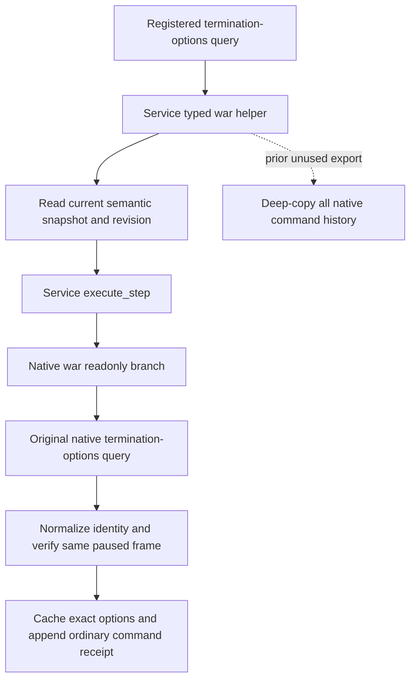

# War termination options: omit the unused revision-selection history export

Source-only candidate, 2026-10-10 / 2026-W41, based on `ba92f9876a5733502cf2e16576aec3cff4f88c11`. Root owns the running SDK237 and every test or live call. The observed ordinary termination-options query took139.765 seconds (20:57:53.234 to21:00:12.999). The1.278GB Driver-state size is metadata; this source change does not establish its contribution to that elapsed time.

## Actual production dependency

The registered `ck3_query_war_termination_options` calls Service `query_war_termination_options`, then `_execute_typed_war_step`. That helper reads `self.snapshot()` and consumes only `snapshot["revision"]` before calling `self.execute_step`. Service's default snapshot calls Driver `take_snapshot()`, whose default `include_native_command_history=True` calls `_history_snapshot()`. That method deep-copies the entire retained `_command_history`. The revision-selection helper does not read the exported history and does not return its snapshot.

The Driver already identifies termination-options as `internal_read_only_query` in `_execute_native_war_step` and uses `take_internal_semantic_snapshot`. `_execute_war_termination_step` also submits its primitive with `internal_semantic_snapshot=True`, then verifies another internal semantic snapshot. It does **not** call `read_private_g2_native_query_v1`; consequently no private-G2 before/after change is warranted here. Native predicates and their existing termination decision tree remain documented in [war-termination.md](war-termination.md).

## Minimal implementation and qualification

The termination-options Service call explicitly asks the existing helper to omit native history. The helper retains its default `True` for all other callers. Service's existing finite-snapshot adapter falls back to the original `take_snapshot()` for drivers without that optional interface. Driver public full-history snapshots, command recording, options cache, revision validation and durable persistence are unchanged.

One new authored compound uses the registered MCP tool, real Service and NativeHeadless driver, with the existing deterministic endpoint/War fixtures. It verifies one real Python transport submission, preserved options/frame provenance and retained history with its ordinary appended query receipt. A copy-counted retained payload proves that the query exports no full history; an explicit public full snapshot still exports an isolated complete history, and the existing persistence barrier writes it. The compound is **AUTHORED_NOTRUN**; no speedup or live qualification is claimed before Root executes it and observes a later ordinary call.

Sole node: `ck3_autonomous_player/tests/unit/test_war_termination_options_history_export.py::test_registered_termination_options_omits_revision_history_and_preserves_receipts`.

No Game/SDK/process/window/EXE reads, hashes, builds or tests were performed by this source lane. This is a Python-only optimization; it requires no DLL rebuild. Shared daily/weekly reports and publication belong to Root.

## Root's first offline qualification

Root executed the sole new registered compound against frozen runtime source `f9820ecead8be1b9597f710bae34c7ab421136c6`. It passed **1/1 in5.16s**. The actual process interval was `2026-10-09T21:31:49.564448Z` to `2026-10-09T21:31:55.319057Z` (5.754609s wall), which is **2026-10-10 05:31:49.564448 to05:31:55.319057 Asia/Shanghai**, and belongs to Oct10 / W41.

Preserved result: `D:/codex-ck3-background-spill/war-termination-history-12004/actual-first01/ROOT-RESULT.json`, with `stdout.log` recording `1 passed in 5.16s` and `stderr.log` preserved alongside. This is **static-ready qualified** for the Python production-route change, with fixture transport and native reply. The source lane did not execute or replay the test.

At this qualification checkpoint the running SDK237 had not yet adopted this optimization. The next hot03 was planned after an actual SAVE; no later live war-query result or measured speedup is claimed here. The original139.765s ordinary query remains separate evidence. This documentation-only child preserves the frozen runtime source tree unchanged.
