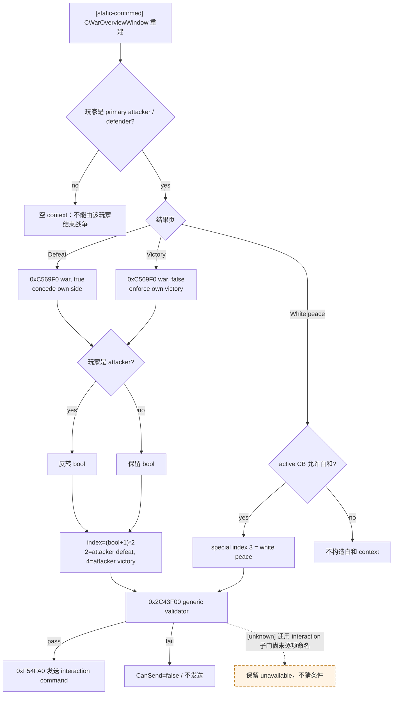
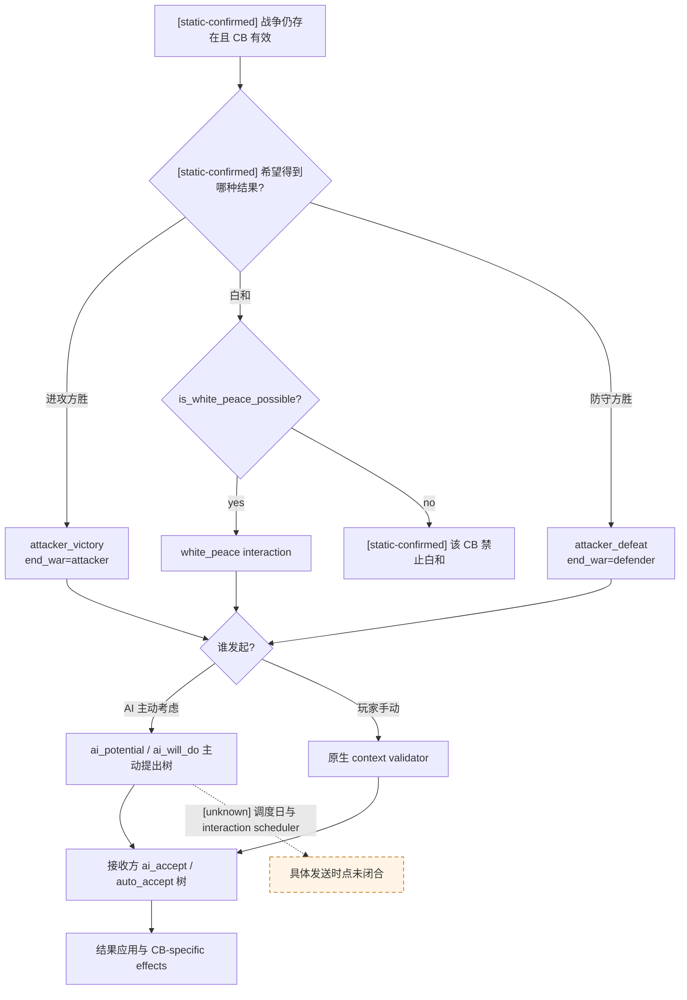
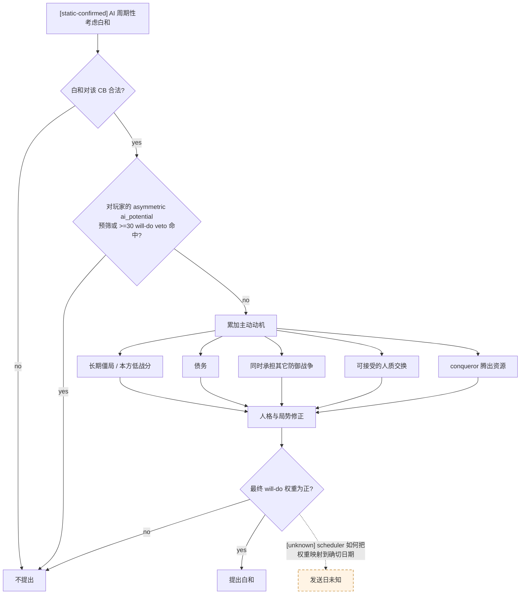
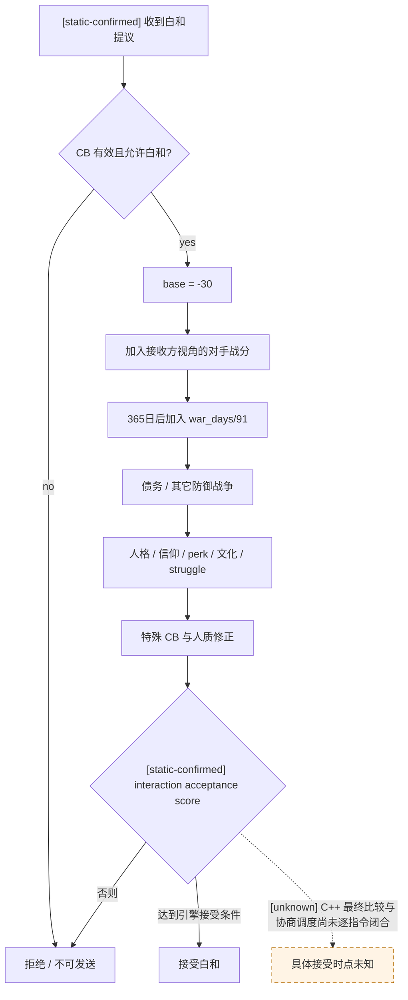

# CK3 1.19.0.6 原生 AI 战争终止决策树

## 结论与证据边界

- [static-confirmed] 本文绑定 CK3 `1.19.0.6`，`ck3.exe` SHA-256 为
  `2D00FF3101EF70B566F2FCBAE292F09263199C80E9DC8F139B82D7D96F83DB86`。
- [static-confirmed] 权威脚本是
  `game/common/character_interactions/00_war.txt`，SHA-256 为
  `5C99B8F14893929A9BC2DBB5B258CDD2D4233D5805091952209413DE876EE09F`。
- [static-confirmed] 原生战争面板投影是 `game/gui/window_war_overview.gui`，SHA-256 为
  `73496CFCF3213851ED94A6A026EFF7A08807CCDCCA70ED425FE943CB3F3CDB65`；面板把结果明确分成
  `SetEffectsTabDefeat`、`SetEffectsTabWhitePeace`、`SetEffectsTabVictory`，发送按钮再调用
  `WarOverviewWindow.CanSend` / `Send`。
- [static-confirmed] 原版把战争终止分成三种独立结果：进攻方胜利、白和、进攻方失败；三者分别由
  `end_war_attacker_victory_interaction`、
  `end_war_attacker_white_peace_interaction` 和
  `end_war_attacker_defeat_interaction` 承载。
- [static-confirmed] `ai_will_do` 决定 AI 是否主动提出结果，`ai_accept` 计算接收方态度，
  `auto_accept` 是绕过普通接受分数的硬门。主动提出和接受是两棵树，不能混成一个阈值。
- [static-confirmed] 玩家从战争面板手动提出结果不经过 `ai_will_do` / `ai_potential`。它走“原生结果 context
  构造 → interaction validator → 发送”；因此 AI 主动投降所需的 `100` 战分与 `180` 日不是玩家投降按钮的门。
- [static-confirmed] 原版白和评分直接使用战分、战争时长、债务、其它战争、人格、文化/特质、特殊战争和人质；
  这份脚本没有调用战斗 Monte Carlo，也没有把未来战斗胜率直接加入白和分数。
- [unknown] interaction 调度器检查 `ai_frequency_by_tier`、求值 `ai_will_do` 并决定具体发送日的完整 C++ 调用顺序尚未闭合。
  本文只把原版脚本声明的条件和数值视为已证，不把“某天必定发出提议”当作已证事实。

## 三种结果不是三个按钮的同义词

| 结果 | 原版 interaction | `on_accept` | 主要用途 |
|---|---|---|---|
| 进攻方胜利 | `end_war_attacker_victory_interaction` | `end_war = attacker` | 进攻方执行要求，或防守方承认进攻方胜利 |
| 白和 | `end_war_attacker_white_peace_interaction` | `end_war = white_peace` | 双方放弃本次胜负结果；必须额外满足 `is_white_peace_possible = yes` |
| 进攻方失败 | `end_war_attacker_defeat_interaction` | `end_war = defender` | 防守方执行要求，或进攻方投降 |

[static-confirmed] 三个 interaction 都要求战争仍有有效 CB；白和还会逐 CB 检查是否允许白和。
人质会改变接受分和结果，但“带人质的结果导致对手失去全部领地”有额外禁止或自动接受屏障，不能把无人物交换的结果验证复用于人质结果。

## 战争面板的 exact-build 结果构造

[static-confirmed] 以下 RVA 均来自本文冻结的 `ck3.exe`，不是跨版本签名：

| 锚点 | RVA / 数据 | 已闭合语义 |
|---|---:|---|
| `CWarOverviewWindow` RTTI / 主对象 vtable | `0x5210C20` / `0x4108DF0` | 战争面板类；结果页 context 在窗口重建时生成 |
| `CEndWarAttackerVictoryInteractionData` | RTTI `0x546AB30`，vtable `0x428EEA8` | 进攻方胜利 special interaction data |
| `CEndWarWhitePeaceInteractionData` | RTTI `0x546AAB8`，vtable `0x428EF88` | 白和 special interaction data |
| `CEndWarAttackerDefeatInteractionData` | RTTI `0x546AAF0`，vtable `0x428EF18` | 进攻方失败 special interaction data |
| 结果 context 构造器 | `0xC569F0` | `(out, war, concede_own_side)`；只接受玩家为 primary attacker / defender |
| special-interaction context helper | `0x2225D40` | 以 `dl` 索引 `CCharacterInteractionDatabase + 0x1008 + dl*8` |
| context validator / 发送 | `0x2C43F00` / `0xF54FA0` | `CanSend` 与发送前验证；通过后构造发送命令，flags 为 `0x0E` |

[static-confirmed] `CWarOverviewWindow` 的重建段 `0xF54C40–0xF54CC6` 生成三个 context：

- `this + 0x12A0`：调用 `0xC569F0(..., true)`，即“本方投降”；
- `this + 0x15D8`：活动 CB 的 white-peace flag 为真且玩家是 primary leader 时，以 special index `3`
  生成白和 context；
- `this + 0x1910`：调用 `0xC569F0(..., false)`，即“本方执行胜利”。

[static-confirmed] 白和分支 `0xF54C52–0xF54CA7` 读取 `[[CWar + 0x100] + 0x1718]` 的 bit `7`；仅该位为真，
且玩家 CharacterID 等于 primary attacker / defender 时，才以 `dl = 3` 调用 `0x2225D40`。发送选择器
`0xF54EF0–0xF54F99` 又按面板状态 `0/1/2` 分别选择 `+0x12A0`、`+0x15D8`、`+0x1910`
（胜利页可再进入人质 context helper），随后统一走 `0xF54FA0`。

[static-confirmed] `0xC569F0` 先读取 `CWar + 0x288/+0x28C` 的 primary attacker / defender。若玩家是
primary attacker，它把接收方换成 primary defender，并对输入 bool 执行 `xor 1`；若玩家是 primary defender，
则不反转；玩家不是任一 primary leader 时直接返回空 context。随后 `(bool + 1) * 2` 选择数据库索引。

| 玩家身份 | 输入 bool | 数据库槽 | 绝对战争结果 | 面板语义 |
|---|---:|---:|---|---|
| primary attacker | `true` | index `2` / `+0x1018` | attacker defeat | 玩家投降 |
| primary attacker | `false` | index `4` / `+0x1028` | attacker victory | 玩家执行要求 |
| primary defender | `true` | index `4` / `+0x1028` | attacker victory | 玩家投降 |
| primary defender | `false` | index `2` / `+0x1018` | attacker defeat | 玩家执行要求 |
| 任一 primary leader | 独立路径 | index `3` / `+0x1020` | white peace | 玩家提出白和 |

[static-confirmed] 因而这个 bool 的正确语义是 `concede_own_side`，不是固定的
`attacker_defeat` 或 `surrender=true` 枚举；忽略玩家攻守方会把结果反向。



## 玩家作为进攻方何时能投降或白和

| 玩家动作 | 原生确定门 | 接收方为 AI primary defender 时 |
|---|---|---|
| 投降 | [static-confirmed] 玩家是 primary attacker；战争仍能构造 interaction；CB 有效；通用 context validator 通过 | [static-confirmed] `end_war_attacker_defeat_interaction.auto_accept` 因接收方就是 AI primary defender 而为真 |
| 白和 | [static-confirmed] 玩家是 primary attacker；活动 CB 类型 `IsWhitePeacePossible`；战争存在、CB 有效、`is_white_peace_possible = yes`；通用 context validator 通过 | [static-confirmed] 白和没有 `auto_accept` 块；对方走 `ai_accept`，可以拒绝 |

- [static-confirmed] 投降的脚本 validator 与 `0xC569F0` 都没有战分、战争时长或 `days_since_max_war_score`
  门。`100` 战分 + `180` 日只约束 AI 何时主动产生投降提议，不约束玩家手动点击投降。
- [static-confirmed] 白和按钮在 GUI 中还以
  `WarOverviewWindow.GetWar.GetActiveCB.GetType.IsWhitePeacePossible` 控制可见性；二进制初始化段在同一条件为真时才创建
  index `3` context，脚本 validator 再复核战争、有效 CB 与白和许可。
- [unknown] `0x2C43F00` 所复用的所有通用 character-interaction 门尚未逐项命名；所以本文证明的是“没有额外战分/180 日门”，
  不是声称任意伪造 context 都必定可发送。
- [static-confirmed] 玩家若只是参战盟友而不是 primary war leader，`0xC569F0` 不生成投降/胜利 context；白和构造段也要求
  玩家等于 primary attacker 或 primary defender。



## 原版 AI 主动结束战争

### 执行进攻方胜利

- [static-confirmed] 进攻方通常在进攻方战分达到 `100` 时主动执行要求。
- [static-confirmed] Peacemaker perk、`mpo_nomad_legacy_3`、恐吓用的断首变量和特定 conqueror 分支可以把主动执行候选门降到
  `90`、部分组合的 `80`，或断首分支的 `70`；这些门还带 AI 对手、CB 排除等附加条件。
- [static-confirmed] 如果 AI 主动方其实是防守方，也就是 AI 主动承认进攻方胜利，原版普通 `ai_will_do`
  分支要求进攻方战分达到 `100`，并且在最大战分停留至少 `180` 日。它不是“预计打不赢就提前投降”的预测树，
  也不是玩家手动投降的 validator。

### 执行防守方胜利

- [static-confirmed] 防守方通常在防守方战分达到 `100` 时主动执行要求；Peacemaker、文化参数、dynasty perk 和断首变量
  可以在部分 AI 对手场景把门降到 `90` 或 `70`。
- [static-confirmed] 如果 AI 主动方是进攻方，也就是 AI 主动投降，普通 `ai_will_do` 分支同样要求防守方战分达到
  `100`，并在最大战分停留至少 `180` 日；玩家手动提出投降不走这条分支。

### 主动提出白和

`ai_will_do` 的 base 是 `0`。下列正贡献提供主动提出动机，负人格修正或 `factor = 0` 可以压制它：

| 原版条件 | 主动提出倾向 |
|---|---|
| [static-confirmed] 进攻方：战争至少 365 日、进攻方战分不高于 0、同时还在另一场防御战争 | `+10`；本战争分不高于 `-50` 时再 `+40` |
| [static-confirmed] 防守方：战争至少 182 日且防守方战分不高于 15 | `+10`；不高于 `-40` 时再 `+50` |
| [static-confirmed] 防守方：战争至少 365 日 | 以 `war_days / 30` 为基础，再受正战分抑制；接近胜利时倾向继续等 ticking score |
| [static-confirmed] 任一方：战争至少 182 日且处于债务 | `debt_level * 20` 为基础，再受本方正战分抑制 |
| [static-confirmed] 战争至少 365 日、双方绝对优势均未到 30，且人质交换价值接近 | 人质价值和 boldness/honor/rationality/greed 共同修正 |
| [static-confirmed] conqueror 防守方被 AI 进攻 | `+100`，倾向尽快腾出资源继续征服 |
| [static-confirmed] `ai_potential` 预筛：AI 防守、玩家进攻且进攻方战分至少 10 | 候选直接被排除 |
| [static-confirmed] `ai_potential` 预筛：AI 进攻、玩家防守且防守方战分至少 70 | 候选直接被排除 |
| [static-confirmed] `ai_will_do`：AI 对玩家且自身落后至少 30 | `factor = 0`；对剩余候选再次禁止“正在输”的白和提议 |

[static-confirmed] 这两层对玩家限制是交互体验政策，不是期望效用最优性。合并后，对 AI 防守方的
`attacker_war_score >= 10` 预筛比后面的 30 分 veto 更早生效；AI 进攻方落后 30–69 时由 `ai_will_do`
veto，落后至少 70 时已被 `ai_potential` 排除。



## 原版 AI 接受战争终止

### 胜负结果

- [static-confirmed] 进攻方胜利的普通接受分以 `-99 + attacker_war_score` 为骨架，再加入 Peacemaker、dynasty、断首和人质等修正。
- [static-confirmed] `attacker_war_score >= 100` 时有 auto-accept；另有 conqueror 防守方在对方军力达到特定脚本比较时折服的特殊 auto-accept。
- [static-confirmed] 进攻方失败的普通接受分以 `-99 + defender_war_score` 为骨架；如果接收方正是将获胜的防守方，
  另加 `WOULD_WIN_MODIFIER = +1000`。
- [static-confirmed] `defender_war_score >= 100` 时 auto-accept；如果 AI 接收方就是防守方，也会自动接受进攻方投降。
- [static-confirmed] 人质交换和“战争结果会使接收方失去全部领地”的组合有专门屏障，不能只看总分。

### 白和接受分

原版 `ai_accept` 的基础是 `-30`，然后累加：

| 项目 | 原版含义 |
|---|---|
| [static-confirmed] 当前战分 | 接收方为防守方时加入进攻方战分；接收方为进攻方时加入防守方战分。自己越接近输，越愿意白和 |
| [static-confirmed] 战争时长 | 365 日后加入 `war_days / 91`；十年约为 `+40` |
| [static-confirmed] 债务 | 182 日后，符合角色分支时按 `debt_level * 20` 加分 |
| [static-confirmed] 其它防御战争 | 进攻方还被其它战争进攻时 `+10` |
| [static-confirmed] 人格 | 防守方 vengefulness、进攻方 greed、双方 zeal/信仰敌对会降低接受倾向 |
| [static-confirmed] 和平相关特质/文化 | Peacemaker、nomad legacy、`facilitate_white_peace`、部分 struggle phase 通常加分 |
| [static-confirmed] 特殊战争 | GoK 防守方基础 `-70`；被占领县可逐县补回，最多 `+200` |
| [static-confirmed] 人质 | 双方人质价值以 0.5 倍进入白和接受分 |



## 原版树的局限

1. [static-confirmed] 主动投降的普通门几乎完全由 `100` 战分加 `180` 日停滞决定；它不会因为未来战斗胜率极低而提前止损。
2. [static-confirmed] 白和树把当前战分、时长和债务作为代理变量，但没有直接查询未来战斗结果分布、关键人物死亡/被俘风险、
   增援 ETA 或继续战争的不可逆尾部损失。
3. [static-confirmed] AI 对玩家的非对称 `ai_potential` 预筛与落后至少 30 的 `ai_will_do` veto 是体验规则，
   不是理性经济规则。
4. [inference] 因此照抄原版树会产生两种失败：早期看不见必败而继续烧资源，或只因长期/债务而白和却没有比较 CB 条款的真实损失。

## 当前 bridge 能否执行这棵树

- [static-confirmed] 当前 `ActiveWarSnapshot` 发布 `war_id`、玩家攻守方、primary opponent、玩家是否 primary leader、
  目标 title / objective province 与省份状态、敌方默认集结点、玩家相对总战分，以及当前已观测的双方军队。
- [static-confirmed] 当前唯一按 `WarID` 和结果类型绑定的终止动作是 `enforce-demands-<war_id>`，且 planner 仅在玩家相对战分
  至少 `100` 时展开；没有 typed 白和、typed 投降或终止选项查询。
- [static-confirmed] pending character interaction 快照只含 `instance_id`、sender 和 auto-accept notification，不能证明该
  interaction 是白和、投降、敌方投降还是普通外交，也不能绑定 `WarID`、结果条款、validator 或 acceptance。这个通用回复通道
  不是战争终止支持；当前 planner 已在 active war 中禁止接受/拒绝这种未分类 interaction，己方已经达到 `100` 的
  enforce-demands 仍先于该阻断执行。
- [static-confirmed] 当前未发布活动 CB key/type、战争时长、进攻/防守绝对战分及分项、债务、完整三结果条款、
  `IsWhitePeacePossible`、三个 context 的 validator/tooltip、AI `ai_accept` / `auto_accept`、人质组合或其它可动员储备。
- [counter-policy] 在这些字段和原生命令闭合前，planner 不能把“战分为正”解释为应继续，也不能把“多次失败”解释为应立即投降。

[live-confirmed] 当前战争快照发布玩家为进攻方且 `player_is_primary_war_leader=true`，因此已经满足原生构造器的
primary-attacker 身份门。

[static-confirmed] 对这个角色的直接结论是：原生游戏允许 primary attacker 在有效 CB 与通用 validator 通过时主动投降，
且 AI primary defender 会 auto-accept；原生也允许在 CB 支持白和时提出白和，但 AI 可以拒绝。当前 bridge 既不能证明
这两项在指定 `WarID` 上可用，也不能按类型提交它们。

建议未来 exact-build 查询为：

```text
game.command.query-war-termination-options-N
```

对指定 full-generation `WarID` 原子返回三种 outcome 的：当前合法性、完整条款摘要、原生 validator、AI acceptance score/breakdown、
auto-accept、冷却和所需人质。查询只能在 paused revision 上执行，任一子域不可读时整项 unavailable；投降/白和提交
capability 应与查询分离。对应 step 为 `query-war-termination-options-<full-generation WarID>`；这里使用
`game.command.*` 命名只是为了进入当前 native driver 的 capability → action-step plumbing，它仍然必须是只读查询。
若以后新增独立 query plumbing，才可改用 `game.query.*`。

## 与我方策略的关系

原版事实只定义“CK3 AI 怎么做”，不定义我方应怎么做。更严格的止损树见
[player-war-exit-policy.md](player-war-exit-policy.md)。真正的战斗概率输入边界见
[combat-simulation-inputs.md](combat-simulation-inputs.md)；原生 AI 战力比和实际战斗模拟分别由对应专题维护。
