# CK3 1.19.0.6 原生 AI 战争终止决策树

## 结论与证据边界

- [static-confirmed] 本文绑定 CK3 `1.19.0.6`，`ck3.exe` SHA-256 为
  `2D00FF3101EF70B566F2FCBAE292F09263199C80E9DC8F139B82D7D96F83DB86`。
- [static-confirmed] 权威脚本是
  `game/common/character_interactions/00_war.txt`，SHA-256 为
  `5C99B8F14893929A9BC2DBB5B258CDD2D4233D5805091952209413DE876EE09F`。
- [static-confirmed] 原生战争面板投影是 `game/gui/window_war_overview.gui`，SHA-256 为
  `73496CFCF3213851ED94A6A026EFF7A08807CCDCCA70ED425FE943CB3F3CDB65`；面板把结果明确分成
  `SetEffectsTabDefeat`、`SetEffectsTabWhitePeace`、`SetEffectsTabVictory`，发送按钮再调用
  `WarOverviewWindow.CanSend` / `Send`。
- [static-confirmed] 原版把战争终止分成三种独立结果：进攻方胜利、白和、进攻方失败；三者分别由
  `end_war_attacker_victory_interaction`、
  `end_war_attacker_white_peace_interaction` 和
  `end_war_attacker_defeat_interaction` 承载。
- [static-confirmed] `ai_will_do` 决定 AI 是否主动提出结果，`ai_accept` 计算接收方态度，
  `auto_accept` 是绕过普通接受分数的硬门。主动提出和接受是两棵树，不能混成一个阈值。
- [static-confirmed] 玩家从战争面板手动提出结果不经过 `ai_will_do` / `ai_potential`。它走“原生结果 context
  构造 → interaction validator → 发送”；因此 AI 主动投降所需的 `100` 战分与 `180` 日不是玩家投降按钮的门。
- [static-confirmed] 原版白和评分直接使用战分、战争时长、债务、其它战争、人格、文化/特质、特殊战争和人质；
  这份脚本没有调用战斗 Monte Carlo，也没有把未来战斗胜率直接加入白和分数。
- [unknown] interaction 调度器检查 `ai_frequency_by_tier`、求值 `ai_will_do` 并决定具体发送日的完整 C++ 调用顺序尚未闭合。
  本文只把原版脚本声明的条件和数值视为已证，不把“某天必定发出提议”当作已证事实。

### exit-terms v2 实机崩溃证据与临时生产回退（2026-08-25）

- [live-confirmed] `final18` 与 `final19` 两次 paused、minimized、只读查询都在同一个 CK3 指令地址
  `RVA 0x334C668` 触发 `C0000005`；故障指令读取地址 `0x12`。`final19` 查询前快照为
  `revision=74`、`native_revision=3`、`date_raw=53175816`、玩家 `CharacterID=29829`、
  `WarID=16777290`，且只发送了一条 exit-terms 查询，没有发送任何游戏动作。
- [live-confirmed] `final19` 的进程 `PID=82292` 以 exit code `1` 退出；supervisor 证明
  `tree_gone=true`、`cleanup_proven=true`。crash 目录为
  `ck3_20260825_091655`，minidump 中的返回地址把故障限定到白和投影：
  projected root → ContextEffect → CAddTruce → second-scope resolver。战败 shape 分支是只读诊断，
  没有调用 effect，且崩溃前尚未到达该分支。
- [live-confirmed] `final19` DLL SHA-256 为
  `E4DFCF1226C39AA2CC5FCF9D46DEC2AE7032D28995BD66C79A2AD4983101E2BF`。
  查询后 checkpoint 仍为 66,594,755 bytes，SHA-256
  `5BA2136911EAD0CAF1F7D2F3DE02EAFBD8039861C46F01F35F698B3B5CFFFC5F`，日期未变化。
- [inference] caller-owned root/container clone 解决了 hidden-effect 不进入 tooltip traversal 的结构问题，
  但没有构造 `CAddTruce` second-scope resolver 所需的原生 visitor/scope 状态；因此不能把
  ContextEffect 的 `slot+0x58` 当作可独立调用的 ABI。下一施工入口是静态闭合
  `0x3371050 → 0x334DBE0 → 0x334C668` 的 visitor state，而不是继续猜 collector 或再次实机试错。
- [static-confirmed] 因该生产故障已有可复现实证，exit-terms v2 现已临时撤出 exact adapter capability、
  pipe dispatch、Python action-step projection、strategy selection 与 MCP tool 注册。公共 native reader 在读取
  snapshot 或调用 loaded effect 之前固定返回
  `loaded_effect_preview_disabled_after_live_crash_rva_0x334C668`；旧 DLL 即使错误广告 capability，
  Python driver/service 也会在发送 pipe frame 前拒绝。RE 实现与 wire/schema 只保留在
  `XAR_CK3_WAR_EXIT_TERMS_OFFLINE_RE_TEST` 夹具中。
- [fixture-confirmed] 安全回退的 fresh MSVC 构建通过 CTest `8/8`；未部署 DLL SHA-256 为
  `DA075D12A85D580C86C077D1A44DC7DA2BF81B59D606844692C79EC0A0AAF876`。本轮遵守崩溃冻结要求，
  没有再启动 CK3、没有部署、没有查询。

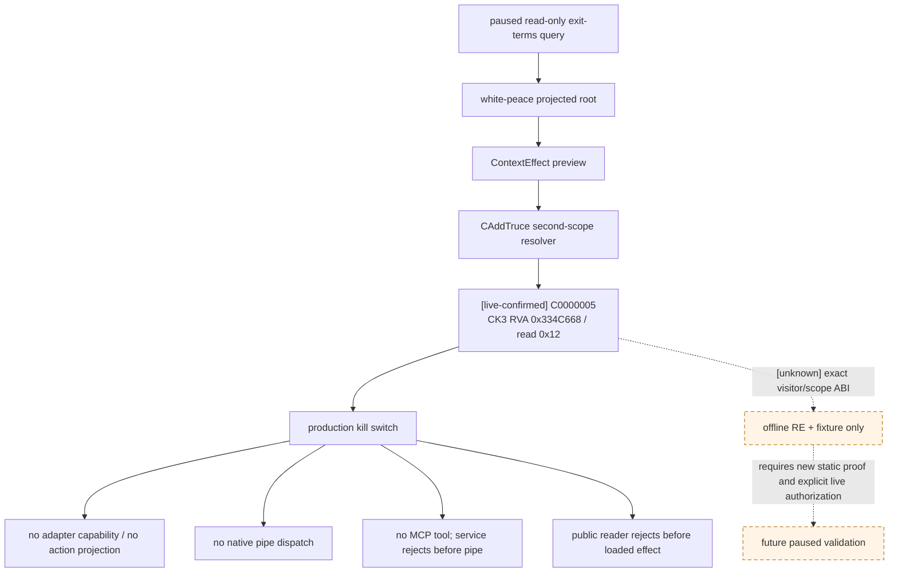

## 三种结果不是三个按钮的同义词

| 结果 | 原版 interaction | `on_accept` | 主要用途 |
|---|---|---|---|
| 进攻方胜利 | `end_war_attacker_victory_interaction` | `end_war = attacker` | 进攻方执行要求，或防守方承认进攻方胜利 |
| 白和 | `end_war_attacker_white_peace_interaction` | `end_war = white_peace` | 双方放弃本次胜负结果；必须额外满足 `is_white_peace_possible = yes` |
| 进攻方失败 | `end_war_attacker_defeat_interaction` | `end_war = defender` | 防守方执行要求，或进攻方投降 |

[static-confirmed] 三个 interaction 都要求战争仍有有效 CB；白和还会逐 CB 检查是否允许白和。
人质会改变接受分和结果，但“带人质的结果导致对手失去全部领地”有额外禁止或自动接受屏障，不能把无人物交换的结果验证复用于人质结果。

## 战争面板的 exact-build 结果构造

[static-confirmed] 以下 RVA 均来自本文冻结的 `ck3.exe`，不是跨版本签名：

| 锚点 | RVA / 数据 | 已闭合语义 |
|---|---:|---|
| `CWarOverviewWindow` RTTI / 主对象 vtable | `0x5210C20` / `0x4108DF0` | 战争面板类；结果页 context 在窗口重建时生成 |
| `CEndWarAttackerVictoryInteractionData` | RTTI `0x546AB30`，vtable `0x428EEA8` | 进攻方胜利 special interaction data |
| `CEndWarWhitePeaceInteractionData` | RTTI `0x546AAB8`，vtable `0x428EF88` | 白和 special interaction data |
| `CEndWarAttackerDefeatInteractionData` | RTTI `0x546AAF0`，vtable `0x428EF18` | 进攻方失败 special interaction data |
| 结果 context 构造器 | `0xC569F0` | `(out, war, player_victory)`；只接受玩家为 primary attacker / defender |
| special-interaction context helper | `0x2225D40` | 以 `dl` 索引 `CCharacterInteractionDatabase + 0x1008 + dl*8` |
| context validator / 发送 | `0x2C43F00` / `0xF54FA0` | `CanSend` 与发送前验证；通过后构造发送命令，flags 为 `0x0E` |
| effect-description 重建 / getter | `0xF59200` / `0xF599C0` | 按 Victory / White peace / Defeat 重建三份实时效果文本，getter 再按 tab state 取对应字符串 |
| 脚本 effect 投影器 | `0x27A2B20` | 在当前 war/CB scope 下求值 loaded effect 并写入 WarOverview 效果文本；可作原始审计口，不能把本地化文本当结构化数值解析 |

[static-confirmed] `CWarOverviewWindow` 的重建段 `0xF54C40–0xF54CC6` 生成三个 context。这里的
bool 已由 GUI caller 而不是凭当前 bridge 命名闭合：

- `this + 0x12A0`：`0xF560A0` (`SetEffectsTabVictory`) 选中，调用 `0xC569F0(..., true)`，即“玩家胜利”；
- `this + 0x15D8`：`0xF560C0` (`SetEffectsTabWhitePeace`) 选中；活动 CB 的 white-peace flag
  为真且玩家是 primary leader 时，以 special index `3` 生成白和 context；
- `this + 0x1910`：`0xF560E0` (`SetEffectsTabDefeat`) 选中，调用 `0xC569F0(..., false)`，即“玩家失败”。

[static-confirmed] 白和分支 `0xF54C52–0xF54CA7` 读取 `[[CWar + 0x100] + 0x1718]` 的 bit `7`；仅该位为真，
且玩家 CharacterID 等于 primary attacker / defender 时，才以 `dl = 3` 调用 `0x2225D40`。发送选择器
`0xF54EF0–0xF54F99` 又按面板状态 `0/1/2` 分别选择 `+0x12A0`、`+0x15D8`、`+0x1910`
（即 Victory / White peace / Defeat；胜利页可再进入人质 context helper），随后统一走 `0xF54FA0`。

[static-confirmed] `0xC569F0` 先读取 `CWar + 0x288/+0x28C` 的 primary attacker / defender。若玩家是
primary attacker，它把接收方换成 primary defender，并对输入 bool 执行 `xor 1`；若玩家是 primary defender，
则不反转；玩家不是任一 primary leader 时直接返回空 context。随后 `(bool + 1) * 2` 选择数据库索引。

| 玩家身份 | 输入 bool | 数据库槽 | 绝对战争结果 | 面板语义 |
|---|---:|---:|---|---|
| primary attacker | `true` | index `2` / `+0x1018` | attacker victory | 玩家执行要求 |
| primary attacker | `false` | index `4` / `+0x1028` | attacker defeat | 玩家投降 |
| primary defender | `true` | index `4` / `+0x1028` | attacker defeat | 玩家执行要求 |
| primary defender | `false` | index `2` / `+0x1018` | attacker victory | 玩家投降 |
| 任一 primary leader | 独立路径 | index `3` / `+0x1020` | white peace | 玩家提出白和 |

[static-confirmed] 因而这个 bool 的正确语义是 `player_victory`，不是
`concede_own_side`；对玩家进攻方，typed surrender 必须传 `false`，typed victory 必须传 `true`。
修复前的 native bridge 曾把这两个参数/行标签反接；该旧 build 的 `victory` / `surrender`
rows 是 invalid machine input，white-peace 独立 index `3` 行不受影响。当前修正 build 已在同一 paused
WarID 复验玩家为 attacker 的两行；玩家为 defender 的极性仍必须有独立 golden/live fixture。

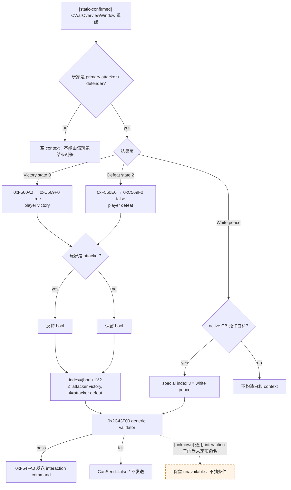

### WarOverview 实时效果文本只读 ABI

[static-confirmed] 面板对外方法字符串 `GetCurrentTabEffectsDescription` 在 `0x4109208`，
反射 wrapper `0xF5D030` 调用真正 getter `0xF599C0`。getter 读 `CWarOverviewWindow+0x100` 的 tab state：

| tab state | 结果 | MSVC string | 重建时的 CB loaded-effect source |
|---:|---|---:|---:|
| `0` | Victory | `window+0xCF8` | `CCasusBelliType+0x968` |
| `1` | White peace | `window+0xD18` | `CCasusBelliType+0x9C8` |
| `2` | Defeat | `window+0xD38` | `CCasusBelliType+0xA28` |

[static-confirmed] `0xF59200(CWarOverviewWindow*)` 清空并重建三份字符串：它从
`window+0xF8` 的 war provider 取 `CWar`，取 `CWar+0x100` 的活动 CB type，然后分别在
`0xF59323` / `0xF5938E` / `0xF593EE` 调用 `0x27A2B20`。这给出可立即施工的
`native_effect_description` 只读 MCP：必须同 paused revision 重建/复制三份原始文本，发布本地化语言、
raw string 与 tab/outcome 映射作审计证据。它可以验证动态金额/人物是否出现，但文本中有本地化、
markup 与条件 tooltip，不得反向 parse 成 planner 的结构化权威数值。

### loaded-effect 结构化 preview 回调 ABI

[static-confirmed] `0x27A2B20` 不是直接拼本地化文本。它先以 `0x10803E0`
建立输出容器，再调 `0x3380170(loaded_effect, context, collector)`；后者调 loaded-effect
vtable `+0x58` 生成 `0x88`-byte 结构化中间 rows。`0x27A2B20` 随后用 row vtable
`+0x80` 和 collector `+0x1790/+0x179C` 做过滤，最后才交给 `0x33CEBB0` 渲染。
因此 terms MCP 应在 collector 边界接结构化 row，不必解析 raw markup。

[static-confirmed] 与当前 `claim_cb` 第二切片直接相关的 registration / runtime vtable 为：

| compiled effect | registration → factory → runtime vtable | execute / preview virtual |
|---|---|---|
| `setup_claim_cb` | `0x444ABA8 → 0x2EA2230 → 0x444B548` | idx22 `+0xB0 = 0x2EA8200` / idx23 `+0xB8 = 0x2EA7E90` |
| `pay_short_term_gold` | `0x446FC18 → 0x2EF4E70 → 0x446E950` | idx22 `0x2EF1BA0` / idx23 `0x2EF1440` |
| `release_from_prison` | `0x443F790 → 0x2E879F0 → 0x443F220` | idx22 wrapper `0x2F0A240 → +0xC0` / idx23 wrapper `0x2F0A280 → +0xC8` |

#### defeat gold 的本地化前数值回调

[static-confirmed] `pay_short_term_gold` preview `0x2EF1440` 在 `0x2EF1728`
构造 payer/payee 两个 `{type=4, CharacterID}` scope，再调
`0x2EF4530(effect, &amount_raw, payer_scope, eval_context)`。输出是 signed
Q100000 `int64` 最终金额：该 evaluator 求 effect `+0x60` 的 compiled value，再应用
effect `+0x318` 的可选 rounding/scaling 与 `+0x168` 的可选 minimum。
`0x2EF1760–0x2EF1797` 把 payer scope、payee scope、`{tag=1, raw=amount_raw}` 和
effect object 一起交给 preview collector。这是一个可直接施工的只读 ABI：
能发布准确 payer/payee/amount，又不走 `0x2EF17C0` execute 分支的真实扣款/入账。

[static-confirmed] `yearly_income=yes` 的准确算术也已闭合：`0x2EF4530` 先读 payer
当前月收入 raw，乘 `12`，再与 compiled factor 作 Q100000 定点乘法；正结果随后在
`0x2EF4635–0x2EF466D` **向上取整到整 gold**。早期 research scratch 读到的月收入
raw=`567481`，据此得到 `20500000`（`205` gold）；它不是当前帧 golden。[live-confirmed]
diag4 在 paused `date_raw=53175816` 同帧直接调用完整 evaluator `0x28DBE90` 得到
raw=`551588`，而 `extension+0x2B0` cached leaf 同时为 `570772`。后者不能代替 evaluator：按
authoritative callable 的静态算术为 `551588×12×3=19857168`，向上取整后是 raw=`19900000`
（`199` gold）。v2 仍必须在同一 paused frame 实际调用 `0x2EF4530`；在 callback 返回前，`199`
只能标 `static-predicted`，不能冒充 `live-confirmed actual_amount`。玩家当前 gold balance
raw=`49048276`（`490.48276`），足以支付这个预测额；余额也必须与条款 callback 同 revision 发布。

#### `cb_prestige_factor` 构造路径

[static-confirmed] `setup_claim_cb` execute `0x2EA8200` 把一个 caller-owned Q100000 accumulator
交给 `0x2EA92C0`。后者对每个直接 title 读 `title->template+0x5C` tier，以 tier
索引 `module+0x4F6B870` 指向的 factor table 并逐项累加；随后再调
`0x2EAA790` 计算 change/vassal 产生的 additional factor 并加入同一 accumulator。
`0x2E9F2C0` 最后以 `module+0x57EB754` 的 script identifier 把该 accumulator 写入
effect scope；字符串 static initializer 证明这个 identifier 就是 `cb_prestige_factor`。

[live-confirmed] 2026-08-25 对 paused `WarID=16777290` 的只读进程观测得到：
`CWar+0x290=29829`，target `2388` 的 tier=`3`，identifier ID=`82`；runtime table raw
（scale `100000`）为 `[0,50000,100000,500000,1500000,5000000,10000000]`。因而
`d_spoleto` 这一个直接 target 对 `F` 的已证贡献是 raw `500000`（`5.0`）。
这不能被宣布为 total `F=5`：`0x2EAA790` 仍可追加 vassal/change 贡献，必须从
preview traversal 的 script-variable container 直接读取 identifier `82` 的最终 row，才能使
`cb_prestige_factor.status=available`。当前进程读是 RE 证据，还不是 generation-safe MCP wire。

[static-confirmed] 最终 row 的只读捕获路径已经闭合。`0x3380170` 并不把 script variables 写进
caller 的 `WarEffectContext+0x18`；它在自己的栈帧调用 `0x3354330` 构造临时 container，并把
`wrapper+0x18` 指向该 container。随后它只从 root loaded-effect 读取 vtable `+0x58`，以
`(root,wrapper,mode=0,collector)` 调用 preview；返回后即释放 container。因此在
`0x3380170` 返回以后扫描 `WarEffectContext`，或从 `attacker prestige / -5` 反推 `F`，都不是
identifier `82` 的原生观测。

可施工的无游戏对象写入方案是给 `0x3380170` 一个栈上 root proxy：proxy 使用本地复制的 vtable，
只把 slot `+0x58` 换成本 DLL trampoline。trampoline 以保存的真实 root 和真实 slot `+0x58`
转调原方法；原方法返回后、trampoline 返回前，`wrapper+0x18` 仍有效，此时读取最终 row。
`0x3380170` 继续原样负责 TLS preview flag、由 `effect_context+0x10` 派生的 RNG seed、
`0x3354330/0x3354280` 构造及逆序清理。proxy、复制 vtable 和 capture state 全在本 DLL 栈/TLS，
不改真实 loaded-effect 的 vptr 或其它 CK3 对象。

临时 variable container 与 identifier row 的冻结 ABI 是：

| 对象 | exact layout / invariant |
|---|---|
| container header | data=`+0x00`、capacity=`int32 +0x08`、count=`int32 +0x0C`、allocator=`+0x10`；只接受 `0 <= count <= capacity` 与有界 count |
| variable row | stride=`0x20`；identifier=`int32 +0x00`、value tag=`uint16 +0x08`、subtag=`uint16 +0x0A`、raw=`int64 +0x10`、flag=`uint8 +0x18` |
| `cb_prestige_factor` final row | identifier `82` 必须恰好一行，`tag=1, subtag=0, flag=0`；`raw` 是 signed Q100000 final `F` |
| root preview slot | `void (*)(void* real_root, void* wrapper, uint32_t mode, void* collector)`；本路径要求 helper 传入 `mode=0` |

trampoline 必须与 resource callback hook 合并到**同一次** outcome traversal；不得为取 `F` 再跑一次
loaded effect。调用前后仍要复核 WarID、CB pointer、root pointer 与 paused revision；row 缺失、重复、
tag 不符或 container 边界不合法都使整个 strict v2 unavailable。该 ABI 已经静态闭合，但尚未经过
production paused query 回读，所以当前 `F` 仍是 `pending-live`，不是 `live-confirmed`。

[historical fixture / superseded boundary] 旧 broad v2 fixture 曾把 WP/defeat 写成“两次均经原 root traversal”；
这不再描述当前代码。两次 `0x334C668` 实机 crash 后，broad `CaptureWarExitLoadedEffect` 的 attacker-defeat
分支只记录 shape 并在调用 original slot 前 fail closed，不能引用旧 fixture 宣称 defeat preview 已恢复。
当前有效证据是下文独立 `ReadRaiktorSurrenderPrestige` 的 original-visible-root fixture；它不重新启用 broad reader。

[fixture-confirmed] canonical v2 production reader 已编入待部署 DLL
`SHA256=D7B87EA01A82FD70EBA0089F21F95ACCCBF9410710825974B9AA949B9165C8DE`
（427008 bytes）；native CTest `6/6`、Python `254`、anchor checks `138/20` 通过。这里的 build/test
证据只证明 wire 与生命周期实现已经落地；在当前 paused revision 实际加载该 DLL 并完成两次同帧 query
以前，所有本帧动态值仍标 `pending-live`。

#### resource delta collector 的类型归一化

[static-confirmed] 四类 fame/devotion 节点共用 preview `0x3389C20`，legitimacy 使用专用
preview `0x2EEB520`，但最终都调用 preview collector vtable `+0x08`。exact-build runtime
vptr 与结构化 `resource_kind` 的冻结映射是：

| runtime node vptr | idx23 preview | `resource_kind` |
|---|---|---|
| `module+0x446C7B0` | `0x3389C20` | `prestige` |
| `module+0x446D368` | `0x3389C20` | `prestige_experience` |
| `module+0x446CAD0` | `0x3389C20` | `piety` |
| `module+0x446CA08` | `0x3389C20` | `piety_experience` |
| `module+0x446E3D8` | `0x2EEB520` | `legitimacy` |

`0x3389C20` 先以 `0x9698B0(node+0x60, &raw, context, context+0x28,
node+0x10)` 求值，再把 `rdx=current_scope`、`r9={uint32 tag=1,pad,int64 raw}`、
stack arg5=`node` 交给 collector `+0x08`。`0x2EEB520` 在
`0x2EEB6C4–0x2EEB6E9` 发布相同的 scope/value 形状；额外 descriptor 不能取代 node vptr
作 kind 判别。只接受 scope `uint16 type=4` 且 `+0x08` 是 generation-valid full
CharacterID、value `tag=1` 的 row；按 `(CharacterID, resource_kind)` 求和，同时保留原始
row 顺序作审计。

[static-confirmed] `claim_cb` 的 stock WP 会遍历 participant allies，defeat 会遍历全部
participants；贡献结算因此还会向同一个 `+0x08` slot 发送非 primary Character row，其中可能使用
本切片未分类的 contribution-specific node vptr。canonical v2 是有意冻结的 **primary-only** 切片：

- 第一 scope 能解析为 generation-valid Character，且 ID 既不是 primary attacker 也不是 primary
  defender 时，无论 node vptr 已知与否，都先原样 forward 给原 collector、再忽略，不占用
  `primary_resource_deltas` 的 10 格，也不令 v2 unavailable；
- 第一 scope 是任一 primary Character 时，node vptr、第二 scope 与 fixed payload 必须满足对应 kind
  合同；primary unknown node 继续令整个 strict v2 fail closed；
- 第一 scope 不是合法 typed Character 或 generation 复核失败时，也不能借“可能是盟友”放行。

[fixture-confirmed] native fixture 在 WP/defeat 两次 traversal 中各注入一个已知 prestige ally row 和一个
unknown-vptr ally row；四行全部转发给原 collector、均未污染 primary grid。另向 primary attacker 注入
unknown-vptr row 时，query 原子返回 unavailable，并仍按原顺序完成 context/collector teardown。这个
fixture 只冻结过滤与生命周期合同，不冒充当前 live ally 的实际贡献值。

[static-confirmed] 原版 preview collector 是 `0xD8`-byte stack object：ctor=`0x10803E0`，
vptr=`module+0x411CBA8`，`+0x08` wrapper=`0xF52090`，row data/count=`+0x10/+0x1C`，
row stride=`0x88`，stack dtor=`0x10804E0`。loaded traversal 为
`0x3380170(loaded_effect, effect_context, collector)`。实现可复制原 vtable、只拦截 `+0x08`
并在验证/记录后 forward `0xF52090`，其它 slots 原样保留；不得用只实现一个 slot 的假 collector
执行整棵 loaded effect。`0xF52090` 同步消费参数：保留 `RCX/RDX/R8/R9`，原 arg5 传给
slot `+0x10`，arg6 强制为 0，原 arg6 改作 arg7；collector 不保留 borrowed scope/value 指针。

[static-confirmed] collector row 的销毁也已闭合：main rows 位于 `+0x10`、count=`+0x1C`、
allocator=`+0x20`、stride=`0x88`；逐 row 先对 `+0x78` 指针调用 `0x9A4060`，再以
`0x3E261D4(ptr,0x10D8)` 释放，并析构 row `+0x50/+0x30` 两个 string；aux array 位于
`+0x28/+0x30/+0x34/+0x38`。stack collector 由 `0x10804E0` 完整析构，不能只释放 hook
自行记录的 rows。

[static-confirmed] WarOverview effect context 至少 `0x168` bytes，先 `0x81F190(context)`，再
`0x27A46F0(context,CWar,0)` 绑定战争。按 `0xF5973E` 的原顺序 teardown：

1. `0x81E900(context+0x118)`；它先清 header `+0x148` 的 `0x48`-byte rows（row dtor
   `0x81E980`，allocator 在 `+0x158`），再清 header `+0x128` 的 `0x20`-byte rows
   （row dtor `0x81E860`，allocator 在 `+0x138`）；
2. 若 `context+0x100` data 非空，调用 `0x81E980(context+0x100)`，再经
   `context+0x110` allocator vtable `+0x10(data,8)` 释放并清零；
3. 若 `context+0x18` data 非空，先清 `context+0x24` count，再经
   `context+0x28` allocator vtable `+0x10(data,8)` 释放；该处 rows 是 trivial。

这条 ownership/destructor 顺序已足以施工 dry preview；production capability 仍须用同 paused frame
before/after identity 验证它没有写状态或跨帧借用对象。

#### primary resource balance / income 的 exact-build 读口

[static-confirmed] `CCharacter+0x1A8 -> extension`；extension 缺失时下列 extension 资源按原生 getter
语义返回合法零，而不是 unavailable。全部 balance/experience/income 都是 signed `int64` Q100000；
level 是 `int32`：

| 字段 | exact getter / offset | 语义 |
|---|---|---|
| gold balance | reflection `GetGold` wrapper `0xBDC460`；`extension+0x100` | 当前可花 gold；**不是** `+0x2B0` |
| piety | core `0x2611A00` / condition `0x288F580`；`extension+0x110` | 当前可花 piety |
| piety experience / devotion total | `extension+0x118`；阈值比较链 `0x2611ADE` | devotion 累积量；cached devotion level=`int32(extension+0x120)` |
| prestige | core `0x2611A30` / condition `0x2870A60`；`extension+0x130` | 当前可花 prestige |
| prestige experience / fame total | `extension+0x138`；阈值比较链 `0x2611B3E` | fame 累积量；cached fame level=`int32(extension+0x140)` |
| legitimacy | wrapper `0x2625280` / condition `0x2871150`；`leg=*(CCharacter+0x1C0)`，非空时 `max(*(int64*)(leg+0x28),0)` | 无 legitimacy 对象时合法零；负 raw 原生 clamp 到零 |
| monthly gold income | `0x28DBE90(Fixed*out,CCharacter*,void* breakdown=null,void* eval_ctx=null)`；cached leaf=`extension+0x2B0` / `0x28745D0` | 完整 evaluator 是 wire 的 authoritative 本帧月收入；cached leaf 可滞后或采用不同刷新时点，只作诊断，不是 readiness cross-check |
| cached yearly income | leaf `0x2874550` | `extension+0x2B0` cached raw 乘 `12`；不是完整 evaluator 的独立复核口 |

勘误：`extension+0x2B0` 是 **cached monthly income leaf**，不是 gold balance，也没有与
`0x28DBE90` 同一 paused frame 逐位相等的原生合同。`+0x150/+0x158` 是
influence / influence experience，`+0x170/+0x178` 是 merit / merit experience，均不得误标成
prestige/fame 或 piety/devotion。generation-safe Character storage 是 `module+0x570C130`，成功解析后还要
复核 `CCharacter+0x18` full CharacterID。

[live-confirmed, read-only RE] 当前 paused 进程的直接只读值如下。diag4 DLL
`SHA256=BC66CBAB8A4E6BEF45C6097DBB57D511F45EA61AB11460B17ABA3897F47009E1` 在
native revision `3` / query revision `14`、`date_raw=53175816` 捕获了 attacker callable/cache 差值，
且 before/after frame identity 不变。其余 monthly 行是 direct cached leaf 诊断；完整 12+2 production wire
仍待修复后 same-frame 重跑，不能单独解冻写动作：

| CharacterID | gold | `0x28DBE90` callable / `+0x2B0` cache | prestige / fame XP / level | piety / devotion XP / level | legitimacy |
|---|---:|---:|---:|---:|---:|
| attacker `29829` | `49048276` | `551588 / 570772` | `216143360 / 521932405 / 5` | `26440000 / 120440000 / 5` | `32300000` |
| primary defender `36108` | `20244084` | `pending fixed-v2 rerun / 1659854` | `61396150 / 127396150 / 5` | `116304760 / 291304760 / 5` | `31860000` |
| defender participant `28180` | `8439862` | `not in canonical v2 / 655279` | `91221580 / 104221580 / 5` | `112830000 / 147830000 / 5` | `73260000` |

[live-confirmed root cause] final2/diag3 的 production reader 曾额外要求
`0x28DBE90 callable_raw == extension+0x2B0 cache_raw`，因此当前帧在 `primary_resources` 阶段
fail closed，尚未进入 PoW 或 loaded-effect preview。该等式不是原生 ABI 合同。最小修复边界是：wire
只发布 callable raw；保留函数返回指针、Character generation、整份 query before/after identity，以及同一
paused frame 前后两次 callable 结果相等的稳定门；删除 cache equality readiness。`+0x2B0` 若继续读取，
只能留在错误诊断/RE 日志，不能进入成功 payload，也不能让合法 evaluator 结果 unavailable。

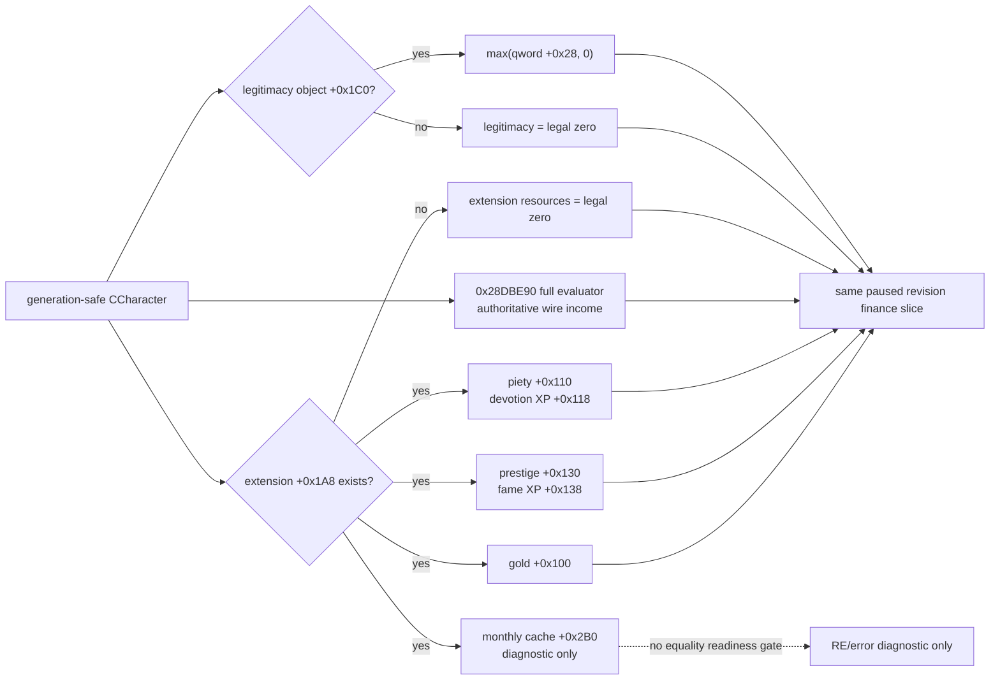

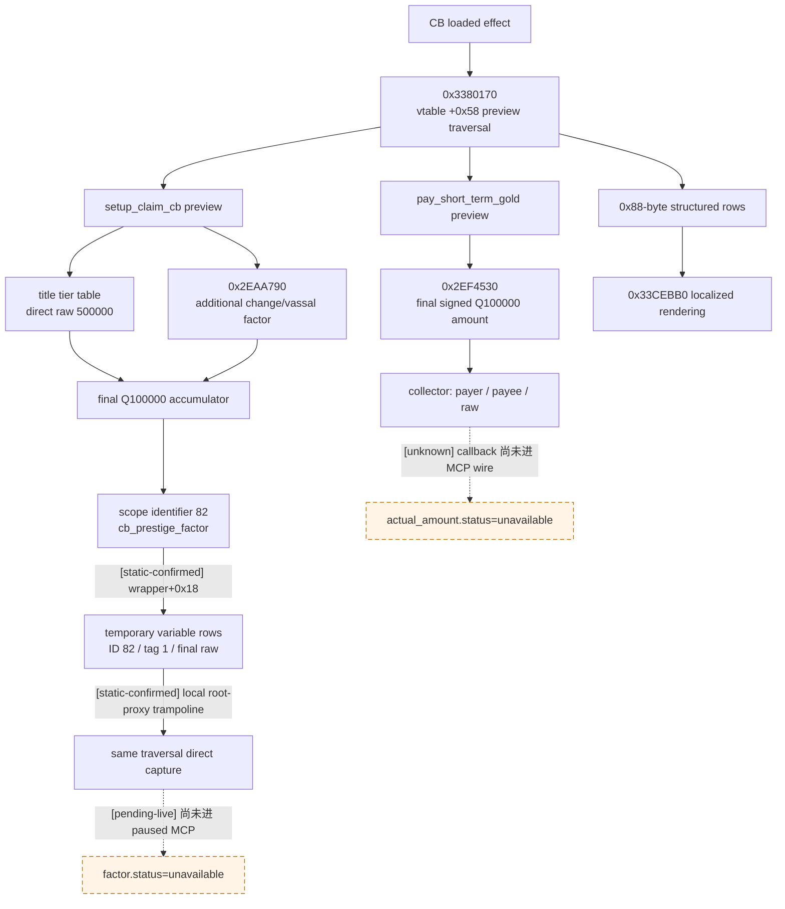

## exact-build 只读终止查询 ABI

[static-confirmed] 下列字段已经在本文冻结的 `ck3.exe` 上闭合到可实现 ABI。它们必须从同一个 paused revision、
同一个 full-generation `WarID` 原子读取；这里的 RVA 不是跨版本签名。

| 查询域 | exact-build ABI / 布局 | 安全发布语义 |
|---|---|---|
| 活动 CB | `CWar + 0x100 -> CCasusBelliType*`；类型数据库 ordinal 为 `int32(+0x10)`；canonical key 是 MSVC string `+0x18`（size `+0x28`、capacity `+0x30`） | 指针、ordinal 与字符串布局全部验证后发布 `index/key`；`+0x14` 是 hash，不能冒充稳定身份 |
| 白和许可 | `uint32(CCasusBelliType + 0x1718) & 0x80` | 这是战争面板构造 white-peace context 前读取的同一位；仍须再跑 native validator，不能只凭该位发送 |
| 进攻方总战分 | `0x222A8A0(CWar*, nullptr) -> int32` | 原始值是 attacker-relative；defender absolute total 为其相反数 |
| 被俘战分 | `0x29030B0(CWar*, nullptr) -> int32` | attacker-relative imprisonment 分项 |
| 战斗战分 | `0x2903150(war,null) + 0x2903DA0(war,false,null) - 0x2903DA0(war,true,null)` | attacker-relative battles 分项 |
| 占领战分 | `0x2904B00(war,side,null) -> uint64`；低 `int32` 为分数，bits `32..39` 含 authoritative flag | 先读 `side=false`；若其 flag 为 0 直接取低值，否则再读 `side=true`，按双方 flag 选择 `-low1` 或 `low0-low1` |
| ticking 战分 | `0x2905BC0(war,false,null,true) - 0x2905BC0(war,true,null,false)` | attacker-relative ticking 分项 |
| 战争时长 | `current_date_raw=int32(CGameState+0x08)`；`start_date_raw=int32(CWar+0xE0)` | `war_duration_days=(current-start)/24`；负值或算术越界必须使该域 unavailable |
| 原生接受分 | `0x2C44320(context, int64_t* out_raw) -> out_raw` | 返回未截断的 `CFixedPoint` raw，显示值为 `raw/100000`；战争查询应保留 raw，不照抄 GUI 的显示 clamp |
| 最终 AI 答复 | `uint8 0x2C43B40(context, answer_mode=1, flag=0, sink_a=null, sink_b=null)` | 在 context finalize 后、teardown 前同步调用；把返回 byte 发布为 canonical `recipient_response.decision_status_raw`，并发布 `would_accept_now=(status!=2)`；不得自行把 raw 分数重算成 bool |
| `auto_accept` | interaction `+0x2580` 为可选 trigger；`+0x2A48` 为无 trigger 时的 bool fallback | `trigger ? 0x334C510(trigger, context+8) : bool(+0x2A48)`；`0xF55340` 返回的是“是否需要答复”的反值，不能直接绑定成 auto-accept |
| primary 当前资源 | `extension=*(CCharacter+0x1A8)`；gold `+0x100`、piety `+0x110`、devotion XP `+0x118`、prestige `+0x130`、fame XP `+0x138`；legitimacy `CCharacter+0x1C0 -> +0x28` | Q100000；extension/legitimacy 对象缺失按原生 getter 发布合法零；full CharacterID 必须 generation 复核 |
| primary 收入 | `0x28DBE90(Fixed*out,CCharacter*,null,null)`；cached monthly leaf `extension+0x2B0` | callable 是 canonical Q100000 monthly income；`+0x2B0` 可与 callable 不同，只作诊断，既不得冒充 gold balance，也不得作为 equality readiness gate；`0x2874550` 只是 cached leaf ×12 |
| `cb_prestige_factor` | `0x3380170(local_root_proxy,effect_context,collector)`；proxy slot `+0x58` 转调真实 root 后、返回前扫描 `*(wrapper+0x18)` 的 `0x20`-byte rows，取唯一 identifier `82` / `tag=1,subtag=0,flag=0` 的 `int64 +0x10` | 与 resource rows 同一次 traversal 直接读取 signed Q100000；不得在 helper 返回后读 `WarEffectContext+0x18`，也不得由 `prestige/-5` 反推；未通过 paused before/after 与 identity 复核前仍不广告 v2 |

[static-confirmed] 接受分函数的精确签名是
`int64_t* (*)(void* interaction_context, int64_t* out_raw)`。若 actor 与 recipient CharacterID 相同，原生写入
`10,000,000`；否则它以 `context + 8` 的脚本 scope 和 recipient 求值 interaction definition `+0x1BA8`
的 `ai_accept`。因此查询构造的无人物交换 context 能给出“无人物交换提议”的原生接受分和 auto-accept，
不能代表另行加入人质后的结果。

[static-confirmed] `ai_acceptance.raw_fixed_point` 不是最终接受判定。最终入口
`0x2C43B40` 的 ABI 是
`uint8_t (*)(CharacterInteractionContext*, uint8_t answer_mode, uint8_t flag,
void* error_sink_a, void* error_sink_b)`；原版 AI caller `0x28F9DD2–0x28F9DE9` 在 context 完成构造与
finalize 后、析构前，以 `(context,1,0,null,null)` 调用它，并执行 `cmp al,2; setne al`。所以原生 typed
语义是：canonical `decision_status_raw=2` 才拒绝，`0/1` 都是本时点接受；production 应直接发布
`would_accept_now=(decision_status_raw!=2)`。原生缺失态 `3` 不能进入 strict available v2；遇到它必须
不广告 capability，而不是把 `3!=2` 机械发布成接受。

[static-confirmed] 在 `answer_mode=1` 的内部普通分支，`0x2C43C50` 调 `0x2C44320` 后令
raw `>0 → status 0`、raw `<=0 → status 2`，阈值是严格 `>0`。但两项 interaction flag 优先产生
accepted `status 1`：`interaction+0x2A55` 为真，或 `interaction+0x2A58` 为真且 raw 位于
`[1,9,999,999]`。上游还可返回其它 status；因此 bridge 必须调用外层 `0x2C43B40`，不能只复制
`raw>0`。validator `0x2C43F00` 调的是 `answer_mode=0`，与 AI 答复不是同一个问题。

[inference] 当前 white peace raw=`+1,100,000`，按已闭合的普通 mode-1 路径预测
`decision_status_raw=0/1`、`would_accept_now=true`；surrender 另有 `auto_accept=true`。但尚未由 production
same-frame query 实际调用 `0x2C43B40`，所以当前只能发布 `static_predicted_would_accept_now=true`，
不得把这个推演写成 live wire。

[static-confirmed] 分项与总分应同时发布。已命名四项不保证穷尽原版总分；查询只能额外发布
`unclassified_remainder = total - imprisonment - battles - occupation - ticking`，不能把余数猜成 objective。
防守方绝对分及各分项均是相应 attacker-relative 值的相反数。

[static-confirmed] CB `end_war` 的三份实时 effect description 已闭合到上述可施工的原生 raw-string ABI；
结构化条款则不能由本地化文本反解。无人物交换 context 的结果摘要为：

- victory：玩家为进攻方时绝对结果是 `attacker_victory`；
- surrender：玩家为进攻方时绝对结果是 `attacker_defeat`；
- white peace：绝对结果是 `white_peace`；
- 该查询变体的 `hostage_exchange=[]`。

下文已对当前 `claim_cb` 的 titles / gold / prestige / piety / legitimacy / truce / prisoner 方向作
逐域静态闭合；每个本帧未求值数值或人物集必须逐字段标 `unavailable`，并指向具体的
`0x27A2B20` callback / loaded-effect xref 施工口。`unknown` 是逆向账本，不是可以用零、空列表或 raw tooltip
终结的字段。

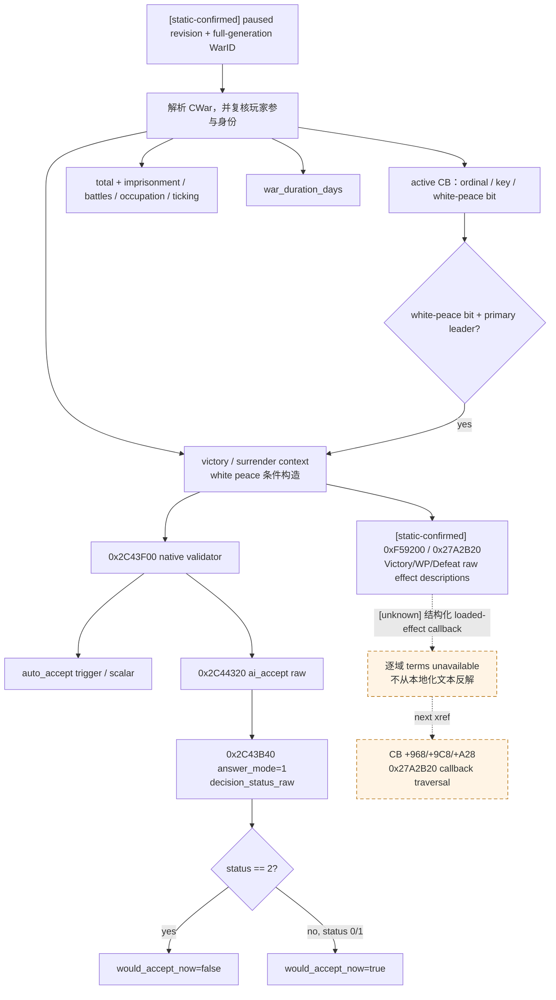

查询顶层状态至少区分 `available`、`no_played_character`、`war_not_found`、`player_not_participant`、
`requires_paused` 与 `unavailable`。可读结果应包含 `player_side`、`player_is_primary_war_leader`、活动 CB、
绝对总分/分项、战争日数，以及三种 outcome 的 `context_constructed`、`native_validator_passed`、
`auto_accept`、`ai_acceptance.raw_fixed_point`、`decision_status_raw` 和 `would_accept_now`。任一子域读不到时，
该子域必须显式 unavailable/unknown；
不得以 `0`、`false` 或空条款伪装已观测。

## 玩家作为进攻方何时能投降或白和

| 玩家动作 | 原生确定门 | 接收方为 AI primary defender 时 |
|---|---|---|
| 投降 | [static-confirmed] 玩家是 primary attacker；战争仍能构造 interaction；CB 有效；通用 context validator 通过 | [static-confirmed] `end_war_attacker_defeat_interaction.auto_accept` 因接收方就是 AI primary defender 而为真 |
| 白和 | [static-confirmed] 玩家是 primary attacker；活动 CB 类型 `IsWhitePeacePossible`；战争存在、CB 有效、`is_white_peace_possible = yes`；通用 context validator 通过 | [static-confirmed] 白和没有 `auto_accept` 块；对方走 `ai_accept`，可以拒绝 |

- [static-confirmed] 投降的脚本 validator 与 `0xC569F0` 都没有战分、战争时长或 `days_since_max_war_score`
  门。`100` 战分 + `180` 日只约束 AI 何时主动产生投降提议，不约束玩家手动点击投降。
- [static-confirmed] 白和按钮在 GUI 中还以
  `WarOverviewWindow.GetWar.GetActiveCB.GetType.IsWhitePeacePossible` 控制可见性；二进制初始化段在同一条件为真时才创建
  index `3` context，脚本 validator 再复核战争、有效 CB 与白和许可。
- [unknown] `0x2C43F00` 所复用的所有通用 character-interaction 门尚未逐项命名；所以本文证明的是“没有额外战分/180 日门”，
  不是声称任意伪造 context 都必定可发送。
- [static-confirmed] 玩家若只是参战盟友而不是 primary war leader，`0xC569F0` 不生成投降/胜利 context；白和构造段也要求
  玩家等于 primary attacker 或 primary defender。

```mermaid
flowchart TD
    S["[static-confirmed] 战争仍存在且 CB 有效"] --> R{"[static-confirmed] 希望得到哪种结果?"}
    R -->|进攻方胜| AV["attacker_victory<br/>end_war=attacker"]
    R -->|白和| WP{"is_white_peace_possible?"}
    R -->|防守方胜| AD["attacker_defeat<br/>end_war=defender"]
    WP -->|yes| WPI["white_peace interaction"]
    WP -->|no| B["[static-confirmed] 该 CB 禁止白和"]
    AV --> Q{"谁发起?"}
    WPI --> Q
    AD --> Q
    Q -->|AI 主动考虑| O["ai_potential / ai_will_do 主动提出树"]
    Q -->|玩家手动| PV["原生 context validator"]
    O --> A["接收方 ai_accept / auto_accept 树"]
    PV --> A
    A --> E["结果应用与 CB-specific effects"]
    O -. "[unknown] 调度日与 interaction scheduler" .-> U["具体发送时点未闭合"]
    classDef unknown stroke-dasharray: 6 4,fill:#fff4e5,stroke:#b36b00;
    class U unknown;
```

## 原版 AI 主动结束战争

### 执行进攻方胜利

- [static-confirmed] 进攻方通常在进攻方战分达到 `100` 时主动执行要求。
- [static-confirmed] Peacemaker perk、`mpo_nomad_legacy_3`、恐吓用的断首变量和特定 conqueror 分支可以把主动执行候选门降到
  `90`、部分组合的 `80`，或断首分支的 `70`；这些门还带 AI 对手、CB 排除等附加条件。
- [static-confirmed] 如果 AI 主动方其实是防守方，也就是 AI 主动承认进攻方胜利，原版普通 `ai_will_do`
  分支要求进攻方战分达到 `100`，并且在最大战分停留至少 `180` 日。它不是“预计打不赢就提前投降”的预测树，
  也不是玩家手动投降的 validator。

### 执行防守方胜利

- [static-confirmed] 防守方通常在防守方战分达到 `100` 时主动执行要求；Peacemaker、文化参数、dynasty perk 和断首变量
  可以在部分 AI 对手场景把门降到 `90` 或 `70`。
- [static-confirmed] 如果 AI 主动方是进攻方，也就是 AI 主动投降，普通 `ai_will_do` 分支同样要求防守方战分达到
  `100`，并在最大战分停留至少 `180` 日；玩家手动提出投降不走这条分支。

### 主动提出白和

`ai_will_do` 的 base 是 `0`。下列正贡献提供主动提出动机，负人格修正或 `factor = 0` 可以压制它：

| 原版条件 | 主动提出倾向 |
|---|---|
| [static-confirmed] 进攻方：战争至少 365 日、进攻方战分不高于 0、同时还在另一场防御战争 | `+10`；本战争分不高于 `-50` 时再 `+40` |
| [static-confirmed] 防守方：战争至少 182 日且防守方战分不高于 15 | `+10`；不高于 `-40` 时再 `+50` |
| [static-confirmed] 防守方：战争至少 365 日 | 以 `war_days / 30` 为基础，再受正战分抑制；接近胜利时倾向继续等 ticking score |
| [static-confirmed] 任一方：战争至少 182 日且处于债务 | `debt_level * 20` 为基础，再受本方正战分抑制 |
| [static-confirmed] 战争至少 365 日、双方绝对优势均未到 30，且人质交换价值接近 | 人质价值和 boldness/honor/rationality/greed 共同修正 |
| [static-confirmed] conqueror 防守方被 AI 进攻 | `+100`，倾向尽快腾出资源继续征服 |
| [static-confirmed] `ai_potential` 预筛：AI 防守、玩家进攻且进攻方战分至少 10 | 候选直接被排除 |
| [static-confirmed] `ai_potential` 预筛：AI 进攻、玩家防守且防守方战分至少 70 | 候选直接被排除 |
| [static-confirmed] `ai_will_do`：AI 对玩家且自身落后至少 30 | `factor = 0`；对剩余候选再次禁止“正在输”的白和提议 |

[static-confirmed] 这两层对玩家限制是交互体验政策，不是期望效用最优性。合并后，对 AI 防守方的
`attacker_war_score >= 10` 预筛比后面的 30 分 veto 更早生效；AI 进攻方落后 30–69 时由 `ai_will_do`
veto，落后至少 70 时已被 `ai_potential` 排除。

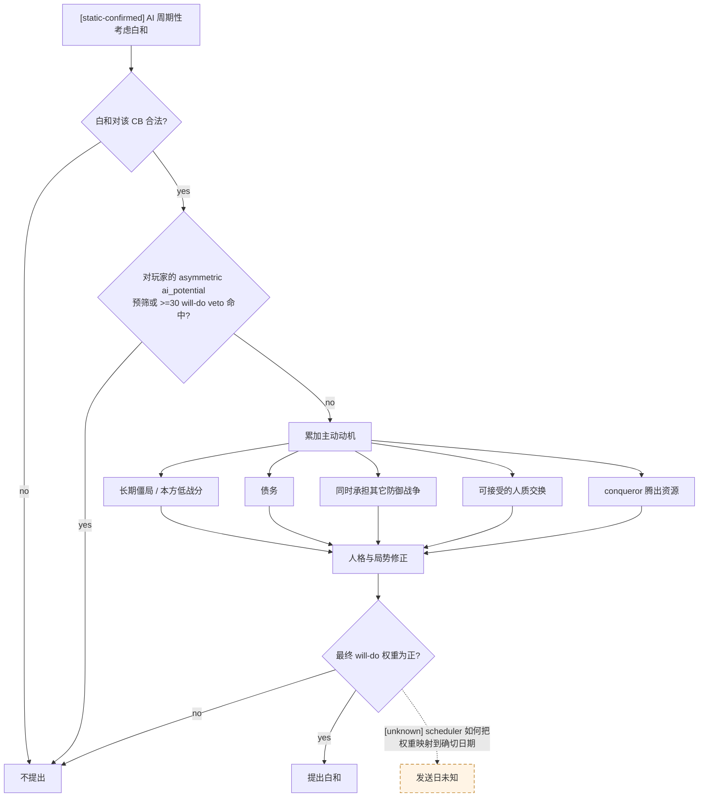

## 原版 AI 接受战争终止

### 胜负结果

- [static-confirmed] 进攻方胜利的普通接受分以 `-99 + attacker_war_score` 为骨架，再加入 Peacemaker、dynasty、断首和人质等修正。
- [static-confirmed] `attacker_war_score >= 100` 时有 auto-accept；另有 conqueror 防守方在对方军力达到特定脚本比较时折服的特殊 auto-accept。
- [static-confirmed] 进攻方失败的普通接受分以 `-99 + defender_war_score` 为骨架；如果接收方正是将获胜的防守方，
  另加 `WOULD_WIN_MODIFIER = +1000`。
- [static-confirmed] `defender_war_score >= 100` 时 auto-accept；如果 AI 接收方就是防守方，也会自动接受进攻方投降。
- [static-confirmed] 人质交换和“战争结果会使接收方失去全部领地”的组合有专门屏障，不能只看总分。

### 白和接受分

原版 `ai_accept` 的基础是 `-30`，然后累加：

| 项目 | 原版含义 |
|---|---|
| [static-confirmed] 当前战分 | 接收方为防守方时加入进攻方战分；接收方为进攻方时加入防守方战分。自己越接近输，越愿意白和 |
| [static-confirmed] 战争时长 | 365 日后加入 `war_days / 91`；十年约为 `+40` |
| [static-confirmed] 债务 | 182 日后，符合角色分支时按 `debt_level * 20` 加分 |
| [static-confirmed] 其它防御战争 | 进攻方还被其它战争进攻时 `+10` |
| [static-confirmed] 人格 | 防守方 vengefulness、进攻方 greed、双方 zeal/信仰敌对会降低接受倾向 |
| [static-confirmed] 和平相关特质/文化 | Peacemaker、nomad legacy、`facilitate_white_peace`、部分 struggle phase 通常加分 |
| [static-confirmed] 特殊战争 | GoK 防守方基础 `-70`；被占领县可逐县补回，最多 `+200` |
| [static-confirmed] 人质 | 双方人质价值以 0.5 倍进入白和接受分 |

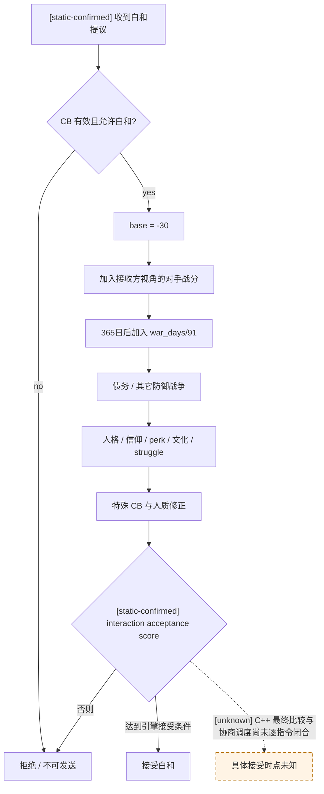

## 原版树的局限

1. [static-confirmed] 主动投降的普通门几乎完全由 `100` 战分加 `180` 日停滞决定；它不会因为未来战斗胜率极低而提前止损。
2. [static-confirmed] 白和树把当前战分、时长和债务作为代理变量，但没有直接查询未来战斗结果分布、关键人物死亡/被俘风险、
   增援 ETA 或继续战争的不可逆尾部损失。
3. [static-confirmed] AI 对玩家的非对称 `ai_potential` 预筛与落后至少 30 的 `ai_will_do` veto 是体验规则，
   不是理性经济规则。
4. [inference] 因此照抄原版树会产生两种失败：早期看不见必败而继续烧资源，或只因长期/债务而白和却没有比较 CB 条款的真实损失。

## 当前 bridge 能否执行这棵树

- [static-confirmed] 当前 `ActiveWarSnapshot` 发布 `war_id`、玩家攻守方、primary opponent、玩家是否 primary leader、
  目标 title / objective province 与省份状态、敌方默认集结点、玩家相对总战分，以及当前已观测的双方军队。
- [live-confirmed] 当前 bridge 已有按 full-generation `WarID` 绑定的 `enforce-demands`、typed white peace
  与 typed surrender 写口；修正后的查询极性已在当前玩家为 attacker 的 paused 帧验收。
  验收只读，没有进入 command queue；structured terms 未 live 前两个退出 step 都不得向 planner
  广告，玩家为 defender 的发送极性在独立 fixture 前也仍不授权。
- [static-confirmed] pending character interaction 快照只含 `instance_id`、sender 和 auto-accept notification，不能证明该
  interaction 是白和、投降、敌方投降还是普通外交，也不能绑定 `WarID`、结果条款、validator 或 acceptance。这个通用回复通道
  不是战争终止支持；当前 planner 已在 active war 中禁止接受/拒绝这种未分类 interaction，己方已经达到 `100` 的
  enforce-demands 仍先于该阻断执行。
- [live-confirmed] 上述 exact-build 查询已在 2026-08-25 的 paused `WarID=16777290` 实机帧成功返回；活动 CB、
  `IsWhitePeacePossible`、战争时长、绝对/分项战分、三个 context validator、无人物交换 `ai_accept` / `auto_accept`
  因而不再只是静态 ABI。查询全程未进入 command queue，日期保持 `53175816`。
- [live-confirmed] 独立 claim-disposition v1 已在同一 paused frame 连续两次发布 declared target、claimant、
  逐 title claim 四态与三结果方向，并完成 present-claim temporary 析构。legacy options row 的
  `terms.status=unavailable` 只表示动态 v2 尚未嵌入该行，不得再解释成 v1 不可观测。
- [static-confirmed] 最终 AI 答复 `0x2C43B40`、primary 余额/收入 ABI 与 preview context/collector teardown
  也已闭合；canonical v2 production reader 已完成 build/fixture 验证，但仍待在当前 paused frame 加载并
  same-frame query，当前 live options 只含 raw score/auto-accept。
- [pending-live] `cb_prestige_factor` 的 direct final-row ABI 已闭合但本帧 production 值尚未回读；短期赔款实际金额、胜利时 `resolve_title_and_vassal_change` 的最终逐项迁移、
  带人物交换变体、未命名战分余项、债务、其它可动员储备和 campaign forecast 仍未发布。每个动态缺口必须单独标
  `unavailable`，不能因一个字段未闭合就抹掉其余已证条款。
- [counter-policy] 在这些字段和原生命令闭合前，planner 不能把“战分为正”解释为应继续，也不能把“多次失败”解释为应立即投降。

[live-confirmed] 当前战争快照发布玩家为进攻方且 `player_is_primary_war_leader=true`，因此已经满足原生构造器的
primary-attacker 身份门。2026-08-25 的修正极性后同帧查询实际返回：

- `claim_cb`（database index 11），战争持续 347 天，CB 允许白和；
- 玩家相对战分 `+41`，进攻方/防守方绝对值为 `+41/-41`；四个已命名分项中只有 battles=`+41`，
  imprisonment/occupation/ticking 均为 0；
- surrender / attacker-defeat context：native validator=true、`available=true`，AI acceptance
  raw=`+86,000,000`（scale 100000），auto-accept=true；
- white-peace context validator=true、`available=true`，AI acceptance raw=`+1,100,000`（即 +11.0），
  auto-accept=false；
- victory / attacker-victory context：native validator=false、`available=false`，AI acceptance
  raw=`-5,800,000`（即 -58.0），auto-accept=false。

[static-confirmed] 修复前 JSON 的 `options.victory` / `options.surrender` 键本身是 invalid machine input，
不能让上层自行交换键名后继续执行；上述是修正 build 的全新查询结果。white-peace
走独立 index `3`，其 +11/validator 行在修复前后都有效。三结果的 `terms.status` 在该帧都为
`unavailable/cb_specific_terms_not_observable`，所以本次验收没有提交投降、白和或胜利动作。

### 当前 `claim_cb` 的三结果条款投影

[static-confirmed] 本节同时绑定上述 `ck3.exe` 与下列 1.19.0.6 原版文件。文件的静态方向已闭合；
本帧金额、角色集与条件分支仍要由 paused MCP 求值，不得用静态公式冒充 live 值。

| 文件 | SHA-256 | 本节用途 |
|---|---|---|
| `common/casus_belli_types/00_claim.txt` | `D9AA37BDC45F81B4F6185B2697A3EBD09404084EA0D3CF77BBE3C1D2C962E8B1` | `claim_cb` 三结果主树 |
| `common/scripted_effects/00_casus_belli_effects.txt` | `9F7C77CC9342B1197B1C802A2D465E56F7521458B103DEC84F5EB7222E45F18C` | prestige / prestige-experience 分流与 ally contribution |
| `common/scripted_effects/00_war_effects.txt` | `A936E09F448EF715580A918165EAB89A9368AD2D3014E425C998CD9D4F0E8D7D` | 赔款、单向停战、战俘释放 |
| `common/scripted_effects/06_dlc_ce1_legitimacy_effects.txt` | `DEE9D48221B49EF41490D04451ACD6DBFD4994A50EAD9D006F831F41A6247A83` | 合法性 winner gate / tier 表 |
| `common/scripted_effects/tgp_mandala_scripted_effects.txt` | `10B2C2C0E317D66F13237069064BC98267EBC7D75928F1AAD4E15397D2383A1B` | Mandala 条件虔诚/奉献 |
| `common/script_values/00_war_values.txt` | `ED1CDB6E8BC887CF1FFFE010F1E9CA642DFD6DAF241E81F23E6B4736F7AFDF3B` | `standard_truce_duration_days` |
| `common/character_interactions/00_war.txt` | `5C99B8F14893929A9BC2DBB5B258CDD2D4233D5805091952209413DE876EE09F` | 三结果 `on_accept` 的实际战俘释放 |
| `common/scripted_effects/07_dlc_ep3_scripted_effects.txt` | `D2F5FE80E7BC000A749642CD26BDE1626DBEA7409C39314B8583547AE43DB43D` | LAAMP 参战合约的独立战后付款 tooltip |

#### titles / claims

| 结果 | 准确方向 | 动态边界 |
|---|---|---|
| attacker victory | 创建 `conquest_claim, add_claim_on_loss=yes`，`setup_claim_cb` 把 target list 按 claimant 的 claims 加入 change，然后 resolve；基线是 defender 方失去相应 title/vassal 控制，claimant 取得声索目标 | administrative defender 可把其持有的 county+ 非 noble-family titles 动态追加进 target list；另有 landless ceremonial-liege 与 claimant 改投 attacker 分支。最终逐 title holder / vassal / liege operations 要求 structured preview |
| white peace | title holder 不因本 CB 变更；claimant 保留逐 declared-target claim，weak claim 执行 `make_claim_strong` | 需先读 claimant 及每个 claim 四态，才能发布哪些 claim 由 weak 变 strong |
| attacker defeat / player-attacker surrender | title holder 不因本 CB 变更；claimant 对每个 declared target 执行 `remove_claim` | 只移除 declared-target claims，不能外推其它 title |

[static-confirmed] 可直接施工的 titles ABI 为：`CWar+0x270/+0x278/+0x27C`（data/capacity/signed
count）读 declared `TitleID` 数组；`CWar+0x290` 读 claimant `CharacterID`；两者均必须 full-generation
resolve 与 ID 回读。`0x28B1AA0(out, claimant, title)` 返回 0x18-byte claim 对象：`+0x08` title ID、
`+0x0C` strong、`+0x0D` implicit、`+0x10` present；复制后以 vtable slot 0、参数 `0` 析构。

[static-confirmed] 可交给 native 实现的完整边界为：

- target array 要求 `capacity/count >= 0`、`count <= capacity`、`count <= 4096`，且非空时
  `data != nullptr`；
- title 从 `*(game_state+0xA0)+0x2FC8` 的 manager、再取 `manager+0x20` storage；
  character storage 由 `module+0x570C130` 指向。两种 storage 都用 `+0x20` slots、`+0x2C`
  signed capacity、`0x10` slot stride、slot `+0x08` object，且 capacity 必须在 `1..1000000`；
- 索引为 `uint32(full_id) & 0x00FFFFFF`，title 要求 `title+0x10 == full TitleID`，character
  要求 `character+0x18 == full CharacterID`；这个回读不能只比较 24-bit index；
- 准确函数类型为
  `void* __fastcall 0x28B1AA0(void* out_0x18, CCharacter*, CLandedTitle*)`。`present=true`
  时 vptr 为 `module+0x40E3060`，先复制字段并复核 output title ID，再经 vtable slot 0
  （当前 target `0x81B620`）以 `edx=0` 析构；`present=false` 时其它 bytes/vptr
  不保证初始化，**不得析构**；
- 同一 paused revision 内要在读取前后重读 WarID、array header/content 与 claimant。
  任一 generation 回读、bool 域、output ID 或前后一致性失败，必须拒绝该 terms
  slice，不能跳过有问题的 row 后宣称 complete。

[live-confirmed] 2026-08-25 在 paused `date_raw=53175816` 对当前 `WarID=16777290`
连续两次只读复核：war full-ID 回读一致；target header 为 `capacity=1,count=1`，
`TitleID=2388` 解析后 `title+0x10` 仍回读 `2388`；`CWar+0x290=29829`，解析后
`character+0x18` 仍回读 `29829`。因而当前 claimant 的实证值是 `29829`，不是占位/预测。
但这份 RE live observation 尚未进 termination MCP wire；在集成完成前，query 中的
claimant 仍必须留 `unavailable`，绝不得写占位 `0`。

#### gold

- [static-confirmed] victory 与 white peace 没有 `claim_cb` 基线 primary-attacker ↔ primary-defender 金币转移。
- [static-confirmed] defeat 的基线赔款方向是 **attacker → defender**，`GOLD_VALUE=3`。attacker 为
  landless adventurer 或月收入 `<=0` 时，名义值为
  `3 × medium_gold_value × defender_culture_multiplier`；否则为
  `3 × attacker_yearly_income × defender_culture_multiplier`。defender 文化有
  `more_gold_for_successful_defensive_wars` 时 multiplier=`2`，否则 `1`。`pay_short_term_gold` 对余额/债务的
  实际 debit/credit 仍需 live loaded-effect 求值。其本地化前准确 amount evaluator 与 collector
  ABI 已在上节闭合；当前只缺把该 callback 接入 termination MCP，不再缺金额函数。
- [static-confirmed] 三结果都调用 `laamp_as_mercenary_payout_tooltip_effect`。它是独立的 active
  `laamp_join_war_contract` 合约派生条款，方向是 **employer → 符合贡献门的 landless adventurer**；
  不得与 defeat 基线赔款合并，也不得在没有匹配 contract 时发布空列表冒充已枚举。

#### prestige / prestige experience

`F = cb_prestige_factor`。`claim_cb` 把 `IS_RELIGIOUS_WAR=no`，因此主 fame 路径是 prestige 而非 piety：

| 结果 | primary attacker | primary defender | allies |
|---|---|---|---|
| victory | `prestige_experience += min(10F,1000)`，不是可花 prestige | `prestige += max(-10F,-1000)` | 双方盟友按 contribution 获得实际 prestige，scale `10`、max `1000` |
| white peace | `prestige += -5F`；如有 `accolade_champions_white_peace` 参数还另加 `accolade_white_peace_prestige_value` | 基线 primary participant 明确不增不减 | 双方盟友按 contribution 获得实际 prestige，scale `10`、max `1000` |
| defeat | `prestige += max(-10F,-1000)` | `prestige += min(SF,1000)`；`S=20` 当 defender 文化有 `more_fame_for_successful_defensive_wars`，否则 `10` | 双方盟友按 contribution 获得实际 prestige，scale `10`、max `1000` |

[static-confirmed] 这里必须保留 `prestige` 与 `prestige_experience` 两个 resource kind；“胜利 +10F”不是
“进攻方得到 10F 可花 prestige”。

#### piety / piety experience

- [static-confirmed] 普通 `claim_cb` fame 路径不给 piety；white peace 的基线 primary piety / piety-experience
  变化都是 0。
- [static-confirmed] victory 的 Mandala 条件分支：attacker 有
  `piety_devotion_from_offensive_wars` realm-law flag 时，`piety += medium_piety_value × defender.primary_title.tier`；
  defender 有 `piety_devotion_from_defensive_wars` 时，`piety_experience += medium_piety_loss`。
- [static-confirmed] defeat 时：attacker 有 offensive flag 则
  `piety_experience += medium_piety_loss`；defender 有 defensive flag 则
  `piety_experience += minor_piety_value × defender.primary_title.tier`。此外 defender 为 Mandala government、
  house aspiration 含 `aspect_of_serenity`、是 house head 且有 `peacemaker_perk` 时，再得
  `mandala_peacemaker_perk_piety_value` piety experience。

#### legitimacy

| 结果 | 标准方向 | 门与数值 |
|---|---|---|
| victory | 只有 winner=attacker 可能获得 legitimacy；没有标准 loser 扣除 | winner 须 `is_valid_for_legitimacy_change` 且 winner primary-title tier `<=` loser tier |
| white peace | primary attacker / defender 基线都是 0 | 没有调用 war-end legitimacy helper |
| defeat | 只有 winner=defender 可能获得 legitimacy；没有标准 loser 扣除 | 同上 winner gate |

普通 tier 值：count/duke vs emperor=`200`；count vs king=`150`；count vs duke、duke vs king、king vs
emperor 都为 `100`；同 tier=`50`；其它=`0`。普通 claim 不吃 religious-war multiplier；nomad winner
再乘 `1.5`；最高 target 为 `e_byzantium` 可另加 `1000`。特殊 Temüjin/Jamukha 分支是例外：
给 **attacker** `+500`，不使用传入 winner，因此动态投影必须显式发布该特殊门。

#### truce

[static-confirmed] 三结果都是同一方向：**attacker 在自己身上对 defender 添加 one-way truce**，
调用 `add_truce_one_way(character=defender, war=root.war)`；仅 `result= victory / white_peace / defeat` 枚举不同。
这个 helper 没有同步给 defender 添加反向 truce。

`standard_truce_duration_days` 的 exact 脚本公式是：基数 `1825`；attacker 有
`flexible_truces_perk` 减 `450`；相关 struggle shorter / longer 参数分别 `-900/+900`；双方 nomad
再减 `730`；然后 `min=730`。`fp2_border_raid` 再乘 2，但当前 `claim_cb` 不命中该分支。

[static-confirmed] compiled `add_truce_one_way` 的 registration 小 vtable 在 `0x4461FA8`，
factory=`0x2ED7690`，runtime vtable=`0x4461CA8`，execute idx22=`0x2EDAD20`，preview
idx23=`0x2E87140`。execute 在 `0x2EDAF01` 以
`int32 0x3373000(effect+0x108, effect_context, context+0x28)` 求 evaluated days，再从
`module+0x570E068` 的 game state 读 current date，按
`expiry_date_raw = current_date_raw + 24 * evaluated_days` 构造原生到期日期。

[static-confirmed] `0x2E87140` preview collector 只包含 owner/toward 两个 Character scope，不包含
days。因而 raw effect description 不能证明期限。v2 只读口必须在同一 loaded-effect
traversal 识别该 runtime vptr，用原 context 单独调 `0x3373000`，发布
`evaluated_days/current_date_raw/expiry_date_raw`；它不调 execute，因而不写停战。当前本帧
actual days 尚未接入该 evaluator，不得用脚本基数 `1825` 冒充实际值。

#### prisoners of war

[static-confirmed] 三个 interaction 的 `on_accept` 都调用同一
`release_prisoners_of_war_effect`（`fp3_free_house_member_cb` 例外，当前 claim 不是该 CB）；CB 里的
`show_pow_release_message_effect` 只负责显示，实际释放发生在 interaction 接受链。方向对三结果都相同：

1. 每个 defender-side participant 作为 jailer，释放其手中的 primary attacker，以及 primary attacker
   primary title 继承顺位 `<=3` 的战俘；
2. 每个 attacker-side participant 作为 jailer，释放其手中的 primary defender，以及 primary defender
   primary title 继承顺位 `<=3` 的战俘。

这是对称的 **jailer → released prisoner** 关系，不是 winner 单向放人。人质 exchange 是另一套
secondary actor/recipient 条款；当前无人物交换 query 只能发布 `hostage_variant=none`，不能由此推断
当前实际待释放战俘集为空。

[static-confirmed] 可实现的结构化枚举 ABI 为：

- war side 内部列表是 `side+0x08` pointer array、`+0x10` capacity、`+0x14` signed count，
  每个 pointer row 的 `+0x08` 是 participant full CharacterID；`0x2224870` 正是在该列表上比较 row `+0x08`；
- `CCharacter+0x1A8 -> extension`，`extension+0x288 -> prison_relation`；非空 relation
  `+0x00` 是 jailer full CharacterID。`release_from_prison` execute
  `0x2E872D0 → 0x26152D0` 以同一字段 generation-resolve jailer；
- ordered succession IDs 在 `CLandedTitle+0x278/+0x280/+0x284`
  （data/capacity/signed count）。compiled `place_in_line_of_succession` evaluator `0x285BDE0`
  按原生顺序返回 1-based position，不存在时返回 `INT_MAX`；
- `release_from_prison` registration/factory/vtable 是
  `0x443F790 → 0x2E879F0 → 0x443F220`。preview wrapper `0x2F0A280`
  跳 vtable `+0xC8 = 0x2E56360`，它在本地化前把当前 prisoner Character scope
  交给 collector。jailer 从上述 prison relation 补全，不从 tooltip 文字猜。

[live-confirmed] 当前 paused 帧两次稳定枚举得到 attacker participants=`[29829]`、
defender participants=`[36108,28180]`。对 capacity `131072` 的 Character storage 扫描出
`67011` 个 generation-valid Characters、`175` 个 imprisoned Characters；被任一 war participant
拘押的只有 `(prisoner=34250,jailer=29829)`。该 prisoner 不是 primary defender `36108`，
且对 `18261` 个 generation-valid Titles 的 ordered succession arrays 做了更强的全存储复核：
`34250` 不在任一 title 的前 3 位。defender participants 又没有拘押任何人。因此
当前三 outcome 的实际 `prisoner_release_pairs=[]`；这是非空全存储枚举得到的值，
不是用空列表冒充未观测。

[static-confirmed] 未来非空帧不需要扫描所有 titles：`Character.GetPrimaryTitle` 的 reflection string
位于 `0x43254A8`，registration=`0x504580`，getter thunk `0x2620E40` 进入 core `0x25F3350`。
alive character 走 `CCharacter+0x1B8 -> land data`，若 `int32(land+0x1EC)>0`，primary title 是
`land+0x1E0` array 的第一项；dead character 走 `CCharacter+0x1C8 -> death data`，若
`int32(death+0x74)>0`，取 `death+0x68` array 第一项。返回 TitleID 必须经
`module+0x570C410` Title storage generation-resolve，再只读该 title 的 `+0x278` ordered succession
array。当前帧的全 Title scan 仍是独立的更强空集复核；direct resolver 是 production 通用路径。

[fixture-confirmed] production resolver 的 native fixture 还覆盖了非空分支：primary title 的 succession
array 第一项是一个 dead-but-generation-valid Character，该人由 enemy participant 拘押；query 发布一条
`jailer → dead successor prisoner` row，并在 before/after 重读得到同一 row。malformed succession
capacity/count 则整份 strict v2 unavailable。因此当前 `[]` 并不是唯一被测试的路径。

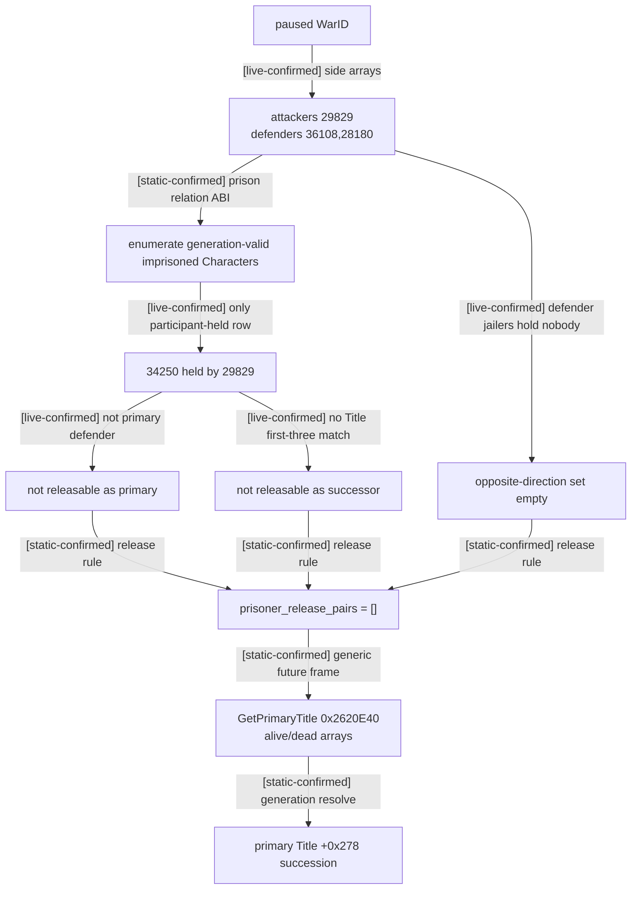

[counter-policy] 因而对当前玩家进攻方，white peace 在 titles/claims 与基线 gold 两域都严格优于
surrender：它保留/强化 claim 且不交基线赔款，而 surrender 移除 claim 并由 attacker 向 defender
赔款。这是结构性 dominance，不依赖尚未求值的 `F`；但它不能自动授权发送，因为
production 尚未同帧发布 final AI status，且人物/合约动态条款要进入完整效用。

#### 当前实例的 live decision matrix

下表只比较 paused rev4、WarID `16777290` 的当前候选；`phase-events-disabled` 战斗包络属于
`planner_usable=false` 的研究证据，不能把 continue 行提升成战争胜率。它的缺项也不改变已经由
`claim_cb` 规则闭合的 **white peace 在 claim 与基线 gold 两域结构性优于 surrender**：

| 候选 | 当前合法性 / 接受态 | 当前结构化结果 | 决策状态 |
|---|---|---|---|
| victory | [live-confirmed] validator=`false`，AI acceptance raw `-5800000/100000=-58`，auto=`false` | [static-confirmed] 若合法则把 conquest-claim 方向解析到 claimant | 当前不可选 |
| white peace | [live-confirmed] validator=`true`，AI acceptance raw `1100000/100000=+11`，auto=`false`；[inference] exact final path 预测 `would_accept_now=true` | [live-confirmed] Title `2388` 是 `strong_explicit`；[static-confirmed] holder 不变、保留该强 claim、无 attacker↔defender baseline gold | 结构性支配 surrender；v1 已 live-ready，仍须等 production same-frame final status、v2 与 campaign gate |
| surrender | [live-confirmed] validator=`true`，AI acceptance raw `86000000/100000=+860`，auto=`true` | [static-confirmed] 移除 Title `2388` 的 declared-target claim，并由 attacker 向 defender 支付动态赔款；[inference] 当前收入对应约 `206` gold | 可立即被接受，但结构性劣于 white peace；赔款 callback 实值未进 v2 wire |
| continue | [live-confirmed] 玩家战分 `+41`，全来自 battles | [inference] 已观察到 `2596↔2600` 推进/围城重置风险；两敌合流研究场景显著不利，且 phase-event / campaign transition 尚未闭合 | 不主动接战；不能把研究包络当真实战争胜率 |

claim-disposition v1 已在同一 paused revision 连续两次原子返回 WarID、CB、claimant、targets 与逐 title
四态，并完成临时 claim 结果析构；这项必要门已经满足。完整自动发送仍要经过 production
`would_accept_now`、动态条款、current finance、campaign forecast 与 postcondition 门。不能拿离线 phase
模型的缺项推翻静态条款比较，也不能拿静态条款比较绕过其余 live MCP。

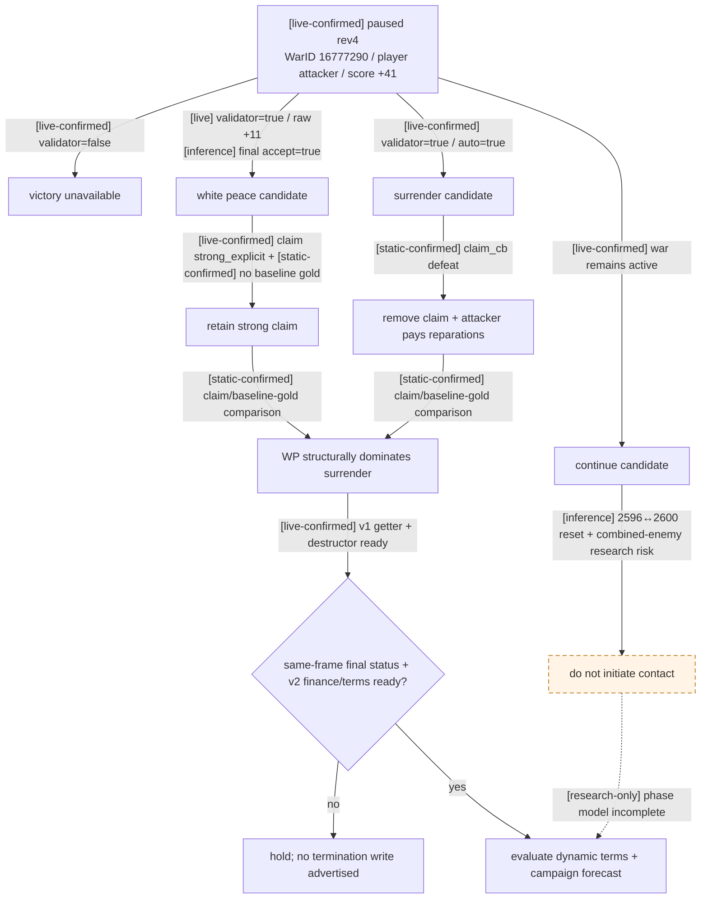

#### `claim_cb` 结构化 terms ABI

[static-confirmed] `0x28B1AA0` 的 caller 也固定了 claim 四态，而不是根据本地化文字猜测：

| `present` | `strong` | `implicit` | 结构化值 |
|---:|---:|---:|---|
| false | 任意 | 任意 | `present=false`；对有效 `claim_cb` 是需要保留的语义异常 |
| true | false | false | `weak / explicit` |
| true | true | false | `strong / explicit` |
| true | false | true | `weak / implicit` |
| true | true | true | `strong / implicit` |

[live-confirmed] 同一 paused date/WarID/claimant 下连续两次原生 query 均实际调用
`0x28B1AA0`，Title `2388` row 为 `present=true,strong=true,implicit=false`，即
`strong_explicit`；`present=true` temporary 随后按 provenance 所锁的 vptr slot 0、
`delete_flags=0` 生命周期析构。因此当前白和只保留已强 claim，不会再产生 weak→strong 变化；
attacker defeat 则会移除该 declared-target claim。

##### claim-disposition v1（不被动态条款 v2 阻塞）

[static-confirmed] v1 只包含 CWar declared targets/claimant、`0x28B1AA0` 四态与三 outcome
claim/title 方向。它不声称 gold/prestige/truce/PoW 已观测，但这些 v2 域不得阻塞 v1
只读 query 发布。冻结接口为 capability
`game.command.query-war-termination-terms-v1-N`、literal
`query-war-termination-terms-v1-<full-generation WarID>` 与 MCP
`ck3_query_war_termination_terms(war_id, expected_revision)`；只允许 paused、active-war、同一
native revision/snapshot/connection/episode。非 `claim_cb` 返回窄的 typed `unsupported` union，
不会用空 claimant/target 占位。当前场景的 strict available wire 形状如下，现已由同一帧的
live MCP getter + destructor acceptance 验证：

```json
{
  "schema_version": 1,
  "status": "available",
  "war_id": 16777290,
  "casus_belli": {
    "database_index": 11,
    "canonical_key": "claim_cb"
  },
  "supported_slice": "claim_cb_claim_disposition",
  "claimant_character_id": 29829,
  "target_title_ids": [2388],
  "claims": [
    {
      "title_id": 2388,
      "present": true,
      "strong": true,
      "implicit": false,
      "state": "strong_explicit"
    }
  ],
  "outcomes": {
    "attacker_victory": {
      "declared_title_disposition": "transfer_to_claimant_via_conquest_claim",
      "claim_disposition": "resolve_with_add_claim_on_loss"
    },
    "white_peace": {
      "declared_title_disposition": "unchanged",
      "claim_disposition": "retain_and_strengthen_weak"
    },
    "attacker_defeat": {
      "declared_title_disposition": "unchanged",
      "claim_disposition": "remove_declared_target_claims"
    }
  },
  "readiness": {
    "identity_ready": true,
    "targets_ready": true,
    "claim_rows_ready": true,
    "claim_disposition_ready": true,
    "ready": true
  },
  "provenance": {
    "game_version": "1.19.0.6",
    "executable_sha256": "2D00FF3101EF70B566F2FCBAE292F09263199C80E9DC8F139B82D7D96F83DB86",
    "native_reader": "CWar+0x270/+0x290;0x28B1AA0",
    "present_claim_lifecycle": "present_only_vtable_slot_0_delete_flags_0",
    "claim_script_sha256": "D9AA37BDC45F81B4F6185B2697A3EBD09404084EA0D3CF77BBE3C1D2C962E8B1"
  }
}
```

[fixture-confirmed] native fixture 对四个 target 调 getter 四次：三个 `present=true` temporary 均经
返回对象 vptr slot 0、`delete_flags=0` 析构；`present=false` 行不读取未初始化 vptr/strong/implicit，
也不析构。title mismatch 或 malformed bool 会使整个 slice unavailable，但已构造的 present
temporary 仍析构。Python normalizer 逐键拒绝宽/窄 schema 混用，并把 query cache 绑定到同一 paused
frame。

[live-confirmed] 验收使用 fresh DLL
SHA256 `AC8F716B186A1C91A079958A65E627F6B2913EDA68F5702BAC62593192CAA14A`，
CK3 PID `93724`。两次 query 分别得到 `query_sequence=1/2`，且均绑定
`snapshot_id=native:3`、`revision=4`、`native_revision=3`、`date_raw=53175816`、
`paused=true`、`map_ready=true`：War `16777290`、CB database index `11` / `claim_cb`、
claimant `29829`、target `[2388]`、claim `strong_explicit`，全部 readiness 为 true。
每次 query 的前/中/后 snapshot、revision、date 完全不变；provenance 明确记录 present-claim
析构生命周期。`action_steps` 中 surrender/WP/其它 termination write 均为空。同步复核 options：
surrender=`attacker_defeat` available/auto-accept，white peace available、acceptance `+11`、
victory=`attacker_victory` unavailable；本次验收未提交任何终战动作。

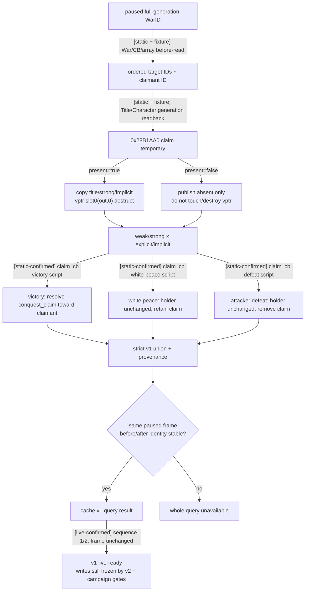

##### `claim_cb_exit_terms_v2`（当前退出决策的窄而完整契约）

[counter-policy] 当前 validator=false 的 victory 不应阻塞 WP / surrender 比较。v2 因而冻结为
`claim_cb` **当前 primary 退出效用**切片，只要求这两个合法候选的 claim disposition、primary
gold/prestige/piety/legitimacy、共同 truce 与 PoW，以及双方当前 primary finance 和每个候选的原生
`would_accept_now`；victory resolved title/vassal operations 留给后续 slice。
“窄”不等于 partial：下列 required path 任一不可读时，整个 `exit_terms_ready=false`，不得把 broad
v2 的若干静态方向或 raw tooltip 拼成 ready。

production v2 是 **strict available-only union**：任一 required domain 缺失时，native 不广告该 capability，
也不返回 `status=unavailable`、`null`、research substitute 或 partial payload。唯一可接受的顶层
`status` 是 `available`。canonical 完整 JSON golden 位于
`ck3_autonomous_player/tests/fixtures/war_termination_exit_terms_v2_synthetic.json`；该文件是独立 synthetic
fixture，只冻结 wire 形状，不冒充当前 WarID 的 live 数值。

canonical 实形如下：

| 层级 | exact keys / 基数 |
|---|---|
| top | `schema_version,status,war_id,date_raw,casus_belli,supported_slice,player_side,primary_attacker_character_id,primary_defender_character_id,claimant_character_id,target_title_ids,claims,primary_resource_balances,primary_monthly_gold_income,outcomes,readiness,provenance` |
| `primary_resource_balances.values` | 严格 12 rows：attacker 后 defender；每人依次 `gold,prestige,prestige_experience,piety,piety_experience,legitimacy`；row=`{character_id,resource_kind,raw,scale}` |
| `primary_monthly_gold_income.values` | 严格 2 rows：attacker 后 defender；row=`{character_id,raw,scale}` |
| `outcomes` | keys 严格为 `white_peace,attacker_defeat`；victory 不在当前 slice |
| 每个 outcome | `claim_disposition,recipient_response,cb_prestige_factor,primary_gold_transfers,primary_resource_deltas,truce,prisoner_releases,complete` |
| `recipient_response` | `native_validator_passed,acceptance_raw,acceptance_scale,decision_status_raw,would_accept_now,auto_accept`；available wire 要求 validator=true、status∈`{0,1,2}`，且 `would_accept_now == (status!=2)`；status `3` 整体不可发布 |
| `primary_resource_deltas.values` | 严格 10 rows：attacker 后 defender；每人依次 `prestige,prestige_experience,piety,piety_experience,legitimacy`，包括实际零值 |
| `truce` | `owner_character_id,toward_character_id,evaluated_days,current_date_raw,expiry_date_raw` |
| `prisoner_releases.values` | 逐 row `{jailer_character_id,prisoner_character_id,reason}`；真实空集合法但必须有 wrapper |
| `readiness` | 必须逐字等于 `same_frame_stable=true,claim_temporary_lifecycle_verified=true,white_peace_complete=true,attacker_defeat_complete=true,exit_terms_ready=true` |

cached `fame_level/devotion_level` 是有用的 RE 诊断，但不属于本轮 canonical v2 JSON。当前 live research
余额表也不直接嵌入 payload；production 必须通过上述 12+2 rows 在同一 paused frame 重新读取。

可用态的 `primary_resource_deltas` 必须发布逐格 `{character_id,resource_kind,raw,scale}`，包括实际
为零的格；不能用“row 不存在”暗示零。WP 的 player prestige 应由同一 preview 得到 `-5F`；surrender
必须得到 attacker 的 `max(-10F,-1000)`、defender 的 `min(scale_10_war_defender_win×F,1000)`，并显式
给出 piety/piety-experience/legitimacy 的命中或零值。gold row 必须是 payer/payee/final signed
Q100000，truce 必须同时含 `evaluated_days/current_date_raw/expiry_date_raw`，PoW 必须含逐
`jailer_character_id/prisoner_character_id/reason` row（当前值为真正的空数组）。

`primary_resource_balances` 与 `primary_monthly_gold_income` 也属于原子 readiness，而不是旁路 telemetry：
必须在同一 paused revision 对 primary attacker/defender 发布 12 个 balance rows 与 2 个 income rows。
上文 research values 只给实现验收用，不能替代这些 production arrays。每个候选还必须由
`0x2C43B40(...,answer_mode=1,...)` 填充扁平 `recipient_response.decision_status_raw` 与
`would_accept_now`；raw score 的本地推演不能替代这两个字段。

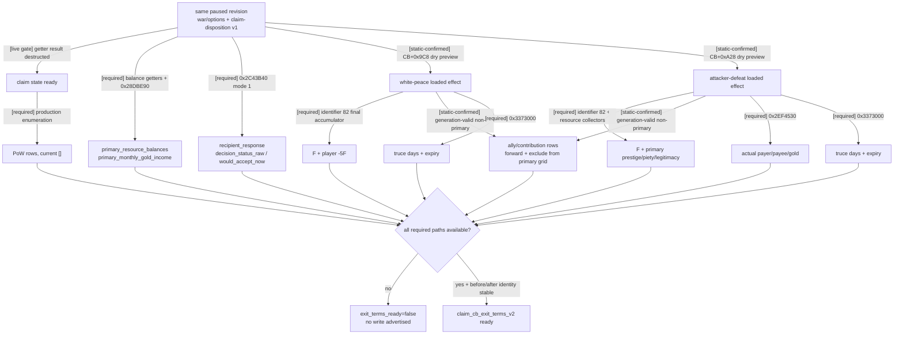

下列 JSON 是保留 victory 等未来域的 **broad diagnostic projection**，不是上方
`claim_cb_exit_terms_v2` 的原子 readiness contract；planner 只认上方窄契约。它不使用
`character_id:0` 占位；v1 已 live-read claimant，因此当前示例直接携带其 typed 值：

```json
{
  "schema_version": 2,
  "status": "partial",
  "cb_key": "claim_cb",
  "target_title_ids": {"status": "available", "value": [2388]},
  "claimant": {"status": "available", "character_id": 29829},
  "outcomes": {
   "white_peace": {
    "native_effect_description": {"status": "available", "value": "<raw localized markup>"},
    "titles": {"status": "partial", "holder_change": "none", "claim_disposition": "retain_and_strengthen_weak"},
    "gold_primary_transfer": {"status": "available", "value": "none"},
    "prestige": {
      "payer": "attacker",
      "resource_kind": "prestige",
      "multiplier": -5,
      "cb_prestige_factor": {
        "status": "unavailable",
        "reason": "final_row_reader_not_live_validated",
        "scale": 100000,
        "script_identifier_id": 82,
        "direct_declared_title_contribution_raw": 500000
      },
      "actual_delta": {"status": "unavailable"}
    },
    "piety": {"status": "available", "baseline_primary_deltas": {"attacker": 0, "defender": 0}},
    "legitimacy": {"status": "available", "baseline_primary_deltas": {"attacker": 0, "defender": 0}},
    "truce": {"owner": "attacker", "toward": "defender", "days": {"status": "unavailable"}},
    "prisoner_releases": {
      "status": "unavailable",
      "reason": "not_wired",
      "rule": "symmetric_primary_and_first_three_successors",
      "current_research_observation": {
        "status": "available",
        "value": [],
        "date_raw": 53175816,
        "method": "full_generation_storage_enumeration_twice"
      }
    }
   },
   "attacker_defeat": {
    "native_effect_description": {"status": "available", "value": "<raw localized markup>"},
    "titles": {"status": "partial", "holder_change": "none", "claim_removals": {"status": "unavailable", "target_title_ids": [2388]}},
    "gold_reparations": {
      "from": "attacker",
      "to": "defender",
      "gold_value": 3,
      "actual_amount": {
        "status": "unavailable",
        "reason": "production_paused_query_not_yet_live_validated",
        "scale": 100000,
        "evaluator_rva": "0x2EF4530"
      }
    },
    "prestige": {"status": "partial", "attacker_resource_kind": "prestige", "factor": {"status": "unavailable"}},
    "piety": {"status": "partial", "conditional": "mandala"},
    "legitimacy": {"status": "partial", "potential_gainer": "defender"},
    "truce": {"owner": "attacker", "toward": "defender", "days": {"status": "unavailable"}},
    "prisoner_releases": {
      "status": "unavailable",
      "reason": "not_wired",
      "rule": "symmetric_primary_and_first_three_successors",
      "current_research_observation": {
        "status": "available",
        "value": [],
        "date_raw": 53175816,
        "method": "full_generation_storage_enumeration_twice"
      }
    }
   },
   "attacker_victory": {
    "native_effect_description": {"status": "available", "value": "<raw localized markup>"},
    "gold_primary_transfer": {"status": "available", "value": "none"},
    "title_and_vassal_change": {
      "status": "partial",
      "type": "conquest_claim",
      "add_claim_on_loss": true,
      "declared_target_title_ids": [2388],
      "resolved_operations": {"status": "unavailable"}
    },
    "prestige": {"status": "partial", "attacker_resource_kind": "prestige_experience", "factor": {"status": "unavailable"}},
    "piety": {"status": "partial", "conditional": "mandala"},
    "legitimacy": {"status": "partial", "potential_gainer": "attacker"},
    "truce": {"owner": "attacker", "toward": "defender", "days": {"status": "unavailable"}},
    "prisoner_releases": {
      "status": "unavailable",
      "reason": "not_wired",
      "rule": "symmetric_primary_and_first_three_successors",
      "current_research_observation": {
        "status": "available",
        "value": [],
        "date_raw": 53175816,
        "method": "full_generation_storage_enumeration_twice"
      }
    }
   }
  },
  "unknown_fields": [
    "outcomes.white_peace.prestige.cb_prestige_factor",
    "outcomes.white_peace.prestige.actual_delta",
    "outcomes.attacker_defeat.gold_reparations.actual_amount",
    "outcomes.attacker_victory.title_and_vassal_change.resolved_operations",
    "outcomes.*.prisoner_releases"
  ]
}
```

若 claimant 或单个 title 解析失败，只标对应字段 `unavailable` 并列明原因；不得捏造 0、
删掉整份 terms，或让一个失败 target 隐藏其它合法 target。`native_effect_description` 与 structured
domains 必须并列；raw 文本成功不会自动使任一 structured field 变 `available`。

#### canonical v2 待 live 验收与后续 broad 读口

| 状态 / 域 | 下一项 exact 验收或施工口 |
|---|---|
| victory resolved title/vassal operations | 从 `0xF59323 → 0x27A2B20(CB+0x968)` 追 loaded-effect node callback，在 `setup_claim_cb` / `resolve_title_and_vassal_change` 的 preview traversal 捕获动态 target、holder、vassal、liege ID；只跑 tooltip/dry preview，不执行战争结算 |
| [pending-live] `cb_prestige_factor` 与逐人 primary resources | production 已用 `0x3380170` 栈上 root proxy 在同一次 traversal 捕获 identifier `82` 与 typed callbacks；下一步加载已构建 DLL，做两次 same-frame query、before/after identity 与 expected-grid 复核；不得用 direct `5.0` 或 `prestige/-5` 代替 total |
| [pending-live] defeat reparations | production 已接 `0x2EF1440 → 0x2EF4530 → 0x2EF1760..1797 collector` 的 payer/payee/final signed Q100000；下一步实机复核当前 actual amount。LAAMP matching contract 属后续 broad slice，不阻塞当前 primary claim_cb v2 |
| [pending-live] piety / legitimacy | WP/defeat production traversal 已捕获实际 typed primary grid并补显式零格；下一步实机确认当前 gate 命中或零值。Victory `CB+0x968` 属后续 broad slice |
| [pending-live] truce actual days / expiry | production 已由 `standard_truce_duration_days` evaluator 发布 owner/toward/evaluated days/current date/expiry；下一步同帧实机复核 |
| [pending-live] actual prisoner-release pairs | production 已接 participant/prison/succession resolver；下一步确认当前 wire 返回真实 `[]`。通用 resolver 已含 `GetPrimaryTitle` registration `0x504580`、thunk `0x2620E40`→core `0x25F3350`，alive `char+0x1B8→land+0x1E0`、dead `char+0x1C8→death+0x68` 与 Title `+0x278` succession array |
| [live-confirmed blocker; fix pending-live] primary current finance | diag4 已证明 attacker 的 `0x28DBE90=551588`、`ext+0x2B0=570772`，final2 的错误 equality gate 正是 `primary_resources` unavailable 根因。修复版必须仅发布 callable，并要求前后两次 callable、12 balances、Character generation 与 paused revision identity 全部稳定；随后重跑完整 12+2 rows。cached leaf 不属于 wire/readiness |
| [pending-live] final AI acceptance | production 已在每个 finalized outcome context teardown 前调 `0x2C43B40(context,1,0,null,null)` 并发布 raw status / `status!=2`；下一步实机确认 WP 与 attacker-defeat 两行，不能从 raw 或 validator 推导代替 |

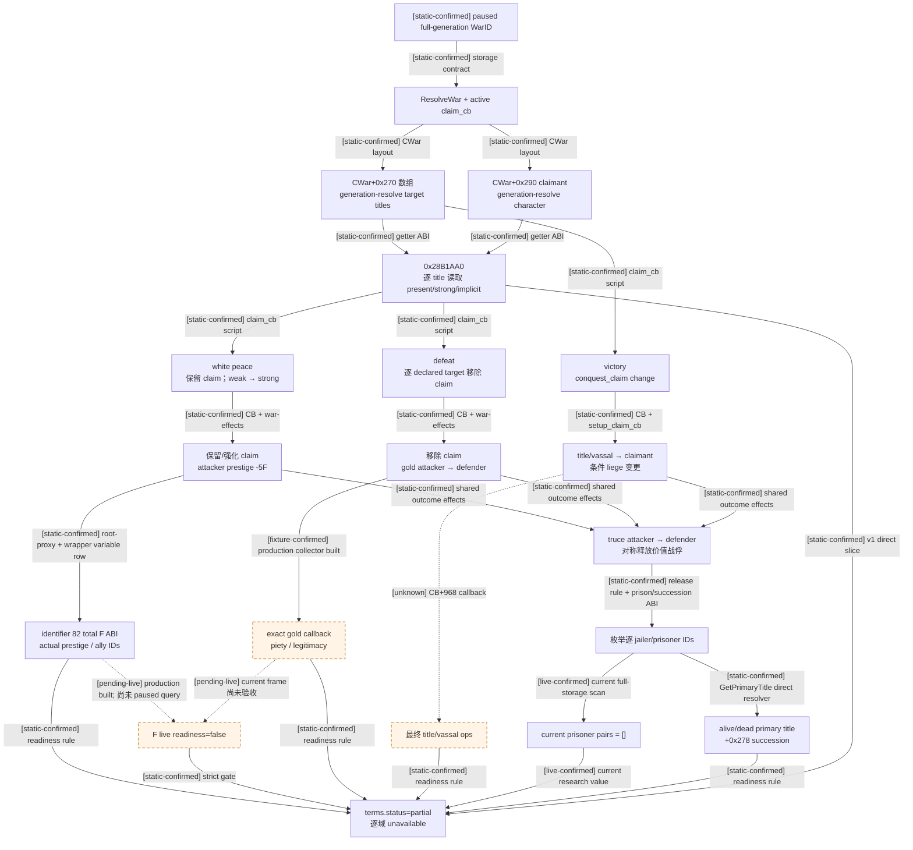

#### `offer-white-peace-<WarID>` native 已闭合、Python 冻结的发送 ABI

[production-live narrow / general surface still frozen] `game.command.offer-white-peace-N` /
`offer-white-peace-<full-generation WarID>` 的机械 context/validator/queue ABI 已闭合。下文 GEN-004 现只授权并已实机执行一条
primary-attacker `claim_cb` counter-policy；其它 CB、defender、hostage、surrender 与通用 v2 仍保持冻结，不能把这个窄 live 结果
扩写成完整 planner/MCP 动作授权。

exact contract：

1. suffix 只接受 canonical 十进制正 `int32` WarID；拒绝 0、负号、前导零、尾随字符与 index-only ID。
2. 仅 paused map；generation-safe `ResolveWar`，复核玩家仍是参战者且等于 `CWar+0x288` 或 `+0x28C` 的 primary leader，
   并解析另一侧 primary leader 为 recipient。
3. 重新读取 active CB，要求非空且 `CCasusBelliType+0x1718 & 0x80`；不能只信上一次 MCP cache。
4. 零初始化 `0x338` context storage，调用 `0x2225D40(context, index=3, actor CharacterID, recipient CharacterID)`；
   要求返回原 context 且 `context+0x330 != nullptr`，随后调用 `0x2C43F00(context,nullptr)`。
5. validator 通过后，以 `0x26B3220` 构造 `0x368` `CSendCharacterInteractionCommand`，验证 primary/secondary vtable，
   再调用 command manager queue，flags=`0x0E`，并严格采纳其 bool 返回值。
6. 无论成功失败，都按已构造边界析构 command 内嵌的 `command+0x20` context 与临时 context；只有 queue bool=true
   才返回 `submitted`，false 返回 `submission_failed`。
7. `auto_accept=false` 不禁止提交；它只表示对手仍需答复。ACK 绝不等于白和成立，只有命令后当前可用 paused observation 中该
   full-generation `WarID` 消失，并核对关键条款状态变化，才能标记战争结束。

建议 native 结果枚举至少区分：`unavailable`、`requires_paused`、`no_played_character`、`war_not_found`、
`player_not_participant`、`player_not_war_leader`、`casus_belli_unavailable`、`white_peace_not_allowed`、
`context_unavailable`、`validation_failed`、`submission_failed`、`submitted`。Python service 应要求同 paused revision 的
query cache 已证明 `white_peace.available=true`，但 native 写口仍须执行上述完整重建与复核；cache 是策略门，native revalidation
才是提交时的权威门。

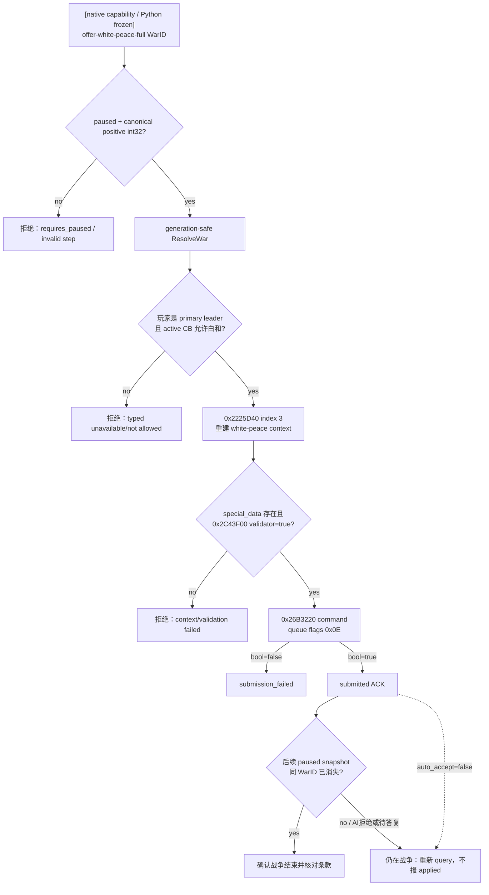

[static-confirmed] 对这个角色的直接结论是：原生游戏允许 primary attacker 在有效 CB 与通用 validator
通过时主动投降，且 AI primary defender 会 auto-accept；原生也允许在 CB 支持白和时提出白和，
其最终 AI 答复必须由 `0x2C43B40` 的 status 判定。当前 WarID 的三行已在修正 build、paused rev4 实机重查：
surrender(attacker_defeat) validator=true/auto=true，white peace validator=true/acceptance=+11/auto=false，
victory(attacker_victory) validator=false/auto=false。本次只读验收未提交任何结果；structured terms 未 live
前，white-peace/surrender 写 step 都不得广告给 planner。exact final path 对 WP 的当前 raw 预测
`would_accept_now=true`，但 production same-frame status 尚未发布。

exact-build 只读查询契约为：

```text
game.command.query-war-termination-options-N
```

对指定 full-generation `WarID` 原子返回三种 outcome 的 context 构造状态、当前合法性、原生 validator、AI acceptance raw、
`decision_status_raw` / `would_accept_now`、auto-accept、活动 CB、绝对/分项战分与战争日数。完整条款、冷却、
带人物交换变体和未闭合字段必须显式 unknown，
并触发后续 MCP RE；不能用空摘要替代。查询只能在 paused revision 上执行，投降/白和提交 capability 应与查询分离。
对应 step 为 `query-war-termination-options-<full-generation WarID>`；这里使用
`game.command.*` 命名只是为了进入当前 native driver 的 capability → action-step plumbing，它仍然必须是只读查询。
若以后新增独立 query plumbing，才可改用 `game.query.*`。

## 与我方策略的关系

原版事实只定义“CK3 AI 怎么做”，不定义我方应怎么做。更严格的止损树见
[player-war-exit-policy.md](player-war-exit-policy.md)。真正的战斗概率输入边界见
[combat-simulation-inputs.md](combat-simulation-inputs.md)；原生 AI 战力比和实际战斗模拟分别由对应专题维护。

## GEN-004 owner 允许的最窄 `claim_cb` 白和 counter-policy（2026-08-27）

> [counter-policy / production-live narrow] 本节只覆盖解除当前一代人 run blocker 的最小写策略。它建立在本文已经冻结的原生
> interaction/context、AI response 与 `claim_cb` outcome 树之后，但**不是原生 AI 等价实现，也不是完整 exit-policy v2**。
> 本节按日期取代上文“必须等待完整 dynamic v2/campaign forecast 才广告 white-peace literal”的旧施工冻结；原生事实、完整
> v2 schema 和质量债均不被删改。surrender 仍冻结。

### 新 options 观测契约

- 每个 termination option 现在都必须带 typed
  `recipient_response={status,decision_status_raw,would_accept_now}`。`status=available` 时 raw 必须是非 bool 的整数
  `0/1/2`，并保持 `would_accept_now == (decision_status_raw != 2)`；`status=unavailable` 时后两项必须为 `null`。
- exact-build reader 在每个 finalized option context teardown **之前**调用既有
  `ReadWarExitRecipientResponse`，其最终 evaluator 是
  `0x2C43B40(context,1,0,null,null)`。raw AI acceptance 与 auto-accept 仍作为诊断并列，但不得以
  `acceptance.raw > 0`、validator 或 auto-accept 推导 final response；fixture 已覆盖 acceptance 为正而 final status=`2`
  仍为拒绝。
- validator=false 或 evaluator status>=3 只令该 option 的 response 显式 unavailable；整份 termination-options query 仍然
  available，其他 option 也照常发布。Python 新 source 对缺字段或 malformed response 严格拒绝，因此必须与本次新 DLL 配套。

### 唯一允许的 planner/action 路径

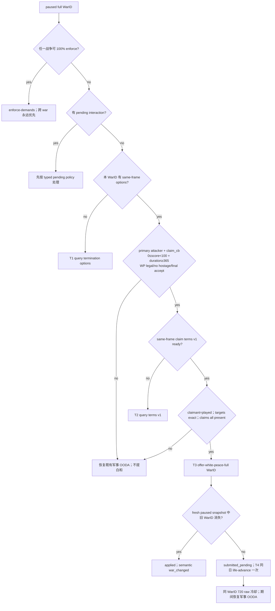

所有 gate 必须同时成立：paused；options 与 claim terms v1 绑定同 snapshot/revision/native revision/date、connection
generation、episode 和 full-generation WarID；玩家为 primary attacker；active CB identity 的 database index/key 自洽且 key
恰为 `claim_cb`；`0 <= player_relative_war_score < 100`；`war_duration_days >= 365`；CB 允许白和，white-peace context/
validator/available 为真；hostage variant=`none`；typed recipient response 明确 `would_accept_now=true`；v1
`available/ready`，claimant 等于 played CharacterID，target IDs 与战争全部 declared targets 完全一致，且每项 claim 都 present。
weak claim 合法：原版 `claim_cb` 白和会保留并强化 weak claim，强制“全部 strong”会把原生明确支持的有利止损错误排除。

active event 仍保持最先处理；其后 100% enforce-demands 是跨战争绝对高优先级，先于 auto-accept notification、pending
interaction、battle-control 和白和。即使 enforce literal 缺失，也只能报告该缺口，不能降级到后续动作。pending interaction
随后优先于白和。unknown/other CB、holy war、宗教输入、人质组合、玩家 defender/非 primary、负战分、满 100 战分、未满一年与
surrender 都不进入本切片。此处没有借圣战例外展开 faith/religion。

direct execute 不信 planner 的旧判断：必须 fresh 重验 raw capabilities、同一 options/terms cache binding、snapshot/episode/date/
WarID/CB/validator/final response/claims 与 720 raw history cooldown，再走已存在的 native queue。ACK 必须严格为 exact step、
`accepted=true`、`status=submitted`；随后读取命令后当前可用的 observation（不要求 snapshot/revision 必然推进），并只接受同
bridge PID、connection generation、episode、played CharacterID、paused 且 date 未变化的绑定。WarID 消失才返回 typed
`applied`；仍存在只返回 `submitted_pending` 和 after 的完整 war row。
ACK 自身永不等于战争结束。pending 的同日下一 turn 只推进一次让 AI 处理；history 持久化后在 restore 中仍以 24 raw/day、
30 日=`720` raw 抑制同 WarID 重复，`+719` 阻断、`+720` 才重开提议门。

### production normal-desktop 证据与 live 边界

- [production-live primitive] normal-desktop run `20260827T071014Z-one-generation-b49cef53` 在 source `51fe8cf`、角色
  `29829`、full WarID `16777290` 上按 T1 options → T2 same-frame claim terms v1 → T3 offer 执行。white peace 的 final
  response raw=`0`、`would_accept_now=true`；native queue 返回 submitted，typed action 只诚实报告
  `war_termination_result.status=submitted_pending`，因为命令后同 WarID 仍在。它随后推进 9 个游戏日，仍未把 ACK 冒充 applied。
  report 为 106,461 bytes、SHA-256
  `3A0C22A609CE237A5EC47702BF3B289836D13641943D1C7BDC838B12BEE1F5AC`。
- [production-live loop] 下一次冷恢复 run `20260827T071421Z-one-generation-5cf36539` 从 `date_raw=53178192`
  恢复；第一次 `life-advance` 到 `53178216` 时 old WarID 消失，随后原生 `disband-army-83886341` 成功，after snapshot 为
  `active_wars=[]、player_armies=[]`。原版 `_character_interactions.info` 的 `ai_min_reply_days=4 / ai_max_reply_days=9` 与
  exact manager 的逐日 age/queue 路径已经先冻结；本次第十个日推进应用结果与该异步窗口一致，因此无需改 submission ABI 或伪造
  response pump。report SHA-256
  `E7BC0CC716B945D07B5842EFDD7B74D008EBD89DE492250EB7F1818F7DC612BA`。
- [production-live durability] 修复 continuation 后，run `20260827T072606Z-one-generation-659914ab` 再次从战争仍在的
  `53178192` checkpoint 冷恢复：turn 1 观察 WarID 消失，turn 2 解散 ArmyID，turn 3 立即保存
  `phase=native_postwar_checkpoint`。该和平 checkpoint 为 67,214,440 bytes、date `53178216`、history `430`、SHA-256
  `A5649EE2FE93E459C22C2CE6E564AEA81DA14CB18470EA66EEC7F3C0AE249E3E`；随后 runner 继续和平期
  `NO_DECLARE`，最终仍可恢复。report SHA-256
  `C5E25F461827AB7266B59A8D3EE53A832918128EB4799625991839C6C6D08022`。
- [implementation-confirmed] 一次 pending offer 后必须同日推进一次；此后同 WarID 在 720 raw 冷却期间跳过重复 termination
  options/terms/offer query，恢复 ordinary military OODA。`+719` 不重提，`+720` 才重新获得查询/提议资格；WarID 先消失则直接
  进入 residual-army disband 与战后保存。
- 以上只把当前 `claim_cb` primary-attacker 的“观察 → 白和提交 → 异步应用 → 解散 → 保存/冷恢复”升级为
  production-live loop。完整 dynamic v2、其它 CB、投降、作为防守方、多战争/hostage、付款/声望/战俘实际 delta 与高质量 continue-vs-exit
  效用仍未完成。

完整 v2/campaign 替换口仍是：逐人 actual resources、truce、PoW/hostage、resolved title/vassal operations、finance、双方可动员
兵力与补员、encounter distribution、围城/增援 ETA、人格/文化/其它战争等原生输入，再比较 continue/white peace/surrender 的
风险调整效用。本最小包只提供 deterministic blocker removal；production outcome 必须回写本专题用于后续校准。

## 2026-08-28 primary-defender B1：context 极性先于 terms / forecast

- [production-blocker-live] run `20260828T053149Z-one-generation-9ace0939` 在 WarID `100663382`、
  `naval_expansion_cb`、玩家 `29829` 为 primary defender、day `0`、score `0` 的暂停帧完成两次 termination query；
  report SHA-256 `433A661EABBE554626A6936D0711012C711CFD87E36AC7E78BC882FB2B7D82C5`，blocker SHA-256
  `1C74C447EC1982BE80CD026EE3CAD62F92A3828C01C4B77720F9E5960BEEF24A`。
- [static-confirmed] 本文上面已经闭合 `0xC569F0` 的参数是 `player_victory`，不是 absolute attacker result；
  所以 surrender 必须恒传 `false`，victory 必须恒传 `true`，玩家 side 的反转由函数内部完成。
- [static-confirmed] source `88dba0a` 却按 side 传
  `surrender=!player_is_attacker`、`victory=player_is_attacker`。玩家为 defender 时，两行 context 因而互换。
- [production-blocker-live] 该帧 JSON `victory` 的 validator=true、raw=`-99`、auto=true、final accept=true，
  正是“defender 提交 player defeat / attacker victory，AI primary attacker auto-accept”的 fingerprint；JSON
  `surrender` 的 validator=false、raw=`-99`、auto=false则是 player victory / attacker defeat context。white peace
  使用独立 index `3`，不受该互换影响。
- [counter-policy input] 修正极性并增加 score-0 primary-defender golden 以前，这两行是 invalid machine input；
  不得先用 dynamic terms 或 campaign forecast 包装错误 label。普通新防守战的继续作战也不消费这些完整退出输入；
  集结、stance、共同 wargoal 与最小 continuation 树见
  [primary-defensive-war-response.md](primary-defensive-war-response.md)。

## 2026-08-31 `raiktor_claim_cb` 进攻方投降：原版树与 typed partial

### production-live 输入与 blocker

- [production-live loop] bounded continuation
  `C:\Users\xenoa\AppData\Local\Temp\xar-g2-post-call-ally-continuation-07acdfe-20260831T0425Z`
  从冻结 checkpoint 连续运行 25/25 turns：10 次 query、15 次 gameplay、14 次 visible、4 次 checkpoint、0 次 recovery，
  `first_blocker=null`；日期从 `53223120` 前进到 `53223936`，WarID `50331699` 的玩家战分由 `-48` 到 `-50`。
  最终 checkpoint SHA-256 为
  `60108A5DA03DC3A8315A3E79897D9CF2F49763910A8AA15A462E7DD0B6AAF164`，driver state SHA-256 为
  `4FB901C77AF6D95A05EAB2B0E900AE2E07A652B4C14729835DECB69FC8CFF57E`。
- [production-live primitive] 同一 paused 状态的 termination options 已确认玩家是 primary attacker，CB 为
  `raiktor_claim_cb`，战争 1281 日，surrender 的 validator / available / auto-accept / would-accept-now 均为真；旧 terms v1
  返回 `unsupported / cb_specific_terms_not_observable`。因此下一项不是重复跑局，而是给这个 exact CB 补原生只读条款。
- [harness RED, not gameplay RED] 开局前和中途 HKL 均为 `0x04090409`；CK3 已退出后的第三次 probe 因前台窗口已不存在而 RED。
  这是 post-cleanup timing，不是游戏过程中输入法回切，也不能覆盖上述 gameplay GREEN。

### exact-build 与原版终局树

本节冻结 CK3 `1.19.0.6 (Scribe)`、`ck3.exe`
`2D00FF3101EF70B566F2FCBAE292F09263199C80E9DC8F139B82D7D96F83DB86`。主要 source：

| source | SHA-256 | 作用 |
|---|---|---|
| `00_event_war.txt` | `BD202AE41EBA3A0E1E7E4277D09ED1E8D8C7E66B378308BB417D974331F9C707` | Raiktor CB 与 `on_defeat` |
| `00_claim.txt` | `D9AA37BDC45F81B4F6185B2697A3EBD09404084EA0D3CF77BBE3C1D2C962E8B1` | 普通 claim defeat 对照 |
| `00_war_effects.txt` | `A936E09F448EF715580A918165EAB89A9368AD2D3014E425C998CD9D4F0E8D7D` | 赔款、停战、战俘与内部政治 helper |
| `00_casus_belli_effects.txt` | `9F7C77CC9342B1197B1C802A2D465E56F7521458B103DEC84F5EB7222E45F18C` | claim setup / fame helper 输入 |
| `00_war.txt` | `5C99B8F14893929A9BC2DBB5B258CDD2D4233D5805091952209413DE876EE09F` | surrender 接受链与实际 PoW 释放 |
| `bookmark_events.txt` | `75CF485E379E522D4AAED9EF889FCC411A0D9DFCC28BCFB250ABDCC93A757EFF` | Raiktor war-bound 六支事件军队 |

[static-confirmed] `00_event_war.txt:2547-2620` 与普通 `claim_cb` defeat 主干相同：移除 claimant 对全部 declared targets
的 claims；条件性由 attacker 获得 claimant 的 favor hook；attacker 向 defender 支付 factor `3` 的短期赔款；
`setup_claim_cb` 后以 `-10 × cb_prestige_factor`（损失上限 1000）结算 attacker prestige；添加 attacker→defender 的
单向 defeat truce；处理 faction、Mandala 与 shared war-end 分支。Raiktor 唯一重要的资源差异是没有调用普通 claim defeat 的
legitimacy / influence helper，所以这两项是 source-authored 精确零，不是读取失败。CB 还明确 `allow_hostages=no`。

[static-confirmed] `show_pow_release_message_effect` 与 `laamp_as_mercenary_payout_tooltip_effect` 都只是 tooltip；真实战俘释放来自
surrender interaction 接受链，LAAMP 的实际结算也不能从 tooltip 推导。`bookmark_events.txt:1515-1627` 创建六支、每支 500 人的
war-bound 军队且没有 keep flag；初始总数 3000 只证明来源，决策必须读取当前仍存活/合并后的 ArmyID 与兵数，不能把 3000
写成当前损失。

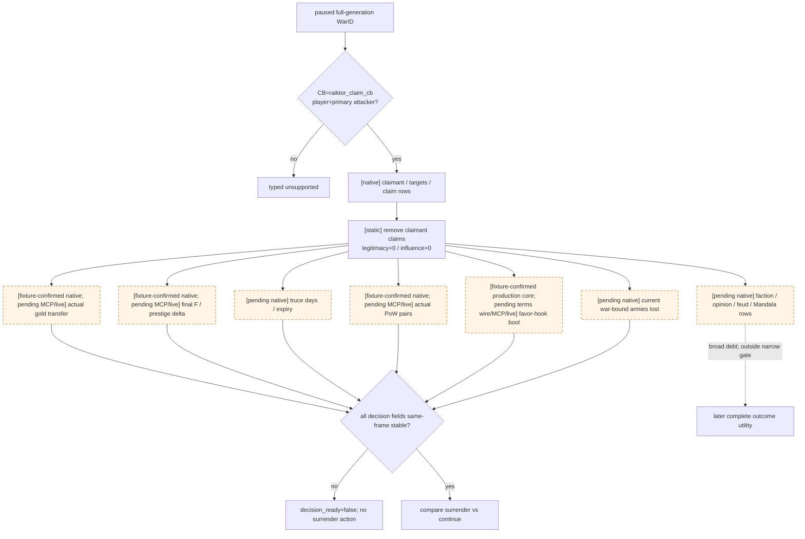

### 本轮 provider 原子与 readiness 边界

[fixture-confirmed / pending-live] `query-war-termination-terms-v1-<WarID>` 新增 distinct
`supported_slice=raiktor_claim_cb_attacker_defeat_disposition`。它复用 generation-safe `CWar+0x270/+0x290` 与
`0x28B1AA0` claim getter，发布真实 claimant、target order、逐 title claim 四态，并发布上述 exact source formula、
`legitimacy_delta=0`、`influence_delta=0`、`hostages_allowed=false`。普通 `claim_cb` 的原三结局 wire 与 readiness 未改。

该 slice 只把 `identity/targets/claim_rows/attacker_defeat_rule/static_formula` 标 true；actual gold、prestige/F、truce、PoW、hook、
faction/opinion/feud/Mandala、LAAMP actual settlement 与 war-bound army loss 全部逐名留在
`unobserved_dynamic_effects`。因此 `dynamic_deltas_ready=false`、`decision_ready=false`、
`automatic_surrender_ready=false`、总 `ready=false`。它把旧的泛化 `unsupported` 变成可施工的 typed partial，但不广告投降动作，
也不把 formula 冒充 actual terms。

fresh Release build 位于
`C:\Users\xenoa\AppData\Local\Temp\xar-g2-raiktor-partial-efb4130-20260831T1310Z`：source fingerprint
`D87C7FEB74BE74229C0F4FFE534CFC34916107DA084EA813CBE8CE95CBECFF14`，DLL SHA-256
`E02150A0A3929F3D11461B0DA87283FCEAE98C4574C8369246A5BF71FFE91B9D`，injector SHA-256
`541DBA10AC260462EFBD05CF2EF057BE7D9951ED0D407C57A85FB3A44D7D2C49`；MSVC dependency 模式为
`direct-2052-utf8`，公共 header 依赖门通过，fresh CTest `50/50` GREEN。Python dedicated contract 与 gameplay/native-driver
在 normal / `-O` 下分别 `6/6`、`418/418` GREEN。尚未启动第二局 CK3；下一次 loader 之后必须用上述冻结 checkpoint 做
same-frame MCP query，先验收 partial wire，再继续补 actual dynamic reader。

### 下一施工包：Raiktor 六域 dynamic terms static design

[static design / not implemented / not live] 本节冻结下一次施工边界，不把设计状态提升为 fixture 或 production readiness。目标是把
`raiktor_claim_cb` 的 attacker-defeat partial 扩成一个独立的
`supported_slice=raiktor_claim_cb_surrender_terms_v1`；普通
`supported_slice=claim_cb_claim_disposition` 的 schema、字段顺序、三结局语义和 readiness 必须保持不变。旧的 broad
`ReadWarTerminationExitTerms` 仍须在任何 preview 调用前返回
`loaded_effect_preview_disabled_after_live_crash_rva_0x334C668`，不得因 Raiktor 施工重新启用。

本窄 slice 的 decision terms 只包含已经由当前 G2 blocker 明确要求的六域；faction/opinion/house-feud/Mandala、LAAMP actual
settlement 等 broad side effects 继续逐名留在 `non_decision_broad_effects` / `unobserved_dynamic_effects`，不冒充已观测，也不进入本窄
`dynamic_terms_ready` 的合取。该边界取代上图中把 `R` 直接接入 decision gate 的旧施工草图；它不是宣称这些 broad effects 永远无价值，
而是把当前可解除的 Raiktor surrender blocker 与后续完整 outcome utility 分开。

| 六域 | exact-build 复用入口 | 本次输出与 fail-closed 条件 | 当前缺口 |
|---|---|---|---|
| gold | 原始 attacker-defeat root `CB+0xA28`、`0x3380170`、真实 preview collector、已有 gold-transfer vtable；current gold `extension+0x100` 与 monthly evaluator `0x28DBE90` | 唯一 `primary attacker → primary defender` final Q100000 row、双方 current gold 与 authoritative monthly income；缺失、重复、反向或负 amount 均 unavailable | **fixture-confirmed / static-ready**；待接 application-main mailbox、terms wire 与 paused live |
| F / prestige | root proxy 在 original attacker-defeat root 返回后、`0x3380170` 销毁临时 wrapper 前读取 `wrapper+0x18` 的唯一 identifier `82` final row；collector 同次捕获 prestige vptr `0x446C7B0` callback | 发布 `cb_prestige_factor`、attacker current prestige 与 attacker prestige delta，并验证 `max(-10F,-1000×100000)`；tag、重复、overflow、公式或同帧 identity 不符均 unavailable | **fixture-confirmed / static-ready**；待接 application-main mailbox、terms wire 与 paused live |
| truce | 已绑定 `EvaluateTruceDurationDays=0x3373000`，duration script value 位于 CAddTruce `+0x108` | 只解析 attacker→defender 的 CAddTruce pointer；同帧 evaluator 双读一致并检查非负天数；v1 明确不把天数换算为已持久化 expiry | **fixture-confirmed / static-ready**；待把独立 core 接入 production wrapper，并做一次 pointer-only paused shape probe；不得执行 ContextEffect |
| PoW | `ReadWarParticipantIds`、`ReadPrimaryAndSuccessors`、`AppendPrisonerReleases`；新生产 helper `ReadRaiktorSurrenderPrisonerReleases` | 双方完整 participant 列表、primary 与前三继承人候选列表，以及实际由对方参与者关押的 generation-safe release pairs；两次 paused 同日样本必须逐项相同。完整扫描后的空 pairs 是合法零 | **fixture-confirmed / static-ready**；待接 application-main mailbox、terms wire 与 paused live |
| favor hook | 原脚本的 `claimant != attacker && attacker.can_add_hook(favor_hook, claimant)` 及 `add_hook`；ordinary/no-toast vtable、preview callback 与 `favor_hook` runtime identity 已闭合 | claimant=attacker 时精确 false 且零 traversal；否则完整原始 root preview 中 exact attacker→claimant/favor row 为 true，完整 traversal 无 row 为 false；错 scope/type/重复均 unavailable | **fixture-confirmed / static-ready**；production WarID wrapper、root slot11 非空门、hook identity 与 paused 双采样均已闭合，待接 terms wire 与 paused live |
| war-bound army | 已冻结 generic `WarBoundRegimentObservation` / cleanup：full-generation persistent/current/CArmy IDs、exact bound WarID、keep=false、七 composition rows；current CArmyRegiment `+0x38` 是当前兵数 | 当前可发布**该 Raiktor War 中 generic war-bound** IDs、当前兵数总量及战后 exact generation `destroyed/still_alive`；不得把它们标成 `norman_highwaymen`，不得用 authored 3000 冒充 pre soldiers 或 loss | **fixture-confirmed / static-ready independent visible value**；source-specific attribution、pre soldiers、proven loss 与六域 `war_bound_armies_ready` 仍 false，需闭合持久 origin 或 action-bound pre-ID capture |

Gold/F/hook 的 preview 必须走独立的 Raiktor visible-root observer：它在真实 WarEffectContext 中遍历**原始** loaded root，所有 callback
继续 forward 给 stock collector；它绝不调用 `ResolveWarExitHiddenTrucePath`、`BuildWarExitHiddenTruceProjection` 或
production-disabled broad reader。gold 的 `DryPreviewRaiktorGoldVisibleRoot`、F/prestige 的 local-root-proxy observer 与 favor-hook 原子均已按此边界
fixture-confirmed。原始 WarOverview 路径会自然跳过 hidden truce，因此 truce 只用 pointer walker 加直接 evaluator。这个隔离是
两次真实 `0x334C668` crash 后的必要回归边界，不是理论性防御。

#### Raiktor attacker→defender truce pointer observer v1（2026-09-01）

[fixture-confirmed / static-ready] 独立 core `raiktor_surrender_truce_v1` 已把本窄读取与旧 exit-terms preview 完全分开。它只从同一 paused
frame 发布的**原始** `CB+0xA28` attacker-defeat root 开始，要求 loaded-root vtable 精确且 slot 11 非空，然后核对冻结形状：root
`capacity/count=19/14`、child 9 scripted effect、selector count 0、template default `6/5`、唯一 hidden child 位于 index 2、hidden
`1/1`、ContextEffect `1/1` 且 scope count 1，终点必须是唯一 vtable `0x4461CA8` 的 `CAddTruce`。整个过程只读指针和字段；不调用
`ResolveWarExitHiddenTrucePath`、`BuildWarExitHiddenTruceProjection`、`TraverseLoadedEffect`、任何 slot 58 或 ContextEffect。

[fixture-confirmed] core 在第一次 paused frame 后解析该 pointer，直接对 `CAddTruce+0x108` 调用 exact-build evaluator `0x3373000`
两次；只有两个非负 `int32` 结果相等、第二次 pointer shape 仍相同、随后重读的 snapshot/native revision、date、WarID、CB index/key、
attacker/defender/claimant 与三个 native pointer 全部逐项相同才 available。fixture 同时覆盖 root span、slot 11、重复 hidden path、
Context scope count、CAddTruce vtable、负天数、双求值漂移、paused/frame 漂移与 exact-build admission；Python pure contract 在普通和
`-O` 下拒绝多字段、错 War/CB/方向、不稳定状态及任何 invented expiry。

[static-confirmed] 原版 `raiktor_claim_cb.on_defeat` 对 `add_truce_attacker_defeat_effect` 只有一次调用；冻结的
`00_war_effects.txt` 中该 scripted effect 只有一条 `scope:attacker → scope:defender` 的 `add_truce_one_way`，days 为
`standard_truce_duration_days`、result 为 `defeat`。文件 SHA 与所有 RVA/shape 已写入
`native_bridge/research/fixtures/raiktor_surrender_truce_v1_source_contract.json`。

[boundary] v1 只发布 `evaluated_days`，`expiry_observable=false`、`expiry_date_raw=null`。虽然 execute 反汇编展示过日期加法，这个新
observer 尚未实机证明“当前求值日 + days”就是结束动作后持久化 truce 的最终可查询 expiry，因此不能从脚本基数或本地算式冒充
expiry。下一步只是在 production wrapper 构造现有 WarEffectContext 后调用此 core，并做一次 MCP-first、paused、pointer-only shape
probe；没有该 artifact 前状态仍是 static-ready，不是 production-live。

War-bound 军队不能用 ArmyID、owner 是战争参与者、军队名称或脚本初始 `6×500=3000` 猜。军队可合并且 public CArmy ID
可能消失，来源 regiment 仍存在；空结果也只有在完整 storage scan 成功后才是合法零。当前 snapshot 的 public ArmyID
`150995107 / 167772444` 因而不能被直接认作 Raiktor event army。

[fixture-confirmed / pending wire+live] PoW 域现有独立 production 只读 helper，而不是复活已禁用的 broad preview。它只接受
paused、exact `raiktor_claim_cb`、玩家为 `CWar+0x288` primary attacker 的 full-generation WarID；完整读取双方 participant
数组，再读取双方 primary title 的前三位继承人，按每个候选 `CCharacter+0x1A8 → extension+0x288 → prison relation+0x00`
取得 generation-safe jailer。只有 jailer 属于完整 opposite-participant 集合时才发布 pair。输出保留双方 participant/candidate
列表，因此 `release_pairs=[]` 只有在完整扫描成功后才表示真实零。War/CB/primary/claimant、participant、successor 与 jailer 图在同一
paused date 双采样一致才发布；fixture 已覆盖一条真实 pair、完整空集、succession malformed、jailer 跨样本漂移、running frame、
stale full WarID、非 Raiktor CB 与零 command submission。它尚未接 mailbox/JSON/MCP，也没有 paused CK3 artifact，故只关闭
PoW 原生 core/fixture 缺口，不把六域 `decision_terms_ready` 提前置真。

[fixture-confirmed / pending wire+live] actual-gold 域现有独立 production 只读 helper `ReadRaiktorSurrenderGold`。它只接受 paused、
exact `raiktor_claim_cb`、玩家为 primary attacker 的 full-generation WarID；读取双方 `extension+0x100` current gold，并且只把
`0x28DBE90` callable 当 authoritative monthly income，已知会滞后的 `extension+0x2B0` cache 不参与 readiness。每次采样构造并销毁
真实 WarEffectContext，遍历原始 `CB+0xA28` visible root，克隆 stock collector 后转发全部 callback，只接受唯一、非负、方向严格为
primary attacker→primary defender 的 final gold row。preview 前后 finance 与 War/CB/primary/claimant 必须一致；两次完整采样及第二次后的
final paused Snapshot/CB-key 也必须一致。fixture 覆盖 callable≠cache 仍发布 callable、missing/duplicate/reverse/negative/malformed row、
preview 中 finance mutation、第二次 preview 后 CB-key drift、null root slot、running frame、非 Raiktor CB、context/collector 成对 teardown、
零 hidden projection 与零 command submission。它尚未接 mailbox/JSON/MCP，也没有 paused CK3 artifact，故只关闭 gold 原生
core/fixture 缺口，不改变六域 readiness。

[fixture-confirmed / pending wire+live] F/prestige 域现有独立 production helper `ReadRaiktorSurrenderPrestige`。它只接受 paused、
exact `raiktor_claim_cb`、玩家为 primary attacker、identifier 指针当前值仍精确为 `82` 的 full-generation WarID；每次采样先读
attacker `extension+0x130` current prestige，再构造真实 WarEffectContext。`0x3380170` 接收仅替换 original-root slot11 的栈上 proxy；
trampoline 调回原始 `CB+0xA28` visible root，同一次 traversal 的 collector 仅替换 slot1 并把每条 callback 恰好 forward 一次。它只接受
唯一 primary-attacker prestige vptr `0x446C7B0` row（typed Character scope、second scope=null、tag=1、forwarded=null），并在原 root
返回后、临时 wrapper 尚存时读取唯一 `identifier=82,tag=1,subtag=0,flag=0` 的 final `F`。`F>=0`、`10F` 不溢出且 callback 必须等于
`max(-10F,-1000×100000)`；sample one 前冻结 original loaded-root vtable identity 与 slot11 callable，并在 sample two 前及 final publication
再次复核。preview 后 current prestige 与 War/CB/primary/claimant/identifier 必须不变，两次完整样本和 final paused Snapshot/CB-key/role
也必须一致。fixture 覆盖真实零、cap、row/factor 缺失或重复、scope/payload/vptr/forwarded/container 错形、负数、overflow、公式错误、
preview 内余额/CB/root 漂移、跨样本 terms/balance/identifier 漂移及“另一 root 返回同值”的 identity swap、running、stale WarID、错 role/CB、成对 teardown、
零 hidden projection/broad traversal/command。它尚未接 mailbox/JSON/MCP，也没有 paused CK3 artifact，故单域仍不改变六域 readiness。

[fixture-confirmed / pending wire+live] favor-hook 域现有独立 production helper
`ReadRaiktorSurrenderFavorHook`。它只接受 paused、exact `raiktor_claim_cb`、玩家为 primary attacker 的 full-generation
WarID，并在读取任何动态行前冻结 `CB+0xA28` original-root vtable 与非空 slot11。`claimant==attacker` 直接发布 authored exact
false，且不构造 WarEffectContext、collector 或 traversal；claimant 不同时才构造真实只读 context，遍历原始 visible root，完整转发
stock callback，并把零条 exact ordinary `favor_hook` row 解释为 false、唯一一条解释为 true。hook DB/fallback/type、War/CB/primary/
claimant/root 与 paused date 必须跨两次完整样本和 final Snapshot 一致。fixture 覆盖 true、完整空集、同 claimant 零遍历、missing/
duplicate/wrong scope/no-toast/type drift、null root slot、running、stale WarID、错 role/CB、跨样本 application/claimant/root/hook DB/CB
漂移、成对 teardown 以及零 hidden projection/broad traversal/command。它尚未接 terms JSON/MCP，也没有 paused CK3 artifact，故单域不改变
六域 readiness。

[fixture-confirmed / static-ready independent visible value] war-bound regiment 域现有独立投影 core
`BuildRaiktorWarBoundRegimentActiveObservationV1` 与 `ApplyRaiktorWarBoundRegimentCleanupObservationV1`。active 阶段只接受两份完全相同的
paused `raiktor_claim_cb` frame，以及既有 generic observer 的
`provenance=war_bound_not_event_specific`、primary-attacker owner、exact full WarID、非空 persistent rows。每个 persistent full-generation
ID 必须唯一、`bound_war_id` 相同、`keep=false`；七个 composition rows 的 present current CArmyRegiment/CArmy full IDs 必须成对，current
CArmyRegiment generation 必须全局唯一；多个 row 允许因军团合并而共享同一个 current CArmy generation。
production wrapper 后续须从每个已由 generic observer generation-resolve 的 exact current CArmyRegiment `+0x38` 读取一个非负兵数；投影要求
sample 对 present IDs 完整一一覆盖、无额外或重复 ID，并做逐 persistent 与全局 checked sum。该值是当前可见兵数，不是初始值。

[static-confirmed / boundary] `bookmark_events.txt` 的 `bookmark.1071` hard Raiktor option 确实创建 `raiktor_claim_cb`，并 authored 六个同形
`spawn_army`：每个 300 levies + 100 bowmen + 75 light horsemen + 25 armored horsemen，display name 为 `norman_highwaymen`，即 authored
候选 `6×500=3000`。但是已经冻结的 CK3 1.19.0.6 CRegiment/CArmyRegiment generic 对象没有已证明的 persisted display-name/event-source
字段。因此 `norman_highwaymen` 只能作为 source 文档候选，不能参与 runtime selector；`bound WarID`、`keep=false`、public ArmyID、匹配
3000 或 troop composition 都不能把 generic row 升格为 Raiktor-source row。source-specific attribution readiness 固定 false。

[fixture-confirmed] postwar 投影复用 `FrozenWarBoundRegimentCleanupObservation`，要求另两份相同 paused frame 明确 frozen WarID 已不在 active
wars，并逐项绑定 active 阶段冻结的 persistent/current/CArmy full IDs。它接受 exact generation `destroyed/still_alive`、
`frozen_army_destroyed/detached/still_attached`，拒绝 generation swap、row reorder、stale roster、aggregate status 与逐 ID 状态不符；只有所有
frozen persistent/current generations 都消失且无 stale attachment 才为 aggregate `destroyed`。WarID 消失本身仍不是销毁证据。

[boundary] 该 core 提供了真正独立可见的 current soldiers 与 postwar cleanup 价值，但没有 measured pre-spawn snapshot，故
`pre_soldiers_ready=false`、`proven_soldier_loss_ready=false`；authored 3000 不得填入这两个字段。因为 source attribution 也未闭合，
`raiktor_source_specific_domain_ready=false`，统一六域中的 `war_bound_armies_ready` 继续 false。全部 source/hash、generic storage/offset 与未来
reverse 入口冻结于 `native_bridge/research/fixtures/raiktor_war_bound_regiment_v1_source_contract.json`；尚无 public wire 或 production-live
artifact。

#### Raiktor 六域同帧聚合 core v1（2026-09-01）

[fixture-confirmed / static-ready aggregation] 独立 core
`BuildRaiktorSurrenderSixDomainObservationV1` 已把现有 leaf contract 组成一份 fail-closed 聚合，但没有改动 production reader、mailbox、
JSON/MCP 或 action executor。这里的“六域”固定指 **gold、prestige、PoW、favor hook、truce、generic war-bound current**；claims 是每次投降
都必须先成立的基础语义（target 顺序、claim rows、`remove_declared_target_claims`），不占六个 dynamic domain 的名额。因此完整合取实际是
`claims base + six dynamic domains`，不是漏算 claims，也不是把七项硬叫六项。

每个 present child 都携带同一 `RaiktorSurrenderSameFrameV1`：paused、snapshot revision、native revision、date、full-generation WarID、CB
index/key、primary attacker/defender 与 claimant 必须逐项相同。某个 child 缺失是合法的 `incomplete`，在 ordered `missing_domains` 中显式列出，
并令 `same_frame_stable=false`、`action_terms_ready=false`；某个 present child 跨帧或内部形状错误则整个 aggregate `unavailable`。fixture 的完整
happy path 可以把 aggregate-local `action_terms_ready=true`，但 `automatic_surrender_ready` 永远为 false：exact options、recipient validator 和
continue-vs-surrender policy 仍是更高层独立门，不能因 terms 聚合完成而自动提交投降。

truce child 只接受 pointer observer 已证明的非负 `evaluated_days`，并再次要求 `expiry_observable=false`；聚合层没有 expiry 字段，也不做日期
加法。war-bound child 只接受 `generic_war_bound_visible_source_unattributed`、完整 current-generation soldier sum 与既有 readiness false
边界；聚合输出固定 `source_specific_war_bound_ready=false`、`pre_soldiers_ready=false`、`proven_soldier_loss_ready=false`。因此 aggregate-local
`generic_war_bound_current_ready=true` 只表示该独立可见值可用于条款决策，不会把它改名成 `norman_highwaymen`，也不改变当前 production wire
仍为 false 的 `war_bound_armies_ready`。

postwar cleanup 可以随后附着在同一份冻结 regiment IDs 上，但它使用 war 已消失后的独立 paused postwar frame；它不参与、也不冒充战前
same-frame 合取。只有逐 persistent/current generation 的 `destroyed/still_alive` 与 aggregate status 一致才令
`postwar_cleanup_ready=true`，即使如此 source attribution、pre soldiers 和 proven loss 仍全假。source/hashes、域计数、同帧与 readiness 边界
冻结于 `native_bridge/research/fixtures/raiktor_surrender_six_domain_v1_source_contract.json`。当前状态是 static/fixture-ready aggregation，
不是 public-wire、production-live 或 surrender OODA complete。

native helper 边界如下；其中 PoW、gold、F/prestige、favor hook 与 war-bound regiment 已有独立 core，列表不表示统一 wire 已实现：

```text
HasRaiktorSurrenderDynamicBindings
ReadRaiktorSurrenderDynamicTerms
DryPreviewRaiktorAttackerDefeatVisibleRoot
CaptureRaiktorSurrenderPreviewRow
MaterializeRaiktorGoldAndFame
ReadRaiktorSurrenderGold
ReadRaiktorSurrenderPrestige
ReadRaiktorSurrenderFavorHook
ProbeRaiktorDefeatShape
ResolveRaiktorDefeatTruceNode
ReadFavorHookPresence
ReadRaiktorSurrenderPrisonerReleases
ReadPrimaryAttackerWarBoundRegimentObservation
ReadFrozenWarBoundRegimentCleanupObservation
BuildRaiktorWarBoundRegimentActiveObservationV1
ApplyRaiktorWarBoundRegimentCleanupObservationV1
BuildRaiktorSurrenderSixDomainObservationV1
```

`HasWarTerminationTermsBindings` 不得被新增 Raiktor ABI 扩大，否则一个 hook/army reverse gap 会令普通 `claim_cb` 回归为 unavailable。
只有 exact CB key=`raiktor_claim_cb`、玩家是 primary attacker 时才调用六域 reader。完成前后必须重读 paused snapshot、War pointer/ID、
CB pointer/index/key、primary IDs/pointers、claimant、target order、claim rows、finance、PoW 与 regiment rows，任何 generation/date/identity
漂移都令输出 unavailable。

Raiktor readiness 固定为：

```text
dynamic_terms_ready =
  identity_ready && targets_ready && claim_rows_ready && static_formula_ready &&
  finance_ready && gold_ready && fame_factor_ready &&
  attacker_prestige_delta_ready && truce_ready &&
  prisoner_release_ready && favor_hook_ready &&
  war_bound_armies_ready && same_frame_stable

decision_terms_ready = dynamic_terms_ready
ready = decision_terms_ready
```

Native terms 不得单独发布 `automatic_surrender_ready=true`。自动动作还必须由 Python 在同一 paused frame 合取 options 的 exact CB/WarID、
player primary-attacker、surrender context/validator/available、`hostage_variant=none`、typed final recipient response，以及独立的
continue-vs-surrender policy。terms readiness 只证明“条款可用于决策”，不等于“应当投降”。

### Raiktor 六域 fixture 与一次启动实机矩阵

[partially fixture-confirmed / remaining pending] 离线 fixture 必须最终锁定：普通 `claim_cb` 既有 normalized JSON 与 reader 调用路径不变；Raiktor happy
path；六域逐项缺失/重复/错 scope/错 generation；F tag/公式/overflow；truce shape/vtable/双读/expiry；PoW succession/jailer；hook
false/true/type/scope；war-origin/keep/bound-WarID/regiment backlink/merge/full-scan；collector/context ctor/dtor 成对；零 game-object write。
另加 source contract，证明 Raiktor production path 不引用 hidden-truce projection，且 production-disabled broad reader 仍在 preview 前退出。
其中 actual gold、F/prestige、favor-hook、truce、generic active/postwar war-bound regiment current-soldiers/cleanup 与 PoW native core 已各自
fixture-confirmed，并已有独立 six-domain same-frame aggregation fixture；war-bound 的 `norman_highwaymen` source、pre soldiers/loss 仍未闭合。
聚合 core 尚未接统一 production terms reader/wire；Python policy/postcondition 与一次启动 live matrix 继续 pending。

实机只跑一次批量矩阵，复用 CharacterID `29829` / WarID `50331699` 的冻结 checkpoint，MCP-first、英文 HKL、不用 OCR：

1. 同一次启动查询 options 与新 terms 两遍，绑定相同 PID、snapshot/revision/native revision、date、connection、episode 与 full WarID；
   两份 terms payload 必须一致。
2. 任一六域未 ready 时，`action_steps` 不得出现 `surrender-war-50331699`；保存 pre-surrender checkpoint 与原始 MCP artifact。
3. 策略门另行满足后才提交 typed surrender；ACK 只记 `submitted_pending`，优先在同一 paused `date_raw` 等待 command 应用。
4. WarID 消失后逐项核对冻结预测：gold/prestige delta、declared claims 移除、attacker→defender truce days/expiry、PoW pairs 释放、
   favor hook 存在性、全部冻结 generic war-bound full-generation RegimentID 的 cleanup 状态；在 source attribution 未闭合前不得称其为
   `norman_highwaymen`，普通或非 war-bound 军队不得被误算。
5. 如果只能跨日才观察 applied，日收入与 truce 起算日可能污染精确 delta；此时记 capability RED 并补 action-boundary observer，不能只用
   WarID 消失冒充六域 postcondition GREEN。保存 postwar checkpoint 后才继续 G2 turns。

### 2026-09-01：四域并入正式 terms wire（实机待验）

[static/fixture-ready / pending paused MCP live] `ReadWarTerminationTerms` 的既有 Raiktor 分支现已直接聚合
`ReadRaiktorSurrenderGold`、`ReadRaiktorSurrenderPrestige`、
`ReadRaiktorSurrenderPrisonerReleases` 与 `ReadRaiktorSurrenderFavorHook`。没有另开 capability 或 mailbox：正式路径仍是
`query-war-termination-terms-v1-<full WarID>` → application-main → adapter → driver/service →
`ck3_query_war_termination_terms`。为保持现有调用方兼容，本轮没有提前改成设计稿中的新 slice 名，仍使用
`supported_slice=raiktor_claim_cb_attacker_defeat_disposition`；严格 schema 通过逐域
`*_observable`、nullable actual rows、逐域 readiness 和 `unobserved_dynamic_effects` 表达增量观测。

每个可用子域都必须与外层 terms 的 paused `date_raw`、full WarID、CB index/key、primary attacker/defender 与 claimant 相同，且其内部双采样
`same_frame_stable=true`；聚合完成后再重读 paused snapshot、published war row、CWar pointer、CB pointer/index/key、primary IDs、claimant 与
target-title 顺序。子域自身返回 typed unavailable 时，该域保持 `observable=false`、actual 值为 `null`，且名称继续留在
`unobserved_dynamic_effects`；帧、War、CB 或角色身份级失败则拒绝整个 terms 结果。成功发布的域才从未观测列表中移除。

当前 component readiness 可以分别把 `finance/gold`、`fame_factor/attacker_prestige_delta`、`prisoner_release` 与 `favor_hook` 置真；
`truce_ready=false` 和 `war_bound_armies_ready=false` 仍为硬缺口，所以
`dynamic_deltas_ready/decision_ready/automatic_surrender_ready/ready` 继续全部为 false，surrender literal 仍不得广告或提交。普通
`claim_cb_claim_disposition` 的 JSON 与 readiness 未改变；旧 broad exit reader 仍在 preview 前禁用。

离线证据：最终 fresh Release 位于 `Z:\xar-g2-gen034-fourdomain-20260901-02`，source fingerprint
`53BAC343A1A1428A7FC56EE00FBDC7610BDB3F45D96BB4ED0E056138E8F8B76A`，DLL SHA-256
`B018FB8C55E99E915E728166BBF1934518095CF4E4981114970FC0CEE69026F0`，injector SHA-256
`8F4E9C6E36BA50B976909E3AC54B3B6A655F39EBED81F42993E517F0E40BF65D`；fresh CTest `63/63` GREEN 且
`ck3_11906.hpp` dependency gate 通过。native fixture 除普通 claim golden 外，分别从 public terms query 覆盖 favor/PoW、gold/PoW/favor 与
F/prestige/PoW/favor 聚合；Python strict contract 覆盖四域同时可用、公式/身份/方向/重复/错误 readiness，并与 driver/service/MCP 回归合计
normal / `-O` 各 `426/426` GREEN。上述均不等于 CK3 live；下一项仍是复用 WarID `50331699` 冻结 checkpoint，在一次英文 HKL
启动中做两次同暂停帧 MCP 查询并保存原始 payload，随后才可把四域 wire 提升为 production-live primitive。

### 2026-09-01：Raiktor 四域 paused MCP 双样本 GREEN

[production-live read-only primitive / full surrender decision still blocked] 冻结
CharacterID `29829` / WarID `50331699` / `date_raw=53223936` checkpoint 已用 fresh
`Z:\xar-g2-gen034-fourdomain-20260901-02` DLL 做一次正式、非 debug、冷恢复实机验收。正式 GREEN report 为
`C:\Users\xenoa\AppData\Local\Temp\xar-g2-gen034-fourdomain-live-20260831T1932Z\report.json`，
`121254615` bytes，SHA-256
`1187D0BD129DA9188B7EBC0C389B035B5C4B1383CE1FF4895481678BCB4371E5`；compact evidence index 位于同目录
`evidence-index.json`，`4742` bytes，SHA-256
`D1AF7A3C7F06FE8BFBF7F028C8B294B64381F276DBA612FAE07216EF615DE292`。输入 checkpoint / driver-state 的 SHA-256
仍分别为 `60108A5D...AAF164 / 4FB901C7...CFF57E`，验收前后逐字节不变；CK3 PID `51268` cleanup 与 process-tree
回收均 GREEN。

本轮只通过官方 MCP server 调用 `ck3_get_capabilities`、`ck3_take_snapshot` 和两次
`ck3_query_war_termination_terms`，没有 OCR、视觉输入、时间推进、投降或任何 mutation command。两次查询绑定同一
`snapshot_id=native:3 / revision=4 / native_revision=3 / date_raw=53223936 / episode=native-29829-809d91e48a8d`，
`query_sequence=1→2`，去除序号后的完整 normalized payload 逐项相同。War/CB/roles 为 full WarID `50331699`、
CB index `27` / key `raiktor_claim_cb`、player primary attacker `29829`、primary defender `36769`、claimant
`16826697`、target title `[1207]`。两样本都实测：

- gold transfer 为 attacker `29829` → defender `36769`，`27300000 / 100000`；双方余额和 authoritative monthly income
  同时发布；
- `F=10000000 / 100000`，attacker prestige delta 为封顶后的 `-100000000 / 100000`；
- participant 与 primary+前三继承人扫描完整，当前 `release_pairs=[]` 是合法实测零；
- claimant 与 attacker 不同，原始 visible root 确实 traversal，conditional ordinary favor hook `will_apply=true`。

四域的 `observable`、component readiness 与 `same_frame_stable` 全真，故这四个 production core 与统一 public terms wire 可提升为
**production-live read-only primitive**。但 `truce_ready=false`、`war_bound_armies_ready=false` 仍然明确保留，进而
`dynamic_deltas_ready / decision_ready / automatic_surrender_ready / ready` 全假；本轮没有、后续也不得据此开放
`surrender-war-50331699`。这不是六域完成，也不是 surrender OODA complete。

英文输入法使用独立 PID-scoped watcher 留证：
`C:\Users\xenoa\AppData\Local\Temp\xar-g2-gen034-fourdomain-live-20260831T1932Z-hkl\hkl\ck3-hkl-summary.json`，
SHA-256 `2EDA954ED88EB2FE6116A0B138BCE0F8FE47C23EC04833A54EF4C1716831638C`。它对 PID `51268` 的 `79` 次窗口轮询
始终读到 US English `0x04090409`，layout action `0`、unresolved error `0`；进程退出时一次 Toolhelp access-denied race 已在下一轮以
PID absent 闭合，不影响 HKL 或 cleanup 结论。

#### 本轮 harness RED 与 MCP binding 教训

三个失败 attempt 都原样保留，不能删除或倒写为 gameplay RED：

1. `...T1919Z/report.json` 在 CK3 启动前因误用缺 `win32api` 的全局 Python 失败；正式实机 runner 必须固定使用
   `Z:\ck3_mod_rewrite\tools\.venv\Scripts\python.exe`。
2. `...T1922Z/report.json` 已冷恢复到正确 paused frame，但 runner 错把 `action_steps` 期望为 capability 的 `-N` 模板；正式
   `bridge_capabilities` 使用 `game.command.query-war-termination-terms-v1-N`，而 paused `action_steps` 必须是具体 full WarID 字面量
   `query-war-termination-terms-v1-50331699`。
3. `...T1926Z/report.json` 的真实双样本与四域已全部成功，但 runner 臆造了不存在的
   `binding.expected_revision`，因而自判 RED。正式 MCP result 的 frame receipt 是顶层
   `queried_snapshot_id / queried_revision / queried_native_revision`；`expected_revision` 只是请求参数，不会作为嵌套 `binding`
   回显。验收必须把这三个 `queried_*` 字段与调用前 paused snapshot 对齐，不能另造返回 schema。

最小修复后的可复用入口为
`ck3_autonomous_player/native_bridge/research/run_war_termination_terms_live_acceptance.py`。它保留所有失败/成功 state 与 raw MCP payload，
并将允许的 gameplay command 固定为同一 WarID 的两次只读 terms query。以后同类 MCP live runner 应先从现有 service/result contract
读取真实 receipt 字段；不得把其他 query 的历史字段形状复制过来后再靠重启 CK3 发现错误。
