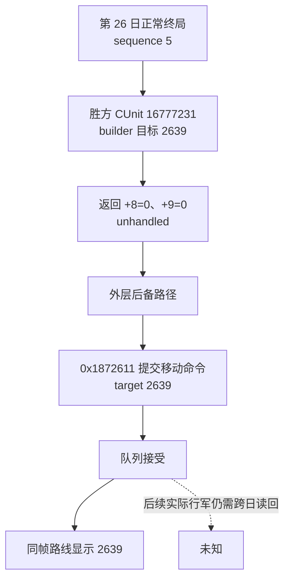

# 1.19.0.6 胜方 AI 终局重入：builder 未处理后的外层后备提交

本页记录原版 CK3 **1.19.0.6** 的一次只读、受管实机回放。EXE SHA-256：
`2D00FF3101EF70B566F2FCBAE292F09263199C80E9DC8F139B82D7D96F83DB86`；
默认关闭、显式开启的私有观察器来自 commit `4d2524005c4a56238f43ea5fb3ac3289c1047398`，
冻结 DLL SHA-256：`E8FB321D985880EC3079E2BBC9406663457C2F790445751CEDDDE522F0412ED6`。
本次原版 live run ID 为 `desktop-3fevhd2-1c74096080--vanilla--R0064`，
外置 attempt `072`；`065` 的旧 RED 回执未改写。

## 已观察到的原生路径

同一源档从暂停战斗逐日推进到第 26 日。第 25 日胜方 AI CUnit `16777231`
仍在 CombatID `16777218` 中，私有移动目标已经是省份 `2639`，路线为空。
第 26 日原生终局 journal 记录 `normal_result`、sequence `5`；该 CUnit
离开战斗，没有撤退，公开及私有路线均为 `[2639]`，原战斗严格查找失败。
同帧私有观察器记录如下：

| 观察点 | 原始值 | 证据含义 |
| --- | --- | --- |
| builder 调用 | 1 次，CUnit `16777231`，目标 `2639`，返回位置 `0x1872362` | 原版外层调度器确实调用了 `0x186B190`。 |
| builder 返回结构 | `+8=0`、`+9=0`，`outcome=1` | 观察器按固定分类表判为 **unhandled**；外层的 `+8==0` 后备路径可继续执行。 |
| builder 内主提交 | 0 次 | 没有经过该 builder 内 `0x186B2C5` 的 `0x973E00` 提交点。 |
| 外层后备提交 | 1 次，返回位置 `0x1872616`，`submit_site=2` | 原版外层 `0x1872611` 确实调用了 `0x973E00`，不是仅初始化栈内命令对象。 |
| 后备命令 | CUnit `16777231`，target `2639`，`command_kind=2`，`channel_flags=7`，`route_kind=2`，`direct_target=1`，`queue_accepted=true` | 队列接受了针对该 CUnit、该目标的命令。 |
| 终局关联 | `terminal_before_submit=true`，`terminal_sequence=5`，`cunit_was_terminal_winner=true` | 提交发生在本场正常终局事件之后、同一原生日期，属于该胜方 CUnit。 |
| 采集健康 | `failure_flags=0`，`overflow_count=0`；gate 前后原值均为 `0` 且读取有效 | 没有观察器失败；gate byte 只是 builder 前后采样，不能冒充 `0x186B278` 瞬时读取值。 |



这补上了 [065 静态门闩分析](winner-ai-builder-submit-gate.md) 留下的关键分叉：
`065` 仅知道 builder 有一次匹配调用、builder 内提交为零；不能判定早退、
门闩绕过或外层后备提交。`072` 的新增 `+8/+9` 与外层提交位点回读，把**本次**
闭合为“builder 未处理 → 外层后备提交 → 队列接受”。共享 gate byte 的语义名称和
写入来源仍未知；前后采样值为零不证明每条相关指令的瞬时值，也不应把该路径
泛化成所有胜方终局。第 25 日目标 `2639` 已存在，故不能仅凭第 26 日路线
`[2639]` 证明新命令；本案的新命令证据来自独立的后备 `submit_site=2` 回读。
队列接受也不证明之后已经实际移动，下一日路线/位置仍须另行观察。
072 的交互响应止于第 26 日，之后直接 `999-finish`。其 `last_save.ck3` 与
`autosave.ck3` 具有相同 SHA-256
`5AFD62F0FB7EB677DF5174A641EEF650CD16FC64F75AD61334B5E564F80F69D6`，
文件写入时间为 `2026-09-26 23:49:59 UTC`，早于第 26 日 `life-advance`
请求文件的 `23:50:07 UTC`；因此它们**不是终局后 checkpoint**。原生
raw-binary 存档内部的游戏日期尚未解析，不从文件时间推造具体游戏日期。
外置 `existing-save-inventory.json` 与 `existing-save-timeline.json` 保留
文件身份、请求时间与原始响应 SHA。后续单独按
[`winner-ai-postsubmit-074` 采样方案](research-plans/winner-ai-postsubmit-074/plan.json)
重放并读取下一原生游戏日，不把它称为 072 的连续现场。

## 可复核证据

外置目录：
`D:/workspace/ck3_native_war_ai_promo_work/episode01-winner-ai-reentry-v2-attempt-072/`。
`evidence-index.json` 保存主要文件的绝对路径、字节数与 SHA-256；原始每日请求、
响应、暂停快照、终局查询和私有观察器回读均保留在该 attempt 中。

| 文件 | SHA-256 |
| --- | --- |
| `ck3-output/interactive-requests-responses/26-ai-reentry.json` | `D738BBF6B366EAF8E4743A0FD274CF55657C37A59427BB2F744CFBC3F4C6F96F` |
| `ck3-output/session-result.json` | `3A252D6061D105ECCBBCCB971353C657682ECDAC0EFA12F2D0E64968597A19C3` |
| `ck3-output/capture-report.json` | `BF520BD94869331159A19E0EC7DC0FD024692C49000C40DCBBFF0173C626F606` |
| `audit-result.json` | `0EB8E00DF41BE162BC49048E55BAAC41FBA054D9E8DA9DA3C42F3C44533DC9A2` |

`audit-result.json` 为 GREEN，26/26 项通过：逐日日期、同帧 revision、原始响应
SHA、私有 schema/计数与分类、终局身份和路线、后备提交位点、重复终局查询、
受管清场均核对。`session-result.json` 和 `cleanup-check.json` 证明 capture exit 0、
CK3 job/系统清单归零；任务总线 CK3 资源已释放。新的 Steam 原图由窗口可逆移动
和边缘像素变化证明新鲜，肉眼读到“离线模式”，截图的绝对路径、bytes、SHA
与 `capture_session` 回执精确匹配。此前 `069` 的 task-bus 编码错误和 `071`
的 `MoveWindow` 返回值误判都在 CK3 启动前终止，保留为各自 prelaunch RED，
没有混入 `072` 的 live 证据。

供智能体状态机消费的精简冻结向量见
[`research/winner-ai-terminal-reentry-072.json`](research/winner-ai-terminal-reentry-072.json)。
它明确把该事件分类为一次已观察到的后备队列接受，并把“后续实际行军”和
“可泛化的 AI 派令规则”留为未证；不能将单次样本硬编码成通用策略。只读
[`project_winner_ai_terminal_reentry_072.py`](../../tools/project_winner_ai_terminal_reentry_072.py)
对原始响应、终局、EXE/DLL 冻结值、audit 与受管清场逐项核对后输出投影：

```text
<verified-python> tools/project_winner_ai_terminal_reentry_072.py --attempt D:/workspace/ck3_native_war_ai_promo_work/episode01-winner-ai-reentry-v2-attempt-072
```

该命令不启动游戏、不改写 attempt。原有更完整的 `audit.py` 保留在外置 attempt
根目录，其输出 `audit-result.json` SHA 已列于上表。

独立的 [074 次日回放](winner-ai-postsubmit-next-day-live-074.md) 已在相同终局身份与
后备入队结果下读取第 27 日：位置仍为 `2633`，路线及目标仍为 `2639`，实际
command apply 和行军执行仍未由现有字段证明。
