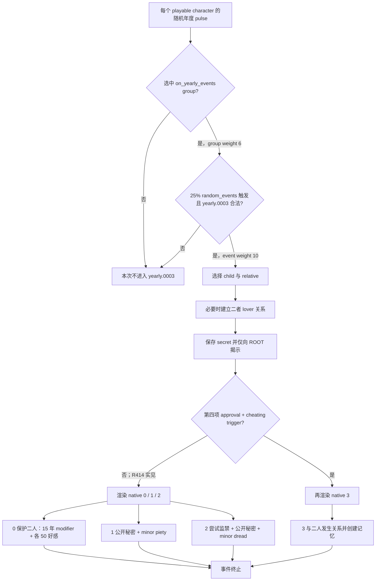

# CK3 1.19.0.6 `yearly.0003` 禁忌之爱决策树

## 状态与边界

- [static-confirmed] 只绑定 CK3 `1.19.0.6`、`ck3.exe` SHA-256
  `2D00FF3101EF70B566F2FCBAE292F09263199C80E9DC8F139B82D7D96F83DB86`。
- [paused live RED] R414 在 PID `202268`、connection generation `1` 的真实暂停帧命中
  `yearly.0003` instance `1064`。当前桥读取到 `child`、`relative`、`secret` 三个 saved scope，
  原生 authored option 共四项；第四项因 trigger 未通过而未渲染，native `0/1/2` 均 shown/enabled。
- [counter-policy static-ready, live action pending] 产品恢复路线固定 authored `1` / native `0`。
  R414 当前 RED 是 harness 缺少事件合同，并未证明天朝二期产品失败；在同一 PID 完成选择与 instance
  advance 前，本专题不能标成 production-live primitive。

## 原版入口与选择树

`random_yearly_playable_pulse` 由代码对每个 playable character 每年随机时点调用一次。它以 group weight
`6` 选择 `on_yearly_events`；该组先过 `chance_to_happen = 25`，再在合法候选中给 `yearly.0003`
weight `10`。候选概率受当帧合法 group 和 event 集影响，不能把这些权重直接换算成固定年概率。

四个 option 在 exact source 中均没有显式 `ai_chance`，因此当前证据不能声称原生 AI 有一套隐藏的
效用排序。事件权重对 human ROOT 额外 `add = 5`，这只改变候选权重，不决定进入事件后的选项。

## 产品恢复策略

R414 的目标是恢复天朝二期 stage 9–11 有界验收，而不是围绕家族秘密重塑 campaign。native `0` 不公开
秘密、不尝试监禁、不进入第四项的关系与性行为；直接效果是两名当事人对 ROOT 各加 50 好感，并给 child
十五年保护 modifier，relative 在 ROOT 为其 liege 时同样取得 modifier。唯一声明的 ROOT 代价是 zealous
或 vengeful 的 minor stress。

因此合同要求：

- ROOT 是当前玩家；`child` 与 `relative` 是彼此不同、且都不是玩家的 character；`secret` 类型为
  `secret`，不要求当前 bridge 尚未发布的 secret identity；
- snapshot authored option count 必须为 `4`；rendered native indices 必须精确为 `(0, 1, 2)`，三项均
  shown/enabled；
- 只提交 authored `1` / native `0`，并继续以旧 instance 消失或前进作为动作后置，ACK 本身不算完成。

若第四项以后在另一帧显示，当前三项合同会因投影不符而 fail closed；必须先按该真实帧补 option variant，
不能把 R414 的隐藏状态外推为所有 campaign 状态。

## 证据

- 原版定义：`Crusader Kings III/game/events/yearly_events/yearly_events.txt:766-1103`，SHA-256
  `FBBD29C7C9ECDCB84342EF4F00E92358412781B27E0686DCC220592996FEF0E5`。
- 原版调用池：`Crusader Kings III/game/common/on_action/yearly_on_actions.txt:2522-2563,2933-2941`，
  SHA-256 `0FC85A284224A68D1CA0A4EF071D4F4A4F49896753AEC463975A12EE4E1116FA`。
- R414 保留 RED：
  `_runtime/p1-post-chaos-terminal-r414-20260911/live-artifacts/terminal-stages-red.json`，SHA-256
  `7C41E07DA8BD1ACA6F3DB14EF208E35030A63EEAD99D86B7179638FB1A328279`。
- 可移植合同、analysis 与 observation：
  `ck3_autonomous_player/src/xar_autoplayer/vanilla_events/records_yearly.py`。

